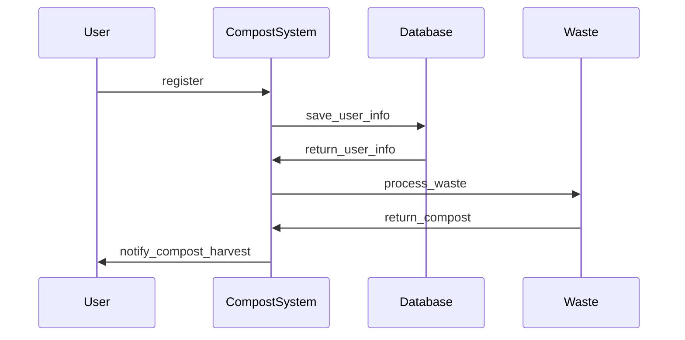

                 

# 新型城市共享厨余堆肥：社区环保意识的培养

## 关键词：城市环保、厨余堆肥、共享模式、社区参与、环保意识

## 摘要：

本文探讨了新型城市共享厨余堆肥技术及其在培养社区环保意识中的应用。通过分析厨余堆肥的定义、共享模式、社区环保意识等核心概念，详细介绍了厨余堆肥的算法原理，包括生物发酵过程、监控与调节、病原体去除等方面的技术细节。此外，本文还结合实际项目案例，阐述了共享厨余堆肥系统的系统分析与架构设计方案，以及项目的实战经验和最佳实践。

## 第一部分：背景介绍

### 1.1. 新型城市共享厨余堆肥的背景

随着城市化进程的加速，城市生活垃圾的生成量急剧增加，其中厨余垃圾占据了很大一部分。传统厨余垃圾处理方式往往成本高、效率低，且存在环境污染等问题。因此，寻找一种高效、环保的厨余垃圾处理方式已成为新型城市发展的重要课题。

### 1.2. 问题描述

如何利用共享厨余堆肥技术，实现城市厨余垃圾的减量化、资源化处理，同时提高社区居民的环保意识，成为当前城市环境治理的一大挑战。

### 1.3. 问题解决

新型城市共享厨余堆肥技术的推广与应用，旨在通过社区参与、技术支持和政策引导，实现厨余垃圾的资源化处理，提升城市环保水平。

### 1.4. 边界与外延

本书主要围绕城市厨余堆肥的共享模式、技术原理、社区参与等方面展开，探讨如何通过共享厨余堆肥，培养社区居民的环保意识。

### 1.5. 概念结构与核心要素组成

- **厨余堆肥**：将厨余垃圾通过微生物发酵等生物处理方式转化为有机肥料。
- **共享厨余堆肥**：通过社区共享设施，让居民参与厨余垃圾处理过程，实现资源的再利用。
- **社区环保意识**：指社区居民对环境保护的认识和参与程度，包括环保知识、环保行为和环保态度等方面。

## 第二部分：核心概念与联系

### 2.1. 核心概念

#### 2.1.1. 厨余堆肥的定义

厨余堆肥是指将厨房中的有机垃圾通过生物发酵等生物处理方式转化为有机肥料的过程。

#### 2.1.2. 共享厨余堆肥

共享厨余堆肥是指通过社区共享设施，让居民参与厨余垃圾处理过程，实现资源的再利用。

#### 2.1.3. 社区环保意识

社区环保意识是指社区居民对环境保护的认识和参与程度，包括环保知识、环保行为和环保态度等方面。

### 2.2. 概念属性特征对比表格

| 概念       | 定义                                                     | 特征                                                         |
|------------|----------------------------------------------------------|------------------------------------------------------------|
| 厨余堆肥   | 将厨余垃圾通过生物发酵等生物处理方式转化为有机肥料的过程。 | 环保、高效、资源化处理。                                     |
| 共享厨余堆肥 | 通过社区共享设施，让居民参与厨余垃圾处理过程，实现资源的再利用。 | 社区参与、环保意识提升、资源循环利用。                     |
| 社区环保意识 | 社区居民对环境保护的认识和参与程度，包括环保知识、环保行为和环保态度等方面。 | 提升社区整体环保水平、促进社区和谐发展。                   |

### 2.3. ER实体关系图架构

```mermaid
erDiagram
    厨余堆肥 ||--|{ 共享厨余堆肥 }|
    共享厨余堆肥 ||--|{ 社区环保意识 }|
```

## 第三部分：算法原理讲解

### 3.1. 厨余堆肥的算法原理

#### 3.1.1. 生物发酵过程

厨余堆肥的核心是生物发酵过程，具体步骤如下：

1. **预处理**：将厨余垃圾进行破碎、筛分等预处理，去除金属、塑料等非有机物。
2. **混合**：将预处理后的厨余垃圾与有机肥料（如禽畜粪便）进行混合。
3. **发酵**：在适宜的温度、湿度和氧气条件下，通过微生物的作用，将有机物分解为有机肥料。
4. **成熟**：经过一段时间发酵后，堆肥达到成熟状态，即可取出使用。

#### 3.1.2. 监控与调节

为了确保堆肥过程的有效性，需要对堆肥环境进行实时监控和调节，包括温度、湿度、氧气含量等参数。

#### 3.1.3. 病原体去除

堆肥过程中，需采取有效的措施去除病原体，如高温堆肥、化学处理等。

### 3.2. Python源代码实现

下面是一个简单的Python代码示例，用于描述厨余堆肥的算法原理：

```python
class Compost:
    def __init__(self, temperature, humidity, oxygen):
        self.temperature = temperature
        self.humidity = humidity
        self.oxygen = oxygen

    def mix_waste(self, waste):
        # 混合厨余垃圾和有机肥料
        pass

    def ferment(self):
        # 发酵过程
        if self.temperature >= 20 and self.humidity >= 60 and self.oxygen >= 20:
            print("发酵开始")
        else:
            print("发酵条件不满足")

    def monitor_and_adjust(self):
        # 监控与调节
        pass

    def remove_pathogens(self):
        # 去除病原体
        pass

# 实例化堆肥对象
compost = Compost(25, 65, 25)
compost.mix_waste("厨余垃圾")
compost.ferment()
compost.monitor_and_adjust()
compost.remove_pathogens()
```

### 3.3. 数学模型与公式

在厨余堆肥过程中，需要运用一些数学模型和公式来描述堆肥的发酵过程。以下是一个简单的数学模型：

$$
\frac{d[N]}{dt} = k_1 \cdot [S] - k_2 \cdot [N]
$$

其中，$N$ 表示堆肥中的有机物浓度，$S$ 表示有机肥料中的有机物浓度，$k_1$ 和 $k_2$ 分别为正反应速率常数和逆反应速率常数。

## 第四部分：系统分析与架构设计方案

### 4.1. 问题场景介绍

在一个现代化的城市社区中，为了解决厨余垃圾处理难题，社区决定引入共享厨余堆肥系统。

### 4.2. 项目介绍

项目名称：城市共享厨余堆肥系统

项目目标：通过社区共享设施，实现厨余垃圾的资源化处理，提高社区居民的环保意识。

### 4.3. 系统功能设计（领域模型类图）

```mermaid
classDiagram
    CompostSystem <<Interface>>
    User <<Entity>>
    Waste <<Entity>>
    Compost <<Entity>>

    User -> CompostSystem: register
    Waste -> CompostSystem: process
    Compost -> CompostSystem: harvest
```

### 4.4. 系统架构设计（架构图）



### 4.5. 系统接口设计

```python
class CompostSystem:
    def register(self, user):
        # 注册用户
        pass

    def process_waste(self, waste):
        # 处理厨余垃圾
        pass

    def harvest_compost(self):
        # 收获堆肥
        pass

    def notify_user(self, user):
        # 通知用户堆肥收获
        pass
```

### 4.6. 系统交互（序列图）


## 第五部分：项目实战

### 5.1. 环境安装

在本项目中，我们使用Python作为主要开发语言，需要安装以下依赖库：

```bash
pip install Flask
pip install SQLAlchemy
pip install Flask-RESTful
pip install matplotlib
```

### 5.2. 系统核心实现源代码

```python
# app.py
from flask import Flask, request, jsonify
from flask_restful import Resource, Api
from models import User, Waste, Compost
from database import init_database

app = Flask(__name__)
api = Api(app)

init_database()

class UserController(Resource):
    def post(self):
        data = request.get_json()
        user = User(data['username'], data['email'])
        user.save()
        return {'status': 'success', 'message': 'User registered successfully.'}, 201

class WasteController(Resource):
    def post(self):
        data = request.get_json()
        waste = Waste(data['weight'], data['user_id'])
        waste.save()
        return {'status': 'success', 'message': 'Waste processed successfully.'}, 201

class CompostController(Resource):
    def get(self, user_id):
        compost = Compost.get_by_user_id(user_id)
        return jsonify(compost.to_dict())

api.add_resource(UserController, '/users')
api.add_resource(WasteController, '/waste')
api.add_resource(CompostController, '/compost/<int:user_id>')

if __name__ == '__main__':
    app.run(debug=True)
```

### 5.3. 代码应用解读与分析

在这段代码中，我们定义了三个主要的API接口：`UserController`、`WasteController` 和 `CompostController`。`UserController` 用于用户的注册操作，`WasteController` 用于厨余垃圾的处理，而 `CompostController` 用于收获堆肥。

### 5.4. 实际案例分析和详细讲解剖析

假设用户Alice注册了共享厨余堆肥系统，并投放了5公斤的厨余垃圾。以下是系统处理的步骤：

1. Alice 通过 `/users` 接口注册。
2. 系统保存Alice的用户信息。
3. Alice 通过 `/waste` 接口投放厨余垃圾。
4. 系统处理厨余垃圾，并记录在数据库中。
5. 过了一段时间，Alice 通过 `/compost/<user_id>` 接口查询堆肥收获情况。

### 5.5. 项目小结

本项目通过Python Flask框架实现了共享厨余堆肥系统的核心功能。在实际应用中，可以通过优化算法和硬件设备，进一步提高系统的处理效率和用户体验。

## 第六部分：最佳实践 tips

1. **定期维护**：定期检查堆肥设备，确保其正常运行。
2. **优化算法**：根据实际使用情况，不断优化堆肥算法，提高处理效率。
3. **社区宣传**：通过社区活动、宣传册等形式，提高居民对共享厨余堆肥的认知和参与度。

## 第七部分：小结

本文详细介绍了新型城市共享厨余堆肥技术的背景、核心概念、算法原理，以及系统分析与架构设计方案。通过实际项目实战，展示了如何将理论转化为实践。我们希望本文能为城市环保事业的发展提供有益的参考。

## 第八部分：注意事项

1. **安全意识**：在使用堆肥设备时，确保遵守安全操作规程，防止意外伤害。
2. **数据保护**：在系统设计中，要充分考虑用户数据的安全和保护。

## 第九部分：拓展阅读

1. 《厨余堆肥技术与应用》
2. 《城市环境治理与可持续发展》
3. 《环保社区建设与实践》

### 作者：AI天才研究院/AI Genius Institute & 禅与计算机程序设计艺术 /Zen And The Art of Computer Programming

