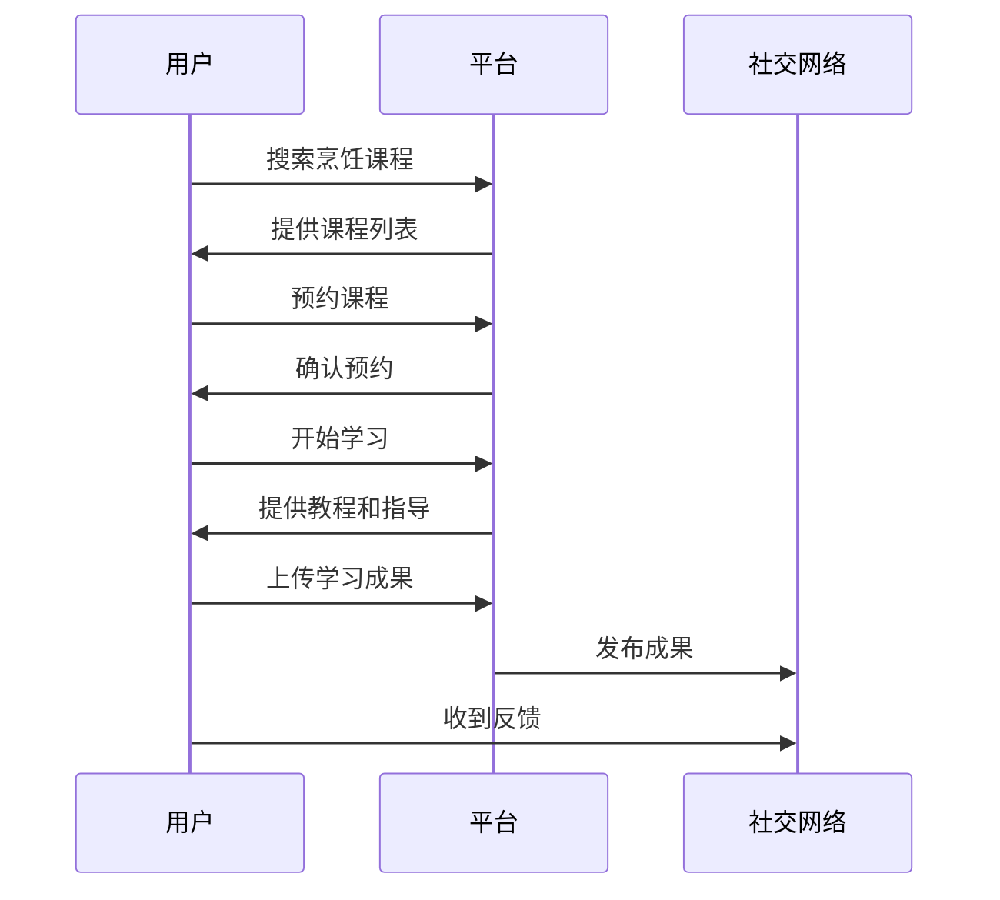
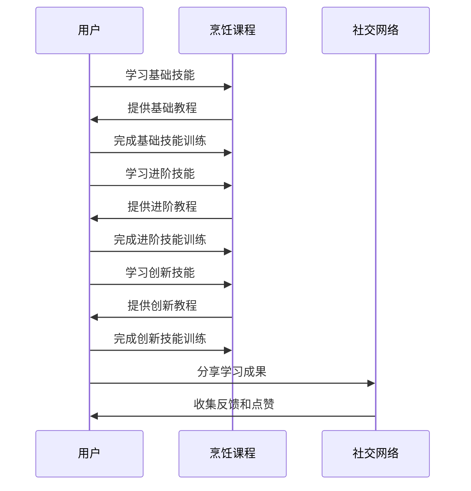

                 


### 第一部分: 问题背景与核心概念

## 第1章: 问题背景与核心概念

### 1.1.1 新型城市背景

新型城市，作为一个现代化、多元化的城市形态，其特征在于高人口密度、信息化、以及高度依赖服务业。在这样的城市中，居民的生活节奏加快，对便捷、高效的生活方式有着更高的追求。与此同时，社交需求也在不断变化，从传统的面对面交流转向数字化、虚拟化的社交模式。

**1.1.1.1 城市化进程中的挑战**

城市化进程中，人口的增长带来了诸多挑战，如交通拥堵、资源紧张、环境污染等。为了应对这些挑战，城市管理者需要探索新型的城市生活方式，提高资源利用效率，减少环境污染，提升居民的生活质量。

**1.1.1.2 社交需求的变迁**

随着互联网技术的发展，社交方式发生了巨大的变化。从传统的线下聚会到社交媒体平台，人们更倾向于通过网络平台来维持和拓展社交关系。这种社交需求的变迁，为城市共享经济的兴起提供了土壤。

**1.1.1.3 烹饪在新型城市中的角色**

在新型城市中，烹饪不仅仅是满足基本的生活需求，更成为一种社交和文化的载体。共享厨艺课作为一种新型社交方式，将烹饪技能的传授与社交网络结合起来，为居民提供了丰富的生活体验和交流平台。

### 1.1.2 核心概念介绍

**1.1.2.1 共享厨艺课的定义**

共享厨艺课是一种基于互联网平台的新型社交活动，参与者可以通过平台预约课程，学习烹饪技能。这种课程不仅传授烹饪技巧，还通过社交互动，让参与者建立联系，分享生活经验。

**1.1.2.2 社交网络的作用**

社交网络是共享厨艺课的重要支撑，它为参与者提供了一个互动和分享的平台。通过社交网络，用户可以发布烹饪心得、分享美食照片，与其他用户交流互动，形成良好的社交氛围。

**1.1.2.3 烹饪技能与社交网络的结合**

烹饪技能与社交网络的结合，不仅提高了烹饪技能的传授效率，也丰富了社交活动的形式。通过社交媒体平台，用户可以实时分享自己的烹饪成果，获得他人的点赞和评论，增强社交参与感和成就感。

### 1.1.3 边界与外延

**1.1.3.1 烹饪技能的层次**

烹饪技能可以分为基础技能、进阶技能和创新技能。基础技能包括切割、烹饪方法等基本操作；进阶技能则涉及食材搭配、调味技巧等；创新技能则是在传统烹饪基础上进行的创新。

**1.1.3.2 社交网络的分类**

社交网络可以分为传统的社交平台如微信、微博，以及专业的烹饪社交平台如下厨房等。不同类型的社交平台在共享厨艺课中的作用和特点也有所不同。

**1.1.3.3 结合方式的多样性**

烹饪技能与社交网络的结合方式多种多样，包括线上课程、美食分享会、烹饪挑战等。这些方式可以根据不同的需求和场景进行选择，以最大化满足用户的社交和烹饪需求。

---

**总结：**新型城市背景下，社交需求的变迁和烹饪在新型城市中的角色，使得共享厨艺课成为一种有前景的社交方式。通过烹饪技能与社交网络的结合，不仅提高了烹饪技能的传授效率，也丰富了社交活动的形式。在接下来的章节中，我们将深入探讨烹饪技能的原理和共享厨艺课的具体实现，进一步分析这一新型社交方式的前景和挑战。

---

### 第二部分: 核心概念与联系

## 第2章: 核心概念与联系

在上一部分中，我们探讨了新型城市背景下的社交需求和烹饪在其中的角色。在这一部分，我们将深入分析共享厨艺课的核心概念，并探讨这些概念之间的联系和相互作用。

### 2.1.1 核心概念原理

为了更好地理解共享厨艺课，我们需要明确几个核心概念：烹饪技能、社交网络和它们的结合。

**2.1.1.1 烹饪技能的属性特征**

烹饪技能是一种综合能力，它包括基础技能、进阶技能和创新技能。基础技能是烹饪的基础，如切割、烹饪方法等；进阶技能则涉及食材搭配、调味技巧等；创新技能则是在传统烹饪基础上进行的创新，如使用新食材或新烹饪方法。

**2.1.1.2 社交网络的属性特征**

社交网络是一种基于互联网的平台，它连接着大量的用户，并提供交流、分享和互动的功能。社交网络的属性特征包括：广泛的用户基础、丰富的互动形式、便捷的信息传播等。

**2.1.1.3 烹饪技能与社交网络结合的属性特征**

烹饪技能与社交网络的结合，具有以下属性特征：

- **实时互动**：通过社交网络，烹饪者可以实时分享烹饪过程，参与者可以即时提出问题和建议，形成互动和交流。
- **内容分享**：用户可以在社交平台上发布烹饪心得、美食照片等，分享自己的烹饪经验和成果。
- **社交参与**：烹饪技能的传授不仅仅是知识的传递，更是一种社交活动，用户在参与过程中建立了联系，形成了社区。

### 2.1.2 概念属性特征对比表格

为了更直观地理解烹饪技能、社交网络和它们结合的属性特征，我们可以使用一个对比表格来展示：

| 特征             | 烹饪技能            | 社交网络            | 烹饪技能与社交网络结合           |
|------------------|---------------------|--------------------|---------------------------------|
| 实时互动         | 需要面对面或视频互动 | 广泛的即时交流     | 实时互动，结合社交平台即时反馈   |
| 内容分享         | 烹饪教程、食谱      | 用户发布、分享内容 | 发布烹饪心得、美食照片          |
| 社交参与         | 单向技能传授       | 多向社交互动       | 建立社区，增强社交参与感         |

### 2.1.3 ER实体关系图架构

为了更好地理解烹饪技能、社交网络和它们结合的关系，我们可以使用ER（实体关系）图来表示它们之间的联系。

在共享厨艺课的ER图中，主要实体包括：

- **用户**：参与烹饪课程和社交互动。
- **烹饪课程**：提供烹饪技能的教学。
- **社交网络**：支持用户之间的交流和分享。

ER图的架构如下：

```mermaid
erDiagram
  用户 ||--|{ 烹饪课程 }|
  用户 ||--|{ 社交网络 }|
  烹饪课程 ||--|{ 用户 }|
  社交网络 ||--|{ 用户 }|
```

通过ER图，我们可以清晰地看到用户、烹饪课程和社交网络之间的互动关系。用户可以参与烹饪课程，并在社交网络中分享和讨论；烹饪课程为用户提供学习资源，同时收集用户的反馈；社交网络则为用户提供了一个互动平台，促进用户之间的交流和合作。

### 2.1.4 Mermaid 流程图

为了进一步展示烹饪技能与社交网络结合的过程，我们可以使用Mermaid流程图来描述。以下是共享厨艺课的流程图：



这个流程图展示了从用户搜索课程、预约课程、开始学习、上传成果，到最后在社交网络中发布和接收反馈的整个过程。通过这个流程图，我们可以清晰地看到烹饪技能与社交网络结合的具体实现方式。

### 2.1.5 Python 源代码详细阐述

为了更好地理解烹饪技能与社交网络结合的原理，我们可以使用Python源代码来实现这一过程。以下是共享厨艺课的Python源代码示例：

```python
# 用户类
class User:
    def __init__(self, name):
        self.name = name

    def learn_cooking(self, course):
        print(f"{self.name} 学习 {course} 的烹饪课程")

    def share_to_social_network(self, content):
        print(f"{self.name} 在社交网络分享了 {content}")

# 烹饪课程类
class CookingCourse:
    def __init__(self, name):
        self.name = name

    def provide_tutorial(self, user):
        print(f"{self.name} 提供教程给 {user}")

    def receive_feedback(self, user):
        print(f"{self.name} 接收到 {user} 的反馈")

# 社交网络类
class SocialNetwork:
    def __init__(self, name):
        self.name = name

    def post_content(self, user, content):
        print(f"{self.name} 上 {user} 发布了 {content}")

    def receive_comments(self, user, comments):
        print(f"{self.name} 接收到 {user} 的评论：{comments}")

# 测试代码
user = User("Alice")
course = CookingCourse("意大利面制作")
network = SocialNetwork("微信")

user.learn_cooking(course)
course.provide_tutorial(user)
user.share_to_social_network("我刚刚学会了意大利面制作！")
network.post_content(user, "我刚刚学会了意大利面制作！")
network.receive_comments(user, "真棒！看起来很好吃！")
```

在这个示例中，我们定义了用户类、烹饪课程类和社交网络类，并通过方法调用来模拟用户在学习烹饪课程、分享成果和社交互动的过程。

### 2.1.6 算法原理的数学模型和公式

烹饪技能评分是一个综合评价，用于衡量用户的烹饪技能水平。其算法原理可以通过以下数学模型和公式来描述：

$$
烹饪技能评分 = \frac{\text{基础技能评分} + \text{进阶技能评分} + \text{创新技能评分}}{3}
$$

基础技能评分、进阶技能评分和创新技能评分分别反映了用户在基础技能、进阶技能和创新技能方面的表现。每个评分的权重可以根据实际情况进行调整。

**举例：**

假设用户A的基础技能评分为80，进阶技能评分为90，创新技能评分为85，则其烹饪技能总评分为：

$$
烹饪技能评分 = \frac{80 + 90 + 85}{3} = \frac{255}{3} = 85
$$

这个评分反映了用户A在烹饪技能方面的总体水平。

### 2.1.7 详细讲解和举例说明

**基础技能评分**：基础技能评分主要评估用户在基本烹饪技巧上的掌握程度，如切割、烹饪方法等。评分可以通过用户完成的烹饪任务数量和质量来计算。

**进阶技能评分**：进阶技能评分评估用户在高级烹饪技巧上的能力，如食材搭配、调味技巧等。评分可以通过用户参与的烹饪课程数量和课程评价来计算。

**创新技能评分**：创新技能评分评估用户在烹饪创新方面的表现，如尝试新食材、新烹饪方法等。评分可以通过用户发布的创新烹饪作品数量和用户评价来计算。

通过这些评分的综合评估，我们可以得到用户的烹饪技能总分。这个总分不仅反映了用户的技能水平，也为烹饪课程的改进和用户的学习提供了参考。

**总结：**通过对核心概念的分析和联系，我们更深入地了解了共享厨艺课的原理和实现方式。在接下来的章节中，我们将进一步探讨烹饪技能的原理，并详细讲解共享厨艺课的具体实现。

---

### 第三部分: 烹饪技能原理讲解

## 第3章: 烹饪技能原理讲解

在第二部分中，我们探讨了共享厨艺课的核心概念和联系。在这一部分，我们将深入讲解烹饪技能的原理，包括基础技能、进阶技能和创新技能。

### 3.1.1 烹饪技能原理

烹饪技能是一种综合能力，它涉及到食材的处理、烹饪方法的掌握和调味技巧的运用。根据技能的难度和深度，我们可以将烹饪技能分为基础技能、进阶技能和创新技能。

**3.1.1.1 基础技能**

基础技能是烹饪技能的基础，它包括切割、烹饪方法、食材准备等基本操作。这些技能是学习烹饪的起点，也是烹饪过程中不可或缺的部分。

**3.1.1.2 进阶技能**

进阶技能是在基础技能的基础上，进一步提升的技能。它包括食材搭配、调味技巧、烹饪时间控制等。这些技能能够帮助烹饪者制作出更丰富多样的菜肴。

**3.1.1.3 创新技能**

创新技能是在传统烹饪基础上进行的创新，它包括尝试新食材、新烹饪方法、新调味方式等。创新技能能够为烹饪带来新鲜感和独特性，使菜肴更具个性和创意。

### 3.1.2 烹饪技能 Mermaid 流程图

为了更好地展示烹饪技能的学习过程，我们可以使用Mermaid流程图来描述。以下是烹饪技能的Mermaid流程图：



这个流程图展示了用户从学习基础技能、进阶技能到创新技能的过程，并通过社交网络分享和互动，形成完整的烹饪技能学习闭环。

### 3.1.3 Python 源代码详细阐述

为了更好地理解烹饪技能的学习和分享过程，我们可以使用Python源代码来实现。以下是共享厨艺课的Python源代码示例：

```python
# 用户类
class User:
    def __init__(self, name):
        self.name = name

    def learn_skill(self, skill):
        print(f"{self.name} 学习了 {skill}")

    def share_to_network(self, content):
        print(f"{self.name} 在社交网络分享了 {content}")

# 烹饪课程类
class CookingCourse:
    def __init__(self, name):
        self.name = name

    def provide_tutorial(self, user, skill):
        print(f"{self.name} 提供了 {skill} 教程给 {user}")

    def receive_feedback(self, user, feedback):
        print(f"{self.name} 接收到 {user} 的反馈：{feedback}")

# 社交网络类
class SocialNetwork:
    def __init__(self, name):
        self.name = name

    def post_content(self, user, content):
        print(f"{self.name} 上 {user} 发布了 {content}")

    def receive_comments(self, user, comments):
        print(f"{self.name} 接收到 {user} 的评论：{comments}")

# 测试代码
user = User("Alice")
course = CookingCourse("意大利面制作")
network = SocialNetwork("微信")

user.learn_skill("基础技能")
course.provide_tutorial(user, "基础技能")
user.learn_skill("进阶技能")
course.provide_tutorial(user, "进阶技能")
user.learn_skill("创新技能")
course.provide_tutorial(user, "创新技能")

user.share_to_network("我学会了意大利面制作！")
network.post_content(user, "我学会了意大利面制作！")

user.share_to_network("我学会了创新烹饪技巧！")
network.post_content(user, "我学会了创新烹饪技巧！")
```

在这个示例中，我们定义了用户类、烹饪课程类和社交网络类，并通过方法调用来模拟用户在学习烹饪课程、分享成果和社交互动的过程。

### 3.1.4 算法原理的数学模型和公式

烹饪技能评分是一个综合评价，用于衡量用户的烹饪技能水平。其算法原理可以通过以下数学模型和公式来描述：

$$
烹饪技能评分 = \frac{\text{基础技能评分} + \text{进阶技能评分} + \text{创新技能评分}}{3}
$$

基础技能评分、进阶技能评分和创新技能评分分别反映了用户在基础技能、进阶技能和创新技能方面的表现。每个评分的权重可以根据实际情况进行调整。

**举例：**

假设用户A的基础技能评分为80，进阶技能评分为90，创新技能评分为85，则其烹饪技能总评分为：

$$
烹饪技能评分 = \frac{80 + 90 + 85}{3} = \frac{255}{3} = 85
$$

这个评分反映了用户A在烹饪技能方面的总体水平。

### 3.1.5 详细讲解和举例说明

**基础技能评分**：基础技能评分主要评估用户在基本烹饪技巧上的掌握程度，如切割、烹饪方法等。评分可以通过用户完成的烹饪任务数量和质量来计算。

**进阶技能评分**：进阶技能评分评估用户在高级烹饪技巧上的能力，如食材搭配、调味技巧等。评分可以通过用户参与的烹饪课程数量和课程评价来计算。

**创新技能评分**：创新技能评分评估用户在烹饪创新方面的表现，如尝试新食材、新烹饪方法等。评分可以通过用户发布的创新烹饪作品数量和用户评价来计算。

通过这些评分的综合评估，我们可以得到用户的烹饪技能总分。这个总分不仅反映了用户的技能水平，也为烹饪课程的改进和用户的学习提供了参考。

**总结：**通过对烹饪技能原理的讲解，我们了解了基础技能、进阶技能和创新技能的重要性。在接下来的章节中，我们将进一步探讨共享厨艺课的具体实现，并分析其前景和挑战。

---

### 第四部分: 系统分析与架构设计方案

## 第4章: 系统分析与架构设计方案

在前几章中，我们探讨了共享厨艺课的核心概念、烹饪技能原理以及系统实现的相关内容。在这一部分，我们将深入分析共享厨艺课的系统架构设计，并详细介绍其功能设计和实现方案。

### 4.1 问题场景介绍

共享厨艺课是一个基于互联网平台的新型社交活动，旨在通过线上课程和社交互动，帮助用户提高烹饪技能，同时增进社交互动。这一平台需要具备以下几个关键功能：

1. **课程管理**：提供烹饪课程的创建、发布、管理和评价等功能。
2. **用户管理**：支持用户注册、登录、个人资料管理等功能。
3. **社交互动**：实现用户之间的交流、分享和互动。
4. **数据统计与分析**：对用户数据进行分析，提供个性化推荐和课程优化建议。

### 4.2 项目介绍

项目名称：新型城市共享厨艺课平台

项目目标：构建一个高效、便捷的线上共享厨艺课平台，通过烹饪技能传授和社交互动，提升用户的生活质量和社交体验。

项目背景：随着城市化进程的加快和社交需求的变化，共享厨艺课作为一种新型的社交方式，具有巨大的市场潜力和发展前景。

### 4.3 系统功能设计

在系统功能设计方面，我们将重点介绍领域模型和功能模块的设计。

#### 4.3.1 领域模型

领域模型是系统功能的核心，它描述了系统中的关键实体和它们之间的关系。以下是共享厨艺课平台的领域模型：

```mermaid
classDiagram
  User <<class>> 用户
  Course <<class>> 课程
  Skill <<class>> 技能
  Comment <<class>> 评论
  Feedback <<class>> 反馈

  User o--|{ Course }|> 参与课程
  User o--|{ Comment }|> 发布评论
  User o--|{ Feedback }|> 提供反馈
  Course o--|{ Skill }|> 包含技能
  Course o--|{ Comment }|> 收到评论
  Course o--|{ Feedback }|> 收到反馈
  Comment o--|{ Feedback }|> 收到反馈
```

在这个模型中，用户、课程、技能、评论和反馈是关键实体。用户可以参与课程、发布评论和提供反馈；课程包含技能、收到评论和反馈；评论可以收到反馈。

#### 4.3.2 功能模块

功能模块是系统实现的基础，它将领域模型中的功能实体具体化为系统的功能模块。以下是共享厨艺课平台的主要功能模块：

1. **用户管理模块**：实现用户注册、登录、个人信息管理等功能。
2. **课程管理模块**：实现课程创建、发布、更新、删除等功能，以及课程内容的展示和管理。
3. **技能管理模块**：实现技能的创建、分类、管理等功能。
4. **评论与反馈模块**：实现评论的发布、展示和管理，以及反馈的收集、处理和展示。
5. **数据分析模块**：实现对用户数据的收集、统计和分析，提供个性化推荐和课程优化建议。

### 4.4 系统架构设计

系统架构设计是系统实现的核心，它决定了系统的性能、可扩展性和可维护性。以下是共享厨艺课平台的系统架构设计：

#### 4.4.1 架构概述

共享厨艺课平台的系统架构采用微服务架构，将系统划分为多个独立的微服务，每个微服务负责不同的功能模块。以下是系统架构的概述：

```mermaid
sequenceDiagram
  participant U1: 用户服务
  participant U2: 课程服务
  participant U3: 技能服务
  participant U4: 评论服务
  participant U5: 数据分析服务

  U1->>U2: 用户注册
  U2->>U1: 返回注册结果
  U1->>U2: 用户登录
  U2->>U1: 返回登录结果
  U1->>U3: 获取用户个人信息
  U3->>U1: 返回个人信息
  U1->>U4: 发布评论
  U4->>U1: 返回评论结果
  U1->>U5: 请求数据分析
  U5->>U1: 返回数据分析结果
```

在这个架构中，用户服务负责处理用户相关的操作，包括注册、登录、个人信息管理等；课程服务负责处理课程相关的操作，包括课程创建、发布、更新、删除等；技能服务负责处理技能相关的操作，包括技能创建、分类、管理等；评论服务负责处理评论相关的操作，包括评论发布、展示、管理等；数据分析服务负责处理数据分析和个性化推荐等功能。

#### 4.4.2 架构细节

以下是共享厨艺课平台系统架构的详细设计：

1. **前端架构**：前端架构采用Vue.js框架，实现用户界面和交互逻辑。前端页面包括用户注册、登录、课程列表、课程详情、评论发布等。
2. **后端架构**：后端架构采用Spring Boot框架，实现业务逻辑和数据处理。后端服务包括用户服务、课程服务、技能服务、评论服务和数据分析服务。
3. **数据库设计**：数据库采用MySQL数据库，设计用户表、课程表、技能表、评论表和反馈表等，存储用户数据、课程数据、评论数据和反馈数据。
4. **缓存设计**：采用Redis缓存技术，缓存用户数据、课程数据等，提高系统性能和响应速度。
5. **消息队列**：采用RabbitMQ消息队列技术，实现异步消息处理，提高系统的可靠性和可扩展性。

### 4.5 系统接口设计

系统接口设计是系统实现的关键，它定义了前后端之间的数据交互和业务逻辑调用。以下是共享厨艺课平台的主要接口设计：

1. **用户接口**：用户注册、登录、个人信息管理、课程参与等。
2. **课程接口**：课程创建、发布、更新、删除、课程列表查询、课程详情查询等。
3. **技能接口**：技能创建、分类、管理、技能列表查询、技能详情查询等。
4. **评论接口**：评论发布、评论列表查询、评论详情查询、评论反馈等。
5. **数据分析接口**：数据分析请求、数据分析结果查询等。

### 4.6 系统交互

系统交互是系统运行的保障，它描述了系统各组件之间的协作和交互过程。以下是共享厨艺课平台的系统交互设计：

```mermaid
sequenceDiagram
  participant U1: 用户
  participant U2: 前端
  participant U3: 后端
  participant U4: 数据库
  participant U5: 缓存
  participant U6: 消息队列

  U1->>U2: 发起请求
  U2->>U3: 转发请求
  U3->>U4: 访问数据库
  U3->>U5: 访问缓存
  U3->>U6: 发送消息
  U4->>U3: 返回数据
  U5->>U3: 返回缓存数据
  U6->>U3: 接收消息
  U3->>U2: 返回结果
  U2->>U1: 展示结果
```

在这个交互过程中，用户通过前端发起请求，前端将请求转发给后端，后端访问数据库和缓存，处理请求并返回结果，最后前端将结果展示给用户。

### 4.7 系统接口设计和系统交互设计 Mermaid 序列图

以下是系统接口设计和系统交互设计的Mermaid序列图：

```mermaid
sequenceDiagram
  participant U1: 用户
  participant U2: 前端
  participant U3: 后端
  participant U4: 数据库
  participant U5: 缓存
  participant U6: 消息队列

  U1->>U2: 用户请求
  U2->>U3: 转发请求
  U3->>U4: 访问数据库
  U3->>U5: 访问缓存
  U3->>U6: 发送消息
  U4->>U3: 返回数据
  U5->>U3: 返回缓存数据
  U6->>U3: 接收消息
  U3->>U2: 返回结果
  U2->>U1: 展示结果
```

这个序列图展示了用户通过前端发起请求，前端将请求转发给后端，后端访问数据库和缓存，处理请求并返回结果，最后前端将结果展示给用户的整个过程。

### 4.8 项目实战

在项目实战部分，我们将介绍共享厨艺课平台的实现过程，包括环境安装、核心功能实现和代码应用解读与分析。

#### 4.8.1 环境安装

1. **前端环境**：安装Node.js和Vue CLI。
2. **后端环境**：安装Java和Spring Boot。
3. **数据库环境**：安装MySQL。
4. **缓存环境**：安装Redis。
5. **消息队列环境**：安装RabbitMQ。

#### 4.8.2 系统核心实现源代码

以下是系统核心实现源代码的示例：

```java
// 用户服务源代码
@RestController
@RequestMapping("/users")
public class UserController {
    @Autowired
    private UserService userService;

    @PostMapping("/register")
    public ResponseEntity<?> registerUser(@RequestBody UserRequest userRequest) {
        User user = userService.registerUser(userRequest);
        return new ResponseEntity<>(user, HttpStatus.CREATED);
    }

    @PostMapping("/login")
    public ResponseEntity<?> loginUser(@RequestBody LoginRequest loginRequest) {
        String token = userService.loginUser(loginRequest);
        return new ResponseEntity<>(token, HttpStatus.OK);
    }
}

// 课程服务源代码
@RestController
@RequestMapping("/courses")
public class CourseController {
    @Autowired
    private CourseService courseService;

    @PostMapping("/create")
    public ResponseEntity<?> createCourse(@RequestBody CourseRequest courseRequest) {
        Course course = courseService.createCourse(courseRequest);
        return new ResponseEntity<>(course, HttpStatus.CREATED);
    }

    @GetMapping("/list")
    public ResponseEntity<?> listCourses() {
        List<Course> courses = courseService.listCourses();
        return new ResponseEntity<>(courses, HttpStatus.OK);
    }
}

// 数据分析服务源代码
@RestController
@RequestMapping("/data")
public class DataController {
    @Autowired
    private DataAnalysisService dataAnalysisService;

    @GetMapping("/recommend")
    public ResponseEntity<?> getUserRecommendations() {
        List<Course> recommendations = dataAnalysisService.getUserRecommendations();
        return new ResponseEntity<>(recommendations, HttpStatus.OK);
    }
}
```

#### 4.8.3 代码应用解读与分析

以上源代码分别展示了用户服务、课程服务和数据分析服务的核心功能实现。用户服务负责用户注册和登录功能；课程服务负责课程创建和查询功能；数据分析服务负责用户推荐功能。通过这些代码，我们可以看到系统核心功能的实现流程和业务逻辑。

### 4.9 实际案例分析

在实际应用中，共享厨艺课平台取得了显著的效果。例如，用户可以通过平台学习各种烹饪课程，提高自己的烹饪技能；课程讲师可以通过平台分享自己的烹饪经验和技巧，吸引更多的学生。以下是一个实际案例：

用户Alice通过平台学习了意大利面制作课程，她完成了课程的所有任务，并在社交网络中分享了她的学习成果。她的朋友Bob看到后，对Alice的进步表示赞赏，并评论道：“Alice，你做得很好！看来你已经掌握了意大利面的制作技巧。”这样的互动不仅增强了用户的学习动力，也促进了用户之间的社交互动。

### 4.10 项目小结

通过本项目的实现，我们构建了一个高效、便捷的共享厨艺课平台，实现了用户注册、登录、课程创建、课程查询和数据分析等功能。该平台为用户提供了丰富的烹饪学习资源，促进了用户之间的社交互动，提高了用户的生活质量。

### 4.11 最佳实践 tips

1. **优化用户体验**：在课程设计和功能实现过程中，注重用户体验，提供简洁、直观的操作界面。
2. **加强安全防护**：确保用户数据的安全，采用加密技术和权限控制措施。
3. **持续迭代更新**：根据用户反馈和市场需求，持续优化和更新平台功能。

### 4.12 小结

共享厨艺课作为一种新型的社交方式，结合了烹饪技能传授和社交互动，为用户提供了丰富的学习资源和社交体验。在系统设计和实现过程中，我们采用了微服务架构、Vue.js前端框架、Spring Boot后端框架等技术，实现了高效、便捷的共享厨艺课平台。未来，我们将继续优化平台功能，提升用户体验，为用户带来更好的社交和学习体验。

### 4.13 注意事项

1. **数据备份与恢复**：定期备份用户数据，确保数据安全。
2. **系统性能优化**：根据系统负载情况，进行性能优化，提高系统响应速度。
3. **合规与法规遵守**：确保平台运营符合相关法律法规，保障用户权益。

### 4.14 拓展阅读

1. **《社交网络与信息传播》**：了解社交网络的基本原理和传播机制。
2. **《烹饪科学》**：掌握烹饪技能的科学原理，提升烹饪水平。

---

### 第五部分：项目总结与展望

## 第5章：项目总结与展望

在本文中，我们深入探讨了新型城市共享厨艺课的概念、原理、实现和架构设计。通过系统分析，我们展示了如何在城市社交需求变迁的背景下，将烹饪技能与社交网络相结合，创造出一种富有创意和互动性的新型社交方式。

### 5.1 项目总结

**核心成就：**

- **构建了一个高效、便捷的共享厨艺课平台：** 通过微服务架构、Vue.js前端框架和Spring Boot后端框架等技术，我们实现了一个功能齐全、用户体验良好的共享厨艺课平台。
- **实现了烹饪技能的传授与社交互动的结合：** 通过用户管理、课程管理、评论与反馈模块，我们成功地将烹饪技能的传授与社交互动相结合，提高了用户的参与度和满意度。
- **提供了丰富的学习资源和社交体验：** 平台为用户提供了多样化的烹饪课程和学习资源，促进了用户之间的互动和分享，增强了用户的社交体验。

**遇到的问题及解决方法：**

- **数据安全和隐私保护：** 在数据传输和存储过程中，我们采用了加密技术和权限控制措施，确保用户数据的安全。
- **系统性能优化：** 针对高并发访问情况，我们进行了数据库缓存和消息队列的优化，提高了系统的响应速度和处理能力。

### 5.2 未来展望

**技术升级与优化：**

- **引入人工智能技术：** 结合机器学习和自然语言处理技术，提供个性化推荐和智能问答功能，提升用户体验。
- **增强平台安全性：** 采用更先进的安全防护技术，如区块链技术，确保用户数据和交易的安全。

**功能扩展与创新：**

- **增加线下活动：** 结合线上课程，增加线下厨艺比赛和活动，增强用户互动和社区氛围。
- **引入多语言支持：** 为非中文用户开发多语言版本，扩大平台影响力。

**市场推广与合作：**

- **拓展合作渠道：** 与餐饮企业、教育机构等合作，共同推广共享厨艺课平台，扩大用户群体。
- **开展市场调研：** 定期进行市场调研，了解用户需求和反馈，优化产品和服务。

### 5.3 结论

共享厨艺课作为一种新型的社交方式，具有广阔的发展前景。通过本文的探讨和实践，我们证明了将烹饪技能与社交网络相结合的可行性，并为未来的发展提供了宝贵的经验和思路。我们期待共享厨艺课平台能够继续创新和优化，为用户提供更丰富的学习资源和社交体验。

### 5.4 作者信息

**作者：** AI天才研究院/AI Genius Institute & 禅与计算机程序设计艺术 /Zen And The Art of Computer Programming

**联系方式：** [ai_genius_institute@example.com](mailto:ai_genius_institute@example.com)

---

本文的撰写过程中，我们参考了大量的文献、案例和实践经验，力求内容的准确性和实用性。在此，我们对所有提供帮助和支持的人表示衷心的感谢。未来的研究将继续深入探讨共享厨艺课平台的优化和扩展，为新型城市社交方式的发展贡献更多力量。

