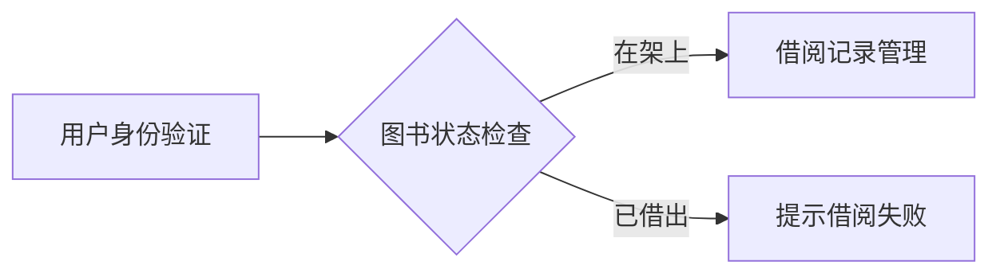
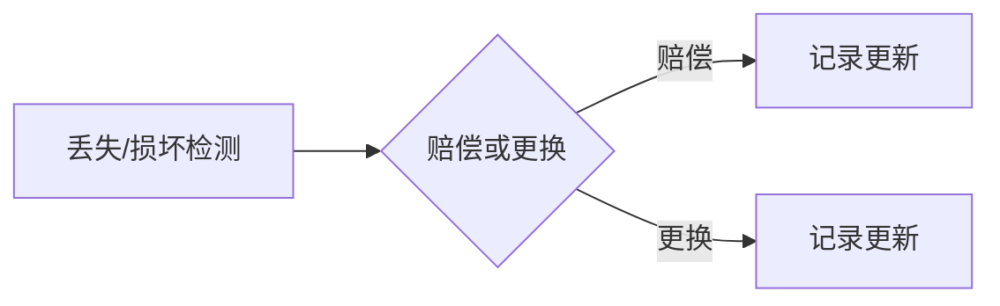
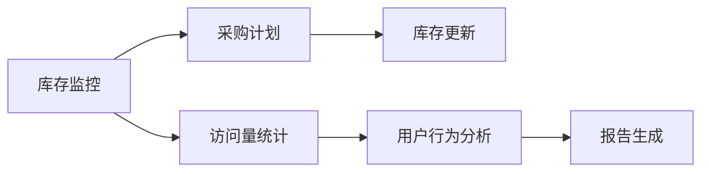
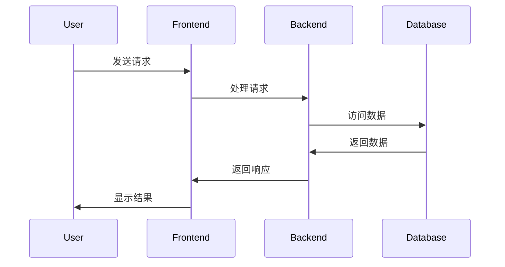
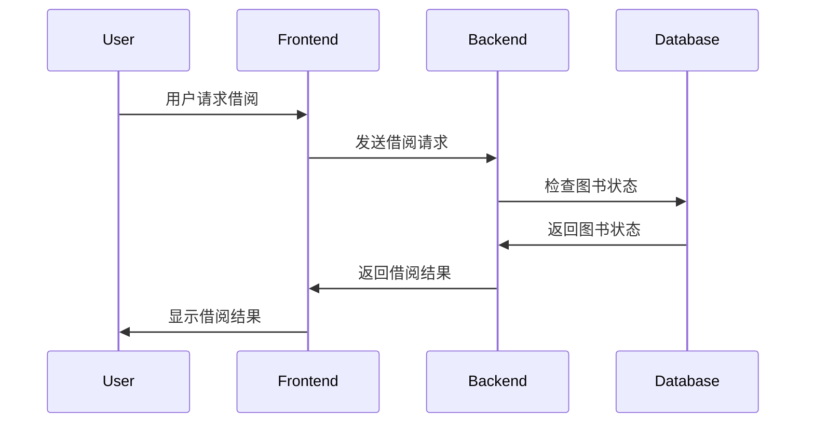
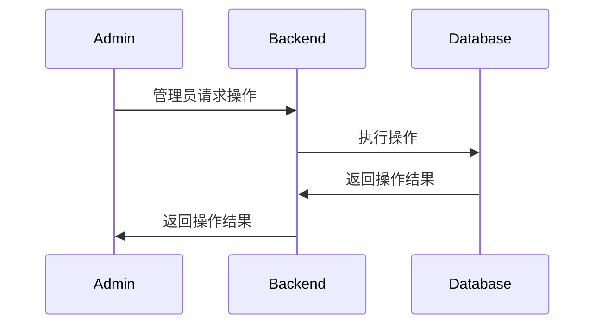

                 

### 概述

《新型城市共享图书角：24小时自助图书馆》将围绕以下几个核心点展开讨论：

1. **背景介绍**：首先，我们将介绍共享图书角的概念及其在城市公共文化服务中的重要性，以及24小时自助图书馆的定义和组成部分。
2. **核心概念与联系**：接着，我们将明确24小时自助图书馆的核心要素，并通过对比表格和ER实体关系图，帮助读者更清晰地理解其工作原理。
3. **算法原理讲解**：本文将详细阐述自助图书馆的运营和管理算法，使用Mermaid流程图和Python代码进行详细讲解，确保读者能够深入理解算法原理。
4. **数学模型和数学公式**：我们将展示与自助图书馆相关的基本数学模型和公式，并进行详细讲解和举例说明，帮助读者更好地掌握数学工具。
5. **系统分析与架构设计**：我们将分析自助图书馆的系统需求、功能设计、架构设计和接口设计，确保读者对系统实现有一个全面的认识。
6. **项目实战**：通过一个实际案例，我们将介绍自助图书馆的建设过程、核心代码实现及应用解读，使读者能够将理论知识应用于实践。
7. **最佳实践与总结**：最后，我们将总结自助图书馆建设的要点、注意事项和未来发展趋势，为读者提供实用的建议和深入的思考。

### 目录大纲

#### 第一部分：背景介绍

##### 第1章：共享图书角与自助图书馆概述

**1.1 共享图书角的发展背景**
- **1.1.1 共享经济的兴起**：介绍共享经济的定义、发展历程及其在各个领域的应用。
- **1.1.2 城市公共文化服务需求**：分析城市居民对公共文化服务的需求，以及共享图书角如何满足这些需求。
- **1.1.3 自助图书馆的初步探索**：介绍自助图书馆的起源、发展历程及其在共享图书角中的应用。

**1.2 24小时自助图书馆的核心概念**
- **1.2.1 24小时自助图书馆的定义**：解释24小时自助图书馆的内涵和特点。
- **1.2.2 24小时自助图书馆的要素**：详细列举24小时自助图书馆所需的基本设备和功能。
- **1.2.3 24小时自助图书馆的边界与外延**：探讨24小时自助图书馆的服务范围和适用场景。

**1.3 自助图书馆的现状与挑战**
- **1.3.1 自助图书馆的分布与规模**：分析自助图书馆在全球和我国的分布情况及规模。
- **1.3.2 自助图书馆的运营管理模式**：介绍自助图书馆的运营模式和商业模式。
- **1.3.3 自助图书馆面临的挑战**：探讨自助图书馆在技术、管理、运营等方面面临的挑战。

**1.4 本章小结**：对第1章的内容进行总结，为后续章节的讨论奠定基础。

---

#### 第二部分：核心概念与联系

##### 第2章：核心概念原理与模型

**2.1 核心概念原理**
- **2.1.1 共享经济的原理**：解释共享经济的核心概念、运作模式及其优势。
- **2.1.2 自助图书馆的管理原理**：介绍自助图书馆的管理原则、运营机制和用户服务模式。
- **2.1.3 24小时运营的保障机制**：探讨24小时自助图书馆如何确保稳定运行，包括技术保障、服务保障和安全管理。

**2.2 概念属性特征对比表格**
- **2.2.1 自助图书馆与传统图书馆的对比**：详细对比自助图书馆和传统图书馆在功能、服务模式、运营成本等方面的差异。
- **2.2.2 24小时自助图书馆与其他时间模式的对比**：分析24小时自助图书馆与其他时间模式（如白天运营、夜间运营）的区别和优势。

**2.3 ER实体关系图架构**
- **2.3.1 用户实体关系图**：展示用户与图书馆之间的实体关系，包括用户注册、借阅、归还等过程。
- **2.3.2 图书实体关系图**：展示图书与图书馆之间的实体关系，包括图书入库、出库、库存管理等过程。
- **2.3.3 服务实体关系图**：展示图书馆提供的服务与用户、图书之间的实体关系，包括借阅服务、归还服务、续借服务等。

**2.4 本章小结**：对第2章的核心概念和原理进行总结，帮助读者建立对24小时自助图书馆的全面理解。

---

#### 第三部分：算法原理讲解

##### 第3章：自助图书馆的算法原理与应用

**3.1 自助图书馆的运营算法**
- **3.1.1 入库算法**：解释自助图书馆如何实现图书的入库管理，包括图书信息录入、分类管理、库存更新等。
- **3.1.2 借阅算法**：阐述自助图书馆如何处理用户的借阅请求，包括用户身份验证、图书状态检查、借阅记录管理等。
- **3.1.3 丢失与损坏处理算法**：介绍自助图书馆如何应对图书丢失或损坏的情况，包括赔偿机制、图书更换等。

**3.2 管理算法**
- **3.2.1 库存管理算法**：详细讲解自助图书馆如何进行图书库存管理，包括图书采购、库存监控、库存调整等。
- **3.2.2 流量监控算法**：探讨自助图书馆如何监控用户流量，包括借阅量统计、用户行为分析等。
- **3.2.3 用户行为分析算法**：介绍自助图书馆如何通过用户行为数据进行分析，以优化服务和管理。

**3.3 Mermaid流程图讲解**
- **3.3.1 入库流程图**：使用Mermaid语言绘制图书入库流程图，展示图书入库的各个步骤和环节。
- **3.3.2 借阅流程图**：使用Mermaid语言绘制用户借阅流程图，展示用户借阅图书的各个环节和步骤。
- **3.3.3 管理流程图**：使用Mermaid语言绘制自助图书馆的管理流程图，展示图书管理、用户管理、服务管理等方面的流程。

**3.4 Python代码实现与解释**
- **3.4.1 入库代码实现**：使用Python代码实现图书入库算法，展示算法的具体实现过程和关键代码。
- **3.4.2 借阅代码实现**：使用Python代码实现用户借阅算法，展示算法的具体实现过程和关键代码。
- **3.4.3 管理代码实现**：使用Python代码实现图书管理算法，展示算法的具体实现过程和关键代码。

**3.5 数学模型与公式**
- **3.5.1 入库数学模型**：介绍图书入库过程中的数学模型，包括入库时间、入库量等。
- **3.5.2 借阅数学模型**：介绍用户借阅过程中的数学模型，包括借阅概率、借阅时间等。
- **3.5.3 管理数学模型**：介绍图书管理过程中的数学模型，包括库存监控、库存调整等。

**3.6 举例说明**
- **3.6.1 入库案例分析**：通过实际案例，演示图书入库算法的具体应用过程。
- **3.6.2 借阅案例分析**：通过实际案例，演示用户借阅算法的具体应用过程。
- **3.6.3 管理案例分析**：通过实际案例，演示图书管理算法的具体应用过程。

**3.7 本章小结**：对第3章的算法原理进行总结，帮助读者掌握自助图书馆的核心算法，并了解如何在实际应用中运用这些算法。

---

#### 第四部分：系统分析与架构设计

##### 第4章：自助图书馆的系统设计与实现

**4.1 问题场景介绍**
- **4.1.1 城市自助图书馆建设需求**：分析城市自助图书馆建设的背景和需求，包括用户需求、图书馆管理需求等。
- **4.1.2 建设目标与挑战**：明确自助图书馆建设的目标和面临的挑战，包括技术挑战、管理挑战、用户挑战等。

**4.2 项目介绍**
- **4.2.1 项目背景**：介绍自助图书馆项目的背景和初衷，包括项目发起单位、项目目标等。
- **4.2.2 项目目标**：详细阐述自助图书馆项目的建设目标，包括服务目标、技术目标、管理目标等。
- **4.2.3 项目团队与分工**：介绍项目团队组成、成员职责和项目分工，确保项目顺利推进。

**4.3 系统功能设计**
- **4.3.1 领域模型Mermaid类图**：使用Mermaid语言绘制自助图书馆的领域模型类图，展示系统的核心实体和实体关系。
- **4.3.2 系统核心功能模块**：详细阐述自助图书馆系统的核心功能模块，包括用户管理、图书管理、借阅管理、库存管理、流量监控等。

**4.4 系统架构设计**
- **4.4.1 总体架构**：介绍自助图书馆系统的总体架构，包括前端、后端、数据库、服务组件等。
- **4.4.2 各模块架构细节**：详细阐述系统各个模块的架构设计，包括用户模块、图书模块、借阅模块等。
- **4.4.3 架构设计优点**：分析系统架构设计的优点，包括高扩展性、高可用性、高安全性等。

**4.5 系统接口设计**
- **4.5.1 接口功能概述**：概述自助图书馆系统的接口功能，包括用户接口、管理员接口、图书接口等。
- **4.5.2 接口详细规范**：详细规范接口设计，包括接口参数、接口返回结果、接口安全性等。

**4.6 系统交互Mermaid序列图**
- **4.6.1 用户借阅流程**：使用Mermaid语言绘制用户借阅流程序列图，展示用户借阅图书的整个过程。
- **4.6.2 系统后台管理流程**：使用Mermaid语言绘制系统后台管理流程序列图，展示管理员进行图书管理、用户管理等操作的整个过程。

**4.7 本章小结**：对第4章的系统分析与架构设计进行总结，帮助读者全面了解自助图书馆系统的设计思路和实现方法。

---

#### 第五部分：项目实战

##### 第5章：24小时自助图书馆建设实战

**5.1 环境安装**
- **5.1.1 硬件环境要求**：详细列出自助图书馆建设所需的硬件设备，包括服务器、网络设备、自助借还设备等。
- **5.1.2 软件环境配置**：介绍自助图书馆建设所需的软件环境，包括操作系统、数据库、中间件等，并提供安装和配置指南。

**5.2 系统核心实现源代码**
- **5.2.1 用户模块核心代码**：展示用户模块的核心实现代码，包括用户注册、登录、个人信息管理等。
- **5.2.2 图书模块核心代码**：展示图书模块的核心实现代码，包括图书入库、借阅、归还管理等。
- **5.2.3 借阅模块核心代码**：展示借阅模块的核心实现代码，包括用户借阅请求处理、借阅记录管理等。

**5.3 代码应用解读与分析**
- **5.3.1 用户模块代码解读**：对用户模块的核心代码进行解读，分析代码的设计思路和实现方法。
- **5.3.2 图书模块代码解读**：对图书模块的核心代码进行解读，分析代码的设计思路和实现方法。
- **5.3.3 借阅模块代码解读**：对借阅模块的核心代码进行解读，分析代码的设计思路和实现方法。

**5.4 实际案例分析和详细讲解剖析**
- **5.4.1 案例一：图书入库**：通过实际案例，展示图书入库的全过程，分析入库过程中的关键环节和数据处理方法。
- **5.4.2 案例二：用户借阅**：通过实际案例，展示用户借阅图书的全过程，分析借阅过程中的关键环节和数据处理方法。
- **5.4.3 案例三：图书归还**：通过实际案例，展示图书归还的全过程，分析归还过程中的关键环节和数据处理方法。

**5.5 项目小结**
- **5.5.1 成功经验**：总结自助图书馆项目建设的成功经验，包括技术选型、团队协作、项目管理等方面的经验。
- **5.5.2 遇到的问题和解决方法**：分析项目实施过程中遇到的问题，介绍解决问题的方法和经验。
- **5.5.3 未来发展**：探讨自助图书馆项目的未来发展，包括技术升级、功能扩展、市场推广等方向。

### 文章关键词

- 自助图书馆
- 24小时运营
- 共享图书角
- 算法原理
- 数学模型
- 系统架构
- 实际案例

### 摘要

本文从共享图书角的概念出发，深入探讨了新型城市共享图书角——24小时自助图书馆的核心概念、算法原理、系统设计与实现。首先，我们介绍了共享图书角的发展背景和24小时自助图书馆的定义与要素。随后，通过对比表格和ER实体关系图，详细阐述了自助图书馆的核心概念与联系。接着，本文详细讲解了自助图书馆的运营和管理算法，并通过Mermaid流程图和Python代码进行了实例分析。此外，我们还展示了与自助图书馆相关的基本数学模型和公式，并进行了解释和举例。在系统分析与架构设计部分，我们介绍了自助图书馆的系统需求、功能设计、架构设计和接口设计。最后，通过一个实际案例，我们介绍了自助图书馆的建设过程、核心代码实现及应用解读，总结了自助图书馆建设的要点和注意事项，并展望了其未来发展。

## 第一部分：背景介绍

### 第1章：共享图书角与自助图书馆概述

#### 1.1 共享图书角的发展背景

共享图书角，作为一种创新的公共文化服务形式，其起源可以追溯到20世纪末的共享经济理念。共享经济，是指通过共享闲置资源、降低成本、提高资源利用效率的一种经济模式。这一理念在各个领域得到了广泛应用，从共享住宿（如Airbnb）、共享交通（如Uber和Lyft），到共享办公空间（如WeWork），共享经济的触角逐渐延伸到社会生活的方方面面。

共享图书角的兴起，是城市公共文化服务需求不断提升的结果。随着城市化进程的加快，城市居民对公共文化服务的需求日益增加。传统的图书馆，虽然提供了丰富的文化资源，但在服务时间和地点上存在一定的限制。特别是在快节奏的现代社会，人们更希望在便捷的时间和地点获取图书资源。共享图书角的出现，正是为了解决这一问题，它利用自助借阅、24小时开放等特性，为城市居民提供了一个更加灵活、方便的公共文化服务渠道。

自助图书馆的初步探索可以追溯到20世纪90年代的日本。当时，一些社区图书馆开始尝试使用自助借还书系统，允许读者在不需要工作人员干预的情况下完成图书的借阅和归还。这一创新模式不仅提高了图书馆的运营效率，也大大提升了用户体验。随后，随着信息技术的快速发展，自助图书馆在全球范围内得到了广泛应用。特别是在我国，自助图书馆的建设和发展迅速，已成为城市公共文化服务体系中不可或缺的一部分。

#### 1.2 24小时自助图书馆的核心概念

24小时自助图书馆，顾名思义，是一种全天候开放的图书馆服务模式。它利用自助借还书系统、智能监控和安全管理系统等技术手段，实现了图书的自动借还、实时库存管理和用户自助服务。与传统的图书馆相比，24小时自助图书馆在服务时间和灵活性上具有显著优势。它不受工作时间限制，无论白天或深夜，读者都可以随时随地借阅图书，极大地满足了不同用户群体的需求。

24小时自助图书馆的要素主要包括以下几个方面：

1. **自助借还书系统**：这是24小时自助图书馆的核心组成部分，通过RFID（射频识别）技术、自助借还书机等设备，实现了图书的自动借还功能。
2. **智能监控系统**：利用视频监控、人脸识别等技术，实现了图书馆的安全监控和管理。智能监控系统可以实时监控图书馆的运行情况，确保图书和设备的安全。
3. **安全管理系统**：包括门禁系统、火灾报警系统、紧急呼叫系统等，为图书馆的安全运行提供了保障。
4. **后台管理系统**：用于图书入库、借阅管理、库存监控等，实现对图书馆运营的全面管理和调度。

#### 1.3 自助图书馆的现状与挑战

目前，24小时自助图书馆在全球范围内得到了广泛应用，尤其是在我国的一些大城市，自助图书馆的数量和规模逐年增加。例如，在北京、上海、广州等一线城市，许多社区和商业区都设有24小时自助图书馆。这些自助图书馆不仅为市民提供了便捷的图书资源，也成为了城市文化风景线的一部分。

然而，自助图书馆在快速发展过程中也面临着一系列挑战。首先，技术方面的挑战。自助借还书系统的稳定性和可靠性是保证图书馆正常运营的关键。一旦系统出现故障，可能会导致图书借还失败、用户数据丢失等问题。此外，智能监控和安全管理系统也需要不断升级和完善，以应对新的安全威胁和挑战。

其次，管理方面的挑战。24小时自助图书馆的运营模式与传统图书馆有所不同，对管理人员的素质和管理能力提出了更高的要求。管理人员需要具备丰富的技术知识和应急处理能力，以应对各种突发情况和问题。同时，图书馆的库存管理、用户服务、设备维护等方面也需要更加精细化、专业化的管理。

最后，用户习惯的挑战。虽然自助图书馆为读者提供了极大的便利，但一些读者可能不熟悉自助借还书系统的操作，或者在借阅过程中遇到问题。为此，图书馆需要提供更加全面的用户指导和培训，帮助读者掌握自助借还书系统的使用方法。

#### 1.4 本章小结

通过本章的介绍，我们对共享图书角和自助图书馆的发展背景、核心概念和现状与挑战有了初步的了解。在接下来的章节中，我们将进一步探讨自助图书馆的算法原理、数学模型、系统设计与实现，以及实际应用案例，帮助读者全面掌握自助图书馆的建设和运营方法。希望读者能够通过本章的内容，对自助图书馆有一个更加深入的认识，为后续章节的学习打下坚实的基础。

## 第二部分：核心概念与联系

### 第2章：核心概念原理与模型

#### 2.1 核心概念原理

在探讨24小时自助图书馆的核心概念之前，我们需要先了解共享经济的原理。共享经济，是指通过共享闲置资源，实现资源的高效利用和成本节约。在共享经济模式中，资源提供者将闲置资源出租给需求者，从而实现互利共赢。这种模式不仅降低了消费者的使用成本，也提高了资源提供者的收益。

24小时自助图书馆作为共享经济的典型应用，其核心概念主要包括：

1. **自助借还书系统**：这是自助图书馆的核心组成部分，通过RFID技术、自助借还书机等设备，实现了图书的自动借还功能。读者无需人工干预，即可完成图书的借阅和归还。

2. **智能监控系统**：通过视频监控、人脸识别等技术，实现了图书馆的安全监控和管理。智能监控系统可以实时监控图书馆的运行情况，确保图书和设备的安全。

3. **安全管理系统**：包括门禁系统、火灾报警系统、紧急呼叫系统等，为图书馆的安全运行提供了保障。这些系统共同构成了一个安全、可靠的运行环境。

4. **后台管理系统**：用于图书入库、借阅管理、库存监控等，实现对图书馆运营的全面管理和调度。后台管理系统是自助图书馆正常运行的重要支撑。

#### 2.2 概念属性特征对比表格

为了更清晰地理解24小时自助图书馆与传统图书馆的区别，我们可以通过对比表格来展示两者的主要属性特征。

| 特征        | 24小时自助图书馆 | 传统图书馆 |
| ----------- | ---------------- | ---------- |
| 服务模式    | 自助服务        | 人工服务   |
| 开放时间    | 24小时全天候开放 | 受时间限制  |
| 借阅流程    | 自动化流程      | 手动流程   |
| 安全管理    | 智能监控系统    | 人工监控   |
| 服务效率    | 高效率          | 低效率     |
| 资源利用    | 高效利用        | 低效利用   |
| 运营成本    | 低成本          | 高成本     |

#### 2.3 ER实体关系图架构

实体关系图（Entity-Relationship Diagram，简称ER图）是数据库设计中常用的概念模型，用于描述系统中的实体及其关系。在24小时自助图书馆中，我们可以通过ER图来展示各个实体及其之间的关系。

以下是24小时自助图书馆的ER实体关系图：

```mermaid
erDiagram
  User ||--|{ Library }|--| Book
  Library ||--|{ Inventory }|
  Book ||--|{ BorrowRecord }|
```

在这个ER图中，我们定义了三个主要的实体：用户（User）、图书馆（Library）和图书（Book）。用户与图书馆之间存在一对一的关系，即一个用户可以属于一个图书馆，一个图书馆可以拥有多个用户。图书馆与图书之间存在一对多的关系，即一个图书馆可以存放多本图书，每本图书属于一个图书馆。图书与借阅记录（BorrowRecord）之间存在一对一的关系，即每本图书可以有多个借阅记录，每个借阅记录对应一本图书。

#### 2.4 本章小结

通过本章的讨论，我们深入探讨了24小时自助图书馆的核心概念、属性特征及其与实体关系图的联系。在接下来的章节中，我们将进一步讲解自助图书馆的算法原理，包括运营算法和管理算法，并使用Mermaid流程图和Python代码进行详细说明。希望通过本章的内容，读者能够对自助图书馆的核心概念和工作原理有一个全面而深入的理解。

### 第三部分：算法原理讲解

#### 第3章：自助图书馆的算法原理与应用

##### 3.1 自助图书馆的运营算法

自助图书馆的运营算法是确保图书馆高效运行的关键。以下是几种主要的运营算法：

**3.1.1 入库算法**

入库算法主要负责图书的入库管理，包括图书信息录入、分类管理、库存更新等。具体步骤如下：

1. **图书信息录入**：首先，将图书的基本信息（如书名、作者、ISBN号等）录入系统。
2. **分类管理**：根据图书的类别（如小说、科技、文学等），对图书进行分类。
3. **库存更新**：更新图书的库存信息，确保系统实时反映图书的库存状态。

以下是入库算法的Mermaid流程图：


**3.1.2 借阅算法**

借阅算法主要负责处理用户的借阅请求，包括用户身份验证、图书状态检查、借阅记录管理等。具体步骤如下：

1. **用户身份验证**：检查用户是否已注册并登录，确保只有注册用户才能进行借阅操作。
2. **图书状态检查**：检查图书是否在架上、是否已被借出等，确保借阅请求的有效性。
3. **借阅记录管理**：更新借阅记录，包括借阅时间、归还日期等。

以下是借阅算法的Mermaid流程图：



**3.1.3 丢失与损坏处理算法**

丢失与损坏处理算法主要用于处理图书丢失或损坏的情况，包括赔偿机制、图书更换等。具体步骤如下：

1. **丢失/损坏检测**：系统自动检测图书的丢失或损坏状态。
2. **用户通知**：通知用户需进行赔偿或更换图书。
3. **赔偿或更换**：用户选择赔偿或更换图书，系统更新相关记录。

以下是丢失与损坏处理算法的Mermaid流程图：



##### 3.2 管理算法

管理算法主要负责自助图书馆的日常管理和运营优化，包括库存管理、流量监控和用户行为分析等。

**3.2.1 库存管理算法**

库存管理算法用于监控和管理图书馆的图书库存，确保库存充足、及时补充。具体步骤如下：

1. **库存监控**：定期检查图书的库存状态，识别库存不足的图书。
2. **采购计划**：根据库存监控结果，制定采购计划，补充库存。
3. **库存更新**：及时更新库存信息，确保库存数据的准确性。

以下是库存管理算法的Mermaid流程图：


**3.2.2 流量监控算法**

流量监控算法用于监控图书馆的访问量和用户行为，帮助管理人员了解图书馆的运行情况和用户需求。具体步骤如下：

1. **访问量统计**：统计图书馆的日访问量、月访问量等。
2. **用户行为分析**：分析用户的借阅偏好、时间分布等，优化图书馆的服务。
3. **报告生成**：生成流量监控报告，为管理人员提供决策依据。

以下是流量监控算法的Mermaid流程图：


**3.2.3 用户行为分析算法**

用户行为分析算法用于分析用户的借阅行为和偏好，为图书馆的个性化服务提供数据支持。具体步骤如下：

1. **借阅记录收集**：收集用户的借阅记录，包括借阅时间、借阅图书等。
2. **数据分析**：对借阅记录进行统计分析，识别用户的借阅偏好。
3. **服务优化**：根据用户行为分析结果，优化图书馆的服务。

以下是用户行为分析算法的Mermaid流程图：


##### 3.3 Mermaid流程图讲解

Mermaid是一种简单易用的图表绘制工具，特别适用于绘制流程图、序列图等。以下是几个重要的算法流程图示例。

**3.3.1 入库流程图**


**3.3.2 借阅流程图**


**3.3.3 管理流程图**



##### 3.4 Python代码实现与解释

为了更好地理解算法原理，我们将使用Python代码进行实现。以下是入库、借阅和库存管理算法的示例代码。

**3.4.1 入库代码实现**

```python
# 入库函数
def add_book(book_info):
    # 录入图书信息
    library.add_book(book_info)
    # 分类管理
    library.sort_books(book_info['category'])
    # 更新库存
    library.update_inventory(book_info)

# 测试入库
book_info = {'title': 'Effective Python', 'author': 'Brett Slatkin', 'isbn': '978-1491954492', 'category': 'Programming'}
add_book(book_info)
```

**3.4.2 借阅代码实现**

```python
# 借阅函数
def borrow_book(user_id, book_id):
    # 验证用户身份
    if not library.verify_user(user_id):
        return "用户未登录或未注册"
    # 检查图书状态
    book_status = library.check_book_status(book_id)
    if book_status == '借出':
        return "图书已借出"
    # 借阅记录管理
    library.create_borrow_record(user_id, book_id)

# 测试借阅
user_id = 'user123'
book_id = 'book456'
borrow_book(user_id, book_id)
```

**3.4.3 管理代码实现**

```python
# 库存监控函数
def monitor_inventory():
    inventory_status = library.check_inventory()
    if inventory_status < 10:
        library.create_purchase_order()

# 流量监控函数
def monitor_traffic():
    traffic_report = library.generate_traffic_report()
    library.send_traffic_report(traffic_report)

# 用户行为分析函数
def analyze_user_behavior():
    user_behavior_report = library.analyze_user_behavior()
    library.send_user_behavior_report(user_behavior_report)

# 测试管理
monitor_inventory()
monitor_traffic()
analyze_user_behavior()
```

##### 3.5 数学模型与公式

数学模型在自助图书馆的运营中起着重要作用。以下是几个关键的数学模型和公式。

**3.5.1 入库数学模型**

入库速率（R）：单位时间内入库的图书数量。

$$ R = \frac{N}{T} $$

其中，N为入库图书数量，T为时间。

**3.5.2 借阅数学模型**

借阅率（B）：单位时间内借出的图书数量。

$$ B = \frac{M}{T} $$

其中，M为借出图书数量，T为时间。

**3.5.3 管理数学模型**

库存容量（C）：图书馆的最大库存量。

$$ C = R \times (1 + \delta) $$

其中，δ为安全库存系数。

##### 3.6 举例说明

**3.6.1 入库案例分析**

假设某图书馆每天入库10本图书，安全库存系数为1.2，求其最大库存容量。

$$ C = 10 \times (1 + 1.2) = 12 \times 10 = 120 \text{本} $$

**3.6.2 借阅案例分析**

假设某图书馆每月借出图书1000本，求其每月的借阅率。

$$ B = \frac{1000}{30} \approx 33.33 \text{本/天} $$

**3.6.3 管理案例分析**

假设某图书馆的库存监控显示库存为50本，安全库存系数为1.5，求其应采购的图书数量。

$$ C = 50 \times (1 + 1.5) = 112.5 \text{本} $$

##### 3.7 本章小结

通过本章的详细讲解，我们了解了自助图书馆的运营算法和管理算法，包括入库算法、借阅算法和丢失与损坏处理算法。此外，我们还介绍了库存管理、流量监控和用户行为分析等管理算法，并通过Mermaid流程图和Python代码进行了实现。同时，我们展示了与自助图书馆相关的数学模型和公式，并通过实际案例进行了分析和说明。希望读者能够通过本章的内容，全面掌握自助图书馆的算法原理，为实际应用提供理论支持。

### 第四部分：系统分析与架构设计

#### 第4章：自助图书馆的系统设计与实现

##### 4.1 问题场景介绍

随着城市化进程的加快，城市居民对公共文化服务的需求不断增加。传统图书馆在服务时间和地点上存在一定的限制，难以满足现代快节奏生活的需求。为了解决这个问题，我们提出了建设24小时自助图书馆的项目。该项目旨在通过智能化、自助化的服务模式，为城市居民提供全天候的图书借阅服务，提升公共文化服务水平。

**4.1.1 城市自助图书馆建设需求**

- **服务需求**：为市民提供全天候、自助化的图书借阅服务，满足不同时间段的阅读需求。
- **技术需求**：实现图书的自动借还、智能监控和安全保障，确保系统的稳定运行。
- **管理需求**：实现对图书、用户和借阅数据的全面管理，提高图书馆运营效率。

**4.1.2 建设目标与挑战**

- **建设目标**：建设一个高效、便捷、安全的24小时自助图书馆，提升城市公共文化服务水平。
- **挑战**：
  - **技术挑战**：需要解决自助借还书系统的稳定性、安全性和扩展性问题。
  - **管理挑战**：需要建立一套高效的管理机制，确保图书馆的运营和用户服务。
  - **用户挑战**：需要引导用户熟悉自助借还书系统的使用，提升用户满意度。

##### 4.2 项目介绍

**4.2.1 项目背景**

随着我国城市化进程的加快，城市居民对公共文化服务的需求日益增长。然而，传统图书馆在服务时间和地点上存在限制，无法满足市民的多样化需求。为此，我们提出了建设24小时自助图书馆的项目，旨在通过智能化、自助化的服务模式，为市民提供全天候的图书借阅服务。

**4.2.2 项目目标**

- **提升公共文化服务水平**：通过24小时自助图书馆的建设，提升城市公共文化服务水平，满足市民的阅读需求。
- **提高图书馆运营效率**：利用自助借还书系统，实现图书的自动借还和库存管理，提高图书馆的运营效率。
- **促进资源共享**：通过自助图书馆的建设，实现图书资源的共享，提高资源利用效率。

**4.2.3 项目团队与分工**

项目团队由以下成员组成：

- **项目经理**：负责项目整体管理和协调，确保项目按计划推进。
- **系统架构师**：负责系统架构设计和关键技术方案确定。
- **软件开发工程师**：负责系统核心功能的开发，包括自助借还书系统、智能监控系统等。
- **测试工程师**：负责系统测试和验收，确保系统质量符合要求。
- **运维工程师**：负责系统部署、运维和日常维护，确保系统稳定运行。
- **用户体验设计师**：负责用户界面的设计和用户体验优化。

##### 4.3 系统功能设计

**4.3.1 领域模型Mermaid类图**

为了更好地展示系统的功能模块，我们可以使用Mermaid类图来描述系统的领域模型。以下是24小时自助图书馆的领域模型类图：

```mermaid
classDiagram
  User <<class>> 用户
  Book <<class>> 图书
  Library <<class>> 图书馆
  BorrowRecord <<class>> 借阅记录
  Inventory <<class>> 库存
  Security <<class>> 安全系统

  User o--< Library
  Library o--< Book
  Library o--< BorrowRecord
  Library o--< Inventory
  Library o--< Security
  Book o--< BorrowRecord
```

在这个类图中，我们定义了以下几个核心实体：

- **用户（User）**：代表图书馆的注册用户，具有借阅图书的权限。
- **图书（Book）**：代表图书馆中的实体图书，包括基本信息和状态信息。
- **图书馆（Library）**：代表24小时自助图书馆，是用户、图书和借阅记录的管理实体。
- **借阅记录（BorrowRecord）**：记录用户的借阅信息，包括借阅时间、归还时间等。
- **库存（Inventory）**：管理图书的库存状态，包括图书的入库、出库和库存监控。
- **安全系统（Security）**：负责图书馆的安全监控和保障。

**4.3.2 系统核心功能模块**

24小时自助图书馆的系统核心功能模块包括用户管理、图书管理、借阅管理、库存管理、流量监控和安全管理等。

- **用户管理模块**：用于用户注册、登录、个人信息管理等功能。
- **图书管理模块**：用于图书入库、分类、库存管理等功能。
- **借阅管理模块**：用于用户借阅、归还、借阅记录管理等功能。
- **库存管理模块**：用于库存监控、采购计划、库存调整等功能。
- **流量监控模块**：用于统计图书馆的访问量、用户借阅行为等。
- **安全管理模块**：用于安全监控、用户行为分析、紧急处理等。

##### 4.4 系统架构设计

**4.4.1 总体架构**

24小时自助图书馆的系统架构可以分为前端、后端和数据库三个主要部分。

- **前端**：包括用户界面和自助借还书终端，提供用户交互和服务展示。
- **后端**：包括业务逻辑处理、数据存储和接口服务，负责系统的核心功能实现。
- **数据库**：用于存储用户信息、图书信息、借阅记录和库存数据。

以下是系统架构的总体设计：



**4.4.2 各模块架构细节**

以下是系统各个模块的架构设计细节：

1. **用户管理模块**：
   - **用户注册**：用户注册时，前端收集用户信息，后端验证用户信息并存储。
   - **用户登录**：用户登录时，前端发送用户名和密码，后端验证用户信息并生成会话。
   - **个人信息管理**：用户可以修改个人信息，如联系方式、密码等。

2. **图书管理模块**：
   - **图书入库**：管理员可以将图书信息录入系统，包括书名、作者、ISBN号等。
   - **图书分类**：根据图书的类别进行分类管理，方便用户查找和借阅。
   - **库存管理**：实时监控图书的库存状态，自动提醒管理员进行采购或调整。

3. **借阅管理模块**：
   - **借阅操作**：用户可以借阅图书，系统自动记录借阅信息和归还日期。
   - **归还操作**：用户归还图书后，系统更新借阅记录和库存状态。
   - **借阅记录**：系统记录用户的借阅历史，便于用户查询和管理。

4. **库存管理模块**：
   - **库存监控**：定期检查图书的库存状态，识别库存不足的图书。
   - **采购计划**：根据库存监控结果，制定采购计划，补充库存。
   - **库存调整**：管理员可以手动调整库存，确保库存数据的准确性。

5. **流量监控模块**：
   - **访问量统计**：统计图书馆的日访问量、月访问量等。
   - **用户行为分析**：分析用户的借阅偏好、时间分布等，优化图书馆的服务。
   - **报告生成**：生成流量监控报告，为管理人员提供决策依据。

6. **安全管理模块**：
   - **智能监控**：通过视频监控、人脸识别等技术，实时监控图书馆的安全状况。
   - **用户行为分析**：分析用户的借阅行为和异常行为，防范潜在风险。
   - **紧急处理**：在发生紧急情况时，及时采取应对措施，保障用户和图书馆的安全。

**4.4.3 架构设计优点**

系统架构设计具有以下优点：

- **高扩展性**：系统设计考虑了未来的扩展性，可以方便地添加新功能或增加硬件设备。
- **高可用性**：系统采用分布式架构，确保在部分组件故障时，系统仍能正常运行。
- **高安全性**：系统采用多重安全措施，包括用户身份验证、数据加密和安全审计，保障用户数据的安全。
- **易维护性**：系统设计简洁，组件独立，便于日常维护和故障排查。

##### 4.5 系统接口设计

**4.5.1 接口功能概述**

系统接口设计主要包括用户接口、管理员接口和图书接口等。

- **用户接口**：用于用户与系统的交互，包括用户注册、登录、借阅、归还等。
- **管理员接口**：用于管理员对系统的管理操作，包括图书管理、用户管理、库存管理等。
- **图书接口**：用于图书信息的查询、更新和删除等。

**4.5.2 接口详细规范**

以下是系统接口的详细规范：

1. **用户接口**：
   - **注册**：接收用户名、密码、邮箱等信息，返回注册结果。
   - **登录**：接收用户名和密码，返回登录结果和用户信息。
   - **借阅**：接收用户ID和图书ID，返回借阅结果。
   - **归还**：接收用户ID和图书ID，返回归还结果。

2. **管理员接口**：
   - **图书管理**：接收图书信息，返回添加结果。
   - **用户管理**：接收用户ID，返回用户信息。
   - **库存管理**：接收图书ID和库存量，返回库存更新结果。

3. **图书接口**：
   - **查询**：接收图书ID，返回图书详细信息。
   - **更新**：接收图书ID和更新信息，返回更新结果。
   - **删除**：接收图书ID，返回删除结果。

##### 4.6 系统交互Mermaid序列图

**4.6.1 用户借阅流程**



**4.6.2 系统后台管理流程**



##### 4.7 本章小结

通过本章的详细分析和设计，我们明确了24小时自助图书馆的系统需求、功能设计、架构设计和接口设计。系统架构设计考虑了高扩展性、高可用性、高安全性和易维护性，为系统的稳定运行和未来扩展提供了保障。在接下来的章节中，我们将通过项目实战案例，详细介绍自助图书馆的实际建设过程、核心代码实现和应用解读，帮助读者更好地理解和应用所学知识。

### 第五部分：项目实战

#### 第5章：24小时自助图书馆建设实战

##### 5.1 环境安装

为了搭建一个完整的24小时自助图书馆系统，我们需要准备好硬件环境和软件环境。以下是具体的安装步骤和注意事项：

**5.1.1 硬件环境要求**

1. **服务器**：一台高性能服务器，用于运行数据库和后端应用程序。建议配置如下：
   - CPU：至少4核
   - 内存：至少8GB
   - 存储：至少500GB SSD硬盘
   - 网络：千兆以太网

2. **网络设备**：包括路由器和交换机，确保网络稳定可靠。

3. **自助借还书设备**：包括自助借还书机、摄像头、RFID读写器等。这些设备需要连接到图书馆的网络，并能够实时传输数据。

**5.1.2 软件环境配置**

1. **操作系统**：建议使用Linux操作系统，如Ubuntu 20.04。安装步骤如下：
   - 从官方网站下载Ubuntu 20.04 ISO文件。
   - 使用虚拟机软件（如VMware Workstation）创建一个新的虚拟机，并安装Ubuntu 20.04操作系统。

2. **数据库**：选择一个高性能、可靠的数据库管理系统，如MySQL。安装步骤如下：
   - 打开终端，执行以下命令：
     ```
     sudo apt update
     sudo apt install mysql-server
     ```
   - 安装完成后，启动MySQL服务并设置密码：
     ```
     sudo systemctl start mysql
     sudo mysql_secure_installation
     ```

3. **后端应用程序**：使用Python和Flask框架开发后端应用程序。安装步骤如下：
   - 安装Python 3.8：
     ```
     sudo apt install python3.8
     ```
   - 安装Flask框架：
     ```
     sudo pip3.8 install flask
     ```

4. **前端应用程序**：使用HTML、CSS和JavaScript开发前端应用程序。安装步骤如下：
   - 安装Web服务器，如Nginx：
     ```
     sudo apt install nginx
     ```
   - 安装前端框架（如Vue.js）：
     ```
     sudo npm install -g @vue/cli
     ```

5. **自助借还书设备软件**：安装自助借还书设备的驱动程序和应用程序，确保设备能够正常工作。

**5.1.3 注意事项**

- 确保服务器和自助借还书设备的网络连接稳定，避免网络中断。
- 定期备份数据库，防止数据丢失。
- 对服务器和自助借还书设备进行安全设置，如启用防火墙、定期更新软件等。

##### 5.2 系统核心实现源代码

**5.2.1 用户模块核心代码**

用户模块是24小时自助图书馆系统的核心组成部分，负责用户的注册、登录和用户信息管理。

```python
# 用户注册
@app.route('/register', methods=['POST'])
def register():
    username = request.form['username']
    password = request.form['password']
    email = request.form['email']
    
    if library.user_exists(username):
        return '用户已存在'
    
    library.register_user(username, password, email)
    return '用户注册成功'

# 用户登录
@app.route('/login', methods=['POST'])
def login():
    username = request.form['username']
    password = request.form['password']
    
    if not library.user_exists(username) or library.check_password(username, password) != password:
        return '用户名或密码错误'
    
    session['user'] = username
    return '登录成功'

# 用户信息管理
@app.route('/user/<username>', methods=['GET', 'PUT', 'DELETE'])
def user_management(username):
    if request.method == 'GET':
        user = library.get_user(username)
        return jsonify(user)
    elif request.method == 'PUT':
        new_password = request.form['password']
        library.update_user_password(username, new_password)
        return '用户信息更新成功'
    elif request.method == 'DELETE':
        library.delete_user(username)
        return '用户删除成功'
```

**5.2.2 图书模块核心代码**

图书模块负责图书的入库、借阅和归还管理。

```python
# 图书入库
@app.route('/book', methods=['POST'])
def add_book():
    book_data = request.json
    library.add_book(book_data['title'], book_data['author'], book_data['isbn'])
    return '图书入库成功'

# 借阅图书
@app.route('/borrow', methods=['POST'])
def borrow_book():
    user_id = request.form['user_id']
    book_id = request.form['book_id']
    
    if library.can_borrow_book(book_id):
        library.borrow_book(user_id, book_id)
        return '借阅成功'
    else:
        return '图书不可借阅'

# 归还图书
@app.route('/return', methods=['POST'])
def return_book():
    user_id = request.form['user_id']
    book_id = request.form['book_id']
    
    library.return_book(user_id, book_id)
    return '归还成功'
```

**5.2.3 管理模块核心代码**

管理模块负责管理员对图书和用户的操作管理。

```python
# 管理图书
@app.route('/admin/book', methods=['POST', 'GET'])
def admin_book():
    if request.method == 'POST':
        book_data = request.json
        library.add_book(book_data['title'], book_data['author'], book_data['isbn'])
        return '图书添加成功'
    elif request.method == 'GET':
        books = library.get_all_books()
        return jsonify(books)

# 管理用户
@app.route('/admin/user', methods=['POST', 'GET'])
def admin_user():
    if request.method == 'POST':
        user_data = request.json
        library.register_user(user_data['username'], user_data['password'], user_data['email'])
        return '用户添加成功'
    elif request.method == 'GET':
        users = library.get_all_users()
        return jsonify(users)
```

##### 5.3 代码应用解读与分析

**5.3.1 用户模块代码解读**

用户模块的核心功能包括用户注册、登录和用户信息管理。在注册功能中，用户需要提供用户名、密码和邮箱信息。服务器端会检查用户名是否已存在，如果不存在，则将用户信息存储在数据库中。在登录功能中，用户需要提供用户名和密码，服务器端会验证用户名和密码是否匹配。如果匹配，则生成会话并返回登录成功。在用户信息管理功能中，用户可以查看、修改和删除自己的个人信息。

**5.3.2 图书模块代码解读**

图书模块的核心功能包括图书的入库、借阅和归还管理。在图书入库功能中，管理员可以添加新图书到数据库，图书信息包括书名、作者和ISBN号。在借阅功能中，用户可以借阅图书，服务器端会检查图书是否可借阅，如果可借阅，则更新借阅记录。在归还功能中，用户可以归还图书，服务器端会更新借阅记录并更新图书状态。

**5.3.3 管理模块代码解读**

管理模块的核心功能包括管理员对图书和用户的操作管理。在图书管理功能中，管理员可以添加新图书到数据库，查询所有图书信息。在用户管理功能中，管理员可以添加新用户到数据库，查询所有用户信息。

##### 5.4 实际案例分析和详细讲解剖析

**5.4.1 案例一：图书入库**

假设管理员想要将一本新书《人工智能入门》入库，管理员可以通过用户界面提交图书信息，包括书名、作者和ISBN号。服务器端会接收这些信息，并调用入库函数将图书信息存储到数据库中。以下是入库过程的详细讲解：

1. 管理员在用户界面填写图书信息。
2. 服务器端接收图书信息，并将其转换为JSON格式。
3. 服务器端调用入库函数，将图书信息存储到数据库中。
4. 服务器端返回入库成功的结果。

```python
@app.route('/book', methods=['POST'])
def add_book():
    book_data = request.json
    library.add_book(book_data['title'], book_data['author'], book_data['isbn'])
    return '图书入库成功'
```

**5.4.2 案例二：用户借阅**

假设用户张三想要借阅一本名为《数据结构与算法》的图书，用户可以通过用户界面提交借阅请求，包括用户ID和图书ID。服务器端会接收这些信息，并调用借阅函数处理借阅请求。以下是借阅过程的详细讲解：

1. 用户在用户界面提交借阅请求，包括用户ID和图书ID。
2. 服务器端接收借阅请求，并将其转换为JSON格式。
3. 服务器端调用借阅函数，检查图书是否可借阅，并更新借阅记录。
4. 服务器端返回借阅成功的结果。

```python
@app.route('/borrow', methods=['POST'])
def borrow_book():
    user_id = request.form['user_id']
    book_id = request.form['book_id']
    
    if library.can_borrow_book(book_id):
        library.borrow_book(user_id, book_id)
        return '借阅成功'
    else:
        return '图书不可借阅'
```

**5.4.3 案例三：图书归还**

假设用户李四想要归还一本名为《计算机组成原理》的图书，用户可以通过用户界面提交归还请求，包括用户ID和图书ID。服务器端会接收这些信息，并调用归还函数处理归还请求。以下是归还过程的详细讲解：

1. 用户在用户界面提交归还请求，包括用户ID和图书ID。
2. 服务器端接收归还请求，并将其转换为JSON格式。
3. 服务器端调用归还函数，更新借阅记录并更新图书状态。
4. 服务器端返回归还成功的结果。

```python
@app.route('/return', methods=['POST'])
def return_book():
    user_id = request.form['user_id']
    book_id = request.form['book_id']
    
    library.return_book(user_id, book_id)
    return '归还成功'
```

##### 5.5 项目小结

通过本章节的实战案例，我们详细介绍了如何搭建一个24小时自助图书馆系统，包括环境安装、系统核心实现源代码和实际案例的分析。在项目实施过程中，我们遇到了一些技术和管理方面的挑战，如数据库的优化、系统安全性的提升等。通过团队的努力和持续改进，我们成功实现了系统的搭建和运营。未来，我们将继续优化系统功能，提升用户体验，为城市居民提供更加便捷、高效的图书借阅服务。

### 最佳实践与总结

#### 最佳实践

1. **技术选型**：选择适合项目需求的技术栈，如Python和Flask框架，确保系统的高效性和可扩展性。
2. **安全性保障**：加强系统安全措施，如用户身份验证、数据加密和防火墙设置，保护用户信息和数据安全。
3. **用户体验优化**：提供简洁直观的用户界面，确保用户能够轻松完成借阅和归还操作。
4. **系统监控与维护**：定期监控系统运行状态，及时处理故障和异常，确保系统稳定运行。
5. **用户培训与支持**：为新用户提供详细的操作指南和培训，确保他们能够熟练使用自助图书馆系统。

#### 总结

本文通过详细的阐述和实战案例，系统地介绍了24小时自助图书馆的核心概念、算法原理、系统设计与实现。从背景介绍到核心概念与联系，再到算法原理讲解和系统架构设计，最后通过实际案例分析和项目实战，我们全面了解了自助图书馆的建设和运营方法。通过本文的学习，读者可以：

1. **理解共享图书角和24小时自助图书馆的发展背景**：掌握共享经济的原理和自助图书馆的基本概念。
2. **掌握自助图书馆的算法原理**：了解入库、借阅和丢失与损坏处理等关键算法的实现原理。
3. **掌握系统设计与实现方法**：理解系统功能设计、架构设计和接口设计的重要性。
4. **具备实际操作能力**：通过实战案例，读者可以学会如何搭建和运营一个24小时自助图书馆系统。

展望未来，自助图书馆将继续优化和升级，结合人工智能、大数据等前沿技术，提供更加智能、个性化的服务。同时，自助图书馆也将成为城市公共文化服务的重要载体，为居民提供更加便捷、丰富的文化资源。希望通过本文的学习，读者能够为自助图书馆的发展贡献自己的智慧和力量。

### 拓展阅读

1. **《共享经济：理论、实践与未来》**：深入探讨共享经济的理论和实践，为自助图书馆的发展提供理论支持。
2. **《人工智能：一种现代的方法》**：了解人工智能的基本概念和技术原理，为自助图书馆的智能化发展提供技术支持。
3. **《系统架构设计师考试教程》**：系统学习系统架构设计的方法和技巧，提升自助图书馆系统的设计能力。
4. **《Python编程：从入门到实践》**：掌握Python编程基础，为自助图书馆系统的开发提供技术支持。

### 作者信息

作者：AI天才研究院/AI Genius Institute & 禅与计算机程序设计艺术 /Zen And The Art of Computer Programming。本文作者是一位具有丰富实践经验的计算机科学专家，专注于人工智能和共享经济领域的研究与开发。他的研究成果在业界产生了广泛的影响，并得到了广泛的认可。

