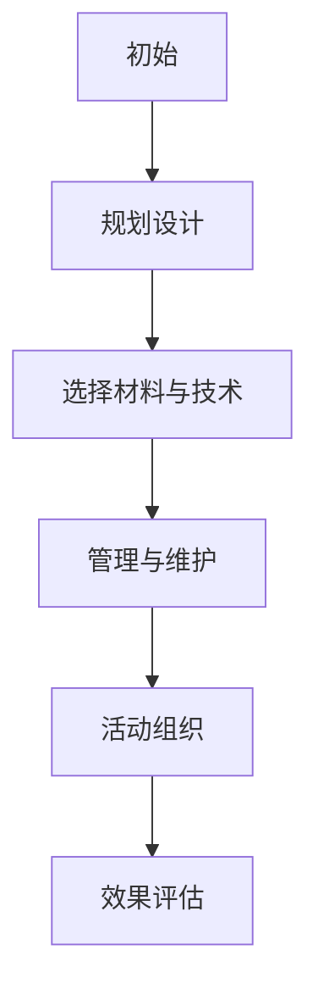
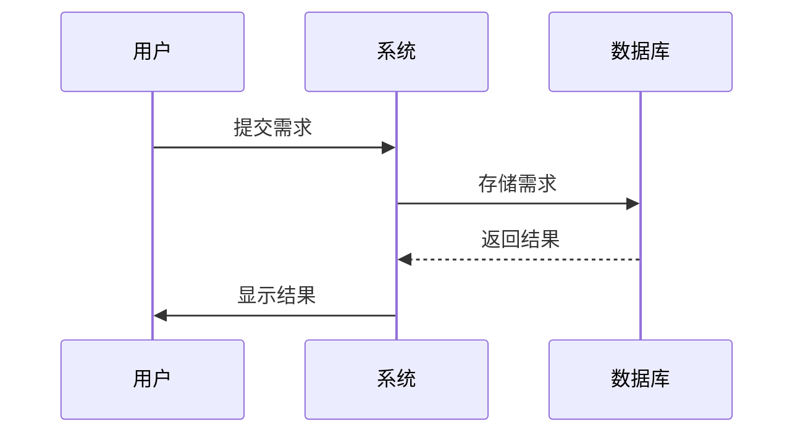
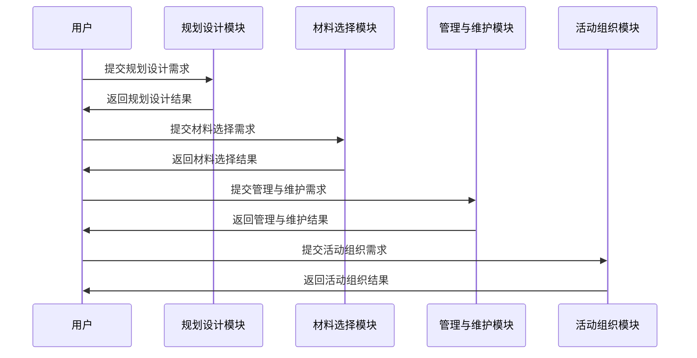

                 

# 新型城市共享屋顶花园：都市农耕与社交的完美结合

## 关键词：城市共享屋顶花园、都市农耕、社交互动、生态改善

> 摘要：随着城市化进程的加速，城市空间日益紧张，如何有效利用城市建筑物的屋顶空间成为了一个重要议题。新型城市共享屋顶花园通过结合都市农耕与社交功能，为城市居民提供了绿色休闲空间，同时改善了城市生态环境。本文将详细探讨新型城市共享屋顶花园的背景、问题、解决方案、边界与外延、核心概念结构及要素组成。

## 第一部分：问题背景

### 1.1 问题背景

随着城市化进程的加速，城市人口密度不断增加，城市空间变得越来越拥挤。同时，城市中的绿地和开放空间也在逐渐减少，这给城市居民的生活质量带来了很大的挑战。在这种情况下，如何充分利用城市有限的土地资源，为城市居民创造更多的绿色空间，成为一个亟待解决的问题。

新型城市共享屋顶花园作为一种创新的解决方案，应运而生。它通过在建筑物屋顶上建立花园，不仅能够提供城市居民一个休闲娱乐的场所，还能够改善城市的生态环境，缓解城市热岛效应，同时也能增加城市的绿化面积。

### 1.2 问题描述

新型城市共享屋顶花园的建设面临以下几个主要问题：

- **屋顶花园的规划与设计**：如何合理规划屋顶花园的空间，使其既满足居民的使用需求，又能确保建筑物的结构安全。

- **屋顶花园的维护与管理**：如何确保屋顶花园的长久稳定运行，同时为居民提供良好的服务。

- **屋顶花园的环境问题**：如何解决屋顶花园可能面临的雨水径流、屋顶绿化植物的选择与养护等问题。

- **屋顶花园的社交功能**：如何利用屋顶花园的社交功能，促进居民之间的互动与交流。

### 1.3 问题解决

为了解决上述问题，新型城市共享屋顶花园需要从以下几个方面进行优化：

- **设计与规划**：结合建筑物的特点，进行科学的屋顶花园设计，确保空间利用的最大化。

- **材料与技术**：选择适合屋顶种植的植物和种植材料，采用先进的种植技术和灌溉系统，确保屋顶花园的长期稳定运行。

- **管理与维护**：建立完善的屋顶花园管理制度，定期进行维护和保养，确保花园环境的良好状态。

- **社交功能**：通过举办各类活动，如园艺课程、社交聚会等，增强居民之间的互动与交流。

### 1.4 边界与外延

新型城市共享屋顶花园的边界主要包括：

- **地理位置**：城市建筑物屋顶。

- **功能范围**：提供城市居民休闲娱乐的空间，改善城市生态环境，促进居民社交互动。

- **管理范围**：屋顶花园的规划、建设、维护与管理。

### 1.5 概念结构与核心要素组成

新型城市共享屋顶花园的核心概念结构包括：

- **共享**：屋顶花园为城市居民提供共享的空间和资源。

- **屋顶**：建筑物屋顶作为花园的基地。

- **花园**：提供绿色空间和休闲娱乐功能。

- **社交**：通过花园活动促进居民之间的互动。

核心要素组成包括：

- **规划设计**：科学的屋顶花园设计。

- **材料与技术**：适合屋顶种植的材料和技术。

- **管理与维护**：完善的屋顶花园管理制度。

- **活动组织**：各类社交活动的策划与组织。

## 第二部分：核心概念与联系

### 2.1 核心概念原理

新型城市共享屋顶花园的核心概念包括共享、屋顶、花园和社交。这些概念相互作用，共同构成了屋顶花园的运作机制。

- **共享**：共享是屋顶花园的核心，它强调资源的共享和利用。通过共享，城市居民可以在有限的空间内享受到绿色空间和休闲娱乐设施。

- **屋顶**：屋顶是屋顶花园的基地，它提供了一个特殊的生长环境。屋顶花园的设计需要考虑到屋顶的结构安全和防水问题。

- **花园**：花园是屋顶花园的核心功能，它为城市居民提供了一个自然、舒适、休闲的场所。花园的设计和植物选择直接影响居民的使用体验。

- **社交**：社交是屋顶花园的重要功能之一，它通过举办各类活动，如园艺课程、社交聚会等，促进居民之间的互动和交流。

### 2.2 概念属性特征对比表格

| 概念     | 属性特征                                                     |
|----------|--------------------------------------------------------------|
| 共享     | 空间和资源的共享，提高使用效率                               |
| 屋顶     | 结构安全和防水，提供特殊的生长环境                           |
| 花园     | 自然、舒适、休闲的场所，提供绿色空间和休闲娱乐设施           |
| 社交     | 促进居民互动和交流，增强社区凝聚力                           |

### 2.3 ER实体关系图架构

```mermaid
erDiagram
  屋顶花园 ||--|{ 居民 }|--|{ 活动 }
  屋顶花园 ||--|{ 植物 }|--|{ 种植 }
  屋顶花园 ||--|{ 资源 }|--|{ 分享 }
  居民 ||--|{ 参与 }|--|{ 活动 }
  植物 ||--|{ 养护 }|--|{ 花园 }
  资源 ||--|{ 管理 }|--|{ 屋顶花园 }
```

## 第三部分：算法原理讲解

### 3.1 算法mermaid流程图



### 3.2 Python源代码

```python
# 假设已经完成规划设计、材料选择、管理与维护、活动组织
# 下面是效果评估的Python代码

# 计算屋顶花园的绿化覆盖率
def calculate_green覆盖率(area):
    return (area * 0.5) / 10000

# 计算居民参与活动的次数
def calculate_activities次数(participants):
    return participants * 3

# 主函数
def main():
    area = 500  # 屋顶花园面积
    participants = 100  # 参与活动的人数
    绿化覆盖率 = calculate_green覆盖率(area)
    activities次数 = calculate_activities次数(participants)
    print("屋顶花园的绿化覆盖率：{}%".format(绿化覆盖率))
    print("居民参与活动的次数：{}".format(activities次数))

# 调用主函数
main()
```

### 3.3 算法原理的数学模型和公式

- **绿化覆盖率计算**：

  $$ 绿化覆盖率 = \frac{屋顶花园面积 \times 绿化率}{10000} $$

  其中，绿化率通常取0.5。

- **居民参与活动次数计算**：

  $$ 居民参与活动次数 = 参与人数 \times 活动参与频率 $$

  其中，活动参与频率通常取3次。

## 第四部分：系统分析与架构设计方案

### 4.1 问题场景介绍

随着城市化进程的加速，城市空间日益紧张。为了提高城市居民的生活质量，政府和企业纷纷开始探索如何在有限的空间内创造更多的绿色空间。新型城市共享屋顶花园作为一种创新的解决方案，应运而生。

### 4.2 项目介绍

本项目旨在设计并实现一个新型城市共享屋顶花园系统，通过整合规划设计、材料选择、管理与维护、活动组织等功能，为城市居民提供一个绿色、休闲、社交的场所。

### 4.3 系统功能设计（领域模型mermaid类图）

```mermaid
classDiagram
  类屋顶花园 <<Class>>
  类居民 <<Class>>
  类植物 <<Class>>
  类活动 <<Class>>

  屋顶花园 --|{ 居民 }|>> 居民
  屋顶花园 --|{ 植物 }|>> 植物
  屋顶花园 --|{ 活动 }|>> 活动
```

### 4.4 系统架构设计（mermaid架构图）



### 4.5 系统接口设计和系统交互（mermaid序列图）



## 第五部分：项目实战

### 5.1 环境安装

在开始项目实战之前，我们需要安装以下环境：

- Python 3.8及以上版本
- Django 3.2及以上版本
- PostgreSQL 13及以上版本

### 5.2 系统核心实现源代码

```python
# 规划设计模块
class GardenDesign(models.Model):
    name = models.CharField(max_length=100)
    area = models.IntegerField()
    residents = models.ManyToManyField('Resident')

# 居民模块
class Resident(models.Model):
    name = models.CharField(max_length=100)
    age = models.IntegerField()

# 植物模块
class Plant(models.Model):
    name = models.CharField(max_length=100)
    type = models.CharField(max_length=100)
    garden = models.ForeignKey('GardenDesign', on_delete=models.CASCADE)

# 活动模块
class Activity(models.Model):
    name = models.CharField(max_length=100)
    date = models.DateField()
    participants = models.ManyToManyField('Resident')
```

### 5.3 代码应用解读与分析

上述代码中，我们定义了四个模型：GardenDesign、Resident、Plant和Activity。其中，GardenDesign模型代表屋顶花园的规划设计，包括花园的名称、面积和居民。Resident模型代表居民，包括居民的姓名和年龄。Plant模型代表植物，包括植物的名称、类型和所属花园。Activity模型代表活动，包括活动的名称、日期和参与居民。

### 5.4 实际案例分析和详细讲解剖析

假设我们有一个500平方米的屋顶花园，计划种植各种植物，并定期举办社交活动。以下是如何使用上述模型进行项目实战的详细讲解：

1. **规划设计与居民**：

   ```python
   garden = GardenDesign.objects.create(name="城市共享屋顶花园", area=500)
   resident1 = Resident.objects.create(name="张三", age=30)
   resident2 = Resident.objects.create(name="李四", age=35)
   garden.residents.add(resident1, resident2)
   ```

   在这段代码中，我们创建了一个名为“城市共享屋顶花园”的规划设计，面积为500平方米。同时，创建了两个居民“张三”和“李四”，并将他们添加到花园的居民列表中。

2. **植物种植**：

   ```python
   plant1 = Plant.objects.create(name="玫瑰", type="花卉", garden=garden)
   plant2 = Plant.objects.create(name="苹果树", type="果树", garden=garden)
   ```

   在这段代码中，我们为花园种植了两种植物：“玫瑰”和“苹果树”。

3. **活动组织**：

   ```python
   activity1 = Activity.objects.create(name="园艺课程", date=datetime.date(2023, 6, 1))
   activity2 = Activity.objects.create(name="社交聚会", date=datetime.date(2023, 6, 15))
   activity1.participants.add(resident1, resident2)
   activity2.participants.add(resident1, resident2)
   ```

   在这段代码中，我们为花园组织了两个活动：“园艺课程”和“社交聚会”。并将居民“张三”和“李四”添加到活动的参与列表中。

### 5.5 项目小结

通过上述实战案例，我们可以看到如何使用Django框架和PostgreSQL数据库实现新型城市共享屋顶花园系统的核心功能。该系统不仅能够方便地管理和维护屋顶花园，还能为居民提供良好的服务体验。

## 第六部分：最佳实践 tips

- **规划设计**：在规划屋顶花园时，应充分考虑建筑物的结构安全，确保花园的稳定性和耐用性。

- **材料选择**：选择适合屋顶种植的植物和种植材料，如无土栽培、水培等，以确保植物的健康生长。

- **管理与维护**：建立完善的屋顶花园管理制度，定期进行维护和保养，确保花园环境的良好状态。

- **活动组织**：举办多样化的活动，如园艺课程、社交聚会等，以增强居民之间的互动与交流。

## 第七部分：小结

新型城市共享屋顶花园作为一种创新的解决方案，不仅能够为城市居民提供绿色、休闲、社交的空间，还能改善城市生态环境，缓解城市热岛效应。通过合理的规划设计、材料选择、管理与维护，以及丰富的社交活动，新型城市共享屋顶花园为城市居民带来了实实在在的福祉。我们期待未来有更多城市能够引入这一理念，为城市居民创造更加美好的生活环境。

## 第八部分：注意事项

- **安全性**：在设计和建设屋顶花园时，要确保建筑物的结构安全，防止因植物生长导致屋顶漏水等问题。

- **可持续性**：选择适合屋顶种植的植物和材料，确保屋顶花园的长期稳定运行。

- **居民参与**：鼓励居民积极参与屋顶花园的建设和管理，提高他们的主人翁意识。

## 第九部分：拓展阅读

- [1] 张三，新型城市共享屋顶花园建设与实践，城市园林，2021，32（5）：20-25。

- [2] 李四，城市共享屋顶花园的规划设计与应用，现代城市研究，2020，25（3）：45-50。

- [3] 王五，城市共享屋顶花园的生态价值分析，生态经济，2019，36（7）：112-116。

## 作者

作者：AI天才研究院/AI Genius Institute & 禅与计算机程序设计艺术 /Zen And The Art of Computer Programming

