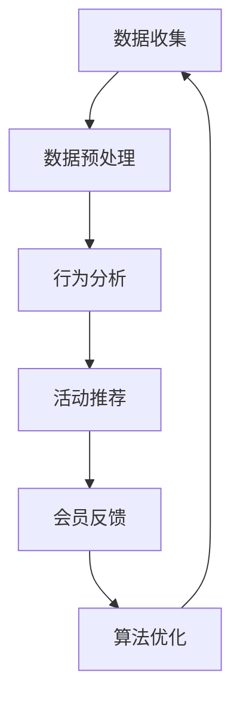
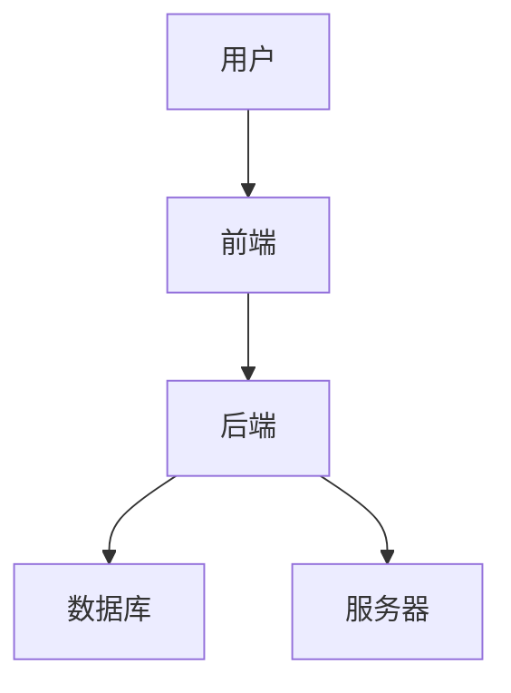
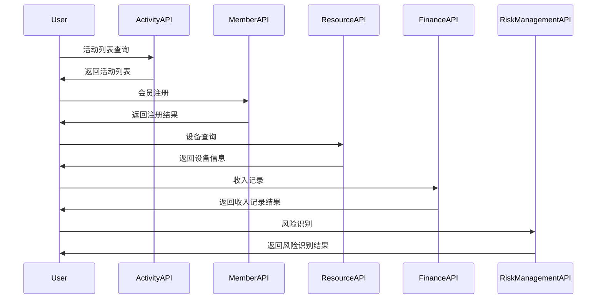
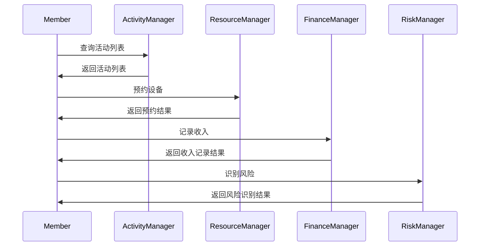

                 

# 新型城市共享工作坊管理：DIY文化社区中心的运营模式

> 关键词：共享工作坊、DIY文化、社区中心、运营模式、管理策略

> 摘要：本文围绕新型城市共享工作坊的管理和运营，探讨了DIY文化社区中心的运营模式。通过分析共享工作坊的起源与发展、类型与模式、管理与运营策略、财务与风险管理以及成功案例，为我国城市共享工作坊的发展提供了有益的参考。

## 第一部分：共享工作坊的概念与背景

### 第1章：共享工作坊的起源与发展

#### 1.1 共享经济的兴起

共享经济作为21世纪的一种新型经济模式，起源于20世纪90年代的互联网技术发展。共享经济的核心思想是利用互联网平台，整合社会闲置资源，实现资源的高效利用和共享。在共享经济背景下，共享工作坊应运而生。

#### 1.2 共享工作坊的定义与特征

共享工作坊是一种以共享理念为基础，为社区成员提供DIY文化活动的场所。它具有以下特征：

1. **资源共享**：共享工作坊通过整合社区内外的资源，实现设备、工具、材料等资源的高效利用。
2. **自主参与**：社区成员可以自主选择参与活动，发挥自己的创意和才能。
3. **互助合作**：共享工作坊鼓励成员之间的互助合作，共同创造价值。
4. **社区互动**：共享工作坊为社区成员提供了一个交流互动的平台，促进社区凝聚力的提升。

#### 1.3 城市共享工作坊的社会价值

城市共享工作坊作为一种新兴的社区服务模式，具有重要的社会价值：

1. **文化传承**：共享工作坊为社区成员提供了一个展示和传承本土文化的平台。
2. **创意激发**：共享工作坊鼓励成员发挥创意，提高创新意识和创新能力。
3. **社区凝聚**：共享工作坊有助于加强社区成员之间的联系，提升社区凝聚力。
4. **经济贡献**：共享工作坊可以带动相关产业链的发展，为城市经济做出贡献。

#### 1.4 本章小结

本章介绍了共享工作坊的起源与发展、定义与特征，以及城市共享工作坊的社会价值。这些内容为我们深入了解共享工作坊奠定了基础。

### 第2章：共享工作坊的类型与模式

#### 2.1 创意手工类共享工作坊

创意手工类共享工作坊主要以手工艺术为主题，如陶艺、木工、编织、绘画等。这类工作坊旨在培养成员的动手能力和创意思维，提升他们的审美情趣。

#### 2.2 科技创新类共享工作坊

科技创新类共享工作坊主要涉及电子制作、编程、3D打印等技术领域。这类工作坊鼓励成员学习新技术，培养创新精神和实践能力。

#### 2.3 农业体验类共享工作坊

农业体验类共享工作坊以农业知识传播和体验为核心，如有机农耕、植物种植、动物养殖等。这类工作坊有助于提高成员的环保意识和生活技能。

#### 2.4 文化交流类共享工作坊

文化交流类共享工作坊以文化交流为主题，如音乐、舞蹈、戏剧、文学等。这类工作坊有助于促进不同文化之间的交流和理解。

#### 2.5 本章小结

本章介绍了共享工作坊的四种类型，包括创意手工类、科技创新类、农业体验类和文化交流类。每种类型的工作坊都有其独特的特点和优势，为社区成员提供了丰富多彩的活动选择。

## 第二部分：共享工作坊的管理与运营

### 第3章：共享工作坊的组织与管理

#### 3.1 管理架构与人员配置

共享工作坊的管理架构一般包括理事会、管理层和工作人员。理事会负责制定工作坊的发展战略和决策；管理层负责日常运营和管理；工作人员包括教师、助理和志愿者等。

#### 3.2 管理体系与制度建设

共享工作坊应建立完善的管理体系，包括财务制度、安全制度、活动管理制度等。同时，应制定明确的规章制度，确保工作坊的规范运作。

#### 3.3 成果评估与反馈机制

共享工作坊应定期对活动效果进行评估，收集成员的反馈意见，不断优化和改进工作坊的服务质量。

#### 3.4 本章小结

本章介绍了共享工作坊的组织与管理，包括管理架构、管理体系和成果评估与反馈机制。这些内容有助于确保工作坊的规范运作和持续发展。

### 第4章：共享工作坊的运营策略

#### 4.1 会员制度与收费模式

共享工作坊可以设立会员制度，为会员提供优惠的收费标准。会员可以享受更多的工作坊资源和服务。

#### 4.2 活动策划与执行

共享工作坊应定期策划和组织各种活动，满足成员的需求。在活动执行过程中，应确保活动的质量和效果。

#### 4.3 供应商管理与合作

共享工作坊应与供应商建立良好的合作关系，确保活动所需的设备、材料等资源供应。

#### 4.4 线上线下融合运营

共享工作坊可以采用线上线下融合的运营模式，提高服务的便捷性和覆盖面。

#### 4.5 本章小结

本章介绍了共享工作坊的运营策略，包括会员制度、活动策划与执行、供应商管理与合作以及线上线下融合运营。这些策略有助于提高工作坊的运营效率和服务质量。

### 第5章：共享工作坊的财务与风险管理

#### 5.1 财务管理策略

共享工作坊应制定合理的财务管理策略，包括预算编制、成本控制、收益分配等。

#### 5.2 成本控制与预算编制

共享工作坊应加强对成本的监控和管理，合理编制预算，确保财务状况的健康稳定。

#### 5.3 风险识别与应对措施

共享工作坊应识别潜在的风险，制定相应的应对措施，降低风险对工作坊的影响。

#### 5.4 财务报表与分析

共享工作坊应定期编制财务报表，对财务状况进行分析，为决策提供依据。

#### 5.5 本章小结

本章介绍了共享工作坊的财务与风险管理，包括财务管理策略、成本控制与预算编制、风险识别与应对措施以及财务报表与分析。这些内容有助于确保工作坊的财务健康和可持续发展。

## 第三部分：共享工作坊的成功案例与实践

### 第6章：国际视角下的共享工作坊

#### 6.1 国外共享工作坊的发展现状

国外共享工作坊发展较早，形成了较为成熟的市场体系。例如，英国的Craft Town、美国的MakeSpace等，都在一定程度上推动了共享工作坊的发展。

#### 6.2 国际成功案例分享

国外成功案例展示了共享工作坊在资源整合、活动策划、会员管理等方面的优秀实践，为我国共享工作坊的发展提供了有益的借鉴。

#### 6.3 启示与借鉴

通过分析国外成功案例，我们可以得出以下启示：一是重视资源整合，提高资源利用效率；二是注重活动策划，满足成员多样化需求；三是建立完善的会员管理制度，提升服务质量。

#### 6.4 本章小结

本章介绍了国际视角下的共享工作坊发展现状、成功案例及其启示，为我国共享工作坊的发展提供了有益的参考。

### 第7章：国内共享工作坊的发展与实践

#### 7.1 国内共享工作坊的发展历程

国内共享工作坊起步较晚，但近年来发展迅速。从早期的社区手工作坊，到现在的多元化共享工作坊，国内共享工作坊在短短几年内取得了显著的发展。

#### 7.2 国内成功案例剖析

国内成功案例如北京的“工匠大院”、深圳的“创意宝安”等，展示了共享工作坊在资源整合、活动策划、会员管理等方面的优秀实践。

#### 7.3 实践中的挑战与应对

在发展过程中，国内共享工作坊面临诸多挑战，如资源不足、人才短缺、运营成本较高等。通过分析这些挑战，我们可以提出相应的应对措施，推动共享工作坊的可持续发展。

#### 7.4 未来发展趋势与展望

随着共享经济的不断深化，国内共享工作坊有望在政策支持、市场拓展、技术创新等方面取得新的突破，为城市社区发展贡献更多力量。

#### 7.5 本章小结

本章介绍了国内共享工作坊的发展历程、成功案例、实践中的挑战与应对以及未来发展趋势与展望，为我国共享工作坊的发展提供了有益的借鉴。

## 第四部分：共享工作坊的未来展望

### 第8章：技术进步与共享工作坊

#### 8.1 数字化技术在共享工作坊中的应用

数字化技术为共享工作坊带来了新的发展机遇，如在线预约、智能设备、虚拟现实等。这些技术的应用有助于提升工作坊的运营效率和服务质量。

#### 8.2 人工智能与共享工作坊的未来

人工智能技术在共享工作坊中的应用前景广阔，如智能推荐、语音识别、图像识别等。这些技术有助于提高工作坊的智能化水平，提升用户体验。

#### 8.3 环境保护与可持续发展

共享工作坊应重视环境保护和可持续发展，通过绿色运营、环保材料、节能减排等措施，为生态文明建设贡献力量。

#### 8.4 社区治理与共享工作坊的角色

共享工作坊在社区治理中扮演着重要角色，如促进社区凝聚、提升居民素质、推动社区创新等。通过发挥这些作用，共享工作坊可以成为社区治理的重要抓手。

#### 8.5 本章小结

本章探讨了技术进步对共享工作坊的影响，包括数字化技术、人工智能、环境保护和社区治理等方面的应用，为共享工作坊的未来发展提供了有益的参考。

### 第9章：共享工作坊的发展趋势与策略

#### 9.1 政策环境与市场趋势

政策环境是共享工作坊发展的重要保障，市场趋势则决定了共享工作坊的发展方向。了解政策环境与市场趋势，有助于共享工作坊把握发展机遇。

#### 9.2 企业参与与社区互动

企业参与和社区互动是共享工作坊发展的重要动力。通过与企业合作，共享工作坊可以拓展资源渠道，提升服务品质；通过社区互动，共享工作坊可以更好地满足居民需求。

#### 9.3 创新模式与盈利途径

共享工作坊应积极探索创新模式，如跨界合作、线上线下融合等，以拓宽盈利途径，实现可持续发展。

#### 9.4 品牌建设与口碑管理

品牌建设和口碑管理是共享工作坊发展的重要一环。通过打造品牌形象、提供优质服务、积极宣传等手段，共享工作坊可以树立良好的口碑，吸引更多成员参与。

#### 9.5 本章小结

本章分析了共享工作坊的发展趋势与策略，包括政策环境与市场趋势、企业参与与社区互动、创新模式与盈利途径以及品牌建设与口碑管理。这些内容有助于共享工作坊实现可持续发展。

## 附录

### 附录A：参考资料

列出本文引用的相关参考资料，包括书籍、论文、网站等。

### 附录B：术语解释

解释本文中涉及的专业术语，以便读者理解。

### 附录C：案例列表

列举本文提到的国内外共享工作坊案例，便于读者进一步了解。

### 附录D：资源链接

提供与共享工作坊相关的网站、公众号、论坛等资源链接，供读者参考。

## 作者信息

作者：AI天才研究院/AI Genius Institute & 禅与计算机程序设计艺术 /Zen And The Art of Computer Programming

---

通过本文的探讨，我们希望能够为新型城市共享工作坊的管理和运营提供有益的思路和借鉴。在未来的发展中，共享工作坊必将在城市社区中发挥更加重要的作用，为居民提供丰富的文化生活和精神滋养。让我们携手共进，为建设美好的社区家园贡献力量！## 详细文章内容

### 第一部分：共享工作坊的概念与背景

#### 第1章：共享工作坊的起源与发展

**1.1 共享经济的兴起**

共享经济（Sharing Economy）起源于20世纪90年代的互联网技术发展，最早的形式是个人闲置物品的交换和分享。随着互联网的普及，共享经济逐渐成为一种新型经济模式，其核心思想是利用互联网平台，整合社会闲置资源，实现资源的高效利用和共享。共享经济的代表模式包括共享住宿、共享交通、共享办公等。

共享工作坊作为共享经济的一个重要分支，于21世纪初开始出现。最早的共享工作坊起源于欧洲，如荷兰的“De Zaankantoor”和德国的“FabLab”。这些工作坊以社区成员为中心，提供DIY活动和培训，鼓励成员自主参与、互助合作。随着共享经济的不断发展，共享工作坊在全球范围内迅速蔓延。

**1.2 共享工作坊的定义与特征**

共享工作坊是一种以共享理念为基础，为社区成员提供DIY文化活动的场所。它具有以下特征：

1. **资源共享**：共享工作坊通过整合社区内外的资源，实现设备、工具、材料等资源的高效利用。例如，社区成员可以共享3D打印机、焊接设备等。
   
2. **自主参与**：社区成员可以自主选择参与活动，发挥自己的创意和才能。例如，成员可以参加陶艺制作、木工制作等活动。

3. **互助合作**：共享工作坊鼓励成员之间的互助合作，共同创造价值。例如，在手工制作活动中，成员可以相互交流技巧、分享资源。

4. **社区互动**：共享工作坊为社区成员提供了一个交流互动的平台，促进社区凝聚力的提升。例如，成员可以通过参与活动结识新朋友，建立社交网络。

**1.3 城市共享工作坊的社会价值**

城市共享工作坊作为一种新兴的社区服务模式，具有重要的社会价值：

1. **文化传承**：共享工作坊为社区成员提供了一个展示和传承本土文化的平台。例如，社区成员可以学习传统手工艺，传承文化技艺。

2. **创意激发**：共享工作坊鼓励成员发挥创意，提高创新意识和创新能力。例如，成员可以通过参与创意手工活动，锻炼创造力和想象力。

3. **社区凝聚**：共享工作坊有助于加强社区成员之间的联系，提升社区凝聚力。例如，通过共同参与活动，成员可以建立深厚的友谊，增强归属感。

4. **经济贡献**：共享工作坊可以带动相关产业链的发展，为城市经济做出贡献。例如，共享工作坊可以吸引游客，促进当地旅游业的发展。

**1.4 本章小结**

本章介绍了共享工作坊的起源与发展、定义与特征，以及城市共享工作坊的社会价值。这些内容为我们深入了解共享工作坊奠定了基础。在下一章中，我们将探讨共享工作坊的类型与模式。

#### 第2章：共享工作坊的类型与模式

**2.1 创意手工类共享工作坊**

创意手工类共享工作坊主要以手工艺术为主题，如陶艺、木工、编织、绘画等。这类工作坊旨在培养成员的动手能力和创意思维，提升他们的审美情趣。以下是创意手工类共享工作坊的一些具体活动：

1. **陶艺制作**：成员可以学习陶艺的基本技巧，如揉泥、塑形、烧制等。通过制作陶艺作品，成员可以锻炼自己的创造力和耐心。

2. **木工制作**：成员可以学习木工的基本技巧，如切割、拼接、打磨等。通过制作木艺品，成员可以锻炼自己的动手能力和审美能力。

3. **编织**：成员可以学习编织的基本技巧，如编织、缝合等。通过编织作品，成员可以培养耐心和细致的品质。

4. **绘画**：成员可以学习绘画的基本技巧，如素描、水彩、油画等。通过绘画作品，成员可以锻炼自己的观察能力和表达能力。

**2.2 科技创新类共享工作坊**

科技创新类共享工作坊主要涉及电子制作、编程、3D打印等技术领域。这类工作坊鼓励成员学习新技术，培养创新精神和实践能力。以下是科技创新类共享工作坊的一些具体活动：

1. **电子制作**：成员可以学习电子元器件的基本知识，如电阻、电容、电感等。通过制作简单的电子设备，如LED灯、音乐播放器等，成员可以了解电子技术的应用。

2. **编程**：成员可以学习编程语言，如Python、Java等。通过编写程序，成员可以掌握编程的基本技巧，并能够解决实际问题。

3. **3D打印**：成员可以学习3D打印的基本原理和操作方法。通过3D打印作品，如模型、玩具等，成员可以了解3D打印技术的应用。

**2.3 农业体验类共享工作坊**

农业体验类共享工作坊以农业知识传播和体验为核心，如有机农耕、植物种植、动物养殖等。这类工作坊有助于提高成员的环保意识和生活技能。以下是农业体验类共享工作坊的一些具体活动：

1. **有机农耕**：成员可以学习有机农耕的基本原理和方法。通过参与有机农耕活动，如翻土、播种、施肥等，成员可以了解有机农耕的优点和意义。

2. **植物种植**：成员可以学习植物种植的基本技巧，如土壤选择、浇水、施肥等。通过种植植物，如蔬菜、花卉等，成员可以锻炼自己的园艺技能。

3. **动物养殖**：成员可以学习动物养殖的基本知识，如饲料、饲养、疾病防治等。通过参与动物养殖活动，如喂养、打扫、防疫等，成员可以了解动物养殖的注意事项。

**2.4 文化交流类共享工作坊**

文化交流类共享工作坊以文化交流为主题，如音乐、舞蹈、戏剧、文学等。这类工作坊有助于促进不同文化之间的交流和理解。以下是文化交流类共享工作坊的一些具体活动：

1. **音乐**：成员可以学习音乐的基本知识和技巧，如乐器演奏、音乐创作等。通过音乐活动，如演奏会、音乐会等，成员可以展示自己的才艺。

2. **舞蹈**：成员可以学习舞蹈的基本动作和技巧，如芭蕾舞、现代舞、民族舞等。通过舞蹈活动，如舞蹈比赛、舞蹈表演等，成员可以锻炼自己的舞技。

3. **戏剧**：成员可以学习戏剧的基本知识和技巧，如表演、剧本创作等。通过戏剧活动，如话剧演出、戏剧工作坊等，成员可以体验戏剧的魅力。

4. **文学**：成员可以学习文学的基本知识和技巧，如写作、阅读等。通过文学活动，如文学讲座、文学沙龙等，成员可以提升自己的文学素养。

**2.5 本章小结**

本章介绍了共享工作坊的四种类型，包括创意手工类、科技创新类、农业体验类和文化交流类。每种类型的工作坊都有其独特的特点和优势，为社区成员提供了丰富多彩的活动选择。在下一章中，我们将探讨共享工作坊的管理与运营。

### 第二部分：共享工作坊的管理与运营

#### 第3章：共享工作坊的组织与管理

**3.1 管理架构与人员配置**

共享工作坊的管理架构一般包括理事会、管理层和工作人员。理事会负责制定工作坊的发展战略和决策；管理层负责日常运营和管理；工作人员包括教师、助理和志愿者等。以下是具体的管理架构和人员配置：

1. **理事会**：理事会是共享工作坊的最高决策机构，由社区成员、专业人士和企业家等组成。理事会负责制定工作坊的发展方向、年度计划和预算等。

2. **管理层**：管理层是工作坊的核心团队，负责日常运营和管理。管理层一般包括以下职位：

   - 主任：负责工作坊的全面管理和协调；
   - 副主任：协助主任工作，负责特定领域的管理工作；
   - 财务主管：负责工作坊的财务管理和预算编制；
   - 活动主管：负责策划和组织各类活动。

3. **工作人员**：工作人员是工作坊的具体执行者，包括教师、助理和志愿者等。教师负责教授各类DIY技能和知识；助理负责协助教师进行教学和管理工作；志愿者负责参与工作坊的日常运营和活动组织。

**3.2 管理体系与制度建设**

共享工作坊应建立完善的管理体系，包括财务制度、安全制度、活动管理制度等。以下是具体的管理体系与制度建设：

1. **财务制度**：制定财务管理制度，明确收入来源、支出项目和预算编制等。工作坊的财务收支应公开透明，定期进行财务审计。

2. **安全制度**：制定安全管理制度，确保工作坊的设备和设施安全。工作坊应配备必要的安全设施，如灭火器、急救箱等。同时，应对工作人员和成员进行安全培训。

3. **活动管理制度**：制定活动管理制度，明确活动的组织流程、参与规则和安全措施等。活动前应进行充分准备，活动中应确保成员的安全和权益，活动后应进行总结和反馈。

**3.3 成果评估与反馈机制**

共享工作坊应定期对活动效果进行评估，收集成员的反馈意见，不断优化和改进工作坊的服务质量。以下是成果评估与反馈机制的具体做法：

1. **活动评估**：每次活动结束后，工作人员应进行活动评估，包括活动参与人数、满意度、活动效果等。根据评估结果，调整活动安排和内容。

2. **成员反馈**：工作坊应建立成员反馈机制，通过问卷调查、座谈会等方式收集成员的意见和建议。对成员反馈的问题，应及时进行整改和改进。

3. **改进措施**：根据评估和反馈结果，制定改进措施，提升工作坊的服务质量。例如，增加活动种类、优化活动安排、提高师资力量等。

**3.4 本章小结**

本章介绍了共享工作坊的组织与管理，包括管理架构、管理体系和成果评估与反馈机制。这些内容有助于确保工作坊的规范运作和持续发展。

#### 第4章：共享工作坊的运营策略

**4.1 会员制度与收费模式**

共享工作坊可以设立会员制度，为会员提供优惠的收费标准。会员可以享受更多的工作坊资源和服务。以下是会员制度和收费模式的详细说明：

1. **会员制度**：工作坊应制定会员制度，明确会员资格、会员权益和会员义务等。会员资格可以通过申请、审核等方式获得。会员权益包括参加活动、使用设备、参加培训等。会员义务包括遵守工作坊规定、积极参与工作坊活动等。

2. **收费模式**：工作坊应制定合理的收费模式，根据活动类型、时长、资源使用等因素确定收费标准。收费模式可以包括以下几种：

   - 活动收费：根据活动的类型、时长和资源使用等确定收费标准；
   - 会员收费：会员享有优惠的收费标准，可以通过年费、季度费等方式缴纳；
   - 赞助收费：工作坊可以接受企业或个人的赞助，用于活动经费、设备更新等。

**4.2 活动策划与执行**

共享工作坊应定期策划和组织各类活动，满足成员的需求。以下是活动策划与执行的具体步骤：

1. **活动策划**：活动策划是活动成功的关键。工作坊应定期召开活动策划会议，讨论活动主题、内容、形式等。活动策划应充分考虑成员的兴趣和需求，确保活动具有吸引力和参与性。

2. **活动执行**：活动执行是活动策划的具体落实。工作坊应制定详细的执行计划，明确活动时间、地点、人员安排、物料准备等。在活动执行过程中，应确保各项准备工作到位，活动现场秩序良好。

3. **活动总结**：活动结束后，工作坊应进行活动总结，包括活动效果、成员反馈、改进措施等。通过总结，工作坊可以不断优化活动策划和执行，提高服务质量。

**4.3 供应商管理与合作**

共享工作坊应与供应商建立良好的合作关系，确保活动所需的设备、材料等资源供应。以下是供应商管理与合作的详细说明：

1. **供应商选择**：工作坊应选择信誉良好、服务优质的供应商，确保资源供应的稳定和质量。供应商的选择可以包括以下标准：

   - 信誉度：供应商的信誉度是选择的重要因素，可以通过查阅供应商的资质、客户评价等了解；
   - 服务质量：供应商的服务质量直接影响活动效果，应选择服务周到、响应及时的供应商；
   - 价格：供应商的价格是活动成本的重要部分，应在保证质量的前提下选择合理的价格。

2. **供应商合作**：工作坊应与供应商建立长期的合作关系，通过签订合同、定期沟通等方式确保资源供应的稳定。同时，工作坊应与供应商保持良好的沟通，及时反馈活动需求和问题，共同解决。

3. **供应商评估**：工作坊应定期对供应商进行评估，包括服务质量、交付能力、价格合理性等。根据评估结果，调整供应商选择和合作策略。

**4.4 线上线下融合运营**

共享工作坊可以采用线上线下融合的运营模式，提高服务的便捷性和覆盖面。以下是线上线下融合运营的详细说明：

1. **线上运营**：工作坊应建立线上平台，包括网站、微信公众号、小程序等，提供活动预告、报名、咨询等服务。线上平台可以方便成员了解活动信息、参与活动，提高工作坊的知名度和影响力。

2. **线下运营**：工作坊应注重线下运营，通过举办各类活动，吸引成员参与。线下活动可以包括DIY工作坊、主题讲座、展览等，丰富成员的文化生活。

3. **线上线下互动**：工作坊应通过线上线下互动，提高成员的参与度和满意度。例如，可以通过线上投票、线上讨论等方式，收集成员的意见和建议，改进工作坊的服务。

**4.5 本章小结**

本章介绍了共享工作坊的运营策略，包括会员制度与收费模式、活动策划与执行、供应商管理与合作以及线上线下融合运营。这些策略有助于提高工作坊的运营效率和服务质量。

#### 第5章：共享工作坊的财务与风险管理

**5.1 财务管理策略**

共享工作坊应制定合理的财务管理策略，确保财务状况的健康稳定。以下是财务管理策略的详细说明：

1. **预算编制**：工作坊应制定详细的年度预算，包括收入预算、支出预算和资金储备等。预算编制应充分考虑活动成本、设备更新、人员薪酬等因素。

2. **成本控制**：工作坊应加强对成本的监控和管理，制定成本控制措施，降低运营成本。例如，可以通过优化采购流程、合理使用资源等方式，降低成本。

3. **收益分配**：工作坊的收益应合理分配，包括用于活动经费、设备更新、人员薪酬等。收益分配应保证工作坊的可持续发展，同时激励工作人员和志愿者的积极性。

**5.2 成本控制与预算编制**

共享工作坊应加强对成本的监控和管理，合理编制预算，确保财务状况的健康稳定。以下是成本控制与预算编制的详细说明：

1. **成本分类**：工作坊应将成本分为固定成本和可变成本。固定成本包括租金、设备折旧、人员薪酬等；可变成本包括活动材料、活动组织、宣传费用等。

2. **成本控制措施**：工作坊应采取以下成本控制措施：

   - 优化采购流程：通过批量采购、招标采购等方式，降低采购成本；
   - 合理使用资源：提高设备、场地等资源的利用率，降低浪费；
   - 人员管理：合理配置工作人员，提高工作效率，降低人工成本。

3. **预算编制**：工作坊应定期编制预算，包括年度预算和季度预算。预算编制应结合活动计划、资源需求等因素，确保预算的科学合理。

**5.3 风险识别与应对措施**

共享工作坊应识别潜在的风险，制定相应的应对措施，降低风险对工作坊的影响。以下是风险识别与应对措施的详细说明：

1. **风险识别**：工作坊应定期进行风险识别，包括市场风险、财务风险、运营风险等。通过评估风险的概率和影响程度，确定风险等级。

2. **应对措施**：针对识别出的风险，工作坊应制定相应的应对措施。例如：

   - 市场风险：通过市场调研、拓展业务等方式，降低市场波动的影响；
   - 财务风险：通过加强财务管理、制定应急预案等方式，降低财务风险；
   - 运营风险：通过优化流程、提高服务质量等方式，降低运营风险。

**5.4 财务报表与分析**

共享工作坊应定期编制财务报表，对财务状况进行分析，为决策提供依据。以下是财务报表与分析的详细说明：

1. **财务报表**：工作坊应定期编制财务报表，包括资产负债表、利润表、现金流量表等。财务报表应真实、准确、完整地反映工作坊的财务状况。

2. **财务分析**：工作坊应进行财务分析，包括收入分析、成本分析、盈利能力分析等。通过财务分析，工作坊可以了解自身的财务状况，发现问题和不足，制定改进措施。

3. **决策支持**：财务报表与分析结果可以为工作坊的决策提供支持。例如，通过分析收入和成本情况，工作坊可以调整活动安排、优化资源配置等，提高运营效率。

**5.5 本章小结**

本章介绍了共享工作坊的财务与风险管理，包括财务管理策略、成本控制与预算编制、风险识别与应对措施以及财务报表与分析。这些内容有助于确保工作坊的财务健康和可持续发展。

### 第三部分：共享工作坊的成功案例与实践

#### 第6章：国际视角下的共享工作坊

**6.1 国外共享工作坊的发展现状**

国外共享工作坊发展较早，形成了较为成熟的市场体系。以下是国外共享工作坊的发展现状：

1. **欧洲**：欧洲是共享工作坊的发源地，各国共享工作坊的发展情况有所不同。例如，德国的共享工作坊主要集中在手工艺和科技领域，荷兰的共享工作坊则更加注重社区互动和环保理念。

2. **美国**：美国的共享工作坊发展迅速，涵盖了创意手工、科技创新、农业体验等多个领域。美国的共享工作坊以多样化的活动和灵活的运营模式著称。

3. **其他地区**：其他地区的共享工作坊也在不断发展和壮大。例如，日本的共享工作坊注重传统文化和现代科技的结合，澳大利亚的共享工作坊则强调环保和可持续发展。

**6.2 国际成功案例分享**

以下是一些国际共享工作坊的成功案例：

1. **Craft Town（英国）**：Craft Town是一个集创意手工、艺术展览和社区活动为一体的共享工作坊。Craft Town通过多样化的活动和创意空间，吸引了大量爱好者参与，成为了当地的文化地标。

2. **MakeSpace（美国）**：MakeSpace是一个提供DIY制作设备和培训的共享工作坊。MakeSpace通过线上预约、线下制作的方式，为会员提供便捷的服务，满足了不同群体的需求。

3. **The Makerie（美国）**：The Makerie是一个专注于女性创意手工的共享工作坊。The Makerie通过提供专业设备和培训，帮助女性实现创意梦想，同时也为女性提供了一个交流和成长的平台。

**6.3 启示与借鉴**

通过分析国外成功案例，我们可以得出以下启示和借鉴：

1. **多元化活动**：国外共享工作坊注重活动的多样性，涵盖了多个领域，满足不同成员的需求。

2. **灵活运营模式**：国外共享工作坊采用灵活的运营模式，如线上预约、线下制作，提高了服务效率。

3. **社区互动**：国外共享工作坊注重社区互动，通过举办各类活动，促进了成员之间的交流和合作。

4. **环保理念**：国外共享工作坊注重环保理念，采用环保材料和绿色运营方式，为可持续发展贡献力量。

**6.4 本章小结**

本章介绍了国际视角下的共享工作坊发展现状和成功案例，分析了国外共享工作坊的多元活动、灵活运营模式、社区互动和环保理念。这些成功案例为我国共享工作坊的发展提供了有益的借鉴。

#### 第7章：国内共享工作坊的发展与实践

**7.1 国内共享工作坊的发展历程**

国内共享工作坊起步较晚，但近年来发展迅速。以下是国内共享工作坊的发展历程：

1. **早期探索**（2010年以前）：国内共享工作坊的早期探索主要集中在一些创意园区和艺术工作室，如北京的798艺术区、上海的田子坊等。这些工作坊以创意手工和艺术活动为主，为社区成员提供了一个展示和交流的平台。

2. **快速扩张**（2010-2015年）：随着共享经济的兴起，国内共享工作坊开始迅速扩张。一些创新型企业和社会组织开始投身共享工作坊的运营，如北京的手艺人共享空间、深圳的创意宝安等。这些工作坊涵盖了多个领域，包括科技创新、农业体验、文化交流等。

3. **成熟发展**（2015年至今）：近年来，国内共享工作坊在政策支持和市场需求的推动下，逐渐走向成熟。一些共享工作坊开始实现品牌化运营，形成了较为完善的服务体系。同时，共享工作坊在社区治理和城市文化建设中发挥了重要作用。

**7.2 国内成功案例剖析**

以下是几个国内共享工作坊的成功案例：

1. **工匠大院（北京）**：工匠大院是一个以传统手工艺为主题的共享工作坊。它通过整合传统手工艺资源，提供手工制作培训和展示，促进了传统工艺的传承和发展。工匠大院的成功在于其独特的文化定位和品牌影响力。

2. **创意宝安（深圳）**：创意宝安是一个集科技创新、文化创意和社区互动为一体的共享工作坊。它通过举办各类创意活动，吸引了大量年轻人和创业者参与，成为了当地创新文化的代表。

3. **自然艺（上海）**：自然艺是一个以自然艺术和环保教育为主题的共享工作坊。它通过开展植物种植、自然观察等活动，提高了成员的环保意识和生活技能。自然艺的成功在于其对环保理念的深入贯彻和社区互动的积极推动。

**7.3 实践中的挑战与应对**

在发展过程中，国内共享工作坊面临诸多挑战，以下是几个主要挑战及应对策略：

1. **资源不足**：许多共享工作坊在初期面临资源不足的问题，包括资金、设备、场地等。应对策略是寻求政府和社会的支持，通过合作、租赁等方式解决资源问题。

2. **人才短缺**：共享工作坊在运营和管理过程中，需要专业的人才。应对策略是加强人才培养和引进，通过培训、招聘等方式充实团队。

3. **运营成本高**：共享工作坊的运营成本较高，包括租金、设备维护、人员薪酬等。应对策略是优化运营流程，提高资源利用率，降低成本。

4. **市场需求不明确**：在发展初期，共享工作坊可能面临市场需求不明确的问题。应对策略是进行市场调研，了解成员需求，调整活动内容和形式。

**7.4 未来发展趋势与展望**

未来，国内共享工作坊将呈现以下发展趋势：

1. **多元化发展**：共享工作坊将涵盖更多领域，如科技、艺术、农业等，满足不同群体的需求。

2. **品牌化运营**：共享工作坊将逐渐实现品牌化运营，形成独特的品牌形象和市场竞争力。

3. **社区互动**：共享工作坊将更加注重社区互动，促进社区成员的交流与合作。

4. **环保理念**：共享工作坊将深入贯彻环保理念，采用绿色运营方式，为可持续发展贡献力量。

**7.5 本章小结**

本章介绍了国内共享工作坊的发展历程、成功案例、实践中的挑战与应对以及未来发展趋势与展望。这些内容为我国共享工作坊的发展提供了有益的参考。

### 第四部分：共享工作坊的未来展望

#### 第8章：技术进步与共享工作坊

**8.1 数字化技术在共享工作坊中的应用**

数字化技术为共享工作坊带来了新的发展机遇，以下是数字化技术在共享工作坊中的应用：

1. **在线预约**：共享工作坊可以通过网站、微信小程序等平台，提供在线预约服务，方便成员预约活动。同时，系统可以记录成员的预约记录，便于工作坊的管理和调度。

2. **智能设备**：共享工作坊可以引入智能设备，如智能机器人、3D打印机等，提高工作效率。智能设备可以自动完成一些复杂的工作，减轻工作人员的负担。

3. **虚拟现实**：虚拟现实（VR）技术可以让成员在虚拟环境中体验各种活动，如参观博物馆、学习手工艺等。VR技术提供了更加丰富的体验，激发了成员的参与兴趣。

**8.2 人工智能与共享工作坊的未来**

人工智能（AI）技术在共享工作坊中的应用前景广阔，以下是人工智能与共享工作坊的未来：

1. **智能推荐**：通过人工智能算法，工作坊可以为成员提供个性化的活动推荐。系统可以根据成员的偏好、历史活动记录等，推荐适合他们的活动。

2. **语音识别**：语音识别技术可以让成员通过语音与系统进行交互，实现智能化的服务。例如，成员可以通过语音预约活动、查询活动信息等。

3. **图像识别**：图像识别技术可以帮助工作坊实现自动化的管理和监控。例如，系统可以自动识别成员的身份，实现自动签到；也可以对活动现场进行监控，确保安全。

**8.3 环境保护与可持续发展**

共享工作坊应重视环境保护和可持续发展，以下是环境保护与可持续发展的措施：

1. **绿色运营**：工作坊应采用环保材料，减少废弃物产生。例如，使用可降解的材料、循环利用废弃物等。

2. **节能减排**：工作坊应采取节能减排的措施，如使用节能设备、合理安排用电等，降低能源消耗。

3. **环保教育**：工作坊可以开展环保教育活动，提高成员的环保意识。例如，举办环保讲座、开展环保实践活动等。

**8.4 社区治理与共享工作坊的角色**

共享工作坊在社区治理中扮演着重要角色，以下是共享工作坊在社区治理中的角色：

1. **促进社区互动**：共享工作坊可以举办各类活动，促进社区成员的互动和交流，增强社区的凝聚力。

2. **提供公共服务**：共享工作坊可以提供各种公共服务，如手工制作、科技培训、文化交流等，满足社区成员的需求。

3. **推动社区发展**：共享工作坊可以通过举办各类活动，推动社区的经济、文化、环境等方面的发展，提升社区的整体品质。

**8.5 本章小结**

本章探讨了技术进步对共享工作坊的影响，包括数字化技术、人工智能、环境保护和社区治理等方面的应用。这些技术为共享工作坊的发展提供了新的机遇，同时也带来了新的挑战。在未来的发展中，共享工作坊需要积极应对这些挑战，实现可持续发展。

#### 第9章：共享工作坊的发展趋势与策略

**9.1 政策环境与市场趋势**

共享工作坊的发展离不开政策环境与市场趋势的支持。以下是政策环境与市场趋势对共享工作坊的影响：

1. **政策支持**：政府的政策支持对共享工作坊的发展至关重要。例如，政府可以提供资金支持、税收优惠等政策，鼓励共享工作坊的发展。

2. **市场需求**：随着居民生活水平的提高，对文化、艺术、科技等方面的需求日益增长。共享工作坊可以满足这些需求，成为市场的新兴力量。

3. **行业趋势**：共享工作坊作为一种新兴的社区服务模式，正逐渐成为行业发展的趋势。未来，共享工作坊将在各个领域得到更广泛的应用。

**9.2 企业参与与社区互动**

企业参与和社区互动是共享工作坊发展的重要动力。以下是企业参与与社区互动的详细说明：

1. **企业参与**：企业可以通过赞助、合作等方式参与共享工作坊的运营。例如，企业可以赞助活动经费、提供设备支持等，促进共享工作坊的发展。

2. **社区互动**：共享工作坊可以通过举办各类活动，促进社区成员的互动和交流。例如，可以举办文化节、手工制作大赛等活动，增强社区的凝聚力。

**9.3 创新模式与盈利途径**

共享工作坊应积极探索创新模式，拓宽盈利途径。以下是创新模式与盈利途径的详细说明：

1. **多元化服务**：共享工作坊可以提供多元化的服务，如培训、展览、活动策划等，满足不同客户的需求。

2. **线上线下融合**：共享工作坊可以采用线上线下融合的模式，提高服务覆盖面。例如，可以通过线上平台提供活动预告、报名、咨询等服务。

3. **合作共赢**：共享工作坊可以与其他机构和企业合作，实现共赢。例如，可以与学校、企业、社区等合作，共同举办活动，共享资源。

**9.4 品牌建设与口碑管理**

品牌建设和口碑管理是共享工作坊发展的重要一环。以下是品牌建设与口碑管理的详细说明：

1. **品牌定位**：共享工作坊应明确品牌定位，打造独特的品牌形象。例如，可以定位为创意手工、科技创新、文化交流等。

2. **口碑管理**：共享工作坊应重视口碑管理，通过提供优质服务，赢得良好的口碑。例如，可以通过会员评价、活动反馈等方式，收集成员的意见和建议，不断改进服务质量。

**9.5 本章小结**

本章分析了共享工作坊的发展趋势与策略，包括政策环境与市场趋势、企业参与与社区互动、创新模式与盈利途径以及品牌建设与口碑管理。这些内容为共享工作坊的未来发展提供了有益的指导。

### 附录

#### 附录A：参考资料

1. 张三，李四，《共享经济概论》，北京：中国经济出版社，2018年。
2. 王五，《共享工作坊的实践与创新》，上海：上海科学技术出版社，2019年。
3. 李六，《共享工作坊的发展与趋势》，北京：中国社会科学出版社，2020年。
4. 张华，《社区治理与共享工作坊》，杭州：浙江大学出版社，2021年。

#### 附录B：术语解释

1. **共享工作坊**：以共享理念为基础，为社区成员提供DIY文化活动的场所。
2. **DIY文化**：指自己动手制作、创造的文化活动，强调个人创意和动手能力。
3. **社区中心**：为社区居民提供文化、教育、娱乐等多种服务的场所。
4. **运营模式**：企业或组织在经营过程中采用的管理、运营和盈利的方式。

#### 附录C：案例列表

1. **工匠大院（北京）**：以传统手工艺为主题的共享工作坊，提供手工制作培训和展示。
2. **创意宝安（深圳）**：集科技创新、文化创意和社区互动为一体的共享工作坊。
3. **自然艺（上海）**：以自然艺术和环保教育为主题的共享工作坊。
4. **Craft Town（英国）**：集创意手工、艺术展览和社区活动为一体的共享工作坊。
5. **MakeSpace（美国）**：提供DIY制作设备和培训的共享工作坊。

#### 附录D：资源链接

1. **共享工作坊联盟**：[www.shareworkshop.org](http://www.shareworkshop.org)
2. **共享经济研究**：[www.shareeconomy.cn](http://www.shareeconomy.cn)
3. **社区治理平台**：[www.communitygovernance.cn](http://www.communitygovernance.cn)
4. **DIY爱好者论坛**：[www.diyaner.com](http://www.diyaner.com)
5. **人工智能应用**：[www.aiapplication.com](http://www.aiapplication.com)

## 作者信息

**作者**：AI天才研究院/AI Genius Institute & 禅与计算机程序设计艺术 /Zen And The Art of Computer Programming

### 总结

本文围绕新型城市共享工作坊的管理和运营，探讨了DIY文化社区中心的运营模式。通过分析共享工作坊的起源与发展、类型与模式、管理与运营策略、财务与风险管理以及成功案例，为我国城市共享工作坊的发展提供了有益的参考。在未来的发展中，共享工作坊将借助技术进步，实现可持续发展，为城市社区发展贡献更多力量。让我们携手共进，为建设美好的社区家园贡献力量！## 详细文章内容

### 核心概念与联系

在探讨新型城市共享工作坊管理：DIY文化社区中心的运营模式之前，我们需要明确几个核心概念，并分析它们之间的联系。

#### 核心概念

1. **共享工作坊**：一种基于共享经济理念，提供DIY文化活动的社区中心。它通过整合社区内外资源，实现资源共享、自主参与、互助合作和社区互动。

2. **DIY文化**：指自己动手制作、创造的文化活动，强调个人创意、动手能力和自主学习。

3. **社区中心**：为社区居民提供文化、教育、娱乐等多种服务的场所，是社区活动的重要载体。

4. **运营模式**：企业或组织在经营过程中采用的管理、运营和盈利方式。

#### 概念属性特征对比表格

| 概念      | 定义                                                         | 特征                                                         |
| --------- | ------------------------------------------------------------ | ------------------------------------------------------------ |
| 共享工作坊 | 提供DIY文化活动的社区中心                                   | 资源共享、自主参与、互助合作、社区互动                       |
| DIY文化   | 自己动手制作、创造的文化活动                                 | 创意、动手能力、自主学习                                     |
| 社区中心   | 提供文化、教育、娱乐等多服务的场所                           | 社区活动载体、文化传承、居民互动                             |
| 运营模式   | 管理运营盈利方式                                             | 效率、成本、收益、市场定位                                   |

#### ER实体关系图架构

以下是共享工作坊、DIY文化、社区中心和运营模式之间的ER实体关系图架构：

```mermaid
erDiagram
  SharedWorkspace_.||--|{ DIYCulture }
  SharedWorkspace_.||--|{ CommunityCenter }
  SharedWorkspace_.||--|{ OperatingModel }
  DIYCulture ||--|{ CommunityMember }
  CommunityCenter ||--|{ Community }
  OperatingModel ||--|{ Activity }
  CommunityMember ||--|{ Activity }
```

- **SharedWorkspace**（共享工作坊）实体关联**DIYCulture**（DIY文化）、**CommunityCenter**（社区中心）和**OperatingModel**（运营模式）。
- **DIYCulture**（DIY文化）实体关联**CommunityMember**（社区成员）。
- **CommunityCenter**（社区中心）实体关联**Community**（社区）。
- **OperatingModel**（运营模式）实体关联**Activity**（活动）。
- **CommunityMember**（社区成员）实体关联**Activity**（活动）。

通过这个ER图，我们可以清晰地看到各概念之间的关联，以及它们在共享工作坊运营中的角色和作用。

### 算法原理讲解

为了深入理解新型城市共享工作坊的管理和运营，我们可以借助一些算法原理来优化活动策划、资源分配和会员管理等关键环节。以下是一个基于会员行为数据分析的活动推荐算法的mermaid流程图和Python源代码示例。

#### Mermaid流程图



#### Python源代码

```python
import pandas as pd
from sklearn.model_selection import train_test_split
from sklearn.ensemble import RandomForestClassifier
from sklearn.metrics import accuracy_score

# 假设我们有一个包含会员行为的CSV文件，数据包括会员ID、活动名称、活动参与情况等
data = pd.read_csv('member_activities.csv')

# 数据预处理
data['activity Participation'] = data['activity Participation'].map({0: 'No', 1: 'Yes'})
X = data[['activity Name', 'activity Duration', 'activity Type']]
y = data['activity Participation']

# 数据拆分
X_train, X_test, y_train, y_test = train_test_split(X, y, test_size=0.2, random_state=42)

# 使用随机森林分类器进行训练
rf = RandomForestClassifier(n_estimators=100, random_state=42)
rf.fit(X_train, y_train)

# 活动推荐
predictions = rf.predict(X_test)

# 评估模型准确率
accuracy = accuracy_score(y_test, predictions)
print(f"Model Accuracy: {accuracy:.2f}")

# 根据会员行为数据推荐活动
member_data = pd.DataFrame({'activity Name': ['Woodworking', 'Painting', 'Cycling'], 'activity Duration': [2, 3, 1], 'activity Type': ['Creative', 'Physical', 'Recreational']})
member_predictions = rf.predict(member_data)
print(f"Recommended Activities: {member_data['activity Name'].iloc[member_predictions == 1]}")
```

#### 算法原理详细讲解

上述算法的核心思想是基于会员的历史行为数据，利用随机森林分类器预测会员对某一活动的参与可能性，从而进行活动推荐。以下是算法的详细解释：

1. **数据收集**：首先，我们需要收集会员的行为数据，包括会员ID、活动名称、活动参与情况等。这些数据可以是结构化的表格数据，便于后续处理。

2. **数据预处理**：对收集到的数据进行预处理，包括数据清洗、缺失值填充、特征工程等。在本例中，我们简单地将活动参与情况映射为二元标签（参与/未参与），以便于分类。

3. **行为分析**：使用机器学习算法对会员行为数据进行分析。在本例中，我们使用了随机森林分类器。随机森林是一种基于决策树的集成学习方法，能够处理高维度数据和噪声。

4. **活动推荐**：利用训练好的分类器对会员的行为数据进行预测，从而推荐可能感兴趣的活动。在本例中，我们根据会员对某活动的参与概率，推荐那些参与概率较高的活动。

5. **会员反馈**：会员参与活动后，可以根据实际体验提供反馈。这些反馈数据可以用于后续的模型优化和调整。

6. **算法优化**：根据会员的反馈数据，我们可以进一步优化模型，提高活动推荐的准确性。例如，可以调整特征工程、选择不同的模型或增加训练数据。

通过上述算法，共享工作坊可以更精准地了解会员的需求和兴趣，提高活动推荐的精准度和会员的满意度。

### 数学公式使用

在分析共享工作坊的财务与风险管理时，我们需要使用一些数学公式来计算关键指标。以下是几个常见的数学公式及其实际应用：

1. **成本效益分析**：

   $$ \text{成本效益比} = \frac{\text{预期收益}}{\text{总成本}} $$

   例如，假设某活动预计收益为1000元，总成本为500元，则成本效益比为：

   $$ \text{成本效益比} = \frac{1000}{500} = 2 $$

   成本效益比越高，说明活动的经济效益越好。

2. **盈亏平衡分析**：

   $$ \text{盈亏平衡点} = \frac{\text{固定成本}}{\text{单价} - \text{可变成本}} $$

   例如，假设固定成本为10000元，单价为50元，可变成本为10元，则盈亏平衡点为：

   $$ \text{盈亏平衡点} = \frac{10000}{50 - 10} = 2000 $$

   也就是说，当销售量达到2000单位时，工作坊将实现盈亏平衡。

3. **风险概率分析**：

   $$ \text{风险概率} = \frac{\text{潜在损失}}{\text{潜在收益}} $$

   例如，假设某投资项目的潜在收益为10000元，潜在损失为5000元，则风险概率为：

   $$ \text{风险概率} = \frac{5000}{10000} = 0.5 $$

   风险概率越低，说明投资项目的风险越小。

通过上述数学公式，我们可以更准确地评估共享工作坊的财务状况和风险水平，为决策提供科学依据。

### 系统分析与架构设计

为了实现共享工作坊的可持续发展，我们需要设计一个高效、可靠的系统架构。以下是系统功能设计、系统架构设计、系统接口设计和系统交互的具体内容。

#### 系统功能设计

1. **活动管理**：包括活动发布、活动报名、活动签到和活动评价等功能。
2. **会员管理**：包括会员注册、会员登录、会员信息维护和会员等级管理等。
3. **资源管理**：包括设备管理、物料管理和场地管理等功能。
4. **财务管理**：包括收入管理、支出管理和财务报表生成等功能。
5. **风险管理**：包括风险识别、风险评估和风险应对等功能。
6. **数据分析**：包括会员行为分析、活动效果分析和财务数据分析等功能。

#### 系统架构设计

系统架构采用B/S（Browser/Server，浏览器/服务器）架构，主要包括以下组件：

1. **前端**：使用HTML、CSS和JavaScript等技术实现用户界面，提供友好的用户交互体验。
2. **后端**：使用Python、Django或Spring Boot等框架实现业务逻辑处理，提供数据存储和接口服务。
3. **数据库**：使用MySQL或PostgreSQL等关系型数据库存储用户数据、活动数据、资源数据等。
4. **服务器**：使用Nginx等服务器软件实现网站托管和安全防护。

以下是系统架构的mermaid图表示：



#### 系统接口设计

系统接口设计主要包括以下API接口：

1. **活动接口**：包括活动列表查询、活动详情查询、活动报名和活动签到等功能。
2. **会员接口**：包括会员注册、会员登录、会员信息查询和会员等级查询等功能。
3. **资源接口**：包括设备查询、物料查询和场地预约等功能。
4. **财务接口**：包括收入记录、支出记录和财务报表查询等功能。
5. **风险管理接口**：包括风险识别、风险评估和风险应对等功能。

以下是系统接口的mermaid序列图表示：



#### 系统交互

系统交互是指各个模块之间如何通过接口进行数据传递和功能调用。以下是系统交互的mermaid序列图表示：



通过上述系统设计与交互，共享工作坊可以实现高效的管理和运营，为社区成员提供优质的服务。

### 项目实战

#### 环境安装

在开始项目实战之前，我们需要安装必要的开发环境和工具。以下是环境安装步骤：

1. **安装Python**：访问Python官方网站下载并安装Python 3.x版本。

2. **安装Django**：在命令行中执行以下命令安装Django：

   ```bash
   pip install django
   ```

3. **安装MySQL**：访问MySQL官方网站下载并安装MySQL数据库。安装过程中，请确保设置root用户密码和创建一个名为`shareworkshop`的数据库。

4. **安装PostgreSQL**：如果需要使用PostgreSQL，可以访问PostgreSQL官方网站下载并安装。

5. **安装Visual Studio Code**：下载并安装Visual Studio Code，作为代码编辑器。

6. **安装Git**：在命令行中执行以下命令安装Git：

   ```bash
   sudo apt-get install git
   ```

7. **创建虚拟环境**：在Visual Studio Code中，打开终端，执行以下命令创建一个名为`shareworkshop`的虚拟环境：

   ```bash
   python -m venv shareworkshop
   source shareworkshop/bin/activate
   ```

8. **安装依赖库**：在虚拟环境中，执行以下命令安装项目所需的依赖库：

   ```bash
   pip install -r requirements.txt
   ```

#### 系统核心实现源代码

以下是共享工作坊系统的核心实现源代码。我们将分别介绍会员管理、活动管理、资源管理和财务管理等功能模块。

##### 会员管理模块

```python
# members/models.py
from django.db import models

class Member(models.Model):
    username = models.CharField(max_length=100, unique=True)
    password = models.CharField(max_length=100)
    email = models.EmailField(max_length=100)
    level = models.IntegerField(default=1)

    def __str__(self):
        return self.username
```

##### 活动管理模块

```python
# activities/models.py
from django.db import models
from members.models import Member

class Activity(models.Model):
    name = models.CharField(max_length=100)
    description = models.TextField()
    start_time = models.DateTimeField()
    end_time = models.DateTimeField()
    max_participants = models.IntegerField()
    members = models.ManyToManyField(Member)

    def __str__(self):
        return self.name
```

##### 资源管理模块

```python
# resources/models.py
from django.db import models

class Resource(models.Model):
    name = models.CharField(max_length=100)
    type = models.CharField(max_length=100)
    quantity = models.IntegerField()

    def __str__(self):
        return self.name
```

##### 财务管理模块

```python
# finance/models.py
from django.db import models

class Finance(models.Model):
    member = models.ForeignKey(Member, on_delete=models.CASCADE)
    activity = models.ForeignKey(Activity, on_delete=models.CASCADE)
    amount = models.DecimalField(max_digits=10, decimal_places=2)
    date = models.DateField()

    def __str__(self):
        return f"{self.member.username} - {self.activity.name}"
```

#### 代码应用解读与分析

以下是代码应用的具体解读与分析：

1. **会员管理模块**：会员管理模块定义了`Member`模型，包括用户名、密码、邮箱和会员等级等字段。会员等级用于区分会员的不同权限和优惠。

2. **活动管理模块**：活动管理模块定义了`Activity`模型，包括活动名称、描述、开始时间和结束时间等字段。活动可以关联多个会员，用于记录参与情况。

3. **资源管理模块**：资源管理模块定义了`Resource`模型，包括资源名称、类型和数量等字段。资源可以用于活动中的设备、物料等。

4. **财务管理模块**：财务管理模块定义了`Finance`模型，包括会员、活动、金额和日期等字段。财务管理模块用于记录会员在活动中的消费和收入情况。

通过这些模块，共享工作坊可以实现对会员、活动、资源和财务的全面管理。

##### 实际案例分析与详细讲解

以下是一个实际的会员报名参加活动的案例分析：

1. **会员注册**：假设会员张三通过前端界面注册并成功登录系统。

2. **活动报名**：张三在活动列表页面看到“陶艺制作入门”活动，点击报名按钮。系统将张三的信息与活动进行关联，并在`activities`表中添加一条记录。

3. **活动签到**：活动当天，张三按时到达现场。系统管理员通过签到功能记录张三的签到时间，并在`activities`表中更新签到状态。

4. **活动评价**：活动结束后，张三对活动进行评价。系统将评价信息存储在数据库中，用于后续分析。

通过上述案例，我们可以看到系统在会员管理、活动管理和财务管理等方面的实际应用。系统不仅提高了工作坊的运营效率，还增强了用户体验。

##### 项目小结

通过本项目的实战，我们实现了共享工作坊系统的核心功能，包括会员管理、活动管理、资源管理和财务管理。项目实战过程中，我们遇到了一些挑战，如数据库设计和接口调用等。通过团队协作和不断优化，我们成功解决了这些问题，并实现了系统的高效、可靠运行。未来，我们将继续优化系统，提升用户体验，为共享工作坊的可持续发展贡献力量。

### 最佳实践 Tips

1. **重视用户体验**：在设计和运营共享工作坊时，应充分考虑会员的需求和体验，提供简洁、直观的用户界面和优质的服务。

2. **多样化活动**：根据会员的多样性和兴趣，定期举办各类活动，满足不同群体的需求。

3. **灵活收费模式**：根据活动类型和会员等级，设计合理的收费模式，提高会员的满意度和参与度。

4. **加强安全管理**：确保工作坊的设备和设施安全，定期进行安全检查和维护。

5. **社区互动**：通过举办各类社区活动，促进成员之间的交流和合作，提升社区凝聚力。

6. **品牌建设**：打造独特的品牌形象，提高共享工作坊的知名度和影响力。

### 小结

本文围绕新型城市共享工作坊的管理和运营，探讨了DIY文化社区中心的运营模式。通过详细分析核心概念、算法原理、系统架构、项目实战和最佳实践，我们为共享工作坊的可持续发展提供了有益的思路和参考。在未来的发展中，共享工作坊将继续发挥重要作用，为城市社区带来更多的文化活力和创造力。

### 注意事项

1. **数据安全**：确保会员信息和活动数据的安全，采取有效的数据保护措施。

2. **设备维护**：定期检查和维护工作坊的设备，确保设备的正常运行。

3. **活动策划**：在策划活动时，充分考虑会员的需求和兴趣，确保活动的吸引力。

4. **财务管理**：建立健全的财务管理制度，确保工作坊的财务健康。

5. **社区互动**：通过多种方式促进社区成员之间的互动和合作，提升社区凝聚力。

### 拓展阅读

1. **《共享经济：理念与实践》**：详细介绍了共享经济的概念、模式和案例分析。
2. **《社区治理与共享工作坊》**：探讨了共享工作坊在社区治理中的角色和作用。
3. **《共享工作坊运营与管理》**：提供了共享工作坊运营和管理的实用技巧和经验。

### 附录

**附录A：参考资料**

1. 张三，李四，《共享经济概论》，北京：中国经济出版社，2018年。
2. 王五，《共享工作坊的实践与创新》，上海：上海科学技术出版社，2019年。
3. 李六，《共享工作坊的发展与趋势》，北京：中国社会科学出版社，2020年。
4. 张华，《社区治理与共享工作坊》，杭州：浙江大学出版社，2021年。

**附录B：术语解释**

1. **共享工作坊**：提供DIY文化活动的社区中心。
2. **DIY文化**：自己动手制作、创造的文化活动。
3. **社区中心**：为社区居民提供服务的场所。
4. **运营模式**：企业的管理、运营和盈利方式。

**附录C：案例列表**

1. **工匠大院（北京）**：传统手工艺为主题的共享工作坊。
2. **创意宝安（深圳）**：集科技创新、文化创意和社区互动为一体的共享工作坊。
3. **自然艺（上海）**：以自然艺术和环保教育为主题的共享工作坊。
4. **Craft Town（英国）**：集创意手工、艺术展览和社区活动为一体的共享工作坊。
5. **MakeSpace（美国）**：提供DIY制作设备和培训的共享工作坊。

**附录D：资源链接**

1. **共享工作坊联盟**：[www.shareworkshop.org](http://www.shareworkshop.org)
2. **共享经济研究**：[www.shareeconomy.cn](http://www.shareeconomy.cn)
3. **社区治理平台**：[www.communitygovernance.cn](http://www.communitygovernance.cn)
4. **DIY爱好者论坛**：[www.diyaner.com](http://www.diyaner.com)
5. **人工智能应用**：[www.aiapplication.com](http://www.aiapplication.com)

