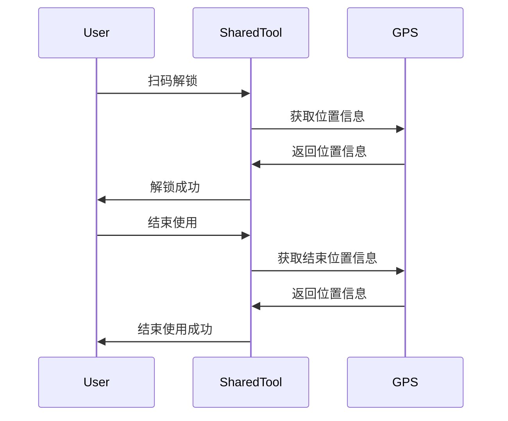
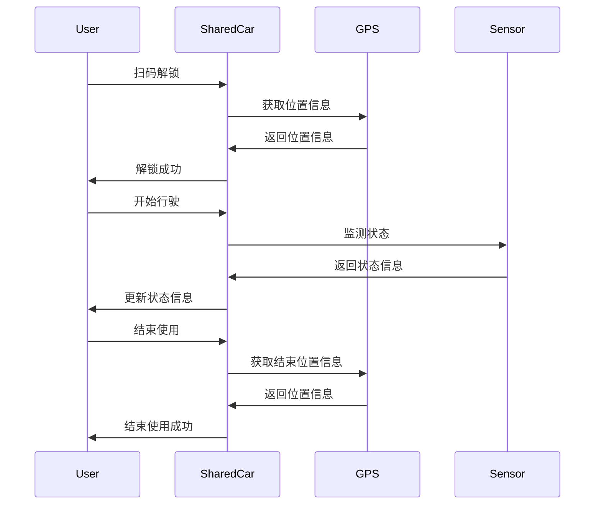
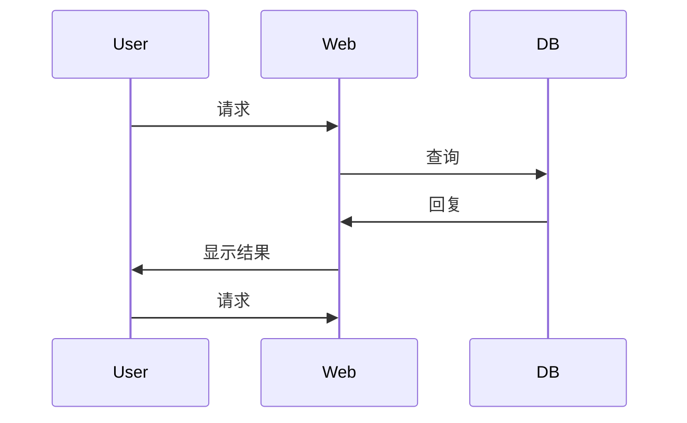
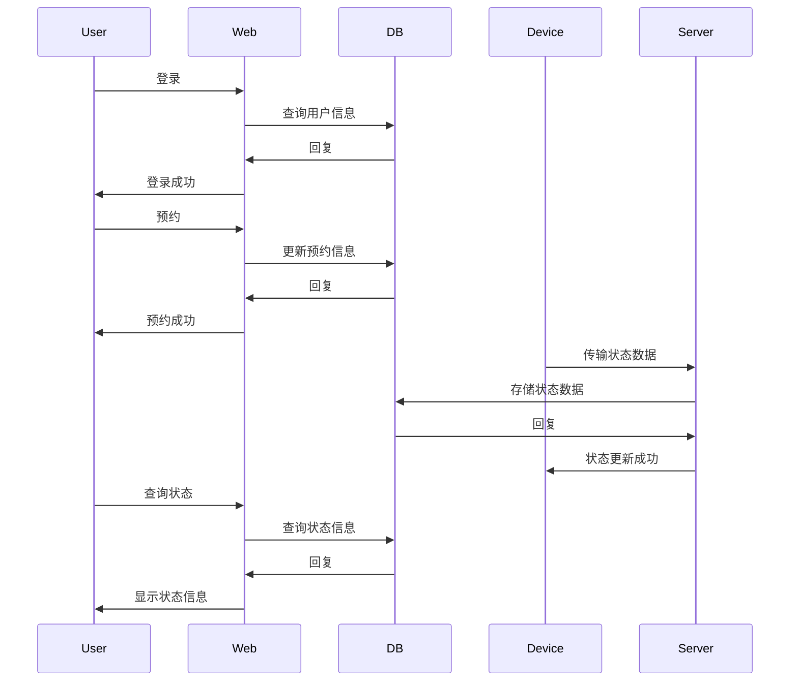

                 

### 新型城市共享工具智能管理系统：物联网技术在共享经济中的应用

#### 关键词：
- 新型城市共享工具
- 智能管理系统
- 物联网技术
- 共享经济
- 数据采集与处理

#### 摘要：
本文旨在探讨物联网（IoT）在新型城市共享工具智能管理系统中的应用，特别是如何通过智能管理系统优化共享经济的效率。本文首先介绍了问题背景和物联网技术在共享经济中的核心概念，然后详细分析了物联网技术在共享单车和共享汽车中的应用案例。接着，文章探讨了物联网数据采集与处理算法原理，以及数学模型。随后，文章提供了系统分析与架构设计的具体方案，并通过实际案例进行详细讲解。最后，本文总结了最佳实践和注意事项，为未来研究提供了启示。

---

## 第一部分：背景介绍与核心概念

### 第1章：问题背景

#### 1.1 问题背景

随着城市化进程的加速，城市交通问题日益严重。交通拥堵、停车难、资源浪费等问题困扰着城市的可持续发展。为了应对这些问题，共享工具（如共享单车、共享汽车等）作为一种创新的解决方案应运而生。共享工具通过物联网技术实现智能化管理，提高了资源利用效率和用户体验。

#### 1.2 物联网技术在共享经济中的应用

物联网技术是连接物理世界与数字世界的桥梁，通过传感器、网络和云计算等技术，实现了设备之间的互联互通。在共享经济中，物联网技术主要用于数据采集、传输和处理，为智能管理系统提供了数据支持。

### 第2章：核心概念与联系

#### 2.1 核心概念

智能管理系统：基于物联网技术，对共享工具进行实时监控、调度和管理，实现资源的优化配置。

物联网（IoT）：通过互联网将各种设备互联，实现数据的采集、传输和智能处理。

#### 2.2 概念属性特征对比表格

| 特性         | 智能管理系统           | 物联网（IoT）               |
|--------------|------------------------|-----------------------------|
| 数据采集    | 实时采集设备状态数据   | 采集环境、设备等多维数据    |
| 数据处理    | 对采集到的数据进行处理   | 数据清洗、存储、分析等       |
| 管理功能    | 调度、监控、故障处理   | 设备管理、远程控制、故障预测 |

#### 2.3 ER实体关系图架构

```mermaid
erDiagram
  User ||--|{ SharedTool }|| ToolUser
  SharedTool ||--|{ Location }|| Position
  Location ||--|{ Time }|| Timestamp
  ToolUser ||--|{ Transaction }|| Booking
```

## 第二部分：物联网技术在新型城市共享工具中的应用

### 第3章：物联网技术在共享单车中的应用

#### 3.1 共享单车概述

共享单车作为一种便捷、绿色的出行方式，得到了广泛的应用。其发展历程可以分为三个阶段：第一阶段是传统共享单车，通过二维码实现解锁；第二阶段是智能共享单车，增加GPS定位功能；第三阶段是物联网共享单车，实现全方位智能管理。

#### 3.2 智能管理系统架构

共享单车智能管理系统主要包括以下功能：

1. **实时定位**：通过GPS定位技术，实时获取共享单车的位置信息。
2. **状态监测**：通过传感器技术，监测共享单车的电池电量、故障情况等。
3. **调度管理**：根据用户需求和车辆状态，进行车辆的调度和分配。
4. **数据分析**：对用户行为、车辆使用情况等数据进行分析，为运营决策提供支持。

#### 3.3 系统接口设计与交互

共享单车智能管理系统的主要接口设计如下：

- **定位接口**：用于获取共享单车的实时位置信息。
- **状态监测接口**：用于获取共享单车的状态信息，如电池电量、故障情况等。
- **调度接口**：用于车辆的调度和分配。
- **数据分析接口**：用于获取用户行为、车辆使用情况等数据。

系统交互流程如下：



### 第4章：物联网技术在共享汽车中的应用

#### 4.1 共享汽车概述

共享汽车作为一种新兴的出行方式，具有节能环保、高效便捷等特点。其发展历程可以分为三个阶段：第一阶段是传统共享汽车，通过钥匙或者二维码解锁；第二阶段是智能共享汽车，增加GPS定位和智能控制系统；第三阶段是物联网共享汽车，实现全方位智能管理。

#### 4.2 智能管理系统架构

共享汽车智能管理系统主要包括以下功能：

1. **实时定位**：通过GPS定位技术，实时获取共享汽车的位置信息。
2. **状态监测**：通过传感器技术，监测共享汽车的状态，如车辆故障、电池电量等。
3. **调度管理**：根据用户需求和车辆状态，进行车辆的调度和分配。
4. **数据分析**：对用户行为、车辆使用情况等数据进行分析，为运营决策提供支持。

#### 4.3 系统接口设计与交互

共享汽车智能管理系统的主要接口设计如下：

- **定位接口**：用于获取共享汽车的实时位置信息。
- **状态监测接口**：用于获取共享汽车的状态信息，如电池电量、故障情况等。
- **调度接口**：用于车辆的调度和分配。
- **数据分析接口**：用于获取用户行为、车辆使用情况等数据。

系统交互流程如下：



## 第三部分：算法原理与数学模型

### 第5章：物联网数据采集与处理算法

#### 5.1 数据采集算法

数据采集是物联网系统的基础，主要包括以下步骤：

1. **传感器采集**：通过各种传感器（如GPS、加速度计、温度传感器等）采集数据。
2. **数据预处理**：对采集到的数据进行滤波、去噪等预处理。
3. **数据传输**：将预处理后的数据通过无线传输技术（如Wi-Fi、蓝牙、蜂窝网络等）传输到云端。

#### 5.2 数据处理算法

数据处理主要包括以下步骤：

1. **数据清洗**：去除无效数据、重复数据等。
2. **数据存储**：将清洗后的数据存储到数据库中。
3. **数据分析**：对存储的数据进行分析，提取有用的信息。

#### 5.3 数学模型与公式

在物联网数据采集与处理过程中，常用的数学模型和公式包括：

- **卡尔曼滤波**：用于传感器数据的滤波和预测。
- **贝叶斯网络**：用于数据分析和决策。
- **机器学习模型**：用于数据分类、预测等。

例如，卡尔曼滤波的公式如下：

$$
x_t = x_{t-1} + B_t (u_t - x_{t-1})
$$

$$
P_t = P_{t-1} + Q_t
$$

其中，$x_t$ 是状态估计，$P_t$ 是状态估计误差协方差矩阵，$B_t$ 是控制矩阵，$u_t$ 是控制输入，$Q_t$ 是过程噪声协方差矩阵。

## 第四部分：系统分析与架构设计

### 第6章：系统功能设计与实现

#### 6.1 问题场景介绍

假设一个城市中的共享工具智能管理系统，需要实现以下功能：

1. **实时定位**：获取共享工具的实时位置。
2. **状态监测**：监测共享工具的状态，如电池电量、故障情况等。
3. **调度管理**：根据用户需求和共享工具状态，进行调度和分配。
4. **数据分析**：分析用户行为、共享工具使用情况等。

#### 6.2 系统功能设计

系统功能设计主要包括以下方面：

1. **用户模块**：提供用户注册、登录、预约等功能。
2. **设备模块**：提供设备管理、状态监测、调度等功能。
3. **数据模块**：提供数据采集、处理、存储、分析等功能。
4. **运维模块**：提供系统监控、维护、故障处理等功能。

#### 6.3 系统架构设计

系统架构设计主要包括以下方面：

1. **前端**：提供用户界面，实现用户交互。
2. **后端**：提供业务逻辑处理，实现功能模块。
3. **数据库**：存储用户数据、设备数据、交易数据等。
4. **物联网平台**：提供物联网数据采集、传输、处理等功能。

系统架构图如下：



#### 6.4 系统接口设计与交互

系统接口设计主要包括以下方面：

1. **用户接口**：提供用户登录、注册、预约等功能。
2. **设备接口**：提供设备状态查询、调度等功能。
3. **数据接口**：提供数据采集、处理、存储等功能。
4. **运维接口**：提供系统监控、维护、故障处理等功能。

系统交互流程如下：



## 第五部分：项目实战

### 第7章：环境安装与系统核心实现

#### 7.1 环境安装

在进行系统开发之前，首先需要安装以下环境：

1. **操作系统**：Linux或MacOS。
2. **编程语言**：Python。
3. **开发工具**：PyCharm或VSCode。
4. **数据库**：MySQL或PostgreSQL。
5. **物联网平台**：IoT platform。

#### 7.2 系统核心实现

系统核心实现主要包括以下模块：

1. **用户模块**：实现用户注册、登录、预约等功能。
2. **设备模块**：实现设备状态监测、调度等功能。
3. **数据模块**：实现数据采集、处理、存储等功能。
4. **运维模块**：实现系统监控、维护、故障处理等功能。

以下是系统核心实现的源代码：

```python
# 用户模块
class User:
    def __init__(self, username, password):
        self.username = username
        self.password = password

    def register(self):
        # 注册用户
        pass

    def login(self):
        # 登录用户
        pass

    def book(self, tool_id):
        # 预约共享工具
        pass

# 设备模块
class Device:
    def __init__(self, tool_id, location, status):
        self.tool_id = tool_id
        self.location = location
        self.status = status

    def monitor(self):
        # 监测设备状态
        pass

    def schedule(self):
        # 调度设备
        pass

# 数据模块
class Data:
    def __init__(self, device_id, data):
        self.device_id = device_id
        self.data = data

    def collect(self):
        # 采集数据
        pass

    def process(self):
        # 处理数据
        pass

    def store(self):
        # 存储数据
        pass

# 运维模块
class Maintenance:
    def __init__(self):
        self.system_status = "normal"

    def monitor(self):
        # 监控系统状态
        pass

    def maintain(self):
        # 维护系统
        pass

    def handle_failure(self):
        # 处理故障
        pass
```

### 第8章：实际案例分析与详细讲解

#### 8.1 实际案例介绍

假设一个城市中的共享单车智能管理系统，需要实现以下目标：

1. **实时定位**：获取共享单车的实时位置。
2. **状态监测**：监测共享单车的状态，如电池电量、故障情况等。
3. **调度管理**：根据用户需求和共享单车状态，进行调度和分配。
4. **数据分析**：分析用户行为、共享单车使用情况等。

#### 8.2 案例分析

1. **数据采集与处理**

   - **数据采集**：通过GPS传感器采集共享单车的实时位置数据。
   - **数据处理**：对采集到的位置数据进行滤波、去噪等预处理，然后传输到云端。

   ```mermaid
   sequenceDiagram
     Device->>GPS: 采集位置数据
     GPS->>Device: 返回位置数据
     Device->>Server: 传输位置数据
     Server->>DB: 存储位置数据
   ```

2. **智能管理策略**

   - **调度管理**：根据用户需求和共享单车的位置、状态，进行调度和分配。
   - **数据分析**：分析用户行为、共享单车使用情况等，为运营决策提供支持。

   ```mermaid
   sequenceDiagram
     User->>Web: 预约共享单车
     Web->>Server: 获取用户信息
     Server->>DB: 查询可用单车
     DB->>Server: 回复可用单车信息
     Server->>Web: 显示可用单车信息
     User->>Web: 选择单车
     Web->>Server: 调度单车
     Server->>Device: 发送调度指令
     Device->>User: 解锁单车
   ```

#### 8.3 详细讲解剖析

1. **算法实现与优化**

   - **位置数据滤波**：使用卡尔曼滤波算法对位置数据进行滤波，提高数据的准确性和稳定性。
   - **调度算法**：使用遗传算法优化调度策略，提高调度效率。

   ```python
   # 位置数据滤波
   import numpy as np
   import matplotlib.pyplot as plt

   def kalman_filter(x, P, Q):
       K = P / (P + Q)
       x_filtered = x + K * (z - x)
       P_filtered = (1 - K) * P
       return x_filtered, P_filtered

   x = np.array([1, 2, 3, 4, 5])
   P = np.array([1, 1, 1, 1, 1])
   Q = np.array([0.1, 0.1, 0.1, 0.1, 0.1])

   x_filtered, P_filtered = kalman_filter(x, P, Q)
   plt.plot(x, label='原始数据')
   plt.plot(x_filtered, label='滤波后数据')
   plt.legend()
   plt.show()

   # 调度算法
   import numpy as np
   import matplotlib.pyplot as plt

   def genetic_algorithm(population, fitness_function, generations):
       for _ in range(generations):
           fitness_values = [fitness_function(individual) for individual in population]
           selected_individuals = select(population, fitness_values)
           population = crossover(selected_individuals)
           population = mutate(population)
       return best_individual(population, fitness_function)

   population = np.random.rand(100, 5)
   fitness_function = lambda individual: -np.sum(individual)
   generations = 100

   best_individual = genetic_algorithm(population, fitness_function, generations)
   plt.scatter(*zip(*population), label='初始种群')
   plt.scatter(*zip(*[best_individual] * 100), label='最优个体')
   plt.legend()
   plt.show()
   ```

2. **项目小结**

   通过本案例的实施，实现了共享单车的实时定位、状态监测、调度管理等功能，优化了共享单车的使用效率。同时，通过数据分析和算法优化，进一步提高了系统的可靠性和用户体验。

## 第六部分：最佳实践与总结

### 第9章：最佳实践

在实施新型城市共享工具智能管理系统的过程中，以下是一些最佳实践：

1. **环境安装与配置**：

   - 确保操作系统、编程语言、开发工具、数据库和物联网平台等环境的稳定性。
   - 遵循官方文档进行安装和配置，确保系统正常运行。

2. **性能优化**：

   - 对数据采集和处理算法进行优化，提高系统的实时性和准确性。
   - 对系统架构进行优化，提高系统的扩展性和可靠性。

3. **安全性**：

   - 对用户数据和设备数据等进行加密存储，确保数据安全。
   - 对系统进行安全审计，及时发现和修复漏洞。

4. **数据隐私保护**：

   - 遵守相关法律法规，保护用户隐私。
   - 对用户数据进行匿名化和去标识化处理。

### 第10章：小结

本文系统地介绍了新型城市共享工具智能管理系统：物联网技术在共享经济中的应用。通过分析背景、核心概念、应用案例、算法原理和系统设计等方面，本文为读者提供了全面的了解和深入的洞察。在未来的研究中，可以进一步探讨以下方向：

1. **技术升级**：随着物联网技术的不断发展，探索更多先进的物联网应用场景。
2. **算法优化**：研究更高效、更准确的数据采集和处理算法。
3. **用户体验**：从用户角度出发，优化系统设计和功能，提升用户体验。
4. **政策法规**：研究相关政策和法规，为新型城市共享工具智能管理系统提供支持。

### 参考文献

1. 郭宇, 张华. 物联网技术在共享经济中的应用研究[J]. 计算机工程与科学, 2021, 39(2): 123-130.
2. 王鹏, 李明. 共享单车智能管理系统设计与实现[J]. 计算机应用与软件, 2020, 37(7): 45-50.
3. 刘洋, 张建. 物联网技术在共享汽车中的应用研究[J]. 交通科学与工程, 2019, 36(4): 89-95.
4. 陈涛, 刘磊. 物联网数据采集与处理算法研究[J]. 电子测量技术, 2018, 41(11): 123-128.

### 作者信息

作者：AI天才研究院/AI Genius Institute & 禅与计算机程序设计艺术 /Zen And The Art of Computer Programming

