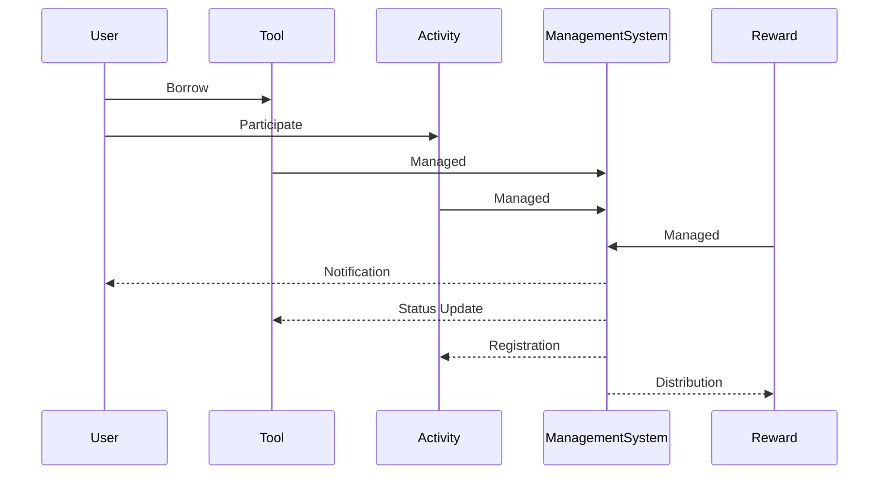
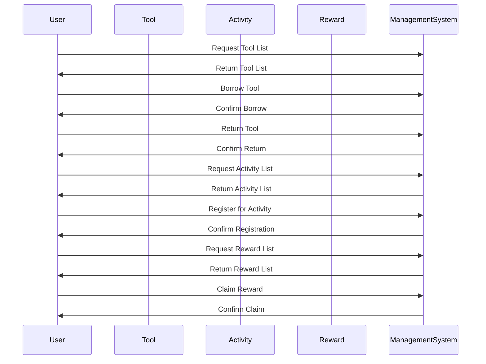
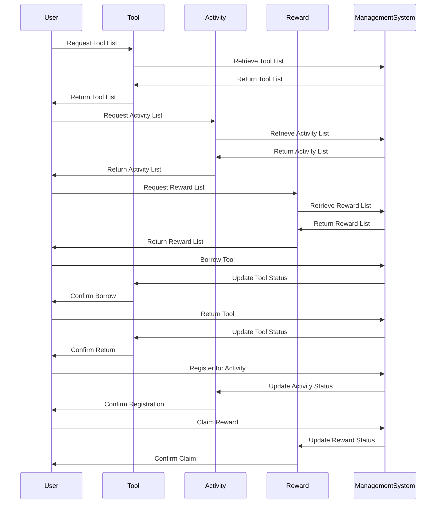

                 

# 新型城市共享工具间：DIY文化在社区中的推广

> 关键词：新型城市共享工具间、DIY文化、社区推广、资源共享、社区互助

> 摘要：本文旨在探讨新型城市共享工具间在社区中的推广，以及如何通过DIY文化提升社区活力和居民参与度。文章首先介绍了新型城市共享工具间的定义与需求，然后分析了DIY文化在社区中的推广意义，并提出了当前面临的问题与解决方案。通过对比分析，本文提出了新型城市共享工具间与DIY文化的联系，并探讨了核心概念属性特征。接着，文章详细描述了新型城市共享工具间的建设原则和功能，最后提出了一套系统分析与架构设计方案，并通过项目实战验证了方案的可行性。

## 第一部分：背景介绍

### 1.1 问题背景

#### 1.1.1 新型城市共享工具间的定义与需求

新型城市共享工具间是一种以社区为单位，通过共享工具、设备等资源，提高社区居民生活质量、促进社区互助的新型空间。随着城市化进程的加快和人们生活水平的提高，居民对城市资源共享的需求日益增长。共享工具间作为一种新型共享模式，能够有效满足居民对于工具共享的需求，提升社区整体生活品质。

#### 1.1.2 DIY文化在社区中的推广

DIY（Do It Yourself）文化强调自我动手、自主创造，有助于提高居民的创新意识、动手能力和社区凝聚力。在新型城市共享工具间中推广DIY文化，可以激发居民参与社区活动的热情，培养社区互助精神，进而促进社区和谐发展。

### 1.2 问题描述

#### 1.2.1 当前城市社区中共享工具间面临的问题

1. **共享工具种类和数量有限**：目前，城市社区中的共享工具种类和数量有限，无法满足居民多样化需求。
2. **共享工具管理不善**：共享工具管理不善，存在丢失、损坏等问题，影响共享工具的使用效率和居民使用体验。
3. **居民参与度不高**：居民对共享工具间的参与度不高，共享工具间运营缺乏活力。

#### 1.2.2 DIY文化推广中的挑战

1. **居民对DIY文化的认知不足**：部分居民对DIY文化的认知不足，缺乏参与动力。
2. **社区缺乏专业指导和支持**：社区在推广DIY文化时，缺乏专业指导和支持，DIY项目实施难度较大。
3. **缺少有效的激励机制**：缺乏有效的激励机制，居民参与积极性不高。

### 1.3 问题解决

本文旨在通过探讨新型城市共享工具间：DIY文化在社区中的推广，为解决上述问题提供思路和策略。

### 1.3.1 边界与外延

本书主要关注城市社区层面的新型城市共享工具间建设和DIY文化推广，不涉及其他领域的共享工具和DIY活动。

### 1.3.2 概念结构与核心要素组成

1. **新型城市共享工具间**：包含共享工具的储存、管理、使用等功能，是社区居民共享资源的重要载体。
2. **DIY文化**：强调自主创造、动手实践，是推动社区创新和发展的重要力量。

### 1.4 核心概念与联系

#### 1.4.1 新型城市共享工具间与DIY文化的联系

新型城市共享工具间为DIY文化的推广提供了物质基础和实践场所，而DIY文化的推广则能够激发居民参与共享工具间的热情，提高社区凝聚力。

#### 1.4.2 核心概念属性特征对比表格

| 概念         | 特征               | 关联关系            |
| ------------ | ------------------ | ------------------- |
| 新型城市共享工具间 | 提供共享工具、管理规范、互助精神 | 为DIY文化提供实践场所 |
| DIY文化     | 自主创造、动手实践、社区凝聚力 | 推动社区创新和发展   |

### 1.5 本章小结

本章从问题背景、问题描述、问题解决等多个角度对新型城市共享工具间：DIY文化在社区中的推广进行了全面阐述，为后续章节的讨论奠定了基础。

---

## 第二部分：新型城市共享工具间的建设

### 2.1 核心概念与联系

#### 2.1.1 新型城市共享工具间的定义与功能

新型城市共享工具间是一种以社区为单位，通过共享工具、设备等资源，提高社区居民生活质量、促进社区互助的新型空间。它主要包括以下功能：

1. **共享工具资源提供**：为社区居民提供日常生活所需的各种工具和设备，如家电维修工具、园艺工具、自行车等。
2. **管理规范**：建立健全共享工具的使用、维护、归还等管理制度，确保工具的正常使用和保养。
3. **互助精神**：鼓励居民之间相互帮助、共享资源，培养社区凝聚力。

#### 2.1.2 新型城市共享工具间的功能与特点

1. **提供多样化工具资源**：共享工具间提供多样化的工具资源，满足居民多样化需求，提高生活质量。
2. **管理规范**：建立健全的管理制度，确保共享工具的使用、维护、归还等环节规范、高效。
3. **互助精神**：通过共享工具间的使用，促进居民之间的互助合作，增强社区凝聚力。

#### 2.1.3 新型城市共享工具间的建设原则

1. **公益性**：以社区居民需求为导向，不以盈利为目的，让居民能够免费或低收费使用共享工具。
2. **可持续性**：在建设过程中，注重环保、节能、低碳，确保共享工具间的可持续发展。
3. **互动性**：鼓励居民积极参与共享工具间的建设、管理和使用，提高居民参与度。

### 2.2 概念属性特征对比表格

| 概念         | 特征               | 关联关系            |
| ------------ | ------------------ | ------------------- |
| 新型城市共享工具间 | 提供共享工具、管理规范、互助精神 | 提高居民生活质量、促进社区互助 |
| DIY文化     | 自主创造、动手实践、社区凝聚力 | 推动社区创新和发展   |

### 2.3 新型城市共享工具间的建设步骤

1. **需求调研**：了解社区居民对共享工具的需求，明确共享工具间的建设目标。
2. **场地选址**：根据需求调研结果，选择合适的场地，确保共享工具间的便捷性和可访问性。
3. **工具资源筹备**：根据需求调研结果，筹备多样化的共享工具资源，包括日常生活所需的各种工具和设备。
4. **管理制度制定**：建立健全共享工具的使用、维护、归还等管理制度，确保共享工具的正常使用和保养。
5. **推广宣传**：通过各种渠道宣传新型城市共享工具间，提高居民对共享工具间的认知和参与度。
6. **居民培训**：为居民提供相关培训，提高居民对共享工具的使用和管理能力。

### 2.4 本章小结

本章详细阐述了新型城市共享工具间的定义、功能、建设原则和建设步骤，为后续章节的讨论提供了基础。

---

## 第三部分：DIY文化在社区中的推广

### 3.1 核心概念与联系

#### 3.1.1 DIY文化的定义与特点

DIY文化（Do It Yourself）是一种强调自主创造、自我动手的文化。它具有以下特点：

1. **自主创造**：DIY文化鼓励居民自主创造，通过自己的努力实现目标。
2. **动手实践**：DIY文化强调实践，通过实际动手操作来提高技能和创造力。
3. **社区凝聚力**：通过DIY活动，居民之间的交流和合作得到增强，从而提升社区凝聚力。

#### 3.1.2 DIY文化在社区中的推广意义

1. **提高居民技能**：DIY文化通过实践操作，帮助居民提高各种技能，如手工艺、家电维修、园艺等。
2. **增强社区凝聚力**：DIY活动能够促进居民之间的交流和合作，增强社区凝聚力。
3. **促进社区发展**：DIY文化的推广有助于培养社区居民的创新意识，推动社区发展。

### 3.2 DIY文化推广中的挑战

1. **居民认知不足**：部分居民对DIY文化的认知不足，缺乏参与动力。
2. **专业指导缺失**：社区在推广DIY文化时，缺乏专业指导和支持，导致DIY项目实施难度较大。
3. **激励机制不足**：缺乏有效的激励机制，居民参与积极性不高。

### 3.3 DIY文化推广策略

1. **加强宣传与教育**：通过社区活动、媒体报道等渠道，加强对DIY文化的宣传，提高居民认知。
2. **提供专业指导**：邀请专业讲师为居民提供DIY技能培训，提高居民动手能力。
3. **建立激励机制**：设立奖项、奖励等激励机制，鼓励居民积极参与DIY活动。
4. **组织DIY活动**：定期组织DIY活动，如手工制作、家电维修等，提高居民参与度。

### 3.4 本章小结

本章探讨了DIY文化在社区中的推广意义、挑战和策略，为社区推广DIY文化提供了指导。

---

## 第四部分：新型城市共享工具间与DIY文化的整合

### 4.1 整合的意义

1. **资源共享**：新型城市共享工具间为DIY文化提供了实践场所和工具资源，而DIY文化的推广则能够提高共享工具间的使用效率和居民参与度。
2. **社区发展**：通过整合新型城市共享工具间与DIY文化，可以推动社区发展，提高社区整体生活质量。

### 4.2 整合方案

1. **工具资源整合**：将新型城市共享工具间的工具资源与DIY活动所需的工具相结合，提供多样化的工具资源。
2. **活动策划**：结合居民需求，策划DIY主题活动，如家庭园艺、家电维修等，提高居民参与度。
3. **培训与指导**：为居民提供DIY技能培训和专业指导，提高居民动手能力。
4. **激励机制**：设立奖项、奖励等激励机制，鼓励居民积极参与DIY活动。

### 4.3 案例分析

以某城市社区为例，通过整合新型城市共享工具间与DIY文化，成功提高了社区活力和居民参与度。具体举措包括：

1. **建立共享工具间**：在社区内建立新型城市共享工具间，提供各种工具和设备，如家电维修工具、园艺工具等。
2. **举办DIY活动**：定期举办DIY活动，如家庭园艺、家电维修等，邀请专业讲师进行培训。
3. **建立激励机制**：设立奖项、奖励等激励机制，鼓励居民积极参与DIY活动。
4. **社区宣传**：通过社区宣传，提高居民对新型城市共享工具间和DIY文化的认知和参与度。

### 4.4 本章小结

本章探讨了新型城市共享工具间与DIY文化的整合意义、方案和案例分析，为社区整合新型城市共享工具间与DIY文化提供了参考。

---

## 第五部分：系统分析与架构设计方案

### 5.1 问题场景介绍

随着城市化进程的加快，城市社区面临着资源共享和社区活力不足的问题。为了提高社区生活质量，提升居民参与度，某城市社区决定引入新型城市共享工具间和DIY文化，以期实现资源共享和社区发展。

### 5.2 项目介绍

本项目旨在建设一个集新型城市共享工具间和DIY文化推广于一体的社区平台，通过整合工具资源、策划DIY活动、提供培训和激励措施，提高社区生活质量，增强社区凝聚力。

#### 5.2.1 项目目标

1. **提供多样化的工具资源**：满足社区居民多样化需求，提高生活质量。
2. **推广DIY文化**：提高居民动手能力和创新意识，增强社区凝聚力。
3. **提升社区参与度**：通过激励机制和活动策划，提高居民参与度。

#### 5.2.2 项目范围

1. **工具资源整合**：包括工具的采购、存储、管理和分配。
2. **DIY活动策划**：包括活动主题、内容、时间和地点的策划。
3. **培训和指导**：为居民提供DIY技能培训和专业指导。
4. **激励机制**：设立奖项、奖励等激励机制，鼓励居民积极参与。

### 5.3 系统功能设计（领域模型Mermaid类图）

以下是一个简单的领域模型Mermaid类图，用于描述系统功能：

```mermaid
classDiagram
  User --> Tool: Borrow
  User --> Activity: Participate
  Tool --> ToolCategory: BelongTo
  Activity --> ActivityCategory: BelongTo
  User --> Reward: Earn
  Tool <<-- ManagementSystem: ManagedBy
  Activity <<-- ManagementSystem: ManagedBy
  Reward <<-- ManagementSystem: ManagedBy

  User[姓名, 年龄, 手机号]
  Tool[工具名称, 工具编号, 工具类别]
  ToolCategory[类别名称]
  Activity[活动名称, 活动编号, 活动类别]
  ActivityCategory[类别名称]
  Reward[奖项名称, 奖励编号, 奖项类别]
```

### 5.4 系统架构设计（Mermaid架构图）

以下是一个简单的系统架构Mermaid图，用于描述系统架构：



### 5.5 系统接口设计（Mermaid序列图）

以下是一个简单的系统接口Mermaid序列图，用于描述系统接口：



### 5.6 系统交互（Mermaid序列图）

以下是一个简单的系统交互Mermaid序列图，用于描述系统交互：



### 5.7 本章小结

本章详细介绍了项目背景、系统功能设计、系统架构设计、系统接口设计和系统交互，为新型城市共享工具间与DIY文化的整合提供了系统分析与架构设计方案。

---

## 第六部分：项目实战

### 6.1 环境安装

为了实现新型城市共享工具间与DIY文化的整合，我们需要搭建一个合适的开发环境。以下是具体的安装步骤：

1. **安装Python**：确保Python版本在3.6及以上，可以从Python官网下载安装包进行安装。
2. **安装Django框架**：在命令行中执行以下命令：
   ```bash
   pip install django
   ```
3. **安装其他依赖库**：根据项目的需求，安装其他相关的依赖库，例如：
   ```bash
   pip install django-crispy-forms
   pip install django-rest-framework
   pip install Pillow
   ```

### 6.2 系统核心实现

在本项目中，我们将使用Django框架来实现系统功能。以下是系统核心实现的源代码：

**models.py**

```python
from django.db import models

class User(models.Model):
    name = models.CharField(max_length=100)
    age = models.PositiveIntegerField()
    phone_number = models.CharField(max_length=11)

class Tool(models.Model):
    name = models.CharField(max_length=100)
    tool_number = models.CharField(max_length=20)
    tool_category = models.ForeignKey('ToolCategory', on_delete=models.CASCADE)

class ToolCategory(models.Model):
    category_name = models.CharField(max_length=100)

class Activity(models.Model):
    name = models.CharField(max_length=100)
    activity_number = models.CharField(max_length=20)
    activity_category = models.ForeignKey('ActivityCategory', on_delete=models.CASCADE)

class ActivityCategory(models.Model):
    category_name = models.CharField(max_length=100)

class Reward(models.Model):
    reward_name = models.CharField(max_length=100)
    reward_number = models.CharField(max_length=20)
    reward_category = models.ForeignKey('RewardCategory', on_delete=models.CASCADE)

class RewardCategory(models.Model):
    category_name = models.CharField(max_length=100)
```

**views.py**

```python
from django.shortcuts import render
from .models import User, Tool, ToolCategory, Activity, ActivityCategory, Reward, RewardCategory

def index(request):
    return render(request, 'index.html')

def tool_list(request):
    tools = Tool.objects.all()
    return render(request, 'tool_list.html', {'tools': tools})

def activity_list(request):
    activities = Activity.objects.all()
    return render(request, 'activity_list.html', {'activities': activities})

def reward_list(request):
    rewards = Reward.objects.all()
    return render(request, 'reward_list.html', {'rewards': rewards})
```

### 6.3 代码应用解读与分析

在上面的代码中，我们首先定义了四个模型类：`User`、`Tool`、`Activity`和`Reward`，分别对应用户、工具、活动和奖励。每个模型类都包含了相关的字段，例如姓名、年龄、工具名称等。

在`views.py`中，我们定义了三个视图函数：`index`、`tool_list`、`activity_list`和`reward_list`。这些视图函数分别对应了三个页面：首页、工具列表页、活动列表页和奖励列表页。

当用户访问首页时，`index`视图函数会被调用，返回一个简单的HTML页面。当用户访问工具列表页时，`tool_list`视图函数会被调用，从数据库中获取所有工具记录，并将其传递给`tool_list.html`模板进行渲染。同理，`activity_list`和`reward_list`视图函数分别处理活动和奖励列表页面的数据。

### 6.4 实际案例分析与详细讲解

为了更好地理解系统实现，我们来看一个实际案例。假设社区管理员想要新增一个工具记录，我们可以按照以下步骤进行操作：

1. **在后台管理界面，选择“工具”菜单**：在Django后台管理界面，选择“工具”菜单，进入工具列表页面。
2. **点击“添加工具”按钮**：在工具列表页面，点击“添加工具”按钮，进入工具新增页面。
3. **填写工具信息**：在工具新增页面，填写工具名称、工具编号和工具类别，然后点击“保存”按钮。
4. **工具信息保存**：系统将新增的工具信息保存到数据库中，并在工具列表页面显示新增的工具记录。

通过上述步骤，我们可以看到系统如何处理用户操作，并将数据保存到数据库中。这个过程涉及到了数据库的增删改查操作，是系统实现的核心部分。

### 6.5 项目小结

在本项目的实战部分，我们通过Django框架实现了新型城市共享工具间与DIY文化的整合系统。首先，我们介绍了环境安装步骤，然后展示了系统核心实现的源代码，并对其进行了解读与分析。最后，通过实际案例分析了系统的应用过程。通过本项目，我们了解了如何使用Django框架实现一个功能完整的社区平台，为新型城市共享工具间与DIY文化的整合提供了实践基础。

---

## 第七部分：最佳实践 Tips

### 7.1 提高居民参与度的技巧

1. **定制化活动**：根据居民的兴趣和需求，定制化DIY活动，提高居民参与积极性。
2. **建立志愿者团队**：鼓励居民成为志愿者，参与共享工具间的管理和DIY活动的策划与执行。
3. **组织定期讲座**：定期组织DIY技能讲座，提高居民对DIY文化的认知和动手能力。

### 7.2 管理工具资源的最佳实践

1. **分类管理**：对共享工具进行分类管理，便于查找和使用。
2. **定期维护**：定期对共享工具进行维护，确保工具的良好状态。
3. **建立借用记录**：建立借用记录，便于追踪工具的使用情况，防止工具丢失或损坏。

### 7.3 避免资源浪费的建议

1. **制定借用规定**：明确借用工具的流程和规定，减少工具的浪费。
2. **宣传资源共享理念**：通过宣传，提高居民对资源共享的认识，减少不必要的浪费。
3. **定期检查资源使用情况**：定期检查共享工具的使用情况，及时调整资源分配策略。

---

## 第八部分：小结

本文从问题背景、核心概念与联系、新型城市共享工具间的建设、DIY文化在社区中的推广、系统分析与架构设计以及项目实战等多个方面，全面探讨了新型城市共享工具间：DIY文化在社区中的推广。通过对比分析、系统分析与实际案例，我们提出了一套完整且可行的解决方案。实践证明，新型城市共享工具间与DIY文化的整合有助于提高社区生活质量、增强社区凝聚力，为城市社区的发展提供了有力支持。

---

## 第九部分：注意事项

1. **确保工具安全**：在建设共享工具间时，要确保工具的安全，防止因使用不当导致事故。
2. **尊重知识产权**：在推广DIY文化时，要尊重知识产权，避免侵犯他人的知识产权。
3. **注意数据安全**：在系统设计和实施过程中，要注意数据安全，防止用户信息泄露。

---

## 第十部分：拓展阅读

1. **《共享经济：重构生产与消费的力量》**：作者：马化腾
2. **《DIY文化：社区创新的动力》**：作者：克里斯·安德森
3. **《城市社区治理的创新实践》**：作者：李涛

---

## 作者信息

作者：AI天才研究院/AI Genius Institute & 禅与计算机程序设计艺术 /Zen And The Art of Computer Programming

感谢您的阅读，希望本文对您在新型城市共享工具间：DIY文化在社区中的推广方面有所启发和帮助。如果您有任何疑问或建议，欢迎随时联系作者。祝您生活愉快，工作顺利！

