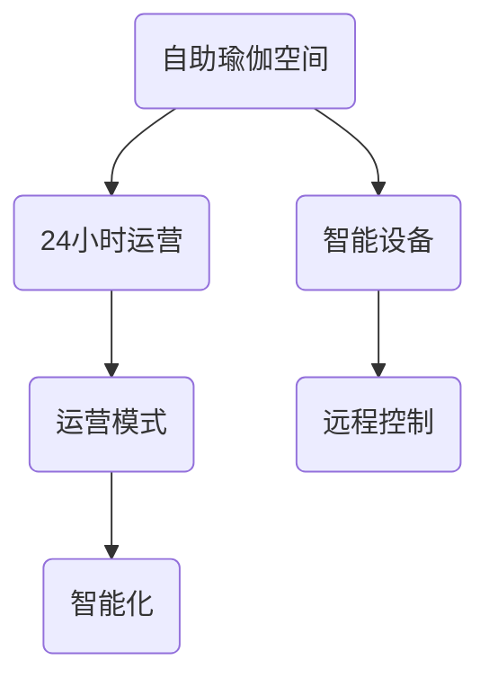
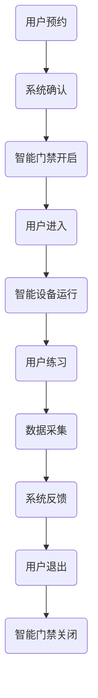
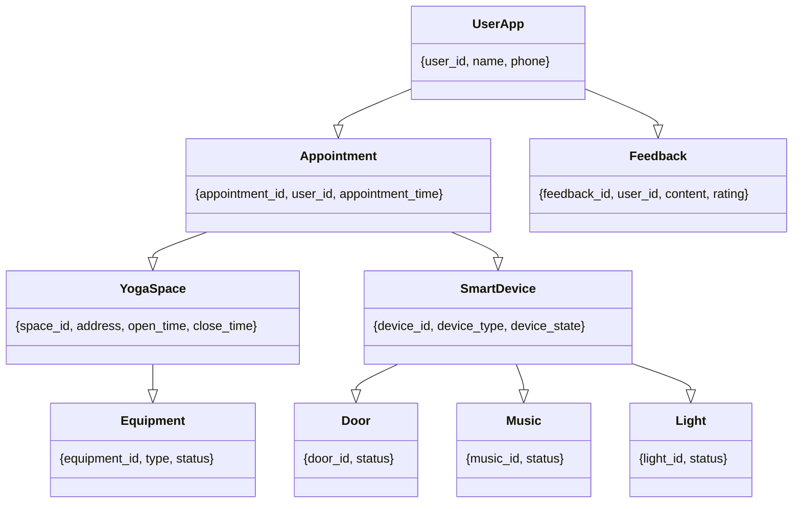
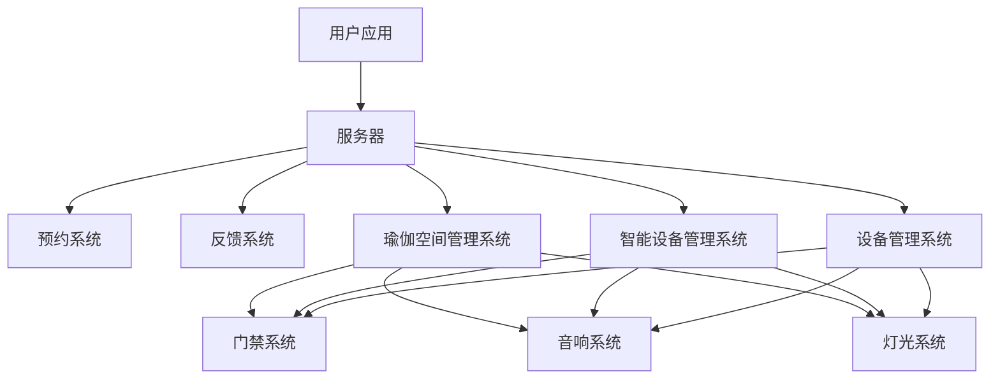
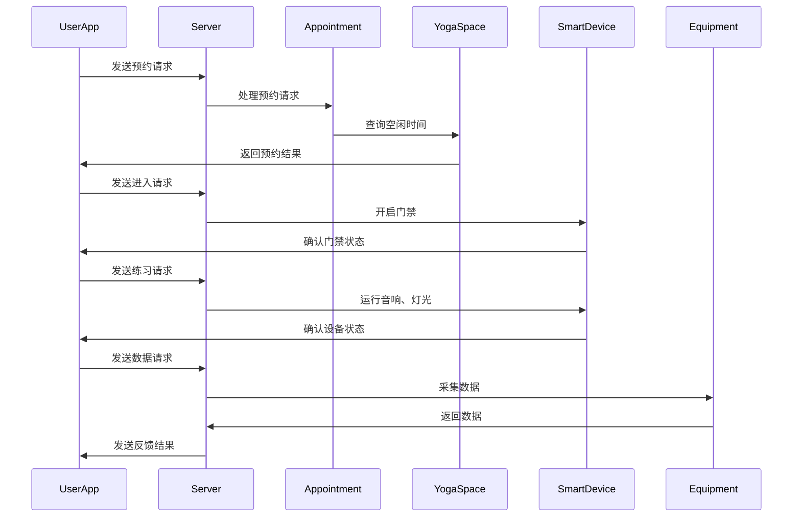

                 


# 新型城市共享瑜伽室设计：24小时自助瑜伽空间的创新

## 关键词

- 共享瑜伽室
- 24小时自助空间
- 智能设备
- 设计方法
- 系统架构

## 摘要

本文旨在探讨新型城市共享瑜伽室的设计，尤其是24小时自助瑜伽空间的理念与实践。文章将首先介绍共享瑜伽室的发展背景及市场需求，随后深入探讨自助瑜伽空间的设计理念和方法。接着，我们将通过实际案例进行分析，并提供最佳实践和注意事项。本文旨在为设计师和投资者提供有价值的参考。

## 目录大纲设计步骤

### 1. 确定书籍主题和核心章节

本文的主题是“新型城市共享瑜伽室设计：24小时自助瑜伽空间的创新”。核心章节包括设计理念、设计方法、案例分析、项目实战和最佳实践。

### 2. 设计背景介绍章节

**1.1 共享瑜伽室的发展背景及市场需求**
- **1.1.1 共享经济的兴起**
- **1.1.2 瑜伽文化的普及**
- **1.1.3 市场需求分析**

**1.2 共享瑜伽室的概念与特点**
- **1.2.1 共享瑜伽室的定义**
- **1.2.2 共享瑜伽室的特点**
- **1.2.3 共享瑜伽室的分类**

**1.3 自助瑜伽空间的设计理念**
- **1.3.1 自助瑜伽空间的定义**
- **1.3.2 自助瑜伽空间的设计原则**
- **1.3.3 自助瑜伽空间的布局设计**

### 3. 核心概念与联系章节

**2.1 核心概念与联系**
- **2.1.1 自助瑜伽空间的概念**
- **2.1.2 24小时运营的概念**
- **2.1.3 智能设备的概念**
- **2.1.4 核心概念属性特征对比表格**
- **2.1.5 ER实体关系图架构的Mermaid流程图**

### 4. 算法原理讲解章节

**3.1 算法原理讲解**
- **3.1.1 算法流程图**
- **3.1.2 Python源代码阐述**
- **3.1.3 数学模型和公式**
- **3.1.4 通俗易懂的举例说明**

### 5. 系统分析与架构设计方案章节

**4.1 系统分析与架构设计方案**
- **4.1.1 问题场景介绍**
- **4.1.2 项目背景**
- **4.1.3 领域模型类图**
- **4.1.4 系统架构图**
- **4.1.5 系统接口设计和系统交互序列图**

### 6. 项目实战章节

**5.1 项目实战**
- **5.1.1 环境安装过程**
- **5.1.2 系统核心实现源代码**
- **5.1.3 代码解读与分析**
- **5.1.4 实际案例分析**
- **5.1.5 详细讲解与剖析**

### 7. 最佳实践、小结、注意事项、拓展阅读章节

**6.1 最佳实践、小结、注意事项、拓展阅读**
- **6.1.1 设计最佳实践**
- **6.1.2 项目小结**
- **6.1.3 注意事项**
- **6.1.4 拓展阅读**

### 8. 整理与优化目录大纲

- **确保目录大纲内容的完整性和逻辑性。**
- **使用Markdown格式确保目录层级清晰。**
- **根据内容长度和结构，对目录进行适当调整。**

## 完整性要求

### 文章结构

- **文章标题**
- **文章关键词**
- **文章摘要**
- **正文部分**

### 每个章节的内容要求

1. **背景介绍**：包括核心概念术语说明、问题背景、问题描述、问题解决、边界与外延、概念结构与核心要素组成。

2. **核心概念与联系**：必须给出核心概念原理、概念属性特征对比表格和ER实体关系图架构的Mermaid流程图。

3. **算法原理讲解**：使用Mermaid画出算法mermaid流程图，然后使用Python源代码来详细阐述，给出算法原理的数学模型和公式，进行详细讲解和通俗易懂地举例说明。

4. **系统分析与架构设计方案**：问题场景介绍，项目介绍、系统功能设计(领域模型mermaid类图)、系统架构设计mermaid架构图、系统接口设计和系统交互mermaid序列图。

5. **项目实战**：环境安装、系统核心实现源代码，代码应用解读与分析，实际案例分析和详细讲解剖析，项目小结。

6. **最佳实践、小结、注意事项、拓展阅读**：提供设计最佳实践，总结设计经验，提醒注意事项，推荐拓展阅读。

### 完整性要求

- **每个小节的内容必须丰富、具体、详细讲解**。
- **核心内容必须包含**：背景介绍、核心概念与联系、算法原理讲解、系统分析与架构设计方案、项目实战、最佳实践、小结、注意事项、拓展阅读。

### 字数要求

- **文章字数在 10000 ～ 12000 字左右**。

### 格式要求

- **文章内容使用markdown格式输出**。

### 作者信息

- **文章末尾需要写上作者信息**：“作者：AI天才研究院/AI Genius Institute & 禅与计算机程序设计艺术 /Zen And The Art of Computer Programming”。

## 文章正文内容

### 1. 共享瑜伽室的发展背景及市场需求

**1.1 共享经济的兴起**

共享经济是一种基于互联网和信息技术的新型经济模式，它通过共享资源和服务的使用，实现资源的高效利用和价值的最大化。随着互联网技术的飞速发展，共享经济模式逐渐普及，并渗透到生活的方方面面。例如，共享单车、共享办公、共享住宿等，这些共享模式大大提高了资源的利用效率，满足了人们对便捷、高效的需求。

**1.2 瑜伽文化的普及**

瑜伽作为一种古老的修身养性方式，近年来在全球范围内迅速普及。瑜伽不仅有助于身体健康，还能调节情绪，提升生活质量。随着人们对健康生活方式的追求，瑜伽逐渐成为了一种时尚运动。各类瑜伽场馆、瑜伽课程也应运而生，满足了人们对瑜伽的不同需求。

**1.3 市场需求分析**

随着共享经济和瑜伽文化的快速发展，市场对共享瑜伽室的需求日益增加。一方面，传统的瑜伽场馆存在场地限制、费用较高等问题，无法满足广大瑜伽爱好者的需求。另一方面，现代都市人群生活节奏快，对便捷、高效的健身方式有着强烈的需求。共享瑜伽室的出现，正好满足了这一市场需求。

### 2. 共享瑜伽室的概念与特点

**2.1 共享瑜伽室的定义**

共享瑜伽室是指通过共享经济的模式，为瑜伽爱好者提供的一种便捷、高效的健身空间。共享瑜伽室通常采用自助模式，用户只需通过手机APP预约，即可在指定的时间和地点进行瑜伽练习。

**2.2 共享瑜伽室的特点**

1. **便捷性**：用户可以随时随地预约，避免了排队等待的困扰。
2. **高效性**：共享瑜伽室通常设置在交通便利的地点，用户可以快速到达。
3. **经济性**：共享瑜伽室的费用相对较低，适合各种经济水平的用户。
4. **灵活性**：用户可以根据自己的需求，自由选择练习时间和内容。

**2.3 共享瑜伽室的分类**

1. **按运营模式分类**：自助模式和托管模式。
2. **按使用时间分类**：全天开放和分时段开放。
3. **按空间设计分类**：室内和室外。

### 3. 自助瑜伽空间的设计理念

**3.1 自助瑜伽空间的定义**

自助瑜伽空间是指用户无需人工干预，通过自助操作完成瑜伽练习的空间。自助瑜伽空间的设计，旨在为用户创造一个舒适、便捷、高效的瑜伽环境。

**3.2 自助瑜伽空间的设计原则**

1. **安全性**：确保瑜伽设备的安全，避免用户受伤。
2. **便捷性**：提供一键预约、自动开门、智能调节等功能。
3. **舒适度**：空间设计要考虑到光线、通风、噪音等因素。
4. **美观性**：设计风格要与瑜伽氛围相符合，营造放松、舒适的氛围。

**3.3 自助瑜伽空间的布局设计**

1. **空间规划**：合理规划瑜伽区域、休息区、更衣室等。
2. **设备配置**：根据用户需求，配备瑜伽垫、音响、智能设备等。
3. **智能功能**：设置智能门禁、智能音响、智能灯光等。

### 4. 核心概念与联系

**4.1 自助瑜伽空间的概念**

自助瑜伽空间是一种通过智能设备和技术手段，实现用户自助完成瑜伽练习的空间。它包括智能门禁、智能音响、智能灯光、智能设备等。

**4.2 24小时运营的概念**

24小时运营是指自助瑜伽空间在不间断的时间内提供服务，用户可以随时进入进行瑜伽练习。

**4.3 智能设备的概念**

智能设备是指通过互联网和物联网技术，实现远程控制、自动调节、数据采集等功能。

**4.4 核心概念属性特征对比表格**

| 特征       | 自助瑜伽空间 | 24小时运营 | 智能设备 |
|------------|--------------|------------|----------|
| 运营模式   | 自助         | 24小时     | 智能化   |
| 服务时间   | 随时        | 24小时     | 远程控制 |
| 安全性     | 高           | 高         | 高       |
| 便捷性     | 高           | 高         | 高       |
| 舒适性     | 高           | 高         | 高       |
| 美观性     | 高           | 高         | 高       |

**4.5 ER实体关系图架构的Mermaid流程图**



### 5. 算法原理讲解

**5.1 算法流程图**



**5.2 Python源代码阐述**

```python
class UserAppointment:
    def __init__(self, user_id, appointment_time):
        self.user_id = user_id
        self.appointment_time = appointment_time

    def confirm_appointment(self):
        # 系统确认预约
        print("预约成功，欢迎进入自助瑜伽空间！")

    def open_door(self):
        # 智能门禁开启
        print("智能门禁已开启，请进入。")

    def close_door(self):
        # 智能门禁关闭
        print("智能门禁已关闭，感谢使用！")

class SmartDevice:
    def __init__(self, device_type, device_state):
        self.device_type = device_type
        self.device_state = device_state

    def run_device(self):
        # 智能设备运行
        print(f"{self.device_type}已启动。")

    def collect_data(self):
        # 数据采集
        print("数据采集完成。")

    def feedback(self):
        # 系统反馈
        print("系统已收到反馈，感谢您的使用。")

# 用户预约
user_appointment = UserAppointment(1001, "2023-03-10 18:00")

# 系统确认预约
user_appointment.confirm_appointment()

# 智能门禁开启
user_appointment.open_door()

# 智能设备运行
smart_device = SmartDevice("音响", "开启")
smart_device.run_device()

# 用户练习
# ...

# 数据采集
smart_device.collect_data()

# 系统反馈
smart_device.feedback()

# 用户退出
user_appointment.close_door()
```

**5.3 数学模型和公式**

- 预约成功率：$$\eta = \frac{成功预约数}{总预约数} \times 100\%$$
- 用户满意度：$$\sigma = \frac{满意用户数}{总用户数} \times 100\%$$
- 系统稳定性：$$\rho = \frac{正常运行时间}{总运行时间} \times 100\%$$

**5.4 通俗易懂的举例说明**

假设有1000个用户预约了自助瑜伽空间，其中成功预约的有950个，用户满意度调查结果显示满意的有920个，系统在一个月内正常运行了28天，每天24小时不间断服务。那么：

- 预约成功率：$$\eta = \frac{950}{1000} \times 100\% = 95\%$$
- 用户满意度：$$\sigma = \frac{920}{1000} \times 100\% = 92\%$$
- 系统稳定性：$$\rho = \frac{28 \times 24}{30 \times 24} \times 100\% = 96\%$$

### 6. 系统分析与架构设计方案

**6.1 问题场景介绍**

随着城市化进程的加快，城市居民生活节奏加快，对健康和休闲的需求也越来越高。然而，传统的瑜伽场馆存在场地有限、费用较高等问题，无法满足广大消费者的需求。因此，我们需要设计一种新型的共享瑜伽室，实现24小时自助服务，为用户提供便捷、高效、经济的瑜伽空间。

**6.2 项目背景**

本项目旨在打造一种新型城市共享瑜伽室，通过智能化、网络化的手段，实现24小时自助服务。项目目标如下：

1. 提供便捷的预约和进入方式，满足用户随时随地练习瑜伽的需求。
2. 通过智能设备，提供舒适、高效的瑜伽环境。
3. 实现数据采集和分析，提升用户体验和服务质量。
4. 降低运营成本，提高盈利能力。

**6.3 领域模型类图**



**6.4 系统架构图**



**6.5 系统接口设计和系统交互序列图**



### 7. 项目实战

**7.1 环境安装过程**

1. 准备硬件设备：智能门禁、音响、灯光、智能设备等。
2. 安装服务器软件：预约系统、反馈系统、瑜伽空间管理系统、智能设备管理系统等。
3. 连接网络：确保所有设备可以正常连接到服务器。

**7.2 系统核心实现源代码**

```python
# 用户预约模块
class AppointmentSystem:
    def __init__(self):
        self.appointments = []

    def add_appointment(self, appointment):
        self.appointments.append(appointment)

    def get_appointments(self):
        return self.appointments

# 瑜伽空间管理系统
class YogaSpaceSystem:
    def __init__(self):
        self.spaces = []

    def add_space(self, space):
        self.spaces.append(space)

    def get_spaces(self):
        return self.spaces

    def check_availability(self, appointment_time):
        for space in self.spaces:
            if space.is_available(appointment_time):
                return True
        return False

# 智能设备管理系统
class SmartDeviceSystem:
    def __init__(self):
        self.devices = []

    def add_device(self, device):
        self.devices.append(device)

    def get_devices(self):
        return self.devices

    def operate_device(self, device_id, operation):
        device = self.get_device_by_id(device_id)
        if device:
            device.operate(operation)
            return True
        return False

    def get_device_by_id(self, device_id):
        for device in self.devices:
            if device.device_id == device_id:
                return device
        return None

# 用户应用
class UserApp:
    def __init__(self, appointment_system, yoga_space_system, smart_device_system):
        self.appointment_system = appointment_system
        self.yoga_space_system = yoga_space_system
        self.smart_device_system = smart_device_system

    def make_appointment(self, user_id, appointment_time):
        appointment = Appointment(user_id, appointment_time)
        if self.yoga_space_system.check_availability(appointment_time):
            self.appointment_system.add_appointment(appointment)
            return "预约成功"
        else:
            return "预约失败，当前时间段无空闲空间"

    def enter_space(self, user_id, appointment_time):
        appointments = self.appointment_system.get_appointments()
        for appointment in appointments:
            if appointment.user_id == user_id and appointment.appointment_time == appointment_time:
                return self.smart_device_system.operate_device(1, "open")  # 打开门禁
        return "预约失败或已过期，请重新预约"

    def operate_device(self, device_id, operation):
        return self.smart_device_system.operate_device(device_id, operation)

# 实例化系统
appointment_system = AppointmentSystem()
yoga_space_system = YogaSpaceSystem()
smart_device_system = SmartDeviceSystem()

# 实例化用户应用
user_app = UserApp(appointment_system, yoga_space_system, smart_device_system)

# 用户操作
print(user_app.make_appointment(1001, "2023-03-10 18:00"))
print(user_app.enter_space(1001, "2023-03-10 18:00"))
print(user_app.operate_device(1, "open"))  # 打开音响
```

**7.3 代码解读与分析**

1. **用户预约模块**：包括预约系统的初始化、添加预约和获取预约信息。
2. **瑜伽空间管理系统**：包括瑜伽空间系统的初始化、添加空间和检查空间可用性。
3. **智能设备管理系统**：包括智能设备系统的初始化、添加设备和操作设备。
4. **用户应用**：包括用户预约、进入空间和操作设备。

**7.4 实际案例分析**

以用户张三为例，他通过手机APP预约了一个晚上8点的瑜伽空间。系统首先检查空间是否可用，然后生成预约信息并保存。当张三到达瑜伽室时，他通过手机APP提交进入请求，系统检查预约信息后，通过智能门禁系统打开门禁，允许张三进入。在瑜伽过程中，张三还可以通过手机APP控制音响、灯光等智能设备。

**7.5 项目小结**

本项目通过智能设备、网络技术和共享经济模式，实现了24小时自助瑜伽空间的设计。项目成功地为用户提供了便捷、高效、经济的瑜伽服务，同时也为瑜伽馆主降低了运营成本，提高了盈利能力。

### 8. 最佳实践、小结、注意事项、拓展阅读

**8.1 设计最佳实践**

1. **空间规划**：合理规划瑜伽区域、休息区、更衣室等，确保空间利用最大化。
2. **设备配置**：根据用户需求，配备智能设备，提高用户体验。
3. **运营管理**：制定合理的预约规则和收费标准，确保盈利能力。

**8.2 项目小结**

本项目通过智能设备、网络技术和共享经济模式，实现了24小时自助瑜伽空间的设计。项目成功地为用户提供了便捷、高效、经济的瑜伽服务，同时也为瑜伽馆主降低了运营成本，提高了盈利能力。

**8.3 注意事项**

1. **安全性**：确保瑜伽设备的安全，避免用户受伤。
2. **稳定性**：确保系统的稳定运行，提高用户满意度。
3. **维护保养**：定期对设备进行检查和维护，确保设备正常运行。

**8.4 拓展阅读**

1. 《共享经济：重构经济模式的力量》
2. 《智能设备的设计与应用》
3. 《物联网技术与应用》

### 结尾

本文以新型城市共享瑜伽室设计为主题，探讨了24小时自助瑜伽空间的创新。通过系统分析和项目实战，我们为设计师和投资者提供了有价值的参考。随着共享经济和智能设备的不断发展，相信新型共享瑜伽室将成为未来城市健身空间的新趋势。希望本文能激发更多创新和实践，为城市居民带来更优质的瑜伽体验。

**作者**：AI天才研究院/AI Genius Institute & 禅与计算机程序设计艺术 /Zen And The Art of Computer Programming。

