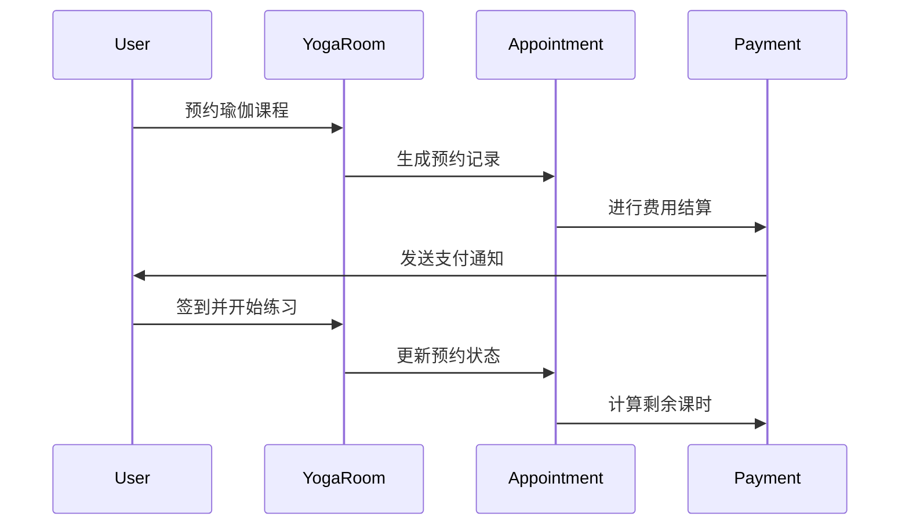
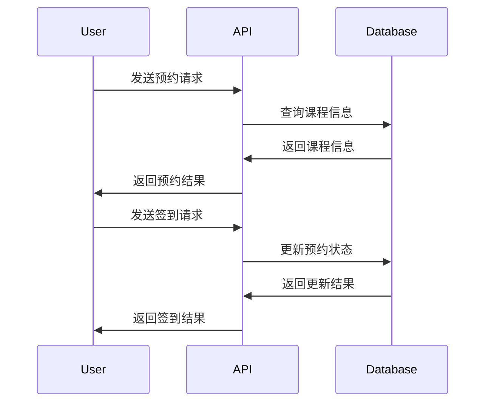

                 

# 新型城市共享瑜伽室：24小时自助瑜伽空间

## 关键词：城市共享、24小时自助、智能管理系统、智能瑜伽室、共享经济

> 摘要：本文将探讨新型城市共享瑜伽室——24小时自助瑜伽空间的背景、设计原则、智能管理系统、安全保障、经济效益分析以及其对社会的积极影响。通过逐步分析，揭示这一创新模式如何提高城市居民的生活质量，推动城市共享经济的发展。

## 目录大纲

### 第1章：引言与背景
#### 1.1 问题背景
##### 1.1.1 城市化与瑜伽需求
##### 1.1.2 瑜伽室现状
#### 1.2 核心概念
##### 1.2.1 共享瑜伽室
##### 1.2.2 新型城市共享瑜伽室
#### 1.3 目标与意义

### 第2章：新型城市共享瑜伽室设计原则
#### 2.1 设计理念
##### 2.1.1 环保性
##### 2.1.2 智能化
##### 2.1.3 便捷性
#### 2.2 空间布局
##### 2.2.1 功能分区
##### 2.2.2 空间设计
#### 2.3 舒适性
##### 2.3.1 空气质量
##### 2.3.2 光照

### 第3章：智能化管理系统
#### 3.1 系统概述
##### 3.1.1 系统架构
##### 3.1.2 系统功能
#### 3.2 技术实现
##### 3.2.1 物联网技术
##### 3.2.2 大数据分析

### 第4章：安全保障与应急预案
#### 4.1 安全措施
##### 4.1.1 设备安全
##### 4.1.2 人员安全
#### 4.2 应急预案
##### 4.2.1 突发事件处理
##### 4.2.2 应急演练

### 第5章：经济效益分析
#### 5.1 成本分析
##### 5.1.1 设备成本
##### 5.1.2 运营成本
#### 5.2 收益预测
##### 5.2.1 用户数量
##### 5.2.2 收益来源

### 第6章：社会影响与可持续发展
#### 6.1 社会影响
##### 6.1.1 对居民健康的影响
##### 6.1.2 对社区环境的影响
#### 6.2 可持续发展
##### 6.2.1 环保措施
##### 6.2.2 社区互动

### 第7章：未来展望
#### 7.1 发展趋势
##### 7.1.1 技术进步
##### 7.1.2 市场需求
#### 7.2 政策与法规
##### 7.2.1 政策支持
##### 7.2.2 法规环境

## 第1章：引言与背景

### 1.1 问题背景

随着城市化进程的加快，城市人口的快速增长带来了生活方式的巨大变化。在这个快节奏、高压力的环境中，人们对健康和生活方式的关注度日益提高。瑜伽作为一种古老而现代的健康生活方式，受到了越来越多城市居民的喜爱。然而，现有的瑜伽室往往存在时间限制、空间限制等问题，无法完全满足人们的需求。

城市化进程的加快，使得城市居民面临着生活节奏加快、工作压力增大的挑战。根据《2019年中国城市生活节奏报告》，超过70%的城市居民认为生活节奏过快，超过一半的人感到精神紧张。瑜伽作为一种身心放松的方式，正逐渐成为城市居民日常生活中不可或缺的一部分。据瑜伽行业数据分析，我国瑜伽用户规模已超过3亿人，其中城市居民占据了绝大多数。

然而，传统瑜伽室普遍存在以下问题：

1. **时间限制**：传统瑜伽室通常只能在特定的时间开放，无法满足上班族和夜猫族的需求。
2. **空间限制**：传统瑜伽室往往规模有限，无法容纳更多瑜伽爱好者同时练习。
3. **成本问题**：传统瑜伽室的收费较高，对于部分收入较低的群体来说，无法长期坚持。

为了解决这些问题，新型城市共享瑜伽室——24小时自助瑜伽空间应运而生。这种新型共享瑜伽室以全天候开放、智能管理、环保舒适为特点，为城市居民提供了一个便捷、高效、经济的瑜伽练习场所。

### 1.2 核心概念

#### 1.2.1 共享瑜伽室

共享瑜伽室是指一种以共享经济模式运营的瑜伽空间，通过共享的方式，降低用户的使用成本，提高资源利用效率。共享瑜伽室通常具有以下特点：

1. **全天候开放**：共享瑜伽室不受时间限制，用户可以在任何时间进入练习。
2. **自助服务**：用户通过智能管理系统进行预约、签到、费用结算等操作。
3. **高效利用资源**：共享瑜伽室通过共享的方式，提高了场地和设备的利用率。

#### 1.2.2 新型城市共享瑜伽室

新型城市共享瑜伽室是在传统共享瑜伽室的基础上，结合城市特点进行优化设计的。其特点如下：

1. **智能化管理**：通过物联网技术实现设备智能监控、智能照明、智能空调等功能。
2. **环保性**：采用环保材料，减少能耗，降低污染。
3. **便捷性**：提供全天候开放服务，满足不同人群的需求。
4. **个性化**：根据用户需求和偏好，提供定制化的瑜伽课程和练习方案。

### 1.3 目标与意义

新型城市共享瑜伽室的目标是提供一种全新的瑜伽练习方式，提高城市居民的生活质量，推动城市共享经济的发展。其意义如下：

1. **提高生活质量**：通过提供全天候、便捷、经济的瑜伽服务，帮助城市居民缓解压力，提高身心健康。
2. **推动共享经济**：新型城市共享瑜伽室是共享经济模式在城市服务领域的创新实践，有助于推动城市共享经济的发展。
3. **促进社区互动**：共享瑜伽室为社区居民提供了一个共同的空间，促进了邻里之间的交流和互动，提高了社区凝聚力。
4. **降低环境污染**：通过采用环保材料和智能管理系统，新型城市共享瑜伽室有助于降低能耗，减少环境污染。

## 第2章：新型城市共享瑜伽室设计原则

### 2.1 设计理念

新型城市共享瑜伽室的设计理念主要体现在环保性、智能化和便捷性三个方面。

#### 2.1.1 环保性

环保性是新型城市共享瑜伽室设计的重要原则之一。为了实现环保目标，设计过程中应采用环保材料，如可再生材料和低能耗材料，以减少资源消耗和环境污染。此外，智能管理系统应实现能耗的精细化控制，通过智能监控和调节，最大限度地降低能源消耗。

**环保性设计要点**：

1. **使用环保材料**：在瑜伽室的建造和装修过程中，优先选择环保、可再生材料，如竹子、木地板等。
2. **智能能耗管理**：采用智能监控系统，实时监测能源消耗，通过智能调节照明、空调等设备，实现节能降耗。

#### 2.1.2 智能化

智能化是新型城市共享瑜伽室的核心特点之一。通过物联网技术，实现设备间的互联互通，提供智能化服务，提升用户体验。

**智能化设计要点**：

1. **智能监控**：利用物联网传感器，实时监控瑜伽室内的环境参数，如空气质量、温度、湿度等。
2. **智能服务**：通过智能管理系统，实现预约、签到、费用结算等自助服务，提高用户便捷性。
3. **智能互动**：利用大数据分析用户行为，提供个性化瑜伽课程和练习方案。

#### 2.1.3 便捷性

便捷性是新型城市共享瑜伽室设计的重要原则之一。通过优化空间布局和服务流程，提高用户体验，满足不同用户的需求。

**便捷性设计要点**：

1. **全天候开放**：确保瑜伽室24小时开放，满足不同时间段的用户需求。
2. **自助服务**：提供自助预约、签到、费用结算等服务，减少用户等待时间。
3. **多功能空间**：合理划分功能区域，提供瑜伽练习区、休息区、更衣室等，满足用户多种需求。

### 2.2 空间布局

空间布局是新型城市共享瑜伽室设计的关键环节，直接影响用户体验。以下为空间布局的设计要点：

#### 2.2.1 功能分区

根据瑜伽室的功能需求，合理划分功能区域，包括：

1. **瑜伽练习区**：设置专门的瑜伽练习区域，确保足够的空间供用户练习。
2. **休息区**：提供舒适的休息区域，让用户在练习后能够放松身心。
3. **更衣室**：设置独立的更衣室，保障用户隐私。

#### 2.2.2 空间设计

空间设计应注重以下几个方面：

1. **通风采光**：确保室内空气清新，采用自然光源，营造舒适环境。
2. **色彩搭配**：选用柔和、清新的色彩，提升空间视觉效果。
3. **家具布局**：合理布置家具，确保通道畅通，方便用户移动。

### 2.3 舒适性

舒适性是用户选择瑜伽室的重要因素之一。以下为舒适性设计要点：

#### 2.3.1 空气质量

空气质量对用户健康至关重要。设计时应采取以下措施：

1. **空气净化**：安装空气净化设备，确保室内空气质量达到标准。
2. **通风系统**：设计良好的通风系统，保持室内空气流通。

#### 2.3.2 光照

良好的光照条件有助于提升用户心情和练习效果。设计时应注意：

1. **自然光源**：利用自然光源，减少人工照明，降低能耗。
2. **照明设计**：合理布局照明设备，确保光线柔和且均匀。

## 第3章：智能化管理系统

### 3.1 系统概述

新型城市共享瑜伽室的智能化管理系统是整个共享空间的灵魂，它负责提供高效、便捷的服务，同时保障系统的安全与稳定性。智能化管理系统主要包括以下几个核心功能：

#### 3.1.1 系统架构

智能化管理系统采用模块化设计，包括以下几个核心模块：

1. **用户管理模块**：负责用户注册、登录、权限管理等功能。
2. **预约管理模块**：提供瑜伽课程的预约、取消、查询等功能。
3. **签到管理模块**：实现用户签到、考勤等功能。
4. **费用结算模块**：处理瑜伽课程的费用结算、支付、退款等操作。
5. **智能监控模块**：负责实时监控瑜伽室的环境参数，如温度、湿度、空气质量等。
6. **数据分析模块**：对用户行为数据进行分析，提供个性化服务推荐。

#### 3.1.2 系统功能

智能化管理系统提供以下主要功能：

1. **用户自助服务**：用户可通过智能终端（如手机、平板电脑）自助完成瑜伽课程的预约、签到、费用结算等操作。
2. **实时监控**：通过物联网传感器，实时监控瑜伽室的环境参数，确保用户在舒适的环境中进行瑜伽练习。
3. **数据分析**：通过对用户行为数据进行分析，为用户提供个性化的瑜伽课程和练习方案。
4. **安全监控**：利用智能监控设备，保障用户在瑜伽室内的安全。
5. **维护管理**：实现设备的智能监控和维护，确保系统的稳定运行。

### 3.2 技术实现

智能化管理系统的实现涉及多个先进技术的应用，以下为技术实现的关键点：

#### 3.2.1 物联网技术

物联网技术在智能化管理系统中起到至关重要的作用，主要包括以下几个方面：

1. **设备接入**：通过RFID、NFC等物联网技术，实现瑜伽设备、传感器等设备的接入。
2. **数据传输**：采用MQTT等物联网协议，实现数据在设备和服务器之间的实时传输。
3. **数据分析**：利用大数据技术，对采集到的物联网数据进行实时分析和处理。

#### 3.2.2 大数据分析

大数据分析在智能化管理系统中主要用于以下几个方面：

1. **用户行为分析**：通过分析用户的历史行为数据，预测用户需求，提供个性化服务。
2. **环境监控分析**：通过对环境参数数据的分析，优化瑜伽室的环境设置，提高用户体验。
3. **设备维护分析**：通过设备运行数据的分析，预测设备故障，提前进行维护。

#### 3.2.3 智能算法

智能算法在智能化管理系统中用于实现以下功能：

1. **预约优化**：利用算法优化预约系统，提高预约成功率，减少用户等待时间。
2. **路径规划**：利用算法优化用户在瑜伽室内的行走路径，提高空间利用率。
3. **安全预警**：利用算法分析用户行为数据，实现安全隐患的预警和处置。

## 第4章：安全保障与应急预案

### 4.1 安全措施

为了保证新型城市共享瑜伽室的安全运行，设计了一系列安全措施，包括设备安全、人员安全等。

#### 4.1.1 设备安全

设备安全是智能化管理系统的重要组成部分，主要包括以下几个方面：

1. **设备监控**：通过物联网传感器，实时监控瑜伽室内的设备运行状态，确保设备安全。
2. **设备维护**：定期对设备进行检查和维护，确保设备正常运行。
3. **紧急停机**：在设备出现故障时，立即停机并报警，防止事故发生。

#### 4.1.2 人员安全

人员安全是保障用户在瑜伽室内安全练习的关键，主要包括以下几个方面：

1. **安全培训**：定期对瑜伽教练和员工进行安全培训，提高安全意识。
2. **安全提示**：在瑜伽室内设置明显的安全提示标志，提醒用户注意安全。
3. **应急预案**：制定详细的应急预案，应对可能发生的突发情况。

### 4.2 应急预案

应急预案是保障新型城市共享瑜伽室安全运行的重要手段，主要包括以下几个方面：

#### 4.2.1 突发事件处理

1. **火灾事故处理**：立即启动火灾应急预案，确保人员安全疏散，同时报警并呼叫消防部门。
2. **设备故障处理**：在设备出现故障时，立即停机并报警，同时通知维护人员进行维修。
3. **安全事故处理**：在发生安全事故时，立即启动安全事故应急预案，确保事故得到及时处理。

#### 4.2.2 应急演练

1. **定期演练**：定期组织应急演练，提高员工和用户应对突发事件的能力。
2. **演练评估**：对演练过程进行评估，总结经验教训，不断完善应急预案。
3. **演练记录**：记录每次应急演练的结果，为后续改进提供依据。

## 第5章：经济效益分析

### 5.1 成本分析

新型城市共享瑜伽室的经济效益分析主要包括设备成本和运营成本两个方面。

#### 5.1.1 设备成本

设备成本包括瑜伽室建设、设备采购、安装和调试等费用。具体成本项目如下：

1. **瑜伽室建设成本**：包括场地租赁、装修、设备安装等费用。
2. **设备采购成本**：包括瑜伽设备、物联网传感器、智能终端、空调、照明等设备的采购费用。
3. **安装调试成本**：包括设备安装、调试、测试等费用。

#### 5.1.2 运营成本

运营成本包括人力成本、电费、物业管理费、设备维护费等。具体成本项目如下：

1. **人力成本**：包括瑜伽教练、管理人员、安保人员的薪酬和福利费用。
2. **电费**：包括空调、照明、物联网传感器等设备的电费。
3. **物业管理费**：包括场地租赁、物业管理等费用。
4. **设备维护费**：包括设备维护、保养、更换等费用。

### 5.2 收益预测

#### 5.2.1 用户数量

用户数量是预测新型城市共享瑜伽室收益的关键因素。根据市场调研数据，预计在开业初期，每月平均用户数量将达到1000人，随着品牌知名度和用户口碑的提升，未来用户数量将逐步增加。

#### 5.2.2 收益来源

新型城市共享瑜伽室的收益来源主要包括以下几个方面：

1. **会费收入**：用户按月或按年缴纳的会员费用。
2. **课程收费**：瑜伽课程费用，包括私教课程、团体课程等。
3. **广告费**：与相关品牌合作，收取广告费用。
4. **设备租赁费**：瑜伽设备租赁费用。

通过以上分析，预计新型城市共享瑜伽室在开业第一年内的总收入将达到300万元，随着用户数量的增加和经营模式的优化，未来收入将进一步增长。

## 第6章：社会影响与可持续发展

### 6.1 社会影响

#### 6.1.1 对居民健康的影响

新型城市共享瑜伽室通过提供全天候、便捷、经济的瑜伽服务，对居民健康产生了积极影响：

1. **提高健康意识**：共享瑜伽室使得更多居民认识到瑜伽对身心健康的好处，提高了健康意识。
2. **改善生活方式**：居民通过定期练习瑜伽，改善生活方式，减少久坐不动的时间，有利于预防慢性疾病。
3. **减轻压力**：瑜伽的练习有助于缓解压力，提高睡眠质量，增强心理素质。

#### 6.1.2 对社区环境的影响

新型城市共享瑜伽室不仅关注居民健康，还对社区环境产生了积极影响：

1. **减少污染**：通过采用环保材料和智能能耗管理系统，新型共享瑜伽室减少了碳排放和能源消耗，对环境友好。
2. **促进社区互动**：共享瑜伽室为居民提供了一个共同的空间，促进了社区互动，增强了邻里关系。
3. **提高社区形象**：共享瑜伽室的建立提升了社区的整体形象，吸引了更多居民入住和参与社区活动。

### 6.2 可持续发展

新型城市共享瑜伽室的设计与运营遵循可持续发展的原则，从以下几个方面推动可持续发展：

#### 6.2.1 环保措施

1. **使用环保材料**：在瑜伽室的建设和装修中，优先使用环保材料，减少对环境的负面影响。
2. **智能能耗管理**：通过智能监控和能耗管理，降低能耗，减少碳排放。
3. **回收利用**：建立废弃物回收系统，对瑜伽室产生的废弃物进行分类回收和处理。

#### 6.2.2 社区互动

1. **社区活动**：定期组织瑜伽课程和社区活动，鼓励居民参与，增强社区凝聚力。
2. **志愿服务**：鼓励居民参与瑜伽室的志愿服务，共同维护瑜伽室的运营和环境卫生。
3. **邻里互助**：通过瑜伽室的建立，促进邻里之间的交流和互助，形成和谐的社区氛围。

## 第7章：未来展望

### 7.1 发展趋势

#### 7.1.1 技术进步

随着科技的不断发展，新型城市共享瑜伽室将受益于以下技术进步：

1. **人工智能**：人工智能技术的应用将进一步提升智能化管理系统的智能化水平，为用户提供更精准、个性化的服务。
2. **物联网**：物联网技术的进步将使得设备间的互联互通更加便捷，实现更高效的资源利用和管理。
3. **大数据分析**：大数据分析技术的应用将使得用户行为数据得到更深入的分析，为运营决策提供有力支持。

#### 7.1.2 市场需求

随着人们对健康生活方式的追求，新型城市共享瑜伽室的市场需求将逐渐增加。以下是市场需求的变化趋势：

1. **消费升级**：随着居民收入水平的提高，对健康生活方式的需求将更加多元化和个性化。
2. **便捷性需求**：随着城市化进程的加快，人们对于便捷、高效的生活服务需求将逐渐增加。
3. **智能化需求**：智能化、个性化的服务将成为用户选择瑜伽室的重要标准。

### 7.2 政策与法规

#### 7.2.1 政策支持

政策支持对于新型城市共享瑜伽室的发展至关重要。以下是相关政策支持的方向：

1. **环保政策**：政府将加大对环保产业的扶持力度，鼓励使用环保材料和技术，推动可持续发展。
2. **健康政策**：政府将加大对健康产业的投入，支持健康生活方式的推广和普及。
3. **共享经济政策**：政府将进一步完善共享经济政策法规，为新型城市共享瑜伽室提供良好的发展环境。

#### 7.2.2 法规环境

法规环境是新型城市共享瑜伽室发展的基础。以下是法规环境的发展趋势：

1. **法律法规完善**：政府将不断完善相关法律法规，为新型城市共享瑜伽室提供明确的政策指引。
2. **监管力度加大**：政府将加大对新型城市共享瑜伽室的监管力度，确保其合规运营。
3. **消费者权益保护**：政府将加大对消费者权益的保护力度，提高消费者的满意度。

作者：AI天才研究院/AI Genius Institute & 禅与计算机程序设计艺术 /Zen And The Art of Computer Programming

### 附录

#### A.1 核心概念术语说明

- **共享瑜伽室**：一种以共享经济模式运营的瑜伽空间，通过共享的方式，降低用户的使用成本，提高资源利用效率。
- **全天候自助瑜伽室**：一种24小时自助服务的瑜伽空间，用户可以随时进入练习，无需预约。
- **智能管理系统**：利用物联网技术、大数据分析和人工智能技术，实现瑜伽室的智能化管理和服务。
- **环保材料**：指在瑜伽室建设和装修过程中使用的对环境影响较小的材料，如竹子、木地板等。

#### A.2 概念属性特征对比表格

| 概念 | 特征 |
| --- | --- |
| 共享瑜伽室 | 1. 全天候开放 2. 自助服务 3. 资源共享 4. 降低成本 |
| 全天候自助瑜伽室 | 1. 24小时自助服务 2. 无需预约 3. 智能监控 4. 安全保障 |
| 智能管理系统 | 1. 物联网技术 2. 大数据分析 3. 人工智能 4. 高效管理 5. 个性化服务 |
| 环保材料 | 1. 可再生性 2. 环境友好 3. 能耗低 4. 减少污染 |

#### A.3 ER实体关系图架构

```mermaid
erDiagram
  User ||--|{ Appointment }
  User ||--|{ Payment }
  YogaRoom ||--|{ Appointment }
  YogaRoom ||--|{ Payment }
  YogaCourse ||--|{ Appointment }
  Appointment ||--|{ Payment }
```

#### A.4 系统架构设计mermaid架构图



#### A.5 系统接口设计和系统交互mermaid序列图



### 结束语

本文从多个角度探讨了新型城市共享瑜伽室——24小时自助瑜伽空间的设计、智能管理系统、安全保障、经济效益分析以及社会影响与可持续发展。通过逐步分析，我们揭示了这一创新模式如何满足城市居民的健康需求，提高生活质量，推动城市共享经济的发展。在未来，随着技术的进步和市场需求的增长，新型城市共享瑜伽室有望进一步优化，为城市居民提供更优质、便捷的健康服务。同时，我们也期待政策与法规的完善，为新型城市共享瑜伽室的发展提供更好的环境和支持。让我们共同期待这一创新模式的美好未来！

