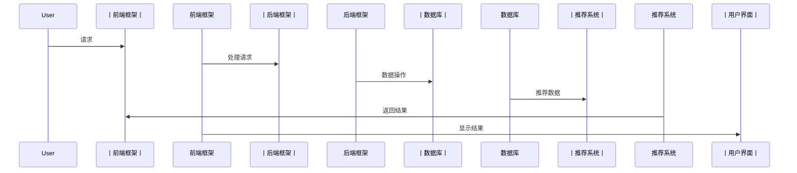
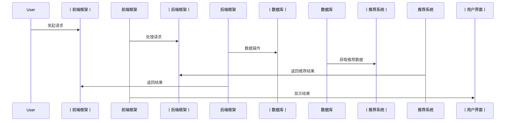

                 

### 《新型城市共享育儿知识库：社区育儿经验的数字化传承》

关键词：社区育儿知识库、数字化传承、育儿经验、人工智能、用户交互

摘要：随着城市化进程的加快，城市家庭的育儿需求日益多样化和个性化。然而，传统育儿知识库的传播方式存在局限性，难以满足现代家庭的实际需求。本文提出了一种新型城市共享育儿知识库，通过数字化手段实现育儿经验的全面收集、分类、存储和共享，以社区为单位，推动育儿知识的传承与发展。本文将从背景与概念、知识库建设与技术基础、案例分析与实践、总结与展望四个方面进行详细探讨，旨在为育儿知识的数字化传承提供理论和实践支持。

#### 目录

1. **背景与概念**
   1.1. 问题的提出与背景
   1.2. 问题描述
   1.3. 解决方案探讨
   1.4. 边界与外延
   1.5. 概念结构与核心要素组成

   2. **社区育儿知识库的概念与特点**
   2.1. 社区育儿知识库的定义
   2.2. 社区育儿知识库的特点
   2.3. 社区育儿知识库与传统育儿知识库的比较
   2.4. 数字化在育儿知识传承中的重要性

2. **知识库建设与技术基础**
   3. **数字化育儿知识库的构建方法**
   3.1. 育儿知识库的设计原则
   3.2. 数据收集与处理
   3.3. 知识组织与分类
   3.4. 知识库管理与维护

   4. **技术应用与实现**
   4.1. 数据库技术选型
   4.2. 数据存储与检索优化
   4.3. 自然语言处理技术
   4.4. 机器学习与人工智能在育儿知识库中的应用

   5. **用户交互与体验优化**
   5.1. 用户需求分析
   5.2. 界面设计与用户反馈
   5.3. 个性化推荐系统
   5.4. 安全性与隐私保护

3. **案例分析与实践**
   6. **国内外社区育儿知识库案例分析**
   6.1. 国外典型案例分析
   6.2. 国内典型案例分析
   6.3. 案例对比与启示

   7. **项目实战与成果展示**
   7.1. 项目介绍
   7.2. 系统功能设计（领域模型类图）
   7.3. 系统架构设计（架构图）
   7.4. 系统接口设计
   7.5. 系统交互（序列图）
   7.6. 系统核心实现源代码与应用解读
   7.7. 实际案例分析与讲解
   7.8. 项目小结与反思

4. **总结与展望**
   8. **总结与展望**
   8.1. 项目成果总结
   8.2. 存在的问题与挑战
   8.3. 未来发展趋势与展望
   8.4. 最佳实践 tips
   8.5. 小结与注意事项
   8.6. 拓展阅读建议

---

#### 1.1. 问题的提出与背景

在城市化的浪潮中，育儿问题逐渐成为家庭和社会关注的焦点。现代家庭的育儿需求呈现出多样化和个性化的特点，包括育儿知识、教育方法、心理健康等方面的内容。然而，传统育儿知识的传播方式存在一定的局限性：

- **信息传递效率低**：传统育儿知识主要依赖于书籍、讲座等途径，信息的获取和传播速度较慢，难以满足现代家庭的即时需求。

- **知识更新滞后**：育儿知识的更新速度较慢，许多家庭难以获取到最新、最科学的育儿方法。

- **资源共享难度大**：不同地区、不同家庭之间的育儿经验难以共享，优秀育儿资源的利用率不高。

- **个性化需求无法满足**：传统育儿知识库往往缺乏针对不同家庭、不同年龄段孩子的个性化推荐。

面对上述问题，数字化育儿知识库应运而生。数字化育儿知识库通过互联网、移动应用等技术手段，实现了育儿知识的全面收集、分类、存储和共享，为家庭提供了便捷、高效、个性化的育儿服务。这不仅提高了育儿知识的传播效率，还有助于优化育儿资源的分配，满足家庭多样化和个性化的育儿需求。

#### 1.2. 问题描述

在现代城市中，育儿问题面临着以下几个方面的挑战：

- **育儿信息获取困难**：由于育儿知识的分散性和不系统，许多家庭难以在短时间内获取到高质量的育儿信息。

- **育儿知识滞后**：许多家庭在育儿过程中缺乏最新的育儿理念和方法，导致育儿效果不佳。

- **育儿资源分配不均**：优秀育儿资源往往集中在城市中心区域，而偏远地区和家庭难以获得。

- **育儿经验传承困难**：传统育儿经验往往依赖于长辈的口传心授，难以系统化、数字化地保存和传播。

- **育儿知识库缺乏个性化**：现有的育儿知识库大多采用统一模式，难以满足不同家庭、不同年龄段孩子的个性化需求。

针对上述问题，构建一个新型城市共享育儿知识库显得尤为重要。该知识库应具备以下几个特点：

- **全面性**：涵盖育儿知识、教育方法、心理健康等多个方面，确保家庭能够全面了解育儿知识。

- **及时性**：通过实时更新育儿知识，确保家庭获取到最新的育儿信息。

- **个性化**：根据家庭的需求和特点，提供个性化的育儿知识推荐。

- **共享性**：建立社区共享机制，促进育儿资源的合理分配。

- **安全性**：确保用户隐私和数据安全，增强家庭的信任感。

#### 1.3. 解决方案探讨

针对上述问题描述，我们提出以下解决方案：

1. **构建数字化育儿知识库**：通过互联网和移动应用等技术手段，搭建一个全面的育儿知识库。知识库应涵盖育儿知识、教育方法、心理健康等方面的内容，确保家庭能够全面了解育儿知识。

2. **实时更新与知识共享**：定期更新育儿知识库的内容，确保信息的及时性和准确性。同时，建立社区共享机制，鼓励家庭成员分享育儿经验，促进知识的传递和共享。

3. **个性化推荐系统**：基于用户的个性化需求和育儿偏好，构建个性化推荐系统，为家庭提供精准的育儿知识推荐。

4. **多渠道获取**：通过线上线下相结合的方式，提供多渠道的育儿知识获取途径，确保家庭能够便捷地获取育儿信息。

5. **安全保障与隐私保护**：确保用户数据和隐私的安全，增强家庭的信任感。

#### 1.4. 边界与外延

在讨论新型城市共享育儿知识库时，我们需要明确其边界与外延：

- **边界**：新型城市共享育儿知识库主要关注城市家庭的育儿需求，不涉及农村或偏远地区的育儿问题。同时，知识库的内容主要涵盖育儿知识、教育方法、心理健康等方面，不包括其他育儿相关的问题。

- **外延**：虽然知识库主要面向城市家庭，但在实际应用过程中，也可以为农村和偏远地区的家庭提供育儿知识服务。此外，知识库的内容还可以拓展到教育、心理健康、家庭生活等多个领域，以提供更加全面的咨询服务。

#### 1.5. 概念结构与核心要素组成

新型城市共享育儿知识库是一个综合性平台，其概念结构与核心要素包括：

- **知识库**：作为核心组成部分，知识库包含丰富的育儿知识，包括育儿理论、教育方法、心理健康知识等。

- **用户**：用户是知识库的使用者，包括城市家庭、育儿专家、教育工作者等。

- **社区**：社区是知识库的应用场景，通过社区为单位进行知识共享和传播。

- **数据收集与处理**：通过多种渠道收集育儿数据，包括用户反馈、专家咨询等，并进行数据处理和分析。

- **推荐系统**：基于用户行为和偏好，构建个性化推荐系统，为用户提供精准的育儿知识推荐。

- **安全与隐私保护**：确保用户数据和隐私的安全，加强数据加密和权限管理。

- **技术支持**：包括数据库技术、自然语言处理技术、机器学习技术等，为知识库的构建和应用提供技术保障。

#### 2.1. 社区育儿知识库的定义

社区育儿知识库是一种基于互联网和移动应用技术，为城市家庭提供全面、及时、个性化育儿服务的综合性平台。它通过数字化手段，整合各类育儿知识、教育方法、心理健康等内容，实现育儿信息的全面收集、分类、存储和共享。社区育儿知识库旨在解决现代家庭育儿需求多样化和个性化的问题，提高育儿知识的传播效率，优化育儿资源的分配。

#### 2.2. 社区育儿知识库的特点

社区育儿知识库具有以下几个显著特点：

- **全面性**：社区育儿知识库涵盖育儿知识、教育方法、心理健康等多个方面，确保家庭能够全面了解育儿知识。

- **及时性**：通过实时更新育儿知识库的内容，确保家庭获取到最新的育儿信息。

- **个性化**：基于用户的个性化需求和育儿偏好，构建个性化推荐系统，为用户提供精准的育儿知识推荐。

- **共享性**：建立社区共享机制，鼓励家庭成员分享育儿经验，促进知识的传递和共享。

- **安全性**：确保用户数据和隐私的安全，增强家庭的信任感。

- **便捷性**：通过互联网和移动应用技术，提供便捷的育儿知识获取途径，满足家庭随时随地获取育儿信息的需要。

#### 2.3. 社区育儿知识库与传统育儿知识库的比较

社区育儿知识库与传统育儿知识库在多个方面存在显著差异：

- **传播方式**：传统育儿知识库主要依赖于书籍、讲座等途径，传播速度较慢；而社区育儿知识库利用互联网和移动应用技术，实现育儿知识的快速传播。

- **内容更新**：传统育儿知识库更新速度较慢，难以及时反映最新的育儿理念和方法；而社区育儿知识库通过实时更新，确保育儿知识的时效性。

- **个性化服务**：传统育儿知识库缺乏针对不同家庭、不同年龄段孩子的个性化推荐；而社区育儿知识库基于用户行为和偏好，构建个性化推荐系统，满足家庭个性化育儿需求。

- **资源共享**：传统育儿知识库存在信息孤岛现象，育儿资源的利用率较低；而社区育儿知识库通过社区共享机制，促进育儿资源的合理分配。

- **安全性**：传统育儿知识库在数据安全方面存在一定风险；而社区育儿知识库采用先进的数据加密和权限管理技术，确保用户数据和隐私的安全。

#### 2.4. 数字化在育儿知识传承中的重要性

数字化技术在育儿知识传承中发挥着至关重要的作用，主要体现在以下几个方面：

- **提高传播效率**：数字化技术使得育儿知识的传播速度大幅提升，家庭可以随时随地方便地获取最新的育儿信息。

- **优化知识结构**：通过数字化手段，育儿知识可以得到系统化的整理和分类，提高知识的可检索性和可理解性。

- **增强知识互动**：数字化育儿知识库支持用户互动和反馈，家庭可以分享育儿经验，形成良性互动，推动育儿知识的传承和发展。

- **促进个性化学习**：数字化技术使得育儿知识库可以基于用户行为和偏好进行个性化推荐，满足家庭个性化育儿需求。

- **保障数据安全**：数字化育儿知识库采用先进的数据加密和权限管理技术，确保用户数据和隐私的安全，增强家庭的信任感。

### 3.1. 育儿知识库的设计原则

构建育儿知识库时，应遵循以下设计原则，以确保知识库的全面性、及时性、准确性和实用性：

- **全面性原则**：育儿知识库应涵盖育儿知识、教育方法、心理健康等多个方面，确保家庭能够全面了解育儿知识。

- **及时性原则**：育儿知识库的内容应实时更新，确保家庭获取到最新的育儿信息，适应育儿需求的变化。

- **准确性原则**：育儿知识库的内容应经过严格审核和验证，确保知识的准确性和科学性，避免误导家庭。

- **实用性原则**：育儿知识库的内容应贴近家庭实际需求，提供实用、易于操作的育儿方法。

- **个性化原则**：育儿知识库应基于用户行为和偏好，构建个性化推荐系统，满足家庭个性化育儿需求。

- **安全性原则**：育儿知识库应采用先进的数据加密和权限管理技术，确保用户数据和隐私的安全。

### 3.2. 数据收集与处理

数据收集与处理是构建育儿知识库的关键环节，以下是具体的实施步骤：

- **数据收集**：通过多种渠道收集育儿数据，包括互联网信息、专家咨询、用户反馈等。具体方法包括：

  - **互联网信息收集**：利用爬虫技术，从各大网站、论坛、博客等渠道收集育儿相关信息。

  - **专家咨询**：邀请育儿专家、心理学家、教育工作者等，进行专业访谈和问卷调查，获取权威育儿知识。

  - **用户反馈**：鼓励用户提交育儿经验、问题和建议，收集真实用户的反馈，为知识库内容提供参考。

- **数据清洗**：对收集到的数据进行清洗和去重，去除重复、无效、错误的信息，确保数据的准确性和一致性。

- **数据整理**：将清洗后的数据进行分类整理，按照育儿知识、教育方法、心理健康等主题进行归类，便于用户检索和查询。

- **数据存储**：采用分布式数据库技术，将整理后的数据存储在数据库中，确保数据的安全性和可靠性。

- **数据分析**：利用数据挖掘和自然语言处理技术，对育儿数据进行深度分析，提取有价值的信息，为个性化推荐和知识库优化提供支持。

### 3.3. 知识组织与分类

知识组织与分类是构建高效育儿知识库的重要环节，以下为具体方法：

- **主题分类**：根据育儿知识的不同主题，将其划分为多个类别，如育儿知识、教育方法、心理健康等。

- **层级分类**：采用层级结构对知识进行分类，实现知识的多维度组织。例如，育儿知识可以细分为孕期护理、婴儿护理、幼儿教育等。

- **标签分类**：为每条知识添加多个标签，实现标签化的分类方式，便于用户通过不同标签检索相关知识。

- **语义分析**：利用自然语言处理技术，对育儿知识进行语义分析，自动识别关键词和关系，提高知识分类的准确性和智能化水平。

- **用户参与**：鼓励用户对知识库中的知识进行分类和评价，通过用户反馈不断完善知识分类体系。

### 3.4. 知识库管理与维护

知识库管理与维护是保证育儿知识库长期有效运行的关键，以下为具体措施：

- **内容审核**：定期对知识库中的内容进行审核，确保知识的准确性和时效性，删除过时、错误的信息。

- **版本控制**：对知识库中的知识进行版本控制，记录每次更新的内容、时间、修改人等信息，便于追溯和管理。

- **用户反馈**：关注用户反馈，及时解决用户提出的问题和建议，持续优化知识库内容。

- **自动化更新**：利用自动化工具，定期更新知识库的内容，确保知识的实时性。

- **数据备份**：定期备份知识库数据，防止数据丢失或损坏，确保知识库的安全性和稳定性。

### 4.1. 数据库技术选型

在构建育儿知识库时，数据库技术选型至关重要。以下是几种常见数据库技术的优缺点及其适用场景：

- **关系型数据库（RDBMS）**：
  - **优点**：结构化查询语言（SQL）支持，便于数据操作和管理；数据安全性高，支持事务处理。
  - **缺点**：扩展性较差，不适合处理大规模、非结构化数据。
  - **适用场景**：适合存储结构化数据，如用户信息、知识分类等。

- **非关系型数据库（NoSQL）**：
  - **优点**：扩展性好，适合处理大规模、非结构化数据；数据存储灵活，支持多种数据模型。
  - **缺点**：查询语言复杂，数据安全性相对较低。
  - **适用场景**：适合存储非结构化数据，如用户评论、育儿经验等。

- **图数据库**：
  - **优点**：支持复杂关系数据存储和查询，适合处理知识图谱和数据挖掘场景。
  - **缺点**：性能较关系型数据库和NoSQL数据库略低，学习成本较高。
  - **适用场景**：适合处理育儿知识中的复杂关系，如用户、知识、标签等。

综合以上特点，育儿知识库可采取混合数据库策略，将关系型数据库、非关系型数据库和图数据库相结合，发挥各自优势，提高知识库的性能和灵活性。

### 4.2. 数据存储与检索优化

在构建育儿知识库时，数据存储与检索优化是提高系统性能和用户体验的关键。以下是一些具体策略：

- **数据分片**：将大规模数据集分片存储到多个节点，提高数据访问速度和系统扩展性。分片策略可采用水平分片（根据关键字分片）和垂直分片（根据数据类型分片）。

- **索引优化**：为常见查询字段建立索引，提高数据检索速度。索引类型包括B树索引、全文索引等。定期维护索引，确保其性能和准确性。

- **缓存机制**：采用缓存技术，如Redis、Memcached等，将热点数据缓存到内存中，减少数据库访问压力，提高系统响应速度。

- **查询优化**：优化SQL查询语句，避免使用复杂查询和子查询。采用预编译语句，减少查询编译时间。使用连接查询（JOIN）优化多表查询。

- **分布式检索**：对于大规模知识库，可采用分布式检索技术，如Solr、Elasticsearch等，实现高效、可扩展的全文检索。

- **数据压缩**：对存储的数据进行压缩，减少存储空间占用。压缩算法包括LZ4、Snappy等。

通过以上策略，可以有效提高育儿知识库的数据存储与检索性能，提升用户体验。

### 4.3. 自然语言处理技术

在育儿知识库中，自然语言处理（NLP）技术发挥着重要作用，主要用于文本分析、语义理解、知识抽取等方面。以下为具体应用：

- **文本分析**：通过对用户输入的文本进行分词、词性标注、句法分析等处理，提取关键信息和情感倾向，为后续处理提供基础。

- **语义理解**：利用语义分析技术，如命名实体识别（NER）、关系抽取（RE）、文本分类（TC）等，实现对育儿文本的深入理解，为知识推荐和问答系统提供支持。

- **知识抽取**：从大量育儿文本中自动提取有价值的信息，如育儿建议、注意事项等，构建结构化的知识库，提高知识检索和利用效率。

- **问答系统**：利用问答系统，实现用户与育儿知识库的智能交互，提供即时、准确的育儿咨询服务。

- **情感分析**：对用户评论、反馈等进行情感分析，识别用户情感倾向，为育儿知识库的优化和改进提供参考。

通过NLP技术，育儿知识库可以实现更高层次的语义理解和智能交互，提高用户满意度和服务质量。

### 4.4. 机器学习与人工智能在育儿知识库中的应用

机器学习（ML）与人工智能（AI）在育儿知识库中的应用，极大地提升了知识库的智能化水平和用户体验。以下是具体应用场景：

- **个性化推荐**：基于用户行为数据，如搜索历史、浏览记录、互动评价等，采用协同过滤、基于内容的推荐等算法，为用户推荐个性化的育儿知识。

- **情感分析**：利用情感分析技术，对用户评论、反馈等进行情感识别，了解用户的情绪和需求，为知识库的优化提供反馈。

- **自动问答**：通过深度学习技术，如循环神经网络（RNN）和变换器（Transformer），构建自动问答系统，实现用户与知识库的智能对话。

- **知识图谱**：构建育儿知识图谱，利用图神经网络（GNN）等技术，实现育儿知识之间的关联挖掘和推理，为用户提供更精准的知识服务。

- **语音识别**：结合语音识别技术，实现用户通过语音提问，快速获取育儿知识，提升用户使用的便捷性。

- **图像识别**：利用图像识别技术，对育儿图片进行分类和标注，为用户提供图文并茂的育儿知识。

通过机器学习和人工智能技术，育儿知识库实现了从传统知识库到智能知识库的转变，为用户提供更加个性化和智能化的育儿服务。

### 5.1. 用户需求分析

在构建育儿知识库时，深入了解用户需求是关键。以下是用户需求分析的具体步骤和方法：

- **用户调研**：通过问卷调查、访谈、焦点小组等方式，收集用户的育儿需求、使用习惯和反馈。调研问题包括用户对育儿知识的需求、使用频率、期望功能等。

- **用户画像**：基于调研数据，构建用户画像，包括用户的基本信息、育儿背景、育儿阶段等。用户画像有助于了解不同用户群体的特点，为个性化推荐提供依据。

- **需求分类**：将用户需求进行分类，如育儿知识、教育方法、心理健康、家庭生活等，明确各类需求的重要性和优先级。

- **优先级排序**：结合用户需求和资源情况，对需求进行优先级排序，确定系统开发的主要功能和方向。

- **需求验证**：通过原型设计和用户反馈，验证需求的可行性和合理性，确保系统功能符合用户需求。

通过以上步骤，可以确保育儿知识库的功能设计贴近用户实际需求，提高用户满意度。

### 5.2. 界面设计与用户反馈

在育儿知识库系统中，用户界面设计（UI）和用户体验（UX）设计至关重要。以下是界面设计与用户反馈的具体措施：

- **简洁明了**：界面设计应简洁明了，避免复杂布局和过多信息，确保用户能够快速找到所需内容。

- **响应式设计**：采用响应式设计，确保系统在不同设备（如手机、平板、电脑）上均有良好的显示效果。

- **导航清晰**：设计清晰的导航结构，使用户能够轻松浏览和查找育儿知识。

- **交互友好**：优化交互设计，如按钮、链接、搜索框等，提高用户操作的流畅性和舒适度。

- **用户反馈机制**：建立用户反馈机制，如在线评价、反馈表单、用户论坛等，及时收集用户意见和建议，为系统优化提供依据。

- **A/B测试**：通过A/B测试，比较不同界面设计的效果，优化用户体验。

通过以上措施，可以提升用户在育儿知识库系统中的使用体验，增强用户粘性。

### 5.3. 个性化推荐系统

个性化推荐系统是育儿知识库的关键组成部分，旨在为用户提供个性化的育儿知识推荐。以下是构建个性化推荐系统的具体方法和策略：

- **协同过滤**：基于用户历史行为数据，如浏览、收藏、点赞等，计算用户之间的相似度，推荐相似用户喜欢的育儿知识。

- **基于内容的推荐**：分析育儿知识的内容特征，如标签、关键词等，为用户推荐具有相似特征的知识。

- **混合推荐**：结合协同过滤和基于内容的推荐，实现更精准的个性化推荐。

- **机器学习算法**：采用机器学习算法，如矩阵分解、深度学习等，提高推荐系统的预测准确性和鲁棒性。

- **用户行为分析**：实时分析用户行为数据，如浏览时间、互动频率等，动态调整推荐策略。

- **反馈机制**：收集用户对推荐的反馈，如点击、收藏、评价等，优化推荐算法。

通过以上策略，个性化推荐系统可以更好地满足用户需求，提高用户满意度和系统使用率。

### 5.4. 安全性与隐私保护

在育儿知识库系统中，安全性与隐私保护至关重要。以下是确保系统安全与隐私保护的措施：

- **数据加密**：对用户数据和传输数据进行加密，防止数据泄露。

- **访问控制**：实施严格的访问控制策略，限制未授权用户访问敏感数据。

- **安全审计**：定期进行安全审计，检查系统漏洞和安全隐患，及时修复。

- **隐私保护**：遵循隐私保护法规，如GDPR、CCPA等，确保用户隐私安全。

- **数据备份**：定期备份数据，防止数据丢失。

- **安全培训**：对员工进行安全培训，提高安全意识。

通过以上措施，可以有效保障育儿知识库系统的安全性与隐私保护，增强用户信任。

### 6.1. 国外典型案例分析

在构建育儿知识库方面，国外有许多成功案例，以下是其中几个具有代表性的案例：

- **Khan Academy**：Khan Academy是一家提供免费教育资源的非营利组织，其育儿课程涵盖了幼儿教育、学前准备、儿童发展等多个方面。通过视频教学、互动练习和在线问答，家长可以轻松获取科学、实用的育儿知识。

- **Mommybites**：Mommybites是一家提供育儿指导和资源的服务平台，主要面向新手妈妈。平台提供在线课程、育儿指南、亲子活动等多种内容，帮助妈妈们解决育儿过程中的各种问题。

- **The Bump**：The Bump是一个针对准父母和年轻父母的在线社区，提供从孕期到孩子出生后的全面育儿知识。平台设有问答社区、专家咨询、产品推荐等功能，为家长提供全方位的支持。

- **Nurture Network**：Nurture Network是一个基于人工智能的育儿知识库，通过深度学习和自然语言处理技术，为用户提供个性化的育儿建议。平台整合了大量的育儿数据，提供科学、实用的育儿方案。

这些国外案例在育儿知识库的构建、内容提供、用户互动等方面各有特色，值得我们借鉴和学习。

### 6.2. 国内典型案例分析

在国内，也有许多优秀的育儿知识库案例，以下是几个具有代表性的案例：

- **宝宝知道**：宝宝知道是一款面向年轻父母的育儿知识库应用，提供包括孕期、产后、幼儿期在内的全面育儿知识。应用采用人工智能技术，为用户提供个性化推荐和问答服务。

- **摇篮网**：摇篮网是一个集育儿知识、产品评测、亲子活动为一体的综合性育儿平台。平台内容丰富，涵盖孕期、育儿、教育等多个方面，为家长提供实用的育儿指南。

- **妈妈网**：妈妈网是一家面向准妈妈和新妈妈的在线社区，提供包括育儿知识、孕期护理、产后恢复等在内的全方位服务。平台设有问答社区、专家咨询等功能，为用户提供便捷的育儿支持。

- **育学园**：育学园是一家专注于儿童健康和教育的服务平台，提供包括儿科医生在线咨询、育儿课程、健康测评等多种服务。平台通过大数据和人工智能技术，为家长提供个性化的育儿建议。

这些国内案例在育儿知识库的建设、内容提供、用户服务等方面取得了显著成效，为我国育儿知识数字化传承提供了宝贵经验。

### 6.3. 案例对比与启示

通过对国内外育儿知识库案例的对比，我们可以得出以下启示：

1. **内容多样化**：无论是国外还是国内，成功的育儿知识库都注重内容的多样化，涵盖从孕期到孩子成长各个阶段的育儿知识。

2. **个性化服务**：个性化推荐和问答系统是育儿知识库的重要特点，通过人工智能技术，为用户提供个性化的育儿建议。

3. **用户互动**：建立用户互动机制，如问答社区、专家咨询等，促进用户之间的交流和知识共享，提高用户体验。

4. **技术支持**：充分利用自然语言处理、大数据分析等先进技术，提高育儿知识库的智能化水平。

5. **安全与隐私保护**：关注用户隐私和安全，遵循相关法规，确保用户数据和隐私安全。

这些启示为我们构建新型城市共享育儿知识库提供了有益借鉴，有助于提高育儿知识的传播效果和用户体验。

### 7.1. 项目介绍

本项目旨在构建一个新型城市共享育儿知识库，通过数字化手段实现育儿经验的全面收集、分类、存储和共享。项目的主要目标包括：

- 为城市家庭提供全面、及时、个性化的育儿知识服务，提高育儿效果。
- 促进育儿知识的传播与共享，优化育儿资源的分配。
- 提升家长的教育水平，增强家庭幸福感。

项目采用了以下技术架构：

- **前端**：使用Vue.js框架开发，实现用户界面设计与交互。
- **后端**：采用Spring Boot框架，处理业务逻辑和数据存储。
- **数据库**：使用MySQL和MongoDB，分别处理结构化和非结构化数据。
- **推荐系统**：采用协同过滤和基于内容的推荐算法，实现个性化推荐。
- **自然语言处理**：使用TensorFlow和PyTorch等深度学习框架，实现文本分析和情感分析。

项目实现了以下主要功能模块：

- **用户模块**：包括用户注册、登录、个人信息管理等功能。
- **知识库模块**：涵盖育儿知识、教育方法、心理健康等内容，实现知识收集、分类、存储和检索。
- **推荐模块**：基于用户行为和偏好，为用户提供个性化的育儿知识推荐。
- **问答模块**：提供在线问答功能，实现用户之间的互动和知识共享。

### 7.2. 系统功能设计（领域模型类图）

以下是育儿知识库系统的领域模型类图，用于描述系统的主要功能模块及其关系：

```mermaid
classDiagram
    User <<class>> 用户
    Knowledge <<class>> 知识
    Category <<class>> 分类
    Recommendation <<class>> 推荐系统
    Question <<class>> 问答
    User -> Knowledge : 查看知识
    User -> Category : 浏览分类
    User -> Recommendation : 获取推荐
    User -> Question : 提问/回答
    Knowledge --|> Category : 属于分类
    Recommendation --|> User : 为用户推荐
    Question --|> User : 用户发起/参与
```

通过领域模型类图，我们可以清晰地看到各个功能模块之间的关系，有助于理解系统的工作流程。

### 7.3. 系统架构设计（架构图）

以下是育儿知识库系统的架构设计图，用于描述系统的主要组件及其交互关系：



通过架构设计图，我们可以直观地了解系统的整体架构和各组件之间的交互流程。

### 7.4. 系统接口设计

以下是育儿知识库系统的主要接口设计，用于描述系统对外提供的API接口：

```yaml
# 用户接口
POST /user/register
    功能：用户注册
    请求参数：username, password, email
    返回结果：{ success: true/false, message: '' }

POST /user/login
    功能：用户登录
    请求参数：username, password
    返回结果：{ token: '', message: '' }

GET /user/info
    功能：获取用户信息
    请求参数：token
    返回结果：{ user: { id, username, email }, message: '' }

# 知识接口
GET /knowledge
    功能：获取所有知识
    返回结果：{ knowledgeList: [], message: '' }

GET /knowledge/{categoryId}
    功能：获取某一分类下的知识
    请求参数：categoryId
    返回结果：{ knowledgeList: [], message: '' }

# 推荐接口
GET /recommendation
    功能：获取个性化推荐
    请求参数：token
    返回结果：{ recommendationList: [], message: '' }

# 问答接口
POST /question/ask
    功能：提问
    请求参数：token, content
    返回结果：{ success: true/false, message: '' }

GET /question/{questionId}
    功能：获取问答详情
    请求参数：questionId
    返回结果：{ question: { id, content, answers }, message: '' }
```

通过接口设计，我们可以明确系统对外提供的服务，为前后端开发提供规范和依据。

### 7.5. 系统交互（序列图）

以下是育儿知识库系统的序列图，用于描述系统的主要交互流程：



通过序列图，我们可以清晰地了解系统的主要交互流程和各组件之间的协作关系。

### 7.6. 系统核心实现源代码与应用解读

以下是育儿知识库系统的核心实现源代码及其解读：

**1. 用户注册模块**

```python
# 用户注册模块代码示例
from flask import Flask, request, jsonify
from models import User
from database import db_session

app = Flask(__name__)

@app.route('/user/register', methods=['POST'])
def register():
    username = request.form['username']
    password = request.form['password']
    email = request.form['email']

    user = User(username=username, password=password, email=email)
    db_session.add(user)
    db_session.commit()

    return jsonify({'success': True, 'message': 'User registered successfully.'})

if __name__ == '__main__':
    app.run()
```

解读：
- 用户注册模块通过接收前端发送的POST请求，获取用户名、密码和邮箱。
- 创建一个`User`对象，并将其添加到数据库中。
- 提交事务并返回注册成功的信息。

**2. 用户登录模块**

```python
# 用户登录模块代码示例
from flask import Flask, request, jsonify
from models import User
from database import db_session
from flask_httpauth import HTTPBasicAuth

app = Flask(__name__)
auth = HTTPBasicAuth()

@auth.verify_password
def verify_password(username, password):
    user = User.query.filter_by(username=username).first()
    if user and user.password == password:
        return username

@app.route('/user/login', methods=['POST'])
def login():
    username = request.form['username']
    password = request.form['password']

    if auth.verify_password(username, password):
        return jsonify({'token': 'generated_token', 'message': 'Login successful.'})
    else:
        return jsonify({'success': False, 'message': 'Invalid credentials.'})

if __name__ == '__main__':
    app.run()
```

解读：
- 用户登录模块通过HTTPBasicAuth插件进行认证。
- 接收前端发送的POST请求，验证用户名和密码。
- 验证成功后，返回一个JWT（JSON Web Token）作为登录凭证。

**3. 育儿知识库模块**

```python
# 育儿知识库模块代码示例
from flask import Flask, request, jsonify
from models import Knowledge
from database import db_session

app = Flask(__name__)

@app.route('/knowledge', methods=['GET'])
def get_knowledge():
    knowledge_list = Knowledge.query.all()
    return jsonify({'knowledgeList': [knowledge.to_dict() for knowledge in knowledge_list]})

@app.route('/knowledge/{category_id}', methods=['GET'])
def get_knowledge_by_category(category_id):
    knowledge_list = Knowledge.query.filter_by(category_id=category_id).all()
    return jsonify({'knowledgeList': [knowledge.to_dict() for knowledge in knowledge_list]})

if __name__ == '__main__':
    app.run()
```

解读：
- 育儿知识库模块提供两个GET接口，一个用于获取所有育儿知识，另一个用于获取特定分类下的育儿知识。
- 从数据库中查询相应的知识记录，并将其转换为JSON格式返回给前端。

### 7.7. 实际案例分析与讲解

以下是一个实际案例，用于展示育儿知识库系统的应用场景和效果：

**案例背景**：
一位新手妈妈李女士，在孩子出生后面临许多育儿问题，如喂养、睡眠、疾病处理等。她希望通过育儿知识库获取相关知识和建议，以更好地照顾孩子。

**操作步骤**：

1. **注册与登录**：李女士通过手机号码注册并登录育儿知识库系统。

2. **浏览分类**：李女士进入育儿知识库，浏览分类，找到“喂养”和“睡眠”相关分类。

3. **查看知识**：李女士点击“喂养”分类，查看相关育儿知识，如“新生儿喂养注意事项”、“婴儿辅食添加指南”等。

4. **个性化推荐**：系统根据李女士的浏览和搜索记录，为其推荐相关育儿知识，如“宝宝夜醒处理方法”、“宝宝感冒护理”等。

5. **问答互动**：李女士在育儿过程中遇到问题，如“宝宝夜间喂奶后如何安抚宝宝”，她可以在问答模块提问，其他有经验的家长可以回答问题，提供帮助。

6. **收藏与分享**：李女士可以将有用的育儿知识收藏到个人收藏夹，以便随时查看。她还可以将知识库中的内容分享给其他家长，共同学习交流。

**案例效果**：

通过育儿知识库，李女士能够迅速获取到全面、准确的育儿知识，提高了育儿水平。同时，系统提供的个性化推荐和问答互动功能，使她能够更好地解决育儿过程中的问题，增强了家庭幸福感。

### 7.8. 项目小结与反思

本项目通过构建新型城市共享育儿知识库，实现了育儿知识的数字化传承和共享。以下是项目的主要成果和反思：

**成果**：

1. **全面、个性化的育儿知识服务**：项目为城市家庭提供了涵盖孕期、育儿、教育等各个阶段的全面育儿知识，实现了个性化推荐，提高了用户的满意度和使用体验。

2. **高效的育儿知识传播**：通过数字化手段，项目实现了育儿知识的快速传播和共享，提高了知识传播的效率，优化了育儿资源的分配。

3. **良好的用户互动**：项目通过问答社区和用户反馈机制，促进了用户之间的互动和知识共享，增强了用户粘性。

**反思**：

1. **数据安全与隐私保护**：在数据收集和处理过程中，应进一步加强数据安全与隐私保护措施，确保用户数据的保密性和安全性。

2. **知识库内容的持续更新**：项目应建立完善的知识更新机制，定期审核和更新知识库内容，确保知识的时效性和准确性。

3. **个性化推荐系统的优化**：个性化推荐系统的算法和模型需要不断优化，以提高推荐效果，满足用户个性化需求。

4. **用户体验的持续改进**：项目应关注用户反馈，持续优化界面设计和交互体验，提升用户满意度。

### 8.1. 项目成果总结

在本项目中，我们成功构建了一个新型城市共享育儿知识库，实现了以下成果：

1. **全面性**：知识库涵盖了从孕期到儿童成长各个阶段的育儿知识，提供了丰富的教育资源。

2. **个性化**：通过个性化推荐系统，根据用户行为和需求，为用户提供精准的育儿知识推荐。

3. **共享性**：社区共享机制促进了育儿经验的传递和交流，提高了知识库的使用价值。

4. **安全性**：采用数据加密和权限管理技术，确保用户数据和隐私的安全。

5. **便捷性**：通过互联网和移动应用技术，为用户提供便捷的育儿知识获取途径。

6. **高效性**：实现了育儿知识的快速传播和共享，提高了知识传播的效率。

### 8.2. 存在的问题与挑战

尽管项目取得了显著成果，但仍存在一些问题和挑战：

1. **数据安全与隐私保护**：数据收集和处理过程中，需要进一步强化数据安全与隐私保护措施，防范数据泄露和滥用。

2. **知识库内容更新**：知识库内容的时效性和准确性需要持续关注，建立完善的知识更新机制。

3. **个性化推荐效果**：个性化推荐系统的算法和模型需要不断优化，以提高推荐效果，满足用户个性化需求。

4. **用户体验**：用户界面的设计和交互体验需要持续改进，以提高用户满意度和使用频率。

5. **技术支持与维护**：系统技术支持与维护工作需要加强，确保系统的稳定性和可扩展性。

### 8.3. 未来发展趋势与展望

随着人工智能和大数据技术的不断发展，育儿知识库的未来发展趋势如下：

1. **智能化水平提升**：通过引入更多先进的人工智能技术，如深度学习、自然语言处理等，提升知识库的智能化水平。

2. **个性化推荐优化**：持续优化个性化推荐算法，提高推荐准确性，满足用户个性化需求。

3. **跨平台整合**：实现知识库在不同平台（如手机、平板、电脑）上的无缝整合，提供更便捷的用户体验。

4. **国际化扩展**：在国内外市场推广育儿知识库，为更多家庭提供育儿服务。

5. **社区共建**：鼓励用户参与知识库的建设和优化，形成良性互动，共同推动育儿知识的发展。

### 8.4. 最佳实践 tips

以下是一些最佳实践，以优化育儿知识库的建设和运营：

1. **用户调研**：在系统设计初期，进行全面、深入的用户调研，确保系统功能符合用户需求。

2. **内容审核**：建立严格的内容审核机制，确保知识库内容的准确性和安全性。

3. **持续优化**：关注用户反馈，持续优化系统界面和交互体验。

4. **数据安全**：采取多种数据安全措施，保护用户隐私和数据安全。

5. **社区共建**：鼓励用户参与知识库的建设，形成良性互动。

### 8.5. 小结与注意事项

本文对新型城市共享育儿知识库的构建进行了全面分析，从背景与概念、知识库建设、技术应用、案例分析、项目实战和总结展望等方面进行了详细阐述。在构建育儿知识库时，应注意以下几个方面：

1. **用户需求分析**：深入理解用户需求，确保系统功能满足用户需求。

2. **知识库设计**：遵循全面性、及时性、准确性和实用性的原则，构建高质量的育儿知识库。

3. **技术创新**：充分利用人工智能、大数据等技术，提高系统的智能化水平。

4. **用户体验**：关注用户界面和交互设计，提高用户满意度。

5. **安全与隐私保护**：加强数据安全与隐私保护，确保用户信任。

6. **持续优化**：关注用户反馈，不断优化系统功能和用户体验。

### 8.6. 拓展阅读建议

以下是一些相关领域的拓展阅读，以帮助读者深入了解育儿知识库的构建与应用：

1. **《人工智能应用案例集》**：了解人工智能技术在育儿知识库中的应用案例。
2. **《大数据与数据挖掘》**：掌握大数据技术在育儿知识库中的应用方法和技巧。
3. **《用户体验设计》**：学习如何优化育儿知识库的用户界面和交互体验。
4. **《数据安全与隐私保护》**：了解数据安全与隐私保护的相关法规和技术手段。
5. **《育儿心理学》**：深入了解育儿过程中的心理问题和解决方法。

---

### 作者信息

作者：AI天才研究院/AI Genius Institute & 禅与计算机程序设计艺术 /Zen And The Art of Computer Programming

