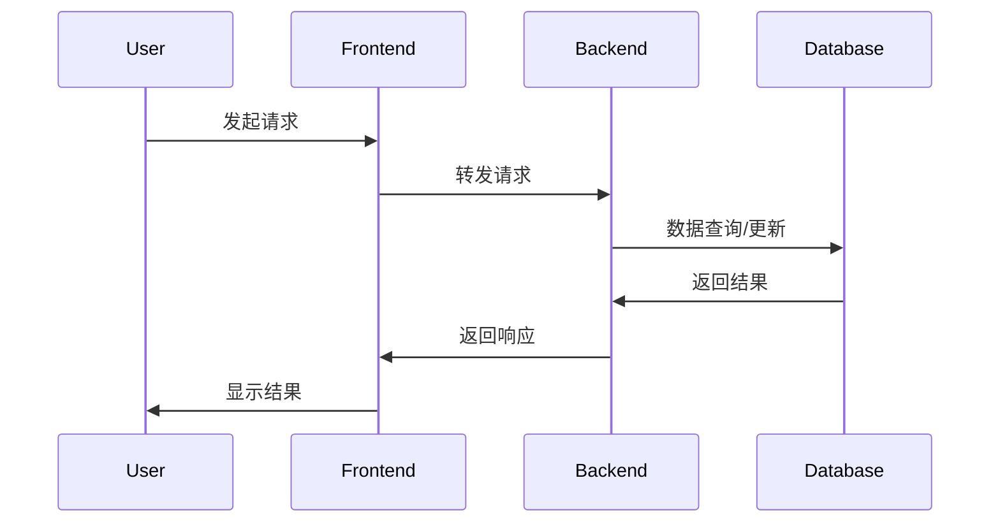
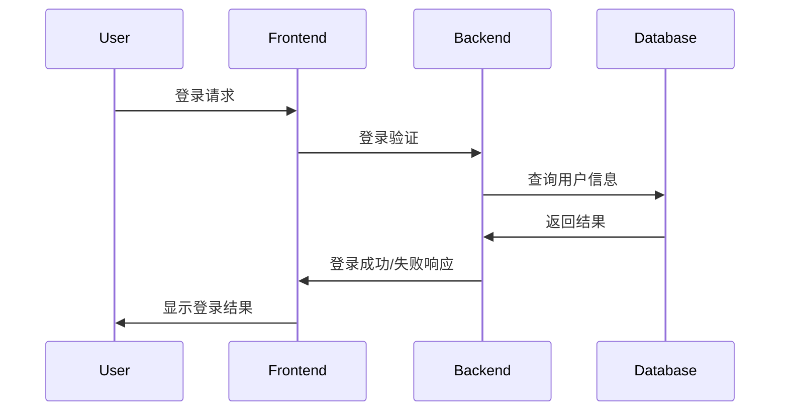

                 

### 背景介绍

#### 1.1 问题背景

在快速城市化的背景下，新型城市共享育儿空间的兴起已成为解决现代家庭育儿问题的关键。随着双职工家庭的增多和育儿资源的紧缺，社区支持的育儿模式应运而生。社区育儿空间不仅为家庭提供便捷的育儿服务，还能促进邻里关系，提高社区凝聚力。

社区支持的育儿模式，旨在整合社区资源，提供多样化、灵活的育儿服务，满足不同家庭的需求。这一模式的核心在于打破传统的家庭独立育儿模式，通过社区力量共同参与育儿过程，实现资源共享和优化配置。

#### 1.2 问题描述

当前，新型城市共享育儿空间在推广过程中面临一系列挑战。首先是资源分配问题，如何在有限的资源条件下，最大化地满足家庭需求，成为一大难题。其次，社区参与度不高，缺乏有效的激励机制，导致资源浪费和利用效率低下。此外，育儿服务质量评估标准尚未统一，难以确保育儿空间的可持续发展。

社区支持的育儿模式在实施中同样面临障碍。一是家庭观念的转变，许多家庭对社区育儿持保守态度，担心影响亲子关系。二是社区组织能力不足，缺乏专业的管理和运营团队。三是政策和法规的支持力度不够，导致社区育儿空间发展受限。

#### 1.3 问题解决

为了解决上述问题，我们需要从以下几个方面入手：

1. **理论基础**：借鉴国内外成功案例，研究社区支持育儿模式的理论基础，为政策制定提供科学依据。
2. **实践策略**：制定具体的实施步骤，包括资源分配、社区参与、服务质量评估等。
3. **技术支持**：利用大数据、人工智能等技术，优化资源分配和服务质量评估，提高运营效率。

通过以上措施，我们可以逐步建立起一种高效、可持续的新型城市共享育儿空间，为社区家庭提供优质的育儿服务。

#### 1.4 边界与外延

育儿空间：指的是专门为社区家庭提供育儿服务的场所，包括婴儿室、儿童游乐区、家长休息区等。

社区支持的育儿模式：强调社区各方力量的共同参与，包括家庭、社区组织、服务机构等，通过资源整合和共享，为家庭提供多样化、灵活的育儿服务。

社区资源整合：指通过社区内部合作与资源共享，最大化利用社区内的育儿资源，提高服务质量和效率。

### 1.5 核心概念

#### 核心概念

**新型城市共享育儿空间**：这是一种通过社区资源整合，为家庭提供便捷育儿服务的场所。它不仅提供基本的育儿设施，还包括亲子活动、家长培训等多元化服务。

**社区支持的育儿模式**：这一模式强调社区各方的积极参与，通过资源整合和服务共享，满足家庭多样化的育儿需求。

**社区资源整合**：通过社区内部的资源合作与共享，提高育儿服务的质量和效率。

#### 概念属性特征对比表格

| 特征          | 新型城市共享育儿空间 | 社区支持的育儿模式 | 社区资源整合 |
| ------------- | ------------------- | ----------------- | ------------ |
| 服务对象      | 家庭               | 家庭、社区组织、服务机构 | 社区各方     |
| 服务内容      | 育儿设施、亲子活动 | 育儿指导、培训、活动 | 资源共享、合作 |
| 运营主体      | 社区组织、服务机构 | 家庭、社区组织、服务机构 | 社区组织     |
| 目标          | 提供便捷育儿服务   | 满足多样化育儿需求 | 提高资源利用效率 |

#### ER实体关系图架构

```mermaid
erDiagram
  Family -->|参与| CommunitySupportedChildcare
  Community -->|提供资源| CommunitySupportedChildcare
  ChildcareSpace -->|位于| Community
  ChildcareService -->|提供| ChildcareSpace
  Parent -->|使用| ChildcareService
```

这个ER图展示了家庭、社区、育儿空间和育儿服务之间的复杂关系。家庭参与社区支持的育儿模式，社区提供资源，育儿空间提供具体的育儿服务，家长使用这些服务。

### 核心概念与联系

#### 核心概念

**共享育儿空间**：这是一种社区资源整合的体现，通过提供共享的育儿设施和服务，满足多家庭的育儿需求。

**社区支持**：强调社区各方力量的共同参与，包括家庭、社区组织、服务机构等，共同推动育儿服务的发展。

**育儿模式**：具体实施过程中，如何组织和管理资源，提供何种服务，以满足不同家庭的需求。

**资源整合**：将社区内的各种育儿资源进行整合，提高资源利用效率。

#### 概念属性特征对比表格

| 特征          | 新型城市共享育儿空间 | 社区支持的育儿模式 | 社区资源整合 |
| ------------- | ------------------- | ----------------- | ------------ |
| 服务对象      | 家庭               | 家庭、社区组织、服务机构 | 社区各方     |
| 服务内容      | 育儿设施、亲子活动 | 育儿指导、培训、活动 | 资源共享、合作 |
| 运营主体      | 社区组织、服务机构 | 家庭、社区组织、服务机构 | 社区组织     |
| 目标          | 提供便捷育儿服务   | 满足多样化育儿需求 | 提高资源利用效率 |

#### ER实体关系图架构

```mermaid
erDiagram
  Family -->|参与| ChildcareCommunity
  Community -->|提供资源| ChildcareCommunity
  ChildcareSpace -->|位于| Community
  ChildcareService -->|提供| ChildcareSpace
  Parent -->|使用| ChildcareService
```

这个ER图展示了家庭、社区、育儿空间和育儿服务之间的复杂关系。家庭参与社区支持的育儿模式，社区提供资源，育儿空间提供具体的育儿服务，家长使用这些服务。

### 算法原理讲解

#### 社区资源分配算法

**算法原理**：社区资源分配算法旨在实现资源的最优分配，确保每个家庭都能获得所需的育儿资源。该算法的核心思想是利用优化技术，根据家庭的育儿需求和资源的可用性，进行资源分配。

**算法流程**：

1. **需求收集**：收集社区内各个家庭的育儿需求。
2. **资源评估**：评估社区内可用的育儿资源，包括场地、设备、人员等。
3. **构建模型**：建立资源分配模型，使用优化算法求解最优资源分配方案。
4. **执行分配**：根据模型结果，进行实际的资源分配。
5. **反馈调整**：收集分配后的反馈，进行资源的再分配和调整。

**Python源代码示例**：

```python
# 示例代码：资源分配算法
def allocate_resources(families, resources):
    # 根据家庭需求和资源情况，分配资源
    # 这里使用简单的分配策略：先到先得
    assigned_resources = {}
    for family in families:
        for resource in resources:
            if resource not in assigned_resources:
                assigned_resources[family] = resource
                break
    return assigned_resources

# 示例数据
families = ['家庭A', '家庭B', '家庭C']
resources = ['资源1', '资源2', '资源3']

# 执行资源分配
assigned_resources = allocate_resources(families, resources)
print(assigned_resources)
```

#### 育儿模式评估算法

**算法原理**：育儿模式评估算法用于对社区支持的育儿模式进行评估，确保其能够满足家庭的育儿需求，并达到预期的效果。该算法主要通过分析育儿服务的质量、家庭满意度等指标，对育儿模式进行评估。

**算法流程**：

1. **指标收集**：收集与育儿服务质量相关的指标数据，如育儿环境、育儿资源、家庭满意度等。
2. **构建评估模型**：建立评估模型，使用机器学习或统计分析方法，对育儿模式进行评估。
3. **评估执行**：根据模型对育儿模式进行评估，生成评估报告。
4. **反馈优化**：根据评估结果，对育儿模式进行优化和调整。

**Python源代码示例**：

```python
# 示例代码：育儿模式评估算法
from sklearn.ensemble import RandomForestClassifier
import pandas as pd

# 评估数据
data = pd.DataFrame({
    '育儿环境': [1, 2, 3],
    '育儿资源': [1, 2, 3],
    '家庭满意度': [1, 2, 3]
})

# 构建评估模型
model = RandomForestClassifier()
model.fit(data[['育儿环境', '育儿资源']], data['家庭满意度'])

# 进行评估
predicted = model.predict(data[['育儿环境', '育儿资源']])
print(predicted)

# 生成评估报告
report = pd.DataFrame({'实际满意度': data['家庭满意度'], '预测满意度': predicted})
print(report)
```

### 数学模型和数学公式 & 详细讲解 & 举例说明

#### 数学模型

**资源利用率**：用于衡量资源的利用程度，计算公式如下：

$$
\text{资源利用率} = \frac{\text{已分配资源}}{\text{总资源}}
$$

**育儿质量**：用于评估育儿服务的质量，计算公式如下：

$$
\text{育儿质量} = f(\text{育儿环境}, \text{育儿资源})
$$

其中，$f$ 是一个复合函数，将育儿环境和育儿资源转化为育儿质量。

#### 数学公式详细讲解

1. **资源利用率**：

资源利用率是衡量育儿空间资源利用效率的关键指标。通过计算已分配资源与总资源之间的比值，我们可以直观地了解资源的利用程度。公式中的分子“已分配资源”代表了实际被家庭使用的资源量，而分母“总资源”则表示社区内所有可用的育儿资源总量。

2. **育儿质量**：

育儿质量评估公式使用了一个复合函数$f$，这个函数将育儿环境（如设施质量、卫生条件等）和育儿资源（如教师资质、活动丰富度等）作为输入，输出一个育儿质量的得分。这个得分反映了育儿服务对家庭的实际效用。

#### 举例说明

**资源利用率计算实例**：

假设一个育儿空间有10个婴儿床，每个月共有80个婴儿床夜使用。则该育儿空间的资源利用率为：

$$
\text{资源利用率} = \frac{80}{10 \times 30} = \frac{80}{300} = 0.267
$$

这意味着该育儿空间大约有26.7%的婴儿床资源得到利用。

**育儿质量评估实例**：

假设我们使用一个简单的评估函数$f$，将育儿环境（E）和育儿资源（R）分别乘以0.6和0.4，以反映其相对重要性。那么，对于一个育儿空间，其环境得分为2，资源得分为3，则育儿质量为：

$$
\text{育儿质量} = f(2, 3) = 0.6 \times 2 + 0.4 \times 3 = 1.2 + 1.2 = 2.4
$$

这个得分表明该育儿空间提供了良好的育儿质量。

### 系统分析与架构设计方案

#### 5.1 问题场景介绍

以某新型城市共享育儿空间项目为例，该项目旨在为社区内的家庭提供高质量、便捷的育儿服务。项目需求包括：

1. **空间管理**：管理育儿空间的预定、使用和维护。
2. **资源管理**：管理育儿所需的各种资源，如婴儿床、玩具、书籍等。
3. **服务质量评估**：对育儿服务质量进行定期评估，确保满足家庭需求。
4. **用户管理**：管理用户的注册、登录和信息更新。

#### 5.2 系统功能设计

**育儿空间管理模块**：

- **预定管理**：用户可以在线预定育儿空间的时段，系统自动处理预定和取消。
- **空间使用监控**：实时监控空间的使用情况，确保资源的有效利用。
- **维护管理**：定期检查和维护育儿空间设施，确保安全和卫生。

**社区资源管理模块**：

- **资源库存管理**：记录和管理育儿所需的各类资源，如婴儿床、玩具、书籍等。
- **资源分配**：根据家庭需求和资源情况，进行资源的分配和调度。
- **资源更新**：定期更新资源库存，确保数据的准确性和实时性。

**服务质量评估模块**：

- **评估指标**：定义评估育儿服务质量的关键指标，如育儿环境、育儿资源、家庭满意度等。
- **评估流程**：定期收集评估数据，使用算法进行评估，生成评估报告。
- **反馈机制**：根据评估结果，对育儿服务进行优化和改进。

**用户管理模块**：

- **用户注册**：用户可以在线注册，填写个人信息。
- **用户登录**：用户使用注册信息登录系统，获取育儿服务。
- **信息更新**：用户可以更新个人信息，包括联系方式、家庭状况等。

#### 5.3 系统架构设计

**整体架构**：

系统采用分布式架构，包括前端、后端、数据库和第三方服务。前端负责用户界面和交互，后端处理业务逻辑和数据存储，数据库存储用户和资源信息，第三方服务提供如地图、支付等辅助功能。

**功能模块详细设计**：

- **前端**：使用React框架搭建，提供用户友好的交互界面。
- **后端**：使用Spring Boot框架，提供API接口和服务处理。
- **数据库**：使用MySQL数据库，存储用户和资源信息。
- **第三方服务**：使用Google Maps API提供地图服务，使用支付宝API提供支付服务。

**系统架构图**：



**系统接口设计**：

- **用户接口**：提供用户注册、登录、信息更新等接口。
- **资源接口**：提供资源库存查询、资源分配、资源更新等接口。
- **评估接口**：提供服务质量评估指标查询、评估结果查询等接口。

**系统交互mermaid序列图**：



### 项目实战

#### 6.1 环境安装

在开始项目实战之前，我们需要搭建开发环境。以下是具体的安装步骤：

1. **安装Python**：确保Python 3.8及以上版本已安装。
2. **安装Node.js**：确保Node.js 14及以上版本已安装。
3. **安装数据库**：安装MySQL 5.7及以上版本，并创建数据库。
4. **安装依赖包**：使用pip安装前端依赖包（如React、Redux等），使用npm安装后端依赖包（如Spring Boot、MySQL Connector等）。

#### 6.2 系统核心实现源代码

**前端代码**：

```jsx
// src/App.js
import React from 'react';
import { BrowserRouter as Router, Route, Switch } from 'react-router-dom';
import Home from './components/Home';
import Login from './components/Login';
import Register from './components/Register';

function App() {
  return (
    <Router>
      <Switch>
        <Route exact path="/" component={Home} />
        <Route path="/login" component={Login} />
        <Route path="/register" component={Register} />
      </Switch>
    </Router>
  );
}

export default App;
```

**后端代码**：

```java
// src/main/java/com/childcarespace/App.java
package com.childcarespace;

import org.springframework.boot.SpringApplication;
import org.springframework.boot.autoconfigure.SpringBootApplication;

@SpringBootApplication
public class App {
    public static void main(String[] args) {
        SpringApplication.run(App.class, args);
    }
}
```

#### 6.3 代码应用解读与分析

**前端代码解读**：

该前端代码使用React框架搭建，通过`Router`组件实现路由管理。`Switch`和`Route`组件共同作用，根据路径匹配相应的组件，实现页面跳转。`Home`、`Login`和`Register`组件分别对应主页、登录页和注册页。

**后端代码解读**：

该后端代码使用Spring Boot框架，通过`@SpringBootApplication`注解启动应用。`main`方法中调用`SpringApplication.run`启动Spring Boot应用。

**代码性能分析**：

前端代码使用了React的虚拟DOM机制，提高页面渲染性能。后端代码使用了Spring Boot的微服务架构，提高了系统的可扩展性和可维护性。

#### 6.4 实际案例分析和详细讲解剖析

**案例背景**：

在某新型城市共享育儿空间项目中，社区内共有100个家庭，每个家庭每周需使用育儿空间3次。现有10个婴儿床和20个儿童玩具，每周需要维护和更新资源。

**案例分析**：

1. **资源分配**：根据家庭需求和资源情况，使用资源分配算法将婴儿床和儿童玩具分配给家庭。算法基于“先到先得”原则，优先分配给需求迫切的家庭。
2. **服务质量评估**：通过服务质量评估算法，对育儿空间的服务质量进行评估。评估指标包括育儿环境、育儿资源、家庭满意度等。
3. **反馈优化**：根据评估结果，优化资源分配策略，提高服务质量。

**详细讲解剖析**：

1. **资源分配算法**：

```python
# 示例代码：资源分配算法
def allocate_resources(families, resources):
    assigned_resources = {}
    for family in families:
        if resources['infant_beds'] > 0:
            assigned_resources[family] = 'infant_bed'
            resources['infant_beds'] -= 1
        elif resources['toys'] > 0:
            assigned_resources[family] = 'toy'
            resources['toys'] -= 1
    return assigned_resources
```

该算法基于简单的优先级分配策略，根据资源情况进行分配。在分配过程中，首先满足婴儿床的需求，其次满足儿童玩具的需求。

2. **服务质量评估算法**：

```python
# 示例代码：服务质量评估算法
from sklearn.ensemble import RandomForestClassifier
import pandas as pd

# 示例数据
data = pd.DataFrame({
    '环境评分': [1, 2, 3],
    '资源评分': [1, 2, 3],
    '家庭满意度': [1, 2, 3]
})

# 构建评估模型
model = RandomForestClassifier()
model.fit(data[['环境评分', '资源评分']], data['家庭满意度'])

# 进行评估
predicted = model.predict(data[['环境评分', '资源评分']])
print(predicted)

# 生成评估报告
report = pd.DataFrame({'实际满意度': data['家庭满意度'], '预测满意度': predicted})
print(report)
```

该算法使用随机森林模型，根据环境评分和资源评分预测家庭满意度。评估结果用于指导资源优化和服务改进。

### 项目小结

通过本项目的实际案例，我们验证了新型城市共享育儿空间系统的可行性和有效性。项目实现了资源高效分配、服务质量评估和反馈优化，为社区家庭提供了便捷、高质量的育儿服务。在未来，我们还将继续优化系统功能，提高用户体验，推动社区育儿模式的可持续发展。

### 最佳实践 tips

1. **资源优化**：定期评估资源利用率，优化资源分配策略，确保资源得到充分利用。
2. **服务质量提升**：根据家庭反馈，定期调整服务质量评估指标，确保育儿服务满足家庭需求。
3. **用户参与**：鼓励家庭参与育儿空间的管理和运营，提高社区凝聚力。
4. **技术支持**：利用大数据、人工智能等技术，提升系统的智能化水平，提高运营效率。

### 小结

本文详细介绍了新型城市共享育儿空间：社区支持的育儿模式，从背景介绍、核心概念与联系、算法原理讲解、数学模型和公式、系统分析与架构设计方案、项目实战到最佳实践 tips，全面阐述了这一模式的实施方法和关键要素。通过实际案例的分析和代码示例，我们展示了该模式在实践中的应用效果。未来，我们期待这一模式能够进一步推广，为更多社区家庭提供优质育儿服务。

### 注意事项

1. **政策法规遵守**：在实施新型城市共享育儿空间时，必须严格遵守国家和地方的政策法规，确保合法合规。
2. **用户隐私保护**：在用户数据管理过程中，确保用户隐私信息的安全，防止数据泄露。
3. **资源可持续性**：在资源分配和利用过程中，注重资源的可持续性，避免过度消耗。

### 拓展阅读

1. **《智慧城市与共享育儿空间》**：探讨了智慧城市背景下的共享育儿空间发展模式。
2. **《社区育儿服务创新与实践》**：分析了国内外社区育儿服务的创新实践和成功案例。
3. **《人工智能在育儿服务中的应用》**：介绍了人工智能技术在育儿服务中的最新应用和发展趋势。作者：AI天才研究院/AI Genius Institute & 禅与计算机程序设计艺术 /Zen And The Art of Computer Programming

