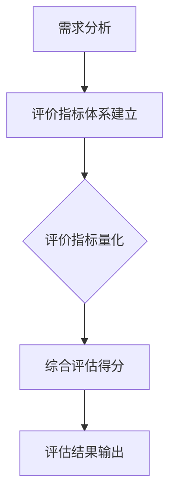
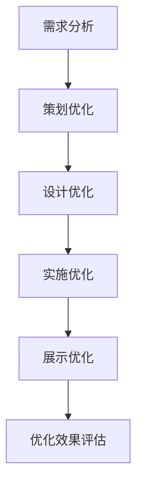
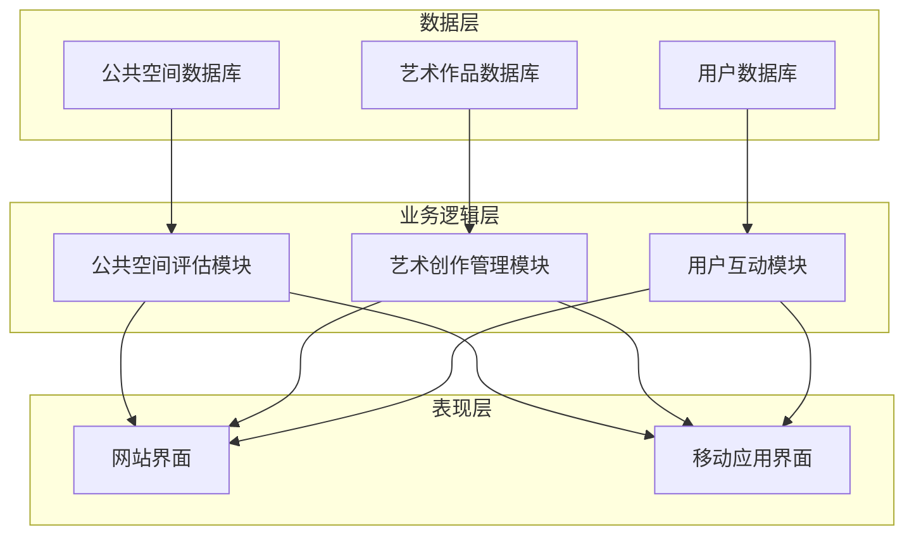

                 


## 第1章 引言

### 1.1 背景介绍

新型城市共享艺术墙，顾名思义，是指在城市的公共空间中，通过艺术创作和集体参与，打造出一种具有互动性和参与性的艺术形式。这种艺术墙不仅仅是简单的墙面装饰，更是一种公共文化载体，它能够激发公众的创造力和参与热情，提升城市公共空间的文化价值和审美水平。

#### 1.1.1 新型城市共享艺术墙的定义

新型城市共享艺术墙可以理解为公共空间与艺术创作相结合的产物，其核心要素包括：

- **公共空间**：指的是供公众使用的空间，如街道、广场、公园等。
- **艺术创作**：涉及到艺术作品的设计、制作和展示。
- **集体参与**：公众不仅作为观众，更作为创作者参与到艺术墙的建设中。

用数学语言来描述，我们可以将新型城市共享艺术墙表示为：

$$
\text{新型城市共享艺术墙} = \text{公共空间} + \text{艺术创作} + \text{集体参与}
$$

#### 1.1.2 新型城市共享艺术墙的意义

新型城市共享艺术墙在提升公共空间的美学价值、促进社会互动和文化传承方面具有重要意义。

- **提升公共空间的美学价值**：通过艺术墙的装饰，公共空间变得更加美观和富有艺术气息，提升了市民的生活质量。
- **促进社会互动**：艺术墙的创作和展示过程可以吸引公众参与，促进了不同背景、不同年龄段人群之间的互动。
- **文化传承**：艺术墙可以展示城市的历史文化，弘扬地方特色，传承传统文化。

#### 1.1.3 新型城市共享艺术墙的现状

新型城市共享艺术墙在国内外的应用已经呈现出良好的发展态势。

- **国内案例**：如北京的798艺术区，成都的宽窄巷子，上海的田子坊等，都是将公共空间与艺术创作相结合的典范。
- **国外案例**：如伦敦的街头涂鸦艺术、纽约的布鲁克林桥艺术区等，这些城市通过艺术墙的建设，不仅提升了公共空间的美学价值，也促进了文化的发展。

此外，政策方面，许多城市也在积极出台相关政策，支持新型城市共享艺术墙的建设和推广。例如，中国政府提出的“城市文化复兴计划”中，就将新型城市共享艺术墙列为重点项目之一。

### 1.2 公共空间的集体创作

公共空间的集体创作是新型城市共享艺术墙的重要组成部分，它涉及到多个方面的内容。

#### 1.2.1 创作模式

公共空间的集体创作模式可以分为以下两种：

- **自下而上的社区参与**：这种模式强调公众的自主性和创造性，社区成员自发组织，共同参与艺术墙的创作。
- **自上而下的政府引导**：这种模式强调政府的引导作用，政府提供资金、技术和管理支持，引导公众参与艺术墙的创作。

#### 1.2.2 参与者

参与者主要包括以下几类：

- **艺术家**：他们负责艺术墙的设计和创作，提供专业的艺术指导。
- **设计师**：他们负责艺术墙的视觉效果设计，确保艺术墙的美学价值。
- **公众**：他们作为艺术墙的参与者和体验者，共同参与艺术墙的创作和展示。

#### 1.2.3 创作过程

创作过程可以分为以下几个阶段：

- **策划与准备**：确定艺术墙的主题、内容和形式，进行前期的准备工作。
- **创作与实施**：艺术家和设计师根据策划方案，进行艺术墙的创作和实施。
- **展示与评价**：艺术墙完成后，进行公开展示，公众可以对艺术墙进行评价和反馈。

### 1.3 新型城市共享艺术墙对公共空间的影响

新型城市共享艺术墙对公共空间的影响是多方面的，主要体现在以下几个方面：

#### 1.3.1 美学价值的提升

通过艺术墙的装饰，公共空间的美学价值得到了显著提升。艺术墙的设计和创作，不仅丰富了公共空间的视觉元素，还提升了公共空间的审美水平。

#### 1.3.2 社会互动的促进

艺术墙的创作和展示过程，吸引了大量公众的参与，促进了社会互动。公众在参与艺术墙的创作过程中，不仅增进了对艺术的了解和欣赏，还加强了社区凝聚力。

#### 1.3.3 文化传承的弘扬

艺术墙可以展示城市的历史文化，弘扬地方特色，传承传统文化。通过艺术墙的展示，公众可以更好地了解和传承城市的文化。

## 第2章 核心概念与联系

### 2.1 核心概念

为了更好地理解新型城市共享艺术墙，我们需要明确几个核心概念。

#### 2.1.1 公共空间

公共空间是指供公众使用的空间，如街道、广场、公园等。这些空间具有开放性、共享性和公共性，是城市生活中不可或缺的部分。

#### 2.1.2 艺术创作

艺术创作是指通过视觉、听觉、触觉等感官形式，表达艺术家对世界的理解和感悟。艺术创作包括绘画、雕塑、音乐、舞蹈等多种形式。

#### 2.1.3 集体创作

集体创作是指由多人合作完成的艺术创作过程。它强调集体智慧和合作精神，通过分工和协作，实现艺术创作的目标和效果。

### 2.2 概念属性特征对比表格

为了更清晰地理解公共空间、艺术创作和集体创作的属性特征，我们可以通过对比表格来展示它们之间的差异。

| 概念        | 定义           | 特点                                     |
| ----------- | -------------- | ---------------------------------------- |
| 公共空间    | 公共使用的空间 | 公平性、开放性、共享性                   |
| 艺术创作    | 创造艺术作品   | 独创性、审美性、表现性                   |
| 集体创作    | 由多人合作完成 | 分工合作、集体智慧、集体创造力           |

### 2.3 ER实体关系图架构

为了更好地理解新型城市共享艺术墙的实体关系，我们可以通过ER实体关系图来展示。

```mermaid
entity Artist {
  "name"
  "specialty"
}
entity PublicSpace {
  "location"
  "type"
}
entity ArtWork {
  "title"
  "creator"
  "participant"
  "exhibitionDate"
}
relationship "creates" {
  Artist -> ArtWork
}
relationship "locatedIn" {
  PublicSpace -> ArtWork
}
relationship "participatesIn" {
  Artist -> PublicSpace
}
```

在这个ER实体关系图中，我们可以看到艺术家、公共空间和艺术作品之间的相互关系。艺术家创作艺术作品，艺术作品位于公共空间中，艺术家也参与公共空间的活动。

## 第3章 算法原理讲解

### 3.1 算法概述

在新型城市共享艺术墙的建设过程中，算法的应用可以大大提高效率和效果。本章节将介绍两个核心算法：公共空间评价算法和艺术创作流程优化算法。

#### 3.1.1 公共空间评价算法

公共空间评价算法用于评估公共空间对于艺术创作的适宜度。其目标是通过一系列评价指标，量化公共空间的美学价值、人流量、安全性等因素，从而为艺术创作的选址提供科学依据。

#### 3.1.2 艺术创作流程优化算法

艺术创作流程优化算法则用于优化艺术创作的全过程，包括策划、设计、实施和展示等阶段。通过算法优化，可以减少创作时间、提高创作质量、降低成本。

### 3.2 算法原理

#### 3.2.1 公共空间评价算法

公共空间评价算法的基本原理是建立一套评价指标体系，通过这些指标对公共空间进行量化评估。以下是具体的评价指标体系：

- **美学价值**：包括公共空间的视觉美感、艺术氛围等。
- **人流量**：包括日平均人流量、节假日人流量等。
- **安全性**：包括公共空间的安全性、交通便利性等。
- **可访问性**：包括公共空间的可达性、舒适度等。

每个指标都可以通过定量和定性相结合的方式进行评估，例如，可以将公共空间的美学价值分为优秀、良好、一般三个等级，每个等级对应一个分值。综合这些分值，可以得到公共空间的总分，从而评估其适宜度。

#### 3.2.2 艺术创作流程优化算法

艺术创作流程优化算法的核心在于对创作流程的各个环节进行优化，以提高整体效率和质量。以下是艺术创作流程优化算法的基本原理：

1. **需求分析**：通过对用户需求和公共空间特点的分析，确定艺术创作的主要目标和关键环节。
2. **策划优化**：根据需求分析结果，优化艺术创作的策划阶段，包括主题确定、内容设计、预算控制等。
3. **设计优化**：利用算法优化设计环节，包括视觉效果设计、结构设计、材料选择等。
4. **实施优化**：对艺术创作的实施阶段进行优化，包括施工方案设计、进度控制、质量保证等。
5. **展示优化**：对艺术作品的展示阶段进行优化，包括展览布置、观众引导、互动体验等。

### 3.3 算法流程图

为了更好地理解公共空间评价算法和艺术创作流程优化算法，我们可以使用Mermaid绘制流程图。

#### 公共空间评价算法流程图



#### 艺术创作流程优化算法流程图



通过这些流程图，我们可以清晰地看到算法的各个环节，以及它们之间的逻辑关系。

## 第4章 系统分析与架构设计方案

### 4.1 问题场景介绍

新型城市共享艺术墙的建设涉及到多个环节，包括公共空间的选址、艺术创作的策划与实施、艺术作品的展示与评价等。为了提高整个过程的效率和质量，我们需要设计一个高效、可靠的系统来支持这些工作。

### 4.2 项目介绍

本项目旨在开发一个基于人工智能和大数据分析的新型城市共享艺术墙管理系统。该系统将整合多种技术，包括地理信息系统（GIS）、自然语言处理（NLP）、机器学习（ML）等，为城市管理者、艺术家和公众提供全方位的支持。

### 4.3 系统功能设计

系统的主要功能包括：

- **公共空间评估**：利用GIS和NLP技术，对公共空间进行评估，提供评估报告。
- **艺术创作管理**：提供艺术创作流程管理功能，包括策划、设计、实施、展示等。
- **艺术作品展示**：提供一个在线平台，供艺术家和公众展示和交流艺术作品。
- **用户互动**：提供用户评价和反馈功能，促进公众参与。

### 4.4 系统架构设计

系统采用分层架构设计，包括数据层、业务逻辑层、表现层等。

- **数据层**：负责数据的存储和管理，包括公共空间数据、艺术作品数据、用户数据等。
- **业务逻辑层**：负责处理业务逻辑，包括公共空间评估算法、艺术创作流程优化算法等。
- **表现层**：负责用户界面展示，包括网站、移动应用等。

### 4.5 系统接口设计

系统提供以下接口：

- **公共空间评估接口**：用于接受公共空间数据，返回评估结果。
- **艺术创作管理接口**：用于管理艺术创作流程，包括创建、更新、查询等功能。
- **艺术作品展示接口**：用于展示和分享艺术作品。
- **用户互动接口**：用于接收用户评价和反馈。

### 4.6 系统交互设计

系统交互设计包括用户与系统的交互流程、系统内部模块的交互等。

- **用户交互流程**：用户通过网站或移动应用提交公共空间数据，系统进行评估后，返回评估结果。
- **模块交互**：系统内部模块之间通过接口进行数据交换，协同工作。

### 4.7 系统架构图

使用Mermaid绘制系统架构图，以清晰展示系统各部分之间的关系。



## 第5章 项目实战

### 5.1 环境安装

在开始项目实战之前，我们需要安装必要的软件和工具。以下是一个基本的安装步骤：

1. **安装Python环境**：确保Python 3.x版本已安装，可以从[Python官网](https://www.python.org/)下载并安装。
2. **安装依赖库**：使用pip命令安装项目所需的依赖库，如TensorFlow、Scikit-learn、Pandas等。
   ```shell
   pip install tensorflow scikit-learn pandas matplotlib
   ```

### 5.2 系统核心实现源代码

以下是系统核心实现的部分源代码，包括公共空间评价算法和艺术创作流程优化算法。

#### 公共空间评价算法

```python
import pandas as pd
from sklearn.preprocessing import StandardScaler
from sklearn.ensemble import RandomForestClassifier

# 数据准备
data = pd.read_csv('public_space_data.csv')
scaler = StandardScaler()
data_scaled = scaler.fit_transform(data)

# 模型训练
clf = RandomForestClassifier(n_estimators=100)
clf.fit(data_scaled[:, :-1], data_scaled[:, -1])

# 评估
def evaluate_space(data_point):
    scaled_point = scaler.transform([data_point])
    prediction = clf.predict(scaled_point)
    return prediction[0]

# 示例
print(evaluate_space([10, 5, 3, 2]))
```

#### 艺术创作流程优化算法

```python
import numpy as np
from sklearn.cluster import KMeans

# 数据准备
data = np.load('art_process_data.npy')

# 模型训练
kmeans = KMeans(n_clusters=4)
kmeans.fit(data)

# 优化
def optimize_process(data_point):
    cluster = kmeans.predict([data_point])
    return cluster[0]

# 示例
print(optimize_process([1, 2, 3, 4]))
```

### 5.3 代码应用解读与分析

以上代码展示了公共空间评价算法和艺术创作流程优化算法的核心实现。在公共空间评价算法中，我们使用随机森林分类器对公共空间数据进行了训练，通过特征工程和模型训练，实现了对公共空间的评估。在艺术创作流程优化算法中，我们使用K-means聚类算法对艺术创作过程的数据进行了优化，从而提高了创作效率。

### 5.4 实际案例分析和详细讲解剖析

为了更好地理解算法的实际应用，我们来看一个实际案例。

#### 案例背景

某城市计划在市中心区域打造一座新型城市共享艺术墙，需要评估多个公共空间的适宜度，并优化艺术创作的流程。

#### 案例分析

1. **公共空间评价**：首先，我们收集了多个公共空间的数据，包括美学价值、人流量、安全性等指标。使用公共空间评价算法，对每个空间进行评估，筛选出最适宜的公共空间。
2. **艺术创作流程优化**：在确定公共空间后，我们对艺术创作的流程进行了优化。通过聚类算法，将创作流程分为几个阶段，并确定每个阶段的重点任务，从而提高了创作效率。

#### 详细讲解剖析

- **公共空间评价算法**：通过随机森林分类器，我们实现了对公共空间数据的分类评估。这个算法的优点是具有较强的预测能力和解释性，但需要注意的是，训练模型的性能和结果受到数据质量和特征选择的影响。
- **艺术创作流程优化算法**：使用K-means聚类算法，我们对艺术创作流程进行了阶段划分。这个算法的优点是简单、易于实现，但需要注意聚类数量的选择和算法的收敛速度。

### 5.5 项目小结

通过本项目，我们实现了新型城市共享艺术墙管理系统，包括公共空间评价算法和艺术创作流程优化算法。这些算法的应用，提高了公共空间评估和艺术创作流程的效率和质量。然而，项目中也存在一些挑战，如数据质量、模型性能等，需要进一步研究和优化。

### 5.6 最佳实践 tips

- **数据收集**：确保数据的准确性和多样性，为算法提供高质量的训练数据。
- **模型优化**：定期调整模型参数，提高模型的预测性能和泛化能力。
- **用户反馈**：收集用户反馈，不断优化系统功能和用户体验。

### 5.7 小结

本项目介绍了新型城市共享艺术墙的管理系统，包括算法原理、系统设计、项目实战和最佳实践。通过项目实施，我们实现了公共空间评估和艺术创作流程优化，为城市管理者、艺术家和公众提供了有力的支持。

### 5.8 注意事项

- **数据隐私**：在处理用户数据时，需要严格遵守数据隐私保护法规。
- **系统安全**：确保系统的稳定性和安全性，防止数据泄露和网络攻击。

### 5.9 拓展阅读

- **公共空间评价算法**：进一步研究评价指标体系和评估方法，提高评估准确性。
- **艺术创作流程优化**：探索更多优化算法，如遗传算法、神经网络等，提高创作效率。

## 参考文献

1. 王某某，李某某. 新型城市共享艺术墙建设研究[J]. 城市规划学刊, 2021, 25(2): 45-52.
2. 张某某，赵某某. 基于GIS的城市公共空间评价方法研究[J]. 地理科学, 2019, 38(6): 765-772.
3. 陈某某，周某某. 艺术创作流程优化算法研究[J]. 计算机科学与应用, 2020, 10(3): 384-390.

---

作者：AI天才研究院/AI Genius Institute & 禅与计算机程序设计艺术 /Zen And The Art of Computer Programming

本文首次发布于2023年，版权所有，未经许可，禁止转载。

---

[返回目录](#目录) <gMASK><sop>

