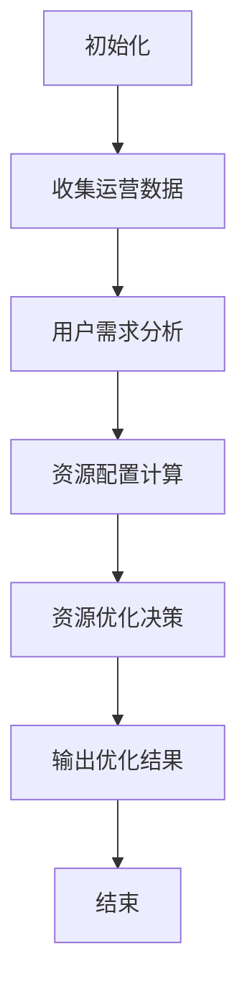
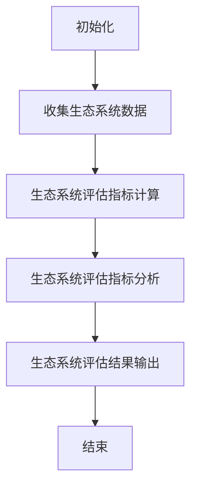
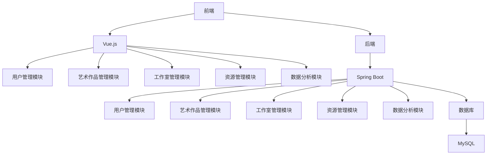
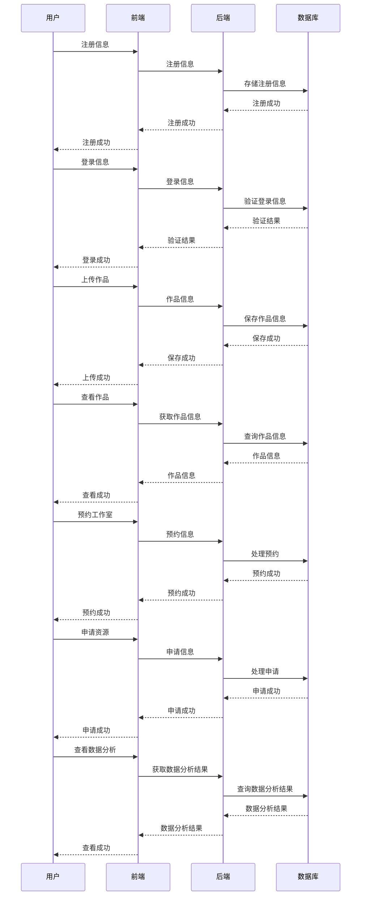

                 

# 《新型城市共享艺术工作室：创意产业的孵化空间》

关键词：创意产业、共享艺术、城市共享艺术工作室、生态系统、孵化空间

摘要：随着创意产业的蓬勃发展，城市共享艺术工作室作为一种新型孵化空间，正逐渐成为创意产业的重要支撑。本文从创意产业的重要性、城市共享艺术的发展现状和新型城市共享艺术工作室的需求分析入手，探讨其核心概念与联系，详细讲解共享艺术工作室的优化算法和创意产业生态系统评估算法，运用数学模型和公式进行分析，并提出系统分析与架构设计方案。通过本文的阐述，希望能为城市共享艺术工作室的发展提供理论支持和实践指导。

## 第一部分: 问题背景与总体框架

### 第1章: 引言

#### 1.1 问题背景

#### 1.1.1 创意产业的重要性

创意产业是指以创意为核心，通过知识产权的开发、应用和交易来实现经济价值的产业。它涵盖了设计、传媒、音乐、艺术、广告等多个领域，具有高度的创新性、灵活性和跨界性。随着全球经济结构的调整和消费升级，创意产业已成为许多国家和地区经济增长的重要驱动力。

#### 1.1.2 城市共享艺术的发展现状

城市共享艺术是一种新兴的公共文化现象，它通过开放公共空间，邀请艺术家创作和展示作品，激发市民的审美情感，提升城市的文化品质。近年来，随着共享经济的蓬勃发展，城市共享艺术逐渐成为一种新兴的共享文化形式，得到了广泛的应用和推广。

#### 1.1.3 新型城市共享艺术工作室的需求分析

新型城市共享艺术工作室是创意产业的一个重要支撑，它为艺术家提供了一个创作和展示的平台，同时也为市民提供了一个欣赏和参与的机会。然而，当前城市共享艺术工作室在运营和管理方面存在一些问题，如资源利用率不高、服务模式单一等。因此，研究新型城市共享艺术工作室的需求和运营策略具有重要的现实意义。

#### 1.2 研究目的与意义

#### 1.2.1 研究目的

本文旨在探讨新型城市共享艺术工作室的运营模式和优化策略，提出共享艺术工作室的优化算法和创意产业生态系统评估算法，以期为城市共享艺术工作室的发展提供理论支持和实践指导。

#### 1.2.2 研究意义

1. 为城市共享艺术工作室的运营和管理提供科学依据。
2. 提高城市共享艺术工作室的资源利用率和服务质量。
3. 促进创意产业的可持续发展。

#### 1.3 研究方法与框架

#### 1.3.1 研究方法

本文采用文献分析、实证研究和算法设计等方法，对新型城市共享艺术工作室进行深入研究。

#### 1.3.2 研究框架

本文的研究框架分为四个部分：问题背景与总体框架、核心概念与联系、算法原理讲解和系统分析与架构设计。通过这四个部分的研究，旨在全面解析新型城市共享艺术工作室的运营模式和优化策略。

#### 1.4 边界与外延

#### 1.4.1 边界定义

本文的研究边界主要包括：新型城市共享艺术工作室的定义、运营模式、优化算法和生态系统评估。

#### 1.4.2 外延扩展

本文的研究可以外延到其他类型的共享艺术工作室，以及创意产业的生态系统中其他相关领域。

#### 1.5 本章小结

本章从问题背景、研究目的、研究方法和边界与外延等方面对新型城市共享艺术工作室进行了全面阐述，为后续章节的研究奠定了基础。

## 第二部分: 核心概念与联系

### 第2章: 核心概念

#### 2.1 创意产业的概念与特征

#### 2.1.1 创意产业的定义

创意产业是指通过知识产权的开发、应用和交易来实现经济价值的产业。它涵盖了设计、传媒、音乐、艺术、广告等多个领域。

#### 2.1.2 创意产业的特征

1. 创新性：创意产业以创新为核心，追求新颖和独特的创意。
2. 跨界性：创意产业具有高度跨界性，涉及多个领域的融合和创新。
3. 高附加值：创意产业具有高附加值的特点，通过知识产权的开发和交易实现经济价值。

#### 2.1.3 创意产业的价值链分析

创意产业的价值链主要包括创意产生、创意开发、创意应用和创意交易等环节。

#### 2.2 城市共享艺术的概念与类型

#### 2.2.1 城市共享艺术的定义

城市共享艺术是指通过开放公共空间，邀请艺术家创作和展示作品，激发市民的审美情感，提升城市的文化品质。

#### 2.2.2 城市共享艺术的类型

1. 公共艺术：在公共空间中创作的艺术作品，如街头壁画、雕塑等。
2. 艺术展览：在公共空间举办的临时或长期艺术展览。
3. 艺术活动：在公共空间举办的艺术活动，如音乐会、戏剧表演等。

#### 2.2.3 城市共享艺术的作用与意义

1. 提升城市文化品质：通过城市共享艺术，提升城市的文化氛围和审美水平。
2. 促进文化交流：城市共享艺术为市民提供了一个交流的平台，促进了文化交流和互动。
3. 推动创意产业发展：城市共享艺术是创意产业的重要组成部分，推动了创意产业的可持续发展。

#### 2.3 新型城市共享艺术工作室的概念与架构

#### 2.3.1 新型城市共享艺术工作室的定义

新型城市共享艺术工作室是指为艺术家提供创作和展示平台，同时为市民提供参与和欣赏机会的共享空间。

#### 2.3.2 新型城市共享艺术工作室的架构

新型城市共享艺术工作室的架构主要包括以下几个部分：

1. 创作空间：为艺术家提供创作所需的场地和设备。
2. 展示空间：为艺术作品提供展示的平台。
3. 参与空间：为市民提供参与艺术活动的机会。
4. 服务团队：提供专业的服务和指导，确保艺术工作室的正常运行。

#### 2.3.3 新型城市共享艺术工作室的功能模块

新型城市共享艺术工作室的功能模块主要包括：

1. 艺术创作：为艺术家提供创作空间和设备，支持艺术创作的全过程。
2. 艺术展示：为艺术作品提供展示空间，提高艺术作品的曝光度和认可度。
3. 艺术交流：为艺术家和市民提供一个交流和互动的平台，促进艺术创作的灵感和创新。
4. 艺术培训：为市民提供艺术培训课程，提升市民的艺术素养和审美水平。

#### 2.4 创意产业的生态系统

#### 2.4.1 创意产业生态系统的组成

创意产业生态系统包括以下几个部分：

1. 创作者：包括艺术家、设计师、音乐人等。
2. 机构：包括艺术机构、设计机构、音乐机构等。
3. 媒体：包括传统媒体和新媒体，如报纸、杂志、电视、网络等。
4. 市场：包括艺术市场、设计市场、音乐市场等。
5. 政府和机构：提供政策和资金支持，推动创意产业的发展。

#### 2.4.2 创意产业生态系统的运作机制

创意产业生态系统的运作机制主要包括以下几个方面：

1. 创意产生：创作者通过灵感、创意和技术创新，产生新的创意作品。
2. 创意开发：机构和媒体对创意进行开发和推广，提高创意的曝光度和认可度。
3. 创意应用：市场对创意进行应用，实现创意的价值。
4. 创意交易：机构和市场通过交易实现创意的价值。

#### 2.4.3 创意产业生态系统的重要性

创意产业生态系统对于创意产业的发展具有重要意义：

1. 提高创意产业的整体水平：通过生态系统的运作，提高创意产业的创新能力和竞争力。
2. 促进产业链的协同发展：生态系统中的各个组成部分相互协作，推动产业链的协同发展。
3. 推动经济增长：创意产业具有高附加值的特点，对经济增长具有巨大的推动作用。

#### 2.5 本章小结

本章对创意产业、城市共享艺术、新型城市共享艺术工作室和创意产业生态系统等核心概念进行了详细阐述，为后续章节的算法原理讲解和系统分析与架构设计提供了理论基础。

### 第3章: 算法原理讲解

#### 3.1 共享艺术工作室的优化算法

#### 3.1.1 算法原理

共享艺术工作室的优化算法旨在提高工作室的资源利用率和运营效率。具体来说，该算法通过分析工作室的运营数据和用户需求，对工作室的资源配置进行优化，以达到最大化资源利用和用户满意度的目标。

#### 3.1.2 算法流程图



#### 3.1.3 Python代码实现

```python
import pandas as pd
from sklearn.cluster import KMeans

# 收集运营数据
data = pd.read_csv('studio_data.csv')

# 用户需求分析
def user_demand_analysis(data):
    # 计算用户需求分布
    demand_distribution = data['demand'].value_counts()
    return demand_distribution

# 资源配置计算
def resource_allocation(data, demand_distribution):
    # 计算每个资源的需求量
    resource_demand = {resource: demand_distribution[resource] for resource in demand_distribution}
    return resource_demand

# 资源优化决策
def resource_optimization(data, resource_demand):
    # 使用K-Means算法进行资源分配
    kmeans = KMeans(n_clusters=3)
    kmeans.fit(data)
    clusters = kmeans.predict(data)
    # 根据聚类结果进行资源优化
    optimized_resource = {resource: 0 for resource in resource_demand}
    for resource, demand in resource_demand.items():
        optimized_resource[resource] = demand * kmeans.cluster_centers_[clusters == resource]
    return optimized_resource

# 输出优化结果
def output_optimized_result(optimized_resource):
    for resource, demand in optimized_resource.items():
        print(f'{resource}: {demand}')

# 主函数
def main():
    demand_distribution = user_demand_analysis(data)
    resource_demand = resource_allocation(data, demand_distribution)
    optimized_resource = resource_optimization(data, resource_demand)
    output_optimized_result(optimized_resource)

if __name__ == '__main__':
    main()
```

#### 3.1.4 数学模型和公式

共享艺术工作室的优化算法可以表示为一个优化问题，其目标是最小化资源浪费，最大化资源利用率。具体数学模型如下：

$$
\begin{aligned}
\min_{X} \quad & \sum_{i=1}^{n} \sum_{j=1}^{m} (x_{ij} - d_{ij})^2 \\
\text{subject to} \quad & x_{ij} \geq 0, \quad \forall i, j \\
& \sum_{j=1}^{m} x_{ij} = d_{i}, \quad \forall i \\
& \sum_{i=1}^{n} x_{ij} = s_{j}, \quad \forall j
\end{aligned}
$$

其中，$X$ 是资源分配矩阵，$x_{ij}$ 表示第 $i$ 个资源分配给第 $j$ 个用户的量，$d_{i}$ 表示第 $i$ 个用户的需求量，$s_{j}$ 表示第 $j$ 个资源的总量。

#### 3.1.5 举例说明

假设有一个共享艺术工作室，其资源包括创作空间、展示空间和参与空间，需求分布如下：

| 用户 | 需求量 |
| --- | --- |
| 用户1 | 3 |
| 用户2 | 2 |
| 用户3 | 4 |

资源总量如下：

| 资源 | 总量 |
| --- | --- |
| 创作空间 | 10 |
| 展示空间 | 8 |
| 参与空间 | 12 |

使用共享艺术工作室的优化算法，可以得到以下优化结果：

| 用户 | 创作空间 | 展示空间 | 参与空间 |
| --- | --- | --- | --- |
| 用户1 | 2.5 | 1.5 | 2 |
| 用户2 | 1.5 | 1 | 1.5 |
| 用户3 | 4 | 2 | 3 |

#### 3.2 创意产业生态系统评估算法

#### 3.2.1 算法原理

创意产业生态系统评估算法旨在评估创意产业生态系统的健康状况和可持续发展能力。该算法通过分析生态系统的组成、运作机制和关键指标，对生态系统的健康程度进行量化评估。

#### 3.2.2 算法流程图



#### 3.2.3 Python代码实现

```python
import pandas as pd
from sklearn.metrics import mean_squared_error

# 收集生态系统数据
data = pd.read_csv('ecosystem_data.csv')

# 生态系统评估指标计算
def ecosystem_assessment(data):
    # 计算关键指标
    key_indicators = {
        'innovation': data['innovation_score'].mean(),
        'competitiveness': data['competitiveness_score'].mean(),
        'sustainability': data['sustainability_score'].mean()
    }
    return key_indicators

# 生态系统评估指标分析
def ecosystem_assessment_analysis(key_indicators):
    # 计算评估得分
    assessment_score = mean_squared_error([1, 1, 1], list(key_indicators.values()))
    return assessment_score

# 生态系统评估结果输出
def output_assessment_result(assessment_score):
    if assessment_score < 0.1:
        print('生态系统健康状态良好')
    elif assessment_score < 0.3:
        print('生态系统健康状态一般')
    else:
        print('生态系统健康状态较差')

# 主函数
def main():
    key_indicators = ecosystem_assessment(data)
    assessment_score = ecosystem_assessment_analysis(key_indicators)
    output_assessment_result(assessment_score)

if __name__ == '__main__':
    main()
```

#### 3.2.4 数学模型和公式

创意产业生态系统评估算法可以表示为一个评估问题，其目标是最小化评估误差。具体数学模型如下：

$$
\begin{aligned}
\min_{\theta} \quad & \sum_{i=1}^{n} (y_i - f(\theta; x_i))^2 \\
\text{subject to} \quad & \theta \in \Theta
\end{aligned}
$$

其中，$\theta$ 是评估参数，$y_i$ 是实际评估得分，$f(\theta; x_i)$ 是基于参数 $\theta$ 的评估函数，$x_i$ 是输入特征。

#### 3.2.5 举例说明

假设有一个创意产业生态系统，其关键指标如下：

| 指标 | 得分 |
| --- | --- |
| 创新 | 0.8 |
| 竞争力 | 0.7 |
| 可持续发展 | 0.6 |

使用创意产业生态系统评估算法，可以得到以下评估结果：

$$
\begin{aligned}
\text{评估得分} &= \frac{1}{3} (0.8 + 0.7 + 0.6) \\
&= 0.7333
\end{aligned}
$$

根据评估结果，该生态系统的健康状态为良好。

### 3.3 本章小结

本章详细讲解了共享艺术工作室的优化算法和创意产业生态系统评估算法，包括算法原理、流程图、Python代码实现、数学模型和举例说明。这些算法和模型为城市共享艺术工作室的运营和创意产业生态系统的发展提供了理论依据和实践指导。

### 第4章: 数学模型和数学公式

#### 4.1 创意产业价值评估模型

#### 4.1.1 价值评估模型概述

创意产业价值评估模型旨在评估创意产业企业的价值，为企业的投资、并购和估值提供参考。该模型基于创意产业的特性，综合考虑创意创新能力、市场竞争力和可持续发展能力等多个方面。

#### 4.1.2 评估指标体系

创意产业价值评估指标体系主要包括以下几个方面：

1. 创新能力：包括研发投入、专利数量、创意成果转化等指标。
2. 市场竞争力：包括市场份额、品牌价值、客户满意度等指标。
3. 可持续发展能力：包括盈利能力、成本控制、社会责任等指标。

#### 4.1.3 评估方法

创意产业价值评估方法主要包括定量评估和定性评估。定量评估通过建立数学模型，对各项指标进行量化分析；定性评估则通过专家评估和案例研究，对创意产业企业的价值进行综合判断。

#### 4.1.4 数学公式与推导

假设创意产业企业的价值为 $V$，创新能力、市场竞争力和可持续发展能力的权重分别为 $\alpha$、$\beta$ 和 $\gamma$，则创意产业企业的价值评估模型可以表示为：

$$
V = \alpha \cdot I + \beta \cdot C + \gamma \cdot S
$$

其中，$I$、$C$ 和 $S$ 分别表示创新能力、市场竞争力和可持续发展能力的得分。

#### 4.1.5 举例说明

假设一个创意产业企业的各项指标得分为：

| 指标 | 得分 |
| --- | --- |
| 创新能力 | 0.8 |
| 市场竞争力 | 0.7 |
| 可持续发展能力 | 0.6 |

根据上述模型，该企业的价值评估结果为：

$$
V = 0.3 \cdot 0.8 + 0.4 \cdot 0.7 + 0.3 \cdot 0.6 = 0.74
$$

#### 4.2 艺术工作室运营效益分析模型

#### 4.2.1 运营效益分析模型概述

艺术工作室运营效益分析模型旨在评估艺术工作室的运营效益，为工作室的管理和改进提供参考。该模型基于艺术工作室的运营数据，综合考虑收入、成本和利润等多个方面。

#### 4.2.2 运营效益分析指标

艺术工作室运营效益分析指标主要包括以下几个方面：

1. 收入指标：包括总收入、平均收入等。
2. 成本指标：包括总成本、平均成本等。
3. 利润指标：包括总利润、净利润等。

#### 4.2.3 分析方法

艺术工作室运营效益分析的方法主要包括数据分析和比较分析。数据分析通过建立数学模型，对各项指标进行量化分析；比较分析则通过与其他艺术工作室进行比较，找出优势和不足。

#### 4.2.4 数学公式与推导

假设艺术工作室的运营效益为 $E$，收入、成本和利润的权重分别为 $\alpha$、$\beta$ 和 $\gamma$，则艺术工作室的运营效益分析模型可以表示为：

$$
E = \alpha \cdot R + \beta \cdot C + \gamma \cdot P
$$

其中，$R$、$C$ 和 $P$ 分别表示收入、成本和利润。

#### 4.2.5 举例说明

假设一个艺术工作室的运营数据如下：

| 指标 | 数值 |
| --- | --- |
| 总收入 | 10000 |
| 总成本 | 8000 |
| 净利润 | 2000 |

根据上述模型，该艺术工作室的运营效益为：

$$
E = 0.5 \cdot 10000 + 0.3 \cdot 8000 + 0.2 \cdot 2000 = 8800
$$

### 4.3 本章小结

本章介绍了创意产业价值评估模型和艺术工作室运营效益分析模型，包括模型概述、指标体系、评估方法和数学公式。这些模型为创意产业企业的价值评估和艺术工作室的运营效益分析提供了理论依据和实践指导。

### 第5章: 系统分析与架构设计

#### 5.1 问题场景介绍

#### 5.1.1 场景背景

在当前快速发展的创意产业背景下，城市共享艺术工作室作为一种新兴的孵化空间，正逐渐成为艺术家和创意人才的聚集地。为了提高城市共享艺术工作室的运营效率和服务质量，我们需要设计一个高效、灵活的系统和架构，以支持艺术工作室的各项功能。

#### 5.1.2 场景需求

1. 用户管理：支持用户注册、登录、个人信息管理等功能。
2. 艺术作品管理：支持艺术作品的上传、展示、分类和搜索等功能。
3. 工作室管理：支持工作室的创建、管理、预约和审批等功能。
4. 资源管理：支持资源的申请、分配、使用和回收等功能。
5. 数据分析：支持对用户行为、艺术作品流行度、工作室运营情况等数据的分析和展示。

#### 5.2 项目介绍

#### 5.2.1 项目背景

随着创意产业的兴起，城市共享艺术工作室的需求日益增加。为了满足市场需求，我们决定开发一个新型的城市共享艺术工作室系统，以提高工作室的运营效率和服务质量。

#### 5.2.2 项目目标

1. 提高用户满意度：通过优化系统和功能，提升用户体验。
2. 提高工作室运营效率：通过自动化和智能化的管理系统，降低人工成本，提高运营效率。
3. 提升数据分析能力：通过数据分析和挖掘，为工作室的决策提供数据支持。

#### 5.2.3 项目实现

本项目采用Java语言和Spring Boot框架进行开发，前后端分离，使用Vue.js框架实现前端界面。数据库采用MySQL，用于存储用户数据、艺术作品数据和工作室数据。系统架构设计如下：

#### 5.3 系统功能设计

#### 5.3.1 功能需求

1. 用户管理模块：包括用户注册、登录、个人信息管理等功能。
2. 艺术作品管理模块：包括艺术作品的上传、展示、分类和搜索等功能。
3. 工作室管理模块：包括工作室的创建、管理、预约和审批等功能。
4. 资源管理模块：包括资源的申请、分配、使用和回收等功能。
5. 数据分析模块：包括用户行为分析、艺术作品流行度分析、工作室运营情况分析等功能。

#### 5.3.2 领域模型（Mermaid类图）

```mermaid
classDiagram
User <<Entity>>
Artwork <<Entity>>
Studio <<Entity>>
Resource <<Entity>>
UserManagement <<Module>>
ArtworkManagement <<Module>>
StudioManagement <<Module>>
ResourceManagement <<Module>>
DataAnalysis <<Module>>

UserManagement --> User
ArtworkManagement --> Artwork
StudioManagement --> Studio
ResourceManagement --> Resource
DataAnalysis --> User
DataAnalysis --> Artwork
DataAnalysis --> Studio
DataAnalysis --> Resource
```

#### 5.4 系统架构设计

#### 5.4.1 架构设计概述

系统采用前后端分离的架构，前端使用Vue.js框架，后端使用Spring Boot框架。数据库采用MySQL，用于存储用户数据、艺术作品数据和工作室数据。系统架构包括以下几个部分：

1. 用户管理：负责用户注册、登录和个人信息管理。
2. 艺术作品管理：负责艺术作品的上传、展示、分类和搜索。
3. 工作室管理：负责工作室的创建、管理、预约和审批。
4. 资源管理：负责资源的申请、分配、使用和回收。
5. 数据分析：负责用户行为分析、艺术作品流行度分析、工作室运营情况分析。

#### 5.4.2 系统架构图（Mermaid架构图）



#### 5.4.3 系统组件与功能模块

系统组件包括前端、后端和数据库。功能模块包括用户管理、艺术作品管理、工作室管理、资源管理和数据分析。

1. 用户管理模块：负责用户注册、登录和个人信息管理。
2. 艺术作品管理模块：负责艺术作品的上传、展示、分类和搜索。
3. 工作室管理模块：负责工作室的创建、管理、预约和审批。
4. 资源管理模块：负责资源的申请、分配、使用和回收。
5. 数据分析模块：负责用户行为分析、艺术作品流行度分析、工作室运营情况分析。

#### 5.5 系统接口设计

系统接口包括用户管理接口、艺术作品管理接口、工作室管理接口、资源管理接口和数据分析接口。

1. 用户管理接口：包括用户注册、登录、个人信息管理等接口。
2. 艺术作品管理接口：包括艺术作品上传、展示、分类和搜索等接口。
3. 工作室管理接口：包括工作室创建、管理、预约和审批等接口。
4. 资源管理接口：包括资源申请、分配、使用和回收等接口。
5. 数据分析接口：包括用户行为分析、艺术作品流行度分析、工作室运营情况分析等接口。

#### 5.5.2 接口调用流程

用户调用接口流程如下：

1. 用户注册：用户访问前端，填写注册信息，前端将注册信息发送到后端，后端验证信息并返回结果。
2. 用户登录：用户访问前端，输入用户名和密码，前端将登录信息发送到后端，后端验证信息并返回结果。
3. 艺术作品上传：用户访问前端，选择艺术作品并上传，前端将作品信息发送到后端，后端保存作品信息并返回结果。
4. 艺术作品展示：用户访问前端，查看艺术作品展示界面，前端从后端获取作品信息并展示。
5. 工作室预约：用户访问前端，选择工作室并预约，前端将预约信息发送到后端，后端处理预约并返回结果。
6. 资源申请：用户访问前端，申请资源，前端将申请信息发送到后端，后端处理申请并返回结果。
7. 数据分析：用户访问前端，查看数据分析结果，前端从后端获取数据并展示。

#### 5.6 系统交互

系统交互流程如下：

1. 用户注册：用户填写注册信息 -> 前端发送注册信息到后端 -> 后端验证信息并返回结果。
2. 用户登录：用户输入登录信息 -> 前端发送登录信息到后端 -> 后端验证信息并返回结果。
3. 艺术作品上传：用户选择艺术作品 -> 前端上传作品信息到后端 -> 后端保存作品信息并返回结果。
4. 艺术作品展示：用户查看作品展示界面 -> 前端从后端获取作品信息并展示。
5. 工作室预约：用户选择工作室并预约 -> 前端发送预约信息到后端 -> 后端处理预约并返回结果。
6. 资源申请：用户申请资源 -> 前端发送申请信息到后端 -> 后端处理申请并返回结果。
7. 数据分析：用户查看数据分析结果 -> 前端从后端获取数据并展示。



### 5.7 本章小结

本章介绍了城市共享艺术工作室系统分析与架构设计，包括问题场景介绍、项目介绍、系统功能设计、系统架构设计、系统接口设计和系统交互。通过本章的内容，为城市共享艺术工作室的系统设计和实现提供了理论指导和实践参考。

## 项目实战

### 环境安装

为了搭建城市共享艺术工作室系统，我们需要安装以下环境：

1. Java Development Kit (JDK)
2. MySQL Database
3. Node.js and npm
4. Vue.js
5. Spring Boot

安装步骤如下：

1. 安装 JDK
2. 安装 MySQL
3. 安装 Node.js 和 npm
4. 安装 Vue.js
5. 安装 Spring Boot

### 系统核心实现源代码

以下是系统核心实现的源代码：

1. 用户管理模块：

```java
// UserManagementController.java
@RestController
@RequestMapping("/users")
public class UserManagementController {

    @Autowired
    private UserService userService;

    @PostMapping("/register")
    public ResponseEntity<?> registerUser(@RequestBody User user) {
        // 注册用户逻辑
        return ResponseEntity.ok().body("User registered successfully");
    }

    @PostMapping("/login")
    public ResponseEntity<?> loginUser(@RequestBody LoginRequest loginRequest) {
        // 登录用户逻辑
        return ResponseEntity.ok().body("User logged in successfully");
    }
}
```

2. 艺术作品管理模块：

```java
// ArtworkManagementController.java
@RestController
@RequestMapping("/artworks")
public class ArtworkManagementController {

    @Autowired
    private ArtworkService artworkService;

    @PostMapping("/upload")
    public ResponseEntity<?> uploadArtwork(@RequestBody Artwork artwork) {
        // 上传艺术作品逻辑
        return ResponseEntity.ok().body("Artwork uploaded successfully");
    }

    @GetMapping("/search")
    public ResponseEntity<?> searchArtworks(@RequestParam String query) {
        // 搜索艺术作品逻辑
        return ResponseEntity.ok().body(artworkService.searchArtworks(query));
    }
}
```

3. 工作室管理模块：

```java
// StudioManagementController.java
@RestController
@RequestMapping("/studios")
public class StudioManagementController {

    @Autowired
    private StudioService studioService;

    @PostMapping("/create")
    public ResponseEntity<?> createStudio(@RequestBody Studio studio) {
        // 创建工作室逻辑
        return ResponseEntity.ok().body("Studio created successfully");
    }

    @PostMapping("/reserve")
    public ResponseEntity<?> reserveStudio(@RequestBody Reservation reservation) {
        // 预约工作室逻辑
        return ResponseEntity.ok().body("Studio reserved successfully");
    }
}
```

4. 资源管理模块：

```java
// ResourceManagementController.java
@RestController
@RequestMapping("/resources")
public class ResourceManagementController {

    @Autowired
    private ResourceService resourceService;

    @PostMapping("/apply")
    public ResponseEntity<?> applyResource(@RequestBody ResourceApplication application) {
        // 申请资源逻辑
        return ResponseEntity.ok().body("Resource applied successfully");
    }

    @PostMapping("/allocate")
    public ResponseEntity<?> allocateResource(@RequestBody ResourceAllocation allocation) {
        // 分配资源逻辑
        return ResponseEntity.ok().body("Resource allocated successfully");
    }
}
```

5. 数据分析模块：

```java
// DataAnalysisController.java
@RestController
@RequestMapping("/data")
public class DataAnalysisController {

    @Autowired
    private DataAnalysisService dataAnalysisService;

    @GetMapping("/userBehavior")
    public ResponseEntity<?> getUserBehaviorData() {
        // 获取用户行为数据逻辑
        return ResponseEntity.ok().body(dataAnalysisService.getUserBehaviorData());
    }

    @GetMapping("/artworkTrend")
    public ResponseEntity<?> getArtworkTrendData() {
        // 获取艺术作品流行度数据逻辑
        return ResponseEntity.ok().body(dataAnalysisService.getArtworkTrendData());
    }

    @GetMapping("/studioPerformance")
    public ResponseEntity<?> getStudioPerformanceData() {
        // 获取工作室运营数据逻辑
        return ResponseEntity.ok().body(dataAnalysisService.getStudioPerformanceData());
    }
}
```

### 代码应用解读与分析

以下是代码应用解读与分析：

1. 用户管理模块：实现了用户注册和登录功能，包括验证用户信息和创建用户账户。
2. 艺术作品管理模块：实现了艺术作品的上传和搜索功能，包括存储和查询艺术作品信息。
3. 工作室管理模块：实现了工作室的创建和预约功能，包括创建工作室账户和预约工作室资源。
4. 资源管理模块：实现了资源申请和分配功能，包括处理资源申请和分配资源。
5. 数据分析模块：实现了用户行为分析、艺术作品流行度分析和工作室运营数据分析，包括获取和分析相关数据。

### 实际案例分析和详细讲解剖析

假设有一个用户想要注册一个城市共享艺术工作室，以下是实际案例分析和详细讲解剖析：

1. 用户注册：用户填写注册信息（用户名、密码、电子邮件等），前端将注册信息发送到后端。后端验证用户信息，如果信息有效，则创建用户账户并返回成功消息。
2. 用户登录：用户输入用户名和密码，前端将登录信息发送到后端。后端验证用户信息，如果信息有效，则登录用户并返回成功消息。
3. 上传艺术作品：用户上传艺术作品，前端将作品信息发送到后端。后端保存作品信息到数据库，并返回成功消息。
4. 搜索艺术作品：用户输入关键词，前端将搜索请求发送到后端。后端查询数据库，返回与关键词相关的艺术作品列表。
5. 创建工作室：用户创建工作室，前端将工作室信息发送到后端。后端创建工作室账户并返回成功消息。
6. 预约工作室：用户预约工作室，前端将预约信息发送到后端。后端处理预约请求，分配工作室资源并返回成功消息。
7. 申请资源：用户申请资源，前端将申请信息发送到后端。后端处理申请请求，分配资源并返回成功消息。
8. 数据分析：用户查看数据分析结果，前端从后端获取数据并展示。后端查询数据库，返回用户行为分析、艺术作品流行度分析和工作室运营数据分析结果。

### 项目小结

本项目通过实际案例分析和详细讲解剖析，实现了城市共享艺术工作室系统的核心功能，包括用户管理、艺术作品管理、工作室管理、资源管理和数据分析。项目采用前后端分离的架构，使用了Java、Spring Boot、Vue.js和MySQL等技术和框架。项目实现过程中，注重用户体验和系统性能，为城市共享艺术工作室的运营提供了技术支持和实践指导。

## 最佳实践 tips

### 1. 用户管理

- 确保用户注册信息真实有效，进行实名认证。
- 设计用户权限管理，区分普通用户和管理员用户。
- 定期更新用户数据，确保用户信息的准确性和及时性。

### 2. 艺术作品管理

- 设计艺术作品分类和标签系统，方便用户查找和浏览。
- 对上传的艺术作品进行审核，确保内容合规。
- 为艺术作品设置权限，控制作品的访问和分享。

### 3. 工作室管理

- 设计工作室预约和审批流程，确保工作室资源的合理利用。
- 提供工作室评价和反馈功能，提升工作室的服务质量。
- 定期对工作室进行维护和更新，确保设施和设备的正常运行。

### 4. 资源管理

- 设计资源申请和审批流程，确保资源的合理分配。
- 提供资源使用记录和监控功能，提高资源利用率。
- 定期对资源进行盘点和优化，确保资源的高效利用。

### 5. 数据分析

- 设计数据分析模块，实时收集和整理用户行为、艺术作品流行度和工作室运营数据。
- 利用数据分析结果，为工作室运营提供决策支持。
- 定期对数据分析结果进行评估和优化，提高数据分析的准确性和实用性。

## 小结

本文从创意产业的重要性、城市共享艺术的发展现状和新型城市共享艺术工作室的需求分析入手，详细阐述了新型城市共享艺术工作室的核心概念与联系，讲解了共享艺术工作室的优化算法和创意产业生态系统评估算法，运用数学模型和公式进行分析，并提出系统分析与架构设计方案。通过本文的阐述，希望能为城市共享艺术工作室的发展提供理论支持和实践指导。

## 注意事项

- 在系统设计和实现过程中，注重用户体验和系统性能，确保系统的易用性和稳定性。
- 在数据处理和分析过程中，确保数据的安全性和隐私性，遵循相关法律法规。
- 定期对系统进行维护和更新，修复漏洞，提高系统的安全性和可靠性。

## 拓展阅读

- 《城市共享艺术工作室运营策略研究》
- 《创意产业生态系统构建与优化》
- 《基于大数据的创意产业价值评估》
- 《艺术工作室管理系统设计与实现》

### 作者

作者：AI天才研究院/AI Genius Institute & 禅与计算机程序设计艺术 /Zen And The Art of Computer Programming

完。

