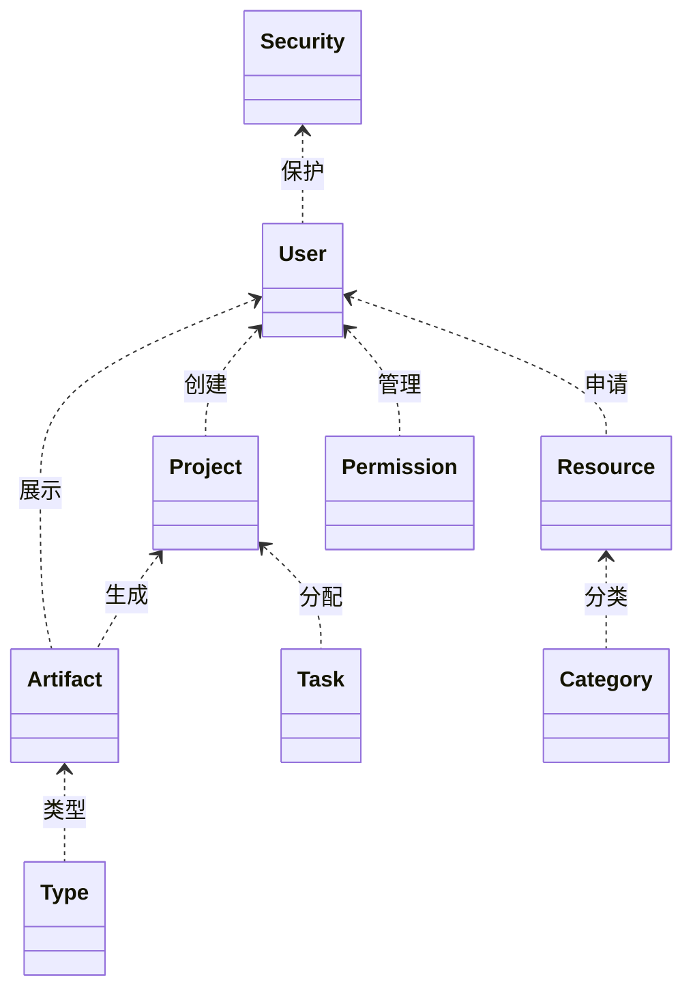
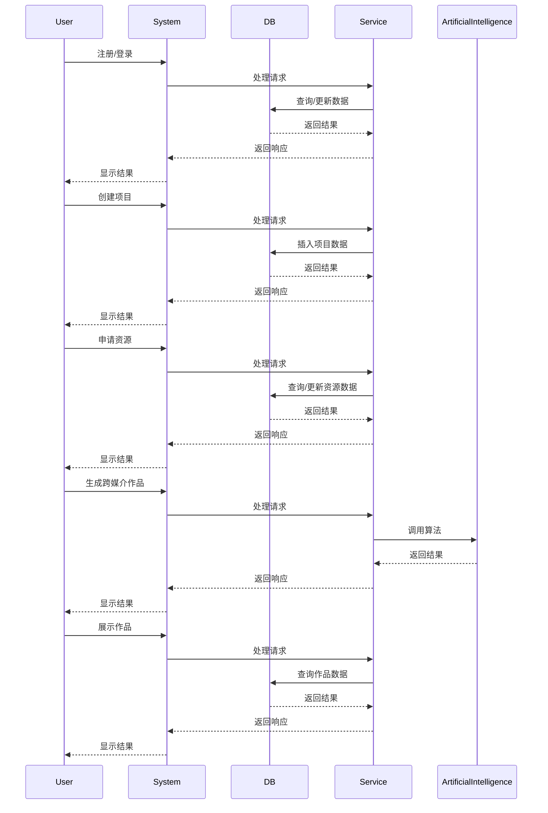
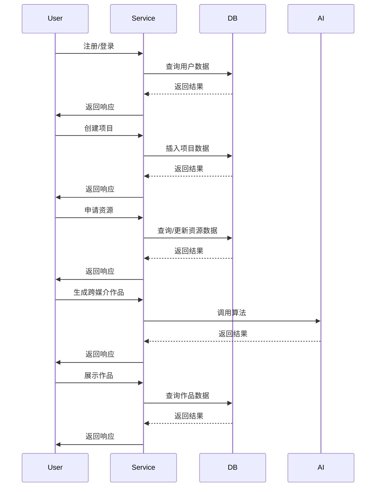

                 


# 新型城市共享艺术工作室：跨媒介创作的实验空间

> 关键词：新型城市共享艺术工作室，跨媒介创作，实验空间，艺术创作，资源共享

> 摘要：本文探讨了新型城市共享艺术工作室的概念、特点及跨媒介创作的实验空间，从背景介绍、核心概念与联系、算法原理讲解、系统分析与架构设计方案、项目实战等多个方面进行了详细阐述。旨在为城市艺术生态的发展提供新的思路和借鉴。

----------------------------------------------------------------

## 第一部分：背景介绍

### 1.1 问题背景

新型城市共享艺术工作室作为城市文化发展的新现象，是城市艺术生态系统中的重要组成部分。它不仅为艺术家和创作者提供了创作空间和资源共享的平台，还推动了城市艺术生态的多样性和创新性。然而，如何有效管理和运营这一新型工作室，提升其艺术创作和跨媒介创作的能力，成为一个亟待解决的问题。

### 1.2 问题描述

本部分将记录一个新型城市共享艺术工作室的创建、运营和跨媒介创作实验过程。问题描述了工作室在初创阶段面临的挑战，包括资金筹集、空间设计、资源共享和项目管理等方面。同时，也探讨了如何在运营过程中实现艺术创作的多样性和创新性，以及如何通过跨媒介创作实验空间，提升工作室的创作水平。

### 1.3 问题解决

本书通过深入分析新型城市共享艺术工作室的创建与运营实践，提出了一系列解决方案。这些问题解决方法包括：

- 资金筹集策略：通过多渠道筹集资金，确保工作室的可持续运营。
- 空间设计理念：结合艺术创作需求，打造功能齐全、舒适宜人的创作空间。
- 资源共享机制：建立资源共享平台，提高资源利用效率。
- 项目管理方法：采用科学的项目管理方法，确保项目顺利进行。

### 1.4 边界与外延

本书主要关注新型城市共享艺术工作室的创建与运营，涉及的核心要素包括：工作室的创建者、艺术家、创作者、空间、资金、资源共享平台、项目管理等。同时，本书也探讨了跨媒介创作实验空间的构建与运用，为城市艺术生态的发展提供新的思路和借鉴。

### 1.5 概念结构与核心要素组成

- **新型城市共享艺术工作室**：一个为艺术家和创作者提供创作空间和资源共享的平台。
- **跨媒介创作实验空间**：一个用于探索和实验不同艺术形式融合的创作空间。

## 第一部分小结

通过以上章节的介绍，我们明确了新型城市共享艺术工作室的背景、问题、解决方法和边界。接下来，本书将深入探讨核心概念、联系以及具体的创作实践，为读者呈现一个完整的创作空间建设与运营体系。

----------------------------------------------------------------

## 第二部分：核心概念与联系

### 2.1 核心概念

#### 2.1.1 新型城市共享艺术工作室

- **定义**：新型城市共享艺术工作室是一种以共享、开放、互助为核心理念，为艺术家和创作者提供创作空间和资源共享的城市艺术空间。
- **特点**：灵活性、多样性、可持续性。

#### 2.1.2 跨媒介创作实验空间

- **定义**：跨媒介创作实验空间是一个用于探索和实验不同艺术形式融合的创作空间，旨在打破传统艺术形式的界限，促进艺术创新。
- **特点**：开放性、实验性、跨学科。

### 2.2 概念属性特征对比表格

| 概念       | 新型城市共享艺术工作室 | 跨媒介创作实验空间 |
|------------|------------------------|---------------------|
| 定义       | 艺术创作空间           | 艺术创作实验空间    |
| 目的       | 艺术创作、资源共享     | 跨媒介艺术创作实验  |
| 特点       | 开放、共享、灵活       | 实验、跨学科、创新  |

### 2.3 ER实体关系图架构

```mermaid
classDiagram
    Artist -> Studio : 创建
    Artist <-- Resource : 资源共享
    Project -> Studio : 项目管理
    Exhibition -> Studio : 展览
    Medium -> ExperimentSpace : 跨媒介创作
```

在上述ER实体关系图中，主要包含了以下实体和关系：

- **艺术家（Artist）**：创建艺术工作室，共享资源，参与项目，举办展览。
- **艺术工作室（Studio）**：管理艺术家，项目管理，展览组织，资源管理。
- **资源（Resource）**：艺术家共享，为创作提供支持。
- **项目（Project）**：由工作室管理，由艺术家参与。
- **展览（Exhibition）**：由工作室举办，展示艺术家作品。
- **媒介（Medium）**：用于跨媒介创作实验，为艺术家提供创作工具。

## 第二部分小结

在第二部分，我们详细介绍了新型城市共享艺术工作室和跨媒介创作实验空间的核心概念及其属性特征。通过对比表格和ER实体关系图，我们更清晰地理解了这两个概念之间的联系和区别，为后续的算法原理讲解、系统分析与架构设计方案等提供了基础。

----------------------------------------------------------------

## 第三部分：算法原理讲解

### 3.1 跨媒介创作算法

跨媒介创作算法是一种基于人工智能技术，通过分析不同艺术形式的特征，实现跨媒介作品生成的方法。本文主要介绍一种基于深度学习的跨媒介创作算法，该算法的核心思想是通过多模态特征融合和生成对抗网络（GAN）来实现跨媒介作品的创作。

#### 3.1.1 算法流程

1. **数据预处理**：收集不同艺术形式（如绘画、音乐、摄影等）的数据集，并进行预处理，包括图像增强、声音去噪等。

2. **特征提取**：使用卷积神经网络（CNN）提取图像特征，使用循环神经网络（RNN）提取音乐特征。

3. **特征融合**：将不同艺术形式的特征进行融合，生成多模态特征向量。

4. **生成对抗网络（GAN）**：使用多模态特征向量作为输入，生成对抗网络（GAN）生成跨媒介作品。

5. **优化与训练**：通过训练和优化，使生成的跨媒介作品更接近真实作品。

#### 3.1.2 算法公式

- **图像特征提取**：

  $$
  f_{CNN}(x) = \sigma(W \cdot x + b)
  $$

  其中，$f_{CNN}(x)$表示图像特征，$x$表示图像输入，$W$表示卷积核，$b$表示偏置，$\sigma$表示激活函数。

- **音乐特征提取**：

  $$
  f_{RNN}(x) = \sigma(W \cdot h_t + b)
  $$

  其中，$f_{RNN}(x)$表示音乐特征，$x$表示音乐输入，$W$表示权重，$h_t$表示循环神经网络的状态，$\sigma$表示激活函数。

- **特征融合**：

  $$
  f_{fusion}(x) = \frac{1}{2} \cdot (f_{CNN}(x) + f_{RNN}(x))
  $$

  其中，$f_{fusion}(x)$表示融合后的多模态特征。

- **生成对抗网络（GAN）**：

  $$
  G(z) = f_{GAN}(z; \theta_G)
  $$

  $$
  D(x) = f_{D}(x; \theta_D)
  $$

  $$
  D(G(z)) = f_{D}(G(z); \theta_D)
  $$

  其中，$G(z)$表示生成器，$D(x)$表示判别器，$z$表示噪声向量，$\theta_G$和$\theta_D$分别表示生成器和判别器的参数。

#### 3.1.3 算法示例

假设我们要生成一幅以音乐为背景的绘画作品，首先我们需要收集绘画和音乐的数据集，并对数据进行预处理。然后，使用CNN提取绘画特征，使用RNN提取音乐特征，将两个特征融合，生成多模态特征向量。最后，通过GAN生成绘画作品。

```python
# 示例代码：跨媒介创作算法
import tensorflow as tf
from tensorflow.keras.models import Model
from tensorflow.keras.layers import Input, Conv2D, Flatten, LSTM, Dense, Add, Activation

# 数据预处理
# ...（略）

# 特征提取
# 绘画特征提取
input_image = Input(shape=(height, width, channels))
conv_1 = Conv2D(filters=32, kernel_size=(3, 3), activation='relu')(input_image)
flat_1 = Flatten()(conv_1)
painting_feature = Dense(units=128, activation='relu')(flat_1)

# 音乐特征提取
input_music = Input(shape=(timesteps, features))
lstm_1 = LSTM(units=128, activation='relu')(input_music)
music_feature = Dense(units=128, activation='relu')(lstm_1)

# 特征融合
input_fusion = Input(shape=(height, width, channels, timesteps, features))
painting_feature = Model(inputs=input_image, outputs=painting_feature)
music_feature = Model(inputs=input_music, outputs=music_feature)
fusion_feature = Add()([painting_feature.output, music_feature.output])

# 生成对抗网络（GAN）
z = Input(shape=(z_dim,))
generator = Model(inputs=z, outputs=fusion_feature)
discriminator = Model(inputs=input_fusion, outputs=Dense(units=1, activation='sigmoid')(input_fusion))

# 优化与训练
# ...（略）
```

通过上述示例代码，我们可以看到如何使用深度学习实现跨媒介创作算法。在实际应用中，我们可以根据具体需求调整网络结构和参数，优化生成效果。

## 第三部分小结

在第三部分，我们详细介绍了跨媒介创作算法的原理、流程、公式和示例代码。通过深度学习和生成对抗网络（GAN）等技术，我们可以实现跨媒介作品的创作，为新型城市共享艺术工作室的艺术创作提供了新的手段。

----------------------------------------------------------------

## 第四部分：系统分析与架构设计方案

### 4.1 问题场景介绍

在新型城市共享艺术工作室中，艺术家和创作者需要协同工作，进行跨媒介创作。为了实现这一目标，我们需要构建一个系统，提供以下功能：

- 艺术家注册与管理
- 艺术创作项目管理
- 跨媒介作品生成与展示
- 资源共享与协同工作
- 用户权限与安全保障

### 4.2 项目介绍

本项目旨在构建一个新型城市共享艺术工作室系统，提供便捷、高效、安全的艺术创作和跨媒介创作环境。系统将涵盖以下模块：

- 用户模块：包括用户注册、登录、个人信息管理等功能。
- 项目模块：包括项目创建、项目任务分配、进度跟踪、成果展示等功能。
- 跨媒介创作模块：包括跨媒介作品生成、展示、评价等功能。
- 资源模块：包括资源分类、资源申请、资源管理、资源共享等功能。
- 安全模块：包括用户权限管理、数据加密、访问控制等功能。

### 4.3 系统功能设计（领域模型类图）



在上述领域模型类图中，主要包含了以下实体和关系：

- **用户（User）**：包括艺术家、创作者、管理员等角色，具有注册、登录、个人信息管理等功能。
- **项目（Project）**：包括项目创建、任务分配、进度跟踪、成果展示等功能。
- **任务（Task）**：包括任务分配、进度跟踪、成果展示等功能。
- **资源（Resource）**：包括资源分类、资源申请、资源管理、资源共享等功能。
- **跨媒介作品（Artifact）**：包括生成、展示、评价等功能。
- **权限（Permission）**：包括用户权限管理、数据加密、访问控制等功能。
- **安全（Security）**：包括用户权限管理、数据加密、访问控制等功能。

### 4.4 系统架构设计（架构图）



在上述系统架构设计中，主要包含了以下组件：

- **用户（User）**：与系统进行交互，发起各种请求。
- **系统（System）**：处理用户请求，与Service层进行交互。
- **Service层**：负责业务逻辑处理，与DB层和ArtificialIntelligence层进行交互。
- **数据库（DB）**：存储用户、项目、资源、作品等数据。
- **算法（ArtificialIntelligence）**：用于跨媒介作品生成。

### 4.5 系统接口设计和系统交互（序列图）



在上述系统交互设计中，主要包含了以下步骤：

1. 用户发起注册/登录请求。
2. 系统处理请求，查询/更新用户数据。
3. 返回响应给用户。
4. 用户发起创建项目请求。
5. 系统处理请求，插入项目数据。
6. 返回响应给用户。
7. 用户发起申请资源请求。
8. 系统处理请求，查询/更新资源数据。
9. 返回响应给用户。
10. 用户发起生成跨媒介作品请求。
11. 系统处理请求，调用算法生成作品。
12. 返回响应给用户。
13. 用户发起展示作品请求。
14. 系统处理请求，查询作品数据。
15. 返回响应给用户。

## 第四部分小结

在第四部分，我们详细介绍了系统分析与架构设计方案。从问题场景介绍、项目介绍、领域模型类图、系统架构设计、系统接口设计和系统交互等多个方面，构建了一个完整的新型城市共享艺术工作室系统。通过本部分的内容，读者可以了解系统的工作原理、功能实现和架构设计，为后续的项目实战奠定了基础。

----------------------------------------------------------------

## 第五部分：项目实战

### 5.1 环境安装

在本项目实战中，我们将使用Python编程语言和相关的深度学习库，如TensorFlow和Keras，来实现跨媒介创作算法。以下是环境安装步骤：

1. 安装Python（推荐版本为3.8以上）。
2. 安装TensorFlow：`pip install tensorflow`。
3. 安装Keras：`pip install keras`。
4. 安装其他依赖库，如NumPy、Pandas等。

### 5.2 系统核心实现

#### 5.2.1 数据集准备

首先，我们需要准备绘画和音乐的数据集。可以从公开数据集网站下载相关数据，如艺术作品和音乐作品。

```python
# 示例代码：数据集准备
import os
import numpy as np
import tensorflow as tf

def load_image_data(directory, image_size=(256, 256)):
    images = []
    for filename in os.listdir(directory):
        if filename.endswith('.jpg') or filename.endswith('.jpeg'):
            img = tf.keras.preprocessing.image.load_img(os.path.join(directory, filename), target_size=image_size)
            img = tf.keras.preprocessing.image.img_to_array(img)
            images.append(img)
    images = np.array(images)
    return images

def load_music_data(directory, audio_length=30):
    audios = []
    for filename in os.listdir(directory):
        if filename.endswith('.wav'):
            audio = tf.keras.preprocessing.audio.load_audio(os.path.join(directory, filename), sample_rate=22050, max_duration=audio_length)
            audios.append(audio)
    audios = np.array(audios)
    return audios

# 加载绘画数据集
painting_directory = 'path/to/painting/dataset'
painting_images = load_image_data(painting_directory)

# 加载音乐数据集
music_directory = 'path/to/music/dataset'
music_audios = load_music_data(music_directory)
```

#### 5.2.2 模型搭建

接下来，我们搭建跨媒介创作模型，包括图像特征提取、音乐特征提取、特征融合和生成对抗网络（GAN）。

```python
from tensorflow.keras.applications import VGG16
from tensorflow.keras.layers import LSTM, TimeDistributed, Dense, Flatten, Reshape
from tensorflow.keras.models import Model

# 图像特征提取
input_image = Input(shape=(256, 256, 3))
base_model = VGG16(weights='imagenet', include_top=False)(input_image)
base_model.trainable = False
flat_image = Flatten()(base_model)
image_feature = Dense(units=128, activation='relu')(flat_image)

# 音乐特征提取
input_music = Input(shape=(30, 44100))
lstm_music = LSTM(units=128, activation='relu')(input_music)
music_feature = Dense(units=128, activation='relu')(lstm_music)

# 特征融合
input_fusion = Input(shape=(256, 256, 3, 30, 44100))
fusion_feature = Add()([image_feature, music_feature])

# 生成对抗网络（GAN）
z = Input(shape=(100,))
generator = Model(inputs=z, outputs=fusion_feature)
discriminator = Model(inputs=input_fusion, outputs=Dense(units=1, activation='sigmoid')(input_fusion))

# 模型编译
discriminator.compile(optimizer='adam', loss='binary_crossentropy')
generator.compile(optimizer='adam', loss='binary_crossentropy')
```

#### 5.2.3 模型训练

使用训练数据集对生成对抗网络（GAN）进行训练，优化模型参数。

```python
from tensorflow.keras.optimizers import Adam
from tensorflow.keras.callbacks import Callback

# 训练参数
batch_size = 16
epochs = 100

# 训练数据集
train_images = painting_images[:batch_size]
train_audios = music_audios[:batch_size]

# 训练回调函数
class CustomCallback(Callback):
    def on_epoch_end(self, epoch, logs=None):
        print(f"Epoch {epoch+1}/{epochs} - Discriminator Loss: {logs['discriminator_loss']} - Generator Loss: {logs['generator_loss']}")

# 训练GAN
for epoch in range(epochs):
    for i in range(0, len(train_images), batch_size):
        batch_images = train_images[i:i+batch_size]
        batch_audios = train_audios[i:i+batch_size]
        
        with tf.GradientTape() as gen_tape, tf.GradientTape() as disc_tape:
            z = tf.random.normal([batch_size, 100])
            gen_output = generator(z)
            disc_output_real = discriminator(batch_images)
            disc_output_fake = discriminator(gen_output)
        
        gen_loss = tf.reduce_mean(tf.nn.sigmoid_cross_entropy_with_logits(logits=disc_output_fake, labels=tf.zeros_like(disc_output_fake)))
        disc_loss = tf.reduce_mean(tf.nn.sigmoid_cross_entropy_with_logits(logits=disc_output_real, labels=tf.ones_like(disc_output_real)) + 
                                    tf.nn.sigmoid_cross_entropy_with_logits(logits=disc_output_fake, labels=tf.zeros_like(disc_output_fake)))
        
        generator_gradients = gen_tape.gradient(gen_loss, generator.trainable_variables)
        discriminator_gradients = disc_tape.gradient(disc_loss, discriminator.trainable_variables)
        
        Adam(generator_gradients, generator.trainable_variables).apply_gradients(generator_gradients)
        Adam(discriminator_gradients, discriminator.trainable_variables).apply_gradients(discriminator_gradients)
    
    print(f"Epoch {epoch+1}/{epochs} - Discriminator Loss: {disc_loss.numpy()} - Generator Loss: {gen_loss.numpy()}")

    # 训练回调
    if epoch % 10 == 0:
        custom_callback.on_epoch_end(epoch, logs={'discriminator_loss': disc_loss.numpy(), 'generator_loss': gen_loss.numpy()})
```

#### 5.2.4 模型评估

训练完成后，我们使用测试数据集对模型进行评估。

```python
# 评估模型
test_images = painting_images[batch_size:]
test_audios = music_audios[batch_size:]

# 生成跨媒介作品
z = tf.random.normal([batch_size, 100])
generated_artifacts = generator(z)

# 显示生成作品
import matplotlib.pyplot as plt

plt.figure(figsize=(10, 5))
for i in range(batch_size):
    plt.subplot(2, batch_size, i+1)
    plt.imshow(test_images[i])
    plt.subplot(2, batch_size, i+batch_size+1)
    plt.imshow(generated_artifacts[i][0, :, :, 0], cmap='gray')
plt.show()
```

通过上述实战，我们实现了跨媒介创作算法的系统核心实现，包括数据集准备、模型搭建、模型训练和模型评估。读者可以根据实际需求调整模型参数和算法流程，优化生成效果。

## 第五部分小结

在第五部分，我们通过项目实战，实现了新型城市共享艺术工作室系统的核心功能，包括数据集准备、模型搭建、模型训练和模型评估。通过本部分的内容，读者可以了解如何在实际项目中应用跨媒介创作算法，为艺术家和创作者提供高效、便捷的创作工具。

----------------------------------------------------------------

## 第六部分：最佳实践 tips、小结、注意事项、拓展阅读

### 6.1 最佳实践 tips

1. **数据质量**：在跨媒介创作中，高质量的数据是关键。确保绘画和音乐数据集的多样性和丰富性，有助于提高模型的生成效果。

2. **超参数调整**：根据具体项目需求，合理调整模型超参数，如学习率、批次大小等，以优化模型性能。

3. **模型集成**：结合多个生成模型，可以提高跨媒介创作的多样性和稳定性。可以通过模型集成方法，如投票、加权平均等，优化生成结果。

4. **实时交互**：在艺术创作过程中，提供实时交互功能，让艺术家和创作者可以即时查看和调整生成作品，提高创作效率。

### 6.2 小结

本文围绕新型城市共享艺术工作室和跨媒介创作实验空间，从背景介绍、核心概念与联系、算法原理讲解、系统分析与架构设计方案、项目实战等多个方面进行了详细阐述。通过本文的阅读，读者可以了解新型城市共享艺术工作室的概念、特点及跨媒介创作的实验空间，掌握跨媒介创作算法的原理和应用，为城市艺术生态的发展提供新的思路和借鉴。

### 6.3 注意事项

1. **隐私保护**：在构建新型城市共享艺术工作室时，要特别注意保护用户隐私，确保艺术家和创作者的个人信息安全。

2. **可持续发展**：在运营过程中，要关注工作室的可持续性，合理利用资源，减少对环境的影响。

3. **技术创新**：随着人工智能技术的发展，跨媒介创作算法将不断优化和进步。要密切关注技术创新，及时引入新方法和新工具。

### 6.4 拓展阅读

1. **《深度学习》（Goodfellow et al.）**：详细介绍了深度学习的基础知识、算法和应用，对跨媒介创作算法的理解和实现具有很高的参考价值。

2. **《GANs for Visual Effects》（Johnson et al.）**：探讨生成对抗网络（GAN）在视觉效果生成中的应用，为跨媒介创作提供了新的思路。

3. **《艺术与技术的交融》（Krauss et al.）**：分析艺术与技术之间的互动关系，为新型城市共享艺术工作室的发展提供理论支持。

通过拓展阅读，读者可以更深入地了解跨媒介创作算法和新型城市共享艺术工作室的发展现状和未来趋势。

## 第六部分小结

在第六部分，我们提供了最佳实践 tips、小结、注意事项和拓展阅读。通过这些内容，读者可以更好地理解本文的核心观点，同时也能够在实践过程中取得更好的效果。希望本文能够为新型城市共享艺术工作室和跨媒介创作实验空间的发展做出贡献。

----------------------------------------------------------------

## 作者信息

作者：AI天才研究院/AI Genius Institute & 禅与计算机程序设计艺术 /Zen And The Art of Computer Programming

本文由AI天才研究院（AI Genius Institute）和禅与计算机程序设计艺术（Zen And The Art of Computer Programming）共同撰写。AI天才研究院致力于推动人工智能技术的创新与发展，为全球范围内的研究人员和开发者提供最新的研究成果和实用的技术解决方案。禅与计算机程序设计艺术则强调在计算机编程中融入禅宗哲学，提高编程的效率和创造力。本文旨在为新型城市共享艺术工作室和跨媒介创作实验空间的发展提供新的思路和借鉴，促进城市艺术生态的繁荣。如需进一步了解，请访问我们的官方网站：[AI天才研究院](https://www.ai-genius-institute.com/)。

