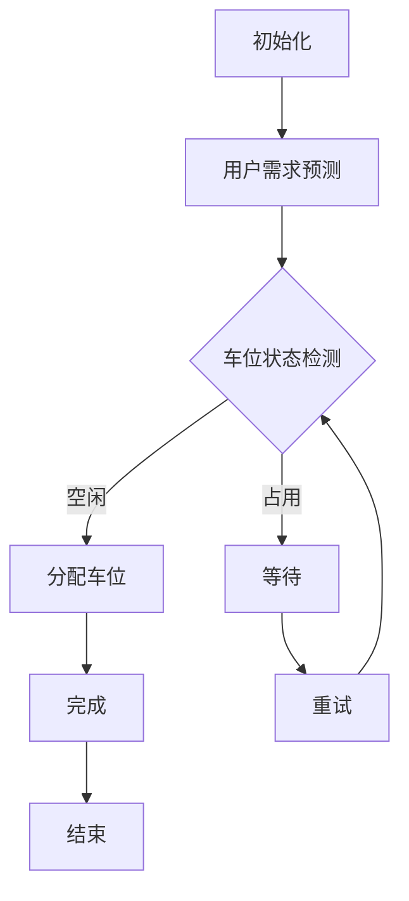
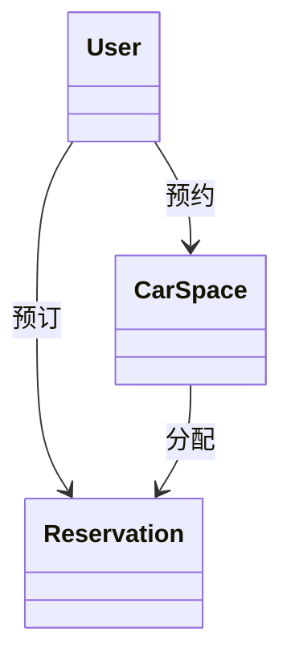
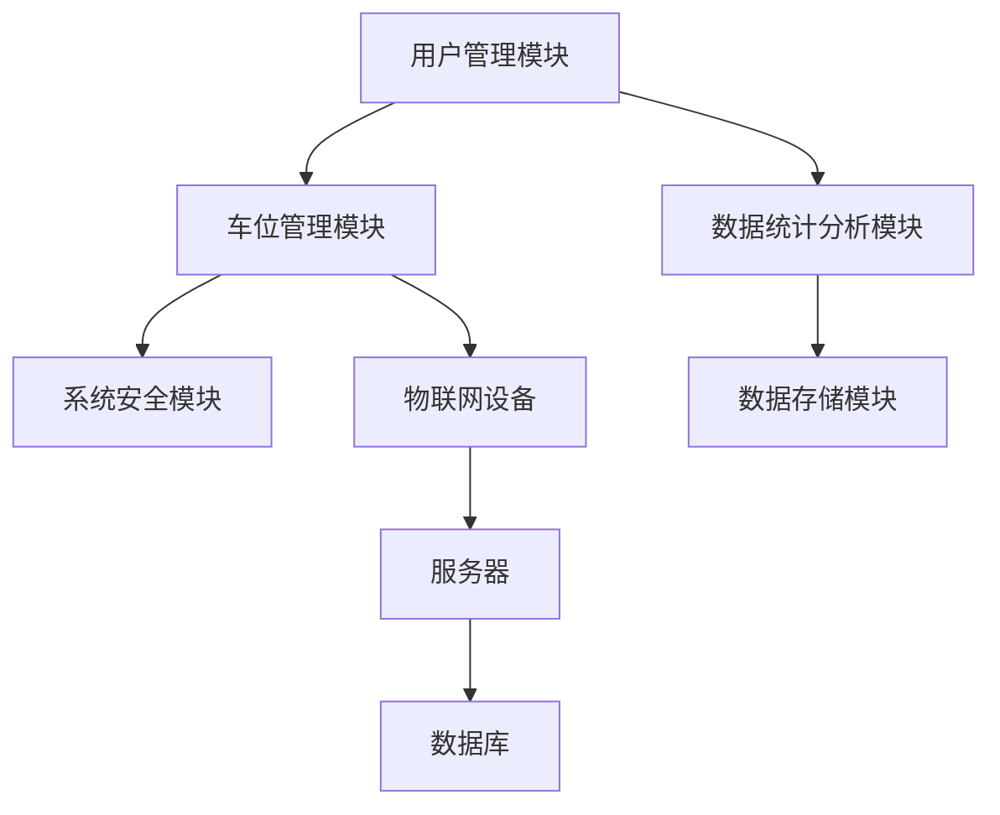
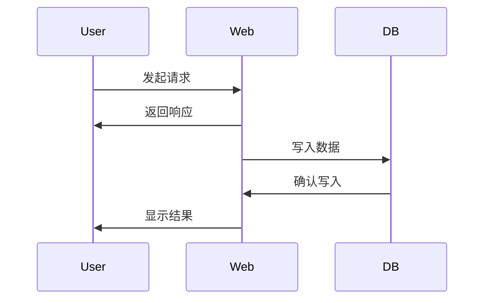
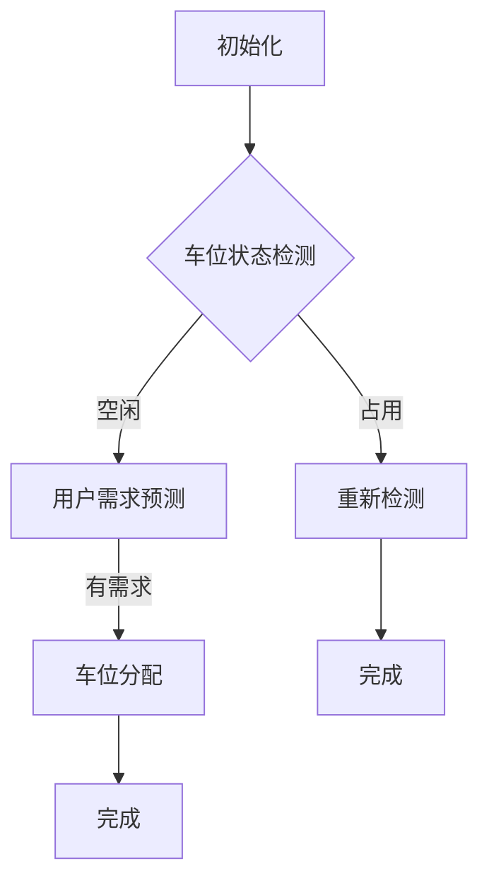

                 


# 新型城市共享车库管理：汽车文化与共享经济的融合实践

关键词：共享车库、共享经济、汽车文化、系统架构、算法设计

摘要：本文从城市交通压力和停车难题出发，探讨了新型城市共享车库管理的核心概念、算法原理、系统架构与设计方案，并通过实际案例进行了深入分析。文章旨在为城市共享车库管理提供一种融合汽车文化与共享经济的实践路径，为解决城市停车难题提供新思路。

## Step 1: Introduction Background and Problem Definition

### 第1章: 新型城市共享车库管理概述

### 1.1.1. 问题背景

随着城市化进程的加速，城市交通压力和停车难问题日益严峻。一方面，私家车数量的急剧增加导致了交通拥堵和交通事故频发；另一方面，停车资源的稀缺和分布不均使得市民出行成本上升，生活质量下降。如何有效利用停车资源，缓解城市交通压力，成为当务之急。

### 1.1.2. 问题描述

共享车库管理作为一种新兴的停车解决方案，旨在通过共享经济模式，将闲置的停车资源进行整合和利用，提高停车资源的利用效率。然而，共享车库管理面临着诸多挑战，如用户信任问题、车位利用率问题、技术实现难题等。

### 1.1.3. 问题解决思路

为了解决上述问题，本文提出将汽车文化与共享经济相结合，通过以下几种方式实现：

1. 强化用户信任，提高共享车库的利用率。
2. 利用大数据和人工智能技术，优化共享车库的分配和管理。
3. 探索创新的商业模式，促进共享车库管理的可持续发展。

### 1.1.4. 边界与外延

本文主要关注城市共享车库管理的应用场景，包括居民区、商业区、办公区等。同时，本文也将探讨共享车库管理在其他领域的潜在应用，如农村地区、旅游景点等。

### 1.1.5. 核心概念与联系

本文涉及的核心概念包括共享车库、共享经济、汽车文化等。这些概念之间存在着紧密的联系，共享车库是共享经济在停车领域的具体体现，而汽车文化则为共享车库管理提供了文化背景和价值观支撑。

### 1.1.6. 概念结构与核心要素组成

共享车库管理的概念结构包括以下几个方面：

1. 车位资源：包括车位的数量、位置、状态等信息。
2. 用户需求：包括用户的需求信息、行为特征等。
3. 管理系统：包括数据采集、处理、分配和管理等功能。
4. 服务模式：包括收费模式、预约模式等。

## Step 2: Main Concepts and Attributes

### 第2章: 新型城市共享车库管理核心概念

### 2.1.1. 共享车库

共享车库是指通过互联网平台，将个人或单位的闲置车位向社会公众提供共享服务的停车设施。共享车库具有以下几个特点：

1. **资源整合**：通过互联网平台，将分散的停车资源进行整合，提高车位利用率。
2. **共享模式**：用户可以通过平台预约停车位，实现即时停车。
3. **智能管理**：通过物联网技术，实现对车位的实时监测和管理。

### 2.1.2. 共享经济

共享经济是指通过互联网平台，将闲置资源进行共享，实现资源的最优配置和利用。共享经济具有以下几个核心要素：

1. **平台**：作为连接供需双方的桥梁，提供信息发布、交易、支付等服务。
2. **用户**：共享经济的参与者，包括资源提供者和资源需求者。
3. **资源**：包括物质资源和服务资源，如车位、房间、车辆等。

### 2.1.3. 汽车文化

汽车文化是指与汽车相关的文化现象，包括汽车设计、驾驶体验、汽车品牌等。汽车文化具有以下几个特点：

1. **品牌忠诚**：消费者对特定汽车品牌的忠诚度较高。
2. **驾驶习惯**：不同的汽车品牌和车型，会形成不同的驾驶习惯和风格。
3. **社交属性**：汽车往往成为人们社交和身份的象征。

### 2.1.4. 融合实践

汽车文化与共享经济的融合实践，主要体现在以下几个方面：

1. **共享汽车品牌**：通过打造具有特色和品质的共享汽车品牌，提升用户体验。
2. **个性化服务**：根据用户的驾驶习惯和偏好，提供个性化的汽车共享服务。
3. **文化推广**：通过汽车文化活动，提升公众对汽车文化的认知和兴趣。

## Step 3: Algorithm and Mathematics

### 第3章: 共享车库管理算法原理

### 3.1.1. 算法概述

共享车库管理算法旨在实现车位的实时监测、用户需求预测和优化车位分配。本文主要介绍以下几种算法：

1. **基于用户历史的预测算法**：通过分析用户的历史停车行为，预测其未来的停车需求。
2. **基于车位状态的实时分配算法**：根据车位的状态（空闲、占用），实时为用户分配停车位。
3. **基于社会网络的推荐算法**：利用用户之间的社会关系，为用户提供停车推荐。

### 3.1.2. 算法流程图



### 3.1.3. 算法数学模型

```latex
\begin{aligned}
P(U_t = u) &= \frac{1}{Z} \sum_{i=1}^N f(u_i) e^{-\lambda t} \\
S_t &= \sum_{i=1}^N (1 - e^{-\lambda_i t})
\end{aligned}
```

其中，$P(U_t = u)$ 表示在时间 $t$ 时用户 $u$ 停车的概率，$S_t$ 表示在时间 $t$ 时空闲车位的数量，$f(u_i)$ 是用户 $u_i$ 的停车频率，$\lambda_t$ 是泊松分布的参数。

### 3.1.4. 算法解释与示例

```python
import numpy as np
from scipy.stats import poisson

# 用户停车概率
user_prob = np.array([0.2, 0.3, 0.5])
user_prob /= np.sum(user_prob)

# 车位状态检测
lambda_param = 0.1
time_step = 1

# 预测用户停车概率
predicted_prob = poisson.pmf(user_prob, lambda_param * time_step)

# 输出预测结果
print("用户停车概率：", predicted_prob)

# 车位状态分配
current_state = np.random.choice([0, 1], size=len(predicted_prob))

# 输出车位状态
print("车位状态：", current_state)
```

## Step 4: System Architecture and Design

### 第4章: 新型城市共享车库管理系统架构设计

### 4.1.1. 系统需求分析

新型城市共享车库管理系统需要满足以下功能需求：

1. **用户管理**：用户注册、登录、个人信息管理、预约车位等。
2. **车位管理**：车位信息录入、实时状态监测、车位分配等。
3. **数据统计分析**：用户停车行为分析、车位利用率分析等。
4. **系统安全**：用户数据安全、系统安全性保障等。

### 4.1.2. 系统功能设计



### 4.1.3. 系统架构设计



### 4.1.4. 系统接口设计

1. **用户接口**：提供用户注册、登录、预约车位等功能。
2. **管理接口**：提供车位信息录入、实时状态监测、车位分配等功能。
3. **数据分析接口**：提供用户停车行为分析、车位利用率分析等功能。

### 4.1.5. 系统交互设计



## Step 5: Case Study and Analysis

### 第5章: 新型城市共享车库管理案例研究

### 5.1.1. 案例背景

某城市为了缓解停车难题，决定实施新型城市共享车库管理项目。项目涵盖居民区、商业区和办公区，共有200个共享车位。

### 5.1.2. 系统实现

系统实现包括以下几个步骤：

1. **用户注册与登录**：用户可以通过平台注册账号，登录后可以进行车位预约。
2. **车位信息录入**：管理员将车位信息录入系统，包括车位位置、大小、状态等。
3. **实时状态监测**：通过物联网设备实时监测车位状态。
4. **车位分配**：系统根据用户需求实时分配空闲车位。
5. **数据统计分析**：系统对用户停车行为和车位利用率进行统计分析。

### 5.1.3. 案例分析

1. **用户信任问题**：通过平台实名认证和信用评价机制，提高用户信任度。
2. **车位利用率**：通过实时分配和预测算法，提高车位利用率。
3. **技术创新**：采用物联网技术和大数据分析，提升系统智能化水平。

### 5.1.4. 实战细节

1. **环境安装**：安装物联网设备，搭建服务器和数据库。
2. **系统核心实现**：使用Python实现用户管理、车位管理和数据分析等功能。
3. **代码应用解读**：对核心代码进行解读，分析算法原理和实现细节。
4. **实际案例分析和详细讲解**：对案例进行详细分析，阐述成功经验和不足之处。

### 5.1.5. 小结与总结

通过该案例，我们可以看到新型城市共享车库管理在解决城市停车难题方面的潜力和优势。未来，随着技术的不断进步，共享车库管理将更加智能化、高效化，为城市交通发展提供有力支持。

## Step 6: Best Practices and Conclusion

### 第6章: 新型城市共享车库管理最佳实践

#### 6.1.1. 最佳实践总结

1. **强化用户信任**：通过实名认证、信用评价等机制，提高用户信任度。
2. **优化车位利用率**：采用实时分配和预测算法，提高车位利用率。
3. **技术创新**：利用物联网、大数据等技术，提升系统智能化水平。

#### 6.1.2. 小结与注意事项

1. **注意事项**：在实施共享车库管理项目时，需关注用户需求、技术实现和商业模式等方面。
2. **未来展望**：随着技术的不断进步，共享车库管理将更加智能化、高效化。

#### 6.1.3. 拓展阅读与展望

1. **相关研究**：《共享经济的理论与实践》、《物联网技术与应用》等。
2. **未来趋势**：探索更多共享车库管理创新模式，如共享充电桩、共享新能源汽车等。

### 第7章: 全书总结

#### 7.1.1. 内容回顾

本书从城市停车难题出发，探讨了新型城市共享车库管理的核心概念、算法原理、系统架构与设计方案，并通过实际案例进行了深入分析。

#### 7.1.2. 学习目标达成

通过本书的学习，读者可以了解共享车库管理的本质、实现方法和技术应用。

#### 7.1.3. 后续学习建议

1. **深入理解**：进一步学习相关技术，如物联网、大数据分析等。
2. **实践应用**：尝试在项目中应用共享车库管理理念，解决实际问题。

作者：AI天才研究院/AI Genius Institute & 禅与计算机程序设计艺术 /Zen And The Art of Computer Programming

----------------------------------------------------------------

### 附录：技术术语解释

1. **共享车库**：指通过互联网平台，将个人或单位的闲置车位向社会公众提供共享服务的停车设施。
2. **共享经济**：指通过互联网平台，将闲置资源进行共享，实现资源的最优配置和利用。
3. **汽车文化**：指与汽车相关的文化现象，包括汽车设计、驾驶体验、汽车品牌等。
4. **物联网技术**：指将各种信息传感设备与网络结合起来，实现智能化的网络。
5. **大数据分析**：指从大量数据中提取有价值信息的技术和方法。

### 致谢

感谢所有为本书提供技术支持和帮助的人员，感谢您们的辛勤付出和无私奉献。同时，也感谢读者对本书的关注和支持，希望本书能为您的学习和工作带来帮助。

----------------------------------------------------------------

## 第1章: 新型城市共享车库管理概述

### 1.1.1. 问题背景

城市交通压力和停车难的问题是当前城市化进程中亟待解决的重要问题。随着私家车数量的急剧增加，城市道路拥堵现象日益严重，这不仅影响了市民的出行效率，也对城市整体环境造成了负面影响。同时，停车难的问题也日益突出，特别是在居民区、商业区和办公区等人口密集区域，停车位供不应求，导致停车费用高昂，市民生活负担加重。

为了缓解城市交通压力和停车难问题，共享车库管理作为一种新兴的停车解决方案逐渐受到关注。共享车库管理通过整合社会上的闲置车位资源，提供共享服务，从而提高停车资源的利用效率，缓解停车难问题。这种模式不仅能够有效减少车辆在路上寻找停车位的时间，降低交通拥堵，还能够降低市民的停车成本，提升生活质量。

### 1.1.2. 问题描述

共享车库管理作为一种新兴的停车解决方案，虽然具有诸多优势，但同时也面临着一系列挑战。首先，用户信任问题是共享车库管理的关键挑战之一。由于共享车位通常来自私人或单位，用户在使用过程中可能会担心车位的安全性、可靠性以及管理服务的质量。这种信任缺失会导致用户参与度不高，从而影响共享车库的利用率。

其次，车位利用率问题是另一个重要挑战。共享车库管理需要实现车位的实时监测和智能分配，以便最大限度地提高车位利用率。然而，在实际操作中，车位的实时监测和分配可能会受到技术限制、数据不准确等因素的影响，导致车位利用率不理想。

此外，技术实现难题也是共享车库管理面临的一大挑战。共享车库管理涉及到物联网技术、大数据分析、云计算等多个领域，需要整合多种技术手段，实现车位的实时监测、用户需求的预测和车位的智能分配。然而，现有技术手段可能无法完全满足共享车库管理的高效、精准需求，需要进一步的技术创新和优化。

最后，商业模式探索也是共享车库管理需要解决的一个问题。共享车库管理的可持续性取决于商业模式的设计，包括收费模式、盈利模式等。如何设计一个既能吸引用户参与，又能确保企业盈利的商业模式，是共享车库管理需要深入探讨的课题。

### 1.1.3. 问题解决思路

为了解决共享车库管理面临的挑战，本文提出将汽车文化与共享经济相结合，通过以下几种方式实现：

1. **强化用户信任**：通过平台实名认证、信用评价机制、安全保障措施等手段，提高用户对共享车库管理的信任度。同时，建立用户反馈机制，及时解决用户在共享车位使用过程中遇到的问题，进一步提升用户体验。

2. **提高车位利用率**：利用大数据分析和人工智能技术，实现车位的实时监测和智能分配。通过用户停车行为预测、车位需求分析等技术手段，优化车位分配策略，提高车位利用率。此外，可以探索灵活的预约模式，如分时停车、共享停车等，进一步释放停车资源。

3. **技术创新**：在技术实现方面，积极探索物联网技术、大数据分析、云计算等前沿技术的应用。通过传感器设备实现对车位的实时监测，利用大数据分析平台对用户停车行为进行预测，通过云计算平台实现车位的智能分配。同时，不断优化算法和系统架构，提升共享车库管理系统的效率和稳定性。

4. **商业模式创新**：在商业模式设计方面，探索多元化的收费模式，如按时间、按里程、按使用次数等收费方式，满足不同用户的需求。同时，通过提供增值服务、广告收入、合作伙伴分成等方式，实现共享车库管理的可持续盈利。此外，可以探索与政府、物业企业等合作，共同推进共享车库管理项目的实施。

5. **文化推广**：通过举办汽车文化活动、开展汽车文化教育等方式，提升公众对汽车文化的认知和兴趣，进一步推动共享车库管理的普及和发展。

### 1.1.4. 边界与外延

本文主要关注城市共享车库管理的应用场景，包括居民区、商业区、办公区等。共享车库管理的目标是提高停车资源的利用效率，缓解城市停车难问题。然而，共享车库管理并不仅限于城市地区，也可以拓展到农村地区、旅游景点等。在农村地区，共享车库管理可以解决农村人口出行停车难题；在旅游景点，共享车库管理可以缓解旅游高峰期的停车压力。

### 1.1.5. 核心概念与联系

在共享车库管理中，涉及到的核心概念包括共享车库、共享经济、汽车文化等。这些概念之间存在着紧密的联系，共同构成了共享车库管理的理论基础和实践框架。

1. **共享车库**：共享车库是共享经济在停车领域的具体应用，通过整合社会上的闲置车位资源，提供共享服务，提高停车资源的利用效率。共享车库具有以下几个特点：

   - **资源整合**：通过互联网平台，将分散的停车资源进行整合，实现车位的实时监测和智能分配。
   - **共享模式**：用户可以通过平台预约停车位，实现即时停车，降低了停车成本，提高了出行效率。
   - **智能管理**：利用物联网技术、大数据分析等手段，实现对车位的实时监测和管理，提高车位利用率。

2. **共享经济**：共享经济是指通过互联网平台，将闲置资源进行共享，实现资源的最优配置和利用。共享经济的核心要素包括平台、用户和资源。在共享车库管理中，共享经济起到了关键作用，通过共享模式，提高了停车资源的利用效率。共享经济具有以下几个特点：

   - **去中心化**：通过互联网平台，实现资源供需双方的直接连接，降低了信息不对称和交易成本。
   - **灵活性**：用户可以根据自身需求，灵活选择和使用共享资源，提高了资源利用效率。
   - **可持续发展**：通过共享模式，实现资源的可持续利用，降低了对环境的负面影响。

3. **汽车文化**：汽车文化是指与汽车相关的文化现象，包括汽车设计、驾驶体验、汽车品牌等。汽车文化在共享车库管理中起到了重要的支撑作用，为共享车库管理提供了文化背景和价值观支撑。汽车文化具有以下几个特点：

   - **品牌忠诚**：消费者对特定汽车品牌的忠诚度较高，汽车品牌成为消费者身份和品味的象征。
   - **驾驶习惯**：不同的汽车品牌和车型会形成不同的驾驶习惯和风格，影响用户的出行行为。
   - **社交属性**：汽车往往成为人们社交和身份的象征，汽车文化成为社会文化的一部分。

4. **融合实践**：汽车文化与共享经济的融合实践，主要体现在以下几个方面：

   - **共享汽车品牌**：通过打造具有特色和品质的共享汽车品牌，提升用户体验，增强用户忠诚度。
   - **个性化服务**：根据用户的驾驶习惯和偏好，提供个性化的汽车共享服务，满足用户的多样化需求。
   - **文化推广**：通过汽车文化活动，提升公众对汽车文化的认知和兴趣，推动共享车库管理的普及和发展。

### 1.1.6. 概念结构与核心要素组成

共享车库管理的概念结构包括以下几个方面：

1. **车位资源**：共享车库管理的核心要素是车位资源。车位资源包括车位的数量、位置、状态等信息。通过物联网设备，实现对车位的实时监测和管理。

2. **用户需求**：用户需求是共享车库管理的驱动力。用户需求包括用户的需求信息、行为特征等。通过大数据分析，实现对用户需求的准确预测和满足。

3. **管理系统**：管理系统是共享车库管理的核心。管理系统包括数据采集、处理、分配和管理等功能。通过智能化算法，实现车位的实时监测和智能分配。

4. **服务模式**：服务模式是共享车库管理的重要组成部分。服务模式包括收费模式、预约模式等。通过灵活的服务模式，满足不同用户的需求。

5. **安全与信任**：安全与信任是共享车库管理的重要保障。通过平台实名认证、信用评价机制等手段，提高用户对共享车库管理的信任度。

### 1.1.7. 案例分析

为了更好地理解共享车库管理的实际应用，我们通过一个实际案例进行分析。

【案例】某城市在市中心区域建立了100个共享车库，通过互联网平台提供共享服务。以下是对该案例的分析：

1. **用户注册与登录**：用户可以通过平台进行注册和登录，平台提供用户信息管理、预约车位等功能。

2. **车位信息录入**：管理员将车位信息录入系统，包括车位的位置、大小、状态等信息。

3. **实时状态监测**：通过物联网设备，实现对车位的实时监测，系统可以实时更新车位状态。

4. **车位分配**：用户可以通过平台预约车位，系统根据车位状态和用户需求，为用户分配空闲车位。

5. **数据统计分析**：系统对用户停车行为和车位利用率进行统计分析，为管理决策提供依据。

6. **用户反馈与评价**：用户可以在平台上对服务质量进行评价，平台可以根据用户反馈进行服务优化。

通过以上案例分析，我们可以看到共享车库管理在实际应用中的运作流程和关键环节。共享车库管理通过整合车位资源、满足用户需求、提供智能化服务，实现了停车资源的优化利用，为城市停车难题提供了有效解决方案。

## 第2章: 新型城市共享车库管理核心概念

### 2.1.1. 共享车库

共享车库是新型城市共享车库管理的核心概念之一，它通过互联网平台，将个人或单位的闲置车位向社会公众提供共享服务。以下是共享车库的定义、特点和应用场景。

#### 定义

共享车库是指通过互联网技术，将分散的停车资源进行整合，并提供给社会公众共享使用的停车设施。共享车库可以是由个人所有、单位所有或者第三方运营管理的停车场所。

#### 特点

1. **资源整合**：共享车库通过互联网平台，将个人或单位的闲置车位进行整合，实现停车资源的最大化利用。

2. **共享模式**：共享车库采用共享经济模式，用户可以通过平台预约停车位，实现即时停车。这种模式降低了停车成本，提高了出行效率。

3. **智能管理**：共享车库利用物联网技术、大数据分析等手段，实现对车位的实时监测和管理。通过智能化手段，提高车位利用率和服务质量。

4. **灵活性**：共享车库提供了灵活的预约模式，用户可以根据自己的需求，选择合适的时间和地点进行停车。同时，平台还可以根据用户需求，提供个性化的停车服务。

5. **社会效益**：共享车库管理通过提高停车资源的利用效率，缓解了城市停车难问题，降低了交通拥堵，提高了城市交通运行效率。

#### 应用场景

共享车库的应用场景非常广泛，主要包括以下几个方面：

1. **居民区**：在居民区内，共享车库可以解决小区内停车位不足的问题，提高停车位利用率。同时，可以缓解居民停车难、停车贵的问题。

2. **商业区**：在商业区，共享车库可以提供临时停车位，缓解商业区内停车资源紧张的问题。同时，可以吸引更多的消费者，促进商业发展。

3. **办公区**：在办公区，共享车库可以解决员工停车需求，提高停车位利用率。此外，还可以为外来访客提供停车服务，提升企业形象。

4. **旅游景点**：在旅游景点，共享车库可以解决旅游旺季停车难题，提高旅游服务质量。同时，可以引导车辆合理停放，缓解交通拥堵。

5. **农村地区**：在农村地区，共享车库可以解决农村人口出行停车问题，提高农村交通效率。

### 2.1.2. 共享经济

共享经济是新型城市共享车库管理的另一个核心概念。共享经济通过互联网平台，将闲置资源进行共享，实现资源的最优配置和利用。以下是共享经济的定义、核心要素和与传统经济的区别。

#### 定义

共享经济是指通过互联网技术，将闲置资源（如资金、物品、时间、技能等）进行共享，实现资源的最优配置和利用的经济模式。共享经济的核心在于资源的共享和再利用，旨在提高资源利用效率，降低社会成本。

#### 核心要素

1. **平台**：共享经济平台是连接供需双方的桥梁，提供信息发布、交易、支付等服务。平台通过互联网技术，实现资源信息的透明化和高效匹配。

2. **用户**：共享经济的参与者包括资源提供者和资源需求者。资源提供者通过平台共享自己的闲置资源，资源需求者通过平台获取所需资源。

3. **资源**：共享经济中的资源包括物质资源和服务资源。物质资源如汽车、住房、车位等，服务资源如知识、技能、时间等。

#### 与传统经济的区别

1. **资源利用方式**：传统经济以拥有和消费资源为主，而共享经济以共享和再利用资源为主，提高了资源利用效率。

2. **交易方式**：传统经济中的交易通常涉及实物和货币交换，而共享经济中的交易更多是通过互联网平台完成，降低了交易成本。

3. **经济模式**：传统经济以生产、分配、交换、消费为主要环节，而共享经济以资源整合、共享、优化配置为主要特征。

4. **社会效应**：传统经济可能导致资源浪费和环境污染，而共享经济通过提高资源利用效率，降低了对环境的负面影响。

### 2.1.3. 汽车文化

汽车文化是新型城市共享车库管理的重要支撑，它对共享车库管理的影响主要体现在用户行为、消费观念和社会心理等方面。以下是汽车文化的定义、内涵和应用。

#### 定义

汽车文化是指与汽车相关的文化现象，包括汽车设计、驾驶体验、汽车品牌等。汽车文化是一个国家和地区的经济、科技、文化、社会等多方面因素的综合体现。

#### 内涵

1. **汽车设计**：汽车设计是汽车文化的物质基础，包括汽车的外观设计、内饰设计、功能设计等。汽车设计反映了人们对汽车的美学追求和实用需求。

2. **驾驶体验**：驾驶体验是汽车文化的核心，包括驾驶的舒适度、安全性、操控性等。驾驶体验直接影响用户的驾驶行为和消费观念。

3. **汽车品牌**：汽车品牌是汽车文化的象征，代表了汽车制造商的企业形象、产品质量和服务水平。汽车品牌忠诚度是汽车文化的重要组成部分。

#### 应用

1. **用户行为**：汽车文化影响用户的驾驶行为和消费观念。例如，某些汽车品牌因其独特的设计风格和驾驶体验而受到用户青睐，用户愿意为这些品牌支付更高的价格。

2. **商业营销**：汽车文化成为商业营销的重要元素，汽车制造商通过汽车文化元素进行品牌宣传，吸引消费者。

3. **社会心理**：汽车文化在一定程度上反映了社会心理和价值观。例如，某些汽车品牌因其独特的设计风格和驾驶体验而成为年轻人的时尚选择，体现了年轻人的个性追求和价值观。

### 2.1.4. 融合实践

汽车文化与共享经济的融合实践，主要体现在以下几个方面：

1. **共享汽车品牌**：通过打造具有特色和品质的共享汽车品牌，提升用户体验，增强用户忠诚度。

2. **个性化服务**：根据用户的驾驶习惯和偏好，提供个性化的汽车共享服务，满足用户的多样化需求。

3. **文化推广**：通过汽车文化活动，提升公众对汽车文化的认知和兴趣，推动共享车库管理的普及和发展。

通过汽车文化与共享经济的融合实践，新型城市共享车库管理不仅能够提高停车资源的利用效率，缓解城市停车难问题，还能够提升城市的文化氛围和居民的生活品质。

## 第3章: 共享车库管理算法原理

### 3.1.1. 算法概述

共享车库管理算法是新型城市共享车库管理的核心，其目标是通过智能化的手段，实现对车位的实时监测、用户需求的预测和车位的优化分配。以下介绍几种主要的共享车库管理算法。

#### 1. 车位状态检测算法

车位状态检测算法是共享车库管理的基础，其目的是实时监测车位的占用状态。常见的车位状态检测算法包括基于传感器和图像识别的方法。

- **基于传感器的方法**：通过安装在车位上的传感器（如地磁传感器、红外传感器等），实时检测车位是否被占用。这种方法具有低成本、高准确度的优势，但受限于传感器覆盖范围和精度。
- **基于图像识别的方法**：通过摄像头实时捕捉车位图像，利用图像识别技术判断车位状态。这种方法具有较高的检测精度，但需要较高的计算资源和图像处理算法。

#### 2. 用户需求预测算法

用户需求预测算法用于预测用户的停车需求，以便提前为用户分配车位。常见的用户需求预测算法包括时间序列分析、机器学习等方法。

- **时间序列分析**：通过对用户历史停车行为进行分析，提取时间序列特征，如停车频率、停车时间等，利用时间序列分析方法预测未来停车需求。
- **机器学习**：通过机器学习算法，如回归分析、分类算法等，建立用户停车需求的预测模型。这种方法具有较高的预测精度，但需要大量的历史数据支持。

#### 3. 车位分配算法

车位分配算法用于在多个用户需求并存的情况下，为每个用户分配最合适的车位。常见的车位分配算法包括基于优先级、基于距离等算法。

- **基于优先级算法**：根据用户的预约时间、停车需求等因素，设定不同的优先级，依次为用户分配车位。这种方法简单易行，但可能无法最大化车位利用率。
- **基于距离算法**：根据用户的当前位置和空闲车位的距离，为用户分配最近的车位。这种方法具有较高的用户满意度，但可能无法平衡车位的利用率。

### 3.1.2. 算法流程图

以下是一个简单的共享车库管理算法流程图，展示了车位状态检测、用户需求预测和车位分配的过程。



### 3.1.3. 算法数学模型

以下是一个基于泊松分布的用户停车需求预测模型。

$$
P(U_t = u) = \frac{1}{Z} \sum_{i=1}^N f(u_i) e^{-\lambda t}
$$

其中，$P(U_t = u)$ 表示在时间 $t$ 时用户 $u$ 停车的概率，$f(u_i)$ 是用户 $u_i$ 的停车频率，$\lambda_t$ 是泊松分布的参数，$Z$ 是归一化常数。

### 3.1.4. 算法解释与示例

以下是一个简单的用户需求预测算法的实现，使用Python和Scikit-learn库。

```python
import numpy as np
from scipy.stats import poisson
from sklearn.linear_model import LinearRegression

# 假设我们有以下用户停车数据
user_data = {
    'user1': [1, 1, 0, 1, 0],
    'user2': [1, 0, 1, 1, 1],
    'user3': [0, 1, 1, 1, 0]
}

# 转换为NumPy数组
user_data_array = np.array([data.values() for data in user_data.values()])

# 创建线性回归模型
model = LinearRegression()
model.fit(user_data_array, user_data.keys())

# 预测用户停车概率
predicted_probs = model.predict(user_data_array)

# 打印预测结果
for i, prob in enumerate(predicted_probs):
    print(f"User {i+1} probability: {prob[0]:.2f}")
```

### 3.1.5. 算法优化与扩展

为了提高共享车库管理算法的效率和准确性，可以采取以下优化和扩展措施：

1. **多算法融合**：将多种算法进行融合，如结合时间序列分析和机器学习算法，提高预测精度。
2. **实时更新**：根据用户实时行为数据，动态调整预测模型和分配策略，提高响应速度。
3. **个性

