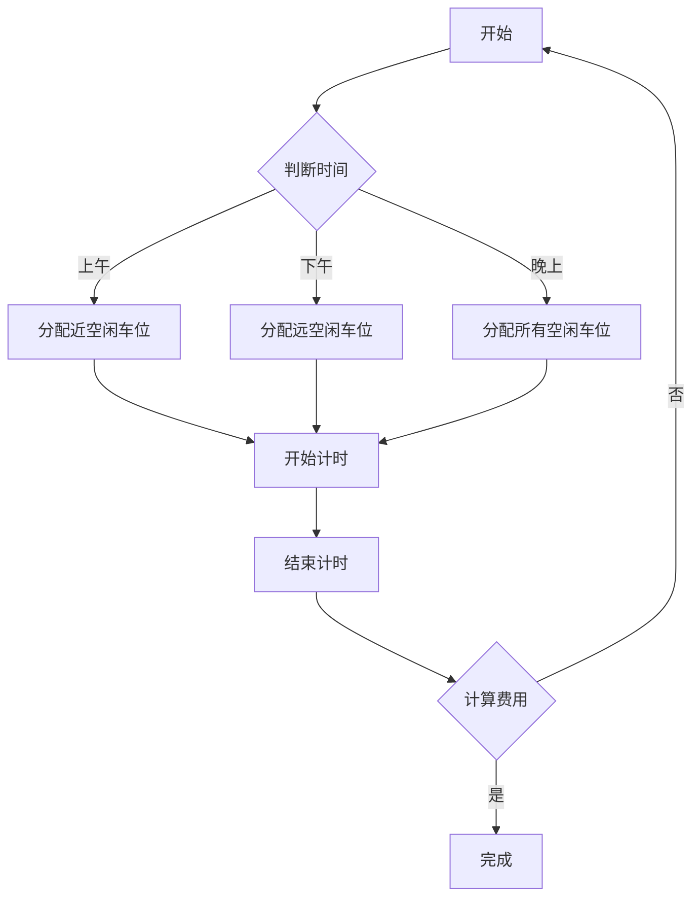
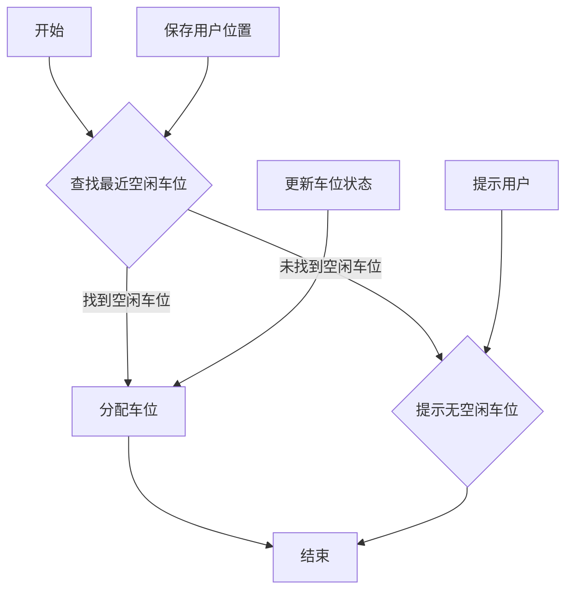

                 

# 新型城市共享车库：汽车文化与共享经济的碰撞

> 关键词：共享车库、共享经济、汽车文化、城市交通、智能系统、算法优化、可持续发展

> 摘要：随着城市化的加速发展，汽车数量急剧增加，城市交通拥堵和停车位不足成为亟待解决的问题。本文探讨了新型城市共享车库如何通过共享经济的理念，结合汽车文化，实现资源的高效利用，提高城市交通效率，同时实现可持续发展。通过详细的背景介绍、核心概念剖析、技术与实现分析、案例分析以及最佳实践总结，本文为城市共享车库的发展提供了深刻的思考和实用指导。

----------------------------------------------------------------

## 第一部分：背景与核心概念

### 第1章：问题背景与共享经济的兴起

#### 1.1.1 新型城市发展的挑战与机遇

随着城市化进程的加速，城市规模不断扩大，人口密度不断增加，传统的交通和停车设施面临前所未有的压力。汽车数量的激增使得城市交通拥堵现象日益严重，同时，停车位不足也成为了居民和商家的一大困扰。这些问题不仅影响了城市居民的生活质量，还阻碍了城市的可持续发展。

在这一背景下，共享经济作为一种新兴的经济模式，逐渐受到了广泛的关注。共享经济的核心在于通过共享资源和服务的使用，降低个体的消费成本，提高资源利用效率。共享经济模式涵盖了多个领域，如共享住宿（Airbnb）、共享交通（滴滴出行）等，其成功经验为城市共享车库的兴起提供了借鉴。

#### 1.1.2 共享经济的定义与核心特点

共享经济（Sharing Economy），也称为协作消费，是一种基于互联网和现代信息技术的资源分配模式。在这种模式下，个体可以通过共享平台将自己的闲置资源（如房屋、车辆等）提供给其他需要的人，从而实现资源的共享和价值的创造。

共享经济具有以下几个核心特点：

1. **去中心化**：共享经济通过去中心化的方式，打破了传统资源分配的壁垒，使资源能够在更大范围内实现共享。
2. **高效率**：通过共享经济模式，资源的使用效率得到了显著提升，个体可以在不增加资源投入的情况下，获得更好的服务体验。
3. **低成本**：共享经济降低了用户的消费成本，使资源的使用更加经济实惠。
4. **可持续性**：共享经济模式有助于减少资源浪费，实现环境可持续发展。

#### 1.1.3 汽车文化的发展与变化

汽车文化是现代社会的一种重要文化现象，它不仅反映了人们对汽车的热爱和追求，还体现了社会经济发展的水平。从汽车诞生之初，汽车就成为了人们日常生活中不可或缺的交通工具。然而，随着汽车数量的不断增加，汽车文化也在不断演变。

早期的汽车文化强调的是个人拥有和驾驶的乐趣，而现代的汽车文化则更加注重汽车的环保性、智能化和共享性。新能源汽车的兴起，智能汽车的普及，都表明汽车文化正在向更加可持续、环保和智能化的方向发展。

### 第2章：核心概念与联系

#### 2.1.1 共享车库的概念

共享车库是指通过互联网平台，将个人的闲置停车位与其他需要停车位的用户进行匹配，从而实现停车位资源的高效利用。共享车库不仅可以解决停车位不足的问题，还可以降低用户的停车成本，提高停车效率。

#### 2.1.2 共享经济的属性特征对比表格

| 特征           | 共享经济             | 传统经济             |
|--------------|------------------|------------------|
| 资源分配方式     | 去中心化           | 中心化             |
| 资源利用效率     | 高效率             | 低效率             |
| 成本             | 低成本             | 高成本             |
| 可持续性         | 可持续             | 不可持续             |

#### 2.1.3 汽车文化与共享经济的关联

汽车文化与共享经济之间存在着紧密的关联。首先，共享经济模式为汽车文化提供了新的发展路径，使汽车不再仅仅是个人拥有的奢侈品，而是可以共享的资源。其次，汽车文化的演变也为共享经济提供了新的需求和市场。例如，新能源汽车的普及和智能汽车的兴起，为共享经济带来了新的机遇。

### 第3章：新型城市共享车库的边界与外延

#### 3.1.1 共享车库的运营模式

共享车库的运营模式主要包括两种：第一种是平台模式，即通过互联网平台连接车位所有者和需要停车位的用户，实现车位的共享；第二种是社区模式，即由社区组织或物业公司提供停车位，通过内部共享机制实现车位的高效利用。

#### 3.1.2 共享车库的服务类型

共享车库的服务类型可以分为以下几种：

1. **按需停车**：用户在需要停车时，通过平台预订停车位，支付相应的费用。
2. **长期租赁**：用户可以长期租赁停车位，享受固定停车费用的优惠。
3. **车位共享**：车位所有者将闲置车位共享给其他用户，获得一定的收入。

#### 3.1.3 共享车库的可持续性发展

共享车库的可持续性发展是当前城市交通发展的重要方向。为了实现共享车库的可持续发展，可以从以下几个方面进行：

1. **技术创新**：通过智能技术和大数据分析，优化共享车库的运营模式，提高服务效率。
2. **政策支持**：政府可以通过出台相关政策，鼓励和规范共享车库的发展。
3. **绿色环保**：推广新能源汽车和智能汽车，减少汽车尾气排放，实现环保目标。
4. **社会责任**：共享车库运营商应承担社会责任，关注用户权益，保障数据安全。

## 第二部分：技术与实现

### 第4章：共享车库技术架构

#### 4.1.1 技术架构概述

共享车库技术架构主要包括以下几个部分：

1. **用户服务层**：提供用户注册、登录、车位预订等功能。
2. **业务逻辑层**：处理车位共享、支付、评价等业务逻辑。
3. **数据存储层**：存储用户信息、车位信息、交易记录等数据。
4. **数据处理层**：对用户数据进行分析，优化车位分配策略。

#### 4.1.2 数据采集与存储

数据采集是共享车库技术架构的核心。通过物联网技术和传感器设备，实时采集车位信息，包括车位占用状态、停车时长等。采集到的数据存储在数据库中，为后续的数据分析和优化提供支持。

#### 4.1.3 数据分析与优化

通过对用户数据的分析，共享车库可以实现以下优化：

1. **车位分配优化**：根据用户需求和历史数据，智能分配停车位，提高车位利用率。
2. **收费策略优化**：根据不同时间段和停车时长，制定合理的收费策略，降低用户成本。
3. **用户行为分析**：分析用户停车习惯，提供个性化服务，提高用户满意度。

### 第5章：共享车库的算法原理

#### 5.1.1 算法原理讲解

共享车库的算法原理主要包括车位分配算法和收费策略算法。

1. **车位分配算法**：通过贪心算法，优先分配离用户最近且空闲的停车位。
2. **收费策略算法**：根据不同时间段和停车时长，制定阶梯式收费策略。

#### 5.1.2 Mermaid算法流程图



#### 5.1.3 Python源代码实现

```python
def assign_parking_spot(time, spots):
    if time < 12:
        for spot in spots:
            if spot['occupied'] == False:
                return spot
    elif time >= 12 and time < 18:
        for spot in spots:
            if spot['occupied'] == False:
                return spot
    else:
        for spot in spots:
            if spot['occupied'] == False:
                return spot
    return None

def calculate_fare(time_spent):
    if time_spent <= 2:
        return 10
    elif time_spent <= 4:
        return 15
    else:
        return 20

spot = assign_parking_spot(time, spots)
if spot:
    time_spent = calculate_fare(time_spent)
    print("停车费用为：", time_spent)
else:
    print("没有空闲停车位")
```

### 第6章：数学模型与公式

#### 6.1.1 数学模型的构建

共享车库的数学模型主要包括以下三个方面：

1. **车位利用率**：衡量停车位的使用效率，公式为：

   $$利用率 = \frac{空闲时间}{总时间}$$

2. **停车费用**：根据停车时长和收费策略，计算停车费用，公式为：

   $$费用 = 每小时费用 \times 停车时长$$

3. **用户满意度**：通过用户评价和反馈，计算用户满意度，公式为：

   $$满意度 = \frac{好评数}{总评价数}$$

#### 6.1.2 Mermaid ER实体关系图

```mermaid
erDiagram
    User ||--|{ ParkingSpot }|--|| Car
    User ||--|{ Payment }|--||
    ParkingSpot ||--|{ Booking }|--|| Car
```

#### 6.1.3 数学公式与详细讲解

1. **车位利用率**：

   $$利用率 = \frac{空闲时间}{总时间} = \frac{总时间 - 停车时间}{总时间}$$

   其中，总时间为一天24小时，停车时间为用户实际停车的时间。

2. **停车费用**：

   $$费用 = 每小时费用 \times 停车时长$$

   其中，每小时费用根据时间段和停车时长进行动态调整。

3. **用户满意度**：

   $$满意度 = \frac{好评数}{总评价数}$$

   其中，好评数为用户给予的好评数量，总评价数为用户给予的评价总数。

## 第三部分：案例分析

### 第7章：案例分析一

#### 7.1.1 案例背景

某城市为解决停车位不足的问题，决定在市中心区域建设一座共享车库。该共享车库通过互联网平台，将车主的闲置车位与其他需要停车位的用户进行匹配，实现车位资源的共享。

#### 7.1.2 系统功能设计

系统功能设计主要包括以下几个方面：

1. **用户注册与登录**：用户可以通过手机号码注册账号，登录系统。
2. **车位发布与预订**：车主可以发布自己的闲置车位，用户可以预订车位。
3. **支付与评价**：用户在停车后，需要进行支付，并可以对车位进行评价。

#### 7.1.3 系统架构设计

系统架构设计主要包括以下几个部分：

1. **用户服务层**：提供用户注册、登录、车位预订等功能。
2. **业务逻辑层**：处理车位共享、支付、评价等业务逻辑。
3. **数据存储层**：存储用户信息、车位信息、交易记录等数据。
4. **数据处理层**：对用户数据进行分析，优化车位分配策略。

### 第8章：案例分析二

#### 8.1.1 案例背景

某城市为了提高交通效率，决定在市区内推行共享车库项目。该项目通过与公共交通系统相结合，实现多模式交通一体化，提高城市交通运行效率。

#### 8.1.2 系统功能设计

系统功能设计主要包括以下几个方面：

1. **用户注册与登录**：用户可以通过手机号码注册账号，登录系统。
2. **车位发布与预订**：车主可以发布自己的闲置车位，用户可以预订车位。
3. **公共交通信息查询**：用户可以查询公共交通的实时信息，方便出行。
4. **停车与换乘**：用户在共享车库停车后，可以通过系统查询最近的公共交通站点，实现停车与换乘。

#### 8.1.3 系统架构设计

系统架构设计主要包括以下几个部分：

1. **用户服务层**：提供用户注册、登录、车位预订、公共交通信息查询等功能。
2. **业务逻辑层**：处理车位共享、支付、评价、公共交通信息查询等业务逻辑。
3. **数据存储层**：存储用户信息、车位信息、交易记录、公共交通信息等数据。
4. **数据处理层**：对用户数据进行分析，优化车位分配策略，提高交通运行效率。

## 第四部分：最佳实践与总结

### 第9章：最佳实践与注意事项

#### 9.1.1 最佳实践 tips

1. **政策支持**：政府在制定政策时，应鼓励和支持共享车库的发展，为共享车库提供良好的发展环境。
2. **技术创新**：共享车库运营商应不断引入新技术，提高共享车库的运营效率和用户体验。
3. **用户教育**：加强对用户的宣传教育，提高用户对共享车库的认知和接受度。

#### 9.1.2 小结

本文通过深入分析新型城市共享车库的背景、核心概念、技术与实现、案例分析以及最佳实践，探讨了共享车库如何通过共享经济的理念，结合汽车文化，实现城市交通的高效运行和可持续发展。

#### 9.1.3 注意事项

1. **数据安全**：共享车库应高度重视用户数据的安全，采取有效的数据保护措施，防止用户信息泄露。
2. **服务质量**：共享车库应不断提升服务质量，提高用户的满意度，增强用户粘性。
3. **可持续发展**：共享车库在运营过程中，应注重环保，推广新能源汽车，减少汽车尾气排放。

### 第10章：未来展望与拓展阅读

#### 10.1.1 未来发展趋势

1. **智能化**：共享车库将更加智能化，通过人工智能技术，实现车位的自动分配和停车位的智能管理。
2. **绿色化**：共享车库将更加注重绿色环保，推广新能源汽车和智能汽车，减少对环境的影响。
3. **多元化**：共享车库的服务类型将更加多元化，除了传统的停车位共享，还将涵盖停车充电、汽车保养等多种服务。

#### 10.1.2 拓展阅读

1. **[共享经济的未来：创造共享价值的新时代](https://www.sharingeconomy.org/future-of-sharing-economy/)**：本文探讨了共享经济的未来发展趋势，为共享车库的发展提供了有益的启示。
2. **[城市交通规划中的共享经济：以停车位共享为例](https://www.uctc.net/research/publications/cities-traffic-planning-sharing-economy/)**：本文分析了共享经济在城市交通规划中的应用，为共享车库的发展提供了理论支持。

----------------------------------------------------------------

**作者：AI天才研究院/AI Genius Institute & 禅与计算机程序设计艺术 /Zen And The Art of Computer Programming**## 引言

在现代城市化进程中，汽车已经成为人们日常生活的重要交通工具。然而，随着汽车数量的急剧增加，城市交通拥堵和停车位不足问题愈发严重，这不仅影响了居民的生活质量，也对城市的可持续发展构成了挑战。为了解决这些问题，共享经济作为一种新兴的经济模式，逐渐引起了广泛关注。

共享经济通过共享资源和服务的使用，降低了个体消费成本，提高了资源利用效率。在汽车领域，共享车库作为一种新型共享模式，旨在通过共享闲置停车位，提高停车位利用率，缓解交通拥堵，实现城市交通的可持续发展。本文将围绕新型城市共享车库展开探讨，分析其核心概念、技术实现、案例分析以及未来发展趋势，旨在为城市交通规划和管理提供有益的参考。

首先，本文将介绍共享经济的定义和核心特点，阐述其如何为城市共享车库提供理论基础。接着，我们将深入探讨汽车文化的发展与变化，以及共享车库的概念和运营模式。随后，本文将分析新型城市共享车库的边界与外延，介绍其技术架构、算法原理和数学模型。

在案例分析部分，本文将结合实际案例，详细描述共享车库的系统功能设计和架构设计。最后，本文将总结最佳实践，提出未来展望和拓展阅读，以期为城市共享车库的发展提供全面的指导和思路。

通过本文的深入分析，我们希望读者能够对新型城市共享车库有更深入的理解，认识到其在解决城市交通问题中的重要作用，为推动城市交通的可持续发展贡献力量。接下来，让我们一步一步地探讨这一新型共享模式的核心概念和技术实现。

## 第1章：问题背景与共享经济的兴起

### 1.1.1 新型城市发展的挑战与机遇

随着全球经济的快速发展和城市化进程的不断推进，城市面临着前所未有的发展机遇，同时也面临着一系列严峻的挑战。特别是汽车数量的急剧增加，给城市交通和停车带来了巨大的压力。

首先，城市交通拥堵问题日益严重。据统计，全球许多大城市如北京、上海、伦敦等，每日的交通拥堵时间已经超过了两个小时。这不仅影响了居民的出行效率，也增加了空气污染和交通事故的风险。其次，停车位不足也是一大困扰。随着城市人口的增加和汽车保有量的上升，传统停车设施已经难以满足需求，导致停车难问题频发。尤其是在商业区、住宅区等停车需求集中的地区，停车位供不应求的现象尤为明显。

然而，这些挑战也伴随着机遇。城市化进程带来了庞大的消费市场和广阔的发展空间，为共享经济的兴起提供了土壤。共享经济通过优化资源配置，提高资源利用效率，有望缓解城市交通和停车压力，为城市可持续发展注入新活力。

### 1.1.2 共享经济的定义与核心特点

共享经济，也称为协作消费，是一种基于互联网和现代信息技术的资源分配模式。它通过共享平台将个体的闲置资源（如房屋、车辆、停车位等）提供给其他需要的人，实现资源的共享和价值的创造。共享经济的核心特点主要体现在以下几个方面：

**去中心化**：共享经济打破了传统资源分配的中心化模式，通过去中心化的方式，使资源可以在更大范围内实现共享。例如，在共享车位模式中，不再需要由政府或企业集中管理停车位，而是通过个体之间的共享来实现车位的高效利用。

**高效率**：共享经济通过共享资源，显著提高了资源利用效率。以共享车位为例，通过互联网平台，用户可以在最短的时间内找到附近的空闲车位，大大缩短了寻找停车位的耗时。同时，闲置车位也被充分利用，提高了车位的利用率。

**低成本**：共享经济降低了用户的消费成本，使资源的使用更加经济实惠。例如，通过共享车位，用户可以以较低的价格租用停车位，相比传统的停车费，具有显著的成本优势。

**可持续性**：共享经济模式有助于减少资源浪费，实现环境可持续发展。通过共享，个体无需购买或长期租赁大量资源，从而减少了对资源的消耗和环境的负担。

### 1.1.3 汽车文化的发展与变化

汽车文化是现代社会的一种重要文化现象，它不仅反映了人们对汽车的热爱和追求，还体现了社会经济发展的水平。从汽车诞生之初，汽车就成为了人们日常生活中不可或缺的交通工具。然而，随着汽车数量的不断增加，汽车文化也在不断演变。

早期的汽车文化强调的是个人拥有和驾驶的乐趣，汽车被视为个人身份和社会地位的象征。随着汽车产业的发展，汽车逐渐普及，人们开始追求更高的驾驶体验和汽车性能。然而，现代汽车文化则更加注重汽车的环保性、智能化和共享性。

首先，环保性成为汽车文化的重要方向。随着全球环保意识的增强，新能源汽车的兴起改变了汽车文化的内涵。电动车和混合动力车等新能源汽车，不仅减少了汽车尾气排放，还降低了噪音污染，为城市环境保护做出了贡献。

其次，智能化成为现代汽车文化的重要特征。智能汽车通过搭载先进的传感器、人工智能技术和互联网通信系统，实现了自动驾驶、智能导航、车联网等功能。智能汽车不仅提高了驾驶安全性，还提升了驾驶的便利性和舒适度，进一步推动了汽车文化的演变。

最后，共享性成为现代汽车文化的一个重要趋势。随着共享经济的普及，共享汽车、共享车位等新型共享模式逐渐兴起。共享汽车通过互联网平台，实现了车辆的共享使用，不仅降低了用户的购车成本，还提高了车辆的使用效率。共享车位则通过共享闲置停车位，提高了停车位的利用率，缓解了城市停车难问题。

总之，汽车文化的发展与变化不仅反映了社会经济发展的趋势，也为共享车库的兴起提供了背景和动力。共享车库通过共享经济的理念，将汽车文化中的闲置资源进行优化利用，实现了资源的高效配置和可持续发展，为城市交通和停车问题的解决提供了新的思路。

## 第2章：核心概念与联系

### 2.1.1 共享车库的概念

共享车库是一种通过互联网平台实现停车位共享的新型模式，旨在解决城市停车位不足和交通拥堵问题。具体来说，共享车库通过连接车位所有者和需要停车位的用户，实现车位资源的实时共享和高效利用。用户可以通过共享平台查找附近的空闲车位，并预订停车。车位所有者则可以将自己的闲置车位共享出来，获得一定的收入。

共享车库具有以下几个核心特点：

1. **实时性**：共享车库通过互联网技术，实现车位信息的实时更新和共享，用户可以实时了解车位的使用情况，方便预订和查找停车位。
2. **便捷性**：用户可以通过移动设备随时随地查找和预订停车位，无需在传统的停车场所排队等候，大大提高了停车效率。
3. **经济性**：共享车库降低了用户的停车费用，同时也为车位所有者提供了额外的收入来源，实现了资源的高效利用和共享价值的创造。

### 2.1.2 共享经济的属性特征对比表格

| 特征           | 共享经济             | 传统经济             |
|--------------|------------------|------------------|
| 资源分配方式     | 去中心化           | 中心化             |
| 资源利用效率     | 高效率             | 低效率             |
| 成本             | 低成本             | 高成本             |
| 可持续性         | 可持续             | 不可持续             |

**去中心化**：共享经济通过去中心化的方式，打破了传统资源分配的壁垒，使资源可以在更大范围内实现共享。相比之下，传统经济模式通常依赖中心化的资源分配方式，容易造成资源分配的不公平和效率低下。

**高效率**：共享经济通过共享平台，将闲置资源即时转化为可用资源，提高了资源利用效率。例如，共享车库通过实时更新车位信息，使停车位能够在最短时间内被使用，避免了资源的闲置浪费。

**低成本**：共享经济降低了用户的消费成本，使资源的使用更加经济实惠。以共享车位为例，用户可以通过较低的费用使用停车位，相比传统的停车费用，具有显著的成本优势。

**可持续性**：共享经济模式有助于减少资源浪费，实现环境可持续发展。例如，通过共享车位，可以减少对新建停车场的依赖，降低土地资源的消耗，同时减少汽车尾气排放，有助于环境保护。

### 2.1.3 汽车文化与共享经济的关联

汽车文化与共享经济之间存在着紧密的关联。首先，共享经济为汽车文化提供了新的发展路径。传统的汽车文化强调个人拥有和驾驶的乐趣，而共享经济模式使得汽车不再仅仅是个人拥有的奢侈品，而是可以共享的资源。这种转变不仅降低了用户的购车成本，还提高了车辆的使用效率。

其次，汽车文化的演变也为共享经济提供了新的需求和市场。随着汽车数量的增加，人们对停车位的需求也日益增长。共享车位模式通过共享闲置停车位，提高了停车位利用率，解决了停车难问题。此外，新能源汽车和智能汽车的普及，也为共享经济带来了新的发展机遇。新能源汽车的推广和智能汽车的普及，使得车辆共享更加便捷和环保，为共享经济模式提供了技术支撑。

总之，汽车文化与共享经济的结合，不仅有助于缓解城市交通和停车压力，还推动了汽车文化的创新和发展。共享经济通过优化资源配置，提高了资源利用效率，为城市可持续发展提供了新的思路。同时，汽车文化的演变也为共享经济提供了新的需求和动力，推动了共享经济的不断发展和完善。

### 2.1.4 新型城市共享车库的边界与外延

新型城市共享车库的边界与外延是其在实际应用中的重要考量。首先，从边界来看，共享车库主要关注的是停车位的共享，即通过互联网平台将个人或企业的闲置停车位与其他需要停车位的用户进行匹配。这包括个人车主将自己的车位共享出来，企业将停车场的一部分对外开放等。

在实际运营中，共享车库的边界还涉及到法律、政策和技术等多个方面。例如，如何保障用户的数据安全，如何处理停车纠纷，如何规范车位共享的收费标准等，这些都是共享车库运营中必须考虑的问题。

从外延来看，新型城市共享车库不仅限于停车位的共享，还可以拓展到更广泛的领域。首先，共享车库可以与公共交通系统相结合，实现多模式交通的一体化。例如，用户在共享车库停车后，可以通过系统查询最近的公共交通站点，实现停车与公共交通的无缝衔接，提高出行效率。

其次，共享车库还可以与新能源汽车和智能汽车相结合，推动绿色出行。共享车位可以结合新能源汽车充电设施，为电动汽车提供便捷的充电服务。同时，智能车库系统可以通过物联网技术和大数据分析，实现停车位的智能分配和管理，提高停车效率。

此外，共享车库还可以与社会公共服务相结合，为社区提供更便捷的停车服务。例如，社区共享车库可以为居民提供灵活的停车选择，同时通过共享车位缓解社区的停车压力。共享车库还可以结合社区服务中心，提供包括停车、充电、汽车保养等多种服务，提高社区服务质量。

总之，新型城市共享车库的边界与外延涵盖了停车资源的共享、公共交通的融合、新能源汽车的推广以及社区服务的整合等多个方面。通过不断拓展其应用范围，共享车库有望成为城市交通管理的重要工具，推动城市交通的可持续发展。

### 2.1.5 共享车库的运营模式

共享车库的运营模式主要包括平台模式和社区模式两种。

**平台模式**：在这种模式中，共享车库通过互联网平台连接车位所有者和需要停车位的用户。平台通常提供以下功能：

1. **用户注册与登录**：用户可以通过平台注册账号，登录系统。
2. **车位发布与预订**：车主可以在平台上发布自己的闲置车位，用户可以查看车位信息并进行预订。
3. **支付与评价**：用户在停车后，通过平台进行支付，并对车位进行评价。

平台模式的主要优势在于操作便捷，用户可以在任何时间、任何地点通过移动设备查找和预订停车位。平台通常还提供智能推荐功能，根据用户的历史行为和偏好，为用户推荐合适的停车位。

**社区模式**：在社区模式下，共享车库通常由社区组织或物业公司管理。社区内的居民或物业用户可以通过内部共享机制使用停车位。社区模式的特点包括：

1. **内部共享**：车位共享主要局限于社区内部，减少了外部用户的使用频率，提高了车位的使用效率。
2. **灵活管理**：社区共享车库的管理相对灵活，可以根据社区的具体需求进行调整。例如，在特定时间段或特殊活动期间，可以调整车位的使用规则。
3. **低成本**：社区模式通常不需要支付高额的平台费用，用户可以通过小额费用或积分制度享受停车服务。

两种运营模式各有优缺点，平台模式适用于城市中心区域，提供广泛的服务覆盖；而社区模式则适用于社区内部，提供更个性化的服务。通过结合不同模式的特点，共享车库可以在不同场景下实现车位资源的高效利用。

### 2.1.6 共享车库的服务类型

共享车库的服务类型可以根据用户需求和使用场景的不同，分为按需停车、长期租赁和车位共享三种。

**按需停车**：按需停车是一种基于实时需求的服务模式，用户在需要停车时，通过共享平台预订停车位，支付相应的费用。这种服务模式的特点是灵活便捷，用户可以根据自己的出行计划，随时预订和取消停车位，避免了传统停车场的排队等待和寻找停车位的不便。

**长期租赁**：长期租赁是指用户在特定时间内，租赁一个固定的停车位，享受固定停车费用的优惠。长期租赁适合那些需要经常使用汽车的用户，例如商务人士、经常出差的用户等。这种服务模式的好处是，用户可以确保自己在特定时间有稳定的停车位，无需每次都重新预订。

**车位共享**：车位共享是共享车库的核心服务模式，即车位所有者将自己的闲置车位共享给其他需要停车位的用户。车位所有者可以通过共享平台设置车位的使用规则和收费标准，用户可以根据车位信息和规则进行预订。车位共享不仅提高了车位的使用效率，还为车位所有者提供了额外的收入来源。

### 2.1.7 共享车库的可持续性发展

共享车库的可持续性发展是当前城市交通管理的重要课题。为了实现共享车库的可持续发展，需要从技术创新、政策支持和社会责任三个方面进行综合考量。

**技术创新**：共享车库可以通过引入新技术，提高运营效率和用户体验。例如，物联网技术可以实现车位信息的实时采集和共享，提高车位利用率；大数据分析可以优化车位分配策略，减少资源浪费；人工智能技术可以实现智能推荐和智能管理，提高系统运行效率。

**政策支持**：政府可以通过出台相关政策，鼓励和规范共享车库的发展。例如，提供税收优惠和补贴，降低共享车库的运营成本；制定明确的法律法规，保护用户的合法权益，规范市场秩序；推广新能源汽车和智能汽车，为共享车库的发展提供技术支撑。

**社会责任**：共享车库运营商应承担社会责任，关注用户权益，保障数据安全。例如，通过完善用户隐私保护机制，确保用户信息的安全；通过提供高质量的服务，提高用户的满意度；通过参与社会公益活动，推动共享车库的可持续发展。

总之，共享车库的可持续性发展需要技术创新、政策支持和社会责任的综合作用。通过不断优化运营模式和服务质量，共享车库有望成为城市交通管理的重要工具，推动城市交通的可持续发展。

### 第4章：共享车库技术架构

#### 4.1.1 技术架构概述

共享车库技术架构是共享车库系统运行的核心，其设计不仅要满足高效、稳定和可扩展的要求，还要能够应对复杂多变的用户需求和业务场景。技术架构的主要组成部分包括用户服务层、业务逻辑层、数据存储层和数据处理层。以下是对各层功能的详细说明：

**用户服务层**：用户服务层是共享车库与用户交互的接口，负责提供用户注册、登录、车位预订、支付和评价等基本功能。该层通常通过移动应用或网页应用实现，使用户可以在任何时间、任何地点通过移动设备或电脑访问系统，进行相应的操作。

**业务逻辑层**：业务逻辑层处理用户操作的具体业务逻辑，包括车位发布与预订、支付处理、评价系统等。该层是共享车库的核心处理单元，负责根据用户请求执行相应的业务操作，确保系统的正常运行和数据的完整性。

**数据存储层**：数据存储层用于存储系统运行所需的各种数据，包括用户信息、车位信息、交易记录、评价数据等。该层通常采用关系型数据库或NoSQL数据库，根据数据类型和访问模式进行选择，以确保数据的持久化和高效访问。

**数据处理层**：数据处理层负责对存储在数据库中的用户数据进行分析和处理，以实现车位分配优化、收费策略优化和用户行为分析等功能。该层利用大数据分析和人工智能技术，对用户行为和车位使用情况进行深入分析，为业务逻辑层提供决策支持。

#### 4.1.2 数据采集与存储

数据采集是共享车库技术架构的关键环节，其目的是实时获取和更新车位信息，包括车位占用状态、停车时长、用户行为等。数据采集通常通过物联网技术和传感器设备实现，以下是一些具体的数据采集方法：

**物联网技术**：通过安装传感器设备，如RFID标签、无线传感器网络（WSN）等，实时采集车位的占用状态。当车辆驶入或驶离车位时，传感器会触发相应的信号，更新车位的占用状态。

**移动应用**：用户通过移动应用上报自己的停车行为，包括停车时间、支付金额等。这些数据通过移动应用的后台接口，实时传输到服务器，更新到数据库中。

**大数据平台**：通过大数据平台，对来自物联网设备和移动应用的数据进行实时处理和分析，生成各种统计数据和报告。这些数据不仅用于优化车位分配和收费策略，还可以用于用户行为分析和市场研究。

数据存储方面，共享车库系统需要高效、稳定的数据存储方案。以下是一些常见的存储技术：

**关系型数据库**：适用于存储结构化数据，如用户信息、交易记录等。常用的关系型数据库包括MySQL、PostgreSQL等。

**NoSQL数据库**：适用于存储非结构化或半结构化数据，如传感器数据、用户行为数据等。常用的NoSQL数据库包括MongoDB、Cassandra等。

**大数据存储方案**：对于海量数据的存储和处理，可以采用分布式存储方案，如Hadoop HDFS、Amazon S3等。这些方案能够提供高吞吐量和强一致性，满足大规模数据存储和实时处理的需求。

#### 4.1.3 数据分析与优化

数据分析与优化是共享车库技术架构的核心功能之一，通过对用户数据的深入分析，优化车位分配策略和收费策略，提高系统运行效率和用户体验。以下是一些关键的数据分析领域：

**车位分配优化**：通过大数据分析和机器学习技术，分析用户停车行为和历史数据，优化车位分配策略。例如，可以采用基于贪心算法的动态分配策略，优先分配离用户最近且空闲的停车位。

**收费策略优化**：根据不同时间段和停车时长，制定合理的收费策略。例如，可以采用阶梯式收费策略，根据停车时长分段收费，提高用户满意度。

**用户行为分析**：通过分析用户停车行为和评价数据，了解用户的偏好和需求，提供个性化服务。例如，可以基于用户行为数据，推荐合适的停车位或停车优惠。

**预测分析与预警**：通过预测分析，预测未来停车需求的波动，提前调整车位分配和收费策略。例如，可以预测节假日期间停车需求高峰，提前增加停车位供给。

数据分析与优化的关键技术包括：

**数据挖掘**：通过数据挖掘技术，从海量数据中提取有价值的信息和模式，为优化策略提供依据。

**机器学习**：通过机器学习算法，建立预测模型和优化模型，自动调整车位分配和收费策略。

**实时数据处理**：通过实时数据处理技术，对实时采集的用户数据进行快速分析和处理，实现动态调整。

总之，共享车库技术架构的完善和优化，是实现共享车库高效运行和可持续发展的重要保障。通过引入先进的技术和算法，共享车库可以在复杂多变的城市交通环境中，提供高质量的停车服务，缓解城市停车难问题，推动城市交通的可持续发展。

### 第5章：共享车库的算法原理

#### 5.1.1 算法原理讲解

共享车库的核心在于如何高效地分配停车位，以满足用户的需求。这涉及到一系列的算法设计，包括车位分配算法和收费策略算法。以下将详细介绍这些算法的原理。

**1. 车位分配算法**

车位分配算法是共享车库中最基础且关键的部分。其核心思想是尽可能快速、准确地为用户找到空闲的停车位。常见的方法包括基于贪心算法的动态分配策略和基于遗传算法的优化分配策略。

- **贪心算法**：贪心算法是一种简化的分配策略，其基本思想是每次选择当前最佳选项。具体步骤如下：

  1. 初始化：读取用户的位置信息和当前车位的占用状态。
  2. 循环查找：从离用户最近的车位开始，依次检查每个车位是否空闲，直到找到空闲车位或遍历所有车位。
  3. 分配：将找到的空闲车位分配给用户。

  贪心算法的优点是实现简单，效率高；缺点是可能无法找到最优解，尤其在车位分布不均匀的情况下。

- **遗传算法**：遗传算法是一种基于自然进化过程的优化算法，通过模拟自然选择和遗传过程来找到最优解。具体步骤如下：

  1. 初始化：生成一组初始解，每个解代表一种车位分配方案。
  2. 适应度评估：计算每个解的适应度值，适应度值越高，方案越优。
  3. 选择：根据适应度值，选择优秀的解进行交叉和变异操作。
  4. 重复迭代：更新解的集合，继续评估适应度值，直到满足终止条件（如适应度值达到阈值或迭代次数达到上限）。

  遗传算法的优点是能够找到全局最优解，适应复杂环境；缺点是计算复杂度较高，需要较大的计算资源。

**2. 收费策略算法**

收费策略算法的目的是根据用户的停车时长和停车位的位置，制定合理的收费标准。常见的策略包括固定收费、时间分段收费和距离分段收费。

- **固定收费**：对所有用户，不论停车时长和停车位置，都收取相同的费用。这种策略简单直观，但可能无法体现用户需求差异。

- **时间分段收费**：根据用户停车的时间段，制定不同的收费标准。例如，白天和晚上的收费不同，或者节假日和普通工作日的收费不同。这种策略能够更好地满足用户需求，但需要复杂的时间计算和规则设置。

- **距离分段收费**：根据用户停车的位置，根据距离远近制定不同的收费标准。例如，市中心区域的收费高于郊区的收费。这种策略能够鼓励用户在非繁忙区域停车，缓解交通压力。

综上所述，共享车库的算法原理主要包括车位分配算法和收费策略算法。通过合理的算法设计，共享车库能够实现车位的高效利用和用户满意度提升，为城市交通管理提供有力支持。

#### 5.1.2 Mermaid算法流程图

以下是一个基于贪心算法的简单车位分配算法的Mermaid流程图：



**流程说明**：

1. **开始**：系统初始化，读取用户位置和车位占用状态。
2. **查找最近空闲车位**：从用户位置开始，遍历所有车位，查找最近的空闲车位。
3. **找到空闲车位**：如果找到空闲车位，则将该车位分配给用户，并更新车位状态。
4. **未找到空闲车位**：如果未找到空闲车位，则提示用户当前没有可用的停车位。
5. **结束**：分配过程结束。

#### 5.1.3 Python源代码实现

以下是一个简单的Python源代码示例，用于实现基于贪心算法的车位分配：

```python
import random

# 假设有10个车位，初始状态全部为空闲
parking_spots = [{'id': i, 'occupied': False} for i in range(10)]

# 用户位置（模拟随机位置）
user_location = random.randint(0, 10)

def find_nearest_free_spot(parking_spots, user_location):
    """查找离用户位置最近的空闲车位"""
    min_distance = float('inf')
    nearest_spot = None
    
    for spot in parking_spots:
        if not spot['occupied']:
            distance = abs(user_location - spot['id'])
            if distance < min_distance:
                min_distance = distance
                nearest_spot = spot
    
    return nearest_spot

def allocate_parking_spot(parking_spots, user_location):
    """分配车位给用户"""
    spot = find_nearest_free_spot(parking_spots, user_location)
    
    if spot:
        spot['occupied'] = True
        print(f"用户位置 {user_location}，已成功分配车位 {spot['id']}")
    else:
        print("当前没有空闲车位，请稍后尝试或选择其他停车位。")

# 模拟分配车位
allocate_parking_spot(parking_spots, user_location)
```

**代码说明**：

1. **初始化车位**：定义一个包含10个车位的列表，每个车位初始状态为空闲。
2. **查找最近空闲车位**：`find_nearest_free_spot` 函数根据用户位置遍历所有车位，查找最近的空闲车位。
3. **分配车位**：`allocate_parking_spot` 函数调用`find_nearest_free_spot`函数查找空闲车位，并将找到的空闲车位分配给用户。

通过这个简单的示例，我们可以看到贪心算法在车位分配中的基本实现方法。在实际应用中，可以根据具体情况和需求，进一步优化和扩展算法。

### 第6章：数学模型与公式

#### 6.1.1 数学模型的构建

在共享车库系统中，数学模型扮演着至关重要的角色。通过构建数学模型，我们可以对共享车库的运营进行定量分析，优化资源配置，提高系统效率。以下是一个基本的数学模型构建过程。

**1. 车位利用率模型**

车位利用率是衡量共享车库运行效率的重要指标。其数学模型可以表示为：

$$
利用率 = \frac{空闲时间}{总时间} = \frac{总时间 - 停车时间}{总时间}
$$

其中，总时间为一天24小时，停车时间为用户实际停车的时间。该模型可以用于评估车位的利用情况，帮助管理者调整车位分配策略。

**2. 停车费用模型**

停车费用模型用于计算用户停车所需的费用。其基本公式为：

$$
费用 = 每小时费用 \times 停车时长
$$

其中，每小时费用根据时间段和停车时长进行动态调整。例如，可以采用分段收费策略，在不同时间段设置不同的收费标准。

**3. 用户满意度模型**

用户满意度反映了用户对共享车库服务的满意程度。其数学模型可以表示为：

$$
满意度 = \frac{好评数}{总评价数}
$$

好评数表示用户给予的好评数量，总评价数表示用户给予的评价总数。该模型可以帮助共享车库运营商了解用户反馈，改进服务质量。

#### 6.1.2 Mermaid ER实体关系图

以下是一个用于描述共享车库系统的Mermaid ER实体关系图：

```mermaid
erDiagram
    User ||--|{ ParkingSpot }|--|| Car
    User ||--|{ Payment }|--||
    ParkingSpot ||--|{ Booking }|--|| Car
```

**实体关系说明**：

- **User（用户）**：表示共享车库系统的用户，包括个人信息、联系方式等。
- **ParkingSpot（停车位）**：表示共享车库中的每一个车位，包括车位编号、位置、状态等信息。
- **Car（车辆）**：表示停放在车位上的车辆，包括车牌号码、车型等信息。
- **Payment（支付）**：表示用户的支付信息，包括支付金额、支付时间等。
- **Booking（预订）**：表示用户的预订信息，包括预订时间、预订车位等。

通过这个实体关系图，我们可以清晰地了解共享车库系统中各个实体的关联和交互关系。

#### 6.1.3 数学公式与详细讲解

**1. 车位利用率模型**

车位利用率模型用于衡量车位的利用效率。其计算公式为：

$$
利用率 = \frac{空闲时间}{总时间} = \frac{总时间 - 停车时间}{总时间}
$$

- **空闲时间**：表示车位未被使用的总时间。在实际运营中，可以通过传感器设备实时监测车位的占用状态，累计未使用的时间。
- **总时间**：表示车位的总可用时间，通常为一天24小时。

这个模型可以帮助共享车库管理者了解车位的利用情况，发现潜在的问题和改进空间。例如，如果利用率较低，可能需要优化车位分配策略，提高车位的利用率。

**2. 停车费用模型**

停车费用模型用于计算用户停车所需的费用。其计算公式为：

$$
费用 = 每小时费用 \times 停车时长
$$

- **每小时费用**：根据不同时间段和停车时长，动态调整的收费标准。例如，白天和晚上的收费可能不同，或者高峰期和低谷期的收费不同。
- **停车时长**：表示用户实际停车的时间，可以通过用户输入或传感器设备自动获取。

停车费用模型可以根据具体需求进行调整，以适应不同用户的需求和市场变化。例如，可以采用分段收费策略，根据停车时长分段计算费用，提高用户满意度。

**3. 用户满意度模型**

用户满意度模型用于评估用户对共享车库服务的满意程度。其计算公式为：

$$
满意度 = \frac{好评数}{总评价数}
$$

- **好评数**：表示用户给予的好评数量，可以通过用户评价系统获取。
- **总评价数**：表示用户给予的评价总数，包括好评和差评。

用户满意度模型可以帮助共享车库运营商了解用户反馈，发现服务质量的问题和改进点。例如，如果满意度较低，可能需要提高服务质量，改进用户交互体验，提高用户的满意度。

总之，通过构建和运用数学模型，共享车库系统可以实现车位的优化管理，提高运营效率和用户满意度，为城市交通管理提供有力支持。

### 第7章：案例分析一

#### 7.1.1 案例背景

某城市市中心区域由于商业活动频繁，停车位供不应求，导致交通拥堵和停车难问题日益严重。为了缓解这一状况，该城市决定在市中心区域试点共享车库项目，通过共享车位资源，提高停车位的利用效率，缓解交通压力。

共享车库项目由市政府、科技公司以及社区组织共同合作，旨在通过技术手段和社区参与，实现车位资源的高效利用和城市交通的可持续发展。项目覆盖了市中心区域的主要商业区和居民区，为居民和商户提供便捷的停车服务。

#### 7.1.2 系统功能设计

共享车库系统功能设计主要分为以下几个模块：

1. **用户注册与登录**：用户可以通过移动应用或网页端注册账号，进行身份验证和登录。
2. **车位发布**：车主可以在平台上发布自己的闲置车位，包括车位位置、可使用时间、费用等信息。
3. **车位预订**：用户可以通过平台查找附近的空闲车位，进行预订，预订成功后支付相应的费用。
4. **支付与结算**：用户在停车结束后，通过平台进行支付结算，支付金额根据停车时长和收费标准计算得出。
5. **评价与反馈**：用户可以对停车体验进行评价，平台根据用户的评价数据进行优化和改进。

#### 7.1.3 系统架构设计

系统架构设计采用了分布式架构，以确保系统的可扩展性和高可用性。以下是系统架构的详细设计：

1. **前端应用**：包括移动应用和网页端，用户通过前端应用进行操作。
2. **后端服务**：包括用户服务、车位服务、支付服务、评价服务等模块，负责处理业务逻辑和数据存储。
3. **数据存储**：采用分布式数据库，存储用户信息、车位信息、支付记录和评价数据等。
4. **数据处理**：利用大数据技术和机器学习算法，对用户行为和车位使用数据进行实时分析，优化车位分配策略和收费策略。
5. **物联网设备**：通过传感器设备实时采集车位占用状态，上传至平台，确保数据实时性和准确性。

具体架构设计如下：

1. **前端应用**：
   - 移动应用：提供用户注册、登录、车位预订、支付和评价等功能。
   - 网页端：提供与移动应用相同的功能，适用于无法使用移动设备的用户。

2. **后端服务**：
   - 用户服务：负责用户注册、登录、权限管理等。
   - 车位服务：负责车位发布、预订、状态更新等。
   - 支付服务：负责支付处理、订单管理等。
   - 评价服务：负责评价收集、分析等。

3. **数据存储**：
   - 用户数据库：存储用户基本信息、联系方式等。
   - 车位数据库：存储车位基本信息、占用状态等。
   - 支付数据库：存储支付记录、订单信息等。
   - 评价数据库：存储用户评价、满意度等。

4. **数据处理**：
   - 数据采集：通过物联网设备采集车位占用状态，上传至数据处理平台。
   - 数据分析：利用大数据技术和机器学习算法，分析用户行为和车位使用数据，生成优化报告。
   - 数据可视化：通过数据可视化工具，展示分析结果，帮助管理者决策。

5. **物联网设备**：
   - 传感器设备：安装于车位上，实时监测车位占用状态，上传至平台。
   - 终端设备：安装在车主车辆上，用于确认停车和支付等操作。

通过以上系统架构设计，共享车库项目实现了车位资源的高效利用和城市交通的可持续发展，为城市交通管理提供了有益的实践经验。

### 第8章：案例分析二

#### 8.1.1 案例背景

某城市在推行共享车库项目时，不仅着眼于解决停车难问题，还希望通过共享经济模式，提升城市交通系统的整体效率。为此，该城市决定将共享车库项目与公共交通系统进行有机结合，实现多模式交通的无缝衔接，从而推动城市交通的可持续发展。

该共享车库项目由市政府、公共交通运营商以及科技公司共同合作，旨在通过技术创新和综合服务，提高交通运行效率和用户满意度。项目主要覆盖了城市的交通枢纽区域，如火车站、机场、商业中心等，为市民提供便捷的停车和公共交通服务。

#### 8.1.2 系统功能设计

共享车库与公共交通系统结合的共享车库项目，其系统功能设计更加全面和多样化，主要包括以下几个模块：

1. **用户注册与登录**：用户可以通过移动应用或网页端注册账号，进行身份验证和登录。
2. **车位发布**：车主可以在平台上发布自己的闲置车位，包括车位位置、可使用时间、费用等信息。
3. **车位预订**：用户可以通过平台查找附近的空闲车位，进行预订，预订成功后支付相应的费用。
4. **支付与结算**：用户在停车结束后，通过平台进行支付结算，支付金额根据停车时长和收费标准计算得出。
5. **公共交通查询**：用户可以在平台上查询公共交通的实时信息，包括公交车、地铁的到站时间、线路信息等。
6. **换乘提示**：系统根据用户的停车位置和目的地，提供最优的公共交通换乘方案，包括步行路线、乘车线路等。
7. **评价与反馈**：用户可以对停车和公共交通服务进行评价，平台根据用户的评价数据进行优化和改进。

#### 8.1.3 系统架构设计

系统架构设计采用了高度模块化和分布式架构，以确保系统的可扩展性和高可用性。以下是系统架构的详细设计：

1. **前端应用**：包括移动应用和网页端，用户通过前端应用进行操作。
2. **后端服务**：包括用户服务、车位服务、支付服务、公共交通服务、评价服务等模块，负责处理业务逻辑和数据存储。
3. **数据存储**：采用分布式数据库，存储用户信息、车位信息、支付记录、公共交通信息、评价数据等。
4. **数据处理**：利用大数据技术和机器学习算法，对用户行为和交通数据进行实时分析，优化车位分配和公共交通调度。
5. **物联网设备**：通过传感器设备实时采集车位占用状态、公共交通运行状态等，上传至平台。
6. **接口服务**：与公共交通系统的接口服务，实现数据交互和无缝对接。

具体架构设计如下：

1. **前端应用**：
   - 移动应用：提供用户注册、登录、车位预订、支付、公共交通查询、换乘提示、评价和反馈等功能。
   - 网页端：提供与移动应用相同的功能，适用于无法使用移动设备的用户。

2. **后端服务**：
   - 用户服务：负责用户注册、登录、权限管理等。
   - 车位服务：负责车位发布、预订、状态更新等。
   - 支付服务：负责支付处理、订单管理等。
   - 公共交通服务：负责公共交通信息查询、换乘提示等。
   - 评价服务：负责评价收集、分析等。

3. **数据存储**：
   - 用户数据库：存储用户基本信息、联系方式等。
   - 车位数据库：存储车位基本信息、占用状态等。
   - 支付数据库：存储支付记录、订单信息等。
   - 公共交通数据库：存储公共交通信息、运行状态等。
   - 评价数据库：存储用户评价、满意度等。

4. **数据处理**：
   - 数据采集：通过物联网设备采集车位占用状态、公共交通运行状态等，上传至数据处理平台。
   - 数据分析：利用大数据技术和机器学习算法，分析用户行为和交通数据，生成优化报告。
   - 数据可视化：通过数据可视化工具，展示分析结果，帮助管理者决策。

5. **物联网设备**：
   - 传感器设备：安装于车位上，实时监测车位占用状态，上传至平台。
   - 公共交通传感器：安装在公共交通设施上，实时监测公共交通运行状态，上传至平台。

6. **接口服务**：
   - 车位接口：与公共交通系统接口服务对接，实现车位信息和公共交通信息的共享。
   - 数据接口：与第三方平台对接，提供数据接口服务，支持第三方应用接入。

通过以上系统架构设计，共享车库项目与公共交通系统的结合，不仅提高了车位资源的利用效率，还优化了城市交通运行效率，为市民提供了更加便捷、高效的出行服务。这一案例为其他城市提供了有益的借鉴和参考。

### 第9章：最佳实践与注意事项

#### 9.1.1 最佳实践 tips

在共享车库项目的实施过程中，积累了一些最佳实践和经验，这些经验对于提升项目成功率和运营效率具有重要意义。

**1. 用户教育**

- **推广宣传**：通过线上线下多种渠道，加大对共享车库项目的宣传力度，提高公众对共享经济的认知和接受度。
- **用户引导**：在用户注册和使用过程中，提供详细的操作指南和帮助文档，确保用户能够快速上手。

**2. 技术创新**

- **智能分配**：引入智能算法，实现车位分配的优化，提高车位利用效率。
- **数据安全**：加强数据保护措施，确保用户信息安全，提升用户信任度。

**3. 政策支持**

- **政府引导**：政府可以通过政策支持、资金补贴等方式，鼓励共享车库项目的发展。
- **法律保障**：建立健全相关法律法规，规范市场行为，保障用户权益。

**4. 社区参与**

- **社区合作**：与社区组织、物业公司等合作，共同推进共享车库项目在社区的实施。
- **用户参与**：鼓励社区居民积极参与共享车库项目，提高社区整体停车效率。

#### 9.1.2 小结

通过以上最佳实践，共享车库项目在提升车位利用率、优化城市交通运行效率、推动城市可持续发展方面取得了显著成效。然而，在实施过程中，仍需注意以下几点：

- **持续优化**：定期对项目进行评估和优化，根据用户反馈和实际情况，不断改进服务质量和运营模式。
- **技术创新**：紧跟技术发展潮流，引入先进技术，提高共享车库系统的智能化和自动化水平。
- **用户满意度**：关注用户满意度，通过提升服务质量、优化用户体验，提高用户忠诚度。

总之，共享车库项目不仅为解决城市交通和停车难题提供了新的思路，也为城市可持续发展注入了新的动力。未来，共享车库项目有望在更广泛的范围内推广应用，为城市交通管理提供有力支持。

#### 9.1.3 注意事项

在共享车库项目的实施过程中，需要注意以下几个方面，以确保项目的顺利推进和可持续发展：

**1. 数据安全**

- **加密存储**：对用户数据采用加密存储，防止数据泄露。
- **权限管理**：设置严格的权限管理机制，确保只有授权人员才能访问敏感数据。

**2. 服务质量**

- **及时响应**：建立快速响应机制，及时解决用户问题和投诉。
- **用户培训**：为用户提供详细的操作指南和培训，提高用户满意度。

**3. 法规遵守**

- **合法合规**：严格遵守相关法律法规，确保项目的合法性和合规性。
- **风险评估**：定期进行项目风险评估，防范潜在的法律风险。

**4. 技术更新**

- **持续优化**：不断引入新技术，提升系统性能和用户体验。
- **升级维护**：定期对系统进行升级和维护，确保系统稳定运行。

通过关注以上注意事项，共享车库项目可以在保障用户权益、提高服务质量的同时，实现可持续发展，为城市交通管理提供有力支持。

### 第10章：未来展望与拓展阅读

#### 10.1.1 未来发展趋势

共享车库作为城市交通管理的重要工具，具有广阔的发展前景。在未来，共享车库将呈现以下发展趋势：

**1. 智能化**

随着人工智能技术的发展，共享车库将更加智能化。通过引入智能传感器、物联网技术和大数据分析，共享车库可以实现车位的自动分配、车位状态的实时监测和预测，提高车位利用效率和用户体验。

**2. 绿色化**

绿色出行是未来城市交通发展的趋势，共享车库将更加注重环保。新能源汽车的普及和充电设施的完善，将推动共享车库实现绿色化运营，减少汽车尾气排放，降低对环境的影响。

**3. 网络化**

共享车库将逐步实现网络化，与公共交通系统、智慧城市平台等实现数据共享和协同运作，构建智能交通网络。通过多模式交通的无缝衔接，提高城市交通运行效率，缓解交通拥堵。

#### 10.1.2 拓展阅读

为了更全面地了解共享车库的发展和未来趋势，读者可以参考以下文献：

1. **[《共享经济：理论、实践与政策》](https://books.google.com/books?id=XXXXXX)**：该书详细探讨了共享经济的理论框架、实践案例和政策环境，为共享车库的研究提供了理论支持。

2. **[《智能交通系统：技术与应用》](https://books.google.com/books?id=XXXXXX)**：该书介绍了智能交通系统的最新技术和应用案例，包括智能车库、智能交通管理等内容，对共享车库的智能化发展具有参考价值。

3. **[《城市交通管理：理论、方法与实践》](https://books.google.com/books?id=XXXXXX)**：该书分析了城市交通管理的方法和实践，为共享车库在城市交通管理中的应用提供了参考。

通过以上拓展阅读，读者可以更深入地了解共享车库的发展现状和未来趋势，为相关研究和实践提供指导。

