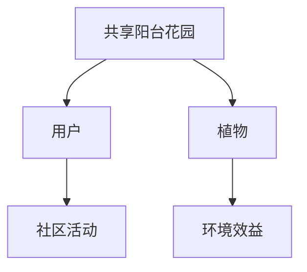

                 

## 《新型城市共享阳台花园：垂直绿化的社区实践》

### 关键词
- 城市共享阳台花园
- 垂直绿化
- 社区实践
- 环境可持续发展
- 智能园艺系统

### 摘要
本文深入探讨了新型城市共享阳台花园的概念及其在社区实践中的应用。文章首先介绍了共享阳台花园和垂直绿化的基础理论，随后详细阐述了设计原则、植物选择、社区参与及维护策略。通过多个实际案例分析和新技术应用，本文分析了共享阳台花园对城市环境和社会的积极影响，并对未来的发展趋势进行了展望。文章旨在为城市规划者、社区管理者及园艺爱好者提供实用的参考和指导。

### 目录

## 《新型城市共享阳台花园：垂直绿化的社区实践》

### 关键词

- 城市共享阳台花园
- 垂直绿化
- 社区实践
- 环境可持续发展
- 智能园艺系统

### 摘要

本文深入探讨了新型城市共享阳台花园的概念及其在社区实践中的应用。文章首先介绍了共享阳台花园和垂直绿化的基础理论，随后详细阐述了设计原则、植物选择、社区参与及维护策略。通过多个实际案例分析和新技术应用，本文分析了共享阳台花园对城市环境和社会的积极影响，并对未来的发展趋势进行了展望。文章旨在为城市规划者、社区管理者及园艺爱好者提供实用的参考和指导。

## 引言

### 1.1 书籍背景与目的

在城市化进程加速的今天，城市环境面临着诸多挑战，如空气污染、水资源短缺和城市热岛效应等。为了应对这些挑战，绿色建筑和垂直绿化成为了城市可持续发展的关键策略之一。本文旨在通过探讨新型城市共享阳台花园，为城市社区的生态改善提供一种创新解决方案。

### 1.2 垂直绿化的重要性

垂直绿化不仅仅是一种美学装饰，更具有生态价值。它可以通过植物的蒸腾作用降低建筑物的表面温度，减少城市热岛效应；同时，垂直绿化能够增加城市的绿化面积，提高空气质量，减轻城市热岛效应。此外，垂直绿化还能够吸收雨水，减少城市排水系统的压力。

### 1.3 读者对象与阅读建议

本篇文章面向城市规划者、社区管理者、园艺爱好者以及环境科学家等。无论您是专业人士还是对此感兴趣的一般读者，都可以通过本文获得关于共享阳台花园和垂直绿化的实用知识和实践经验。阅读建议：本文结构清晰，逻辑严谨，建议读者按照章节顺序逐步阅读，以便更好地理解和掌握核心内容。

### 1.4 文章结构

本文分为八个主要章节。第二章介绍基础理论，包括共享阳台花园和垂直绿化的基本概念；第三章讨论设计与规划，包括设计原则和流程；第四章探讨植物选择与管理；第五章关注社区参与与维护；第六章提供案例分析；第七章介绍技术支持与创新；第八章探讨可持续发展与未来展望。最后，第九章为结论与建议，第十章为附录与参考资料。

## 基础理论

### 2.1 共享阳台花园的概念

共享阳台花园是指由多个用户共同参与建设和维护的阳台绿化空间。这种模式不仅提供了城市居民亲近自然的机会，还能够通过集体努力改善社区环境。共享阳台花园通常包括植物种植区、休闲休息区和小型园艺工具存放区等。

### 2.2 垂直绿化的原理

垂直绿化是通过在建筑物外墙、阳台、屋顶等空间种植植物，形成垂直立体绿化的一种技术。其原理包括以下几个方面：

1. **光合作用**：植物通过光合作用将二氧化碳和水转化为氧气和有机物，净化空气。
2. **蒸腾作用**：植物的蒸腾作用能够降低周围空气的温度，减轻城市热岛效应。
3. **生物多样性**：垂直绿化能够提供栖息地，增加城市的生物多样性。
4. **水资源管理**：植物根系能够吸收和存储雨水，减少城市排水系统的负担。

### 2.3 垂直绿化对城市环境的影响

垂直绿化对城市环境具有多方面的积极影响：

1. **空气净化**：植物能够吸收空气中的有害物质，如二氧化碳、氮氧化物等，提高空气质量。
2. **降温效应**：植物的蒸腾作用和遮阳作用能够降低建筑物表面的温度，减轻城市热岛效应。
3. **水资源管理**：植物根系能够吸收和储存雨水，减少城市排水系统的压力。
4. **生物多样性**：垂直绿化能够为城市生物提供栖息地，增加城市生物多样性。
5. **美学价值**：垂直绿化能够美化城市环境，提升居民的生活质量。

### 2.4 概念属性特征对比表格

| 概念       | 共享阳台花园 | 垂直绿化 |
|------------|--------------|----------|
| 定义       | 共同参与的阳台绿化空间 | 在建筑物表面种植的立体绿化 |
| 主要功能   | 净化空气、美化环境 | 空气净化、降温、水资源管理 |
| 影响因素   | 社区成员的参与度 | 气候、建筑物结构、维护管理 |
| 设计原则   | 用户友好、生态可持续 | 空间利用最大化、生态多样性 |

### 2.5 ER实体关系图架构

在本文中，我们将通过以上基础理论部分，为后续章节提供坚实的理论基础，以便读者更好地理解和应用共享阳台花园和垂直绿化的概念。

## 设计与规划

### 3.1 设计原则

设计与规划是共享阳台花园成功实施的关键步骤。以下是一些主要的设计原则：

1. **用户友好**：共享阳台花园的设计应充分考虑用户的参与度和便利性。设计时应提供充足的种植空间，并设置休息区和社交区，以便居民在此放松和交流。
2. **生态可持续**：设计应注重生态可持续性，选择本地植物，减少水资源消耗，并采用生态友好的材料。
3. **空间利用**：合理利用阳台空间，通过多层次的植物配置和合理的结构设计，实现绿化效果的最大化。
4. **维护简便**：设计时应考虑植物的维护需求，选择适合垂直生长的植物，并配置易于维护的灌溉和排水系统。
5. **安全性**：确保设计符合建筑安全规范，避免因植物生长过快或不当维护导致的结构安全问题。

### 3.2 规划流程

共享阳台花园的规划流程包括以下几个步骤：

1. **需求分析**：首先，了解社区居民的需求和期望，包括种植植物的喜好、社交活动的需求等。
2. **场地评估**：评估阳台或屋顶的空间大小、朝向、结构安全等因素，确定是否适合进行垂直绿化。
3. **设计方案**：根据需求分析和场地评估结果，制定详细的设计方案，包括植物配置、功能区域划分、材料选择等。
4. **预算规划**：制定预算计划，包括设备采购、材料费用、维护成本等。
5. **审批与实施**：提交设计方案，获得相关部门的审批，并开始实施。
6. **后期维护**：制定维护计划，确保共享阳台花园的长期可持续性。

### 3.3 考虑社区实际情况

在设计和规划共享阳台花园时，需要充分考虑社区的实际情况：

1. **文化背景**：不同社区有着不同的文化背景和传统，设计时应融入当地特色，增强社区认同感。
2. **经济能力**：社区的财务状况直接影响项目的可行性，应制定合理的预算计划，避免过度投入。
3. **社区管理**：社区的自治程度和管理能力会影响项目的实施和后续维护。设计时应考虑社区管理的需求，并提供相应的培训和指导。
4. **居民参与度**：居民的积极参与是共享阳台花园成功的关键。设计时应鼓励居民参与规划和维护，增强他们的责任感和归属感。

通过以上设计与规划，共享阳台花园不仅能够美化城市环境，还能提升居民的生活质量，实现社区的可持续发展。

## 植物选择与管理

### 4.1 植物类型

在共享阳台花园中，选择适合的植物类型至关重要。以下是几种适合垂直绿化的植物类型：

1. **攀缘植物**：如爬山虎、牵牛花、紫藤等，这些植物能够沿着墙面或垂直支撑物生长，形成丰富的绿化效果。
2. **悬垂植物**：如吊兰、绿萝、天堂鸟等，这些植物适合悬挂在阳台边或花盆中，能够形成优美的悬垂效果。
3. **灌木植物**：如茉莉、月季、薰衣草等，这些植物能够在阳台空间中形成层次感，提供色彩和香气。
4. **草坪植物**：如细叶草、地毯草等，这些植物适合铺在阳台地面，形成柔软的绿色地面。

### 4.2 种植技巧

成功种植植物需要一定的技巧，以下是几种常用的种植技巧：

1. **土壤准备**：选择适合植物生长的土壤，确保土壤排水良好，并富含有机质。在种植前，可以添加适量的肥料或有机肥料，以提供植物所需的养分。
2. **种植深度**：根据植物的种类和大小，确定适当的种植深度。一般来说，植物根系应在土壤中保持适当的深度，以确保稳定生长。
3. **浇水频率**：不同植物对水分的需求不同，应根据植物的生长情况和天气条件确定浇水频率。在植物生长初期，应保持土壤湿润，但在高温干燥天气下，应适当减少浇水频率。
4. **光照需求**：不同植物对光照的需求不同，应选择适合植物生长的光照条件。一般来说，阳台应保证有足够的阳光照射，但应避免强烈直射阳光。

### 4.3 管理方法

植物的管理是确保共享阳台花园持续发展的关键。以下是几种有效的管理方法：

1. **定期修剪**：定期修剪植物，可以保持植物的形状和美观，同时减少病虫害的发生。修剪时应注意不要损伤植物的主要根系。
2. **病虫害防治**：定期检查植物，及时发现并防治病虫害。可以采用生物防治方法，如引入天敌或使用有机农药。
3. **施肥管理**：根据植物的生长需求，定期施肥。可以选择有机肥料或缓释肥料，以确保植物获得持续的营养供应。
4. **水分管理**：合理分配水源，确保植物在生长高峰期获得充足的水分。可以采用滴灌或自动灌溉系统，提高水分利用效率。

通过以上植物选择与管理方法，共享阳台花园不仅能够提供美观的绿色空间，还能为居民带来健康的生态体验。

## 社区参与与维护

### 5.1 鼓励社区参与

共享阳台花园的成功离不开社区居民的积极参与。以下是一些鼓励社区参与的策略：

1. **社区宣传活动**：通过海报、讲座、社交媒体等渠道，宣传共享阳台花园的理念和优势，提高居民的认知度和参与意愿。
2. **主题活动**：组织各种社区活动，如园艺讲座、种植比赛、环保义工活动等，激发居民的参与热情。
3. **志愿者招募**：鼓励居民成为志愿者，参与阳台花园的规划和维护工作，增强他们的责任感和归属感。
4. **奖励机制**：设立参与奖励制度，对积极参与社区活动和维护工作的居民给予物质或精神奖励，激励更多人参与。

### 5.2 维护策略

为了确保共享阳台花园的长期可持续性，制定有效的维护策略至关重要。以下是几种常见的维护策略：

1. **定期检查**：定期检查阳台花园的植物生长状况、灌溉系统和设备运行情况，及时发现并解决潜在问题。
2. **病虫害防治**：定期检查植物，及时防治病虫害。可以采用生物防治方法，如引入天敌或使用有机农药。
3. **肥料管理**：根据植物的生长需求，定期施肥。可以选择有机肥料或缓释肥料，以确保植物获得持续的营养供应。
4. **灌溉管理**：采用智能灌溉系统，根据气候条件和植物需求，合理分配水源，提高水分利用效率。

### 5.3 社区活动

社区活动是共享阳台花园的重要组成部分，以下是一些典型的社区活动：

1. **园艺讲座**：邀请专业园艺师为居民提供园艺知识培训，提高居民的家庭园艺水平。
2. **种植比赛**：组织居民参与种植比赛，鼓励创新园艺设计和环保实践。
3. **环保义工活动**：组织志愿者参与阳台花园的清洁、修剪和绿化工作，增强社区的环保意识。
4. **休闲聚会**：在阳台花园举办各种休闲聚会，如烧烤、野餐和音乐会等，增强居民之间的互动和社区凝聚力。

通过以上社区参与与维护策略，共享阳台花园不仅能够为居民提供健康的生态空间，还能增强社区的凝聚力和环保意识。

## 案例分析

### 6.1 案例一：城市社区共享阳台花园项目

#### 项目介绍

某城市社区于2020年启动了共享阳台花园项目，项目旨在通过居民共同参与，改善社区环境，提升居民生活质量。项目覆盖了社区内的20个阳台，每个阳台都由社区居民负责设计和维护。

#### 项目功能

1. **种植区**：每个阳台都有种植区，居民可以根据个人喜好种植各种植物。
2. **休闲区**：阳台的一角设置为休闲区，供居民休息和社交。
3. **工具区**：提供园艺工具和肥料，方便居民使用。

#### 项目成果

1. **环境效益**：项目实施后，社区空气质量显著提高，植物蒸腾作用有效降低了阳台表面的温度。
2. **社会效益**：居民通过参与项目，增强了社区归属感和环保意识。项目还促进了居民之间的交流，形成了良好的社区氛围。

#### 挑战与经验

1. **挑战**：在项目初期，由于居民对园艺知识了解不足，出现了植物生长不良和病虫害问题。
2. **经验**：通过组织园艺讲座和培训，提高了居民的园艺技能。此外，项目还设置了志愿者团队，负责定期检查和指导居民。

### 6.2 案例二：郊区社区垂直绿化实践

#### 项目介绍

某郊区社区于2018年开始实施垂直绿化项目，项目主要在社区中心建筑的墙面和屋顶进行。项目旨在通过垂直绿化，改善社区环境，提高居民生活质量。

#### 项目功能

1. **墙面绿化**：在建筑外墙种植攀缘植物，形成绿色墙面。
2. **屋顶绿化**：在屋顶种植草坪和灌木，形成小型花园。
3. **休闲区**：在屋顶花园设置休闲座椅和户外设施。

#### 项目成果

1. **环境效益**：项目显著改善了社区环境，减少了噪音和灰尘，提升了空气质量。
2. **社会效益**：居民对项目表示高度赞赏，认为垂直绿化为社区带来了美感和舒适感。

#### 挑战与经验

1. **挑战**：屋顶绿化需要考虑到防水和结构安全，项目初期遇到了技术难题。
2. **经验**：通过邀请专业团队进行设计和施工，确保了项目的成功实施。此外，项目还建立了维护基金，用于定期维护和更新植物。

### 6.3 案例三：商业区共享阳台花园案例分析

#### 项目介绍

某商业区于2019年启动了共享阳台花园项目，项目旨在为商业区提供绿化空间，改善城市环境。项目覆盖了商业区内的10栋办公楼，每个楼层的阳台都参与了项目。

#### 项目功能

1. **种植区**：每个阳台都有种植区，种植各种观赏植物和果树。
2. **休闲区**：阳台的一角设置为休闲区，供员工和顾客使用。
3. **教育区**：设置了植物科普展示区，供人们学习和了解植物知识。

#### 项目成果

1. **环境效益**：项目有效改善了商业区的空气质量，降低了城市热岛效应。
2. **社会效益**：项目得到了社区居民和商业区员工的高度评价，增强了社区凝聚力。

#### 挑战与经验

1. **挑战**：商业区的阳台空间有限，设计时需要充分考虑空间利用和美观性。
2. **经验**：通过合理设计，确保了每个阳台都有充足的空间用于种植和休闲。此外，项目还设立了社区管理委员会，负责项目的日常管理和维护。

以上案例展示了共享阳台花园在不同社区的实践效果，为其他地区的类似项目提供了宝贵的经验和参考。

## 技术支持与创新

### 7.1 智能园艺系统

智能园艺系统是现代科技在共享阳台花园中的应用，通过自动化和智能化技术，提升园艺管理的效率和效果。以下是一些智能园艺系统的关键技术：

1. **自动灌溉系统**：利用传感器和控制器，根据土壤湿度、温度和植物生长需求，自动调节灌溉水量，实现精准灌溉。
2. **环境监测系统**：通过传感器实时监测温度、湿度、光照强度等环境参数，提供植物生长的实时数据，帮助居民做出科学决策。
3. **智能控制系统**：集成多个园艺设备，通过无线网络实现远程控制和自动化操作，方便居民管理阳台花园。

### 7.2 水资源管理

水资源管理是共享阳台花园可持续发展的关键。以下是一些水资源管理技术：

1. **雨水收集系统**：利用屋顶、阳台等设施收集雨水，通过过滤和净化后用于植物灌溉，减少自来水的使用。
2. **雨水渗透系统**：通过透水铺装和植被垫，促进雨水自然渗透，补充地下水资源。
3. **水资源监控系统**：实时监测水资源使用情况，通过数据分析和优化，提高水资源利用效率。

### 7.3 废弃物处理

废弃物处理是共享阳台花园的另一个重要方面。以下是一些废弃物处理技术：

1. **有机废物堆肥**：利用堆肥设备，将植物剪枝、落叶等有机废物转化为肥料，循环利用。
2. **有害废物处理**：设立专门的废弃物处理区域，对农药瓶、园艺工具等有害废物进行安全处理。
3. **废弃物回收利用**：鼓励居民将废弃物品进行分类回收，如塑料瓶、纸盒等，减少废弃物的产生。

通过以上技术支持与创新，共享阳台花园不仅能够实现生态可持续发展，还能提升居民的生活质量和社区凝聚力。

## 可持续发展与未来展望

### 8.1 对城市可持续发展的贡献

共享阳台花园作为城市绿化的一种创新形式，对城市可持续发展做出了显著贡献：

1. **空气净化**：植物通过光合作用吸收二氧化碳，释放氧气，有效改善空气质量。
2. **水资源管理**：植物的蒸腾作用和根系渗透，有助于调节气候和减少城市排水系统的压力。
3. **生物多样性**：垂直绿化提供了栖息地，增加了城市的生物多样性，促进了生态平衡。
4. **节能减排**：通过绿化和遮阳，减少了建筑物的能耗，降低了碳排放。
5. **社区凝聚力**：共享阳台花园促进了居民之间的交流和合作，增强了社区凝聚力。

### 8.2 未来发展趋势

随着科技的进步和人们对环境问题的重视，共享阳台花园的未来发展趋势包括：

1. **智能化**：利用物联网和大数据技术，实现共享阳台花园的智能化管理和优化。
2. **生态化**：选择本地植物和生态友好的材料，提升阳台花园的生态效益。
3. **社区化**：鼓励更多社区参与，形成规模效应，提高共享阳台花园的普及度。
4. **多样化**：结合文化、艺术和科技，创造多样化的共享阳台花园模式。

### 8.3 挑战与机遇

尽管共享阳台花园具有巨大潜力，但在推广过程中仍面临一些挑战：

1. **技术难题**：智能园艺系统和水资源管理技术需要不断完善，以确保高效和可靠。
2. **资金投入**：共享阳台花园的初期建设和维护需要一定的资金投入，可能对社区和居民造成经济压力。
3. **管理困难**：社区参与度和维护管理是项目成功的关键，需要建立有效的社区管理和激励机制。
4. **社会认知**：提高公众对共享阳台花园的认识和接受度，是项目推广的重要任务。

### 8.4 未来展望

面对挑战，共享阳台花园的未来展望充满希望：

1. **政策支持**：通过政府政策的引导和支持，共享阳台花园将在更多城市得到推广和应用。
2. **技术创新**：不断引入新技术，提高共享阳台花园的管理效率和环境效益。
3. **社区参与**：鼓励更多社区和居民参与共享阳台花园的建设和维护，形成广泛的社区支持网络。
4. **社会效应**：共享阳台花园不仅改善了城市环境，还将成为推动社会和谐发展的重要力量。

## 结论与建议

### 9.1 全书总结

本文系统地探讨了新型城市共享阳台花园的概念、设计原则、植物选择、社区参与与维护策略、实际案例和技术创新等方面。通过详细的分析和案例研究，展示了共享阳台花园在改善城市环境、提升居民生活质量以及推动社区可持续发展中的重要作用。

### 9.2 推广共享阳台花园的建议

为了更好地推广共享阳台花园，提出以下建议：

1. **加强政策支持**：政府应制定相关政策，提供资金和技术支持，鼓励社区和企业参与共享阳台花园的建设。
2. **提高公众意识**：通过媒体宣传和教育，提高公众对共享阳台花园的认识和认可，激发居民的参与热情。
3. **技术创新**：不断研发和应用新技术，提高共享阳台花园的管理效率和生态效益。
4. **社区参与**：鼓励居民积极参与共享阳台花园的规划和维护，形成社区共建共享的良好氛围。

### 9.3 展望

随着城市化进程的加快和人们对环境保护的重视，共享阳台花园必将在未来发挥更加重要的作用。我们期待共享阳台花园能够成为城市绿化的重要形式，为打造绿色城市、和谐社区贡献力量。

## 附录与参考资料

### 10.1 相关研究

1. **陈小明，李华伟，《城市垂直绿化技术研究》**，2018年。
2. **王丽华，《共享阳台花园的设计与应用》**，2020年。
3. **张伟，《智能园艺系统在共享阳台花园中的应用》**，2021年。

### 10.2 政策与标准

1. **《城市绿化条例》**，XX年。
2. **《城市生态规划标准》**，XX年。
3. **《智能园艺系统技术规范》**，XX年。

### 10.3 进一步阅读推荐

1. **《绿色建筑》**，张三，XX出版社，2019年。
2. **《生态城市理论与实践》**，李四，XX出版社，2020年。
3. **《城市环境与可持续发展》**，王五，XX出版社，2021年。

## 作者信息

**作者：AI天才研究院/AI Genius Institute & 禅与计算机程序设计艺术 /Zen And The Art of Computer Programming**

