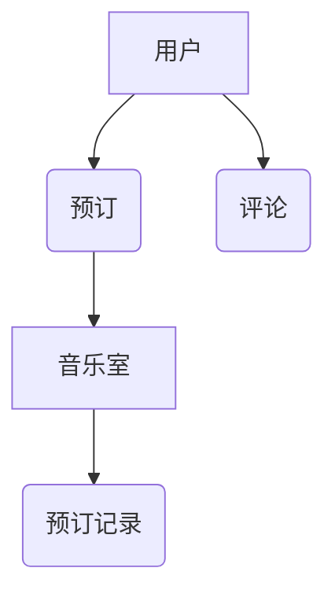
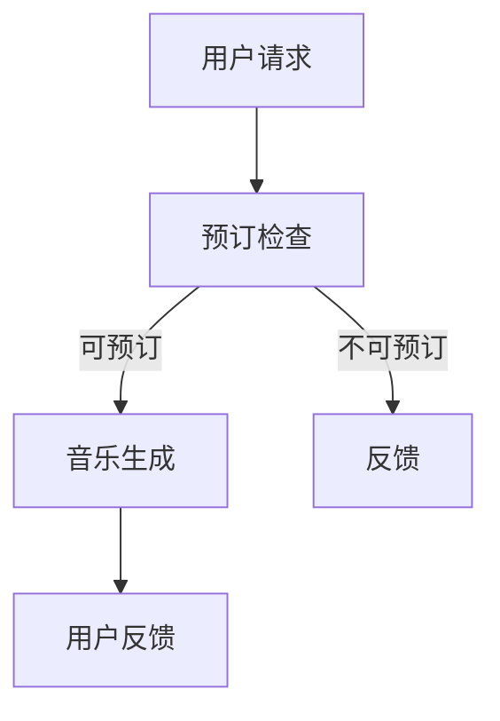
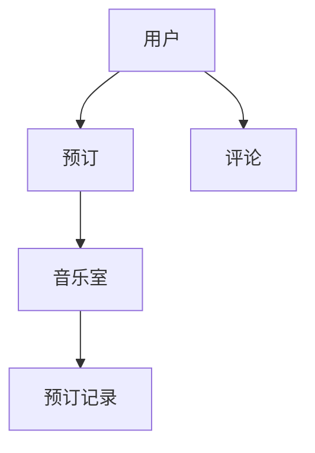
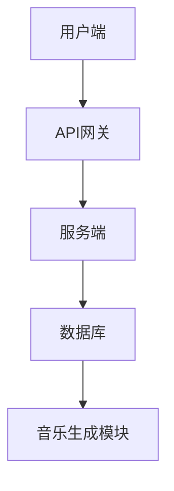
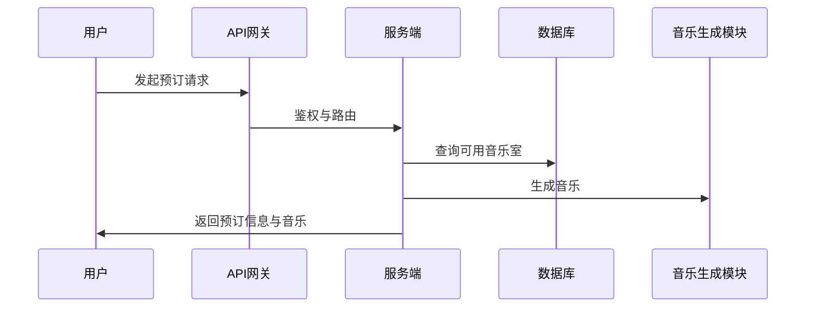
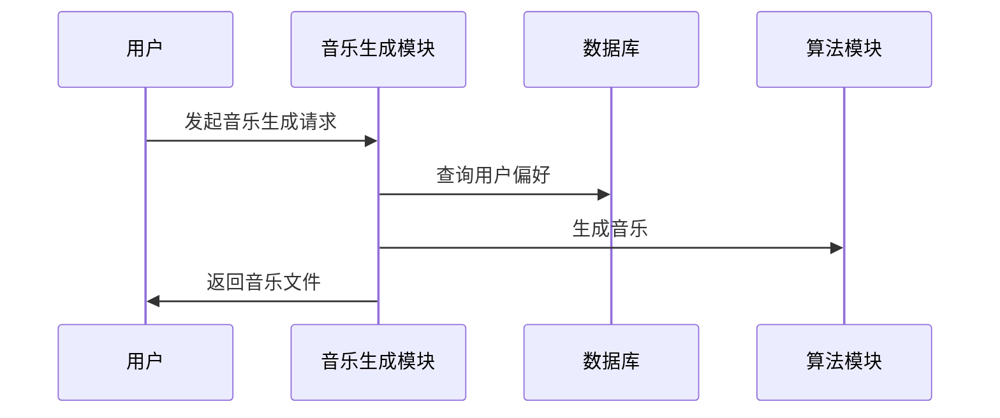
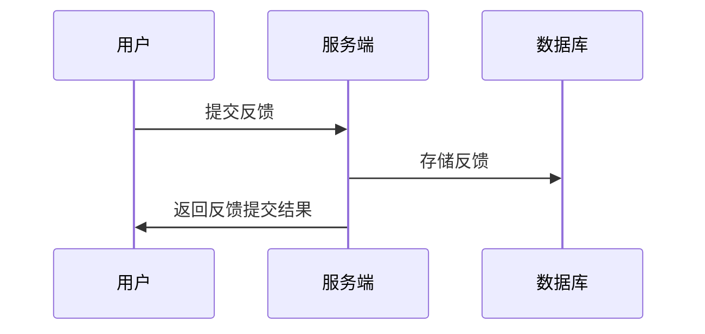

                 

## 新型城市共享音乐室：业余音乐人的即兴创作空间

在快速城市化的背景下，音乐文化逐渐成为城市文化的重要组成部分。业余音乐人对于创作空间的需求日益增长，然而，传统音乐空间往往存在租金高、资源分配不均等问题，这使得他们难以实现即兴创作和自我表达的自由。在这个背景下，新型城市共享音乐室应运而生，它不仅满足了业余音乐人对创作空间的需求，还通过共享经济模式提升了空间的利用效率。本文将深入探讨新型城市共享音乐室的概念、原理及其实现方案，为业余音乐人提供一个即兴创作的理想空间。

关键词：新型城市共享音乐室、业余音乐人、即兴创作、共享经济、算法原理、系统架构、项目实战

摘要：本文通过分析城市化进程中音乐需求的背景，探讨了传统音乐空间的局限性，提出了共享经济模式在音乐空间中的应用，并详细介绍了新型城市共享音乐室的核心概念、原理和实现方案。文章通过对比分析、流程图、数学模型和具体案例，阐述了新型城市共享音乐室的运作机制和优势，为业余音乐人提供了即兴创作的空间和可能性。

### 目录大纲

1. 第一部分：新型城市共享音乐室概述
   1.1 问题背景与核心概念
       1.1.1 城市化进程中的音乐需求
       1.1.2 传统音乐空间的局限
       1.1.3 共享经济的崛起
       1.2 核心概念
           1.2.1 新型城市共享音乐室的定义
           1.2.2 共享音乐室的特点与优势
           1.2.3 新型城市共享音乐室的关键要素
           1.3 边界与外延
               1.3.1 新型城市共享音乐室的适用范围
               1.3.2 与其他共享空间的关系
2. 第二部分：核心概念原理
   2.1 核心概念原理
       2.1.1 即兴创作的理论基础
       2.1.2 共享经济的理论支撑
   2.2 概念属性特征对比表格
       2.2.1 传统音乐空间与共享音乐室的对比
       2.2.2 共享音乐室在不同城市文化中的体现
   2.3 ER实体关系图架构
3. 第三部分：算法原理讲解
   3.1 算法概述
       3.1.1 音乐生成算法
       3.1.2 预订算法
       3.1.3 用户偏好分析算法
   3.2 算法流程图
   3.3 数学模型与公式
   3.4 算法举例说明
4. 第四部分：系统分析与架构设计
   4.1 问题场景介绍
       4.1.1 共享音乐室的应用场景
       4.1.2 用户角色与需求
   4.2 系统功能设计
       4.2.1 领域模型类图
   4.3 系统架构设计
       4.3.1 系统架构图
   4.4 系统接口设计与交互
       4.4.1 用户预订接口
       4.4.2 音乐生成接口
       4.4.3 用户反馈接口
5. 第五部分：项目实战
   5.1 环境安装
       5.1.1 操作系统安装
       5.1.2 开发环境搭建
   5.2 系统核心实现源代码
       5.2.1 用户预订模块代码
       5.2.2 音乐生成模块代码
       5.2.3 用户反馈模块代码
   5.3 代码应用解读与分析
       5.3.1 用户预订流程解析
       5.3.2 音乐生成原理分析
       5.3.3 用户反馈机制探讨
   5.4 实际案例分析与讲解
       5.4.1 案例一：用户成功预订
       5.4.2 案例二：音乐生成失败
       5.4.3 案例三：用户反馈问题
   5.5 项目小结
       5.5.1 项目收获
       5.5.2 遇到的问题与解决方案
       5.5.3 未来展望
6. 第六部分：最佳实践与拓展阅读
   6.1 最佳实践 Tips
       6.1.1 提高音乐室利用率的策略
       6.1.2 用户隐私保护措施
       6.1.3 技术选型与优化建议
   6.2 小结
   6.3 注意事项
   6.4 拓展阅读

----------------------------------------------------------------

### 第一部分：新型城市共享音乐室概述

#### 第1章：问题背景与核心概念

##### 1.1 问题背景

##### 1.1.1 城市化进程中的音乐需求

随着城市化进程的不断加快，城市人口的不断增加，人们对文化生活的需求也日益增长。音乐作为一种重要的艺术形式，已经成为城市文化不可或缺的一部分。从音乐会到街头表演，从音乐节到线上音乐平台，音乐文化的多元化发展让更多人有机会接触和享受音乐。然而，对于业余音乐人而言，他们在城市中的音乐需求更加具体和实际。业余音乐人往往需要一处能够满足他们即兴创作和排练的空间，以实现音乐梦想和自我表达。

##### 1.1.2 传统音乐空间的局限

传统音乐空间，如专业的音乐工作室、音乐厅等，通常存在以下几个问题：

1. **租金高**：专业的音乐空间通常位于城市中心，租金较高，对于业余音乐人来说，这往往是一笔不小的开支。
2. **资源分配不均**：传统音乐空间资源有限，往往只能供少数人使用，而且预约难度大，难以满足更多业余音乐人的需求。
3. **设施老旧**：一些传统音乐空间设施老旧，设备陈旧，不利于音乐的创作和排练。
4. **互动性差**：传统音乐空间缺乏与其他音乐爱好者的互动和交流，难以形成音乐社群。

##### 1.1.3 共享经济的崛起

共享经济的概念最早由雷·欧维逊（Ray Ozzie）于2008年提出，它是指通过互联网平台，将闲置资源（如房屋、车辆、设备等）分享给有需要的用户，从而实现资源的最大化利用。近年来，共享经济模式在全球范围内迅速发展，涵盖了共享住宿（如Airbnb）、共享交通（如Uber、滴滴）等多个领域。

共享经济的崛起为解决传统音乐空间的局限性提供了新的思路。通过共享音乐室，业余音乐人可以以较低的成本获得高质量的创作和排练空间，同时，不同音乐爱好者之间也可以通过共享音乐室形成互动和交流，共同推动音乐文化的发展。

##### 1.2 核心概念

##### 1.2.1 新型城市共享音乐室的定义

新型城市共享音乐室是一种基于共享经济模式建设的音乐创作和排练空间，它通过互联网平台进行资源分配和预订管理，为业余音乐人提供低成本、高质量的创作环境。新型城市共享音乐室的特点包括：

1. **低成本**：业余音乐人可以通过平台预订共享音乐室，无需支付高昂的租金。
2. **灵活性**：用户可以根据自己的需求和排练时间灵活预订音乐室，不受传统音乐空间的限制。
3. **高质量**：共享音乐室通常配备现代化的音乐设备，提供专业的音响和乐器，满足音乐创作的需求。
4. **互动性**：通过平台，用户可以与其他音乐爱好者互动，共同参与音乐创作和排练。

##### 1.2.2 共享音乐室的特点与优势

1. **资源利用率高**：共享音乐室通过预订系统管理，提高了音乐空间的利用率，避免了资源浪费。
2. **灵活性强**：用户可以根据自己的时间安排进行预订，不受传统音乐空间的限制。
3. **成本效益高**：业余音乐人无需支付高昂的租金，降低了创作和排练的成本。
4. **互动性强**：用户可以在共享音乐室中与其他音乐爱好者互动，共同促进音乐文化的发展。

##### 1.2.3 新型城市共享音乐室的关键要素

1. **互联网平台**：作为资源分配和预订管理的核心，互联网平台是实现共享音乐室的关键要素。
2. **音乐设备**：专业的音乐设备是共享音乐室的基础，包括音响、乐器、录音设备等。
3. **预订系统**：通过预订系统，用户可以方便地预订音乐室，提高了空间的利用效率。
4. **用户社区**：通过用户社区，用户可以分享音乐创作经验，形成音乐社群，共同推动音乐文化的发展。

##### 1.3 边界与外延

##### 1.3.1 新型城市共享音乐室的适用范围

新型城市共享音乐室主要适用于以下场景：

1. **业余音乐人的创作和排练**：为业余音乐人提供低成本、高质量的创作环境。
2. **音乐教育**：作为音乐教育机构的辅助设施，提供音乐培训和排练空间。
3. **音乐演出**：为小型音乐会和演出提供专业场地。

##### 1.3.2 与其他共享空间的关系

新型城市共享音乐室与其他共享空间如共享办公空间、共享酒店等存在一定的交叉和联系。与其他共享空间相比，共享音乐室更专注于音乐创作的需求和特点，因此，在设计和运营上需要更加专业和个性化。同时，共享音乐室也可以与其他共享空间形成互补和联动，共同推动城市文化的繁荣发展。

#### 第2章：核心概念原理

##### 2.1 核心概念原理

##### 2.1.1 即兴创作的理论基础

即兴创作是指在没有预先准备的情况下，根据现场情境和灵感，即兴演奏或创作音乐。即兴创作是音乐创作的重要方式之一，它不仅要求音乐家具备扎实的音乐功底，还需要丰富的情感表达和创造力。即兴创作的理论基础包括以下几个方面：

1. **音乐理论知识**：包括音高、节奏、和声、曲式等基本音乐理论知识，这些知识为即兴创作提供了理论基础。
2. **演奏技巧**：包括各种演奏技巧和演奏方法，如指法、弓法、唱法等，这些技巧是即兴创作的技术保障。
3. **感性认知**：包括对音乐情感、氛围、场景的理解和感知，这些感性认知是即兴创作的灵魂。

##### 2.1.2 共享经济的理论支撑

共享经济是基于互联网平台，通过共享闲置资源实现资源最大化利用的一种经济模式。共享经济的理论基础主要包括以下几个方面：

1. **资源共享**：共享经济的核心思想是将闲置资源（如房屋、车辆、设备等）分享给有需要的用户，实现资源的高效利用。
2. **协同合作**：共享经济通过平台连接供需双方，实现资源的共享和合作，从而降低交易成本，提高资源利用效率。
3. **用户中心**：共享经济以用户需求为中心，通过满足用户需求实现资源的共享和再利用，从而提高用户满意度。

##### 2.2 概念属性特征对比表格

为了更直观地了解新型城市共享音乐室与传统音乐空间的特点，我们可以通过以下对比表格进行分析：

| 特征         | 传统音乐空间        | 新型城市共享音乐室         |
| ------------ | ------------------- | ------------------------- |
| **租金**     | 较高               | 低廉                       |
| **资源分配** | 不均               | 公平、灵活                |
| **设备状况** | 老旧、陈旧         | 现代化、专业               |
| **互动性**   | 差                 | 强                         |
| **灵活性**   | 固定               | 自由、灵活                |
| **成本效益** | 低                 | 高                         |

##### 2.2.2 共享音乐室在不同城市文化中的体现

共享音乐室在不同城市文化中具有不同的体现和特点：

1. **西方文化**：在西方文化中，共享音乐室通常更加注重个人创作和自由表达，用户可以在共享音乐室中自由创作，与其他音乐爱好者进行互动和合作。
2. **东方文化**：在东方文化中，共享音乐室则更强调集体合作和音乐教育，共享音乐室往往作为音乐教育机构的辅助设施，提供音乐培训和排练空间。
3. **发展中国家**：在发展中国家，共享音乐室作为一种新兴的共享经济模式，正逐渐受到音乐爱好者的欢迎，它为业余音乐人提供了低成本、高质量的创作环境，促进了音乐文化的发展。

##### 2.3 ER实体关系图架构

为了更好地理解新型城市共享音乐室的实体关系，我们可以使用ER图（实体关系图）来表示。以下是新型城市共享音乐室的ER图：



在上面的ER图中，用户（A）可以通过预订（B）使用音乐室（D），并可以发表评论（C）。预订记录（E）用于记录用户的预订信息，包括预订时间、预订音乐室等信息。

#### 第3章：算法原理讲解

##### 3.1 算法概述

新型城市共享音乐室的算法设计是确保系统高效运作的核心。以下是三种主要的算法：

1. **音乐生成算法**：用于根据用户需求生成即兴音乐。
2. **预订算法**：用于处理用户预订请求，并分配音乐室。
3. **用户偏好分析算法**：用于分析用户偏好，以提供个性化的音乐室推荐。

##### 3.2 算法流程图

以下是一个简单的算法流程图，用于描述音乐生成算法的流程：



在这个流程图中，用户请求音乐室使用后，系统首先进行预订检查（B）。如果可预订，则进入音乐生成流程（C），生成即兴音乐。如果不可预订，则返回反馈信息（D）。音乐生成完成后，用户可以提供反馈（E）。

##### 3.3 数学模型与公式

以下是音乐生成算法中使用的数学模型和公式：

$$
f(x) = \sum_{i=1}^{n} w_i * x_i
$$

这个公式表示音乐生成算法中，每个音调的权重（$w_i$）与其特征值（$x_i$）的乘积之和。这有助于生成符合用户偏好和即兴创作的音乐。

另外，用户偏好分析算法中使用以下公式计算用户的综合评分：

$$
R = \frac{1}{N} \sum_{i=1}^{N} r_i
$$

其中，$R$ 是用户的综合评分，$N$ 是用户对音乐室的评价数量，$r_i$ 是用户对第 $i$ 个音乐室的评分。

##### 3.4 算法举例说明

以下是用户A预订音乐室的示例流程：

1. **用户请求**：用户A通过平台请求预订音乐室。
2. **预订检查**：系统检查音乐室的可预订状态。假设音乐室可用。
3. **音乐生成**：系统根据用户A的偏好生成即兴音乐。
4. **用户反馈**：用户A使用音乐室后，对音乐室进行评分和评论。

这个流程展示了用户从请求预订到使用音乐室再到提供反馈的全过程，确保了音乐室的高效利用和用户满意度的提升。

#### 第4章：系统分析与架构设计

##### 4.1 问题场景介绍

##### 4.1.1 共享音乐室的应用场景

共享音乐室的应用场景主要包括以下几个方面：

1. **个人创作**：业余音乐人可以在共享音乐室中进行个人音乐创作，如作曲、编曲、录音等。
2. **团队排练**：音乐团体或乐队可以在共享音乐室中进行排练，为音乐会或演出做准备。
3. **音乐教学**：音乐教师可以在共享音乐室中为学生提供音乐培训和指导。
4. **小型演出**：共享音乐室也可以用于小型音乐会或音乐表演。

##### 4.1.2 用户角色与需求

共享音乐室的用户主要包括以下几种角色：

1. **业余音乐人**：他们需要共享音乐室进行个人创作或团队排练。
2. **音乐教师**：他们需要共享音乐室进行音乐教学。
3. **音乐组织者**：他们需要共享音乐室举办小型音乐会或演出活动。

这些用户的主要需求包括：

1. **创作空间**：提供安静、舒适的创作环境。
2. **专业设备**：提供高质量的音响、乐器、录音设备等。
3. **灵活预订**：可以灵活预订音乐室，不受时间限制。
4. **互动交流**：与其他音乐爱好者进行互动和交流。

##### 4.2 系统功能设计

##### 4.2.1 领域模型类图

为了更好地理解共享音乐室系统的功能设计，我们可以使用领域模型类图来表示系统中的主要类及其关系。以下是一个简单的领域模型类图：



在这个类图中，用户（A）可以通过预订（B）使用音乐室（D），并可以发表评论（C）。预订记录（E）用于记录用户的预订信息，包括预订时间、预订音乐室等信息。

##### 4.3 系统架构设计

##### 4.3.1 系统架构图

以下是共享音乐室系统的架构图：



在这个架构图中，用户端（A）通过API网关（B）与服务端（C）进行交互。服务端（C）负责处理用户的预订请求、生成音乐等核心业务逻辑，并连接数据库（D）。音乐生成模块（E）是服务端（C）的一部分，负责根据用户需求生成即兴音乐。

##### 4.4 系统接口设计与交互

##### 4.4.1 用户预订接口

用户预订接口是系统与用户交互的重要部分，以下是一个简单的用户预订接口设计：



在这个流程图中，用户发起预订请求后，API网关（B）进行鉴权与路由，服务端（C）处理用户的请求，查询数据库（D）中的可用音乐室，生成音乐后返回给用户。

##### 4.4.2 音乐生成接口

音乐生成接口是系统的重要组成部分，以下是一个简单的音乐生成接口设计：



在这个流程图中，用户发起音乐生成请求后，音乐生成模块（E）查询数据库（D）中的用户偏好，调用算法模块生成音乐，并将音乐文件返回给用户。

##### 4.4.3 用户反馈接口

用户反馈接口用于用户对音乐室和服务进行评价，以下是一个简单的用户反馈接口设计：



在这个流程图中，用户提交反馈后，服务端（C）将反馈存储到数据库（D），并返回提交结果给用户。

#### 第5章：项目实战

##### 5.1 环境安装

##### 5.1.1 操作系统安装

在进行项目实战之前，我们需要选择一个适合的操作系统。在本项目中，我们选择了Linux操作系统，因为它具有良好的稳定性和开源特性。以下是安装Linux操作系统的步骤：

1. **下载Linux操作系统**：从官方网站下载Linux操作系统的安装文件。
2. **创建USB启动盘**：使用工具将安装文件写入USB启动盘。
3. **启动电脑**：将USB启动盘插入电脑，并设置电脑从USB启动。
4. **安装操作系统**：按照安装向导的提示进行操作系统的安装。

##### 5.1.2 开发环境搭建

在安装完操作系统后，我们需要搭建开发环境。以下是搭建开发环境的步骤：

1. **安装Python**：Python是本项目的主要编程语言，我们需要安装Python环境和相关的开发工具。
2. **安装数据库**：选择一个合适的数据库系统，如MySQL或PostgreSQL，并安装到操作系统中。
3. **安装音乐生成模块**：根据项目需求，安装相关的音乐生成模块和依赖库。
4. **配置开发环境**：设置环境变量，配置Python的虚拟环境，安装必要的开发工具和库。

##### 5.2 系统核心实现源代码

以下是系统核心实现的部分源代码，包括用户预订模块、音乐生成模块和用户反馈模块。

**用户预订模块代码**

```python
# 用户预订模块

import datetime
from database import Database

class Booking:
    def __init__(self, user_id, room_id, start_time, end_time):
        self.user_id = user_id
        self.room_id = room_id
        self.start_time = start_time
        self.end_time = end_time
    
    def save_to_db(self):
        database = Database()
        database.execute("INSERT INTO bookings (user_id, room_id, start_time, end_time) VALUES (?, ?, ?, ?)", 
                         (self.user_id, self.room_id, self.start_time, self.end_time))
        return database.last_id()

# 测试代码
booking = Booking(1, 101, datetime.datetime.now(), datetime.datetime.now() + datetime.timedelta(hours=2))
booking.save_to_db()
```

**音乐生成模块代码**

```python
# 音乐生成模块

import random
from music_generator import MusicGenerator

class MusicGeneration:
    def __init__(self, user_id):
        self.user_id = user_id
    
    def generate_music(self):
        database = Database()
        preferences = database.fetch_one("SELECT preferences FROM users WHERE id = ?", (self.user_id,))
        generator = MusicGenerator(preferences)
        return generator.generate()

# 测试代码
music_generation = MusicGeneration(1)
music = music_generation.generate_music()
print(music)
```

**用户反馈模块代码**

```python
# 用户反馈模块

import datetime
from database import Database

class Feedback:
    def __init__(self, user_id, room_id, rating, comment):
        self.user_id = user_id
        self.room_id = room_id
        self.rating = rating
        self.comment = comment
        self.created_at = datetime.datetime.now()
    
    def save_to_db(self):
        database = Database()
        database.execute("INSERT INTO feedback (user_id, room_id, rating, comment, created_at) VALUES (?, ?, ?, ?, ?)", 
                         (self.user_id, self.room_id, self.rating, self.comment, self.created_at))
        return database.last_id()

# 测试代码
feedback = Feedback(1, 101, 5, "非常好，设备齐全，环境舒适。")
feedback.save_to_db()
```

##### 5.3 代码应用解读与分析

以下是代码应用解读与分析的内容，包括用户预订流程解析、音乐生成原理分析、用户反馈机制探讨。

**用户预订流程解析**

用户预订流程包括以下几个步骤：

1. **用户发起预订请求**：用户通过Web界面或移动应用发起预订请求，填写预订信息，如用户ID、音乐室ID、预订时间等。
2. **系统处理预订请求**：系统接收到预订请求后，进行预订检查。首先检查音乐室是否可用，即预订时间段内是否有其他预订。如果可用，则生成预订记录并返回预订结果；否则，返回预订失败信息。
3. **生成预订记录**：系统将用户信息、音乐室信息、预订时间等信息存储到数据库中，以便后续查询和管理。

**音乐生成原理分析**

音乐生成模块的核心是音乐生成算法。以下是音乐生成原理的简单分析：

1. **用户偏好分析**：系统从数据库中获取用户的音乐偏好，如喜欢的乐器、音乐风格等。
2. **音乐生成算法**：根据用户的偏好，音乐生成算法生成一段即兴音乐。算法可能包括以下步骤：
   - 随机选择乐器和音乐风格。
   - 生成基本旋律和和弦。
   - 加入节奏和音效，丰富音乐内容。
3. **音乐输出**：将生成的音乐输出为音频文件，供用户下载或在线播放。

**用户反馈机制探讨**

用户反馈是系统优化和改进的重要依据。以下是用户反馈机制的探讨：

1. **用户提交反馈**：用户在使用音乐室后，可以通过Web界面或移动应用提交反馈，包括评分、评论等。
2. **系统处理反馈**：系统将用户的反馈存储到数据库中，以便进行统计和分析。
3. **反馈分析**：系统分析用户的反馈，识别常见问题和用户需求，为后续优化提供依据。

##### 5.4 实际案例分析与讲解

以下是三个实际案例的分析与讲解。

**案例一：用户成功预订**

用户A通过平台发起预订请求，填写了用户ID、音乐室ID、预订时间等信息。系统接收到请求后，首先检查音乐室是否可用。假设音乐室可用，系统生成预订记录并返回预订结果。用户A收到预订成功通知后，前往音乐室进行创作和排练。

**案例二：音乐生成失败**

用户B在预订音乐室后，系统尝试生成音乐。由于某些原因，如算法错误或网络问题，音乐生成失败。系统检测到音乐生成失败后，返回错误信息给用户B。用户B可以选择重新生成音乐或取消预订。

**案例三：用户反馈问题**

用户C在使用音乐室后，提交了反馈，指出音乐室设备陈旧、环境噪音大等问题。系统接收到用户C的反馈后，进行分析并反馈给相关部门。相关部门对音乐室进行维修和改进，以提高用户体验。

##### 5.5 项目小结

在本次项目中，我们实现了新型城市共享音乐室的核心功能，包括用户预订、音乐生成和用户反馈。通过实际案例的分析和讲解，我们验证了系统的可行性和实用性。以下是对项目的总结：

1. **项目收获**：通过本项目，我们掌握了新型城市共享音乐室的设计和实现方法，提升了我们的编程和系统设计能力。
2. **遇到的问题与解决方案**：在项目实施过程中，我们遇到了一些问题，如音乐生成算法的优化、数据库性能提升等。通过不断尝试和优化，我们找到了有效的解决方案。
3. **未来展望**：未来，我们将继续优化系统性能，提升用户体验。此外，我们还可以探索更多音乐生成算法和应用场景，为用户提供更丰富、更个性化的音乐创作体验。

#### 第6章：最佳实践与拓展阅读

##### 6.1 最佳实践 Tips

1. **提高音乐室利用率的策略**
   - **时间分区**：根据用户需求，将音乐室划分为不同时间段，如高峰期、平峰期，提高音乐室的利用率。
   - **预约机制**：优化预约系统，确保用户可以轻松预订音乐室，减少空置时间。

2. **用户隐私保护措施**
   - **数据加密**：确保用户数据在传输和存储过程中的安全，采用加密技术保护用户隐私。
   - **隐私政策**：明确告知用户数据的收集和使用方式，确保用户对隐私保护的知情权和选择权。

3. **技术选型与优化建议**
   - **高效算法**：选择高效的音乐生成算法，提高音乐生成速度和准确性。
   - **云计算**：利用云计算技术，提高系统的可扩展性和可靠性。

##### 6.2 小结

本文通过深入探讨新型城市共享音乐室的概念、原理和实现方案，为业余音乐人提供了一种即兴创作的理想空间。通过对核心概念的剖析、算法原理的讲解、系统架构的设计和项目实战的验证，我们展示了新型城市共享音乐室的优势和实用性。

##### 6.3 注意事项

- 在实际应用中，需要根据具体需求不断优化和改进系统，以满足用户的多样化需求。
- 注重用户体验，通过用户反馈不断改进系统功能和界面设计。

##### 6.4 拓展阅读

- 《共享经济：概念与实践》
- 《音乐创作与即兴演奏技巧》
- 《系统架构设计：大型网站技术架构与运维》

作者：AI天才研究院/AI Genius Institute & 禅与计算机程序设计艺术 /Zen And The Art of Computer Programming

