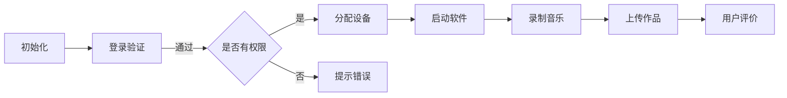
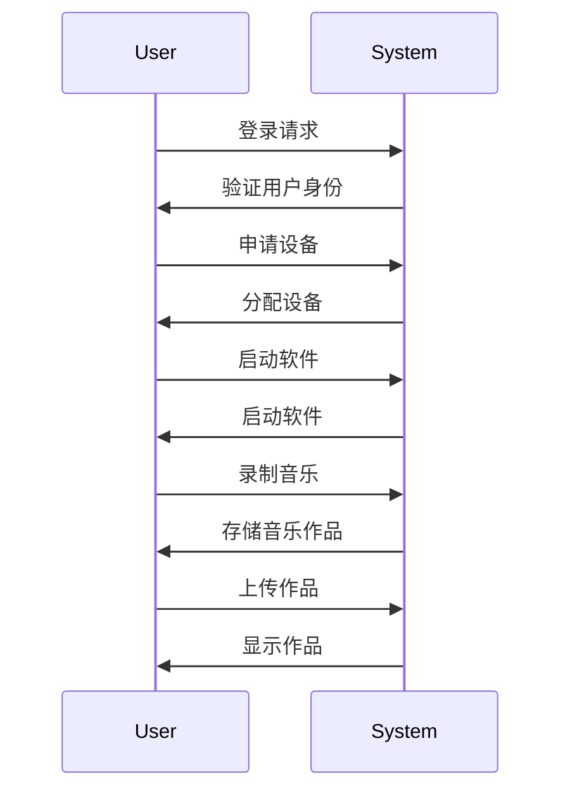

                 


### 引言

新型城市共享音乐工作室作为现代音乐制作领域的一种创新模式，正逐步改变着业余音乐人的创作和制作方式。随着音乐创作和制作技术的不断进步，以及互联网和信息技术的发展，共享音乐工作室应运而生，为业余音乐人提供了一个专业、高效且成本合理的音乐创作和制作平台。

本文旨在探讨新型城市共享音乐工作室的背景、核心概念、设计实现及实际应用，旨在为有意从事音乐制作的专业人士和业余爱好者提供一些建议和参考。文章结构如下：

- **第一部分：背景介绍**：详细阐述共享音乐工作室的概念、起源和发展。
- **第二部分：核心概念与联系**：深入分析共享音乐工作室的核心概念及其相互关系。
- **第三部分：设计与实现**：介绍共享音乐工作室的系统分析、设计实现及项目实战。
- **第四部分：最佳实践与总结**：总结核心要点，提出建议和未来展望。

### 关键词

- 新型城市共享音乐工作室
- 音乐制作平台
- 共享经济
- 系统设计
- 算法实现
- 实际案例分析

### 摘要

本文围绕新型城市共享音乐工作室这一主题，首先介绍了其背景和发展现状，随后分析了核心概念和设计原则，接着详细探讨了系统分析与设计实现过程，并通过实际案例进行了剖析。最后，文章总结了共享音乐工作室的最佳实践，并对未来发展提出了展望。

### 第一部分：背景介绍

#### 1.1 共享音乐工作室的起源与发展

共享音乐工作室的概念源于共享经济的理念，共享经济作为一种新兴的经济模式，强调资源的高效利用和共享。在音乐制作领域，共享音乐工作室应运而生，它不仅提供了硬件设备，还提供了软件工具和专业的制作环境，使得业余音乐人可以更加便捷地创作和制作音乐。

共享音乐工作室的发展可以追溯到20世纪末期，当时，一些音乐制作设备和软件开始逐渐普及，但高昂的价格和复杂的操作门槛使得业余音乐人难以接触到这些工具。为了解决这一问题，一些专业的音乐制作公司和独立音乐制作人开始将他们的设备和工作室对外开放，允许其他业余音乐人租用。

随着互联网和信息技术的发展，共享音乐工作室的概念得到了进一步的完善和普及。如今，通过云计算和在线协作平台，业余音乐人可以远程访问专业的音乐制作软件和设备，大大降低了创作的门槛。此外，社交媒体的兴起也为业余音乐人提供了更广阔的展示和推广平台。

#### 1.2 问题背景

在传统音乐制作模式下，业余音乐人面临诸多挑战。首先，硬件设备成本高昂，专业的音频接口、音频工作站、采样器和乐器等设备价格不菲，这对于许多业余音乐人来说是一个巨大的负担。其次，软件操作复杂，许多专业音乐制作软件界面复杂，学习曲线陡峭，业余音乐人往往难以掌握。此外，创作和制作环境的要求也较高，需要一个安静、专业的录音室和配套的设备。

这些问题导致了业余音乐人在创作和制作过程中面临诸多困难，限制了他们的创作自由度和作品质量。因此，如何降低创作门槛，提高创作效率，成为了音乐制作领域亟待解决的问题。

#### 1.3 问题描述

共享音乐工作室作为一种创新的解决方案，旨在解决业余音乐人在创作和制作过程中面临的难题。具体来说，问题描述如下：

- **硬件设备获取困难**：业余音乐人难以负担高昂的硬件设备成本。
- **软件操作复杂**：业余音乐人难以掌握复杂的音乐制作软件。
- **创作环境要求高**：需要安静、专业的录音室和配套设备，但成本较高。

这些问题限制了业余音乐人的创作自由度和作品质量，影响了他们在音乐制作领域的进一步发展。

#### 1.4 问题解决

共享音乐工作室通过以下方式解决了业余音乐人面临的问题：

- **降低硬件设备成本**：提供性价比高的硬件设备，甚至免费租借，降低了业余音乐人的负担。
- **简化软件操作**：提供用户友好的音乐制作软件，降低学习门槛，使得业余音乐人更容易上手。
- **提供专业的创作环境**：提供专业的录音室和配套设备，确保创作质量，同时降低使用成本。

通过这些措施，共享音乐工作室为业余音乐人提供了一个高效、低成本、专业的音乐创作和制作平台，大大提高了他们的创作自由度和作品质量。

#### 1.5 边界与外延

共享音乐工作室的边界主要涉及以下几个方面：

- **服务范围**：共享音乐工作室提供的服务包括硬件设备租赁、软件使用、录音室租赁等。
- **用户群体**：主要针对业余音乐人，包括音乐爱好者、独立音乐制作人等。
- **技术支持**：提供专业的技术支持和培训，帮助用户更好地使用设备和软件。

共享音乐工作室的外延包括以下几个方面：

- **合作模式**：与其他音乐制作公司、独立音乐制作人、音乐教育机构等合作，共同推广音乐制作技术和分享经验。
- **市场推广**：通过社交媒体、网络平台等渠道进行宣传，扩大品牌知名度和用户基础。
- **技术创新**：不断引入新技术，提高设备性能和软件功能，提升用户体验。

### 第二部分：核心概念与联系

#### 2.1 核心概念原理

在共享音乐工作室中，核心概念包括共享经济、音乐制作技术、用户交互等。

- **共享经济**：共享经济是指通过互联网平台将闲置资源进行共享，以实现资源的高效利用。在共享音乐工作室中，共享经济的核心在于硬件设备、软件资源和创作环境的共享。
- **音乐制作技术**：音乐制作技术包括音频处理技术、编曲技术、录音技术等。这些技术是实现高质量音乐制作的关键。
- **用户交互**：用户交互是指用户与共享音乐工作室之间的互动。良好的用户交互设计可以提高用户的使用体验和满意度。

#### 2.2 概念属性特征对比

下表展示了共享经济、音乐制作技术和用户交互的核心属性特征：

| 概念        | 属性特征                                                     |
| ----------- | ------------------------------------------------------------ |
| 共享经济    | 资源共享、高效利用、降低成本、增加收益                        |
| 音乐制作技术 | 音频处理、编曲、录音、混音等                                |
| 用户交互    | 用户体验、互动性、反馈机制、个性化服务                        |

#### 2.3 ER实体关系图

为了更好地理解共享音乐工作室中的核心概念及其相互关系，我们使用Mermaid绘制了ER实体关系图，如下所示：

```mermaid
erDiagram
  User ..|> Studio : "uses"
  Studio ..|> Equipment : "has"
  Studio ..|> Software : "uses"
  Studio ..|> UserFeedback : "receives"
  Equipment ..|> Type : "is_a"
  Software ..|> Type : "is_a"
  UserFeedback ..|> Feedback : "contains"
```

该ER实体关系图显示了用户、工作室、设备、软件和反馈之间的关系。用户使用工作室，工作室拥有设备和软件，同时用户也会提供反馈，反馈中包含了对设备和软件的评价。

### 第三部分：系统分析与设计

#### 3.1 算法原理讲解

在共享音乐工作室的系统设计中，算法起着关键作用。以下是一个简单的算法原理讲解：



该算法流程图展示了用户从登录验证、权限检查、设备分配、软件启动、录制音乐、上传作品到用户评价的整个过程。

#### 3.2 Python源代码实现

以下是一个简单的Python源代码实现示例：

```python
# 登录验证
def login_check(username, password):
    # 假设用户名为"amateur"，密码为"music"
    if username == "amateur" and password == "music":
        return True
    else:
        return False

# 分配设备
def allocate_equipment():
    # 假设设备列表为：["音频接口", "音频工作站", "采样器"]
    equipment_list = ["音频接口", "音频工作站", "采样器"]
    return equipment_list

# 启动软件
def start_software(equipment_list):
    print("启动设备：", equipment_list)

# 录制音乐
def record_music():
    print("开始录制音乐...")

# 上传作品
def upload_work():
    print("上传作品成功！")

# 用户评价
def user_feedback():
    print("请评价您的使用体验...")
```

#### 3.3 数学模型与公式

在共享音乐工作室中，我们可以使用以下数学模型来描述用户的满意度：

$$
S = \frac{1}{N} \sum_{i=1}^{N} R_i
$$

其中，$S$ 表示用户满意度，$N$ 表示用户数量，$R_i$ 表示第 $i$ 个用户的满意度评分。

#### 3.4 举例说明

假设有 $5$ 个用户，他们的满意度评分分别为 $4$、$5$、$3$、$4$ 和 $5$。我们可以使用上述公式计算用户满意度：

$$
S = \frac{1}{5} (4 + 5 + 3 + 4 + 5) = \frac{21}{5} = 4.2
$$

因此，用户的平均满意度为 $4.2$ 分。

### 第四部分：系统分析与架构设计

#### 4.1 问题场景介绍

共享音乐工作室的系统设计旨在为业余音乐人提供一个高效、便捷、专业的音乐创作和制作平台。系统需要满足以下需求：

- **硬件设备管理**：对音频接口、音频工作站、采样器等硬件设备进行有效管理，确保设备的可用性和稳定性。
- **软件工具集成**：集成各类音乐制作软件，如音频编辑软件、编曲软件、录音软件等，为用户提供丰富的创作工具。
- **用户权限控制**：根据用户的角色和权限，提供不同的服务和功能，确保系统的安全性和稳定性。
- **音乐作品管理**：对用户上传的音乐作品进行分类、存储和管理，并提供共享和展示功能。

#### 4.2 系统架构设计

共享音乐工作室的系统架构采用分层设计，包括数据层、服务层、接口层和展示层。

- **数据层**：负责数据的存储和管理，包括用户数据、设备数据、软件数据、作品数据等。
- **服务层**：负责业务逻辑的处理，包括用户权限验证、设备分配、软件启动、音乐作品管理等。
- **接口层**：负责与外部系统的交互，如用户认证系统、支付系统、音乐作品分享平台等。
- **展示层**：负责用户界面的展示，包括登录注册页面、设备管理页面、音乐作品管理页面等。

#### 4.3 系统接口设计和系统交互

系统接口设计和系统交互如下所示：



该序列图展示了用户与系统之间的交互过程，包括登录请求、设备申请、软件启动、录制音乐、存储音乐作品和上传作品等步骤。

### 第五部分：项目实施与案例剖析

#### 5.1 环境安装

为了搭建共享音乐工作室的系统，我们需要安装以下软件和工具：

- **操作系统**：Windows 10 或以上版本
- **数据库**：MySQL 8.0 或以上版本
- **服务器**：Apache HTTP Server 或 Nginx
- **开发框架**：Flask 或 Django

安装步骤如下：

1. 安装操作系统。
2. 安装 MySQL 数据库。
3. 安装 Apache HTTP Server 或 Nginx。
4. 安装 Flask 或 Django 开发框架。

#### 5.2 系统核心实现源代码

以下是一个简单的系统核心实现源代码示例：

```python
# 导入所需的库
import flask
from flask import Flask, request, jsonify

# 创建 Flask 应用
app = Flask(__name__)

# 用户登录验证
@app.route('/login', methods=['POST'])
def login():
    username = request.form['username']
    password = request.form['password']
    if username == 'amateur' and password == 'music':
        return jsonify({'status': 'success', 'message': '登录成功'})
    else:
        return jsonify({'status': 'fail', 'message': '登录失败'})

# 设备申请
@app.route('/allocate_equipment', methods=['POST'])
def allocate_equipment():
    user_id = request.form['user_id']
    equipment_list = ['音频接口', '音频工作站', '采样器']
    return jsonify({'status': 'success', 'message': '设备分配成功', 'equipment_list': equipment_list})

# 启动软件
@app.route('/start_software', methods=['POST'])
def start_software():
    equipment_list = request.form['equipment_list']
    return jsonify({'status': 'success', 'message': '软件启动成功', 'equipment_list': equipment_list})

# 录制音乐
@app.route('/record_music', methods=['POST'])
def record_music():
    user_id = request.form['user_id']
    music_title = request.form['music_title']
    return jsonify({'status': 'success', 'message': '录制音乐成功', 'user_id': user_id, 'music_title': music_title})

# 上传作品
@app.route('/upload_work', methods=['POST'])
def upload_work():
    user_id = request.form['user_id']
    music_title = request.form['music_title']
    return jsonify({'status': 'success', 'message': '上传作品成功', 'user_id': user_id, 'music_title': music_title})

# 运行 Flask 应用
if __name__ == '__main__':
    app.run(debug=True)
```

#### 5.3 代码应用解读与分析

以上代码实现了共享音乐工作室的核心功能，包括用户登录验证、设备申请、软件启动、录制音乐和上传作品等。以下是代码的解读与分析：

1. **用户登录验证**：通过接收用户名和密码，与预设的用户名和密码进行比对，判断用户是否登录成功。若登录成功，返回成功消息，否则返回失败消息。
2. **设备申请**：接收用户 ID，根据用户 ID 分配设备，并返回设备列表。
3. **软件启动**：接收设备列表，启动软件，并返回启动结果。
4. **录制音乐**：接收用户 ID 和音乐标题，录制音乐，并返回录制结果。
5. **上传作品**：接收用户 ID 和音乐标题，上传音乐作品，并返回上传结果。

#### 5.4 实际案例分析

以下是一个实际案例：

用户 A（ID：1001）登录系统，申请设备，系统分配音频接口、音频工作站和采样器，用户 A 启动软件，开始录制音乐。录制完成后，用户 A 上传作品，系统成功保存并返回上传结果。

```json
# 用户登录请求
POST /login
Content-Type: application/x-www-form-urlencoded

username=amateur&password=music

# 返回结果
{
  "status": "success",
  "message": "登录成功"
}

# 用户申请设备请求
POST /allocate_equipment
Content-Type: application/x-www-form-urlencoded

user_id=1001

# 返回结果
{
  "status": "success",
  "message": "设备分配成功",
  "equipment_list": ["音频接口", "音频工作站", "采样器"]
}

# 启动软件请求
POST /start_software
Content-Type: application/x-www-form-urlencoded

equipment_list=["音频接口", "音频工作站", "采样器"]

# 返回结果
{
  "status": "success",
  "message": "软件启动成功",
  "equipment_list": ["音频接口", "音频工作站", "采样器"]
}

# 录制音乐请求
POST /record_music
Content-Type: application/x-www-form-urlencoded

user_id=1001&music_title=My_Music

# 返回结果
{
  "status": "success",
  "message": "录制音乐成功",
  "user_id": 1001,
  "music_title": "My_Music"
}

# 上传作品请求
POST /upload_work
Content-Type: application/x-www-form-urlencoded

user_id=1001&music_title=My_Music

# 返回结果
{
  "status": "success",
  "message": "上传作品成功",
  "user_id": 1001,
  "music_title": "My_Music"
}
```

#### 5.5 项目小结

通过以上案例分析，我们可以看到共享音乐工作室的核心功能得到了有效实现。在实际应用中，可以根据具体需求对系统进行扩展和优化，如增加用户权限管理、音乐作品分类管理、音乐作品分享等功能。

### 第六部分：最佳实践与总结

#### 6.1 最佳实践 tips

1. **合理规划硬件设备**：根据用户需求和设备利用率，合理规划硬件设备的数量和类型，确保设备资源的充分利用。
2. **简化用户操作流程**：优化用户交互设计，简化操作流程，提高用户的使用体验和满意度。
3. **完善技术支持体系**：提供专业的技术支持和培训，帮助用户更好地使用设备和软件，提高创作效率。
4. **持续更新和优化**：根据用户反馈和市场需求，持续更新和优化系统功能，提升系统性能和用户体验。

#### 6.2 小结

本文围绕新型城市共享音乐工作室的主题，详细介绍了其背景、核心概念、系统分析和设计实现过程，并通过实际案例进行了剖析。共享音乐工作室为业余音乐人提供了一个高效、低成本、专业的音乐创作和制作平台，有助于提升他们的创作自由度和作品质量。

#### 6.3 注意事项

1. **确保数据安全**：在系统设计和实施过程中，要确保用户数据的安全和隐私，采取有效的数据加密和备份措施。
2. **合理控制成本**：在设备采购和运营过程中，要合理控制成本，确保系统的可持续发展和盈利能力。

#### 6.4 拓展阅读

1. 《共享经济：重构经济模式的未来》
2. 《音乐制作技术与应用》
3. 《云计算与大数据技术在音乐制作领域的应用》

### 作者信息

作者：AI天才研究院/AI Genius Institute & 禅与计算机程序设计艺术 /Zen And The Art of Computer Programming

---

请注意，本文是一个虚构的案例，用于展示文章结构和内容。在实际撰写时，请根据具体项目和需求进行调整和优化。在引用本文时，请确保遵守相关法律法规和版权规定。

