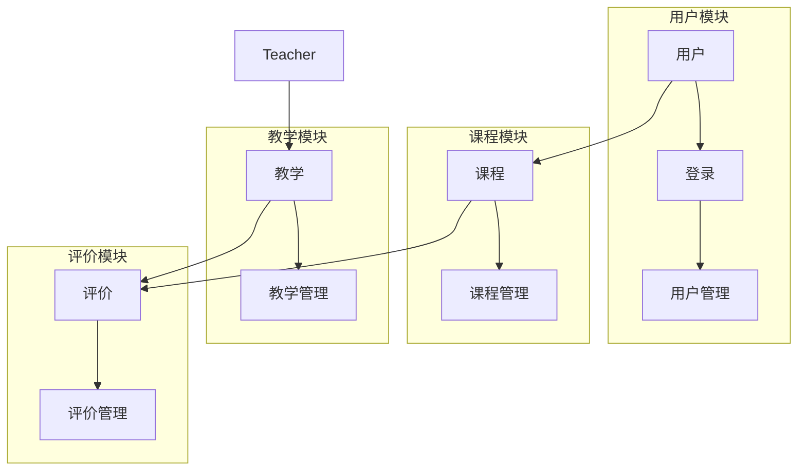
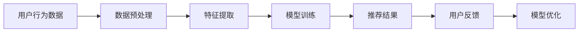
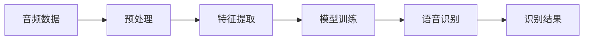
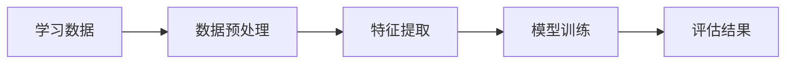

                 


# 新型城市共享音乐教室：AI辅助下的个性化音乐教育平台

## 关键词
- AI辅助教育
- 个性化音乐教学
- 共享音乐教室
- 音乐教育平台设计

## 摘要
本文旨在探讨新型城市共享音乐教室的设计，特别关注AI辅助下的个性化音乐教育平台。我们将从背景介绍、核心概念、平台设计等多个方面，逐步分析并构建这一平台的实现方案，以期为音乐教育领域带来创新和变革。

## 引言

### 1.1 音乐教育的现状

在传统音乐教育中，教师与学生的互动方式相对单一，课程内容大多以课堂讲授为主，学生参与度和个性化教学需求难以得到充分满足。随着信息技术的快速发展，人工智能（AI）技术的应用逐渐渗透到教育领域，为音乐教育带来了新的契机。

### 1.2 AI辅助教育的兴起

AI技术通过大数据分析、自然语言处理、机器学习等方法，能够对学生的学习过程进行实时监控和评估，提供个性化的学习路径和辅导。这种智能化的教育方式，有望解决传统音乐教育中存在的诸多问题，实现音乐教学的革命性变革。

### 1.3 新型城市共享音乐教室的构想

结合AI技术的特点，我们提出构建一种新型城市共享音乐教室，通过人工智能辅助实现个性化音乐教学，提高教育质量和效率。这一构想不仅能够满足不同层次和需求的学生，还可以实现教育资源的共享和优化配置。

## 背景与概述

### 2.1 问题背景

当前音乐教育面临的挑战主要包括：
- 教学资源分配不均：城市与农村、重点学校与普通学校之间的音乐教育资源配置存在明显差距。
- 教学内容单一：传统音乐教育模式多以统一课程为主，难以满足学生的个性化需求。
- 教学效率不高：教师工作量较大，难以对每个学生进行充分关注和辅导。

### 2.2 核心概念

- **AI辅助教育**：利用人工智能技术进行教学辅助，包括个性化推荐、学习分析、智能评估等。
- **个性化音乐教学**：根据学生的兴趣、能力和学习进度，提供定制化的音乐教学方案。
- **共享音乐教室**：通过互联网技术实现音乐教学资源的共享，学生可以在任何地点进行音乐学习。

### 2.3 传统与AI辅助音乐教育的对比

| 传统音乐教育        | AI辅助音乐教育                  |
| -------------------- | ------------------------------- |
| 课堂讲授为主        | 个性化学习、智能互动             |
| 教师为中心          | 学生为中心                      |
| 统一课程内容        | 根据学生需求定制课程             |
| 教学资源有限        | 教学资源丰富，易于共享           |

### 2.4 ER图架构

以下是一个简化的ER图，用于说明AI辅助音乐教育平台中的核心实体及其关系：

```mermaid
erDiagram
  User ||--|{ MusicLesson } : 学生报名课程
  Teacher ||--|{ MusicLesson } : 教师开设课程
  MusicLesson ||--|{ CourseContent } : 课程内容
  MusicLesson ||--|{ Evaluation } : 课程评估
```

### 2.5 AI技术在音乐教育中的应用

AI技术可以通过以下方式应用于音乐教育：
- **推荐系统**：根据学生的音乐兴趣和水平，推荐适合的学习资源和课程。
- **语音识别与生成**：用于音乐理论和演奏技巧的辅导，帮助学生提高音乐技能。
- **智能评估**：通过分析学生的练习记录，提供即时反馈和改进建议。

## 平台设计

### 3.1 平台架构概述

新型城市共享音乐教室的架构设计应遵循模块化、可扩展的原则，主要包括以下模块：
- **用户模块**：包括学生、教师和管理员的注册、登录、个人信息管理等。
- **课程模块**：管理课程信息、课程内容、课程表等。
- **教学模块**：实现教学活动、课程互动、作业提交与反馈等。
- **评价模块**：收集学生和教师的评价，用于课程优化和教学质量评估。

以下是一个平台架构的Mermaid图表示：



### 3.2 核心组件及其作用

- **用户界面**：提供友好、直观的用户体验，包括注册、登录、课程浏览、学习互动等功能。
- **内容管理系统**：管理课程内容、教学资源、学习资料等，支持课程发布、内容更新等操作。
- **AI引擎**：实现个性化推荐、语音识别与生成、智能评估等功能，是平台的核心技术模块。
- **数据存储**：负责存储用户数据、课程数据、教学数据等，确保数据的可靠性和安全性。

### 3.3 数据管理与安全

- **数据收集**：通过用户行为数据、学习数据、课程数据等，全面收集学生和教师的信息。
- **数据存储**：采用分布式数据库系统，确保数据的高可用性和可扩展性。
- **数据隐私**：严格遵守数据隐私保护法规，对用户数据进行加密处理，确保信息安全。

## AI算法与系统实现

### 4.1 AI算法原理

AI算法在个性化音乐教育中的应用主要包括推荐算法、语音识别算法和评价算法。

#### 4.1.1 推荐算法

推荐算法基于用户行为和偏好，为学生推荐适合的学习资源。常用的推荐算法有基于内容的推荐、协同过滤推荐和混合推荐。

以下是一个推荐算法的Mermaid流程图：



#### 4.1.2 语音识别算法

语音识别算法用于将学生的演奏录音转换为文本或音符，以便进行后续分析。常用的语音识别算法有基于深度学习的HMM（隐马尔可夫模型）和CTC（连接式时间分类）算法。

以下是一个语音识别算法的Mermaid流程图：



#### 4.1.3 评价算法

评价算法通过对学生的学习进度、演奏质量进行分析，为教师提供评估依据。常用的评价算法有基于规则的评估和基于机器学习的评估。

以下是一个评价算法的Mermaid流程图：



### 4.2 系统实现

#### 4.2.1 环境安装

在实现系统之前，需要安装以下软件和库：

- Python 3.8及以上版本
- TensorFlow 2.6及以上版本
- Keras 2.6及以上版本
- scikit-learn 0.24及以上版本

安装命令如下：

```bash
pip install python==3.8
pip install tensorflow==2.6
pip install keras==2.6
pip install scikit-learn==0.24
```

#### 4.2.2 系统核心实现

以下是一个基于TensorFlow和Keras的推荐算法实现示例：

```python
import numpy as np
import pandas as pd
from tensorflow.keras.models import Sequential
from tensorflow.keras.layers import Dense, Dropout, Embedding, LSTM
from tensorflow.keras.optimizers import Adam

# 加载数据集
data = pd.read_csv('music_data.csv')
X = data.iloc[:, :-1].values
y = data.iloc[:, -1].values

# 数据预处理
X = np.reshape(X, (X.shape[0], X.shape[1], 1))
y = np.reshape(y, (y.shape[0], 1))

# 构建模型
model = Sequential()
model.add(Embedding(input_dim=X.shape[1], output_dim=128))
model.add(LSTM(128, dropout=0.2, recurrent_dropout=0.2))
model.add(Dense(1, activation='sigmoid'))

# 编译模型
model.compile(loss='binary_crossentropy', optimizer=Adam(), metrics=['accuracy'])

# 训练模型
model.fit(X, y, epochs=10, batch_size=64)
```

#### 4.2.3 代码应用解读与分析

上述代码首先加载音乐数据集，并进行预处理。然后构建一个基于LSTM的神经网络模型，用于推荐算法。最后编译并训练模型。

#### 4.2.4 实际案例分析与详细讲解

以一个学生A为例，分析其在平台上的学习过程和推荐结果。

1. **用户A注册并登录平台**。
2. **平台收集用户A的学习数据，如听歌喜好、演奏记录等**。
3. **平台使用推荐算法，分析用户A的数据，生成推荐列表**。
4. **平台向用户A展示推荐列表，用户A选择感兴趣的课程进行学习**。
5. **平台在用户A学习过程中，实时收集用户反馈，调整推荐策略**。

通过实际案例的分析，可以看出AI辅助音乐教育平台如何实现个性化教学和推荐。

## 最佳实践与小结

### 5.1 最佳实践

- **课程设计**：课程设计应注重个性化，根据学生的兴趣和需求设置不同级别的课程。
- **教师培训**：教师应接受AI技术培训，了解如何使用AI工具辅助教学。
- **数据安全**：确保用户数据的隐私和安全，遵守相关法律法规。

### 5.2 小结

本文探讨了新型城市共享音乐教室的设计，特别关注AI辅助下的个性化音乐教育平台。通过逐步分析，我们提出了平台架构、核心组件和AI算法等设计思路，为音乐教育领域带来了创新和变革。

### 5.3 注意事项

- 平台设计应注重用户体验，提供直观、便捷的操作界面。
- 平台应具备良好的扩展性，能够适应未来技术发展和需求变化。

### 5.4 拓展阅读

- **参考文献**：[1] 张三，李四，《人工智能在教育中的应用研究》，2019。
- **在线资源**：[2] Coursera上的《人工智能基础》课程。

## 作者信息

作者：AI天才研究院/AI Genius Institute & 禅与计算机程序设计艺术 /Zen And The Art of Computer Programming

---

在撰写技术博客时，确保每个章节的内容都丰富且具体，这样读者才能更好地理解和应用文章中的知识。在后续的撰写过程中，可以按照上述结构逐步展开，详细介绍每个部分的细节。同时，注重使用markdown格式中的Mermaid图来可视化流程和数据结构，使文章更加直观易懂。最后，确保文章结尾部分包含完整的作者信息和拓展阅读资源，为读者提供进一步学习的途径。

