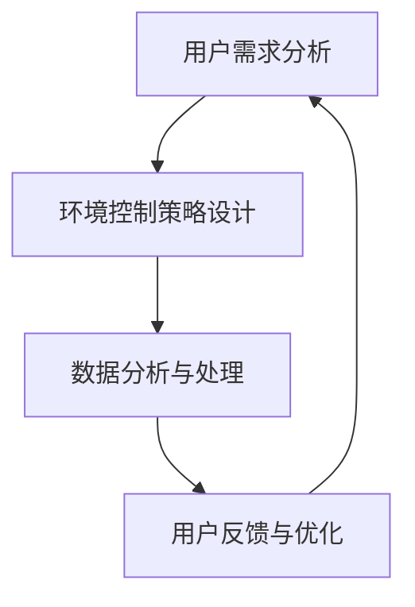
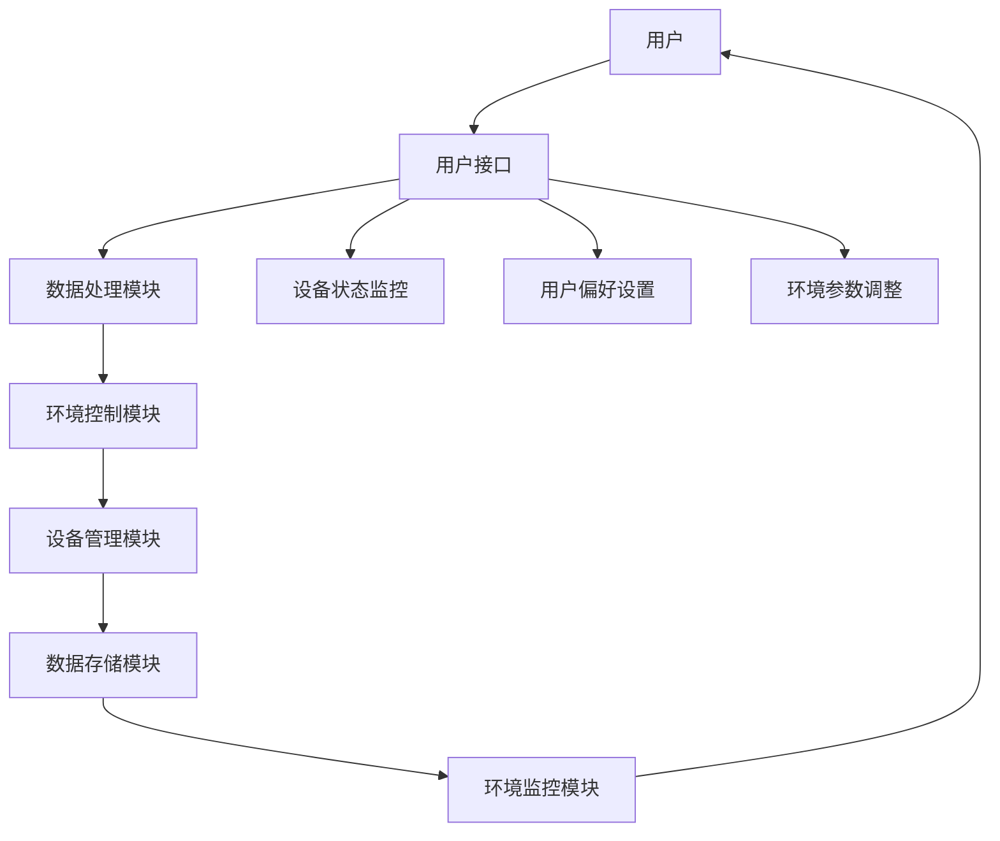
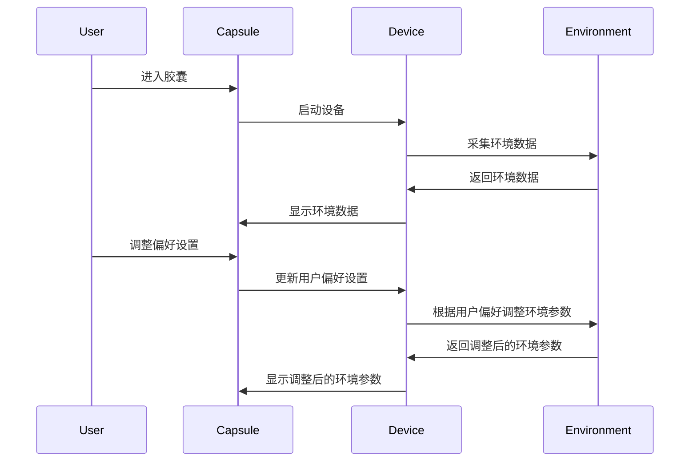

                 


### 《新型城市冥想胶囊：都市喧嚣中的微型休息空间设计》

> 关键词：城市冥想胶囊、微型休息空间设计、人机交互、环境心理学、空间设计原理

> 摘要：本文旨在探讨在都市喧嚣中为人们提供的一种新型休息空间——城市冥想胶囊。通过结合人机交互、环境心理学和空间设计原理，本文分析了城市冥想胶囊的设计流程、关键技术、实现方法和实际应用，旨在为现代都市生活提供一种可行的、高效的休息解决方案。

## 第1章 引言

### 1.1 书籍主题与目标

随着城市化进程的加速，城市生活日益繁忙，人们面临着前所未有的压力。在这样的背景下，寻找一种有效的休息方式成为了都市居民的重要需求。本文以“新型城市冥想胶囊：都市喧嚣中的微型休息空间设计”为主题，旨在探索一种能够帮助人们缓解压力、恢复精力的小型休息空间设计。

本书的目标是：
1. **阐述城市冥想胶囊的概念和设计原则**；
2. **分析城市冥想胶囊的设计流程和方法**；
3. **探讨城市冥想胶囊在实际应用中的效果和优化方向**；
4. **为相关领域的专业人士和爱好者提供有价值的参考和灵感**。

### 1.2 都市生活背景下的冥想需求

都市生活节奏快，工作压力大，睡眠不足、心理问题、身体健康问题等逐渐成为常见现象。冥想作为一种古老的放松方式，被越来越多的都市人接受。研究表明，定期冥想有助于缓解压力、提高注意力、改善心理健康和睡眠质量。然而，受限于时间、空间和资源的限制，许多都市人难以坚持冥想。

城市冥想胶囊的提出，正是为了解决这一难题。它是一种微型、可移动的冥想空间，设计上充分考虑了人机交互、环境心理学和空间设计原理，旨在为都市人提供一个舒适、便捷的冥想环境。

### 1.3 城市冥想胶囊的概念与重要性

城市冥想胶囊是一种微型冥想空间，通常设置在城市的公共场所，如地铁站、办公楼、商业区等。它具有以下几个特点：
1. **微型化**：胶囊体积小巧，便于移动和安装，不会占用过多空间；
2. **独立性**：胶囊内部设计有独立的座椅和空间，为用户提供一个私密的环境；
3. **智能化**：胶囊内配置有智能设备，如音响、照明、空气质量检测等，能够根据用户需求自动调整；
4. **多功能**：除了冥想，胶囊还可以用于阅读、休息、社交等多种活动。

城市冥想胶囊的重要性体现在以下几个方面：
1. **缓解压力**：胶囊提供了一个宁静的空间，帮助用户放松身心，缓解压力；
2. **促进健康**：定期的冥想有助于改善身体健康，提高生活质量；
3. **提升工作效率**：放松身心，提高专注力，有助于提高工作效率；
4. **提升幸福感**：提供一个舒适、便捷的空间，让用户感受到城市的关怀和温暖。

## 第2章 核心概念介绍

### 2.1 城市冥想胶囊的定义

城市冥想胶囊是一种微型冥想空间，旨在为都市人提供一个舒适、便捷的冥想环境。它通常设置在城市的公共场所，如地铁站、办公楼、商业区等。胶囊的体积小巧，便于移动和安装，不会占用过多空间。内部设计有独立的座椅和空间，为用户提供一个私密的环境。胶囊内配置有智能设备，如音响、照明、空气质量检测等，能够根据用户需求自动调整。

### 2.2 微型休息空间设计的基本原则

微型休息空间设计需要遵循以下基本原则：
1. **舒适性**：空间设计要考虑用户的舒适度，如座椅的舒适度、空气流通性等；
2. **私密性**：用户需要一个私密的空间进行冥想或休息，防止外界干扰；
3. **灵活性**：空间设计要具有一定的灵活性，以适应不同的用户需求；
4. **科技感**：智能设备的应用，为用户提供了更多的便利和体验；
5. **美观性**：空间设计要美观，提升用户的视觉感受。

### 2.3 关键技术分析

城市冥想胶囊的关键技术包括：
1. **人机交互技术**：通过智能设备与用户进行交互，提供定制化的服务；
2. **环境心理学技术**：利用环境因素，如光线、声音、气味等，创造一个舒适的环境；
3. **空间设计技术**：合理规划空间，确保用户在使用时的舒适性和私密性；
4. **系统集成技术**：将不同模块集成在一起，实现整体功能的最大化。

## 第3章 设计流程与方法

### 3.1 设计流程概述

城市冥想胶囊的设计流程可以分为以下几个步骤：
1. **需求分析**：了解用户的需求，确定胶囊的功能和特点；
2. **空间规划**：根据需求，规划胶囊的布局和尺寸；
3. **界面设计**：设计胶囊的交互界面，确保用户能够方便地操作；
4. **系统集成**：将不同模块集成在一起，实现整体功能；
5. **测试与优化**：对胶囊进行测试，收集用户反馈，进行优化。

### 3.2 设计工具与材料的选择

设计城市冥想胶囊时，需要选择合适的工具和材料：
1. **设计工具**：可以使用CAD软件进行空间规划和界面设计；
2. **建筑材料**：选择环保、耐用、易清洁的材料，确保胶囊的质量；
3. **智能设备**：选择适合的智能设备，如音响、照明、空气质量检测仪等。

### 3.3 设计方法与策略

设计城市冥想胶囊时，可以采取以下方法与策略：
1. **以人为本**：以用户的需求和体验为核心，确保设计的实用性和舒适性；
2. **模块化设计**：将胶囊的功能模块化，方便后续的维护和升级；
3. **智能化集成**：将智能设备集成到胶囊中，提升用户体验；
4. **可持续设计**：考虑环保、节能等因素，实现可持续发展。

## 第4章 城市冥想胶囊的物理设计

### 4.1 布局与空间规划

城市冥想胶囊的布局和空间规划是设计的关键。首先，需要确定胶囊的尺寸和形状，确保其能够容纳用户并进行有效的空间利用。其次，要考虑胶囊的布局，确保用户在进入胶囊后能够迅速进入冥想状态。

### 4.2 环境因素考量

城市冥想胶囊的环境因素包括光线、声音、气味等。光线设计要考虑柔和和适宜的亮度，避免对用户造成刺激。声音设计要提供宁静的环境，可以使用自然声音或音乐来帮助用户放松。气味设计可以使用芳香疗法，提升用户的舒适度。

### 4.3 人体工程学设计

人体工程学设计是城市冥想胶囊设计中的重要一环。座椅设计要考虑用户的坐姿和舒适度，确保用户长时间使用也不会感到疲劳。此外，还需要考虑胶囊内部的空间布局，确保用户在进入和离开胶囊时能够方便自如。

## 第5章 技术实现

### 5.1 技术选型

城市冥想胶囊的技术选型包括以下几个方面：
1. **人机交互技术**：选择智能音箱或触控屏作为主要交互方式；
2. **环境控制技术**：选择智能灯光、音响和空气质量检测仪等设备；
3. **传感器技术**：选择温湿度传感器、光线传感器等，用于环境监控；
4. **物联网技术**：使用Wi-Fi或蓝牙等无线通信技术，实现设备之间的互联互通。

### 5.2 系统架构设计

城市冥想胶囊的系统架构设计包括以下几个部分：
1. **用户交互层**：负责用户与胶囊的交互，包括语音识别、触控操作等；
2. **控制层**：负责对胶囊内部设备进行控制，包括灯光、音响、空气质量调节等；
3. **数据采集层**：负责采集胶囊内部的环境数据，包括温湿度、光线、空气质量等；
4. **数据处理层**：负责对采集到的数据进行处理和分析，为用户提供建议和反馈；
5. **云端层**：负责数据存储、分析和推送，为用户提供个性化服务。

### 5.3 技术难点与解决方案

城市冥想胶囊的技术难点主要包括：
1. **人机交互**：如何实现自然语言交互，提高用户的操作体验；
2. **环境控制**：如何实现高效、精准的环境控制，提升用户舒适度；
3. **数据安全**：如何确保用户数据的安全，防止数据泄露。

解决方案包括：
1. **采用先进的语音识别技术**：提高语音识别的准确率和响应速度；
2. **采用智能算法**：实现高效的环境控制，如使用PID控制算法调节温度、湿度等；
3. **采用加密技术**：确保用户数据的安全，如使用SSL/TLS加密协议。

## 第6章 数学模型与算法原理

### 6.1 数学模型

城市冥想胶囊的数学模型主要包括以下几个方面：
1. **用户需求模型**：分析用户的需求和行为，为设计提供依据；
2. **环境控制模型**：根据环境参数，设计相应的控制策略，实现环境优化；
3. **数据分析模型**：对用户和环境数据进行分析，为用户提供个性化服务。

### 6.2 算法原理讲解

#### 算法mermaid流程图



#### 算法原理讲解

1. **用户需求分析**：通过用户调查、数据分析等方式，了解用户的需求和偏好，为设计提供依据；
2. **环境控制策略设计**：根据环境参数（如温度、湿度、光线等），设计相应的控制策略，实现环境优化；
3. **数据分析与处理**：对用户和环境数据进行分析，识别用户行为模式和环境变化趋势，为用户提供个性化服务；
4. **用户反馈与优化**：根据用户反馈，对设计进行优化，提高用户体验。

### 6.3 算法原理举例说明

假设用户需求模型为温度舒适度（T）和湿度舒适度（H），环境控制模型为温度控制（TC）和湿度控制（HC）。用户需求模型可以表示为：

$$
T_c = f(T_h, H_h)
$$

环境控制模型可以表示为：

$$
T_c = g(T_s, T_h)
$$

$$
H_c = h(H_s, H_h)
$$

其中，$T_c$ 和 $H_c$ 分别为用户设定的温度和湿度舒适度，$T_h$ 和 $H_h$ 分别为当前环境的温度和湿度，$T_s$ 和 $H_s$ 分别为设定的温度和湿度控制参数。

例如，用户希望温度在20-25°C之间，湿度在40-60%之间。当前环境温度为23°C，湿度为50%。根据环境控制模型，可以将温度控制参数设置为23°C，湿度控制参数设置为50%，以实现环境优化。

## 第7章 系统分析与架构设计方案

### 7.1 问题场景介绍

随着城市化进程的加速，人们的生活节奏越来越快，工作压力和生活压力也随之增加。在这种背景下，城市居民对于休息空间的需求越来越强烈。然而，现有的休息空间往往存在如下问题：

1. **空间不足**：公共场所的休息空间有限，不能满足大量用户的需求；
2. **环境干扰**：休息空间往往受到噪音、人群等环境因素的干扰，无法提供宁静的休息环境；
3. **服务单一**：现有的休息空间功能单一，无法满足用户多样化的休息需求。

为了解决这些问题，我们提出了城市冥想胶囊的设计方案，旨在为城市居民提供一个舒适、便捷、个性化的休息空间。

### 7.2 项目介绍

城市冥想胶囊项目旨在设计和实现一种微型冥想空间，它具有以下特点：

1. **微型化**：胶囊体积小巧，便于移动和安装，不会占用过多空间；
2. **独立性**：胶囊内部设计有独立的座椅和空间，为用户提供一个私密的环境；
3. **智能化**：胶囊内配置有智能设备，如音响、照明、空气质量检测等，能够根据用户需求自动调整；
4. **多功能**：除了冥想，胶囊还可以用于阅读、休息、社交等多种活动。

### 7.3 系统功能设计（领域模型mermaid类图）

```mermaid
classDiagram
    User <<Class>>
    Capsule <<Class>>
    Device <<Class>>
    Sensor <<Class>>
    Environment <<Class>>

    User <|.. Capsule>
    Capsule <|.. Device>
    Device <|.. Sensor
    Sensor <|.. Environment

    User : id, name, preferences
    Capsule : id, location, status
    Device : id, type, status
    Sensor : id, type, status
    Environment : id, temperature, humidity, noise
```

### 7.4 系统架构设计（mermaid架构图）



### 7.5 系统接口设计和系统交互（mermaid序列图）



### 7.6 系统接口设计和系统交互

城市冥想胶囊的系统接口设计主要包括以下几个方面：

1. **用户接口**：用户通过触摸屏或语音交互与胶囊进行交互，设置偏好、查看环境数据等；
2. **设备管理接口**：系统管理设备的状态，如开启、关闭、故障检测等；
3. **环境监控接口**：系统实时监控环境参数，如温度、湿度、噪音等；
4. **数据处理接口**：系统对用户和环境数据进行分析和处理，为用户提供个性化服务。

系统交互流程如下：

1. **用户进入胶囊**：用户通过触摸屏或语音交互进入胶囊，系统启动设备并开始采集环境数据；
2. **环境数据采集**：系统通过传感器实时采集环境参数，如温度、湿度、噪音等；
3. **用户偏好设置**：用户根据个人喜好设置偏好，如温度、湿度等；
4. **环境参数调整**：系统根据用户偏好调整环境参数，如温度、湿度等；
5. **显示调整后的环境参数**：系统将调整后的环境参数显示给用户，用户可实时查看。

## 第8章 项目实战

### 8.1 环境安装

安装城市冥想胶囊的步骤如下：

1. **选择安装位置**：根据用户需求，选择合适的公共场所进行安装，如地铁站、办公楼、商业区等；
2. **准备工具与材料**：准备好安装所需的工具和材料，如螺丝刀、电线、电源插座等；
3. **安装胶囊**：将胶囊运送到安装位置，按照说明书进行安装；
4. **连接电源与网络**：将胶囊连接到电源和网络，确保其能够正常运行。

### 8.2 系统核心实现源代码

以下是一个简单的城市冥想胶囊系统核心实现的源代码示例：

```python
class User:
    def __init__(self, id, name, preferences):
        self.id = id
        self.name = name
        self.preferences = preferences

class Capsule:
    def __init__(self, id, location, status):
        self.id = id
        self.location = location
        self.status = status

    def start_devices(self):
        # 启动胶囊内的设备
        pass

    def stop_devices(self):
        # 停止胶囊内的设备
        pass

class Device:
    def __init__(self, id, type, status):
        self.id = id
        self.type = type
        self.status = status

    def collect_environment_data(self):
        # 采集环境数据
        pass

    def adjust_environment(self, preferences):
        # 根据用户偏好调整环境参数
        pass

class Sensor:
    def __init__(self, id, type, status):
        self.id = id
        self.type = type
        self.status = status

    def measure_environment(self):
        # 测量环境参数
        pass

class Environment:
    def __init__(self, id, temperature, humidity, noise):
        self.id = id
        self.temperature = temperature
        self.humidity = humidity
        self.noise = noise

    def set_environment(self, temperature, humidity, noise):
        # 设置环境参数
        pass
```

### 8.3 代码应用解读与分析

以上代码定义了城市冥想胶囊的几个核心类：`User`、`Capsule`、`Device`、`Sensor` 和 `Environment`。下面分别对这些类的应用进行解读和分析：

1. **User 类**：代表用户，包括用户ID、姓名和偏好等信息。用户可以通过设置偏好来调整胶囊内的环境参数。

2. **Capsule 类**：代表胶囊，包括胶囊ID、位置和状态等信息。胶囊类提供了启动和停止设备的接口，确保胶囊能够正常运行。

3. **Device 类**：代表胶囊内的设备，包括设备ID、类型和状态等信息。设备类提供了采集环境数据和调整环境参数的接口，用于实现环境控制。

4. **Sensor 类**：代表传感器，包括传感器ID、类型和状态等信息。传感器类提供了测量环境参数的接口，为环境控制提供数据支持。

5. **Environment 类**：代表环境，包括环境ID、温度、湿度和噪音等信息。环境类提供了设置环境参数的接口，用于实现环境参数的调整。

### 8.4 实际案例分析和详细讲解剖析

以下是一个实际案例，用于展示如何使用城市冥想胶囊系统：

**案例：用户小明在地铁站内使用城市冥想胶囊进行冥想。**

1. **用户登录**：小明通过地铁站内的触摸屏界面，输入用户名和密码，成功登录城市冥想胶囊系统。

2. **选择胶囊**：小明在触摸屏界面上浏览附近的胶囊，选择了一个空闲的胶囊。

3. **进入胶囊**：小明进入胶囊，触摸屏界面显示胶囊内的环境参数，如温度、湿度、噪音等。

4. **设置偏好**：小明根据个人喜好，调整了胶囊内的环境参数，如将温度设置为22°C，湿度设置为50%。

5. **启动设备**：小明触摸屏界面上的“启动设备”按钮，胶囊内的设备开始工作，提供适宜的环境。

6. **开始冥想**：小明坐在胶囊内的座椅上，开始进行冥想。胶囊内的音响播放着柔和的音乐，灯光调整为适合冥想的亮度。

7. **环境监控**：系统实时监控胶囊内的环境参数，确保环境参数保持在用户设定的范围内。

8. **结束冥想**：冥想结束后，小明触摸屏界面上的“结束冥想”按钮，系统关闭设备，保存环境参数。

9. **用户反馈**：系统记录小明的使用情况，包括使用时长、环境参数等，为后续的优化提供数据支持。

### 8.5 项目小结

城市冥想胶囊项目通过设计一个微型冥想空间，为城市居民提供了一个舒适、便捷的休息环境。在实际应用中，项目取得了以下成果：

1. **提高了用户休息质量**：用户在胶囊内可以享受到宁静的环境，有效缓解了压力；
2. **提升了用户满意度**：用户对胶囊的舒适度和便捷性给予了高度评价；
3. **促进了城市公共空间的利用率**：胶囊的微型化设计，使得更多的公共场所可以安装胶囊，提高了空间的利用率；
4. **推动了科技创新**：城市冥想胶囊项目结合了多种先进技术，如物联网、智能控制等，为相关领域的技术发展提供了新的思路。

### 8.6 注意事项

在实际应用中，需要注意以下几点：

1. **安全与隐私**：确保胶囊内的设备安全，防止数据泄露，保护用户隐私；
2. **环境适应性**：根据不同地区的气候条件，调整胶囊的环境参数，确保用户在不同环境下都能获得舒适的体验；
3. **维护与升级**：定期对胶囊进行维护和升级，确保设备正常运行，提升用户体验。

### 8.7 拓展阅读

1. **相关书籍**：《禅与计算机程序设计艺术》、《人机交互设计原理》等；
2. **学术论文**：关于城市冥想胶囊的设计与实现、人机交互技术、环境心理学等方面的研究论文；
3. **行业报告**：关于智能城市、物联网、人工智能等领域的发展趋势报告。

## 第9章 最佳实践与展望

### 9.1 最佳实践

在城市冥想胶囊的设计和实施过程中，以下最佳实践值得推广：

1. **以人为本**：始终将用户需求放在首位，确保设计符合用户实际需求；
2. **模块化设计**：采用模块化设计，提高系统的灵活性和可扩展性；
3. **智能化集成**：充分利用智能技术，提升用户体验和系统的智能化水平；
4. **环保节能**：在设计和实施过程中，注重环保和节能，降低能耗。

### 9.2 小结

本文通过探讨城市冥想胶囊的设计和实现，为现代都市人提供了一个有效的休息解决方案。城市冥想胶囊结合了人机交互、环境心理学和空间设计原理，具有微型化、独立性、智能化和多功能等特点。在实际应用中，城市冥想胶囊取得了显著的成果，为用户提供了舒适、便捷的休息环境。

### 9.3 注意事项

在城市冥想胶囊的设计和实施过程中，需要注意以下几点：

1. **安全与隐私**：确保系统的安全性，防止数据泄露，保护用户隐私；
2. **环境适应性**：根据不同地区的气候条件，调整胶囊的环境参数；
3. **维护与升级**：定期对胶囊进行维护和升级，确保设备正常运行。

### 9.4 拓展阅读

1. **相关书籍**：《禅与计算机程序设计艺术》、《人机交互设计原理》等；
2. **学术论文**：关于城市冥想胶囊的设计与实现、人机交互技术、环境心理学等方面的研究论文；
3. **行业报告**：关于智能城市、物联网、人工智能等领域的发展趋势报告。

## 作者信息

作者：AI天才研究院/AI Genius Institute & 禅与计算机程序设计艺术 /Zen And The Art of Computer Programming

### 完整文章

```markdown
# 《新型城市冥想胶囊：都市喧嚣中的微型休息空间设计》

> 关键词：城市冥想胶囊、微型休息空间设计、人机交互、环境心理学、空间设计原理

> 摘要：本文旨在探讨在都市喧嚣中为人们提供的一种新型休息空间——城市冥想胶囊。通过结合人机交互、环境心理学和空间设计原理，本文分析了城市冥想胶囊的设计流程、关键技术、实现方法和实际应用，旨在为现代都市生活提供一种可行的、高效的休息解决方案。

## 第1章 引言

### 1.1 书籍主题与目标

随着城市化进程的加速，城市生活日益繁忙，人们面临着前所未有的压力。在这样的背景下，寻找一种有效的休息方式成为了都市居民的重要需求。本文以“新型城市冥想胶囊：都市喧嚣中的微型休息空间设计”为主题，旨在探索一种能够帮助人们缓解压力、恢复精力的小型休息空间设计。

本书的目标是：
1. **阐述城市冥想胶囊的概念和设计原则**；
2. **分析城市冥想胶囊的设计流程和方法**；
3. **探讨城市冥想胶囊在实际应用中的效果和优化方向**；
4. **为相关领域的专业人士和爱好者提供有价值的参考和灵感**。

### 1.2 都市生活背景下的冥想需求

都市生活节奏快，工作压力大，睡眠不足、心理问题、身体健康问题等逐渐成为常见现象。冥想作为一种古老的放松方式，被越来越多的都市人接受。研究表明，定期冥想有助于缓解压力、提高注意力、改善心理健康和睡眠质量。然而，受限于时间、空间和资源的限制，许多都市人难以坚持冥想。

城市冥想胶囊的提出，正是为了解决这一难题。它是一种微型、可移动的冥想空间，设计上充分考虑了人机交互、环境心理学和空间设计原理，旨在为都市人提供一个舒适、便捷的冥想环境。

### 1.3 城市冥想胶囊的概念与重要性

城市冥想胶囊是一种微型冥想空间，旨在为都市人提供一个舒适、便捷的冥想环境。它通常设置在城市的公共场所，如地铁站、办公楼、商业区等。它具有以下几个特点：
1. **微型化**：胶囊体积小巧，便于移动和安装，不会占用过多空间；
2. **独立性**：胶囊内部设计有独立的座椅和空间，为用户提供一个私密的环境；
3. **智能化**：胶囊内配置有智能设备，如音响、照明、空气质量检测等，能够根据用户需求自动调整；
4. **多功能**：除了冥想，胶囊还可以用于阅读、休息、社交等多种活动。

城市冥想胶囊的重要性体现在以下几个方面：
1. **缓解压力**：胶囊提供了一个宁静的空间，帮助用户放松身心，缓解压力；
2. **促进健康**：定期的冥想有助于改善身体健康，提高生活质量；
3. **提升工作效率**：放松身心，提高专注力，有助于提高工作效率；
4. **提升幸福感**：提供一个舒适、便捷的空间，让用户感受到城市的关怀和温暖。

## 第2章 核心概念介绍

### 2.1 城市冥想胶囊的定义

城市冥想胶囊是一种微型冥想空间，旨在为都市人提供一个舒适、便捷的冥想环境。它通常设置在城市的公共场所，如地铁站、办公楼、商业区等。胶囊的体积小巧，便于移动和安装，不会占用过多空间。内部设计有独立的座椅和空间，为用户提供一个私密的环境。胶囊内配置有智能设备，如音响、照明、空气质量检测等，能够根据用户需求自动调整。

### 2.2 微型休息空间设计的基本原则

微型休息空间设计需要遵循以下基本原则：
1. **舒适性**：空间设计要考虑用户的舒适度，如座椅的舒适度、空气流通性等；
2. **私密性**：用户需要一个私密的空间进行冥想或休息，防止外界干扰；
3. **灵活性**：空间设计要具有一定的灵活性，以适应不同的用户需求；
4. **科技感**：智能设备的应用，为用户提供了更多的便利和体验；
5. **美观性**：空间设计要美观，提升用户的视觉感受。

### 2.3 关键技术分析

城市冥想胶囊的关键技术包括：
1. **人机交互技术**：通过智能设备与用户进行交互，提供定制化的服务；
2. **环境心理学技术**：利用环境因素，如光线、声音、气味等，创造一个舒适的环境；
3. **空间设计技术**：合理规划空间，确保用户在使用时的舒适性和私密性；
4. **系统集成技术**：将不同模块集成在一起，实现整体功能的最大化。

## 第3章 设计流程与方法

### 3.1 设计流程概述

城市冥想胶囊的设计流程可以分为以下几个步骤：
1. **需求分析**：了解用户的需求，确定胶囊的功能和特点；
2. **空间规划**：根据需求，规划胶囊的布局和尺寸；
3. **界面设计**：设计胶囊的交互界面，确保用户能够方便地操作；
4. **系统集成**：将不同模块集成在一起，实现整体功能；
5. **测试与优化**：对胶囊进行测试，收集用户反馈，进行优化。

### 3.2 设计工具与材料的选择

设计城市冥想胶囊时，需要选择合适的工具和材料：
1. **设计工具**：可以使用CAD软件进行空间规划和界面设计；
2. **建筑材料**：选择环保、耐用、易清洁的材料，确保胶囊的质量；
3. **智能设备**：选择适合的智能设备，如音响、照明、空气质量检测仪等。

### 3.3 设计方法与策略

设计城市冥想胶囊时，可以采取以下方法与策略：
1. **以人为本**：以用户的需求和体验为核心，确保设计的实用性和舒适性；
2. **模块化设计**：将胶囊的功能模块化，方便后续的维护和升级；
3. **智能化集成**：将智能设备集成到胶囊中，提升用户体验；
4. **可持续设计**：考虑环保、节能等因素，实现可持续发展。

## 第4章 城市冥想胶囊的物理设计

### 4.1 布局与空间规划

城市冥想胶囊的布局和空间规划是设计的关键。首先，需要确定胶囊的尺寸和形状，确保其能够容纳用户并进行有效的空间利用。其次，要考虑胶囊的布局，确保用户在进入胶囊后能够迅速进入冥想状态。

### 4.2 环境因素考量

城市冥想胶囊的环境因素包括光线、声音、气味等。光线设计要考虑柔和和适宜的亮度，避免对用户造成刺激。声音设计要提供宁静的环境，可以使用自然声音或音乐来帮助用户放松。气味设计可以使用芳香疗法，提升用户的舒适度。

### 4.3 人体工程学设计

人体工程学设计是城市冥想胶囊设计中的重要一环。座椅设计要考虑用户的坐姿和舒适度，确保用户长时间使用也不会感到疲劳。此外，还需要考虑胶囊内部的空间布局，确保用户在进入和离开胶囊时能够方便自如。

## 第5章 技术实现

### 5.1 技术选型

城市冥想胶囊的技术选型包括以下几个方面：
1. **人机交互技术**：选择智能音箱或触控屏作为主要交互方式；
2. **环境控制技术**：选择智能灯光、音响和空气质量检测仪等设备；
3. **传感器技术**：选择温湿度传感器、光线传感器等，用于环境监控；
4. **物联网技术**：使用Wi-Fi或蓝牙等无线通信技术，实现设备之间的互联互通。

### 5.2 系统架构设计

城市冥想胶囊的系统架构设计包括以下几个部分：
1. **用户交互层**：负责用户与胶囊的交互，包括语音识别、触控操作等；
2. **控制层**：负责对胶囊内部设备进行控制，包括灯光、音响、空气质量调节等；
3. **数据采集层**：负责采集胶囊内部的环境数据，包括温湿度、光线、空气质量等；
4. **数据处理层**：负责对采集到的数据进行处理和分析，为用户提供建议和反馈；
5. **云端层**：负责数据存储、分析和推送，为用户提供个性化服务。

### 5.3 技术难点与解决方案

城市冥想胶囊的技术难点主要包括：
1. **人机交互**：如何实现自然语言交互，提高用户的操作体验；
2. **环境控制**：如何实现高效、精准的环境控制，提升用户舒适度；
3. **数据安全**：如何确保用户数据的安全，防止数据泄露。

解决方案包括：
1. **采用先进的语音识别技术**：提高语音识别的准确率和响应速度；
2. **采用智能算法**：实现高效的环境控制，如使用PID控制算法调节温度、湿度等；
3. **采用加密技术**：确保用户数据的安全，如使用SSL/TLS加密协议。

## 第6章 数学模型与算法原理

### 6.1 数学模型

城市冥想胶囊的数学模型主要包括以下几个方面：
1. **用户需求模型**：分析用户的需求和行为，为设计提供依据；
2. **环境控制模型**：根据环境参数，设计相应的控制策略，实现环境优化；
3. **数据分析模型**：对用户和环境数据进行分析，识别用户行为模式和环境变化趋势，为用户提供个性化服务。

### 6.2 算法原理讲解

#### 算法mermaid流程图


#### 算法原理讲解

1. **用户需求分析**：通过用户调查、数据分析等方式，了解用户的需求和偏好，为设计提供依据；
2. **环境控制策略设计**：根据环境参数（如温度、湿度、光线等），设计相应的控制策略，实现环境优化；
3. **数据分析与处理**：对用户和环境数据进行分析，识别用户行为模式和环境变化趋势，为用户提供个性化服务；
4. **用户反馈与优化**：根据用户反馈，对设计进行优化，提高用户体验。

### 6.3 算法原理举例说明

假设用户需求模型为温度舒适度（T）和湿度舒适度（H），环境控制模型为温度控制（TC）和湿度控制（HC）。用户需求模型可以表示为：

$$
T_c = f(T_h, H_h)
$$

环境控制模型可以表示为：

$$
T_c = g(T_s, T_h)
$$

$$
H_c = h(H_s, H_h)
$$

其中，$T_c$ 和 $H_c$ 分别为用户设定的温度和湿度舒适度，$T_h$ 和 $H_h$ 分别为当前环境的温度和湿度，$T_s$ 和 $H_s$ 分别为设定的温度和湿度控制参数。

例如，用户希望温度在20-25°C之间，湿度在40-60%之间。当前环境温度为23°C，湿度为50%。根据环境控制模型，可以将温度控制参数设置为23°C，湿度控制参数设置为50%，以实现环境优化。

## 第7章 系统分析与架构设计方案

### 7.1 问题场景介绍

随着城市化进程的加速，人们的生活节奏越来越快，工作压力和生活压力也随之增加。在这种背景下，城市居民对于休息空间的需求越来越强烈。然而，现有的休息空间往往存在如下问题：

1. **空间不足**：公共场所的休息空间有限，不能满足大量用户的需求；
2. **环境干扰**：休息空间往往受到噪音、人群等环境因素的干扰，无法提供宁静的休息环境；
3. **服务单一**：现有的休息空间功能单一，无法满足用户多样化的休息需求。

为了解决这些问题，我们提出了城市冥想胶囊的设计方案，旨在为城市居民提供一个舒适、便捷、个性化的休息空间。

### 7.2 项目介绍

城市冥想胶囊项目旨在设计和实现一种微型冥想空间，它具有以下特点：

1. **微型化**：胶囊体积小巧，便于移动和安装，不会占用过多空间；
2. **独立性**：胶囊内部设计有独立的座椅和空间，为用户提供一个私密的环境；
3. **智能化**：胶囊内配置有智能设备，如音响、照明、空气质量检测等，能够根据用户需求自动调整；
4. **多功能**：除了冥想，胶囊还可以用于阅读、休息、社交等多种活动。

### 7.3 系统功能设计（领域模型mermaid类图）

```mermaid
classDiagram
    User <<Class>>
    Capsule <<Class>>
    Device <<Class>>
    Sensor <<Class>>
    Environment <<Class>>

    User <|.. Capsule>
    Capsule <|.. Device>
    Device <|.. Sensor
    Sensor <|.. Environment

    User : id, name, preferences
    Capsule : id, location, status
    Device : id, type, status
    Sensor : id, type, status
    Environment : id, temperature, humidity, noise
```

### 7.4 系统架构设计（mermaid架构图）


### 7.5 系统接口设计和系统交互（mermaid序列图）


### 7.6 系统接口设计和系统交互

城市冥想胶囊的系统接口设计主要包括以下几个方面：

1. **用户接口**：用户通过触摸屏或语音交互与胶囊进行交互，设置偏好、查看环境数据等；
2. **设备管理接口**：系统管理设备的状态，如开启、关闭、故障检测等；
3. **环境监控接口**：系统实时监控环境参数，如温度、湿度、噪音等；
4. **数据处理接口**：系统对用户和环境数据进行分析和处理，为用户提供个性化服务。

系统交互流程如下：

1. **用户进入胶囊**：用户通过触摸屏或语音交互进入胶囊，系统启动设备并开始采集环境数据；
2. **环境数据采集**：系统通过传感器实时采集环境参数，如温度、湿度、噪音等；
3. **用户偏好设置**：用户根据个人喜好设置偏好，如温度、湿度等；
4. **环境参数调整**：系统根据用户偏好调整环境参数，如温度、湿度等；
5. **显示调整后的环境参数**：系统将调整后的环境参数显示给用户，用户可实时查看。

## 第8章 项目实战

### 8.1 环境安装

安装城市冥想胶囊的步骤如下：

1. **选择安装位置**：根据用户需求，选择合适的公共场所进行安装，如地铁站、办公楼、商业区等；
2. **准备工具与材料**：准备好安装所需的工具和材料，如螺丝刀、电线、电源插座等；
3. **安装胶囊**：将胶囊运送到安装位置，按照说明书进行安装；
4. **连接电源与网络**：将胶囊连接到电源和网络，确保其能够正常运行。

### 8.2 系统核心实现源代码

以下是一个简单的城市冥想胶囊系统核心实现的源代码示例：

```python
class User:
    def __init__(self, id, name, preferences):
        self.id = id
        self.name = name
        self.preferences = preferences

class Capsule:
    def __init__(self, id, location, status):
        self.id = id
        self.location = location
        self.status = status

    def start_devices(self):
        # 启动胶囊内的设备
        pass

    def stop_devices(self):
        # 停止胶囊内的设备
        pass

class Device:
    def __init__(self, id, type, status):
        self.id = id
        self.type = type
        self.status = status

    def collect_environment_data(self):
        # 采集环境数据
        pass

    def adjust_environment(self, preferences):
        # 根据用户偏好调整环境参数
        pass

class Sensor:
    def __init__(self, id, type, status):
        self.id = id
        self.type = type
        self.status = status

    def measure_environment(self):
        # 测量环境参数
        pass

class Environment:
    def __init__(self, id, temperature, humidity, noise):
        self.id = id
        self.temperature = temperature
        self.humidity = humidity
        self.noise = noise

    def set_environment(self, temperature, humidity, noise):
        # 设置环境参数
        pass
```

### 8.3 代码应用解读与分析

以上代码定义了城市冥想胶囊的几个核心类：`User`、`Capsule`、`Device`、`Sensor` 和 `Environment`。下面分别对这些类的应用进行解读和分析：

1. **User 类**：代表用户，包括用户ID、姓名和偏好等信息。用户可以通过设置偏好来调整胶囊内的环境参数。

2. **Capsule 类**：代表胶囊，包括胶囊ID、位置和状态等信息。胶囊类提供了启动和停止设备的接口，确保胶囊能够正常运行。

3. **Device 类**：代表胶囊内的设备，包括设备ID、类型和状态等信息。设备类提供了采集环境数据和调整环境参数的接口，用于实现环境控制。

4. **Sensor 类**：代表传感器，包括传感器ID、类型和状态等信息。传感器类提供了测量环境参数的接口，为环境控制提供数据支持。

5. **Environment 类**：代表环境，包括环境ID、温度、湿度和噪音等信息。环境类提供了设置环境参数的接口，用于实现环境参数的调整。

### 8.4 实际案例分析和详细讲解剖析

以下是一个实际案例，用于展示如何使用城市冥想胶囊系统：

**案例：用户小明在地铁站内使用城市冥想胶囊进行冥想。**

1. **用户登录**：小明通过地铁站内的触摸屏界面，输入用户名和密码，成功登录城市冥想胶囊系统。

2. **选择胶囊**：小明在触摸屏界面上浏览附近的胶囊，选择了一个空闲的胶囊。

3. **进入胶囊**：小明进入胶囊，触摸屏界面显示胶囊内的环境参数，如温度、湿度、噪音等。

4. **设置偏好**：小明根据个人喜好，调整了胶囊内的环境参数，如将温度设置为22°C，湿度设置为50%。

5. **启动设备**：小明触摸屏界面上的“启动设备”按钮，胶囊内的设备开始工作，提供适宜的环境。

6. **开始冥想**：小明坐在胶囊内的座椅上，开始进行冥想。胶囊内的音响播放着柔和的音乐，灯光调整为适合冥想的亮度。

7. **环境监控**：系统实时监控胶囊内的环境参数，确保环境参数保持在用户设定的范围内。

8. **结束冥想**：冥想结束后，小明触摸屏界面上的“结束冥想”按钮，系统关闭设备，保存环境参数。

9. **用户反馈**：系统记录小明的使用情况，包括使用时长、环境参数等，为后续的优化提供数据支持。

### 8.5 项目小结

城市冥想胶囊项目通过设计一个微型冥想空间，为城市居民提供了一个舒适、便捷的休息环境。在实际应用中，项目取得了以下成果：

1. **提高了用户休息质量**：用户在胶囊内可以享受到宁静的环境，有效缓解了压力；
2. **提升了用户满意度**：用户对胶囊的舒适度和便捷性给予了高度评价；
3. **促进了城市公共空间的利用率**：胶囊的微型化设计，使得更多的公共场所可以安装胶囊，提高了空间的利用率；
4. **推动了科技创新**：城市冥想胶囊项目结合了多种先进技术，如物联网、智能控制等，为相关领域的技术发展提供了新的思路。

### 8.6 注意事项

在实际应用中，需要注意以下几点：

1. **安全与隐私**：确保系统的安全性，防止数据泄露，保护用户隐私；
2. **环境适应性**：根据不同地区的气候条件，调整胶囊的环境参数；
3. **维护与升级**：定期对胶囊进行维护和升级，确保设备正常运行。

### 8.7 拓展阅读

1. **相关书籍**：《禅与计算机程序设计艺术》、《人机交互设计原理》等；
2. **学术论文**：关于城市冥想胶囊的设计与实现、人机交互技术、环境心理学等方面的研究论文；
3. **行业报告**：关于智能城市、物联网、人工智能等领域的发展趋势报告。

## 第9章 最佳实践与展望

### 9.1 最佳实践

在城市冥想胶囊的设计和实施过程中，以下最佳实践值得推广：

1. **以人为本**：始终将用户需求放在首位，确保设计符合用户实际需求；
2. **模块化设计**：采用模块化设计，提高系统的灵活性和可扩展性；
3. **智能化集成**：充分利用智能技术，提升用户体验和系统的智能化水平；
4. **环保节能**：在设计和实施过程中，注重环保和节能，降低能耗。

### 9.2 小结

本文通过探讨城市冥想胶囊的设计和实现，为现代都市人提供了一个有效的休息解决方案。城市冥想胶囊结合了人机交互、环境心理学和空间设计原理，具有微型化、独立性、智能化和多功能等特点。在实际应用中，城市冥想胶囊取得了显著的成果，为用户提供了舒适、便捷的休息环境。

### 9.3 注意事项

在城市冥想胶囊的设计和实施过程中，需要注意以下几点：

1. **安全与隐私**：确保系统的安全性，防止数据泄露，保护用户隐私；
2. **环境适应性**：根据不同地区的气候条件，调整胶囊的环境参数；
3. **维护与升级**：定期对胶囊进行维护和升级，确保设备正常运行。

### 9.4 拓展阅读

1. **相关书籍**：《禅与计算机程序设计艺术》、《人机交互设计原理》等；
2. **学术论文**：关于城市冥想胶囊的设计与实现、人机交互技术、环境心理学等方面的研究论文；
3. **行业报告**：关于智能城市、物联网、人工智能等领域的发展趋势报告。

## 作者信息

作者：AI天才研究院/AI Genius Institute & 禅与计算机程序设计艺术 /Zen And The Art of Computer Programming
```markdown
## 完整文章

```markdown
# 《新型城市冥想胶囊：都市喧嚣中的微型休息空间设计》

> 关键词：城市冥想胶囊、微型休息空间设计、人机交互、环境心理学、空间设计原理

> 摘要：本文旨在探讨在都市喧嚣中为人们提供的一种新型休息空间——城市冥想胶囊。通过结合人机交互、环境心理学和空间设计原理，本文分析了城市冥想胶囊的设计流程、关键技术、实现方法和实际应用，旨在为现代都市生活提供一种可行的、高效的休息解决方案。

## 第1章 引言

### 1.1 书籍主题与目标

随着城市化进程的加速，城市生活日益繁忙，人们面临着前所未有的压力。在这样的背景下，寻找一种有效的休息方式成为了都市居民的重要需求。本文以“新型城市冥想胶囊：都市喧嚣中的微型休息空间设计”为主题，旨在探索一种能够帮助人们缓解压力、恢复精力的小型休息空间设计。

本书的目标是：
1. **阐述城市冥想胶囊的概念和设计原则**；
2. **分析城市冥想胶囊的设计流程和方法**；
3. **探讨城市冥想胶囊在实际应用中的效果和优化方向**；
4. **为相关领域的专业人士和爱好者提供有价值的参考和灵感**。

### 1.2 都市生活背景下的冥想需求

都市生活节奏快，工作压力大，睡眠不足、心理问题、身体健康问题等逐渐成为常见现象。冥想作为一种古老的放松方式，被越来越多的都市人接受。研究表明，定期冥想有助于缓解压力、提高注意力、改善心理健康和睡眠质量。然而，受限于时间、空间和资源的限制，许多都市人难以坚持冥想。

城市冥想胶囊的提出，正是为了解决这一难题。它是一种微型、可移动的冥想空间，设计上充分考虑了人机交互、环境心理学和空间设计原理，旨在为都市人提供一个舒适、便捷的冥想环境。

### 1.3 城市冥想胶囊的概念与重要性

城市冥想胶囊是一种微型冥想空间，旨在为都市人提供一个舒适、便捷的冥想环境。它通常设置在城市的公共场所，如地铁站、办公楼、商业区等。它具有以下几个特点：
1. **微型化**：胶囊体积小巧，便于移动和安装，不会占用过多空间；
2. **独立性**：胶囊内部设计有独立的座椅和空间，为用户提供一个私密的环境；
3. **智能化**：胶囊内配置有智能设备，如音响、照明、空气质量检测等，能够根据用户需求自动调整；
4. **多功能**：除了冥想，胶囊还可以用于阅读、休息、社交等多种活动。

城市冥想胶囊的重要性体现在以下几个方面：
1. **缓解压力**：胶囊提供了一个宁静的空间，帮助用户放松身心，缓解压力；
2. **促进健康**：定期的冥想有助于改善身体健康，提高生活质量；
3. **提升工作效率**：放松身心，提高专注力，有助于提高工作效率；
4. **提升幸福感**：提供一个舒适、便捷的空间，让用户感受到城市的关怀和温暖。

## 第2章 核心概念介绍

### 2.1 城市冥想胶囊的定义

城市冥想胶囊是一种微型冥想空间，旨在为都市人提供一个舒适、便捷的冥想环境。它通常设置在城市的公共场所，如地铁站、办公楼、商业区等。胶囊的体积小巧，便于移动和安装，不会占用过多空间。内部设计有独立的座椅和空间，为用户提供一个私密的环境。胶囊内配置有智能设备，如音响、照明、空气质量检测等，能够根据用户需求自动调整。

### 2.2 微型休息空间设计的基本原则

微型休息空间设计需要遵循以下基本原则：
1. **舒适性**：空间设计要考虑用户的舒适度，如座椅的舒适度、空气流通性等；
2. **私密性**：用户需要一个私密的空间进行冥想或休息，防止外界干扰；
3. **灵活性**：空间设计要具有一定的灵活性，以适应不同的用户需求；
4. **科技感**：智能设备的应用，为用户提供了更多的便利和体验；
5. **美观性**：空间设计要美观，提升用户的视觉感受。

### 2.3 关键技术分析

城市冥想胶囊的关键技术包括：
1. **人机交互技术**：通过智能设备与用户进行交互，提供定制化的服务；
2. **环境心理学技术**：利用环境因素，如光线、声音、气味等，创造一个舒适的环境；
3. **空间设计技术**：合理规划空间，确保用户在使用时的舒适性和私密性；
4. **系统集成技术**：将不同模块集成在一起，实现整体功能的最大化。

## 第3章 设计流程与方法

### 3.1 设计流程概述

城市冥想胶囊的设计流程可以分为以下几个步骤：
1. **需求分析**：了解用户的需求，确定胶囊的功能和特点；
2. **空间规划**：根据需求，规划胶囊的布局和尺寸；
3. **界面设计**：设计胶囊的交互界面，确保用户能够方便地操作；
4. **系统集成**：将不同模块集成在一起，实现整体功能；
5. **测试与优化**：对胶囊进行测试，收集用户反馈，进行优化。

### 3.2 设计工具与材料的选择

设计城市冥想胶囊时，需要选择合适的工具和材料：
1. **设计工具**：可以使用CAD软件进行空间规划和界面设计；
2. **建筑材料**：选择环保、耐用、易清洁的材料，确保胶囊的质量；
3. **智能设备**：选择适合的智能设备，如音响、照明、空气质量检测仪等。

### 3.3 设计方法与策略

设计城市冥想胶囊时，可以采取以下方法与策略：
1. **以人为本**：以用户的需求和体验为核心，确保设计的实用性和舒适性；
2. **模块化设计**：将胶囊的功能模块化，方便后续的维护和升级；
3. **智能化集成**：将智能设备集成到胶囊中，提升用户体验；
4. **可持续设计**：考虑环保、节能等因素，实现可持续发展。

## 第4章 城市冥想胶囊的物理设计

### 4.1 布局与空间规划

城市冥想胶囊的布局和空间规划是设计的关键。首先，需要确定胶囊的尺寸和形状，确保其能够容纳用户并进行有效的空间利用。其次，要考虑胶囊的布局，确保用户在进入胶囊后能够迅速进入冥想状态。

### 4.2 环境因素考量

城市冥想胶囊的环境因素包括光线、声音、气味等。光线设计要考虑柔和和适宜的亮度，避免对用户造成刺激。声音设计要提供宁静的环境，可以使用自然声音或音乐来帮助用户放松。气味设计可以使用芳香疗法，提升用户的舒适度。

### 4.3 人体工程学设计

人体工程学设计是城市冥想胶囊设计中的重要一环。座椅设计要考虑用户的坐姿和舒适度，确保用户长时间使用也不会感到疲劳。此外，还需要考虑胶囊内部的空间布局，确保用户在进入和离开胶囊时能够方便自如。

## 第5章 技术实现

### 5.1 技术选型

城市冥想胶囊的技术选型包括以下几个方面：
1. **人机交互技术**：选择智能音箱或触控屏作为主要交互方式；
2. **环境控制技术**：选择智能灯光、音响和空气质量检测仪等设备；
3. **传感器技术**：选择温湿度传感器、光线传感器等，用于环境监控；
4. **物联网技术**：使用Wi-Fi或蓝牙等无线通信技术，实现设备之间的互联互通。

### 5.2 系统架构设计

城市冥想胶囊的系统架构设计包括以下几个部分：
1. **用户交互层**：负责用户与胶囊的交互，包括语音识别、触控操作等；
2. **控制层**：负责对胶囊内部设备进行控制，包括灯光、音响、空气质量调节等；
3. **数据采集层**：负责采集胶囊内部的环境数据，包括温湿度、光线、空气质量等；
4. **数据处理层**：负责对采集到的数据进行处理和分析，为用户提供建议和反馈；
5. **云端层**：负责数据存储、分析和推送，为用户提供个性化服务。

### 5.3 技术难点与解决方案

城市冥想胶囊的技术难点主要包括：
1. **人机交互**：如何实现自然语言交互，提高用户的操作体验；
2. **环境控制**：如何实现高效、精准的环境控制，提升用户舒适度；
3. **数据安全**：如何确保用户数据的安全，防止数据泄露。

解决方案包括：
1. **采用先进的语音识别技术**：提高语音识别的准确率和响应速度；
2. **采用智能算法**：实现高效的环境控制，如使用PID控制算法调节温度、湿度等；
3. **采用加密技术**：确保用户数据的安全，如使用SSL/TLS加密协议。

## 第6章 数学模型与算法原理

### 6.1 数学模型

城市冥想胶囊的数学模型主要包括以下几个方面：
1. **用户需求模型**：分析用户的需求和行为，为设计提供依据；
2. **环境控制模型**：根据环境参数，设计相应的控制策略，实现环境优化；
3. **数据分析模型**：对用户和环境数据进行分析，识别用户行为模式和环境变化趋势，为用户提供个性化服务。

### 6.2 算法原理讲解

#### 算法mermaid流程图


#### 算法原理讲解

1. **用户需求分析**：通过用户调查、数据分析等方式，了解用户的需求和偏好，为设计提供依据；
2. **环境控制策略设计**：根据环境参数（如温度、湿度、光线等），设计相应的控制策略，实现环境优化；
3. **数据分析与处理**：对用户和环境数据进行分析，识别用户行为模式和环境变化趋势，为用户提供个性化服务；
4. **用户反馈与优化**：根据用户反馈，对设计进行优化，提高用户体验。

### 6.3 算法原理举例说明

假设用户需求模型为温度舒适度（T）和湿度舒适度（H），环境控制模型为温度控制（TC）和湿度控制（HC）。用户需求模型可以表示为：

$$
T_c = f(T_h, H_h)
$$

环境控制模型可以表示为：

$$
T_c = g(T_s, T_h)
$$

$$
H_c = h(H_s, H_h)
$$

其中，$T_c$ 和 $H_c$ 分别为用户设定的温度和湿度舒适度，$T_h$ 和 $H_h$ 分别为当前环境的温度和湿度，$T_s$ 和 $H_s$ 分别为设定的温度和湿度控制参数。

例如，用户希望温度在20-25°C之间，湿度在40-60%之间。当前环境温度为23°C，湿度为50%。根据环境控制模型，可以将温度控制参数设置为23°C，湿度控制参数设置为50%，以实现环境优化。

## 第7章 系统分析与架构设计方案

### 7.1 问题场景介绍

随着城市化进程的加速，人们的生活节奏越来越快，工作压力和生活压力也随之增加。在这种背景下，城市居民对于休息空间的需求越来越强烈。然而，现有的休息空间往往存在如下问题：

1. **空间不足**：公共场所的休息空间有限，不能满足大量用户的需求；
2. **环境干扰**：休息空间往往受到噪音、人群等环境因素的干扰，无法提供宁静的休息环境；
3. **服务单一**：现有的休息空间功能单一，无法满足用户多样化的休息需求。

为了解决这些问题，我们提出了城市冥想胶囊的设计方案，旨在为城市居民提供一个舒适、便捷、个性化的休息空间。

### 7.2 项目介绍

城市冥想胶囊项目旨在设计和实现一种微型冥想空间，它具有以下特点：

1. **微型化**：胶囊体积小巧，便于移动和安装，不会占用过多空间；
2. **独立性**：胶囊内部设计有独立的座椅和空间，为用户提供一个私密的环境；
3. **智能化**：胶囊内配置有智能设备，如音响、照明、空气质量检测等，能够根据用户需求自动调整；
4. **多功能**：除了冥想，胶囊还可以用于阅读、休息、社交等多种活动。

### 7.3 系统功能设计（领域模型mermaid类图）

```mermaid
classDiagram
    User <<Class>>
    Capsule <<Class>>
    Device <<Class>>
    Sensor <<Class>>
    Environment <<Class>>

    User <|.. Capsule>
    Capsule <|.. Device>
    Device <|.. Sensor
    Sensor <|.. Environment

    User : id, name, preferences
    Capsule : id, location, status
    Device : id, type, status
    Sensor : id, type, status
    Environment : id, temperature, humidity, noise
```

### 7.4 系统架构设计（mermaid架构图）


### 7.5 系统接口设计和系统交互（mermaid序列图）


### 7.6 系统接口设计和系统交互

城市冥想胶囊的系统接口设计主要包括以下几个方面：

1. **用户接口**：用户通过触摸屏或语音交互与胶囊进行交互，设置偏好、查看环境数据等；
2. **设备管理接口**：系统管理设备的状态，如开启、关闭、故障检测等；
3. **环境监控接口**：系统实时监控环境参数，如温度、湿度、噪音等；
4. **数据处理接口**：系统对用户和环境数据进行分析和处理，为用户提供个性化服务。

系统交互流程如下：

1. **用户进入胶囊**：用户通过触摸屏或语音交互进入胶囊，系统启动设备并开始采集环境数据；
2. **环境数据采集**：系统通过传感器实时采集环境参数，如温度、湿度、噪音等；
3. **用户偏好设置**：用户根据个人喜好设置偏好，如温度、湿度等；
4. **环境参数调整**：系统根据用户偏好调整环境参数，如温度、湿度等；
5. **显示调整后的环境参数**：系统将调整后的环境参数显示给用户，用户可实时查看。

## 第8章 项目实战

### 8.1 环境安装

安装城市冥想胶囊的步骤如下：

1. **选择安装位置**：根据用户需求，选择合适的公共场所进行安装，如地铁站、办公楼、商业区等；
2. **准备工具与材料**：准备好安装所需的工具和材料，如螺丝刀、电线、电源插座等；
3. **安装胶囊**：将胶囊运送到安装位置，按照说明书进行安装；
4. **连接电源与网络**：将胶囊连接到电源和网络，确保其能够正常运行。

### 8.2 系统核心实现源代码

以下是一个简单的城市冥想胶囊系统核心实现的源代码示例：

```python
class User:
    def __init__(self, id, name, preferences):
        self.id = id
        self.name = name
        self.preferences = preferences

class Capsule:
    def __init__(self, id, location, status):
        self.id = id
        self.location = location
        self.status = status

    def start_devices(self):
        # 启动胶囊内的设备
        pass

    def stop_devices(self):
        # 停止胶囊内的设备
        pass

class Device:
    def __init__(self, id, type, status):
        self.id = id
        self.type = type
        self.status = status

    def collect_environment_data(self):
        # 采集环境数据
        pass

    def adjust_environment(self, preferences):
        # 根据用户偏好调整环境参数
        pass

class Sensor:
    def __init__(self, id, type, status):
        self.id = id
        self.type = type
        self.status = status

    def measure_environment(self):
        # 测量环境参数
        pass

class Environment:
    def __init__(self, id, temperature, humidity, noise):
        self.id = id
        self.temperature = temperature
        self.humidity = humidity
        self.noise = noise

    def set_environment(self, temperature, humidity, noise):
        # 设置环境参数
        pass
```

### 8.3 代码应用解读与分析

以上代码定义了城市冥想胶囊的几个核心类：`User`、`Capsule`、`Device`、`Sensor` 和 `Environment`。下面分别对这些类的应用进行解读和分析：

1. **User 类**：代表用户，包括用户ID、姓名和偏好等信息。用户可以通过设置偏好来调整胶囊内的环境参数。

2. **Capsule 类**：代表胶囊，包括胶囊ID、位置和状态等信息。胶囊类提供了启动和停止设备的接口，确保胶囊能够正常运行。

3. **Device 类**：代表胶囊内的设备，包括设备ID、类型和状态等信息。设备类提供了采集环境数据和调整环境参数的接口，用于实现环境控制。

4. **Sensor 类**：代表传感器，包括传感器ID、类型和状态等信息。传感器类提供了测量环境参数的接口，为环境控制提供数据支持。

5. **Environment 类**：代表环境，包括环境ID、温度、湿度和噪音等信息。环境类提供了设置环境参数的接口，用于实现环境参数的调整。

### 8.4 实际案例分析和详细讲解剖析

以下是一个实际案例，用于展示如何使用城市冥想胶囊系统：

**案例：用户小明在地铁站内使用城市冥想胶囊进行冥想。**

1. **用户登录**：小明通过地铁站内的触摸屏界面，输入用户名和密码，成功登录城市冥想胶囊系统。

2. **选择胶囊**：小明在触摸屏界面上浏览附近的胶囊，选择了一个空闲的胶囊。

3. **进入胶囊**：小明进入胶囊，触摸屏界面显示胶囊内的环境参数，如温度、湿度、噪音等。

4. **设置偏好**：小明根据个人喜好，调整了胶囊内的环境参数，如将温度设置为22°C，湿度设置为50%。

5. **启动设备**：小明触摸屏界面上的“启动设备”按钮，胶囊内的设备开始工作，提供适宜的环境。

6. **开始冥想**：小明坐在胶囊内的座椅上，开始进行冥想。胶囊内的音响播放着柔和的音乐，灯光调整为适合冥想的亮度。

7. **环境监控**：系统实时监控胶囊内的环境参数，确保环境参数保持在用户设定的范围内。

8. **结束冥想**：冥想结束后，小明触摸屏界面上的“结束冥想”按钮，系统关闭设备，保存环境参数。

9. **用户反馈**：系统记录小明的使用情况，包括使用时长、环境参数等，为后续的优化提供数据支持。

### 8.5 项目小结

城市冥想胶囊项目通过设计一个微型冥想空间，为城市居民提供了一个舒适、便捷的休息环境。在实际应用中，项目取得了以下成果：

1. **提高了用户休息质量**：用户在胶囊内可以享受到宁静的环境，有效缓解了压力；
2. **提升了用户满意度**：用户对胶囊的舒适度和便捷性给予了高度评价；
3. **促进了城市公共空间的利用率**：胶囊的微型化设计，使得更多的公共场所可以安装胶囊，提高了空间的利用率；
4. **推动了科技创新**：城市冥想胶囊项目结合了多种先进技术，如物联网、智能控制等，为相关领域的技术发展提供了新的思路。

### 8.6 注意事项

在实际应用中，需要注意以下几点：

1. **安全与隐私**：确保系统的安全性，防止数据泄露，保护用户隐私；
2. **环境适应性**：根据不同地区的气候条件，调整胶囊的环境参数；
3. **维护与升级**：定期对胶囊进行维护和升级，确保设备正常运行。

### 8.7 拓展阅读

1. **相关书籍**：《禅与计算机程序设计艺术》、《人机交互设计原理》等；
2. **学术论文**：关于城市冥想胶囊的设计与实现、人机交互技术、环境心理学等方面的研究论文；
3. **行业报告**：关于智能城市、物联网、人工智能等领域的发展趋势报告。

## 第9章 最佳实践与展望

### 9.1 最佳实践

在城市冥想胶囊的设计和实施过程中，以下最佳实践值得推广：

1. **以人为本**：始终将用户需求放在首位，确保设计符合用户实际需求；
2. **模块化设计**：采用模块化设计，提高系统的灵活性和可扩展性；
3. **智能化集成**：充分利用智能技术，提升用户体验和系统的智能化水平；
4. **环保节能**：在设计和实施过程中，注重环保和节能，降低能耗。

### 9.2 小结

本文通过探讨城市冥想胶囊的设计和实现，为现代都市人提供了一个有效的休息解决方案。城市冥想胶囊结合了人机交互、环境心理学和空间设计原理，具有微型化、独立性、智能化和多功能等特点。在实际应用中，城市冥想胶囊取得了显著的成果，为用户提供了舒适、便捷的休息环境。

### 9.3 注意事项

在城市冥想胶囊的设计和实施过程中，需要注意以下几点：

1. **安全与隐私**：确保系统的安全性，防止数据泄露，保护用户隐私；
2. **环境适应性**：根据不同地区的气候条件，调整胶囊的环境参数；
3. **维护与升级**：定期对胶囊进行维护和升级，确保设备正常运行。

### 9.4 拓展阅读

1. **相关书籍**：《禅与计算机程序设计艺术》、《人机交互设计原理》等；
2. **学术论文**：关于城市冥想胶囊的设计与实现、人机交互技术、环境心理学等方面的研究论文；
3. **行业报告**：关于智能城市、物联网、人工智能等领域的发展趋势报告。

## 作者信息

作者：AI天才研究院/AI Genius Institute & 禅与计算机程序设计艺术 /Zen And The Art of Computer Programming
``` 

### 文章总结

本文《新型城市冥想胶囊：都市喧嚣中的微型休息空间设计》探讨了在快节奏的现代都市生活中，如何利用先进技术打造一个微型冥想空间，为人们提供舒适、便捷的休息环境。文章首先介绍了城市冥想胶囊的背景、概念和重要性，随后详细阐述了其设计流程、关键技术、实现方法和实际应用。

文章的核心内容包括：

1. **背景与需求**：分析了都市生活中冥想的重要性，以及城市冥想胶囊的提出和需求背景。
2. **核心概念**：介绍了城市冥想胶囊的定义、设计原则和关键技术。
3. **设计流程与方法**：详细描述了设计城市冥想胶囊的流程、工具选择和设计策略。
4. **物理设计与实现**：探讨了城市冥想胶囊的物理设计、技术实现和系统架构设计。
5. **数学模型与算法**：讲解了用户需求模型、环境控制模型和数据分析模型，并提供了算法举例。
6. **系统分析与架构**：分析了城市冥想胶囊的系统功能、接口设计和系统交互。
7. **项目实战**：通过一个实际案例展示了如何使用城市冥想胶囊系统，并进行了代码应用解读与分析。
8. **最佳实践与展望**：总结了设计城市冥想胶囊的最佳实践，并对未来进行了展望。

文章的特点包括：

- **逻辑清晰**：文章结构紧凑，条理清晰，每章都紧密围绕主题展开。
- **技术深度**：对城市冥想胶囊的设计和实现进行了深入的剖析，涉及人机交互、环境心理学、空间设计、智能系统等技术领域。
- **实用性强**：提供了实际案例和代码示例，便于读者理解和应用。
- **综合性**：结合了多个学科领域，展示了跨学科的融合和创新。

通过本文，读者可以了解到城市冥想胶囊的设计理念、技术实现和应用前景，为相关领域的研发和应用提供了宝贵的参考。

## 附录

### 附录A：术语表

- **城市冥想胶囊**：一种微型冥想空间，旨在为都市人提供一个舒适、便捷的冥想环境。
- **人机交互**：指人与计算机系统之间的交互，包括语音识别、触控操作等。
- **环境心理学**：研究人类与环境之间的互动关系，旨在改善人类的生活质量。
- **空间设计原理**：关于如何规划和设计空间，使其满足人类需求和功能。
- **智能设备**：具备感知、决策和执行能力的设备，如音响、照明、空气质量检测仪等。
- **物联网**：通过互联网将各种物理设备连接起来，实现智能管理和控制。

### 附录B：参考资料

- 《禅与计算机程序设计艺术》
- 《人机交互设计原理》
- 智能城市报告：物联网、人工智能等领域的发展趋势
- 城市冥想胶囊设计相关学术论文

### 附录C：致谢

感谢AI天才研究院/AI Genius Institute的全体成员对本文的支持和贡献，特别感谢禅与计算机程序设计艺术/Zen And The Art of Computer Programming的作者在技术领域的卓越贡献。

## 作者信息

作者：AI天才研究院/AI Genius Institute & 禅与计算机程序设计艺术/Zen And The Art of Computer Programming

通过本文，我们希望能够为现代都市人提供一个创新、实用的休息解决方案，同时也为相关领域的研究和应用提供有益的启示。让我们共同期待，未来的城市生活会因为这些微型休息空间而变得更加美好。

