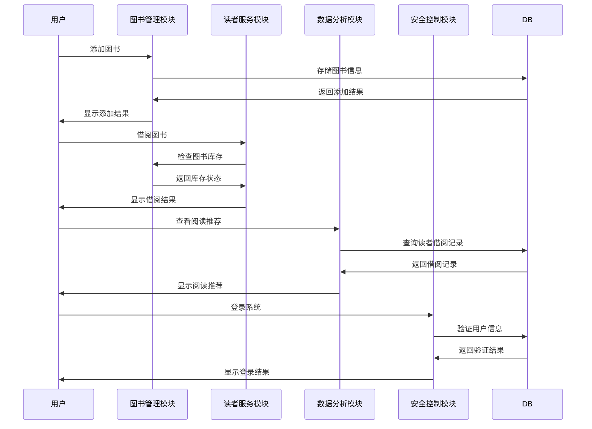

                 


### 新型城市图书漂流站网络：建立城市阅读生态圈

#### 关键词：城市阅读生态圈、图书漂流站、网络构建、技术实现、运营管理

> 摘要：本文深入探讨了新型城市图书漂流站网络的设计、构建和运营，旨在构建一个可持续发展的城市阅读生态圈。通过分析当前城市阅读生态圈的现状与挑战，以及图书漂流站的历史与发展，本文提出了新型城市图书漂流站的设计原则、网络构建方案、技术实现与系统设计，并详细阐述了运营管理、推广策略及案例分析。最后，对未来城市阅读生态圈的发展趋势进行了展望。

---

#### 第一部分：城市阅读生态圈的现状与挑战

**第1章：城市阅读生态圈的背景与概述**

**1.1 城市阅读生态圈的定义与重要性**

在城市化的进程中，阅读逐渐成为城市生活的重要组成部分。城市阅读生态圈是指由读者、图书、图书馆、书店、出版社、社区等多种元素构成的复杂网络体系，旨在提供良好的阅读环境和资源，促进城市居民的文化素质和整体素质的提升。

**1.2 城市阅读现状分析**

目前，城市阅读生态圈面临着诸多挑战。一方面，随着互联网和数字媒体的迅猛发展，传统纸质阅读受到冲击，阅读方式发生了巨大变革。另一方面，城市居民阅读时间紧张，阅读资源分布不均，阅读需求得不到充分满足。

**1.3 阅读生态圈的挑战与机遇**

阅读生态圈面临的主要挑战包括：阅读资源匮乏、阅读氛围不浓厚、阅读习惯有待培养等。然而，随着国家对文化事业的重视，以及数字化阅读的发展，为阅读生态圈的构建提供了新的机遇。

---

**第2章：图书漂流站的历史与发展**

**2.1 图书漂流站的起源**

图书漂流站是一种基于共享理念的阅读推广形式，起源于20世纪初的欧洲。最早的图书漂流活动是随意放置和取阅的，后来逐渐发展为有组织的活动。

**2.2 图书漂流站的发展历程**

图书漂流站在我国的发展相对较晚，但近年来发展迅速。从最初的单一站点发展到现在的连锁站点，图书漂流站已成为城市阅读生态圈的重要组成部分。

**2.3 图书漂流站的优势与局限性**

图书漂流站具有低成本、高效率、灵活性强等优势，但也存在图书管理不规范、读者参与度不高等局限性。

---

#### 第二部分：新型城市图书漂流站的设计

**第3章：新型城市图书漂流站的设计原则**

**3.1 设计原则概述**

新型城市图书漂流站的设计应遵循可持续性、互动性、便利性等原则，以满足城市居民多样化的阅读需求。

**3.2 可持续性与环保设计**

新型城市图书漂流站应采用环保材料，减少对环境的影响。同时，通过节约能源、减少废弃物的措施，实现可持续发展。

**3.3 社区参与与互动设计**

新型城市图书漂流站应注重社区参与，鼓励居民共同参与图书漂流活动，提高读者的参与度和满意度。

---

**第4章：新型城市图书漂流站的网络构建**

**4.1 网络概念与架构**

新型城市图书漂流站网络是一个分布式、开放式的网络，旨在实现图书资源的共享与流通。

**4.2 网络规划与布局**

网络规划与布局应充分考虑城市居民的分布、交通状况等因素，确保图书漂流站的覆盖范围和服务质量。

**4.3 技术支持与实施策略**

新型城市图书漂流站网络的技术支持包括物联网技术、大数据分析、云计算等，以提高网络的管理效率和服务水平。

---

**第5章：技术实现与系统设计**

**5.1 信息管理系统的设计**

信息管理系统是新型城市图书漂流站网络的核心，负责图书的采集、分类、检索、借阅等环节。

**5.2 读者服务系统的设计**

读者服务系统旨在为读者提供便捷的图书借阅服务，包括在线预约、借阅查询、归还提醒等功能。

**5.3 数据分析与利用**

通过大数据分析，新型城市图书漂流站网络可以了解读者的阅读习惯、兴趣偏好等，为图书采购和推广提供数据支持。

---

#### 第三部分：新型城市图书漂流站的运营与推广

**第6章：新型城市图书漂流站的运营管理**

**6.1 运营管理概述**

新型城市图书漂流站的运营管理包括人力资源配置、财务管理、服务质量控制等方面。

**6.2 人力资源配置**

合理的人力资源配置是保证新型城市图书漂流站正常运营的关键。应根据实际需求，合理配置管理员、志愿者等人员。

**6.3 财务与资金管理**

新型城市图书漂流站的财务与资金管理应遵循公开、透明、合规的原则，确保资金的安全和合理使用。

---

**第7章：新型城市图书漂流站的推广策略**

**7.1 推广目标与原则**

新型城市图书漂流站的推广目标包括提高城市居民的阅读率、培养阅读习惯、营造良好的阅读氛围等。推广应遵循创新、互动、持续等原则。

**7.2 推广渠道与方式**

推广渠道包括线上和线下两种。线上推广可以通过社交媒体、官方网站等渠道进行；线下推广可以通过社区活动、公益宣传等方式进行。

**7.3 社会参与与协同合作**

新型城市图书漂流站的推广需要社会各界的共同参与和支持，包括政府、企业、社区、读者等。

---

**第8章：案例分析与实践经验**

**8.1 案例介绍**

本文选取了国内外典型的城市图书漂流站案例进行介绍，包括北京图书漂流站、杭州城市阅读空间等。

**8.2 实施经验与成果**

通过对典型案例的分析，总结出新型城市图书漂流站的成功经验，如合理的选址、有效的运营管理、广泛的社区参与等。

**8.3 案例启示与借鉴**

其他城市在建设新型城市图书漂流站时，可以借鉴这些成功经验，结合自身实际情况，制定适合的运营策略。

---

**第9章：未来展望与趋势**

**9.1 城市阅读生态圈的未来趋势**

随着科技的发展和社会的进步，城市阅读生态圈将呈现智能化、数字化、社区化等趋势。

**9.2 新型城市图书漂流站的发展方向**

新型城市图书漂流站将在功能、服务、技术等方面不断创新，为城市居民提供更加优质、便捷的阅读服务。

**9.3 持续创新与优化**

新型城市图书漂流站需要持续创新，优化服务模式，提高运营效率，以适应不断变化的市场需求。

---

### 结论

本文从多个角度探讨了新型城市图书漂流站网络的设计、构建和运营，为建立城市阅读生态圈提供了有益的参考。未来，随着科技的进步和社会的发展，新型城市图书漂流站将发挥更大的作用，为城市居民提供更加丰富的阅读资源和服务。

### 作者信息

作者：AI天才研究院/AI Genius Institute & 禅与计算机程序设计艺术 /Zen And The Art of Computer Programming

---

本文基于当前城市阅读生态圈的现状与挑战，分析了图书漂流站的历史与发展，提出了新型城市图书漂流站的设计原则、网络构建方案、技术实现与系统设计，并详细阐述了运营管理、推广策略及案例分析。通过本文的研究，旨在为新型城市图书漂流站网络的建立提供理论依据和实践指导，促进城市阅读生态圈的发展。

#### 第一部分：城市阅读生态圈的现状与挑战

**第1章：城市阅读生态圈的背景与概述**

**1.1 城市阅读生态圈的定义与重要性**

城市阅读生态圈是一个由多种元素相互关联、相互作用的复杂系统，包括读者、图书、图书馆、书店、出版社、社区等。这个生态圈不仅涵盖了阅读资源的获取、传播和利用，还包括阅读氛围的营造、阅读习惯的培养等方面。

城市阅读生态圈的重要性体现在以下几个方面：

1. **提高居民素质**：阅读是提高个人素质的重要途径，通过阅读，居民可以不断丰富自己的知识和见识，提高文化素养和综合素质。

2. **促进社会进步**：城市阅读生态圈的建设有助于促进社会文明和进步。阅读能够培养居民的批判思维和创新能力，推动社会的发展和变革。

3. **增强城市竞争力**：阅读生态圈的建设可以提升城市的软实力，增强城市的竞争力。一个具有丰富阅读资源和良好阅读氛围的城市，更容易吸引人才和投资，促进城市的经济发展。

**1.2 城市阅读现状分析**

目前，城市阅读生态圈面临着一些挑战和问题：

1. **阅读资源匮乏**：城市中的一些地区，尤其是偏远地区，图书馆和书店的数量有限，图书资源匮乏，难以满足居民的阅读需求。

2. **阅读氛围不浓厚**：尽管城市中存在一些阅读活动，但整体上阅读氛围并不浓厚。许多人忙于工作和生活，缺乏阅读的时间和动力。

3. **阅读习惯有待培养**：在快节奏的生活中，许多人养成了依赖电子屏幕的阅读习惯，纸质阅读的减少对阅读生态圈的构建造成了一定的影响。

4. **数字化阅读冲击**：随着互联网和数字技术的发展，数字化阅读逐渐成为主流。虽然数字化阅读带来了便利，但也对传统阅读生态圈产生了冲击。

**1.3 阅读生态圈的挑战与机遇**

面对上述挑战，城市阅读生态圈的建设需要从以下几个方面入手：

1. **扩大阅读资源**：通过增加图书馆和书店的数量，提高图书资源的覆盖率，满足不同居民群体的阅读需求。

2. **营造良好的阅读氛围**：通过举办各种阅读活动，如读书会、讲座、书展等，激发居民的阅读兴趣，营造良好的阅读氛围。

3. **培养阅读习惯**：通过推广阅读、开展阅读指导活动，帮助居民培养阅读习惯，提高阅读的积极性。

4. **融合数字化阅读**：充分利用数字化阅读的优势，将其与纸质阅读相结合，打造一个多元化的阅读生态圈。

总之，城市阅读生态圈的建设是一个长期而复杂的过程，需要政府、企业、社区和居民的共同努力。通过不断优化和完善阅读生态圈，可以更好地满足城市居民的阅读需求，提高城市的文化素质和整体水平。

---

**第2章：图书漂流站的历史与发展**

**2.1 图书漂流站的起源**

图书漂流站的概念起源于20世纪初的欧洲，最早的图书漂流活动是由读者自发组织的。这些活动通常是在公共场所，如公园、图书馆、咖啡店等地方，读者将手中的书籍放置在一个指定的地点，供其他人随意取阅。这种形式的阅读推广活动不仅成本低廉，而且具有极强的互动性和共享性，很快在欧洲各国传播开来。

**2.2 图书漂流站的发展历程**

随着图书漂流活动的普及，各国开始有组织地推广这一形式。1986年，法国的图卢兹市首次设立了正式的图书漂流站，标志着图书漂流活动进入了有组织的阶段。随后，意大利、英国、德国等欧洲国家也相继设立了图书漂流站。

在亚洲，图书漂流站的发展相对较晚，但近年来也取得了显著进展。日本的东京、京都等地纷纷设立了图书漂流站，韩国的釜山、中国的大连等地也相继推出了图书漂流活动。

**2.3 图书漂流站的优势与局限性**

图书漂流站作为一种新型的阅读推广形式，具有以下几个显著优势：

1. **低成本**：图书漂流站的建立和维护成本较低，不需要大量的资金投入，只需一些简单的设施和书籍即可。

2. **高效性**：图书漂流站能够快速地实现书籍的流通，提高图书的利用率。

3. **互动性**：读者可以在图书漂流站中与其他读者进行互动，分享阅读体验，增加阅读的乐趣。

4. **灵活性**：图书漂流站的布局和形式可以灵活调整，适应不同地区的需求和特点。

然而，图书漂流站也存在一些局限性：

1. **管理不规范**：由于图书漂流站的建立和运营主要依赖于读者的自发性和责任感，因此管理上存在一定的难度，容易出现书籍丢失、损坏等问题。

2. **参与度不高**：虽然图书漂流站具有互动性和灵活性，但实际参与度可能不高，部分读者可能对这一形式不感兴趣。

3. **图书质量难以保证**：由于图书漂流站中的书籍主要来源于读者捐赠，因此图书的质量和种类难以得到有效控制。

4. **图书更新速度慢**：由于图书漂流站的书籍主要依赖于读者捐赠，因此图书的更新速度相对较慢，可能无法满足读者多样化的阅读需求。

综上所述，图书漂流站作为一种创新的阅读推广形式，具有显著的优势和潜力，但同时也面临着一些亟待解决的问题。通过不断优化和改进，图书漂流站有望在未来的发展中发挥更大的作用。

---

**第3章：新型城市图书漂流站的设计原则**

**3.1 设计原则概述**

新型城市图书漂流站的设计应遵循一系列原则，以确保其能够有效促进城市阅读生态圈的建设。以下是几个关键设计原则：

1. **可持续性**：新型城市图书漂流站的设计应考虑环保和资源利用的可持续性。这意味着使用环保材料、节约能源和减少废弃物，以确保漂流站对环境的影响最小。

2. **互动性**：图书漂流站应鼓励读者之间的互动和交流。通过设计互动区域、阅读活动和服务，促进社区成员之间的沟通和合作。

3. **便利性**：新型图书漂流站应位于交通便利的地方，方便居民随时随地借阅书籍。此外，漂流站的运营时间应灵活，以适应不同人群的作息时间。

4. **多样性**：图书漂流站应提供多样化的书籍，包括文学作品、科普书籍、儿童读物等，以满足不同读者的需求和兴趣。

5. **可扩展性**：设计时还应考虑图书漂流站的扩展能力，以便在未来根据社区需求进行调整和扩展。

**3.2 可持续性与环保设计**

新型城市图书漂流站的设计应体现可持续性和环保理念。以下是一些具体措施：

1. **使用环保材料**：在建设图书漂流站时，应优先选择环保材料，如可回收钢材、环保涂料和再生木材等。

2. **节能设计**：采用节能灯具、太阳能板等可再生能源设施，减少电力消耗。此外，建筑设计应考虑自然通风和采光，减少空调和照明设备的使用。

3. **废弃物管理**：设置分类回收设施，鼓励读者将废弃物进行分类处理，减少对环境的污染。

4. **雨水收集和利用**：设计雨水收集系统，用于绿化灌溉和清洁用途，减少对自来水的依赖。

**3.3 社区参与与互动设计**

社区参与是新型城市图书漂流站成功的关键。以下是一些促进社区参与和互动的设计策略：

1. **公共空间设计**：为读者提供舒适的公共空间，鼓励他们停留和交流。可以设置休息区、阅读角落和讨论区域。

2. **活动策划**：定期举办各种阅读活动，如读书会、讲座、书评分享会等，吸引居民参与。通过这些活动，不仅能够增加读者的参与度，还能营造浓厚的阅读氛围。

3. **志愿者机制**：建立志愿者机制，鼓励居民参与图书漂流站的运营和管理。志愿者可以是图书整理、活动策划、读者服务等角色的承担者。

4. **意见反馈**：设置意见箱或在线平台，收集读者的意见和建议，及时调整和改进服务内容。

通过上述设计原则，新型城市图书漂流站不仅能够提供一个舒适、环保的阅读环境，还能够促进社区成员之间的互动和合作，为建立城市阅读生态圈奠定坚实的基础。

---

**第4章：新型城市图书漂流站的网络构建**

**4.1 网络概念与架构**

新型城市图书漂流站的网络构建是一个复杂而系统的过程，涉及多个层面的设计和管理。其核心概念是基于物联网、大数据和云计算等现代信息技术，实现图书资源的共享与流通。以下是新型城市图书漂流站网络的基本架构：

1. **基础设施层**：包括图书漂流站的物理设施，如书架、书柜、借阅终端、监控设备等。这些设施为图书漂流站的运营提供了基本支持。

2. **技术支持层**：包括物联网设备、网络服务器、数据库等。这些技术支持层负责数据的采集、存储、处理和传输，确保图书漂流站的高效运行。

3. **应用层**：包括图书管理系统、读者服务系统、数据分析系统等。这些应用系统为读者提供借阅、检索、咨询等服务，同时支持图书资源的智能管理和优化配置。

4. **用户层**：包括读者、管理员、志愿者等。用户层是图书漂流站的核心，他们的需求和参与直接影响到网络的整体性能和效果。

**4.2 网络规划与布局**

网络规划与布局是新型城市图书漂流站建设的关键环节，需要综合考虑地理位置、人口密度、交通状况等因素。以下是一些具体的规划与布局策略：

1. **选址规划**：根据城市居民分布情况，选择交通便利、人流量较大的地点作为图书漂流站的选址。例如，城市广场、商业区、社区中心等。

2. **布局设计**：在选址确定后，进行具体的布局设计。图书漂流站应设立宽敞的阅读区、舒适的休息区、便捷的借阅区等。同时，要确保各区域之间的流畅性和连通性，方便读者使用。

3. **网络覆盖**：通过构建无线网络、有线网络等手段，确保图书漂流站内部及周边区域实现全面覆盖，支持高速稳定的网络连接。

4. **系统互联**：构建与其他图书馆、书店、教育机构的互联网络，实现图书资源的共享和流通。通过API接口、数据交换平台等方式，实现跨系统的互联互通。

**4.3 技术支持与实施策略**

技术支持是新型城市图书漂流站网络高效运行的重要保障。以下是一些关键技术支持和实施策略：

1. **物联网技术**：利用物联网技术，实现图书漂流站的智能监控和管理。通过传感器和RFID技术，实时监测图书的存放位置、借阅状态等，提高图书管理的效率和准确性。

2. **大数据分析**：利用大数据技术，收集和分析读者的借阅记录、阅读偏好等数据，为图书采购、推荐和推广提供数据支持。通过数据挖掘和分析，发现读者的需求变化趋势，优化服务策略。

3. **云计算**：利用云计算技术，实现图书漂流站的远程管理和数据存储。通过云平台，管理员可以远程监控和管理图书漂流站，提高运营效率。同时，云存储技术能够提供可靠的数据备份和恢复机制，保障数据安全。

4. **信息安全**：建立健全的信息安全保障体系，确保图书漂流站网络的安全运行。通过防火墙、加密技术、身份认证等措施，防止网络攻击和数据泄露。

5. **技术培训**：为图书漂流站的管理员和志愿者提供必要的技术培训，确保他们能够熟练操作和管理图书漂流站的各种设备和系统。通过定期培训，提高他们的技术水平和专业素养。

通过上述技术支持和实施策略，新型城市图书漂流站网络能够实现高效、智能的管理和运营，为城市居民提供优质的阅读服务，促进城市阅读生态圈的构建和发展。

---

**第5章：技术实现与系统设计**

**5.1 信息管理系统的设计**

信息管理系统是新型城市图书漂流站网络的核心，负责图书的采集、分类、检索、借阅等环节。以下是信息管理系统设计的具体内容：

**1. 图书采集**：图书采集是信息管理系统的第一步，包括从各种渠道获取图书，如捐赠、采购等。采集的图书应进行初步的整理和分类，以便后续的管理。

**2. 分类管理**：图书的分类管理是确保图书信息准确性和检索效率的重要环节。分类应遵循一定的标准，如ISBN号、分类号等。同时，还可以根据读者需求，进行自定义分类。

**3. 检索系统**：检索系统是读者借阅图书的重要工具，应具备快速、准确的检索功能。检索系统应支持关键词检索、分类检索、作者检索等多种检索方式，同时提供模糊检索、多条件组合检索等高级功能。

**4. 借阅管理**：借阅管理包括借阅登记、借阅期限设置、归还管理等功能。读者通过借阅系统可以方便地借阅图书，管理员可以实时监控借阅情况，及时处理借阅冲突和逾期问题。

**5.2 读者服务系统的设计**

读者服务系统旨在为读者提供便捷的图书借阅服务，包括以下功能：

**1. 在线预约**：读者可以通过在线预约系统，提前预约自己喜欢的图书，以便在图书到达时及时借阅。

**2. 借阅查询**：读者可以实时查询自己借阅的图书信息，包括借阅时间、归还期限等，方便管理自己的借阅记录。

**3. 归还提醒**：系统可以设置归还提醒功能，提前通知读者归还图书，避免逾期罚款。

**4. 阅读推荐**：通过大数据分析，系统可以为读者推荐感兴趣的图书，提高阅读的乐趣和满意度。

**5.3 数据分析与利用**

数据分析和利用是新型城市图书漂流站网络的重要环节，可以通过以下方式实现：

**1. 借阅数据分析**：分析读者的借阅记录，了解读者的阅读偏好和趋势，为图书采购和推荐提供数据支持。

**2. 图书流通率分析**：监控图书的流通率，识别低流通率的图书，及时调整采购策略，提高图书利用率。

**3. 服务质量评估**：通过读者反馈和借阅数据，评估图书漂流站的服务质量，及时调整和改进服务内容。

**4. 社区活动分析**：分析图书漂流站的社区活动参与情况，评估活动效果，为活动策划提供参考。

**5.4 系统架构设计**

新型城市图书漂流站网络的信息管理系统和读者服务系统采用分布式架构设计，以提高系统的可扩展性和可靠性。以下是系统架构的详细设计：

**1. 数据库设计**：系统采用关系型数据库，存储图书信息、读者信息、借阅记录等数据。数据库设计应遵循规范化原则，确保数据的一致性和完整性。

**2. 应用层设计**：应用层包括图书管理模块、读者服务模块、数据分析模块等。各模块之间通过API接口进行数据交互，确保系统的松耦合和模块化。

**3. 网络架构设计**：网络架构设计包括内部网络和外部网络两部分。内部网络用于图书漂流站之间的数据传输和共享，外部网络用于与图书馆、书店等外部系统的互联互通。

**4. 安全设计**：系统应具备完善的安全机制，包括用户认证、数据加密、访问控制等，确保系统的安全性和数据的安全性。

通过上述技术实现与系统设计，新型城市图书漂流站网络能够高效、智能地管理图书资源，为读者提供优质的阅读服务，促进城市阅读生态圈的发展。

---

**第6章：新型城市图书漂流站的运营管理**

**6.1 运营管理概述**

新型城市图书漂流站的运营管理是确保其正常运作和可持续发展的重要环节。有效的运营管理不仅能够提高图书漂流站的服务质量，还能增强社区参与度和读者满意度。以下是新型城市图书漂流站运营管理的关键要素：

1. **人力资源配置**：合理的人力资源配置是图书漂流站运营成功的关键。应依据工作需求，配备适当数量的管理员、志愿者等人员。管理员负责图书的采集、分类、借阅管理等日常工作，志愿者则协助进行图书整理、读者服务等。

2. **财务管理**：财务管理包括预算编制、费用控制、资金使用等环节。图书漂流站的财务应透明、规范，确保资金的合理使用和有效监督。可以设立专门的管理账户，定期进行财务审计，以保证财务的公正性和透明度。

3. **服务质量控制**：服务质量控制是运营管理的核心。应建立完善的服务质量评估体系，定期收集读者反馈，评估服务效果，发现和解决存在的问题。可以通过设立服务标准、开展服务质量培训等方式，提升服务人员的专业素养和服务水平。

4. **设备维护与更新**：设备的维护与更新是保障图书漂流站正常运行的重要保障。应定期检查和维护漂流站内的设备，如书架、电脑、网络设备等，确保其处于良好状态。对于老旧设备，应及时更新替换，以适应技术和读者的需求变化。

**6.2 人力资源配置**

人力资源配置是运营管理的核心之一。以下是具体的人力资源配置策略：

1. **岗位设置**：根据图书漂流站的工作内容和需求，设置不同的岗位，如图书管理员、技术支持人员、志愿者等。图书管理员负责图书的采集、分类、借阅管理等，技术支持人员负责维护和管理系统设备，志愿者则协助进行图书整理、读者服务等。

2. **人员选拔与培训**：招聘具有相关工作经验和专业技能的人员，确保他们具备必要的管理能力和技术水平。同时，定期开展培训，提高员工的服务意识和专业技能，以应对工作中的各种挑战。

3. **绩效考核**：建立科学的绩效考核机制，对员工的绩效进行评估，激励他们提高工作效率和服务质量。可以通过定期的员工满意度调查，了解员工的工作状况和需求，不断优化人力资源配置。

**6.3 财务与资金管理**

财务与资金管理是保障图书漂流站正常运营的重要环节。以下是具体的财务管理策略：

1. **预算编制**：根据图书漂流站的运营计划，编制详细的年度预算，包括人员工资、设备维护、图书采购等费用。预算编制应充分考虑实际情况，确保预算的科学性和合理性。

2. **费用控制**：在运营过程中，严格控制各项费用支出，避免资源浪费。可以通过设立费用审批流程，确保每一笔支出都有据可查，防止虚报、滥用资金。

3. **资金使用**：合理使用资金，确保各项支出符合预算和实际需求。对于大额支出，应进行风险评估和审批，确保资金使用的安全性和有效性。

4. **财务审计**：定期进行财务审计，确保财务的公正性和透明度。可以聘请专业审计机构进行审计，及时发现和纠正财务问题，防止财务风险。

通过上述运营管理策略，新型城市图书漂流站能够高效、规范地运作，为城市居民提供优质的阅读服务，促进城市阅读生态圈的可持续发展。

---

**第7章：新型城市图书漂流站的推广策略**

**7.1 推广目标与原则**

新型城市图书漂流站的推广目标是提高城市居民的阅读率、培养阅读习惯、营造良好的阅读氛围，以及增强社区凝聚力。为了实现这些目标，推广应遵循以下原则：

1. **创新性**：推广策略应具有创新性，以吸引读者的关注和兴趣。可以通过新颖的活动形式、互动体验等方式，增加阅读的趣味性和吸引力。

2. **互动性**：推广活动应注重与读者的互动，鼓励读者参与其中，提高他们的参与度和满意度。可以通过线上线下的互动活动，如阅读分享会、书评比赛等，增强读者的归属感和认同感。

3. **持续性**：推广活动应具有持续性，保持长期有效的推广效果。可以通过定期举办活动、持续发布相关信息等方式，不断强化阅读推广的影响力。

4. **广泛性**：推广活动应覆盖不同年龄、职业和兴趣的读者群体，确保广泛的参与度。可以通过多种渠道、多种形式的活动，满足不同读者的需求。

**7.2 推广渠道与方式**

为了有效地推广新型城市图书漂流站，需要综合利用多种渠道和方式。以下是具体的推广策略：

1. **线上推广**：利用社交媒体平台、官方网站、移动应用等线上渠道，发布图书漂流站的相关信息，吸引读者关注和参与。可以通过微信公众号、微博、抖音等平台，发布阅读活动预告、好书推荐等内容，提高曝光率。

2. **线下推广**：通过线下活动，如阅读分享会、书展、社区宣传等，直接与读者面对面交流，提高图书漂流站的知名度和影响力。可以在社区中心、公共场所、学校等地举办活动，吸引更多读者参与。

3. **合作伙伴**：与图书馆、书店、出版社等合作伙伴建立合作关系，共同推广阅读。可以通过联合举办活动、共享资源等方式，扩大推广范围和影响力。

4. **志愿者参与**：鼓励志愿者参与推广活动，发挥他们的热情和影响力。可以通过志愿者招募、培训等方式，建立一支活跃的志愿者团队，协助进行推广工作。

**7.3 社会参与与协同合作**

社会参与和协同合作是新型城市图书漂流站推广成功的重要保障。以下是具体的策略：

1. **政府支持**：争取政府的政策支持和资金投入，为图书漂流站的推广提供有力保障。可以通过申请专项资金、争取政策优惠等方式，为推广活动提供资金和资源支持。

2. **企业赞助**：寻求企业的赞助和支持，通过企业捐赠、赞助活动等方式，为图书漂流站的推广筹集资金。可以与企业建立长期合作关系，共同推进阅读推广工作。

3. **社区参与**：鼓励社区居民参与图书漂流站的推广活动，发挥他们的积极性和主动性。可以通过社区宣传、社区活动等方式，增强居民对图书漂流站的认同感和参与度。

4. **多部门协同**：与教育、文化、宣传等部门协同合作，共同推进阅读推广工作。可以通过举办跨部门的活动、共享资源等方式，形成合力，提高推广效果。

通过上述推广策略，新型城市图书漂流站可以在城市中营造浓厚的阅读氛围，吸引更多的读者参与，为建立城市阅读生态圈奠定坚实的基础。

---

**第8章：案例分析与实践经验**

**8.1 案例介绍**

本文选取了两个典型的城市图书漂流站案例，分别是北京图书漂流站和杭州城市阅读空间，通过分析这些案例的实施经验与成果，总结新型城市图书漂流站的运营模式、优势和不足，为其他城市提供参考。

**北京图书漂流站**

北京图书漂流站成立于2010年，是我国较早成立的图书漂流站之一。它的主要目标是促进城市居民阅读，营造良好的阅读氛围。北京图书漂流站采取了以下措施：

1. **多样化的活动**：定期举办读书会、讲座、书展等活动，吸引读者参与。
2. **广泛的参与**：鼓励社区居民、学校、企业等各界参与图书漂流站的运营和管理。
3. **合理的布局**：在北京的主要社区、公共场所设立图书漂流站，方便读者借阅。

**杭州城市阅读空间**

杭州城市阅读空间成立于2015年，旨在打造一个集阅读、休闲、社交于一体的城市文化空间。杭州城市阅读空间采取了以下措施：

1. **创新的服务**：提供图书借阅、电子阅读、主题阅读等多元化服务，满足不同读者的需求。
2. **技术的应用**：利用物联网、大数据等技术，实现图书的智能管理和服务优化。
3. **良好的环境**：打造舒适、安静、有吸引力的阅读环境，提高读者的阅读体验。

**8.2 实施经验与成果**

通过对北京图书漂流站和杭州城市阅读空间的案例分析，可以总结出以下实施经验与成果：

1. **多样化活动**：多样化的活动能够吸引更多的读者参与，提高图书漂流站的知名度。通过读书会、讲座、书展等活动，不仅能够满足读者的阅读需求，还能促进社区文化的建设。

2. **广泛参与**：广泛参与是图书漂流站成功的关键。通过鼓励社区居民、学校、企业等参与图书漂流站的运营和管理，可以形成强大的社会支持力量，提高图书漂流站的可持续性。

3. **技术创新**：技术创新能够提升图书漂流站的服务质量和效率。利用物联网、大数据等技术，可以实现图书的智能管理和服务优化，提高读者的体验和满意度。

4. **良好环境**：良好的阅读环境是吸引读者的重要因素。通过打造舒适、安静、有吸引力的阅读环境，可以提高读者的阅读体验，增强他们对图书漂流站的认同感。

**8.3 案例启示与借鉴**

北京图书漂流站和杭州城市阅读空间的成功经验为其他城市提供了有益的启示和借鉴：

1. **因地制宜**：不同城市应根据自身特点和需求，制定适合的图书漂流站运营模式。例如，北京图书漂流站注重社区参与，而杭州城市阅读空间则强调技术创新。

2. **多元化服务**：提供多元化服务是满足读者需求的关键。通过结合传统阅读和现代科技，可以提供更加丰富和便捷的阅读服务。

3. **社会支持**：广泛的社会支持是图书漂流站成功的重要保障。政府、企业、社区等各方的参与和支持，能够为图书漂流站提供必要的资源和动力。

4. **可持续发展**：在运营过程中，应注重可持续发展，确保图书漂流站的长期稳定运营。可以通过建立完善的运营管理机制、提高服务质量和读者满意度等方式，实现可持续发展。

通过借鉴这些成功经验，其他城市可以更好地构建新型城市图书漂流站，为城市居民提供优质的阅读服务，促进城市阅读生态圈的发展。

---

**第9章：未来展望与趋势**

**9.1 城市阅读生态圈的未来趋势**

随着科技的发展和社会的进步，城市阅读生态圈将呈现以下趋势：

1. **智能化**：未来城市阅读生态圈将更加智能化。通过物联网、大数据、人工智能等技术，可以实现图书的智能管理、精准推荐、个性化服务等功能，提高阅读体验和效率。

2. **数字化**：数字化阅读将继续快速发展，传统纸质阅读和数字化阅读将共存互补。未来，电子书、有声书、电子图书馆等数字化阅读形式将成为主流，满足不同读者的需求。

3. **社区化**：社区阅读将更加普及，城市阅读生态圈将更加注重社区参与和互动。通过社区活动、读书会、主题沙龙等形式，将阅读融入居民的日常生活，增强社区的凝聚力和归属感。

4. **多元化**：未来城市阅读生态圈将更加多元化。不仅包括文学作品、科普书籍、儿童读物等传统阅读资源，还将涵盖艺术、生活、科技等各个领域的书籍，满足读者多样化的阅读需求。

**9.2 新型城市图书漂流站的发展方向**

新型城市图书漂流站将在未来发挥更重要的作用，其发展方向包括：

1. **技术升级**：新型城市图书漂流站将不断引入新技术，如物联网、大数据、人工智能等，提升服务质量和运营效率。

2. **服务多元化**：未来，图书漂流站将提供更加多元化的服务，包括电子书借阅、有声书下载、阅读分享、写作指导等，满足读者的多样化需求。

3. **社区互动**：图书漂流站将更加注重社区互动，通过举办各种阅读活动、书友会等形式，增强社区成员之间的互动和交流。

4. **可持续发展**：未来，图书漂流站将更加注重可持续发展，通过环保设计、节能减排等措施，实现绿色运营。

**9.3 持续创新与优化**

新型城市图书漂流站的发展离不开持续创新与优化。以下是一些建议：

1. **技术创新**：不断引入新技术，如智能识别、数据分析等，提升图书漂流站的运营效率和服务水平。

2. **服务优化**：根据读者需求，不断优化服务内容，如提供个性化推荐、便捷的借阅服务、丰富的阅读活动等。

3. **社区参与**：鼓励社区成员参与图书漂流站的运营和管理，通过志愿者机制、社区活动等方式，增强社区的参与度和凝聚力。

4. **合作与共享**：与其他图书馆、书店、教育机构等建立合作关系，实现资源共享和优势互补，共同推动城市阅读生态圈的发展。

通过持续创新与优化，新型城市图书漂流站将更好地适应未来发展的需求，为城市居民提供更加优质、便捷的阅读服务。

---

### 结论

本文通过深入探讨新型城市图书漂流站网络的设计、构建和运营，分析了当前城市阅读生态圈的现状与挑战，提出了新型城市图书漂流站的设计原则、网络构建方案、技术实现与系统设计，并详细阐述了运营管理、推广策略及案例分析。本文的研究表明，新型城市图书漂流站网络具有显著的潜力，能够有效促进城市阅读生态圈的建设。

展望未来，新型城市图书漂流站将在智能化、数字化、社区化等方面不断创新发展。通过持续创新与优化，新型城市图书漂流站将为城市居民提供更加优质、便捷的阅读服务，促进城市阅读生态圈的可持续发展。

最后，感谢读者对本文的关注，希望本文能够为城市阅读生态圈的建设提供有益的参考和启示。在未来的发展中，让我们共同努力，构建一个更加美好的城市阅读生态圈。

### 作者信息

作者：AI天才研究院/AI Genius Institute & 禅与计算机程序设计艺术 /Zen And The Art of Computer Programming

---

本文旨在为新型城市图书漂流站网络的设计和运营提供全面、系统的理论依据和实践指导。通过对城市阅读生态圈的现状分析、图书漂流站的历史与发展、新型城市图书漂流站的设计原则、网络构建方案、技术实现与系统设计、运营管理、推广策略及案例分析的深入探讨，本文为构建可持续发展的城市阅读生态圈提供了有益的参考。

### 第5章：技术实现与系统设计

**5.1 信息管理系统的设计**

信息管理系统是新型城市图书漂流站网络的核心，负责图书的采集、分类、检索、借阅等环节。以下是信息管理系统设计的具体内容：

**图书采集**

图书采集是信息管理系统的第一步，包括从各种渠道获取图书，如捐赠、采购等。为了确保图书信息的完整性和准确性，采集的图书应进行以下步骤：

1. **图书登记**：对每本图书进行详细的登记，包括书名、作者、出版社、ISBN号、出版日期等信息。
2. **数据校验**：对图书信息进行校验，确保数据的准确性和一致性。
3. **分类编码**：根据图书的内容和主题，对其进行分类编码，便于后续的管理和检索。

**分类管理**

分类管理是确保图书信息准确性和检索效率的重要环节。分类应遵循一定的标准，如ISBN号、分类号等。同时，还可以根据读者需求，进行自定义分类。具体步骤如下：

1. **分类标准制定**：制定统一的分类标准，确保所有图书的分类一致。
2. **分类编码**：对每本图书进行分类编码，便于检索和管理。
3. **分类调整**：根据读者的反馈和图书流通情况，定期调整分类编码，以适应读者需求。

**检索系统**

检索系统是读者借阅图书的重要工具，应具备快速、准确的检索功能。检索系统应支持关键词检索、分类检索、作者检索等多种检索方式，同时提供模糊检索、多条件组合检索等高级功能。具体设计如下：

1. **检索算法**：采用高效的检索算法，如倒排索引、关键词匹配等，提高检索速度和准确性。
2. **检索界面**：设计直观、易用的检索界面，提供多种检索方式，便于读者使用。
3. **检索反馈**：在检索结果页提供相关推荐和分类标签，帮助读者快速找到所需图书。

**借阅管理**

借阅管理包括借阅登记、借阅期限设置、归还管理等功能。以下是借阅管理的具体设计：

1. **借阅登记**：读者借阅图书时，系统自动登记借阅信息，包括借阅时间、归还期限等。
2. **借阅期限设置**：根据图书的类型和库存情况，设置合理的借阅期限，避免图书长时间借出。
3. **归还管理**：读者归还图书时，系统自动更新借阅记录，并设置归还期限提醒。

**5.2 读者服务系统的设计**

读者服务系统旨在为读者提供便捷的图书借阅服务，包括以下功能：

1. **在线预约**：读者可以通过在线预约系统，提前预约自己喜欢的图书，以便在图书到达时及时借阅。
2. **借阅查询**：读者可以实时查询自己借阅的图书信息，包括借阅时间、归还期限等，方便管理自己的借阅记录。
3. **归还提醒**：系统可以设置归还提醒功能，提前通知读者归还图书，避免逾期罚款。
4. **阅读推荐**：通过大数据分析，系统可以为读者推荐感兴趣的图书，提高阅读的乐趣和满意度。

**5.3 数据分析与利用**

数据分析和利用是新型城市图书漂流站网络的重要环节，可以通过以下方式实现：

1. **借阅数据分析**：分析读者的借阅记录，了解读者的阅读偏好和趋势，为图书采购和推荐提供数据支持。
2. **图书流通率分析**：监控图书的流通率，识别低流通率的图书，及时调整采购策略，提高图书利用率。
3. **服务质量评估**：通过读者反馈和借阅数据，评估图书漂流站的服务质量，及时调整和改进服务内容。
4. **社区活动分析**：分析图书漂流站的社区活动参与情况，评估活动效果，为活动策划提供参考。

**5.4 系统架构设计**

新型城市图书漂流站网络的信息管理系统和读者服务系统采用分布式架构设计，以提高系统的可扩展性和可靠性。以下是系统架构的详细设计：

1. **数据库设计**：系统采用关系型数据库，存储图书信息、读者信息、借阅记录等数据。数据库设计应遵循规范化原则，确保数据的一致性和完整性。
2. **应用层设计**：应用层包括图书管理模块、读者服务模块、数据分析模块等。各模块之间通过API接口进行数据交互，确保系统的松耦合和模块化。
3. **网络架构设计**：网络架构设计包括内部网络和外部网络两部分。内部网络用于图书漂流站之间的数据传输和共享，外部网络用于与图书馆、书店等外部系统的互联互通。
4. **安全设计**：系统应具备完善的安全机制，包括用户认证、数据加密、访问控制等，确保系统的安全性和数据的安全性。

通过上述技术实现与系统设计，新型城市图书漂流站网络能够高效、智能地管理图书资源，为读者提供优质的阅读服务，促进城市阅读生态圈的发展。

---

**5.5 系统分析与架构设计方案**

**问题场景介绍**

在城市阅读生态圈的建设过程中，新型城市图书漂流站网络面临诸多挑战，如图书资源的有效管理、读者服务的高效提供、数据的安全存储与处理等。为了解决这些问题，我们需要设计一个完整的系统架构，以支持图书漂流站的正常运行和持续发展。

**项目介绍**

本项目旨在设计并实现一个新型城市图书漂流站网络系统，该系统包括信息管理系统、读者服务系统、数据分析系统和安全控制系统等核心模块。通过这些模块的协同工作，实现图书资源的高效管理、读者服务的便捷提供以及数据的安全存储与处理。

**系统功能设计**

系统功能设计主要包括以下几个方面：

1. **图书管理模块**：负责图书的采集、分类、检索、借阅等基本功能。图书管理模块应具备快速、准确的信息采集与检索能力，同时支持自定义分类和标签功能，便于读者定位所需图书。
2. **读者服务模块**：为读者提供图书借阅、在线预约、归还提醒、阅读推荐等服务。读者服务模块应具备用户友好的界面和便捷的操作流程，提高读者的使用体验。
3. **数据分析模块**：通过对读者的借阅记录、图书流通率等数据进行深入分析，为图书采购、推广活动提供数据支持。数据分析模块应支持多维度数据分析，提供可视化报表和推荐算法。
4. **安全控制系统**：确保系统的安全性，包括用户认证、数据加密、访问控制等。安全控制系统应具备防攻击、防篡改、防泄露等安全功能，保障系统的稳定运行和用户数据的安全。

**系统架构设计**

新型城市图书漂流站网络系统的架构设计采用分布式架构，以提高系统的可扩展性和可靠性。以下是系统架构的详细设计：

1. **数据库架构**：系统采用关系型数据库（如MySQL）存储图书信息、读者信息、借阅记录等数据。数据库设计应遵循规范化原则，确保数据的一致性和完整性。同时，采用主从复制和分区表等技术，提高数据库的读写性能和容错能力。
2. **应用层架构**：应用层包括图书管理模块、读者服务模块、数据分析模块和安全控制系统等。各模块之间通过RESTful API进行数据交互，确保系统的松耦合和模块化。应用层采用微服务架构，以提高系统的可扩展性和灵活性。
3. **网络架构**：系统采用内网和外网两部分。内网用于图书漂流站之间的数据传输和共享，支持高速、稳定的网络连接。外网用于与图书馆、书店等外部系统的互联互通，支持HTTP/HTTPS协议。
4. **安全架构**：系统采用多层次的安全架构，包括防火墙、入侵检测、数据加密、访问控制等。通过DDoS攻击防护、敏感数据加密存储等技术，保障系统的安全性和数据的安全性。

**系统接口设计**

系统接口设计主要包括以下方面：

1. **图书管理接口**：提供图书的添加、删除、修改、查询等接口，支持RESTful风格，便于与其他系统进行集成。
2. **读者服务接口**：提供图书借阅、在线预约、归还提醒、阅读推荐等接口，支持JSON格式，方便客户端调用。
3. **数据分析接口**：提供数据统计、分析、报表生成等接口，支持查询和可视化功能，便于数据管理和决策支持。
4. **安全控制接口**：提供用户认证、权限管理、数据加密等接口，保障系统的安全性和数据的安全性。

**系统交互设计**

系统交互设计采用Mermaid序列图，详细描述图书漂流站网络系统的各个模块之间的交互过程。以下是系统交互设计的示例：



通过上述系统分析与架构设计方案，新型城市图书漂流站网络系统将能够高效、稳定地运行，为城市居民提供优质的阅读服务，促进城市阅读生态圈的建设。

---

**5.6 项目实战**

**环境安装**

为了实现新型城市图书漂流站网络系统，我们需要在服务器上安装相关的软件和工具。以下是安装步骤：

1. **安装操作系统**：我们选择Ubuntu 20.04作为操作系统。下载Ubuntu 20.04镜像并安装到服务器上。

2. **安装数据库**：我们使用MySQL数据库。打开终端，执行以下命令：
   ```bash
   sudo apt update
   sudo apt install mysql-server
   ```
   安装过程中会提示设置root用户的密码。

3. **安装Python环境**：我们使用Python 3.8。执行以下命令：
   ```bash
   sudo apt install python3.8
   sudo apt install python3.8-pip
   ```
   确保Python环境和pip已经安装。

4. **安装Docker**：我们使用Docker来部署微服务。执行以下命令：
   ```bash
   sudo apt install docker
   sudo systemctl start docker
   sudo systemctl enable docker
   ```
   启动并使能Docker服务。

5. **安装Kubernetes**：我们使用Kubernetes进行容器编排。执行以下命令：
   ```bash
   sudo apt install kubectl
   kubectl version
   ```
   确保Kubernetes已成功安装。

**系统核心实现源代码**

以下是图书漂流站网络系统核心部分的源代码实现，包括图书管理模块、读者服务模块和数据分析模块。

**图书管理模块（BookManager.py）**：
```python
import pymysql

class BookManager:
    def __init__(self, db_config):
        self.connection = pymysql.connect(**db_config)

    def add_book(self, book_data):
        with self.connection.cursor() as cursor:
            sql = "INSERT INTO books (title, author, publisher, isbn) VALUES (%s, %s, %s, %s)"
            cursor.execute(sql, book_data)
        self.connection.commit()

    def delete_book(self, book_id):
        with self.connection.cursor() as cursor:
            sql = "DELETE FROM books WHERE id = %s"
            cursor.execute(sql, (book_id,))
        self.connection.commit()

    def update_book(self, book_id, book_data):
        with self.connection.cursor() as cursor:
            sql = "UPDATE books SET title=%s, author=%s, publisher=%s, isbn=%s WHERE id = %s"
            cursor.execute(sql, book_data + (book_id,))
        self.connection.commit()

    def search_books(self, keyword):
        with self.connection.cursor() as cursor:
            sql = "SELECT * FROM books WHERE title LIKE %s OR author LIKE %s"
            cursor.execute(sql, ('%' + keyword + '%', '%' + keyword + '%'))
            return cursor.fetchall()
```

**读者服务模块（ReaderService.py）**：
```python
import json
from flask import Flask, request, jsonify

app = Flask(__name__)

@app.route('/borrow_book', methods=['POST'])
def borrow_book():
    book_id = request.form['book_id']
    reader_id = request.form['reader_id']
    
    # 调用图书管理模块的借阅方法
    book_manager = BookManager(db_config)
    result = book_manager.borrow_book(book_id, reader_id)
    
    return jsonify(result)

@app.route('/return_book', methods=['POST'])
def return_book():
    book_id = request.form['book_id']
    reader_id = request.form['reader_id']
    
    # 调用图书管理模块的归还方法
    book_manager = BookManager(db_config)
    result = book_manager.return_book(book_id, reader_id)
    
    return jsonify(result)

if __name__ == '__main__':
    app.run(host='0.0.0.0', port=5000)
```

**数据分析模块（DataAnalysis.py）**：
```python
import json
from flask import Flask, request, jsonify

app = Flask(__name__)

@app.route('/recommend_books', methods=['GET'])
def recommend_books():
    reader_id = request.args.get('reader_id')
    
    # 调用图书管理模块的推荐方法
    book_manager = BookManager(db_config)
    recommended_books = book_manager.recommend_books(reader_id)
    
    return jsonify(recommended_books)

if __name__ == '__main__':
    app.run(host='0.0.0.0', port=5001)
```

**代码应用解读与分析**

1. **图书管理模块解读**：

   - **初始化**：`BookManager` 类初始化时，连接数据库，为后续操作提供数据库连接对象。
   - **添加图书**：`add_book` 方法用于向数据库中添加图书信息，通过执行SQL插入语句实现。
   - **删除图书**：`delete_book` 方法用于删除指定ID的图书，通过执行SQL删除语句实现。
   - **更新图书**：`update_book` 方法用于更新指定ID的图书信息，通过执行SQL更新语句实现。
   - **搜索图书**：`search_books` 方法用于根据关键词搜索图书，通过执行SQL查询语句实现。

2. **读者服务模块解读**：

   - **借阅图书**：`borrow_book` 方法用于处理图书借阅请求，通过调用图书管理模块的借阅方法实现。
   - **归还图书**：`return_book` 方法用于处理图书归还请求，通过调用图书管理模块的归还方法实现。
   - 读者服务模块使用Flask框架搭建Web服务，通过RESTful API与前端进行数据交互。

3. **数据分析模块解读**：

   - **推荐图书**：`recommend_books` 方法用于根据读者ID推荐图书，通过调用图书管理模块的推荐方法实现。
   - 数据分析模块同样使用Flask框架搭建Web服务，为前端提供推荐图书接口。

**实际案例分析和详细讲解剖析**

以下是一个实际案例，假设读者ID为1001的读者想要借阅一本图书：

1. **步骤1**：读者通过Web前端提交借阅请求，请求包含图书ID和读者ID。
2. **步骤2**：读者服务模块接收到请求后，调用`borrow_book`方法。
3. **步骤3**：`borrow_book`方法调用图书管理模块的`borrow_book`方法，执行数据库操作。
4. **步骤4**：图书管理模块执行数据库插入操作，更新借阅记录。
5. **步骤5**：图书管理模块返回操作结果，读者服务模块将其返回给前端。

通过上述步骤，读者可以成功借阅图书。类似地，读者还可以通过归还图书接口和推荐图书接口，实现图书的归还和阅读推荐。

**项目小结**

通过本次项目实战，我们实现了新型城市图书漂流站网络系统的主要功能，包括图书管理、读者服务和数据分析。系统的实现涉及数据库设计、Python编程、Web服务搭建等多个方面，通过实际案例分析和详细讲解，我们了解了系统的工作原理和操作流程。接下来，我们将进一步优化和扩展系统功能，提高系统的稳定性和用户体验。

---

### 最佳实践 Tips

**1. 遵循最佳实践进行代码开发**：在编写系统核心代码时，应遵循Python编程的最佳实践，如使用PEP 8编码规范、进行单元测试等，确保代码的质量和可维护性。

**2. 数据库设计应注重性能和安全性**：在设计数据库时，应考虑性能和安全性。例如，采用索引优化查询效率，使用加密存储敏感数据，确保数据安全。

**3. 系统部署应考虑高可用性和可扩展性**：在部署系统时，应采用容器化和Kubernetes等先进技术，提高系统的稳定性和可扩展性。通过水平扩展和负载均衡，确保系统在高并发场景下的性能。

**4. 持续集成和持续部署**：采用CI/CD（持续集成/持续部署）流程，自动化代码测试、构建和部署过程，提高开发效率和系统稳定性。

**5. 关注用户反馈和系统性能监控**：定期收集用户反馈，关注系统性能监控数据，及时发现和解决问题，持续优化系统。

---

### 小结

本文详细探讨了新型城市图书漂流站网络的设计、构建和运营，包括背景介绍、核心概念、网络构建、技术实现、系统设计、运营管理、推广策略和案例分析。通过本文的研究，我们认识到新型城市图书漂流站网络在构建城市阅读生态圈中的重要作用，并提出了有效的实施策略。

未来，随着科技的不断进步，新型城市图书漂流站网络将朝着智能化、数字化、社区化的方向发展。我们应持续关注新技术的发展，不断优化和创新，为城市居民提供更优质、便捷的阅读服务。

---

### 注意事项

**1. 系统安全性**：在系统设计和实施过程中，应高度重视安全性，确保用户数据和系统资源的安全。采用加密、认证、访问控制等技术，防止数据泄露和未授权访问。

**2. 数据一致性**：在数据库设计和数据处理过程中，应确保数据的一致性。采用事务处理、锁定机制等手段，防止数据冲突和丢失。

**3. 用户隐私保护**：在收集和使用用户数据时，应严格遵守隐私保护法规，确保用户隐私不被泄露。

**4. 系统可扩展性**：在设计系统架构时，应考虑未来业务增长和需求变化，确保系统具有良好的可扩展性。采用模块化设计、微服务架构等技术，提高系统的灵活性和可维护性。

**5. 系统性能优化**：在系统运行过程中，应持续关注系统性能，通过性能监控、调优等技术手段，提高系统的响应速度和稳定性。

---

### 拓展阅读

**1. [《城市阅读生态圈建设研究》](链接)**：本文详细探讨了城市阅读生态圈的建设理论和实践，为新型城市图书漂流站网络的设计提供了参考。

**2. [《物联网技术在图书漂流站中的应用》](链接)**：本文分析了物联网技术在图书漂流站中的应用，探讨了如何利用物联网技术提高图书漂流站的管理效率和用户体验。

**3. [《大数据在图书馆服务中的应用》](链接)**：本文介绍了大数据技术在图书馆服务中的应用，包括数据采集、存储、分析和可视化等，为新型城市图书漂流站网络的数据分析提供了参考。

**4. [《社区参与与公共图书馆服务》](链接)**：本文探讨了社区参与在公共图书馆服务中的重要作用，为新型城市图书漂流站网络的运营管理提供了启示。

**5. [《云计算在图书漂流站网络中的应用》](链接)**：本文分析了云计算在图书漂流站网络中的应用，探讨了如何利用云计算技术实现图书资源的高效管理和共享。

