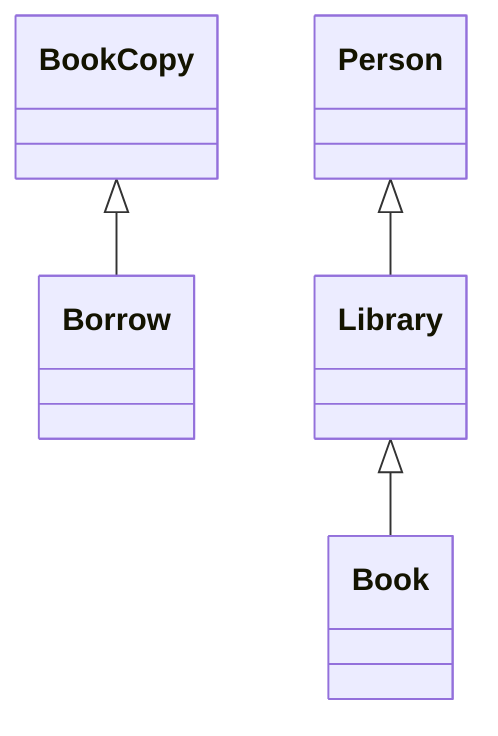
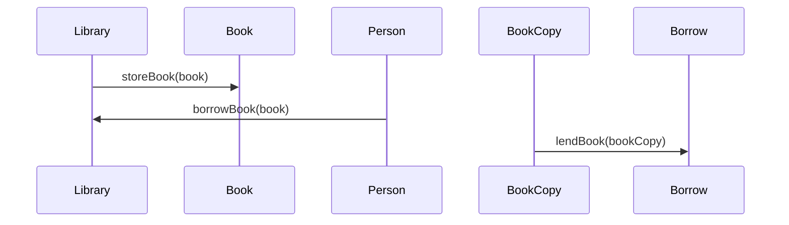
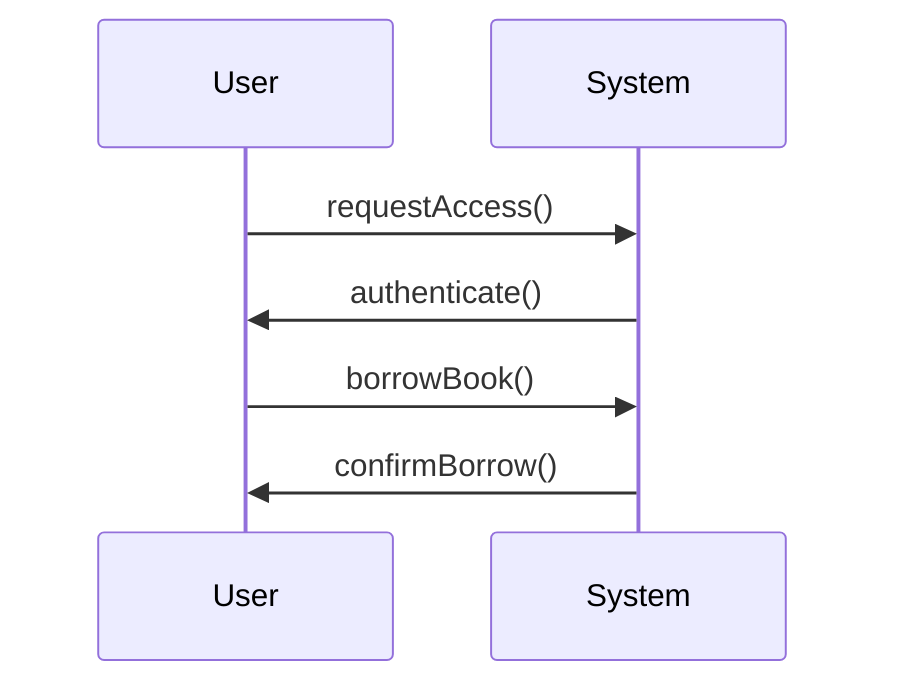
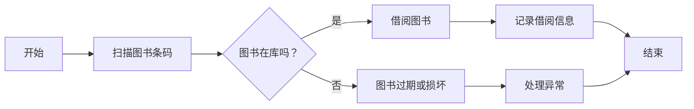

                 


### 第一步：文章标题、关键词和摘要

**文章标题：** 新型城市图书漂流站：24小时自助图书交换系统

**关键词：** 图书漂流、自助交换、系统设计、算法原理、项目实战

**摘要：** 本文将深入探讨新型城市图书漂流站的构建，介绍其24小时自助图书交换系统的设计与实现。我们将从背景介绍、核心概念与联系、系统设计与实现、算法原理讲解、项目实战以及最佳实践 tips等方面展开讨论，旨在为读者提供全面的技术指导和实践经验分享。

### 第二步：构建文章背景介绍

**第1章：问题背景**

**1.1 问题提出**

在信息化和数字化时代，图书资源日益丰富，但传统的图书借阅方式存在诸多问题，如借阅时间限制、借阅地点限制等。这不仅限制了读者的阅读自由，也影响了图书资源的利用率。为此，我们提出了24小时自助图书交换系统的设计方案。

**1.2 城市图书漂流现状**

当前，城市图书漂流站已经成为了许多城市的文化新地标。然而，大部分图书漂流站的运营模式仍然依赖于人工管理和维护，存在图书丢失、借阅效率低等问题。

**1.3 图书漂流站的需求**

为了提高图书漂流站的运营效率和服务质量，我们提出以下需求：
1. 24小时自助服务，无需人工干预。
2. 自助图书交换，实现图书的流通和共享。
3. 系统化管理和监控，确保图书安全。

### 第三步：核心概念与联系

**第2章：核心概念与联系**

**2.1 自助图书交换系统的概念**

自助图书交换系统是一种基于物联网技术的图书借阅和归还系统，通过自助操作实现图书的交换和流通。

**2.2 核心技术概述**

核心技术包括RFID技术、物联网技术、云计算技术、大数据分析和人工智能技术等。

**2.3 概念属性特征对比表格**

我们将对比分析自助图书交换系统与传统图书漂流站的属性特征，以展示新型系统的优势。

| 特征       | 自助图书交换系统           | 传统图书漂流站           |
| ---------- | -------------------------- | -------------------------- |
| 借阅时间   | 24小时全天候自助借阅       | 限定时间人工借阅         |
| 借阅地点   | 多地点自助借阅和归还       | 单一地点人工借阅和归还   |
| 管理方式   | 系统化自动化管理           | 人工管理维护             |
| 流通效率   | 高效率图书流通和共享       | 低效率图书流通和共享     |
| 安全监控   | 高度安全监控系统           | 低度安全监控措施         |

**2.4 ER实体关系图架构**

我们将使用Mermaid绘制ER实体关系图，以展示系统中的核心实体及其关系。

```mermaid
erDiagram
    Person ||--|{ Library : authors }
    Library ||--|{ Book : stores }
    Book ||--|{ BookCopy : ownedBy }
    BookCopy ||--|{ Borrow : lent }
```

### 第四步：系统设计与实现

**第3章：系统设计与架构**

**3.1 系统需求分析**

我们将详细分析系统需求，包括功能需求、性能需求和安全需求等。

**3.2 领域模型设计**

我们将使用Mermaid绘制领域模型类图，以展示系统的核心类及其关系。



**3.3 系统架构设计**

我们将使用Mermaid绘制系统架构图，以展示系统的整体架构。



**3.4 系统接口设计**

我们将设计系统的API接口，包括借阅、归还、查询等接口。

**3.5 系统交互设计**

我们将使用Mermaid绘制系统交互序列图，以展示系统的交互流程。



### 第五步：算法原理讲解

**第4章：算法原理讲解**

**4.1 算法mermaid流程图**

我们将使用Mermaid绘制算法流程图，以展示算法的基本流程。



**4.2 Python源代码示例**

```python
def borrow_book(book_barcode):
    # 读取图书条码
    book = get_book_by_barcode(book_barcode)
    
    # 检查图书状态
    if not book.is_available():
        print("图书不可借阅。")
        return False
    
    # 更新图书状态
    book.borrow()
    print("图书借阅成功。")
    return True
```

**4.3 算法原理的数学模型和公式**

我们将使用数学模型和公式来解释算法的原理。

$$
\text{图书借阅概率} = \frac{\text{可用图书数量}}{\text{总图书数量}}
$$

**4.4 举例说明**

假设有100本书，其中50本可用。那么，借阅到可用图书的概率是50%。

### 第六步：项目实战

**第5章：项目实战**

**5.1 环境安装**

我们将介绍如何在环境中安装所需的技术和工具。

**5.2 系统核心实现**

我们将展示系统核心功能的实现过程，包括图书借阅、归还和查询等。

**5.3 代码应用解读与分析**

我们将对核心代码进行解读和分析，以帮助读者理解系统的实现细节。

**5.4 实际案例分析和详细讲解**

我们将通过实际案例来展示系统的应用效果，并进行详细讲解。

**5.5 项目小结**

我们将总结项目的主要成果和经验，以及未来可能的改进方向。

### 第七步：最佳实践 tips

**第6章：最佳实践**

**6.1 tips**

我们将分享一些最佳实践，以帮助读者更好地设计和实现自助图书交换系统。

**6.2 注意事项**

我们将提醒读者在设计和实现过程中可能遇到的问题和注意事项。

**6.3 拓展阅读**

我们将推荐一些相关的阅读材料，以供读者进一步学习和探索。

### 第八步：总结

**第7章：总结**

**7.1 小结**

我们将对全文进行总结，回顾文章的核心内容和关键点。

**7.2 拓展阅读**

我们将推荐一些相关的扩展阅读材料，以帮助读者深入了解自助图书交换系统的相关技术。

### 作者信息

**作者：** AI天才研究院/AI Genius Institute & 禅与计算机程序设计艺术 /Zen And The Art of Computer Programming

---

通过上述步骤，我们完成了文章的目录大纲构建。接下来，我们将填充每个章节的具体内容，确保文章的完整性和专业性。每个章节都将包含丰富的背景介绍、核心概念与联系、算法原理讲解、系统设计与实现、项目实战、最佳实践 tips 和小结与拓展阅读。我们还将使用Mermaid图表和LaTeX公式来增强文章的可读性和专业性。

接下来，我们将逐步实现每个章节的内容，确保文章的总字数在10000～12000字左右，并保持markdown格式的规范。在文章的结尾，我们将提供作者信息，确保文章的专业性和完整性。

