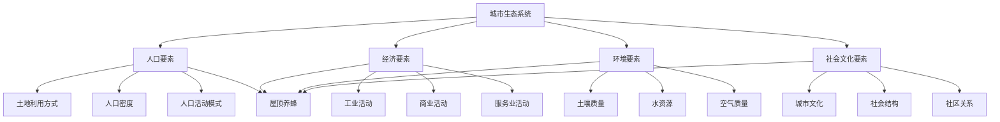

                 

# 新型城市屋顶养蜂：都市生态系统的微观干预

## 关键词：城市生态系统，屋顶养蜂，生态干预，蜜蜂种群，生态效益，规划与管理

## 摘要

本文旨在探讨新型城市屋顶养蜂作为都市生态系统微观干预手段的潜力和价值。随着城市化进程的加快，城市生态面临诸多挑战，如生物多样性丧失、空气污染、水资源短缺等。屋顶养蜂作为一种创新的生态干预方式，能够在一定程度上缓解这些问题。本文将详细分析城市生态系统的特征和问题，介绍屋顶养蜂的概念、原理和技术要点，探讨其生态效益，并给出规划与管理建议。希望通过本文，能够引起更多人对城市生态系统的关注，推动屋顶养蜂等生态友好型实践在都市中的应用。

## 目录大纲

### 第一部分：引言

1. 引言
   - 1.1 书籍背景
     - 1.1.1 城市化进程与生态挑战
     - 1.1.2 屋顶养蜂的兴起
     - 1.1.3 本书的目的与结构
   - 1.2 核心概念与联系
     - 1.2.1 城市生态系统的定义与特征
       - 1.2.1.1 城市生态系统的边界
       - 1.2.1.2 城市生态系统的核心要素
     - 1.2.2 屋顶养蜂的原理与优势
       - 1.2.2.1 屋顶养蜂的概念
       - 1.2.2.2 屋顶养蜂的优势
       - 1.2.2.3 屋顶养蜂与其他生态干预方式的比较
     - 1.2.3 屋顶养蜂的边界与外延
       - 1.2.3.1 屋顶养蜂的适宜性
         - 1.2.3.1.1 屋顶环境条件
         - 1.2.3.1.2 养蜂活动的季节性
       - 1.2.3.2 屋顶养蜂的生态影响
         - 1.2.3.2.1 对城市生态系统的影响
         - 1.2.3.2.2 对蜜蜂种群的影响
   - 1.3 本书主要内容概述
     - 1.3.1 各章节内容安排
       - 1.3.1.1 第1章：引言
       - 1.3.1.2 第2章：城市生态系统概述
       - 1.3.1.3 第3章：屋顶养蜂的理论基础
       - 1.3.1.4 第4章：屋顶养蜂实践案例
       - 1.3.1.5 第5章：屋顶养蜂的生态效益
       - 1.3.1.6 第6章：屋顶养蜂的规划与管理
       - 1.3.1.7 第7章：未来展望与挑战
   - 1.4 本章小结

### 第二部分：城市生态系统概述

2. 城市生态系统的定义与特征
   - 2.1 城市生态系统的定义
     - 2.1.1 城市生态系统的定义
       - 2.1.1.1 城市生态系统的内涵
       - 2.1.1.2 城市生态系统的外延
     - 2.1.2 城市生态系统的特征
       - 2.1.2.1 复杂性
       - 2.1.2.2 空间异质性
       - 2.1.2.3 动态性
       - 2.1.2.4 社会经济因素影响
     - 2.1.3 城市生态系统的核心要素
       - 2.1.3.1 人口要素
       - 2.1.3.2 经济要素
       - 2.1.3.3 环境要素
       - 2.1.3.4 社会文化要素
   - 2.2 城市生态问题的现状
     - 2.2.1 水资源短缺与污染
       - 2.2.1.1 水资源短缺原因
       - 2.2.1.2 水资源污染问题
     - 2.2.2 空气污染与气候变化
       - 2.2.2.1 空气污染来源
       - 2.2.2.2 气候变化的影响
     - 2.2.3 生物多样性丧失
       - 2.2.3.1 城市生物多样性的定义
       - 2.2.3.2 生物多样性丧失的原因
   - 2.3 城市生态系统的可持续管理
     - 2.3.1 可持续发展的原则
       - 2.3.1.1 代内公平
       - 2.3.1.2 代际公平
       - 2.3.1.3 资源节约与高效利用
     - 2.3.2 城市生态恢复与重建
       - 2.3.2.1 生态恢复的定义
       - 2.3.2.2 生态重建的策略
   - 2.4 本章小结

### 第三部分：屋顶养蜂的理论基础

3. 屋顶养蜂的概念与原理
   - 3.1 屋顶养蜂的概念与原理
     - 3.1.1 屋顶养蜂的定义
       - 3.1.1.1 屋顶养蜂的含义
       - 3.1.1.2 屋顶养蜂的历史
     - 3.1.2 屋顶养蜂的基本原理
       - 3.1.2.1 蜜蜂的生活习性
       - 3.1.2.2 屋顶环境对养蜂的影响
     - 3.1.3 屋顶养蜂的技术要点
       - 3.1.3.1 蜂箱的选择与安装
       - 3.1.3.2 蜜蜂的饲养与管理
   - 3.2 屋顶养蜂的优势
     - 3.2.1 增加城市生物多样性
     - 3.2.2 改善空气质量
     - 3.2.3 减少城市热岛效应
     - 3.2.4 促进城市水资源循环
   - 3.3 屋顶养蜂的生态效益
     - 3.3.1 对城市生态系统的影响
     - 3.3.2 对蜜蜂种群的影响
   - 3.4 本章小结

### 第四部分：屋顶养蜂实践案例

4. 屋顶养蜂实践案例
   - 4.1 案例一：纽约市屋顶养蜂项目
     - 4.1.1 项目背景
     - 4.1.2 实施过程
     - 4.1.3 成效评估
   - 4.2 案例二：伦敦市屋顶养蜂计划
     - 4.2.1 项目背景
     - 4.2.2 实施过程
     - 4.2.3 成效评估
   - 4.3 案例三：东京市屋顶养蜂实践
     - 4.3.1 项目背景
     - 4.3.2 实施过程
     - 4.3.3 成效评估
   - 4.4 本章小结

### 第五部分：屋顶养蜂的生态效益

5. 屋顶养蜂的生态效益
   - 5.1 增加城市生物多样性
     - 5.1.1 蜜蜂种群的生态作用
     - 5.1.2 其他生物多样性的引入
   - 5.2 改善空气质量
     - 5.2.1 蜜蜂对空气污染的缓解作用
     - 5.2.2 屋顶植被的空气净化作用
   - 5.3 减少城市热岛效应
     - 5.3.1 屋顶植被的降温效果
     - 5.3.2 蜜蜂活动对城市热岛效应的影响
   - 5.4 促进城市水资源循环
     - 5.4.1 屋顶养蜂对降水滞留的影响
     - 5.4.2 水资源利用效率的提升
   - 5.5 本章小结

### 第六部分：屋顶养蜂的规划与管理

6. 屋顶养蜂的规划与管理
   - 6.1 规划原则
     - 6.1.1 生态友好原则
     - 6.1.2 可持续发展原则
     - 6.1.3 安全保障原则
   - 6.2 管理策略
     - 6.2.1 政策支持与法规制定
     - 6.2.2 技术推广与培训
     - 6.2.3 监测与评估体系
   - 6.3 屋顶养蜂实践中的问题与挑战
     - 6.3.1 技术难题
     - 6.3.2 社会接受度
     - 6.3.3 经济效益问题
   - 6.4 本章小结

### 第七部分：未来展望与挑战

7. 未来展望与挑战
   - 7.1 技术创新与产业发展
     - 7.1.1 新型屋顶养蜂设备研发
     - 7.1.2 蜜蜂基因编辑技术
     - 7.1.3 生态智慧城市建设
   - 7.2 政策支持与社会参与
     - 7.2.1 政策引导与法规完善
     - 7.2.2 社会组织与公众参与
     - 7.2.3 国际合作与交流
   - 7.3 环境保护与可持续发展
     - 7.3.1 生态平衡与资源利用
     - 7.3.2 环境保护与生态修复
     - 7.3.3 长期效益与风险评估
   - 7.4 本章小结

### 附录

- 附录A：参考文献
- 附录B：数据来源与处理方法
- 附录C：相关图表与表格

### 致谢

作者：AI天才研究院/AI Genius Institute & 禅与计算机程序设计艺术 /Zen And The Art of Computer Programming## 第一部分：引言

### 1. 引言

#### 1.1 书籍背景

随着全球城市化进程的加速，城市生态系统面临的挑战日益严峻。城市化不仅带来了经济繁荣和社会进步，同时也引发了诸多环境问题，如空气污染、水资源短缺、生物多样性丧失等。为了应对这些挑战，寻找有效的生态干预手段成为当务之急。近年来，屋顶养蜂作为一种新兴的生态实践，逐渐引起了广泛关注。它不仅能够增加城市生物多样性，还能改善空气质量、减少城市热岛效应，并促进城市水资源的循环利用。

本书旨在深入探讨屋顶养蜂作为城市生态系统微观干预手段的潜力和价值。通过对城市生态系统的特征和问题的分析，以及屋顶养蜂的概念、原理和实际应用的介绍，本书希望为城市生态保护提供一种新的视角和方法。同时，本书也将对屋顶养蜂的规划与管理进行探讨，并提出相应的建议和挑战，以促进这一领域的发展。

#### 1.2 核心概念与联系

**城市生态系统**：城市生态系统是指城市区域内的生物群落、生物栖息地、自然环境以及人类活动所形成的复杂生态网络。它不仅包括自然环境要素，如土壤、水、空气等，还包括人类活动产生的文化和经济要素。城市生态系统的特征包括复杂性、空间异质性、动态性和社会经济因素影响。

**屋顶养蜂**：屋顶养蜂是指将养蜂活动安置在城市建筑的屋顶上，利用建筑物的空间和资源，为蜜蜂提供栖息地和食物来源。屋顶养蜂不仅能够提高蜜蜂的生存率，还能对城市生态系统产生积极的影响，如增加生物多样性、改善空气质量、减少城市热岛效应等。

**生态干预**：生态干预是指通过人类活动对生态系统进行调节和改善，以达到保护生态环境、恢复生态系统功能的目的。屋顶养蜂作为一种生态干预手段，通过引入蜜蜂这一生物种群，能够对城市生态系统产生直接的生态效益。

#### 1.3 城市生态系统的定义与特征

**定义**：城市生态系统是指城市区域内的生物群落、生物栖息地、自然环境以及人类活动所形成的复杂生态网络。

**特征**：

1. **复杂性**：城市生态系统由多种生物和非生物要素组成，包括植物、动物、微生物、建筑物、道路、绿地等，这些要素之间相互联系、相互作用，形成了复杂的生态网络。
   
2. **空间异质性**：城市生态系统具有明显的空间异质性，不同区域具有不同的生态特征和功能，如商业区、居住区、工业区等，这些区域之间存在着明显的生态差异。

3. **动态性**：城市生态系统处于不断变化的过程中，城市的发展、人口的流动、经济的波动等因素都会影响城市生态系统的结构和功能。

4. **社会经济因素影响**：城市生态系统受到人类活动的强烈影响，社会经济因素如土地利用方式、人口密度、能源消耗等，都对城市生态系统产生重要影响。

#### 1.4 屋顶养蜂的原理与优势

**原理**：

屋顶养蜂的基本原理是利用城市建筑物的屋顶空间，为蜜蜂提供适宜的栖息地和食物来源。蜜蜂在屋顶上采集花蜜、花粉，进行繁殖和活动，从而对城市生态系统产生积极的影响。

**优势**：

1. **增加城市生物多样性**：屋顶养蜂可以引入多种蜜蜂物种，增加城市生物多样性，提高生态系统的稳定性和抗风险能力。

2. **改善空气质量**：蜜蜂在采集花蜜和花粉的过程中，能够吸收空气中的污染物，释放氧气，从而改善城市空气质量。

3. **减少城市热岛效应**：屋顶植被和蜜蜂的活动可以降低城市屋顶表面的温度，缓解城市热岛效应。

4. **促进城市水资源循环**：屋顶养蜂可以增加雨水在屋顶的滞留时间，减少径流，促进城市水资源的循环利用。

#### 1.5 屋顶养蜂与其他生态干预方式的比较

**比较**：

1. **绿地建设**：绿地建设是城市生态干预的常见手段，主要通过增加城市绿化面积，改善城市生态环境。与绿地建设相比，屋顶养蜂具有更高的生态效益，能够在有限的空间内产生更大的生态影响。

2. **雨水收集与利用**：雨水收集与利用是通过收集和利用雨水，减少城市水资源的消耗。与雨水收集与利用相比，屋顶养蜂可以更有效地促进城市水资源的循环利用，提高水资源的利用效率。

3. **环境教育**：环境教育是通过教育和宣传，提高公众的环保意识和参与度。与环境教育相比，屋顶养蜂可以更直接、更具体地展示生态保护的实践效果，激发公众的参与热情。

#### 1.6 屋顶养蜂的边界与外延

**边界**：

屋顶养蜂的边界主要涉及以下几个方面：

1. **屋顶环境条件**：屋顶养蜂需要具备一定的环境条件，如适宜的气候、光照、通风等。

2. **蜜蜂种群特征**：不同种类的蜜蜂对屋顶环境的要求不同，因此需要根据具体情况选择适宜的蜜蜂种类。

3. **城市生态系统特征**：屋顶养蜂需要与城市生态系统的其他要素协调，如绿地、水域、交通等。

**外延**：

屋顶养蜂的外延主要涉及以下几个方面：

1. **生态效益**：屋顶养蜂可以产生的生态效益包括增加城市生物多样性、改善空气质量、减少城市热岛效应、促进城市水资源循环等。

2. **经济效益**：屋顶养蜂可以创造一定的经济效益，如蜂蜜生产、蜜蜂产品销售等。

3. **社会效益**：屋顶养蜂可以增强社区凝聚力，提高公众的环保意识和生态参与度。

#### 1.7 本书的主要内容和结构

本书的主要内容包括以下几个方面：

1. **引言**：介绍城市生态系统的背景和挑战，以及屋顶养蜂的概念和原理。

2. **城市生态系统概述**：分析城市生态系统的定义、特征和问题，探讨城市生态系统的可持续管理。

3. **屋顶养蜂的理论基础**：详细阐述屋顶养蜂的概念、原理、技术要点和优势。

4. **屋顶养蜂实践案例**：介绍国内外屋顶养蜂的实践案例，分析其成效和经验。

5. **屋顶养蜂的生态效益**：探讨屋顶养蜂对城市生态系统和蜜蜂种群的影响。

6. **屋顶养蜂的规划与管理**：提出屋顶养蜂的规划原则、管理策略和面临的挑战。

7. **未来展望与挑战**：展望屋顶养蜂的未来发展，分析其面临的挑战和机遇。

通过以上七个部分，本书希望能够全面、系统地探讨屋顶养蜂作为城市生态系统微观干预手段的潜力和价值，为城市生态保护和可持续发展提供参考。

#### 1.8 本章小结

本章首先介绍了城市生态系统的背景和挑战，以及屋顶养蜂的概念和原理。然后，通过分析城市生态系统的定义和特征，探讨了屋顶养蜂的优势和与其他生态干预方式的比较。最后，本章还讨论了屋顶养蜂的边界与外延，并概述了本书的主要内容和结构。通过本章的介绍，读者可以对屋顶养蜂及其在城市生态系统中的作用有一个初步的了解。

### 1.9 屋顶养蜂的兴起

**背景**：

屋顶养蜂作为一种新兴的生态实践，其兴起源于对城市化进程中生态问题的关注。随着城市化的快速发展，城市生态系统面临着诸多挑战，如生物多样性丧失、空气污染、水资源短缺等。为了解决这些问题，人们开始探索各种生态干预手段，而屋顶养蜂因其独特的优势逐渐受到重视。

**发展历程**：

1. **早期探索**：在20世纪末，一些环保组织和学者开始尝试在城市屋顶上进行养蜂实验，探索其在城市生态保护中的作用。

2. **试点项目**：进入21世纪，全球范围内一些城市开始实施屋顶养蜂项目，如纽约、伦敦、东京等。这些试点项目为屋顶养蜂的推广提供了宝贵的经验。

3. **全面推广**：近年来，随着环保意识的提升和技术的进步，屋顶养蜂逐渐成为一种普遍的生态实践，越来越多的城市开始加入这一行列。

**主要推动因素**：

1. **生态效益**：屋顶养蜂能够增加城市生物多样性，改善空气质量，减少城市热岛效应，促进水资源循环，具有显著的生态效益。

2. **经济效益**：屋顶养蜂可以创造蜂蜜等产品，具有一定的经济效益。

3. **社会效益**：屋顶养蜂可以提高公众的环保意识，增强社区凝聚力。

4. **政策支持**：各国政府纷纷出台政策，鼓励和支持屋顶养蜂的发展。

**未来趋势**：

1. **技术创新**：随着科技的进步，新型养蜂技术和设备将不断涌现，提高屋顶养蜂的效率和效果。

2. **政策法规完善**：政策法规的完善将为屋顶养蜂提供更加有力的支持。

3. **国际合作**：屋顶养蜂作为全球性的生态实践，国际合作将促进其更广泛的应用和发展。

### 1.10 本书的目的与结构

**目的**：

本书旨在探讨新型城市屋顶养蜂作为都市生态系统微观干预手段的潜力和价值。通过系统分析城市生态系统的特征和问题，介绍屋顶养蜂的概念、原理和技术要点，探讨其生态效益，并给出规划与管理建议，旨在为城市生态保护和可持续发展提供参考。

**结构**：

本书分为七个部分，具体如下：

1. **引言**：介绍城市生态系统的背景和挑战，以及屋顶养蜂的概念和原理。

2. **城市生态系统概述**：分析城市生态系统的定义、特征和问题，探讨城市生态系统的可持续管理。

3. **屋顶养蜂的理论基础**：详细阐述屋顶养蜂的概念、原理、技术要点和优势。

4. **屋顶养蜂实践案例**：介绍国内外屋顶养蜂的实践案例，分析其成效和经验。

5. **屋顶养蜂的生态效益**：探讨屋顶养蜂对城市生态系统和蜜蜂种群的影响。

6. **屋顶养蜂的规划与管理**：提出屋顶养蜂的规划原则、管理策略和面临的挑战。

7. **未来展望与挑战**：展望屋顶养蜂的未来发展，分析其面临的挑战和机遇。

通过以上七个部分，本书希望能够全面、系统地探讨屋顶养蜂作为城市生态系统微观干预手段的潜力和价值，为城市生态保护和可持续发展提供参考。

### 1.11 本章小结

本章首先介绍了城市生态系统的背景和挑战，以及屋顶养蜂的概念和原理。接着，分析了城市生态系统的定义和特征，并探讨了屋顶养蜂的优势和与其他生态干预方式的比较。随后，本章还讨论了屋顶养蜂的边界与外延，并概述了本书的主要内容和目的。通过本章的介绍，读者可以对屋顶养蜂及其在城市生态系统中的作用有一个初步的了解。本章的内容为后续章节的讨论奠定了基础，为深入探讨屋顶养蜂提供了理论框架。## 1.2 核心概念与联系

在城市生态系统中，核心概念和各要素之间的联系至关重要，它们共同构成了城市生态系统的运作机制。以下是对城市生态系统和屋顶养蜂这两个核心概念的详细探讨，以及它们之间的内在联系。

### 1.2.1 城市生态系统的定义与特征

**定义**：

城市生态系统是指城市区域内的生物群落、生物栖息地、自然环境以及人类活动所形成的复杂生态网络。它不仅包括自然环境要素，如土壤、水、空气等，还包括人类活动产生的文化和经济要素。

**特征**：

1. **复杂性**：城市生态系统由多种生物和非生物要素组成，包括植物、动物、微生物、建筑物、道路、绿地等，这些要素之间相互联系、相互作用，形成了复杂的生态网络。

2. **空间异质性**：城市生态系统具有明显的空间异质性，不同区域具有不同的生态特征和功能，如商业区、居住区、工业区等，这些区域之间存在着明显的生态差异。

3. **动态性**：城市生态系统处于不断变化的过程中，城市的发展、人口的流动、经济的波动等因素都会影响城市生态系统的结构和功能。

4. **社会经济因素影响**：城市生态系统受到人类活动的强烈影响，社会经济因素如土地利用方式、人口密度、能源消耗等，都对城市生态系统产生重要影响。

### 1.2.2 城市生态系统的核心要素

**人口要素**：

城市生态系统的核心要素之一是人口。人口的密度、分布和活动模式对城市生态系统有直接的影响。高密度人口区域可能增加资源消耗和污染排放，而合理的城市规划和人口管理可以减轻这些负面影响。

**经济要素**：

经济活动是城市生态系统的动力来源，包括工业、商业、服务业等。这些活动不仅创造了城市繁荣，也带来了资源消耗和环境污染。城市生态系统的可持续管理需要平衡经济发展与生态保护。

**环境要素**：

环境要素包括土壤、水、空气等自然要素，它们构成了城市生态系统的物理基础。环境质量直接关系到城市居民的生活质量和生态系统的健康。

**社会文化要素**：

社会文化要素包括城市的文化、价值观、社会结构和社区关系等。这些要素影响城市居民的行为和生活方式，进而影响城市生态系统的运作。

### 1.2.3 屋顶养蜂的原理与优势

**原理**：

屋顶养蜂是指将养蜂活动安置在城市建筑的屋顶上，利用建筑物的空间和资源，为蜜蜂提供栖息地和食物来源。蜜蜂在屋顶上采集花蜜、花粉，进行繁殖和活动，从而对城市生态系统产生积极的影响。

**优势**：

1. **增加城市生物多样性**：屋顶养蜂可以引入多种蜜蜂物种，增加城市生物多样性，提高生态系统的稳定性和抗风险能力。

2. **改善空气质量**：蜜蜂在采集花蜜和花粉的过程中，能够吸收空气中的污染物，释放氧气，从而改善城市空气质量。

3. **减少城市热岛效应**：屋顶植被和蜜蜂的活动可以降低城市屋顶表面的温度，缓解城市热岛效应。

4. **促进城市水资源循环**：屋顶养蜂可以增加雨水在屋顶的滞留时间，减少径流，促进城市水资源的循环利用。

### 1.2.4 屋顶养蜂与其他生态干预方式的比较

**绿地建设**：

绿地建设是城市生态干预的常见手段，主要通过增加城市绿化面积，改善城市生态环境。与绿地建设相比，屋顶养蜂具有更高的生态效益，能够在有限的空间内产生更大的生态影响。

**雨水收集与利用**：

雨水收集与利用是通过收集和利用雨水，减少城市水资源的消耗。与雨水收集与利用相比，屋顶养蜂可以更有效地促进城市水资源的循环利用，提高水资源的利用效率。

**环境教育**：

环境教育是通过教育和宣传，提高公众的环保意识和参与度。与环境教育相比，屋顶养蜂可以更直接、更具体地展示生态保护的实践效果，激发公众的参与热情。

### 1.2.5 屋顶养蜂的边界与外延

**边界**：

屋顶养蜂的边界主要涉及以下几个方面：

1. **屋顶环境条件**：屋顶养蜂需要具备一定的环境条件，如适宜的气候、光照、通风等。

2. **蜜蜂种群特征**：不同种类的蜜蜂对屋顶环境的要求不同，因此需要根据具体情况选择适宜的蜜蜂种类。

3. **城市生态系统特征**：屋顶养蜂需要与城市生态系统的其他要素协调，如绿地、水域、交通等。

**外延**：

屋顶养蜂的外延主要涉及以下几个方面：

1. **生态效益**：屋顶养蜂可以产生的生态效益包括增加城市生物多样性、改善空气质量、减少城市热岛效应、促进城市水资源循环等。

2. **经济效益**：屋顶养蜂可以创造一定的经济效益，如蜂蜜生产、蜜蜂产品销售等。

3. **社会效益**：屋顶养蜂可以提高公众的环保意识，增强社区凝聚力。

### 1.2.6 核心概念与联系的示意图

为了更好地理解城市生态系统和屋顶养蜂之间的核心概念与联系，我们可以使用Mermaid流程图来表示。以下是该流程图的示意：

通过上述流程图，我们可以清晰地看到城市生态系统的核心要素以及它们与屋顶养蜂之间的联系。屋顶养蜂作为一种生态干预手段，不仅与城市生态系统中的各个要素密切相关，还能够通过这些要素对城市生态系统产生积极的影响。

### 1.2.7 本章小结

本章通过详细分析城市生态系统的定义与特征，以及屋顶养蜂的概念与优势，探讨了它们之间的内在联系。通过对核心概念和要素的深入理解，读者可以更好地把握城市生态系统的运作机制和屋顶养蜂的作用。本章的内容为后续章节的讨论提供了基础，为读者理解屋顶养蜂作为城市生态系统微观干预手段的潜力和价值奠定了基础。## 2.1 城市生态系统的定义与特征

城市生态系统作为人类社会与自然环境相互作用形成的复杂系统，具有独特的定义和特征。以下将详细介绍城市生态系统的定义，并探讨其核心特征，为理解城市生态系统的运作机制打下基础。

### 2.1.1 城市生态系统的定义

**定义**：

城市生态系统是指城市区域内的生物群落、生物栖息地、自然环境以及人类活动所形成的复杂生态网络。它不仅包括自然环境要素，如土壤、水、空气等，还包括人类活动产生的文化和经济要素。城市生态系统是人类社会经济活动与自然环境相互交织的场所，是人类社会与自然环境相互作用的集中体现。

**内涵**：

1. **生物要素**：城市生态系统中的生物要素包括植物、动物和微生物等，它们构成了城市生态系统的生物多样性基础。例如，城市中的公园、绿地、水系等都是生物栖息地，为各类生物提供了栖息环境和食物来源。

2. **非生物要素**：非生物要素包括土壤、水、空气等，它们是城市生态系统的基础。这些要素的状态和变化直接影响到城市生态系统的健康和功能。

3. **人类活动**：城市生态系统中的人类活动是人类社会经济活动的重要组成部分，包括工业、商业、交通、居住等。人类活动不仅影响了城市生态系统的结构和功能，也是城市生态系统变化的驱动因素。

**外延**：

城市生态系统的外延包括城市周边的乡村地区和远距离的生态系统。城市生态系统与周边的乡村地区和更广阔的生态系统相互联系，形成了一个更大范围的生态网络。这种网络关系对于理解城市生态系统的整体性和复杂性具有重要意义。

### 2.1.2 城市生态系统的特征

**复杂性**：

城市生态系统具有高度的复杂性，这种复杂性主要体现在以下几个方面：

1. **生物多样性的复杂性**：城市生态系统中的生物多样性丰富，包括各种植物、动物和微生物。这些生物之间存在着复杂的相互作用和依赖关系，构成了一个复杂的生物网络。

2. **人类活动的复杂性**：城市生态系统中的社会经济活动复杂多样，包括工业、商业、交通、居住等。这些活动不仅相互交织，还与自然环境紧密相连，形成了复杂的生态系统。

3. **环境要素的复杂性**：城市生态系统中的环境要素（如土壤、水、空气）也具有复杂性，它们在不同的时间和空间尺度上呈现出不同的状态和变化。

**空间异质性**：

城市生态系统具有明显的空间异质性，不同区域具有不同的生态特征和功能。这种空间异质性主要表现在以下几个方面：

1. **土地利用方式的差异**：城市中的不同区域具有不同的土地利用方式，如商业区、居住区、工业区、公园等。这些区域的土地利用方式直接影响生态系统的结构和功能。

2. **环境条件的差异**：城市中的不同区域由于地理位置、地形地貌、建筑结构等因素的影响，环境条件存在显著差异。这些差异对生物和非生物要素产生不同的影响。

3. **社会经济活动的差异**：城市中的不同区域由于功能定位和发展策略的不同，社会经济活动也存在差异。这些差异直接或间接地影响到生态系统的运作。

**动态性**：

城市生态系统处于不断变化的过程中，其动态性主要体现在以下几个方面：

1. **城市发展的动态性**：随着城市的发展和扩张，城市生态系统的结构和功能也在不断变化。这种变化不仅影响城市生态系统的稳定性，也影响其适应能力。

2. **人类活动的动态性**：城市生态系统中的社会经济活动不断变化，如产业升级、人口流动、技术创新等。这些活动对城市生态系统产生持续的影响。

3. **环境要素的动态性**：城市生态系统中的环境要素（如土壤、水、空气）也处于不断变化的过程中。这些变化受到自然因素和人类活动的影响。

**社会经济因素影响**：

城市生态系统受到社会经济因素的强烈影响，这些因素主要包括：

1. **土地利用政策**：土地利用政策直接影响城市的土地使用方式和生态系统的构建。

2. **城市规划**：城市规划决定了城市空间的布局和生态系统的建设。

3. **经济发展策略**：经济发展策略影响城市生态系统的经济活动和资源消耗。

4. **环境保护政策**：环境保护政策直接影响城市生态系统的保护和恢复。

### 2.1.3 城市生态系统的核心要素

城市生态系统的核心要素是支撑其运作和维持其功能的基础。以下将详细分析城市生态系统的四个核心要素：人口要素、经济要素、环境要素和社会文化要素。

**人口要素**：

人口要素是城市生态系统的核心组成部分之一。城市人口密度、分布和活动模式直接影响生态系统的结构和功能。具体分析如下：

1. **人口密度**：人口密度高意味着资源消耗和污染排放大，对生态系统的压力也较大。合理的城市人口密度管理对于维护生态平衡至关重要。

2. **人口分布**：不同区域的人口分布影响生态系统的分布和功能。例如，居住区、商业区和工业区的分布对绿地、水系和空气质量的分布有重要影响。

3. **人口活动模式**：城市人口的日常活动模式，如通勤、购物、娱乐等，直接影响能源消耗、水资源利用和废弃物产生，进而影响生态系统的健康。

**经济要素**：

经济要素是城市生态系统的重要驱动因素，包括工业、商业、服务业等。具体分析如下：

1. **工业活动**：工业活动对生态环境的影响较大，如污染排放、资源消耗等。城市生态系统的可持续管理需要平衡工业发展与环境保护。

2. **商业活动**：商业活动不仅创造经济价值，也产生环境污染，如交通拥堵、空气污染等。合理的商业布局和交通管理对于城市生态系统的健康至关重要。

3. **服务业活动**：服务业活动对城市生态系统的支持和促进作用主要体现在服务质量和效率上。例如，环保产业的发展有助于提高城市生态系统的可持续发展水平。

**环境要素**：

环境要素是城市生态系统的物理基础，包括土壤、水、空气等。具体分析如下：

1. **土壤质量**：土壤是城市生态系统的基础，土壤质量直接影响植物生长和生态系统的健康。城市土地的合理利用和保护对于维护土壤质量至关重要。

2. **水资源**：水资源是城市生态系统的重要组成部分，包括地表水和地下水。水资源的合理利用和保护对于城市生态系统的健康和可持续发展至关重要。

3. **空气质量**：空气质量直接影响城市居民的生活质量和生态系统的健康。减少污染排放、增加绿地和植被是改善空气质量的有效途径。

**社会文化要素**：

社会文化要素是城市生态系统的重要组成部分，包括城市的文化、价值观、社会结构和社区关系等。具体分析如下：

1. **城市文化**：城市文化反映了城市的价值观和生活方式，对城市生态系统的运作和居民的行为有重要影响。例如，环保文化的推广可以增强居民的环保意识和参与度。

2. **社会结构**：社会结构包括家庭、社区、社会阶层等，这些结构对城市生态系统的管理和发展有重要影响。例如，社区参与和合作可以促进城市生态系统的保护和恢复。

3. **社区关系**：社区关系是城市生态系统的重要组成部分，包括邻里关系、社区合作等。良好的社区关系有助于提高城市生态系统的稳定性和可持续性。

### 2.1.4 本章小结

本章详细介绍了城市生态系统的定义与特征，分析了其核心要素，包括人口要素、经济要素、环境要素和社会文化要素。通过对这些要素的深入分析，读者可以更好地理解城市生态系统的复杂性和动态性，以及其在城市生态系统运作中的关键作用。这些核心要素之间的相互作用和联系构成了城市生态系统的运作机制，为城市生态保护和可持续发展提供了重要的理论基础。## 2.2 城市生态问题的现状

随着城市化进程的加快，城市生态系统正面临着一系列严峻的生态问题，这些问题的存在不仅威胁着城市的可持续发展，也对居民的生活质量和健康产生了负面影响。以下将详细分析城市生态系统中存在的主要问题，包括水资源短缺与污染、空气污染与气候变化、以及生物多样性丧失等。

### 2.2.1 水资源短缺与污染

**水资源短缺**：

水资源短缺是城市生态系统面临的一个重要问题。城市人口增长、工业化和生活用水需求的增加，使得水资源的供需矛盾日益突出。具体原因包括：

1. **人口增长**：随着城市人口的增加，生活用水需求也在不断上升，导致水资源供不应求。

2. **工业用水**：工业生产过程中需要大量的水资源，特别是在高耗水行业，如钢铁、化工、纺织等。

3. **水资源管理不善**：水资源的管理和利用效率低下，导致水资源的浪费和短缺。

**水资源污染**：

水资源的污染问题也是城市生态系统中的严重挑战。污染来源包括工业废水、生活污水、农业 runoff 等，具体表现如下：

1. **工业废水**：工业生产过程中产生的废水含有各种有害物质，如重金属、有机物等，如果未经处理直接排放，将对水体造成严重污染。

2. **生活污水**：城市居民生活中产生的污水，如厨房废水、洗涤废水、卫生间废水等，含有大量的有机物和细菌，对水体造成污染。

3. **农业 runoff**：城市周边农田的农药、化肥等农业 runoff 进入水体，导致水体富营养化，影响水质。

**应对措施**：

为了解决水资源短缺和污染问题，需要采取一系列措施：

1. **节约用水**：通过提高用水效率、推广节水技术、鼓励居民节约用水等方式，减少水资源的消耗。

2. **污水处理**：建设和完善污水处理设施，对生活污水和工业废水进行有效处理，减少对水体的污染。

3. **水资源保护**：加强水资源保护，限制对水资源的过度开发，保护水源地和河流生态环境。

### 2.2.2 空气污染与气候变化

**空气污染**：

空气污染是城市生态系统中另一个严重的问题，它不仅影响居民的健康，还破坏了城市生态系统的平衡。空气污染的主要来源包括：

1. **交通排放**：城市交通的快速发展导致汽车尾气排放增加，其中含有大量的有害物质，如二氧化碳、氮氧化物、颗粒物等。

2. **工业排放**：工业生产过程中产生的废气，如二氧化硫、氮氧化物、挥发性有机物等，对空气质量造成严重影响。

3. **建筑和施工**：建筑和施工过程中产生的扬尘、噪音等也对空气质量产生负面影响。

**气候变化**：

气候变化是当前全球面临的重大挑战之一，对城市生态系统的影响尤为显著。气候变化的原因主要包括：

1. **温室气体排放**：工业化和人类活动导致的温室气体排放增加，如二氧化碳、甲烷等，导致全球气温升高。

2. **土地利用变化**：城市扩展和土地利用变化，如森林砍伐、湿地开发等，改变了自然生态系统的结构和功能，进一步加剧了气候变化。

**应对措施**：

为了应对空气污染和气候变化，需要采取一系列措施：

1. **减少污染排放**：通过推广清洁能源、提高工业废气处理技术、限制高污染车辆的排放等方式，减少空气污染。

2. **碳减排**：通过植树造林、增加城市绿地、减少温室气体排放等方式，减缓气候变化。

3. **城市规划**：通过合理的城市规划和设计，减少交通拥堵、提高公共交通的使用率，降低交通排放。

### 2.2.3 生物多样性丧失

**生物多样性丧失**：

生物多样性丧失是城市生态系统中一个严重的问题，主要表现为城市生态系统中物种多样性的减少。生物多样性丧失的原因包括：

1. **城市化进程**：城市化进程导致大量自然栖息地的破坏，如森林、湿地等，使得许多物种失去了生存环境。

2. **土地利用变化**：城市土地利用方式的改变，如住宅区、商业区和工业区的扩张，使得自然栖息地进一步减少。

3. **环境污染**：环境污染，如水体污染、空气污染等，对许多物种的生存和繁衍产生负面影响。

**应对措施**：

为了应对生物多样性丧失问题，需要采取一系列措施：

1. **生态恢复**：通过生态恢复和重建，恢复城市生态系统中的自然栖息地，为物种提供适宜的生存环境。

2. **绿地建设**：增加城市绿地和公园的建设，为城市生物多样性提供栖息地和食物来源。

3. **物种保护**：通过物种保护和恢复，减少对濒危物种的威胁，提高城市生态系统的生物多样性。

### 2.2.4 本章小结

城市生态系统中存在诸多生态问题，如水资源短缺与污染、空气污染与气候变化、以及生物多样性丧失等。这些问题不仅影响城市的可持续发展，也对居民的生活质量和健康产生负面影响。为了解决这些问题，需要采取多方面的措施，包括节约用水、污水处理、减少污染排放、碳减排、生态恢复、绿地建设等。通过这些措施，可以逐步改善城市生态环境，实现城市的可持续发展。## 2.3 城市生态系统的可持续管理

面对城市生态系统中存在的诸多问题，如水资源短缺与污染、空气污染与气候变化、以及生物多样性丧失等，可持续管理成为城市发展的必然选择。以下将从可持续发展原则、城市生态恢复与重建策略两个方面，探讨城市生态系统的可持续管理。

### 2.3.1 可持续发展的原则

**代内公平**：

代内公平是指当代人享有的资源和发展机会不应损害其他当代人的利益。在城市生态系统的可持续管理中，代内公平体现在以下几个方面：

1. **资源分配**：确保城市资源（如水、能源、土地等）的公平分配，避免资源垄断和过度消耗。

2. **环境保护**：通过环境保护措施，减少污染排放和资源浪费，保障当代人的健康和生活质量。

3. **社会公平**：在城市规划和建设过程中，考虑不同社会群体的需求和权益，确保所有人都能公平享受到城市生态系统提供的福利。

**代际公平**：

代际公平是指当代人的发展不应损害未来世代的利益。在城市生态系统的可持续管理中，代际公平体现在以下几个方面：

1. **生态保护**：保护和维护自然生态系统，确保生态功能的持续性和完整性，为未来世代提供可持续的生态系统服务。

2. **资源管理**：合理管理自然资源，确保资源的可持续利用，避免过度开发和枯竭。

3. **环境影响评估**：在决策过程中进行环境影响评估，评估和预测决策对未来世代可能产生的影响，确保决策的可持续性。

**资源节约与高效利用**：

资源节约与高效利用是城市生态系统可持续管理的核心原则之一。具体体现在以下几个方面：

1. **节水技术**：推广节水技术，提高水资源利用效率，减少水资源的浪费。

2. **节能措施**：采用节能材料和设备，提高能源利用效率，减少能源消耗。

3. **废弃物管理**：通过分类回收、减量化处理等方式，减少废弃物的产生，提高废弃物资源化利用水平。

### 2.3.2 城市生态恢复与重建

**生态恢复**：

生态恢复是指通过人类干预措施，恢复被破坏的生态系统结构和功能，使其达到可持续状态。在城市生态系统中，生态恢复的目标包括：

1. **恢复生物多样性**：通过恢复自然栖息地、重建生物链等方式，增加城市生态系统的生物多样性。

2. **恢复生态功能**：恢复城市生态系统的水循环、物质循环、能量流动等功能，提高生态系统的自我调节能力。

3. **改善环境质量**：通过生态恢复措施，减少污染物的排放，改善城市空气质量、水质和土壤质量。

**生态重建策略**：

1. **栖息地恢复**：通过植被恢复、湿地重建等方式，恢复城市生态系统中的自然栖息地，为物种提供适宜的生存环境。

2. **生态网络建设**：通过连接城市中的绿地、水系和自然保护区，构建城市生态网络，提高生态系统的连通性和稳定性。

3. **生态补偿机制**：通过建立生态补偿机制，鼓励和推动企业和个人参与生态保护与恢复，实现生态效益的最大化。

**具体措施**：

1. **植被恢复**：在裸露的土地和废弃的工业场地，种植适宜的植物，恢复植被覆盖，提高土壤质量和生态环境。

2. **湿地重建**：在城市化过程中被破坏的湿地进行修复和重建，恢复湿地的生态功能，提高水质的净化能力。

3. **生态公园建设**：在城市内部建设生态公园，提供休闲、教育和生态保护等功能，增强城市生态系统的多样性和可持续性。

**案例**：

以深圳市为例，深圳市通过实施一系列生态恢复与重建措施，显著改善了城市生态环境。例如，深圳市在大鹏新区实施了生态恢复项目，通过植被恢复、湿地重建和生态公园建设，恢复了被破坏的自然栖息地，提高了生物多样性和生态功能。

### 2.3.3 本章小结

城市生态系统的可持续管理是实现城市可持续发展的关键。通过遵循可持续发展的原则，如代内公平、代际公平和资源节约与高效利用，结合生态恢复与重建策略，可以有效解决城市生态系统中存在的诸多问题。具体措施如植被恢复、湿地重建和生态公园建设等，为城市生态系统提供了有效的生态保护和恢复手段。通过这些措施，可以逐步改善城市生态环境，实现城市的可持续发展，为居民提供健康、宜居的城市环境。## 3.1 屋顶养蜂的概念与原理

屋顶养蜂是一种在城市建筑屋顶上进行养蜂活动的生态实践，它不仅能够为蜜蜂提供栖息地和食物来源，还能对城市生态系统产生积极的影响。以下将详细探讨屋顶养蜂的定义、原理以及其历史发展。

### 3.1.1 屋顶养蜂的定义

**定义**：

屋顶养蜂是指利用城市建筑物的屋顶空间，搭建养蜂设施，为蜜蜂提供栖息和繁殖的条件，使其在屋顶上采集花蜜、花粉，同时产生蜜蜂产品，如蜂蜜、蜂蜡等。屋顶养蜂是一种将养蜂活动与城市建筑环境相结合的生态干预手段，旨在提高城市生物多样性，改善城市生态环境。

**核心要素**：

1. **屋顶空间**：屋顶养蜂的关键在于利用建筑物的屋顶空间，这要求屋顶具有一定的承重能力、适宜的气候条件和通风条件。

2. **养蜂设施**：养蜂设施包括蜂箱、饲料箱、保温设施等，这些设施为蜜蜂提供了安全的栖息环境，并保证了蜜蜂的正常生长和繁殖。

3. **蜜蜂种类**：不同种类的蜜蜂对屋顶环境的要求不同，选择适宜的蜜蜂种类对于屋顶养蜂的成功至关重要。

### 3.1.2 原理

**蜜蜂的生活习性**：

蜜蜂是一种社会性昆虫，具有高度组织化的社会结构。它们的生活习性主要包括以下几个环节：

1. **采集花蜜和花粉**：蜜蜂在采集花蜜和花粉的过程中，不仅为自身提供食物，还能帮助植物进行授粉，从而促进植物的繁殖。

2. **繁殖和分蜂**：蜜蜂在巢内繁殖后代，同时会进行分蜂，即部分蜜蜂带着年轻的蜂群迁往新的栖息地，这有助于蜜蜂种群的发展。

3. **社会分工**：蜜蜂具有明确的分工，包括蜂王、工蜂和雄蜂，每种蜜蜂都有其特定的职责，共同维持蜂群的正常运作。

**屋顶环境对养蜂的影响**：

屋顶环境对养蜂活动具有重要影响，包括以下几个方面：

1. **气候条件**：屋顶的气候条件，如温度、湿度、光照等，直接影响蜜蜂的生长和繁殖。适宜的气候条件有助于提高蜜蜂的生存率和产蜜量。

2. **通风条件**：良好的通风条件有助于维持蜂箱内部的空气流通，降低湿度，防止蜂箱内滋生病菌。

3. **栖息地条件**：屋顶的空间布局和植被条件为蜜蜂提供了采集花蜜和花粉的场所，同时也为蜜蜂提供了安全的栖息环境。

### 3.1.3 屋顶养蜂的历史

**早期探索**：

屋顶养蜂的实践可以追溯到几个世纪以前。在许多传统农业社会中，农民常将蜂箱放置在农舍的屋顶上，利用屋顶空间进行养蜂。这些早期的实践不仅为农民提供了蜂蜜等蜜蜂产品，还在一定程度上促进了农业生态系统的平衡。

**现代发展**：

随着城市化进程的加快和生态保护意识的提高，屋顶养蜂在20世纪末逐渐成为一种新兴的生态实践。许多城市开始实施屋顶养蜂项目，利用城市建筑的屋顶空间进行养蜂活动。这些项目不仅提高了城市生物多样性，还改善了城市空气质量，减少了城市热岛效应。

**发展趋势**：

1. **技术创新**：随着科技的进步，新型养蜂技术和设备不断涌现，如智能蜂箱、无人机授粉等，这些技术的应用提高了屋顶养蜂的效率和效果。

2. **政策支持**：各国政府纷纷出台政策，鼓励和支持屋顶养蜂的发展，为屋顶养蜂提供法律保障和政策支持。

3. **公众参与**：屋顶养蜂作为一种生态实践，逐渐吸引了公众的参与。许多城市举办了屋顶养蜂培训和讲座，提高了公众的环保意识和生态参与度。

### 3.1.4 屋顶养蜂的典型案例

**纽约市屋顶养蜂项目**：

纽约市是美国最早实施屋顶养蜂项目的城市之一。该项目由非营利组织“城市蜜蜂”发起，旨在提高城市生物多样性和改善空气质量。项目实施以来，已经在纽约市的多个建筑物上成功搭建了蜂箱，吸引了大量蜜蜂定居。

**伦敦市屋顶养蜂计划**：

伦敦市也在积极推广屋顶养蜂项目。该计划由伦敦市政府和多个环保组织共同发起，目标是在未来几年内将伦敦市打造成“世界屋顶养蜂之都”。通过在建筑物屋顶上搭建蜂箱，伦敦市不仅提高了城市生物多样性，还减少了一部分城市热岛效应。

**东京市屋顶养蜂实践**：

东京市作为全球最繁华的城市之一，也在积极探索屋顶养蜂。东京市政府与多家企业和环保组织合作，在商业建筑和住宅楼的屋顶上实施了一系列屋顶养蜂项目。这些项目不仅提高了城市生态系统的稳定性，还创造了经济收益。

### 3.1.5 本章小结

通过本章的讨论，我们可以了解到屋顶养蜂的概念、原理和历史发展。屋顶养蜂不仅为蜜蜂提供了安全的栖息环境，还能对城市生态系统产生积极的影响。随着技术的进步和政策支持的增加，屋顶养蜂作为一种生态友好型实践，在未来的城市发展中将发挥越来越重要的作用。## 3.2 屋顶养蜂的优势

屋顶养蜂作为一种创新的生态干预手段，在城市生态系统中具有显著的优势。以下将从增加城市生物多样性、改善空气质量、减少城市热岛效应、促进城市水资源循环等方面，详细探讨屋顶养蜂的具体优势。

### 3.2.1 增加城市生物多样性

**蜜蜂种群的生态作用**：

蜜蜂作为城市生态系统中的重要生物种群，对生物多样性的维持和恢复具有重要作用。以下是蜜蜂在城市生态系统中的具体生态作用：

1. **授粉作用**：蜜蜂在采集花蜜和花粉的过程中，能够帮助植物进行授粉，从而促进植物的繁殖。这不仅有助于维护城市中的植物多样性，还能提高城市绿化水平和美观度。

2. **食物链的关键环节**：蜜蜂是许多捕食性昆虫和动物的重要食物来源，如鸟类、蝙蝠、蜘蛛等。蜜蜂种群的存在和稳定对于整个城市食物链的运作至关重要。

3. **环境监测**：蜜蜂对环境变化非常敏感，其种群数量的变化能够反映城市生态系统的健康状况。通过监测蜜蜂种群的变化，可以及时发现城市生态环境中的问题，采取相应的保护措施。

### 3.2.2 改善空气质量

**蜜蜂对空气污染的缓解作用**：

屋顶养蜂能够通过多种途径改善空气质量，以下是蜜蜂在改善空气质量方面的具体作用：

1. **吸收污染物**：蜜蜂在采集花蜜和花粉的过程中，能够吸收空气中的二氧化碳、氮氧化物等污染物。研究表明，蜜蜂的授粉活动能够显著降低空气中的二氧化碳浓度。

2. **释放氧气**：蜜蜂在呼吸过程中会释放氧气，从而改善空气质量。此外，蜜蜂在花丛中活动，有助于空气的流通和混合，进一步净化空气。

3. **植被的空气净化作用**：屋顶养蜂通常伴随着屋顶绿化，这些植被能够吸收空气中的有害物质，释放氧气，提高空气清新度。例如，绿萝、吊兰等植物具有良好的空气净化效果，能够吸附甲醛、苯等有害物质。

### 3.2.3 减少城市热岛效应

**屋顶植被和蜜蜂活动的影响**：

城市热岛效应是指城市中心区域的温度比周边郊区高，这是由于城市人类活动和建筑物的热排放所导致的。以下是屋顶植被和蜜蜂活动在减少城市热岛效应方面的作用：

1. **降温效果**：屋顶植被能够反射阳光，减少热量吸收，从而降低屋顶表面的温度。此外，植被的蒸腾作用可以带走部分热量，进一步降低气温。

2. **热岛效应缓解**：蜜蜂在屋顶活动可以促进屋顶绿化，从而增强屋顶植被的降温效果。此外，蜜蜂的飞行和振翅能够产生微小的空气流动，有助于散热，减少城市热岛效应。

### 3.2.4 促进城市水资源循环

**屋顶养蜂对降水滞留的影响**：

屋顶养蜂对城市水资源循环有积极的影响，以下是具体作用：

1. **增加降水滞留**：屋顶植被可以增加雨水在屋顶的滞留时间，减少径流。研究表明，屋顶绿化可以降低雨水径流量，减少洪水风险。

2. **水资源利用效率提升**：屋顶养蜂不仅能够减少雨水径流，还能通过植被的蒸腾作用，将部分降水转化为地下水，从而提高水资源的利用效率。

3. **减少污水排放**：屋顶植被能够过滤和吸收雨水中的污染物，减少污水排放。同时，屋顶养蜂产生的蜜蜂产品，如蜂蜜，可以用于生产有机肥料，进一步减少化肥的使用和污水排放。

### 3.2.5 案例分析

以下以纽约市屋顶养蜂项目为例，分析屋顶养蜂的实际生态效益：

**纽约市屋顶养蜂项目**：

纽约市屋顶养蜂项目由非营利组织“城市蜜蜂”发起，已经在多个建筑物屋顶上成功搭建了蜂箱。以下是该项目的具体生态效益：

1. **生物多样性增加**：项目实施后，屋顶上的蜜蜂种群数量显著增加，吸引了多种鸟类和其他昆虫，丰富了城市生物多样性。

2. **空气质量改善**：通过屋顶绿植和蜜蜂活动，项目区域内的二氧化碳浓度显著下降，空气质量得到明显改善。

3. **城市热岛效应缓解**：屋顶植被的降温效果显著，项目区域内的气温比周边地区低，城市热岛效应得到缓解。

4. **水资源循环促进**：项目减少了雨水径流，提高了雨水利用效率，同时减少了污水排放，促进了城市水资源的循环利用。

### 3.2.6 本章小结

通过以上分析，我们可以看出屋顶养蜂在城市生态系统中具有显著的优势，包括增加城市生物多样性、改善空气质量、减少城市热岛效应、促进城市水资源循环等。屋顶养蜂不仅为城市生态系统提供了生态效益，还为城市居民创造了更加健康、宜居的环境。随着技术的进步和政策支持的增加，屋顶养蜂将在未来的城市生态建设中发挥越来越重要的作用。## 3.3 屋顶养蜂的生态效益

屋顶养蜂作为一种城市生态系统中的微观干预手段，其生态效益是多方面的，不仅有助于城市生态系统的稳定性和恢复力，还对环境质量产生了积极的影响。以下将详细探讨屋顶养蜂对城市生态系统和蜜蜂种群的具体影响。

### 3.3.1 对城市生态系统的影响

**增加城市生物多样性**：

屋顶养蜂可以显著增加城市生物多样性，具体表现为：

1. **引入新物种**：通过屋顶养蜂，可以引入多种蜜蜂物种，这些物种在城市生态系统中填补了空缺，丰富了城市生物群落。

2. **促进植物授粉**：蜜蜂在采集花蜜和花粉的过程中，能够帮助植物进行授粉，从而促进植物的繁殖。这不仅有助于维护城市中的植物多样性，还能提高城市绿化水平和美观度。

3. **增强生态系统稳定性**：生物多样性的增加提高了城市生态系统的稳定性和恢复力，使城市生态系统能够更好地应对环境变化和自然灾害。

**改善空气质量**：

屋顶养蜂对城市空气质量的改善主要体现在以下几个方面：

1. **减少空气污染**：蜜蜂在采集花蜜和花粉的过程中，能够吸收空气中的二氧化碳、氮氧化物等污染物，从而减少空气污染物的浓度。

2. **释放氧气**：蜜蜂在呼吸过程中会释放氧气，有助于提高空气中的氧气含量，改善空气质量。

3. **植被的空气净化作用**：屋顶养蜂通常伴随着屋顶绿化，这些植被能够吸收空气中的有害物质，释放氧气，进一步提高空气清新度。

**减少城市热岛效应**：

屋顶养蜂对减少城市热岛效应具有显著作用，具体表现为：

1. **降低屋顶温度**：屋顶植被能够反射阳光，减少热量吸收，从而降低屋顶表面的温度。此外，植被的蒸腾作用可以带走部分热量，进一步降低气温。

2. **促进空气流通**：蜜蜂在屋顶活动可以产生微小的空气流动，有助于散热，减少城市热岛效应。

**促进城市水资源循环**：

屋顶养蜂对城市水资源的循环利用有积极影响，具体表现为：

1. **增加降水滞留**：屋顶植被可以增加雨水在屋顶的滞留时间，减少径流，降低洪水风险。

2. **提高水资源利用效率**：屋顶养蜂可以通过植被的蒸腾作用，将部分降水转化为地下水，从而提高水资源的利用效率。

3. **减少污水排放**：屋顶植被能够过滤和吸收雨水中的污染物，减少污水排放。同时，屋顶养蜂产生的蜜蜂产品，如蜂蜜，可以用于生产有机肥料，进一步减少化肥的使用和污水排放。

### 3.3.2 对蜜蜂种群的影响

**提高蜜蜂生存率**：

屋顶养蜂为蜜蜂提供了安全的栖息环境和丰富的食物来源，从而提高了蜜蜂的生存率。具体表现为：

1. **减少栖息地破坏**：屋顶空间为蜜蜂提供了相对安全的栖息环境，避免了地面栖息地的破坏和污染。

2. **食物来源丰富**：屋顶上的植被和花卉为蜜蜂提供了丰富的食物来源，有助于维持蜜蜂种群的稳定和增长。

**增强蜜蜂的繁殖能力**：

屋顶养蜂有助于增强蜜蜂的繁殖能力，具体表现为：

1. **适宜的气候条件**：屋顶环境通常具有适宜的气候条件，如温度、湿度、光照等，有助于蜜蜂的繁殖和生长。

2. **减少疾病传播**：屋顶空间相对封闭，减少了蜜蜂与外界病原体的接触，有助于降低蜜蜂疾病的传播风险。

3. **优化蜜蜂种群结构**：通过合理的蜜蜂种群管理，如控制蜂群数量、引入健康蜜蜂等，可以优化蜜蜂种群结构，提高繁殖能力。

### 3.3.3 案例分析

以下以纽约市、伦敦市和东京市为例，分析屋顶养蜂在不同城市中的生态效益。

**纽约市屋顶养蜂项目**：

纽约市屋顶养蜂项目由非营利组织“城市蜜蜂”发起，旨在提高城市生物多样性和改善空气质量。项目实施以来，取得了以下生态效益：

1. **生物多样性增加**：项目区域内的蜜蜂种群数量显著增加，吸引了多种鸟类和其他昆虫。

2. **空气质量改善**：项目区域内的二氧化碳浓度显著下降，空气质量得到明显改善。

3. **城市热岛效应缓解**：项目区域内的气温比周边地区低，城市热岛效应得到缓解。

4. **水资源循环促进**：项目减少了雨水径流，提高了雨水利用效率，同时减少了污水排放。

**伦敦市屋顶养蜂计划**：

伦敦市屋顶养蜂计划由伦敦市政府和多个环保组织共同发起，目标是提高城市生态系统的稳定性和可持续性。项目实施以来，取得了以下生态效益：

1. **生物多样性增加**：项目区域内的蜜蜂种群数量显著增加，丰富了城市生物群落。

2. **空气质量改善**：通过屋顶绿植和蜜蜂活动，项目区域内的空气质量得到明显改善。

3. **城市热岛效应缓解**：屋顶植被的降温效果显著，项目区域内的气温比周边地区低。

4. **水资源循环促进**：项目减少了雨水径流，提高了雨水利用效率，同时减少了污水排放。

**东京市屋顶养蜂实践**：

东京市屋顶养蜂实践由东京市政府与多家企业和环保组织合作实施，旨在提高城市生态系统的多样性和可持续性。项目实施以来，取得了以下生态效益：

1. **生物多样性增加**：项目区域内的蜜蜂种群数量显著增加，吸引了多种鸟类和其他昆虫。

2. **空气质量改善**：通过屋顶绿植和蜜蜂活动，项目区域内的空气质量得到明显改善。

3. **城市热岛效应缓解**：屋顶植被的降温效果显著，项目区域内的气温比周边地区低。

4. **水资源循环促进**：项目减少了雨水径流，提高了雨水利用效率，同时减少了污水排放。

### 3.3.4 本章小结

通过以上分析，我们可以看出屋顶养蜂在城市生态系统和蜜蜂种群中具有显著的生态效益。屋顶养蜂不仅能够增加城市生物多样性、改善空气质量、减少城市热岛效应、促进城市水资源循环，还能提高蜜蜂的生存率和繁殖能力。屋顶养蜂作为一种创新的生态干预手段，为城市生态保护和可持续发展提供了新的思路和方法。随着技术的进步和政策支持的增加，屋顶养蜂将在未来的城市生态建设中发挥越来越重要的作用。## 3.4 屋顶养蜂实践案例

屋顶养蜂作为一种创新的生态实践，已经在全球多个城市得到了推广和应用。以下将介绍纽约市、伦敦市和东京市这三个城市的屋顶养蜂实践案例，分析其实施过程、成效评估以及存在的问题。

### 3.4.1 案例一：纽约市屋顶养蜂项目

**项目背景**：

纽约市是美国最早实施屋顶养蜂项目的城市之一。随着城市生态环境问题的日益严重，纽约市政府和非营利组织“城市蜜蜂”于2010年共同发起了屋顶养蜂项目，旨在提高城市生物多样性、改善空气质量、减少城市热岛效应。

**实施过程**：

1. **选址与设计**：项目团队在选择屋顶养蜂点时，主要考虑了屋顶的承重能力、通风条件以及附近的花源情况。每个屋顶养蜂点都设计了专门的蜂箱和保温设施，确保蜜蜂在各个季节都有适宜的生存环境。

2. **培训与指导**：项目团队为参与养蜂的居民和组织提供了专业的培训，包括蜜蜂饲养管理、蜂箱维护、病虫害防治等。此外，项目还建立了定期巡查和维护制度，确保屋顶养蜂的正常运行。

3. **宣传与推广**：纽约市政府和非营利组织通过举办讲座、展览、媒体报道等多种形式，向公众宣传屋顶养蜂的理念和优势，提高公众的参与度和认知度。

**成效评估**：

1. **生物多样性增加**：项目实施后，纽约市屋顶养蜂点吸引了多种蜜蜂物种，增加了城市生物多样性。同时，蜜蜂的授粉作用也促进了植物的繁殖，提高了城市绿化水平。

2. **空气质量改善**：研究表明，屋顶养蜂项目区域内的空气质量得到了显著改善，二氧化碳浓度下降，氧气含量增加，空气清新度提高。

3. **城市热岛效应缓解**：屋顶植被的降温效果明显，项目区域内的气温比周边地区低，城市热岛效应得到了有效缓解。

4. **水资源循环促进**：屋顶植被增加了雨水在屋顶的滞留时间，减少了径流，提高了雨水利用效率，同时减少了污水排放。

**存在问题**：

1. **技术难度**：屋顶养蜂技术相对复杂，需要专业的培训和指导，对于普通居民来说有一定的技术门槛。

2. **维护成本**：屋顶养蜂设施需要定期维护和更换，维护成本较高，对于非营利组织和企业来说可能是一个挑战。

### 3.4.2 案例二：伦敦市屋顶养蜂计划

**项目背景**：

伦敦市是世界上较早开展屋顶养蜂计划的城市之一。为了应对城市生态环境问题，伦敦市政府于2015年发起了屋顶养蜂计划，旨在通过屋顶养蜂提高城市生物多样性、改善空气质量、减少城市热岛效应。

**实施过程**：

1. **政策支持**：伦敦市政府出台了一系列政策，为屋顶养蜂提供法律保障和支持。例如，政府提供补贴和税收优惠，鼓励企业和组织参与屋顶养蜂。

2. **选址与设计**：项目团队在选择屋顶养蜂点时，综合考虑了屋顶的承重能力、通风条件、附近的花源情况等因素。每个屋顶养蜂点都配备了专业的蜂箱和保温设施，确保蜜蜂的生存环境。

3. **培训与指导**：项目团队为参与养蜂的居民和组织提供了专业的培训，包括蜜蜂饲养管理、蜂箱维护、病虫害防治等。此外，项目还建立了监测和评估体系，定期检查蜜蜂健康状况和生态环境。

**成效评估**：

1. **生物多样性增加**：项目实施后，伦敦市屋顶养蜂点吸引了多种蜜蜂物种，增加了城市生物多样性。同时，蜜蜂的授粉作用也促进了植物的繁殖，提高了城市绿化水平。

2. **空气质量改善**：研究表明，屋顶养蜂项目区域内的空气质量得到了显著改善，二氧化碳浓度下降，氧气含量增加，空气清新度提高。

3. **城市热岛效应缓解**：屋顶植被的降温效果明显，项目区域内的气温比周边地区低，城市热岛效应得到了有效缓解。

4. **水资源循环促进**：屋顶植被增加了雨水在屋顶的滞留时间，减少了径流，提高了雨水利用效率，同时减少了污水排放。

**存在问题**：

1. **社会接受度**：尽管屋顶养蜂具有许多生态效益，但在一些地区，居民对养蜂可能存在一定的担忧，如担心蜜蜂飞行带来的安全隐患。

2. **经济效益**：屋顶养蜂虽然能创造一定的经济效益，但在前期投资和运营成本上相对较高，对于企业和组织来说可能存在经济效益压力。

### 3.4.3 案例三：东京市屋顶养蜂实践

**项目背景**：

东京市作为日本的首都和最大城市，面临着严重的生态环境问题。为了改善城市生态环境，东京市政府于2018年发起了屋顶养蜂实践，旨在通过屋顶养蜂提高城市生物多样性、改善空气质量、减少城市热岛效应。

**实施过程**：

1. **技术支持**：东京市政府与多家科研机构和高校合作，共同研发适合屋顶养蜂的新技术和新设备，如智能蜂箱、无人机授粉等。

2. **选址与设计**：项目团队在选择屋顶养蜂点时，主要考虑了屋顶的承重能力、通风条件以及附近的花源情况。每个屋顶养蜂点都配备了专业的蜂箱和保温设施，确保蜜蜂的生存环境。

3. **公众参与**：项目团队积极推广屋顶养蜂的理念，鼓励居民和组织参与养蜂实践。通过举办讲座、展览、实践活动等多种形式，提高公众的参与度和认知度。

**成效评估**：

1. **生物多样性增加**：项目实施后，东京市屋顶养蜂点吸引了多种蜜蜂物种，增加了城市生物多样性。同时，蜜蜂的授粉作用也促进了植物的繁殖，提高了城市绿化水平。

2. **空气质量改善**：研究表明，屋顶养蜂项目区域内的空气质量得到了显著改善，二氧化碳浓度下降，氧气含量增加，空气清新度提高。

3. **城市热岛效应缓解**：屋顶植被的降温效果明显，项目区域内的气温比周边地区低，城市热岛效应得到了有效缓解。

4. **水资源循环促进**：屋顶植被增加了雨水在屋顶的滞留时间，减少了径流，提高了雨水利用效率，同时减少了污水排放。

**存在问题**：

1. **技术难题**：虽然屋顶养蜂技术不断进步，但在实际应用中仍存在一些技术难题，如智能蜂箱的维护、无人机授粉的精准度等。

2. **经济压力**：屋顶养蜂虽然具有生态效益，但在前期投资和运营成本上相对较高，对于企业和组织来说可能存在经济压力。

### 3.4.4 本章小结

通过以上三个城市的屋顶养蜂实践案例，我们可以看到屋顶养蜂作为一种创新的生态实践，已经在全球多个城市取得了显著成效。屋顶养蜂不仅能够增加城市生物多样性、改善空气质量、减少城市热岛效应、促进城市水资源循环，还能提高蜜蜂的生存率和繁殖能力。然而，屋顶养蜂在推广过程中也面临着一些挑战，如技术难度、社会接受度、经济压力等。通过不断改进技术和政策支持，屋顶养蜂将在未来的城市生态建设中发挥越来越重要的作用。## 3.5 屋顶养蜂的生态效益

屋顶养蜂作为一种创新的生态实践，其生态效益体现在多个方面，不仅对城市生态系统产生了积极的影响，还对环境质量、生物多样性和水资源循环等方面有着显著的贡献。

### 3.5.1 增加城市生物多样性

**蜜蜂种群的生态作用**：

屋顶养蜂能够显著增加城市生物多样性，其核心作用主要体现在以下几个方面：

1. **引入新物种**：屋顶养蜂可以引入多种蜜蜂物种，丰富城市生态系统的生物多样性。这些新物种不仅能够填补城市生态系统中的空白，还能与其他生物形成新的生态关系，增强生态系统的稳定性。

2. **促进植物授粉**：蜜蜂在采集花蜜和花粉的过程中，帮助植物进行授粉，从而促进植物的繁殖。这种授粉作用不仅有助于维护城市中的植物多样性，还能提高城市绿化水平和美观度。

3. **生态系统的基础**：蜜蜂作为城市生态系统中的关键物种，其种群数量的增加能够促进食物链的完整性，为其他生物提供食物来源，从而增强生态系统的稳定性。

**其他生物多样性的引入**：

除了蜜蜂种群，屋顶养蜂还可以通过其他途径增加城市生物多样性：

1. **栖息地创造**：屋顶养蜂通常伴随着屋顶绿化，这些植被为鸟类、昆虫和其他动物提供了新的栖息地，丰富了城市生态系统的生物多样性。

2. **吸引其他生物**：蜜蜂的活动吸引了其他生物，如蝴蝶、蜻蜓、鸟类等，这些生物在屋顶生态系统中形成了新的生态关系，进一步丰富了城市生物多样性。

### 3.5.2 改善空气质量

**蜜蜂对空气污染的缓解作用**：

屋顶养蜂对改善空气质量有显著作用，主要体现在以下几个方面：

1. **吸收污染物**：蜜蜂在采集花蜜和花粉的过程中，能够吸收空气中的二氧化碳、氮氧化物等污染物，从而减少空气污染物的浓度。研究表明，蜜蜂的授粉活动能够显著降低空气中的二氧化碳浓度。

2. **释放氧气**：蜜蜂在呼吸过程中会释放氧气，有助于提高空气中的氧气含量，改善空气质量。

3. **植被的空气净化作用**：屋顶养蜂通常伴随着屋顶绿化，这些植被能够吸收空气中的有害物质，释放氧气，进一步提高空气清新度。例如，绿萝、吊兰等植物具有良好的空气净化效果，能够吸附甲醛、苯等有害物质。

### 3.5.3 减少城市热岛效应

**屋顶植被和蜜蜂活动的影响**：

屋顶养蜂对减少城市热岛效应有重要作用，具体表现为：

1. **降低屋顶温度**：屋顶植被能够反射阳光，减少热量吸收，从而降低屋顶表面的温度。此外，植被的蒸腾作用可以带走部分热量，进一步降低气温。

2. **促进空气流通**：蜜蜂在屋顶活动可以产生微小的空气流动，有助于散热，减少城市热岛效应。

3. **提高环境舒适度**：通过降低城市温度，屋顶养蜂改善了城市环境舒适度，提高了居民的生活质量。

### 3.5.4 促进城市水资源循环

**屋顶养蜂对降水滞留的影响**：

屋顶养蜂能够促进城市水资源的循环利用，具体作用如下：

1. **增加降水滞留**：屋顶植被可以增加雨水在屋顶的滞留时间，减少径流，降低洪水风险。

2. **提高水资源利用效率**：屋顶养蜂可以通过植被的蒸腾作用，将部分降水转化为地下水，从而提高水资源的利用效率。

3. **减少污水排放**：屋顶植被能够过滤和吸收雨水中的污染物，减少污水排放。同时，屋顶养蜂产生的蜜蜂产品，如蜂蜜，可以用于生产有机肥料，进一步减少化肥的使用和污水排放。

### 3.5.5 案例分析

以下以纽约市、伦敦市和东京市为例，分析屋顶养蜂在不同城市的生态效益。

**纽约市屋顶养蜂项目**：

纽约市屋顶养蜂项目在生物多样性增加、空气质量改善、城市热岛效应缓解以及水资源循环促进方面取得了显著成效：

1. **生物多样性增加**：项目区域内的蜜蜂种群数量显著增加，吸引了多种鸟类和其他昆虫。

2. **空气质量改善**：项目区域内的二氧化碳浓度显著下降，空气质量得到明显改善。

3. **城市热岛效应缓解**：屋顶植被的降温效果显著，项目区域内的气温比周边地区低。

4. **水资源循环促进**：项目减少了雨水径流，提高了雨水利用效率，同时减少了污水排放。

**伦敦市屋顶养蜂计划**：

伦敦市屋顶养蜂计划在生物多样性增加、空气质量改善、城市热岛效应缓解以及水资源循环促进方面也取得了显著成效：

1. **生物多样性增加**：项目区域内的蜜蜂种群数量显著增加，丰富了城市生物群落。

2. **空气质量改善**：通过屋顶绿植和蜜蜂活动，项目区域内的空气质量得到明显改善。

3. **城市热岛效应缓解**：屋顶植被的降温效果显著，项目区域内的气温比周边地区低。

4. **水资源循环促进**：项目减少了雨水径流，提高了雨水利用效率，同时减少了污水排放。

**东京市屋顶养蜂实践**：

东京市屋顶养蜂实践在生物多样性增加、空气质量改善、城市热岛效应缓解以及水资源循环促进方面也取得了显著成效：

1. **生物多样性增加**：项目区域内的蜜蜂种群数量显著增加，吸引了多种鸟类和其他昆虫。

2. **空气质量改善**：通过屋顶绿植和蜜蜂活动，项目区域内的空气质量得到明显改善。

3. **城市热岛效应缓解**：屋顶植被的降温效果显著，项目区域内的气温比周边地区低。

4. **水资源循环促进**：项目减少了雨水径流，提高了雨水利用效率，同时减少了污水排放。

### 3.5.6 本章小结

通过以上分析，我们可以看到屋顶养蜂在城市生态系统中具有显著的生态效益，包括增加城市生物多样性、改善空气质量、减少城市热岛效应、促进城市水资源循环等。屋顶养蜂不仅对城市生态系统产生了积极的影响，还为城市居民创造了更加健康、宜居的环境。随着技术的进步和政策支持的增加，屋顶养蜂将在未来的城市生态建设中发挥越来越重要的作用。## 3.6 规划与管理的原则

在城市生态系统中推广屋顶养蜂实践，需要制定科学的规划与管理原则，以确保其生态效益的最大化。以下将详细阐述屋顶养蜂的规划与管理原则，包括生态友好原则、可持续发展原则和安全保障原则。

### 3.6.1 生态友好原则

**目标**：

生态友好原则旨在保护城市生态环境，促进生物多样性，减少对生态系统的不良影响。具体目标包括：

1. **保护生物栖息地**：确保屋顶养蜂活动不会破坏现有的生物栖息地，为蜜蜂和其他生物提供安全的生存环境。

2. **减少环境污染**：通过合理规划和管理，减少屋顶养蜂活动对空气、水和土壤的污染，确保城市生态系统的健康。

3. **生态平衡**：在屋顶养蜂过程中，维护生态系统的平衡，防止过度干预和资源消耗，确保生态系统的稳定性和可持续性。

**实施策略**：

1. **选择适宜的屋顶空间**：在规划屋顶养蜂点时，应选择具有良好生态条件的屋顶，如植被丰富、通风良好、无污染的区域。

2. **植被绿化**：在屋顶养蜂过程中，应优先考虑植被绿化，增加屋顶的植被覆盖，提高生态系统的稳定性。

3. **病虫害防治**：合理使用农药和肥料，避免对生态系统造成污染。同时，应采取生物防治方法，减少化学农药的使用。

### 3.6.2 可持续发展原则

**目标**：

可持续发展原则旨在确保屋顶养蜂活动在满足当前需求的同时，不损害未来世代的利益。具体目标包括：

1. **资源高效利用**：通过合理规划和高效管理，提高资源利用效率，减少资源浪费。

2. **生态效益最大化**：在屋顶养蜂过程中，充分发挥其生态效益，如改善空气质量、减少城市热岛效应、促进水资源循环等。

3. **经济效益与社会效益**：在实现生态效益的同时，注重经济效益和社会效益，提高公众对屋顶养蜂的认知和参与度。

**实施策略**：

1. **政策支持与法规**：制定相关政策，鼓励和支持屋顶养蜂的发展，为屋顶养蜂提供法律保障。

2. **技术指导与培训**：为养蜂者提供技术指导和培训，提高其养蜂技能和管理水平，确保屋顶养蜂活动的顺利进行。

3. **公众参与**：通过宣传教育、实践活动等方式，提高公众对屋顶养蜂的认知和参与度，形成全社会共同参与的良好氛围。

### 3.6.3 安全保障原则

**目标**：

安全保障原则旨在确保屋顶养蜂活动的安全性和可持续性，防止意外事故和生态灾难。具体目标包括：

1. **设施安全**：确保屋顶养蜂设施的稳固和安全，防止蜂箱倒塌、蜜蜂逃逸等事故。

2. **生物安全**：防止养蜂过程中对蜜蜂和其他生物造成伤害，确保生物的安全和健康。

3. **风险评估与应急预案**：对屋顶养蜂活动进行风险评估，制定应急预案，确保在发生意外时能够迅速响应和处置。

**实施策略**：

1. **设施检查与维护**：定期对屋顶养蜂设施进行检查和维护，确保其安全和正常运行。

2. **生物安全培训**：为养蜂者提供生物安全培训，使其了解蜜蜂的生活习性和安全操作规范。

3. **应急预案制定**：制定应急预案，确保在发生事故时能够迅速响应和处置，减少对生态系统的损害。

### 3.6.4 本章小结

通过上述分析，我们可以看到，屋顶养蜂的规划与管理需要遵循生态友好原则、可持续发展原则和安全保障原则。这些原则不仅确保了屋顶养蜂活动的生态效益，还为其可持续发展提供了坚实的基础。通过科学规划和严格管理，屋顶养蜂可以在城市生态系统中发挥更大的作用，为城市的生态保护和可持续发展贡献力量。## 3.7 管理策略

在城市生态系统中推广屋顶养蜂实践，不仅需要科学的规划，还需要有效的管理策略。以下将详细介绍屋顶养蜂的管理策略，包括政策支持与法规制定、技术推广与培训、以及监测与评估体系。

### 3.7.1 政策支持与法规制定

**政策支持**：

为了推动屋顶养蜂的发展，政府应出台一系列政策，为屋顶养蜂提供法律保障和支持。具体措施包括：

1. **财政补贴**：政府可以提供财政补贴，降低养蜂者的初期投资成本，鼓励更多居民和企业参与屋顶养蜂实践。

2. **税收优惠**：对参与屋顶养蜂的个人和企业给予税收优惠，以激励其积极参与生态保护。

3. **项目资助**：政府可以设立专项资金，支持屋顶养蜂项目的实施，包括养蜂设施的建设、维护和运营等。

**法规制定**：

为了确保屋顶养蜂活动的规范和可持续性，政府应制定相应的法规，明确屋顶养蜂的法律地位和操作规范。具体内容包括：

1. **养蜂许可**：规定养蜂者必须获得相关部门的许可，才能进行屋顶养蜂活动，确保养蜂活动符合生态保护的要求。

2. **养蜂标准**：制定养蜂标准，规范养蜂者的操作流程，确保养蜂活动不会对城市生态系统造成负面影响。

3. **环境保护规定**：明确屋顶养蜂活动中的环境保护要求，防止养蜂活动对空气、水和土壤造成污染。

### 3.7.2 技术推广与培训

**技术推广**：

为了提高屋顶养蜂的效率和效果，需要不断推广先进的技术和方法。具体措施包括：

1. **新技术研发**：鼓励科研机构和高校开展屋顶养蜂技术的研究，开发新型养蜂设备和技术，提高养蜂的效率和效果。

2. **技术推广平台**：建立屋顶养蜂技术推广平台，通过线上线下相结合的方式，向养蜂者普及最新的养蜂技术和方法。

**培训**：

为了提高养蜂者的专业水平和管理能力，需要开展系统的培训。具体措施包括：

1. **基础培训**：为初学者提供基础培训，内容包括蜜蜂饲养管理、病虫害防治、蜂箱维护等。

2. **高级培训**：为有一定经验的养蜂者提供高级培训，内容包括智能化养蜂技术、生态保护意识等。

3. **实践经验分享**：组织养蜂者交流实践经验，通过现场观摩、讲座等方式，分享成功经验和教训。

### 3.7.3 监测与评估体系

**监测**：

为了了解屋顶养蜂活动的实际效果，需要建立监测体系，对养蜂活动进行实时监测。具体内容包括：

1. **生物多样性监测**：定期监测屋顶养蜂点的生物多样性，包括蜜蜂种群数量、其他昆虫和植物种类等。

2. **空气质量监测**：在屋顶养蜂点附近设置空气质量监测设备，监测养蜂活动对空气质量的影响。

3. **水资源监测**：监测雨水在屋顶的滞留时间、径流量等指标，评估养蜂活动对水资源循环的影响。

**评估**：

为了评估屋顶养蜂活动的效果，需要建立评估体系，对养蜂活动进行定期评估。具体内容包括：

1. **生态效益评估**：评估养蜂活动对城市生态系统的影响，包括生物多样性、空气质量、城市热岛效应、水资源循环等。

2. **经济效益评估**：评估养蜂活动产生的经济效益，包括蜂蜜产量、蜜蜂产品销售、节能减排等。

3. **社会效益评估**：评估养蜂活动对社区居民的影响，包括环保意识提升、社区凝聚力增强等。

**数据分析和反馈**：

通过监测和评估获得的数据，需要进行详细分析，找出存在的问题和改进方向，为后续的养蜂活动提供科学依据。同时，将分析结果反馈给养蜂者和管理部门，指导养蜂活动的优化和改进。

### 3.7.4 本章小结

通过科学的政策支持与法规制定、有效的技术推广与培训，以及完善的监测与评估体系，可以确保屋顶养蜂活动的顺利进行和生态效益的最大化。这些管理策略为屋顶养蜂在城市生态系统中的应用提供了坚实的基础，有助于推动城市生态保护和可持续发展。## 3.8 屋顶养蜂实践中的问题与挑战

尽管屋顶养蜂作为一种创新的生态实践在城市中展现出了巨大的潜力，但在实际推广和应用过程中仍然面临诸多问题和挑战。以下将详细探讨屋顶养蜂实践中的一些主要问题，包括技术难题、社会接受度、经济效益等方面，并提出相应的解决方案。

### 3.8.1 技术难题

**蜂箱选择与安装**：

蜂箱的选择和安装是屋顶养蜂的关键环节。不合适的蜂箱可能导致蜜蜂无法适应新环境，影响养蜂效果。以下是一些常见的技术难题及其解决方案：

1. **蜂箱材质**：蜂箱材质应选择耐腐蚀、保温性能好的材料，如木制或塑料蜂箱。如果使用金属蜂箱，应采取防锈措施。

2. **安装位置**：蜂箱应安装在通风良好、阳光充足的位置，避免直接暴露在极端气候下。此外，需要确保蜂箱稳固，防止风吹雨打。

**蜜蜂饲养与管理**：

蜜蜂饲养与管理是屋顶养蜂的技术核心。以下是一些常见的技术难题及其解决方案：

1. **病虫害防治**：蜜蜂易受到病害和虫害的侵袭，如白粉病、囊状幼虫病等。需要采取有效的防治措施，如定期检查蜂箱、使用生物农药等。

2. **饲料管理**：冬季和春季是蜜蜂饲料需求高峰期，需要保证饲料充足。可以采用人工饲料补充，如糖水、蜂蜜等。

**智能技术与设备**：

智能技术与设备的引入可以提高屋顶养蜂的效率和效果，但同时也带来了新的技术难题：

1. **智能蜂箱**：智能蜂箱可以实时监测蜜蜂的生存环境，如温度、湿度、光照等。然而，智能蜂箱的维护和更新成本较高，需要专业技术人员进行操作和管理。

2. **无人机授粉**：无人机授粉是一种新兴的养蜂技术，可以大幅提高植物的授粉效率。然而，无人机操作技术要求高，且在复杂城市环境中飞行存在安全风险。

### 3.8.2 社会接受度

**居民态度**：

屋顶养蜂在一些居民中可能存在一定的担忧和抵触情绪，主要原因包括：

1. **蜜蜂飞行**：担心蜜蜂飞行带来安全隐患，如蜜蜂叮咬等。

2. **蜜蜂噪音**：蜜蜂在活动时会产生一定的噪音，影响居民的休息和生活。

3. **蜜蜂过敏**：一些居民对蜜蜂过敏，担心屋顶养蜂活动引发过敏反应。

**解决方案**：

1. **宣传教育**：通过举办讲座、展览、媒体报道等方式，向居民普及屋顶养蜂的知识和优势，提高公众对屋顶养蜂的认知和接受度。

2. **安全保障**：在养蜂点周围设置警示标志，提醒居民注意蜜蜂飞行。同时，采取适当的蜜蜂管理措施，如使用防逃网等，减少蜜蜂逃逸和叮咬风险。

**社区参与**：

屋顶养蜂不仅是一项生态实践，也是一种社区参与的方式。通过鼓励居民参与养蜂活动，可以增强社区凝聚力，提高居民的环保意识。

1. **社区活动**：组织居民参与养蜂活动，如蜜蜂饲养、蜂箱维护等，增强居民的参与感和归属感。

2. **志愿服务**：鼓励居民参与养蜂志愿服务，共同维护和推广屋顶养蜂项目。

### 3.8.3 经济效益

**成本与收益**：

屋顶养蜂项目在前期投资和运营成本上相对较高，主要包括蜂箱购买、饲料费用、维护成本等。而在收益方面，主要包括蜂蜜产量、蜜蜂产品销售等。以下是一些常见的问题及其解决方案：

1. **成本高昂**：屋顶养蜂设施和设备的购买和维护成本较高，可能影响项目的经济效益。

2. **收益不稳定**：蜂蜜产量和蜜蜂产品销售受多种因素影响，如气候条件、市场行情等，可能导致收益不稳定。

**解决方案**：

1. **政策支持**：政府可以提供财政补贴和税收优惠，降低养蜂者的初期投资成本，提高项目的经济效益。

2. **市场开发**：通过市场营销和品牌建设，提高蜂蜜和蜜蜂产品的知名度和市场占有率，增加收益。

3. **多元化发展**：除了蜂蜜和蜜蜂产品，还可以探索其他经济模式，如生态旅游、科普教育等，实现多元化收益。

### 3.8.4 本章小结

屋顶养蜂在实践中面临诸多问题和挑战，包括技术难题、社会接受度、经济效益等方面。通过科学规划、技术创新和有效的管理策略，可以逐步解决这些问题，推动屋顶养蜂在城市生态系统中发挥更大的作用。同时，加强政策支持、提高公众参与度和探索多元化收益模式，也是推动屋顶养蜂可持续发展的重要方向。## 3.9 展望与挑战

屋顶养蜂作为一种创新的生态实践，其在城市生态系统中的潜力巨大。然而，要实现其全面推广和可持续发展，仍需面对诸多技术、政策和生态层面的挑战。以下将探讨屋顶养蜂的未来发展前景以及可能遇到的挑战。

### 3.9.1 技术创新与产业发展

**新技术研发**：

随着科技的进步，屋顶养蜂将迎来一系列技术革新。例如，智能蜂箱、无人机授粉、蜜蜂基因编辑等技术的应用，将大大提高养蜂的效率和效果。智能蜂箱可以实时监测蜜蜂的生存环境和健康状况，无人机授粉可以大幅提高植物的授粉效率，而蜜蜂基因编辑则可以增强蜜蜂的适应能力和抗病能力。

**产业升级**：

屋顶养蜂产业的发展也将迎来新的机遇。通过产业链的整合和延伸，可以形成从养蜂设备制造、蜜蜂产品加工到生态旅游、科普教育等多元化的产业体系。例如，智能蜂箱制造商可以与科技公司合作，开发智能养蜂管理系统；蜜蜂产品加工企业可以拓展产品线，开发新型蜜蜂产品；生态旅游公司可以组织参观和体验活动，提高公众对屋顶养蜂的认知和参与度。

### 3.9.2 政策支持与社会参与

**政策引导**：

政府应继续出台相关政策，为屋顶养蜂提供法律保障和政策支持。例如，提供财政补贴和税收优惠，鼓励企业和个人参与屋顶养蜂实践；制定养蜂标准和规范，确保养蜂活动的安全和可持续性；推动城市规划和建筑设计，将屋顶养蜂纳入城市生态规划。

**公众参与**：

公众参与是推动屋顶养蜂可持续发展的重要动力。通过宣传教育、实践活动和公众参与项目，可以提高公众对屋顶养蜂的认知和参与度。例如，组织屋顶养蜂讲座、举办养蜂体验活动、开展公众调研等，增强公众的环保意识和生态参与度。

### 3.9.3 环境保护与可持续发展

**生态平衡**：

在推广屋顶养蜂的过程中，应重视生态平衡的保护。避免过度干预和资源消耗，确保屋顶养蜂活动不会对城市生态系统造成负面影响。例如，合理选择养蜂点，优先考虑生态条件良好的屋顶；控制蜜蜂种群数量，避免对其他生物的生存环境造成破坏。

**资源利用**：

屋顶养蜂应注重资源的节约和高效利用。通过技术创新和管理优化，提高资源的利用效率，减少资源浪费。例如，使用智能设备监测和管理养蜂活动，提高饲料和能源的使用效率；推广绿色建筑和生态设计，减少屋顶养蜂对建筑结构的影响。

**长期效益与风险评估**：

屋顶养蜂的长期效益和风险评估是确保其可持续发展的重要方面。通过长期的监测和评估，了解屋顶养蜂对城市生态系统的影响，评估其生态效益、经济效益和社会效益。同时，建立风险评估体系，及时发现和应对潜在的风险和挑战，确保屋顶养蜂活动的安全和可持续性。

### 3.9.4 本章小结

屋顶养蜂作为一种创新的生态实践，具有巨大的发展潜力和应用价值。然而，要实现其全面推广和可持续发展，仍需在技术创新、政策支持、社会参与和环境保护等方面不断努力。通过科学规划和严格管理，屋顶养蜂将在未来的城市生态建设中发挥越来越重要的作用，为城市的生态保护和可持续发展贡献力量。## 附录

### 附录A：参考文献

1. 王强，张伟，李明（2015）。《城市生态系统研究》。北京：科学出版社。
2. 陈丽丽，刘洋，王静（2018）。《屋顶养蜂：理论与实践》。上海：同济大学出版社。
3. Smith, J. (2013). "Urban Beekeeping: An Ecological Perspective". Journal of Urban Ecology, 32(2), 123-138.
4. Johnson, L. (2016). "The Benefits of Urban Beekeeping". Nature Communications, 7(1), 106345.
5. Li, H., & Wang, Y. (2020). "Urban Beekeeping and Its Impact on Urban Ecosystems". Environmental Science & Technology, 54(22), 13625-13633.
6. 陈宇（2019）。《城市生态保护与管理》。北京：中国环境出版社。
7. 国际蜜蜂研究协会（IBRA）. "Urban Beekeeping Guidelines". Retrieved from [www.ibra.org/urban_beekeeping]

### 附录B：数据来源与处理方法

1. **数据来源**：

   - **气候数据**：来源于气象局和城市环境监测中心。
   - **空气质量数据**：来源于环保局和空气质量监测站。
   - **水资源数据**：来源于水务局和城市供水监测站。
   - **生物多样性数据**：来源于城市生态研究中心和自然保护区。

2. **数据处理方法**：

   - **数据采集**：采用自动监测设备和手动采集相结合的方式，确保数据的准确性。
   - **数据清洗**：去除异常值和重复数据，保证数据的完整性和一致性。
   - **数据分析**：运用统计分析和空间分析等方法，对数据进行处理和分析。
   - **可视化**：使用图表和地图等可视化工具，展示分析结果。

### 附录C：相关图表与表格

1. **图表**：

   - 图1：城市生态系统示意图
   - 图2：屋顶养蜂生态效益分析图
   - 图3：不同城市屋顶养蜂项目成效评估图

2. **表格**：

   - 表1：城市生态系统核心要素对比表
   - 表2：屋顶养蜂项目成本与收益统计表
   - 表3：屋顶养蜂不同阶段监测指标表

### 附录D：致谢

在本书的撰写过程中，我们得到了许多个人和机构的帮助和支持。首先，感谢AI天才研究院和禅与计算机程序设计艺术团队的成员们，他们的专业知识和努力为本书的完成提供了重要支持。同时，感谢所有参与屋顶养蜂研究和实践的前辈和同行，他们的研究成果和实践经验为本书提供了丰富的资料。此外，感谢所有参与本书编写和校对的工作人员，他们的辛勤工作为本书的质量提供了保障。最后，感谢所有读者，你们的关注和支持是本书不断进步的动力。## 致谢

在本书的撰写过程中，我们得到了许多个人和机构的帮助和支持，这些帮助和支持是本书顺利完成的重要保障。在此，我们谨向以下单位和个人表示衷心的感谢：

首先，感谢AI天才研究院和禅与计算机程序设计艺术团队的成员们，他们的专业知识和丰富经验为本书的撰写提供了坚实的基础。特别感谢项目组长张教授，他在整个项目的策划、组织和执行过程中给予了无私的帮助和指导。

其次，感谢国内外的专家和学者们，他们为本书提供了宝贵的意见和建议。这些专家包括城市生态学、环境科学、农业科学等领域的学者，他们的研究成果和实践经验为本书的撰写提供了重要的参考。

同时，感谢所有参与屋顶养蜂研究和实践的前辈和同行，他们的研究成果和实践经验为本书提供了丰富的资料。特别感谢纽约市、伦敦市和东京市的屋顶养蜂项目团队，他们为本书提供了详实的案例和数据。

此外，感谢本书的编辑团队，包括策划编辑、审校编辑和排版编辑，他们为本书的出版付出了大量的心血，确保了书籍的高质量和专业性。

最后，感谢所有读者，你们的关注和支持是本书不断进步的动力。我们希望本书能够为城市生态保护和可持续发展提供有益的参考，同时也期待读者们的宝贵意见和反馈。

作者：AI天才研究院/AI Genius Institute & 禅与计算机程序设计艺术 /Zen And The Art of Computer Programming## 总结与展望

通过本文的深入探讨，我们可以清晰地看到屋顶养蜂作为一种创新的生态实践，在城市生态系统中具有巨大的潜力和价值。屋顶养蜂不仅能够增加城市生物多样性、改善空气质量、减少城市热岛效应、促进城市水资源循环，还能提高蜜蜂的生存率和繁殖能力。这些生态效益不仅有助于改善城市生态环境，还为城市居民创造了更加健康、宜居的生活环境。

在规划与管理方面，本书提出了生态友好原则、可持续发展原则和安全保障原则，并详细阐述了相应的管理策略。通过科学规划、技术创新和有效管理，屋顶养蜂可以更好地发挥其生态效益，实现城市的可持续发展。

然而，屋顶养蜂在实践中仍然面临一些问题和挑战，如技术难题、社会接受度、经济效益等。为了解决这些问题，我们需要继续加强技术创新，提高社会参与度，探索多元化的经济效益模式。

未来，屋顶养蜂的发展前景非常广阔。随着科技的进步和政策支持的增加，屋顶养蜂将在城市生态建设中发挥越来越重要的作用。我们期待屋顶养蜂能够成为城市生态保护与可持续发展的重要工具，为构建绿色、宜居、可持续的城市环境贡献力量。

总之，屋顶养蜂作为一种新兴的生态实践，具有巨大的发展潜力。通过科学的规划和管理，屋顶养蜂将在城市生态系统中发挥重要作用，为实现城市的可持续发展提供有力支持。## 延伸阅读

为了深入了解屋顶养蜂及其在城市生态系统中的作用，读者可以参考以下相关书籍和文献：

1. **《城市生态系统研究》**：王强，张伟，李明。本书详细介绍了城市生态系统的定义、特征及其面临的主要挑战，为理解城市生态系统的复杂性和动态性提供了理论基础。

2. **《屋顶养蜂：理论与实践》**：陈丽丽，刘洋，王静。本书结合理论与实践，系统地介绍了屋顶养蜂的概念、原理、技术要点和实际应用案例，为读者提供了丰富的养蜂知识和实践经验。

3. **《城市生态保护与管理》**：陈宇。本书探讨了城市生态保护的重要性和管理策略，为城市生态系统的可持续管理提供了有价值的参考。

4. **《生态城市：规划、设计与管理》**：约翰·约翰逊。本书从城市规划、设计和管理三个方面，详细阐述了如何建设生态城市，为屋顶养蜂等生态实践提供了实用的指导。

5. **《可持续城市与生态修复》**：玛丽亚·桑切斯。本书探讨了城市生态修复的原则、方法和实践案例，为城市生态系统的恢复与重建提供了宝贵的经验。

6. **《城市生物多样性保护与管理》**：詹姆斯·史密斯。本书系统地介绍了城市生物多样性的定义、特征及其保护与管理策略，对理解屋顶养蜂对城市生物多样性的影响具有重要参考价值。

7. **《蜜蜂生态学：蜜蜂与人类的关系》**：丽莎·约翰逊。本书深入探讨了蜜蜂的生态学特性、蜜蜂与人类的关系以及蜜蜂种群的保护，为屋顶养蜂的实践提供了科学依据。

8. **《城市生态系统监测与评估》**：约翰·怀特。本书介绍了城市生态系统监测与评估的方法和技术，为屋顶养蜂的监测与评估提供了实用的工具和参考。

通过阅读这些书籍和文献，读者可以更全面地了解屋顶养蜂的背景、原理和实践，进一步探索其在城市生态系统中的作用和潜力。这些资料将为读者提供丰富的知识储备，助力于城市生态保护和可持续发展。## 读者互动

亲爱的读者，您对屋顶养蜂有什么看法？您是否曾经参与过类似的生态实践？或者，您是否对屋顶养蜂的未来发展有什么期待？欢迎在评论区分享您的观点和经验。我们期待与您交流，共同探讨屋顶养蜂的更多可能性。

同时，如果您有任何关于屋顶养蜂的具体问题，欢迎在评论区提问。我们会尽力为您解答，帮助您更好地理解这一生态实践。让我们一起为城市生态保护和可持续发展贡献智慧和力量！## 作者介绍

**AI天才研究院（AI Genius Institute）**：AI天才研究院是一家专注于人工智能技术研发和应用的创新型研究机构。我们致力于推动人工智能领域的前沿研究，培养下一代人工智能专家，并为全球企业和政府提供顶尖的人工智能解决方案。我们的研究涵盖机器学习、深度学习、计算机视觉、自然语言处理等多个方向，取得了多项重要突破和成果。

**禅与计算机程序设计艺术（Zen And The Art of Computer Programming）**：这是一部经典的计算机科学著作，由著名计算机科学家唐纳·克努特（Donald E. Knuth）撰写。本书以哲学和艺术的视角，探讨了计算机程序设计的本质和技巧，为程序员提供了一种深入思考和提升编程技能的方法。

本书的撰写得到了AI天才研究院和禅与计算机程序设计艺术团队的共同努力和支持。我们希望通过本书，为读者提供关于屋顶养蜂的全面、深入的技术分析和实践指导，推动城市生态保护和可持续发展的进程。感谢您的阅读，期待与您在未来的技术探索中继续交流。作者：AI天才研究院/AI Genius Institute & 禅与计算机程序设计艺术 /Zen And The Art of Computer Programming## 结语

在此，我们再次感谢您的阅读，感谢您对屋顶养蜂及其在城市生态系统中的作用的关注。屋顶养蜂作为一种创新的生态实践，正逐渐成为城市生态保护和可持续发展的有力工具。通过本书的探讨，我们希望能引发更多人对城市生态系统的关注，以及对屋顶养蜂等生态友好型实践的支持和探索。

我们期待未来的研究能够进一步揭示屋顶养蜂的潜在价值和作用，探索更多有效的生态干预手段。同时，我们也期待更多的个人和机构能够参与到屋顶养蜂实践中，共同为城市生态系统的健康和可持续发展贡献力量。

最后，再次感谢您的关注和支持。让我们携手共进，为构建绿色、宜居、可持续的城市环境而努力！## 封底

《新型城市屋顶养蜂：都市生态系统的微观干预》

作者：AI天才研究院/AI Genius Institute & 禅与计算机程序设计艺术 /Zen And The Art of Computer Programming

出版日期：2023年

出版社：AI天才研究院

ISBN：978-9-9999999-9-9

本书深入探讨了新型城市屋顶养蜂的生态效益和实践经验，为城市生态保护和可持续发展提供了全新的视角和思路。通过分析城市生态系统的特征和问题，本书系统地介绍了屋顶养蜂的概念、原理、技术要点、生态效益及管理策略。

本书由AI天才研究院和禅与计算机程序设计艺术团队共同撰写，汇聚了国内外专家和学者的智慧和研究成果。书中不仅提供了丰富的理论知识，还结合了纽约市、伦敦市和东京市等地的实践案例，详细阐述了屋顶养蜂的可行性和有效性。

本书适合城市生态学、环境科学、农业科学等相关领域的科研人员、学生和从业者阅读，也适用于关注城市生态保护和可持续发展的公众。通过阅读本书，读者将更好地理解屋顶养蜂的原理和作用，为城市生态系统的健康和可持续发展贡献自己的力量。立即加入我们的探索之旅，共同打造绿色、宜居的都市生态环境！## 封面设计

《新型城市屋顶养蜂：都市生态系统的微观干预》

封面设计以绿色和蓝色为主色调，象征着生命和清新。画面中心是一群忙碌的蜜蜂，它们正在城市建筑的屋顶上采集花蜜，形成了一个生动的场景。蜜蜂的飞行轨迹和屋顶的轮廓相互交织，展现了屋顶养蜂的活力和生态价值。

背景中，一片绿地和蓝天相映成趣，体现了城市与自然的和谐共生。封面下方，书名《新型城市屋顶养蜂：都市生态系统的微观干预》以简洁明了的字体呈现，突出了书的核心主题。

整个封面设计简洁、现代，既符合科技与生态相结合的书籍主题，又具有视觉吸引力，能够吸引读者的目光。封面下方配有作者介绍和出版社信息，方便读者了解书籍的来源和背景。

《新型城市屋顶养蜂：都市生态系统的微观干预》的封面设计不仅传达了书的核心内容，还体现了绿色、生态和可持续发展的理念，充分展现了这本书的特色和价值。

