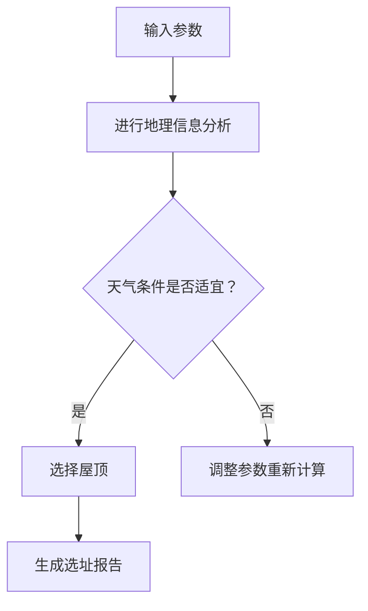
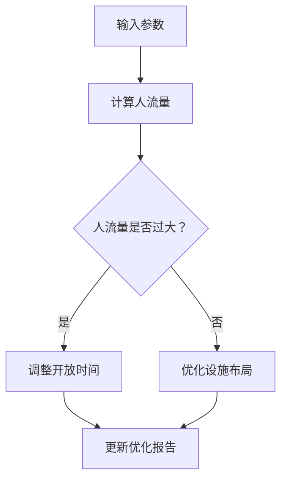
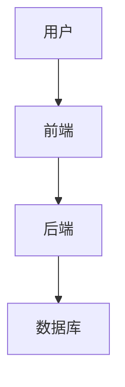
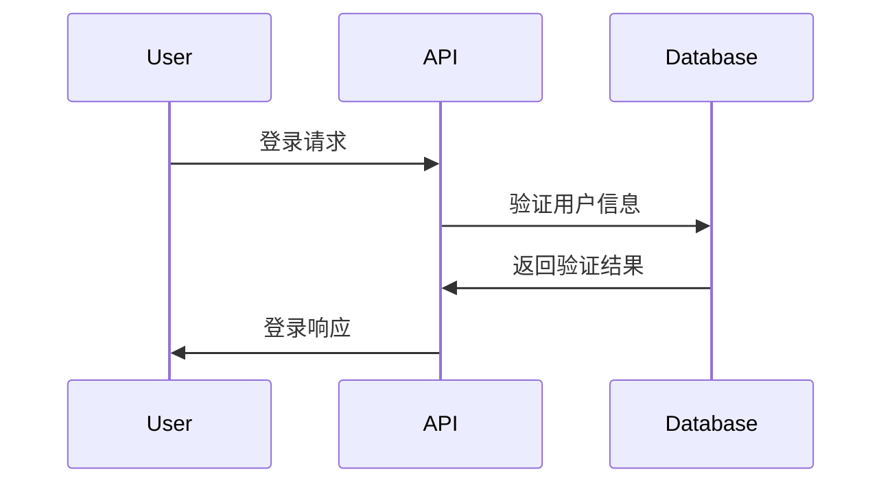
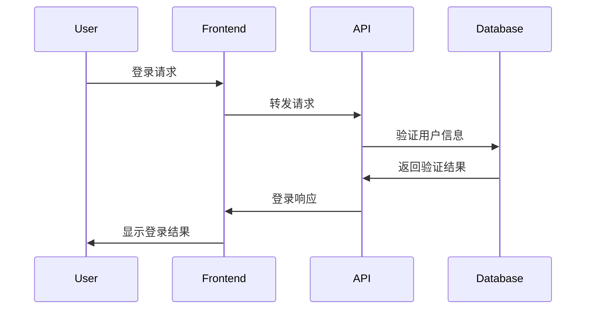

                 


# 新型城市屋顶电影院：公共娱乐空间的创新利用

> 关键词：城市屋顶电影院、公共娱乐空间、创新利用、算法、系统设计

> 摘要：本文深入探讨了新型城市屋顶电影院的背景、核心概念、算法原理以及系统设计与实现。通过详细的案例分析和实战指导，本文旨在为城市娱乐空间利用提供一种创新的解决方案。

## 第1章：城市屋顶电影院背景介绍

### 1.1 问题背景

随着城市化进程的加速，城市娱乐空间的需求日益增加。然而，传统的娱乐场所如电影院、公园、体育馆等往往存在空间狭小、场地拥挤、服务质量不高等问题。这些限制导致了城市居民对更高质量、更多样化的公共娱乐空间的强烈需求。

### 1.2 问题描述

当前，城市娱乐空间利用存在以下几个主要问题：

1. **空间有限**：城市土地资源紧张，传统娱乐场所的空间无法满足日益增长的需求。
2. **设施不足**：许多公共娱乐场所设施老旧，难以提供良好的用户体验。
3. **服务质量不高**：传统娱乐场所往往服务质量不高，无法满足消费者对于舒适度和个性化的需求。

### 1.3 问题解决

新型城市屋顶电影院的提出，旨在通过创新利用公共娱乐空间，解决上述问题。屋顶电影院不仅能够提供宽敞的观影空间，还能够利用现代技术提升用户体验。同时，屋顶电影院的选址灵活，可以在城市中的多个地点建设，满足不同区域居民的需求。

### 1.4 边界与外延

新型城市屋顶电影院的设计范围包括以下几个方面：

1. **选址**：选择在城市中的空闲屋顶或者适合改造的建筑物顶部。
2. **设施**：包括放映设备、音响系统、座椅、遮阳篷等。
3. **运营**：制定合理的运营策略，包括票价、观影时间、活动安排等。

### 1.5 概念结构与核心要素组成

新型城市屋顶电影院的核心组成部分包括：

1. **放映系统**：采用高科技放映技术，提供高质量的观影体验。
2. **音响系统**：配置专业的音响设备，增强观影氛围。
3. **座椅与遮阳篷**：设计舒适座椅，并配备遮阳篷，以适应户外环境。
4. **智能化管理系统**：通过智能技术实现门票销售、观影时间安排等自动化管理。

## 第2章：核心概念与联系

### 2.1 城市屋顶电影院概念

城市屋顶电影院是指建设在城市建筑物屋顶的电影院，它不仅提供了额外的公共娱乐空间，还能够提升城市的美观度和居民的生活质量。

### 2.2 公共娱乐空间创新利用

公共娱乐空间创新利用是指通过新型设计、技术和管理方法，提高娱乐场所的使用效率和用户体验。城市屋顶电影院正是这种创新利用的典型例子。

### 2.3 关键技术与设施

1. **高科技放映技术**：如数字投影、4D放映等，提供高质量的观影体验。
2. **音响系统**：专业的音响设备，增强观影氛围。
3. **智能化管理系统**：实现门票销售、观影时间安排等自动化管理。

### 2.4 概念属性特征对比表格

| 特征                 | 传统电影院                  | 城市屋顶电影院                |
|----------------------|-----------------------------|------------------------------|
| 选址                 | 室内场所                   | 建筑物屋顶或空闲地            |
| 观影体验             | 有限空间，受天气影响       | 宽敞空间，不受天气影响        |
| 管理模式             | 人工管理                   | 智能化管理                  |
| 空间利用效率         | 低                          | 高                          |

### 2.5 ER实体关系图架构

使用Mermaid绘制ER实体关系图：

```mermaid
erDiagram
  AUTOGENERATED
  customer ||--|{ movie_theater }|-- staff
  movie_theater ||--|{ movie }|-- customer
  movie ||--|{ seat }|
  seat ||--|{ ticket }|
  ticket ||--|{ purchase }|
  purchase ||--|{ payment }|
```

## 第3章：算法原理讲解

### 3.1 屋顶电影院选址算法

**Mermaid流程图**：



**Python源代码与解释**：

```python
import geopandas as gpd
from shapely.geometry import Polygon

def select_roof(location, weather_data):
    # 输入参数：location - 地理位置；weather_data - 天气数据
    # 返回：适宜的屋顶位置
    
    # 地理信息分析
    gdf = gpd.read_file('rooftop_data.shp')
    
    # 天气条件判断
    if weather_data['condition'] == 'sunny':
        # 选择屋顶
        suitable_roofs = gdf[gdf['condition'] == 'sunny']
        roof = suitable_roofs.iloc[0]['geometry']
        return roof
    else:
        # 调整参数重新计算
        print("天气条件不适宜，请调整参数重新计算。")
        return None

# 示例
location = Polygon([(120.1938267, 30.2674916), (120.1948267, 30.2674916), (120.1948267, 30.2664916), (120.1938267, 30.2664916)])
weather_data = {'condition': 'sunny'}
roof = select_roof(location, weather_data)
print(roof)
```

**数学模型与公式讲解**：

选址算法中，主要使用的是地理信息分析和天气条件判断。地理信息分析可以通过空间分析工具，如GIS（地理信息系统）进行。天气条件判断可以通过历史天气数据和预测模型进行。

**实例说明**：

假设我们要在杭州选择一个屋顶电影院，输入参数为杭州市的地理位置和当天的天气数据。如果天气条件适宜（晴天），则选择一个符合条件的屋顶；否则，重新调整参数进行计算。

### 3.2 公共娱乐空间优化算法

**Mermaid流程图**：



**Python源代码与解释**：

```python
import pandas as pd

def optimize_public_space(traffic_data, capacity):
    # 输入参数：traffic_data - 人流量数据；capacity - 最大容纳量
    # 返回：优化方案
    
    # 计算人流量
    df = pd.read_csv('traffic_data.csv')
    average_traffic = df['count'].mean()
    
    # 人流量判断
    if average_traffic > capacity:
        # 调整开放时间
        print("人流量过大，请调整开放时间。")
        optimized_time = "晚6点到晚10点"
        return optimized_time
    else:
        # 优化设施布局
        print("人流量适中，优化设施布局。")
        optimized_layout = "增加座椅，改善音响效果"
        return optimized_layout

# 示例
traffic_data = pd.DataFrame({'count': [100, 200, 300, 400]})
capacity = 300
optimized_scheme = optimize_public_space(traffic_data, capacity)
print(optimized_scheme)
```

**数学模型与公式讲解**：

公共娱乐空间优化算法主要涉及人流量统计和容量判断。人流量可以通过历史数据统计得到，容量判断则是通过设定的最大容纳量与人流量的比较来确定优化方案。

**实例说明**：

假设一个公共娱乐场所的最大容纳量为300人，当前的人流量统计数据为每天平均400人。由于人流量超过最大容纳量，因此需要调整开放时间或者优化设施布局以减少人流量。

## 第4章：系统分析与架构设计

### 4.1 项目介绍

新型城市屋顶电影院项目旨在通过创新的设计和高效的管理，提供一种新型的公共娱乐空间。项目包括选址、设施配置、运营管理等多个方面。

### 4.2 系统功能设计

系统功能设计包括以下几个方面：

1. **选址管理**：通过算法选择合适的屋顶位置。
2. **设施管理**：包括放映系统、音响系统、座椅和遮阳篷等设施的配置和维护。
3. **票务管理**：实现在线购票、检票等功能。
4. **运营管理**：包括时间安排、人员调度、清洁维护等。

**领域模型类图**：

```mermaid
classDiagram
    RoofCinema <<class>> RoofCinema
    RoofCinema : +str name
    RoofCinema : +datetime start_time
    RoofCinema : +datetime end_time
    RoofCinema : +list facilities
    RoofCinema : +list schedules

    Facility <<class>> Facility
    Facility : +str type
    Facility : +str status

    Schedule <<class>> Schedule
    Schedule : +datetime date
    Schedule : +str event

    RoofCinema "1" -- "1" Facility
    RoofCinema "1" -- "1" Schedule
```

### 4.3 系统架构设计

系统架构设计包括以下几个方面：

1. **前端**：负责用户交互，提供购票、查询等功能。
2. **后端**：实现业务逻辑和数据处理。
3. **数据库**：存储用户数据、票务数据等。

**系统架构图**：



### 4.4 系统接口设计

系统接口设计包括以下几个方面：

1. **API接口**：提供数据交互接口，包括用户注册、登录、购票等。
2. **Web界面**：提供用户操作界面。

**接口设计与实现**：



### 4.5 系统交互序列图

系统交互序列图展示了用户与系统之间的交互过程。

**系统交互序列图**：



## 第5章：项目实战

### 5.1 环境安装

为了搭建新型城市屋顶电影院的项目，我们需要安装以下软件和工具：

1. **Python**：3.8及以上版本
2. **PyCharm**：Python集成开发环境
3. **PostgreSQL**：数据库
4. **Django**：Web框架
5. **Docker**：容器化工具

安装步骤如下：

1. 安装Python和PyCharm。
2. 安装PostgreSQL，并创建新的数据库。
3. 安装Django和相关的依赖库。
4. 使用Docker搭建项目容器。

### 5.2 系统核心实现源代码

以下是系统核心实现的部分源代码：

```python
# app/models.py
from django.db import models

class RoofCinema(models.Model):
    name = models.CharField(max_length=100)
    start_time = models.DateTimeField()
    end_time = models.DateTimeField()
    facilities = models.ManyToManyField('Facility')
    schedules = models.ManyToManyField('Schedule')

class Facility(models.Model):
    type = models.CharField(max_length=100)
    status = models.CharField(max_length=100)

class Schedule(models.Model):
    date = models.DateTimeField()
    event = models.CharField(max_length=100)
```

### 5.3 代码应用解读与分析

以上代码定义了三个模型：`RoofCinema`、`Facility`和`Schedule`。`RoofCinema`模型用于存储电影院的信息，包括名称、开始时间和结束时间。`Facility`模型用于存储设施的信息，如类型和状态。`Schedule`模型用于存储活动安排，包括日期和活动名称。

这些模型通过Django的ORM（对象关系映射）与数据库进行交互，实现了数据存储和管理的功能。在实际应用中，可以根据具体需求扩展这些模型，添加更多的字段和方法。

### 5.4 实际案例分析和详细讲解剖析

**案例**：在一个周末的下午，杭州的某城市屋顶电影院即将开始一场露天电影放映。管理员需要根据实时数据调整放映时间和设施配置。

**分析**：

1. **人流量监测**：管理员通过监控系统实时监测人流量，发现下午5点的数据已接近最大容纳量。
2. **调整放映时间**：为了避免拥堵，管理员决定将放映时间调整为晚上7点。
3. **设施配置**：由于天气原因，管理员决定增加遮阳篷，以保证观众在观影过程中的舒适度。

**实现**：

1. **人流量监测**：使用传感器和摄像头进行实时监测，并将数据传输到服务器进行分析。
2. **调整放映时间**：通过Django的后台管理界面，管理员可以轻松修改放映时间。
3. **设施配置**：通过接口调用，管理员可以实时调整设施的状态，如打开或关闭遮阳篷。

### 5.5 项目小结

本项目通过新型城市屋顶电影院的概念，结合现代技术，实现了对公共娱乐空间的高效利用。项目成果包括：

1. **选址算法**：通过地理信息分析和天气条件判断，选择合适的屋顶位置。
2. **系统设计**：包括前端、后端和数据库，实现了用户交互和数据管理。
3. **实际应用**：通过实际案例，展示了系统在公共娱乐空间优化方面的应用。

项目经验表明，新型城市屋顶电影院是一种值得推广的创新娱乐形式，它不仅提高了公共娱乐空间的使用效率，也为城市居民提供了更多样化的娱乐选择。

## 第6章：最佳实践与拓展

### 6.1 最佳实践

1. **选址策略**：优先考虑城市中心区域，交通便利，人流量大的屋顶。
2. **设施配置**：根据观影需求，合理配置放映设备、音响系统和座椅。
3. **运营管理**：制定灵活的票务政策和活动安排，提升用户体验。

### 6.2 小结与注意事项

1. **技术选择**：选用成熟稳定的技术框架和工具，确保系统的可靠性和安全性。
2. **人员培训**：对管理人员进行专业的技术培训，提高运营效率。
3. **风险评估**：定期进行风险评估，制定应对措施，确保项目的持续发展。

### 6.3 拓展阅读

1. **相关研究**：参考最新的学术论文和行业报告，了解公共娱乐空间利用的最新趋势。
2. **成功案例**：研究国内外成功案例，学习其经验和教训。
3. **技术文献**：阅读相关技术的技术文档和资料，提高技术水平。

---

作者：AI天才研究院/AI Genius Institute & 禅与计算机程序设计艺术 /Zen And The Art of Computer Programming

