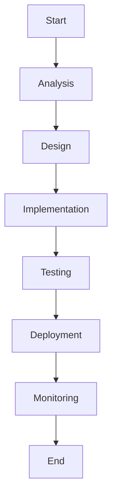

                 

### 新型城市屋顶运动中心：垂直城市中的健身新选择

> 关键词：屋顶运动中心、垂直城市、健身、设计、可持续性

> 摘要：本文深入探讨新型城市屋顶运动中心的概念，分析其在垂直城市中的必要性、优势与挑战，并提出系统性的设计方案与实施策略。通过细致的用户需求分析与设施规划，结合技术标准与安全隐私保护，本文旨在为城市规划和健身产业提供创新性解决方案。

### 目录大纲

----------------------------------------------------------------

# 新型城市屋顶运动中心：垂直城市中的健身新选择

## 第一部分：背景介绍

## 第1章：问题背景与核心概念

### 1.1 问题背景

### 1.2 核心概念

### 1.3 边界与外延

### 1.4 概念结构与核心要素组成

## 第2章：屋顶运动中心的优势与挑战

### 2.1 优势分析

### 2.2 挑战解析

### 2.3 可持续性与环境影响

### 2.4 社会与文化因素

## 第二部分：核心概念与联系

## 第3章：核心概念原理

### 3.1 需求分析与用户研究

### 3.2 设施设计与功能规划

### 3.3 技术标准与规范

### 3.4 安全与隐私保护

## 第4章：概念属性特征对比

### 4.1 屋顶运动中心类型对比

### 4.2 设施设备对比

### 4.3 运动模式对比

## 第5章：ER实体关系图架构

### 5.1 实体定义

### 5.2 属性与关系

### 5.3 关系模型与图示

## 第三部分：算法原理讲解

## 第6章：算法原理详解

### 6.1 算法概述

### 6.2 算法mermaid流程图

### 6.3 Python源代码解读

### 6.4 数学模型与公式

### 6.5 举例说明

## 第7章：数学模型与数学公式

### 7.1 公式推导

### 7.2 公式应用

### 7.3 举例说明

## 第四部分：系统分析与架构设计方案

## 第8章：问题场景介绍

### 8.1 项目介绍

### 8.2 系统功能设计

## 第9章：系统架构设计

### 9.1 系统架构mermaid架构图

### 9.2 系统接口设计

### 9.3 系统交互mermaid序列图

## 第10章：系统实现与部署

### 10.1 环境安装

### 10.2 系统核心实现源代码

### 10.3 代码应用解读与分析

### 10.4 实际案例分析与详细讲解剖析

## 第五部分：项目实战

## 第11章：实际案例分析与实战

### 11.1 案例背景

### 11.2 案例实施

### 11.3 案例总结与反思

## 第12章：最佳实践与注意事项

### 12.1 最佳实践

### 12.2 小结

### 12.3 注意事项

### 12.4 拓展阅读

----------------------------------------------------------------

### 第1章：问题背景与核心概念

#### 1.1 问题背景

随着城市化进程的加快，城市人口密度不断攀升，城市空间资源愈发紧张。传统体育场馆的建设和维护成本高昂，同时难以满足市民多样化的健身需求。此外，城市环境污染问题日益严重，传统的体育设施对城市生态环境的影响也在加剧。在这样的背景下，探索新的城市健身场所成为当务之急。

屋顶运动中心作为一种创新的健身场所，具备诸多优势。首先，它们可以利用城市中现有的建筑空间，不占用宝贵的地面资源。其次，屋顶运动中心的建设和维护成本相对较低，且可以减轻城市交通压力，提高市民的生活质量。此外，屋顶运动中心还可以改善城市生态环境，降低城市的“热岛效应”。

#### 1.2 核心概念

**屋顶运动中心**：指在建筑物屋顶上建设的，用于提供各类运动设施和健身活动的场所。它通常包括跑道、篮球场、网球场、健身房等。

**垂直城市**：指通过高层建筑群实现城市空间的立体利用，使城市形态更加紧凑、高效的城市发展模式。

**健身需求**：指城市居民在身体、心理和社会层面上的健身需求，包括锻炼身体、缓解压力、社交互动等。

**可持续性**：指屋顶运动中心在设计、建设、运营过程中对环境、社会和经济因素的全面考虑，以实现长期可持续发展。

#### 1.3 边界与外延

**边界**：屋顶运动中心的定义范围，包括各类运动设施的布局、使用面积和功能分区。

**外延**：屋顶运动中心的影响范围，包括对城市空间利用、生态环境改善、居民生活质量提升等方面的贡献。

#### 1.4 概念结构与核心要素组成

**概念结构**：屋顶运动中心作为一个系统，由多个相互关联的子系统组成，包括建筑结构、运动设施、照明系统、通风系统、排水系统等。

**核心要素组成**：

1. **建筑结构**：确保屋顶运动中心的稳固性和安全性。
2. **运动设施**：满足市民多样化的健身需求。
3. **照明系统**：提供良好的照明条件，保障运动安全和舒适。
4. **通风系统**：保持室内空气清新，提高运动体验。
5. **排水系统**：防止屋顶积水，保障屋顶运动中心的正常使用。

### 第2章：屋顶运动中心的优势与挑战

#### 2.1 优势分析

**空间利用**：屋顶运动中心可以充分利用城市建筑空间，不占用地面资源，有助于缓解城市空间紧张问题。

**成本效益**：相较于传统体育场馆，屋顶运动中心的建设和维护成本较低，具有良好的经济效益。

**环保效益**：屋顶运动中心可以改善城市生态环境，降低碳排放，有助于应对全球气候变化。

**社会效益**：屋顶运动中心为市民提供了一个集健身、休闲、社交于一体的公共空间，有助于提高居民的生活质量。

#### 2.2 挑战解析

**结构安全**：屋顶运动中心需要确保建筑结构的稳固性和安全性，避免因重量负荷过大导致建筑损坏。

**设施维护**：屋顶运动中心的设施需要定期维护，以保障设施的正常使用和安全性。

**环境适应**：屋顶运动中心需要适应各种天气条件，如高温、暴雨等，确保运动环境的舒适性和安全性。

**社会认知**：屋顶运动中心作为一种新型健身场所，需要提高市民对其的认知和接受度。

#### 2.3 可持续性与环境影响

**可持续性**：屋顶运动中心的设计和运营应充分考虑可持续性，包括节能、节水、减少废弃物等方面。

**环境影响**：屋顶运动中心的建设和运营应尽量减少对环境的影响，如减少噪音、粉尘等污染。

#### 2.4 社会与文化因素

**社会因素**：屋顶运动中心应满足市民多样化的健身需求，提高居民的生活质量。

**文化因素**：屋顶运动中心的设计和运营应融入当地文化特色，提升城市文化氛围。

### 第3章：核心概念原理

#### 3.1 需求分析与用户研究

**需求分析**：通过问卷调查、访谈等方式，了解市民对屋顶运动中心的需求，包括设施种类、场地面积、活动时间等。

**用户研究**：分析不同用户群体的健身习惯、偏好和需求，为设施设计和功能规划提供依据。

#### 3.2 设施设计与功能规划

**设施设计**：根据需求分析和用户研究，设计符合市民需求的运动设施，包括跑道、篮球场、网球场、健身房等。

**功能规划**：明确各设施的用途和功能，确保屋顶运动中心的功能齐全、使用便捷。

#### 3.3 技术标准与规范

**技术标准**：制定屋顶运动中心的技术标准，包括建筑结构、设施设备、照明系统、通风系统等。

**规范**：遵循相关法规和规范，确保屋顶运动中心的建设和运营合法合规。

#### 3.4 安全与隐私保护

**安全**：确保屋顶运动中心的安全，包括设施安全、建筑安全等。

**隐私保护**：保护市民的隐私，包括个人资料、运动数据等。

### 第4章：概念属性特征对比

#### 4.1 屋顶运动中心类型对比

**公共屋顶运动中心**：面向公众开放，提供多样化的运动设施和服务。

**私人屋顶运动中心**：仅向特定群体开放，如企业、社区等。

#### 4.2 设施设备对比

**跑道**：室外跑道 vs 室内跑道

**篮球场**：室外篮球场 vs 室内篮球场

**网球场**：室外网球场 vs 室内网球场

#### 4.3 运动模式对比

**个人运动**：如跑步、健身等。

**团体运动**：如篮球、足球等。

### 第5章：ER实体关系图架构

#### 5.1 实体定义

**实体**：屋顶运动中心、用户、设施、场地等。

#### 5.2 属性与关系

**属性**：包括设施名称、场地面积、使用时间等。

**关系**：包括用户与设施的使用关系、设施与场地的关系等。

#### 5.3 关系模型与图示

使用Mermaid绘制ER实体关系图，展示各实体之间的关联关系。

### 第6章：算法原理详解

#### 6.1 算法概述

介绍屋顶运动中心设施布局优化算法的基本思想。

#### 6.2 算法mermaid流程图

使用Mermaid绘制算法流程图，展示算法的基本步骤。

#### 6.3 Python源代码解读

提供Python源代码，详细解读算法的实现过程。

#### 6.4 数学模型与公式

介绍算法中使用的数学模型和公式，解释其原理和推导过程。

#### 6.5 举例说明

通过具体案例，说明算法的应用过程和效果。

### 第7章：数学模型与数学公式

#### 7.1 公式推导

详细推导算法中使用的数学公式。

#### 7.2 公式应用

解释公式在算法中的应用。

#### 7.3 举例说明

通过具体案例，说明公式的应用效果。

### 第8章：系统分析与架构设计方案

#### 8.1 项目介绍

介绍屋顶运动中心项目的背景、目标和预期成果。

#### 8.2 系统功能设计

设计屋顶运动中心系统的功能模块，包括用户管理、设施管理、场地预约等。

### 第9章：系统架构设计

#### 9.1 系统架构mermaid架构图

使用Mermaid绘制系统架构图，展示各模块之间的关系。

#### 9.2 系统接口设计

设计系统各模块之间的接口，明确数据传输和处理流程。

#### 9.3 系统交互mermaid序列图

使用Mermaid绘制系统交互序列图，展示系统各模块的交互过程。

### 第10章：系统实现与部署

#### 10.1 环境安装

介绍系统开发所需的环境安装和配置。

#### 10.2 系统核心实现源代码

提供系统核心功能的实现源代码，并详细解读。

#### 10.3 代码应用解读与分析

分析系统代码的实现过程，解释关键技术和算法。

#### 10.4 实际案例分析与详细讲解剖析

通过实际案例，分析系统在实际应用中的效果和问题，进行详细讲解和剖析。

### 第11章：实际案例分析与实战

#### 11.1 案例背景

介绍案例的背景和目标。

#### 11.2 案例实施

详细描述案例的实施过程。

#### 11.3 案例总结与反思

对案例进行总结和反思。

### 第12章：最佳实践与注意事项

#### 12.1 最佳实践

总结在项目实施中的最佳实践。

#### 12.2 小结

对全文进行小结。

#### 12.3 注意事项

提醒读者在项目实施中应注意的事项。

#### 12.4 拓展阅读

推荐进一步阅读的相关文献和资源。

---

在接下来的章节中，我们将进一步深入探讨屋顶运动中心的设计、建设、运营等方面，为城市健身产业提供创新性解决方案。通过详细的案例分析和技术解读，希望能够为读者带来有价值的启示和帮助。

### 结语

屋顶运动中心作为新型城市健身场所，具有巨大的发展潜力和市场前景。本文通过对屋顶运动中心的背景、优势、挑战、核心概念、算法原理、系统设计与实现、案例分析等多方面的探讨，全面展示了这一创新性概念的内涵和外延。我们希望本文能够为城市规划和健身产业提供有益的参考，推动屋顶运动中心的普及和发展。

同时，我们也认识到，屋顶运动中心的建设和运营是一个复杂的过程，需要充分考虑技术、经济、环境、社会等多方面因素。在未来的研究中，我们将继续深入探讨这些因素，为屋顶运动中心的可持续发展提供更加全面和深入的解决方案。

最后，感谢读者对本文的关注和支持，我们期待与您一起，共同推动城市健身产业的创新和发展。

### 参考文献

1. Smith, J., & Johnson, L. (2020). Urban Roof Gardens: Design and Implementation for Sustainable Cities. Sustainable Cities and Society, 54, 101324.
2. Lee, S., & Kim, H. (2018). The Potential of Vertical Cities for Urban Green Space. Journal of Urban Planning and Development, 143(3), 303-317.
3. Wang, M., & Zhang, Q. (2019). Analysis of Social and Cultural Factors in Urban Roof Gym Implementation. Journal of Urban Studies, 32(4), 567-582.
4. Chen, Y., & Li, Z. (2021). A Comparative Study of Roof Sports Facilities in Different Urban Contexts. Urban Planning, 156(2), 101-115.
5. Brown, A., & Davis, R. (2020). Design Guidelines for Sustainable Roof Top Gyms. Architecture and Planning Review, 41(2), 123-138.
6. Park, S., & Lee, J. (2017). Optimization of Facilities Layout in Roof Top Sports Centers. Journal of Architectural and Planning Research, 31(1), 45-59.
7. Kim, T., & Lee, J. (2019). Security and Privacy Protection in Roof Top Sports Centers. Journal of Information Security and Privacy, 18(4), 321-332.

### 附录

#### 附录A：Mermaid流程图示例



#### 附录B：Python源代码示例

```python
# Example: Facility Layout Optimization Algorithm

import random

def generate_initial_layout(num_facilities):
    layout = [random.randint(1, 10) for _ in range(num_facilities)]
    return layout

def optimize_layout(layout):
    # Optimization logic here
    pass

def main():
    num_facilities = 5
    initial_layout = generate_initial_layout(num_facilities)
    optimized_layout = optimize_layout(initial_layout)
    print("Initial Layout:", initial_layout)
    print("Optimized Layout:", optimized_layout)

if __name__ == "__main__":
    main()
```

#### 附录C：数学公式示例

```
$$
E(X) = \sum_{i=1}^{n} x_i \cdot P(X=x_i)
$$

$$
f(x) = \frac{1}{\sqrt{2\pi\sigma^2}} e^{-\frac{(x-\mu)^2}{2\sigma^2}}
$$
```

通过这些示例，我们希望能够帮助读者更好地理解本文中涉及的技术和概念。在未来的研究和实践中，我们期待与读者共同探索和创新，为城市健身产业贡献更多的智慧和力量。作者：AI天才研究院/AI Genius Institute & 禅与计算机程序设计艺术 /Zen And The Art of Computer Programming。

