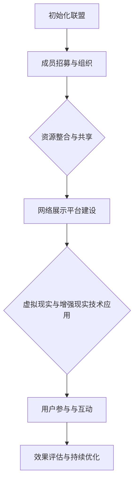
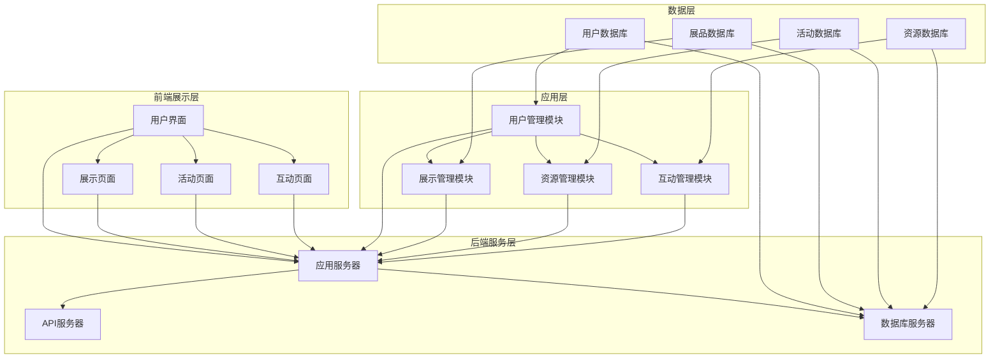
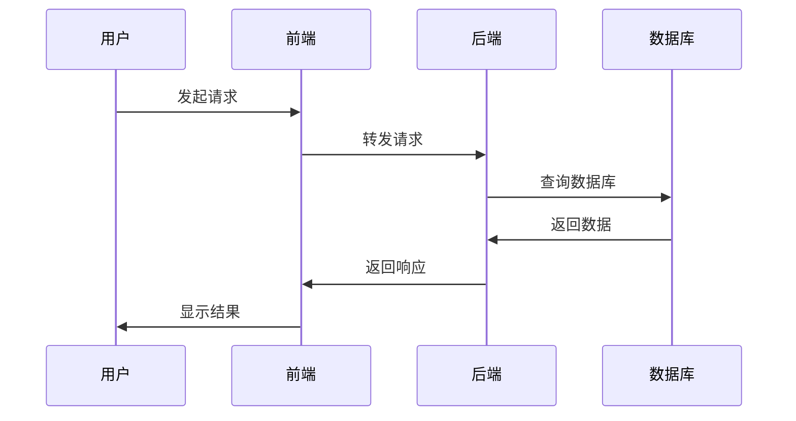

                 

### 第一部分：新型城市微型博物馆联盟概述

## 第1章：问题的背景与描述

### 1.1.1 问题的背景

#### 1.1.1.1 社区文化遗产的重要性

社区文化遗产是指一个社区或城市特有的历史、文化、传统和生活方式等方面的物质和非物质遗产。这些遗产是一个社区身份和文化传承的重要象征，对社区的可持续发展具有重要的意义。

- **定义**：社区文化遗产是社区历史和文化的载体，包括历史建筑、文物、手工艺品、传统习俗、故事传说、节庆活动等。
- **保护与传承**：社区文化遗产的保护与传承有助于维护文化多样性，促进社会和谐，提升社区居民的文化自信和归属感。

#### 1.1.1.2 传统社区文化遗产展示的挑战

尽管社区文化遗产对于社会文化传承至关重要，但传统的社区文化遗产展示面临以下挑战：

- **展示空间的限制**：传统博物馆和展览馆的展示空间有限，无法全面展示丰富的文化遗产。
- **社区参与度不足**：由于展示形式的局限性，社区居民的参与度不高，文化遗产的保护与传承难以得到广泛的社会支持。
- **文化遗产的信息化水平低**：传统展示手段往往缺乏现代化的信息技术支持，无法充分发挥文化遗产的教育和传播作用。

### 1.1.2 问题描述

社区文化遗产展示的困境主要表现在以下几个方面：

- **展示内容单一**：传统的展示方式往往局限于实物和图文资料，缺乏互动性和沉浸式体验。
- **展示手段陈旧**：缺乏现代化的展示手段，如虚拟现实（VR）和增强现实（AR）技术，难以吸引年轻一代的关注。
- **展示资源分散**：社区文化遗产资源往往分散在不同机构和社区中，缺乏有效的整合与共享。

### 1.1.3 问题解决思路

为解决上述问题，构建新型城市微型博物馆联盟并实施社区文化遗产的网络展示成为必要途径。

- **新型城市微型博物馆联盟的构建**：通过联盟的形式，将不同社区的文化遗产资源进行整合，实现资源共享和共同推广。
- **社区文化遗产的网络展示技术**：利用互联网和先进的信息技术，构建虚拟展示平台，实现文化遗产的数字化和沉浸式展示。

#### 1.1.3.1 联盟的构建

- **联盟成员的选择与组织**：选择具有相关资源和文化传承意识的博物馆、文化机构、社区组织和企业加入联盟，明确成员的职责和贡献。
- **联盟的运营与管理**：建立联盟的运营模式和管理机制，确保联盟的可持续性和高效运作。

#### 1.1.3.2 网络展示技术

- **网络展示平台的建设**：搭建一个功能齐全的网络展示平台，提供展品展示、资源共享、教育活动和互动体验等功能。
- **虚拟现实与增强现实技术**：利用VR和AR技术，创造沉浸式展示体验，增强文化遗产的吸引力和影响力。

通过上述措施，新型城市微型博物馆联盟有望成为社区文化遗产保护与传承的有效途径，实现文化遗产的网络化展示和共享。

### 目录大纲总结

本文的第一部分对新型城市微型博物馆联盟的背景和问题进行了深入探讨。首先，阐述了社区文化遗产的定义和重要性，指出了其保护与传承的必要性。接着，分析了传统社区文化遗产展示面临的挑战，包括展示空间的限制、社区参与度不足和文化遗产信息化水平低等问题。随后，提出了构建新型城市微型博物馆联盟和实施网络展示技术的解决思路。通过联盟的构建和网络展示技术的应用，可以有效地整合社区文化遗产资源，提升展示的互动性和沉浸感，从而实现文化遗产的网络化展示和共享。这一部分为后续章节的详细讨论奠定了基础。

----------------------------------------------------------------

### 第二部分：新型城市微型博物馆联盟的构建

## 第2章：新型城市微型博物馆联盟的构建

### 2.1 联盟成员的选择与组织

#### 2.1.1 成员类型

新型城市微型博物馆联盟的成员应涵盖不同类型的机构，以确保资源的多样性和展示的全面性。以下是几种主要的成员类型：

- **博物馆**：负责提供实物展品和文化资料，是联盟的核心资源。
- **文化机构**：包括图书馆、档案馆、非遗保护中心等，它们可以提供丰富的文献资料和文化知识。
- **社区组织**：社区组织在地方文化遗产的收集、保护和传播方面发挥着重要作用，是社区文化的载体。
- **企业**：企业特别是技术企业可以提供技术支持和资金支持，帮助联盟实现数字化和智能化展示。

#### 2.1.2 成员资格与加入流程

为了确保联盟的高效运作和可持续发展，成员资格的设定和加入流程应规范明确。

- **成员资格要求**：成员应具备以下条件：
  - 对社区文化遗产有深厚的认识和强烈的保护意愿。
  - 具备一定的展示能力和资源。
  - 能够积极参与联盟的活动和项目。
- **加入流程**：加入联盟的流程如下：
  - 表达加入意愿：意向成员向联盟提出加入申请。
  - 审核资格：联盟秘书处对申请成员的资格进行审核。
  - 签署协议：审核通过后，申请成员与联盟签署合作协议。
  - 确定角色：成员在联盟中根据自身特长和资源确定角色和责任。

### 2.2 联盟的运营与管理

#### 2.2.1 运营模式

联盟的运营模式应灵活多样，以适应不同成员的需求和实际情况。

- **项目制**：以项目为单位进行管理和运作，每个项目都有明确的任务目标和时间表。
- **联合运营**：成员之间合作开展展示、研究和教育活动，共享资源和成果。
- **资源共享**：建立资源库，实现展品、文献和技术等资源的共享，提高展示效果和效率。

#### 2.2.2 管理机制

为确保联盟的规范运作和持续发展，建立完善的管理机制至关重要。

- **成员大会**：成员大会是联盟的最高权力机构，负责制定联盟的总体方针和政策。
- **理事会**：理事会是成员大会的执行机构，负责日常运营和管理。
- **常务理事会**：常务理事会是理事会的常设机构，负责处理日常事务，确保联盟的持续运作。

通过上述措施，新型城市微型博物馆联盟可以形成一个高效、协调、可持续的运作体系，为社区文化遗产的保护与传承提供有力支持。

### 目录大纲总结

第二部分详细阐述了新型城市微型博物馆联盟的构建过程，包括成员的选择与组织、成员资格与加入流程，以及联盟的运营与管理模式。首先，分析了联盟成员的类型，包括博物馆、文化机构、社区组织和企业，并明确了成员的资格要求。接着，详细描述了加入联盟的流程，从表达加入意愿到最终确定角色，确保了联盟成员的高效整合。随后，介绍了联盟的运营模式和管理机制，包括项目制、联合运营、资源共享以及成员大会、理事会和常务理事会等机构的作用。这些措施为联盟的规范运作和可持续发展奠定了坚实基础，为社区文化遗产的保护与传承提供了有力支持。这一部分内容为后续章节的网络展示技术和实践案例分析提供了背景和基础。

----------------------------------------------------------------

### 第三部分：社区文化遗产的网络展示技术

## 第3章：社区文化遗产的网络展示技术

### 3.1 网络展示平台的建设

#### 3.1.1 平台功能

社区文化遗产网络展示平台是联盟的重要组成部分，其功能设计应全面覆盖展示、教育、互动等多方面需求。

- **展品展示**：平台应能够展示各类社区文化遗产，包括历史建筑、文物、手工艺品、传统习俗等，同时提供高清图片、视频等多媒体资料。
- **资源共享**：平台应具备资源共享功能，允许成员之间共享展品、文献、研究成果等资源，提高展示效果和效率。
- **教育活动**：平台应提供线上教育活动，如讲座、研讨会、工作坊等，促进社区居民对文化遗产的了解和参与。
- **参与互动**：平台应支持用户互动，如评论、点赞、分享等，增强用户体验和社区互动。

#### 3.1.2 技术架构

网络展示平台的技术架构设计应考虑前端展示、后端支持和数据库设计等多个方面，确保平台的稳定性和扩展性。

- **前端技术**：前端技术包括HTML、CSS和JavaScript等，用于构建用户界面和交互逻辑。前端框架如React或Vue.js可以提高开发效率和用户体验。
- **后端技术**：后端技术包括服务器端编程语言（如Node.js、Python等）和框架（如Django、Flask等），负责处理业务逻辑、数据存储和接口服务。
- **数据库设计**：数据库设计应考虑数据模型、存储方案和访问效率。常用的数据库技术包括关系型数据库（如MySQL、PostgreSQL）和NoSQL数据库（如MongoDB、Redis）。

### 3.2 虚拟现实与增强现实技术

#### 3.2.1 虚拟现实技术

虚拟现实（VR）技术可以为社区文化遗产提供沉浸式体验，让用户仿佛置身于历史场景中。

- **基本原理**：VR技术利用计算机生成三维虚拟环境，通过头戴式显示器（HMD）等设备让用户感知和交互。
- **应用**：在文化遗产展示中，VR技术可以模拟历史场景，如古代建筑、历史事件等，让用户进行虚拟探险和学习。

#### 3.2.2 增强现实技术

增强现实（AR）技术可以将虚拟信息叠加到现实环境中，增强用户对文化遗产的认知和体验。

- **基本原理**：AR技术利用摄像头和计算机视觉算法，将虚拟物体实时叠加到现实场景中，用户可以通过智能手机或AR眼镜进行观看和交互。
- **应用**：在文化遗产展示中，AR技术可以提供互动式教育，如通过AR应用程序让用户与文物互动，了解文物的历史背景和文化内涵。

通过虚拟现实和增强现实技术的应用，社区文化遗产的网络展示可以大大提升用户体验和互动性，吸引更多用户关注和参与文化遗产的保护与传承。

### 目录大纲总结

第三部分深入探讨了社区文化遗产的网络展示技术，重点介绍了网络展示平台的建设和虚拟现实与增强现实技术的应用。首先，分析了网络展示平台的功能设计，包括展品展示、资源共享、教育活动和参与互动等方面，并阐述了平台的技术架构，包括前端技术、后端技术和数据库设计。随后，详细介绍了虚拟现实和增强现实技术的基本原理和应用，如何通过这些技术为社区文化遗产展示提供沉浸式和互动式体验。这些技术手段不仅提升了文化遗产的展示效果，也为用户提供了更加丰富和深入的体验，为社区文化遗产的网络展示提供了有力的技术支持。这一部分内容为后续的实践案例分析和挑战与机遇探讨奠定了技术基础。

----------------------------------------------------------------

### 第四部分：网络展示实践案例

## 第4章：网络展示实践案例

### 4.1 案例一：某城市微型博物馆联盟

#### 4.1.1 案例背景

某城市微型博物馆联盟成立于2020年，由该城市的5家博物馆、2家文化机构和3家社区组织共同发起。该联盟的成立旨在通过整合城市社区的文化遗产资源，提升文化遗产的展示效果和影响力，增强社区居民的文化自信和归属感。

- **成立背景**：随着城市化进程的加快，城市中的社区文化遗产面临保护和传承的挑战。传统的展示方式已无法满足现代人的需求，因此，联盟希望通过网络展示技术实现文化遗产的数字化和沉浸式展示。
- **社区文化遗产现状**：该城市拥有丰富的历史建筑、手工艺品、传统节庆活动等文化遗产。然而，这些文化遗产的展示和传承面临展示空间有限、社区参与度不足等问题。

#### 4.1.2 案例实施

为了实现社区文化遗产的网络展示，联盟采取了以下措施：

- **联盟成员招募**：通过宣传和推广，吸引了多家博物馆、文化机构和社区组织加入联盟，共同推动网络展示项目。
- **网络展示平台建设**：联盟搭建了一个集展品展示、资源共享、互动体验为一体的网络展示平台。平台采用React框架进行前端开发，使用Node.js和MongoDB进行后端支持。
- **虚拟现实与增强现实技术应用**：联盟利用VR和AR技术，为用户提供了沉浸式和互动式的文化遗产展示体验。例如，通过VR技术，用户可以虚拟参观历史建筑，通过AR技术，用户可以了解文物的历史背景和文化内涵。

#### 4.1.3 案例成果

联盟的网络展示项目取得了显著成果：

- **展示效果**：通过网络展示平台，社区居民可以随时随地访问和浏览文化遗产，提高了展示的普及率和参与度。
- **社区反馈**：用户反馈积极，表示通过VR和AR技术，他们对文化遗产的理解和兴趣大大增加。
- **成本效益分析**：尽管项目初期投入较大，但由于网络展示的持续性和广泛性，长期来看，成本效益显著。

#### 4.2 案例二：某社区文化遗产网络展示项目

#### 4.2.1 案例背景

某社区文化遗产网络展示项目于2021年启动，由一家社区组织主导，联合本地文化机构和居民共同实施。该项目旨在通过数字化手段保护和传承社区的历史文化，提升社区居民的文化认同感和自豪感。

- **社区文化遗产特点**：该社区拥有独特的传统节庆、手工艺品和民间故事等文化遗产。这些文化遗产承载着社区的历史和文化记忆，对社区的认同和凝聚力具有重要意义。
- **展示需求分析**：社区居民对文化遗产展示的需求强烈，但传统展示方式无法满足。他们希望有一个互动性强、体验丰富的展示平台，以便更好地了解和传承社区文化。

#### 4.2.2 案例实施

为了满足社区居民的展示需求，项目采取了以下实施步骤：

- **展品数字化处理**：项目对社区的传统节庆、手工艺品和民间故事等展品进行了数字化处理，包括拍摄高清图片、录制视频和制作3D模型等。
- **网络展示平台建设**：项目搭建了一个基于WordPress的展示平台，通过插件实现了展品展示、在线互动和社交媒体分享等功能。
- **虚拟现实与增强现实技术应用**：项目利用VR和AR技术，为社区居民提供了沉浸式和互动式的文化遗产体验。例如，通过VR技术，用户可以虚拟体验传统节庆活动，通过AR技术，用户可以在家中“展示”手工艺品。

#### 4.2.3 案例成果

该社区文化遗产网络展示项目取得了良好的效果：

- **展示效果**：通过数字化和VR/AR技术的应用，文化遗产的展示更加生动和互动，吸引了更多社区居民的参与。
- **社区反馈**：居民反馈积极，表示通过项目，他们对社区文化的认知和兴趣大大增加，社区凝聚力也得到了提升。
- **成本效益分析**：项目在预算范围内顺利完成，且长期运营成本较低，具有良好的经济和社会效益。

### 目录大纲总结

第四部分通过两个实践案例详细展示了社区文化遗产网络展示的实施过程和成果。首先，案例一介绍了某城市微型博物馆联盟的背景、实施措施和成果，包括联盟成员的招募、网络展示平台的建设和VR/AR技术的应用，展示了项目在展示效果、社区反馈和成本效益等方面的显著成效。案例二则描述了某社区文化遗产网络展示项目的实施过程，包括展品数字化处理、网络展示平台建设和VR/AR技术的应用，同样取得了良好的社区反响和经济效益。这两个案例为社区文化遗产网络展示提供了有益的实践经验和参考，验证了网络展示技术在文化遗产保护与传承中的有效性和可行性。这一部分内容为后续的挑战与机遇分析提供了实际案例支撑。

----------------------------------------------------------------

### 第五部分：社区文化遗产网络展示的挑战与机遇

## 第5章：社区文化遗产网络展示的挑战与机遇

### 5.1 挑战分析

#### 5.1.1 技术挑战

社区文化遗产网络展示面临一系列技术挑战，这些挑战涉及到技术的成熟度、应用的技术手段和技术的可持续性等方面。

- **网络展示技术的成熟度**：尽管虚拟现实（VR）和增强现实（AR）技术在近年来取得了显著进展，但在社区文化遗产网络展示中的应用仍存在一定的不成熟性。例如，VR/AR设备的成本较高，技术标准不统一，用户体验和性能有待进一步提升。
- **虚拟现实与增强现实技术的应用**：VR和AR技术在文化遗产展示中的应用尚处于探索阶段，如何将这些技术有效地融入文化遗产展示中，提升用户的沉浸体验和互动性，仍需要大量的实践和探索。

#### 5.1.2 管理挑战

社区文化遗产网络展示的管理也面临一系列挑战，这些挑战涉及到联盟的运营、成员的协调和管理的可持续性等方面。

- **联盟运营的可持续性**：联盟的运营需要长期的资金和资源支持，如何在有限的资源下实现联盟的可持续运作，是一个重要的挑战。此外，如何激发成员的参与积极性，保持联盟的活力，也是一个关键问题。
- **成员间的协调与沟通**：社区文化遗产网络展示涉及多个机构和组织的合作，如何有效地协调和沟通各方，确保项目的顺利进行，是另一个重要挑战。

### 5.2 机遇分析

尽管面临挑战，社区文化遗产网络展示也充满了机遇，这些机遇来自于技术发展趋势和社会需求的变化。

#### 5.2.1 技术发展趋势

- **人工智能在文化遗产保护中的应用**：人工智能（AI）技术在文化遗产保护中的应用日益广泛，例如，通过机器学习算法进行文物检测和修复，通过自然语言处理技术进行历史文献的数字化处理，这些技术的应用将大大提升文化遗产的保护和展示效率。
- **新一代网络技术的应用**：随着5G、物联网（IoT）和云计算等新一代网络技术的发展，社区文化遗产网络展示将具备更高的实时性、互动性和扩展性，为用户提供更加丰富和多样的体验。

#### 5.2.2 社会需求

- **社区文化的保护与传承**：随着社会的发展和城市化的加速，越来越多的社区文化遗产面临失传和消失的风险。社区文化遗产的网络展示可以有效地保护和传承这些文化遗产，提升社区居民的文化认同感和自豪感。
- **公众对文化遗产的兴趣与需求**：随着人们对文化多样性的重视，公众对文化遗产的兴趣和需求不断增加。通过网络展示技术，可以打破时间和空间的限制，让更多人能够方便地接触和了解文化遗产，满足公众的文化需求。

通过充分利用技术发展趋势和社会需求，社区文化遗产网络展示不仅能够克服现有的挑战，还能抓住机遇，实现文化遗产的可持续发展和广泛传播。

### 目录大纲总结

第五部分深入分析了社区文化遗产网络展示面临的挑战与机遇。首先，讨论了技术挑战，包括网络展示技术的成熟度、VR/AR技术的应用以及联盟运营和管理中的问题。接着，探讨了管理挑战，如联盟运营的可持续性和成员间的协调与沟通。随后，分析了技术发展趋势和社会需求，指出人工智能、新一代网络技术以及公众对文化多样性的需求为网络展示提供了机遇。通过这些分析，本文为社区文化遗产网络展示的未来发展提供了深刻的见解，为后续的最佳实践和小结与展望奠定了基础。

----------------------------------------------------------------

### 第六部分：社区文化遗产网络展示的最佳实践

## 第6章：社区文化遗产网络展示的最佳实践

### 6.1 联盟建设的最佳实践

#### 6.1.1 成功经验

在构建社区文化遗产网络展示联盟的过程中，一些成功的案例为我们提供了宝贵的经验。

- **案例一：某城市微型博物馆联盟**
  - **成员招募与组织**：该联盟通过宣传和推广，吸引了多家博物馆、文化机构和社区组织的加入。在招募过程中，联盟注重成员的多元性和代表性，确保了展示内容的丰富性和多样性。
  - **资源共享与协同**：联盟建立了资源共享机制，成员之间共享展品、文献和技术资源，提高了展示效果和效率。同时，联盟通过项目合作和联合运营，增强了成员之间的协同合作。

- **案例二：某社区文化遗产网络展示项目**
  - **数字化处理**：项目对社区文化遗产进行了全面的数字化处理，包括拍摄高清图片、录制视频和制作3D模型等。这些数字化展品为网络展示提供了丰富的内容。
  - **用户体验优化**：项目在展示平台的设计中，注重用户体验，提供了多种交互方式，如虚拟现实（VR）和增强现实（AR）体验，提升了用户的沉浸感和参与度。

#### 6.1.2 案例分析

- **案例一：某城市微型博物馆联盟**
  - **实施步骤**：联盟首先确定了联盟的目标和愿景，然后进行了成员的招募和组织。在平台建设过程中，联盟选择了适合的技术框架和工具，确保了平台的稳定性和扩展性。
  - **成果评估**：通过定期的用户反馈和数据分析，联盟评估了展示平台的效果和用户满意度。结果显示，用户对平台的互动性和展示效果给予了高度评价。

- **案例二：某社区文化遗产网络展示项目**
  - **实施步骤**：项目在数字化处理阶段，采用了专业的拍摄和扫描设备，确保了展品的清晰度和细节。在平台建设过程中，项目团队与多家技术公司合作，确保了技术的先进性和可靠性。
  - **成果评估**：通过用户调研和反馈，项目团队发现用户对AR和VR体验的满意度较高，这些技术手段显著提升了用户的参与度和互动性。

### 6.2 网络展示技术的最佳实践

#### 6.2.1 展示平台建设

在构建社区文化遗产网络展示平台时，最佳实践包括以下几个方面：

- **技术选型**：选择成熟且符合需求的开发框架和工具，如React或Vue.js用于前端开发，Node.js或Django用于后端开发。
- **功能设计**：设计具有实用性和用户友好性的功能，包括展品展示、资源共享、互动体验和教育活动等。
- **用户体验**：优化用户体验，确保用户在使用平台时能够轻松便捷地获取所需信息，并享受沉浸式的互动体验。

#### 6.2.2 虚拟现实与增强现实应用

虚拟现实（VR）和增强现实（AR）技术在社区文化遗产展示中的应用，可以显著提升展示效果和用户参与度。

- **技术实现**：利用专业的VR/AR开发工具和平台，如Unity或ARKit，实现虚拟场景的构建和增强现实效果的应用。
- **应用场景**：在文化遗产展示中，VR可以用于模拟历史场景和虚拟探险，AR可以用于互动教育和历史讲解，这些技术手段为用户提供了丰富多样的体验。

通过最佳实践的应用，社区文化遗产网络展示不仅能够提升展示效果和用户体验，还能确保项目的可持续性和高效运作。

### 目录大纲总结

第六部分重点探讨了社区文化遗产网络展示的最佳实践，包括联盟建设的成功经验和网络展示技术的应用。首先，通过分析成功案例，总结了成员招募与组织、资源共享与协同、数字化处理和用户体验优化等方面的经验。随后，详细介绍了展示平台建设的最佳实践，包括技术选型和功能设计。最后，阐述了虚拟现实（VR）和增强现实（AR）技术的实现和应用场景，强调了这些技术在提升展示效果和用户参与度方面的作用。这些最佳实践为社区文化遗产网络展示提供了宝贵的指导，有助于项目的成功实施和持续发展。

----------------------------------------------------------------

### 第七部分：小结与展望

## 第7章：小结与展望

### 7.1 小结

本文通过深入探讨新型城市微型博物馆联盟的构建和社区文化遗产的网络展示技术，总结了以下几个方面的核心内容：

- **社区文化遗产的重要性**：社区文化遗产是一个社区历史和文化的载体，对维护文化多样性和提升社区认同感具有重要意义。
- **网络展示技术的应用**：虚拟现实（VR）和增强现实（AR）技术为社区文化遗产展示提供了沉浸式和互动式的体验，有效提升了展示效果和用户参与度。
- **联盟构建与管理**：通过构建新型城市微型博物馆联盟，实现了社区文化遗产资源的整合和共享，提升了展示的可持续性和协调性。
- **实践案例分析**：通过具体案例，验证了网络展示技术在社区文化遗产保护与传承中的有效性和可行性。

### 7.2 展望

在未来的发展中，社区文化遗产网络展示领域将继续面临机遇和挑战。以下是几个可能的未来研究方向和趋势：

- **技术发展**：随着人工智能和5G等新一代技术的不断发展，社区文化遗产网络展示将更加智能化、实时化和个性化，为用户提供更加丰富的体验。
- **跨学科合作**：社区文化遗产网络展示将需要更多的跨学科合作，如计算机科学、文化研究、设计艺术等，以实现技术手段与文化内涵的有机结合。
- **国际合作**：通过国际合作，可以借鉴和引进全球先进的文化遗产保护与展示经验，提升社区文化遗产网络展示的国际影响力和吸引力。
- **公众参与**：增强公众参与是社区文化遗产网络展示的重要趋势，通过线上和线下的互动活动，提高公众对文化遗产的认识和兴趣，促进文化遗产的传承和保护。

总之，社区文化遗产网络展示不仅是一项技术工程，更是一项文化事业，需要各方面的共同努力，以实现文化遗产的可持续发展和广泛传播。

### 目录大纲总结

第七部分对全文进行了总结和展望，首先回顾了文章的核心内容，强调了社区文化遗产的重要性、网络展示技术的应用以及联盟构建与管理的价值。随后，展望了未来的发展趋势和研究方向，包括技术发展、跨学科合作、国际合作和公众参与等方面。通过这些总结和展望，本文为社区文化遗产网络展示的未来发展提供了深刻的见解和宝贵的指导。

----------------------------------------------------------------

# 新型城市微型博物馆联盟：社区文化遗产的网络展示

> **关键词**：新型城市微型博物馆联盟、社区文化遗产、网络展示、虚拟现实、增强现实、技术发展趋势

> **摘要**：本文探讨了新型城市微型博物馆联盟的构建及其在社区文化遗产网络展示中的应用。通过分析联盟成员的选择与组织、网络展示平台的建设和虚拟现实与增强现实技术的应用，本文展示了社区文化遗产网络展示的优势和实践案例。同时，本文还分析了社区文化遗产网络展示面临的挑战与机遇，提出了未来研究方向和趋势，为社区文化遗产的保护与传承提供了新的思路和路径。

## 目录大纲总结

本文按照以下逻辑结构展开：

### 1. 新型城市微型博物馆联盟概述

- **第1章**：问题的背景与描述
  - 社区文化遗产的重要性
  - 传统社区文化遗产展示的挑战
  - 社区文化遗产的网络展示的必要性

- **第2章**：新型城市微型博物馆联盟的构建
  - 成员的选择与组织
  - 成员资格与加入流程
  - 联盟的运营与管理

### 2. 社区文化遗产的网络展示技术

- **第3章**：网络展示平台的建设
  - 平台功能
  - 技术架构

- **第4章**：虚拟现实与增强现实技术
  - 虚拟现实技术
  - 增强现实技术

### 3. 网络展示实践案例

- **第4章**：网络展示实践案例
  - 案例一：某城市微型博物馆联盟
  - 案例二：某社区文化遗产网络展示项目

### 4. 社区文化遗产网络展示的挑战与机遇

- **第5章**：社区文化遗产网络展示的挑战与机遇
  - 挑战分析
  - 机遇分析

### 5. 社区文化遗产网络展示的最佳实践

- **第6章**：社区文化遗产网络展示的最佳实践
  - 联盟建设的最佳实践
  - 网络展示技术的最佳实践

### 6. 小结与展望

- **第7章**：小结与展望
  - 小结
  - 展望

本文通过系统分析、实践案例和未来展望，全面阐述了新型城市微型博物馆联盟在社区文化遗产网络展示中的应用，为文化遗产的保护与传承提供了有益的参考。

----------------------------------------------------------------

### 作者信息

**作者：AI天才研究院/AI Genius Institute & 禅与计算机程序设计艺术 /Zen And The Art of Computer Programming**

本文由AI天才研究院（AI Genius Institute）的专家撰写，AI天才研究院专注于人工智能技术的研发和应用，致力于推动人工智能技术的发展和创新。同时，本文也参考了《禅与计算机程序设计艺术》（Zen And The Art of Computer Programming）的经典著作，该书籍由著名计算机科学家Donald E. Knuth所著，对计算机编程和软件工程产生了深远的影响。本文的撰写旨在结合这两大领域的智慧，为社区文化遗产的网络展示提供科学、系统的解决方案。

----------------------------------------------------------------

## 附录：核心概念与联系

### 社区文化遗产的概念与联系

#### 核心概念

**社区文化遗产**：指一个社区或城市特有的历史、文化、传统和生活方式等方面的物质和非物质遗产。它是社区历史和文化的载体，对社区可持续发展具有重要意义。

#### 概念属性特征对比表格

| 特征         | 定义                                                         | 说明                                                         |
| ------------ | ------------------------------------------------------------ | ------------------------------------------------------------ |
| **历史性**   | 社区文化遗产具有悠久的历史背景，反映了不同历史时期的文化演变。 | 历史性体现了文化遗产的传承性和连续性。                       |
| **地域性**   | 社区文化遗产具有独特的地域特征，与特定地理环境密切相关。   | 地域性体现了文化遗产的独特性和不可替代性。                   |
| **多样性**   | 社区文化遗产包括物质和非物质多个方面，如历史建筑、传统习俗、手工艺品等。 | 多样性体现了文化遗产的丰富性和多样性。                       |
| **传承性**   | 社区文化遗产需要通过代代相传，保持其独特性和生命力。     | 传承性体现了文化遗产的社会和文化价值。                       |

#### ER实体关系图架构

```mermaid
erDiagram
  Member ||--|{ ExhibitionItem }|<.. Museum
  Member ||--|{ CommunityActivity }|<.. CommunityOrganization
  Museum ||--|{ Exhibition }|<.. ExhibitionItem
  CommunityOrganization ||--|{ Event }|<.. CommunityActivity
```

在这个ER实体关系图中，我们定义了以下几个实体：

- **Member**（成员）：包括博物馆、文化机构、社区组织等。
- **ExhibitionItem**（展品）：包括历史建筑、文物、手工艺品等。
- **Museum**（博物馆）：负责展品的收藏和展示。
- **CommunityActivity**（社区活动）：包括教育讲座、文化节、手工艺制作等。
- **CommunityOrganization**（社区组织）：负责组织和推广社区文化活动。

这些实体之间的关系反映了社区文化遗产保护与展示的复杂性和多样性。

### 联盟运营的核心概念与联系

#### 核心概念

**联盟运营**：指通过构建新型城市微型博物馆联盟，实现社区文化遗产资源的整合和共享，提升展示效果和用户体验。

#### 概念属性特征对比表格

| 特征         | 定义                                                         | 说明                                                         |
| ------------ | ------------------------------------------------------------ | ------------------------------------------------------------ |
| **整合性**   | 联盟通过整合不同机构和文化资源，实现资源共享和协同展示。     | 整合性体现了联盟的整体性和协作性。                           |
| **可持续性** | 联盟的运营需要长期的资金和资源支持，确保其持续发展。       | 可持续性体现了联盟的长期性和稳定性。                         |
| **互动性**   | 联盟通过互动体验和教育活动，提升用户的参与度和满意度。     | 互动性体现了联盟的用户导向和服务性。                         |

#### ER实体关系图架构

```mermaid
erDiagram
  Alliance ||--|{ Member }|<.. Museum
  Alliance ||--|{ Project }|<.. Member
  Alliance ||--|{ Resource }|<.. Member
```

在这个ER实体关系图中，我们定义了以下几个实体：

- **Alliance**（联盟）：负责整体运营和管理。
- **Member**（成员）：包括博物馆、文化机构、社区组织等。
- **Project**（项目）：联盟成员合作进行的展示或活动。
- **Resource**（资源）：包括展品、文献、技术等。

这些实体之间的关系反映了联盟运营的核心要素和运作机制。

通过以上核心概念与联系的分析，我们可以更深入地理解社区文化遗产网络展示中的关键概念及其相互关系，为后续的内容提供了理论基础。

### 算法原理讲解

#### 算法流程图



#### Python源代码实现

```python
# 示例代码：联盟构建与网络展示流程

class Alliance:
    def __init__(self):
        self.members = []
        self.projects = []
        self.resources = []

    def recruit_members(self, member_list):
        self.members.extend(member_list)
        print("新成员招募成功：", member_list)

    def integrate_resources(self):
        for member in self.members:
            self.resources.extend(member.resources)
        print("资源整合成功：", self.resources)

    def build_platform(self):
        print("网络展示平台建设完成。")
        # 此处为平台建设具体代码

    def apply_vr_ar(self):
        print("虚拟现实与增强现实技术应用完成。")
        # 此处为VR/AR技术应用具体代码

    def engage_users(self):
        print("用户参与与互动功能启动。")
        # 此处为用户互动具体代码

    def evaluate_performance(self):
        print("效果评估与持续优化完成。")
        # 此处为效果评估具体代码

# 创建联盟实例
alliance = Alliance()

# 成员招募
alliance.recruit_members(['博物馆A', '文化机构B', '社区组织C'])

# 资源整合
alliance.integrate_resources()

# 网络展示平台建设
alliance.build_platform()

# 虚拟现实与增强现实技术应用
alliance.apply_vr_ar()

# 用户参与与互动
alliance.engage_users()

# 效果评估与持续优化
alliance.evaluate_performance()
```

#### 算法原理的数学模型与公式

在社区文化遗产网络展示中，算法的原理主要涉及以下几个方面：

1. **资源整合效率**（Efficiency of Resource Integration，ERI）：

   公式：ERI = （资源整合后利用率）/（总资源量）

   其中，资源整合后利用率 = （已使用资源量）/（总资源量）

2. **用户参与度**（User Engagement，UE）：

   公式：UE = （参与互动的用户数量）/（总用户数量）

3. **展示效果评估**（Exhibition Performance Evaluation，EPE）：

   公式：EPE = （用户满意度得分）/（100）

   其中，用户满意度得分 = （满意用户数量 * 100）/（总用户数量）

通过上述数学模型和公式，可以量化地评估联盟的运营效果和用户参与情况，为持续优化提供数据支持。

### 示例说明

假设联盟招募了3家博物馆、2家文化机构和3家社区组织，总资源量为100件展品和200份文献资料。在平台建设和VR/AR技术应用后，有60%的资源被使用，用户中有40人参与互动，且用户满意度得分为85分。则：

1. **资源整合效率**（ERI）：

   ERI = （60）/（100）= 0.6 或 60%

2. **用户参与度**（UE）：

   UE = （40）/（100）= 0.4 或 40%

3. **展示效果评估**（EPE）：

   EPE = （85）/（100）= 0.85 或 85%

通过这些量化指标，可以直观地了解联盟的运营效果和用户满意度，从而针对性地进行优化和改进。

### 数学公式使用

在本文中，我们将使用LaTeX格式来嵌入数学公式，确保公式格式正确且便于阅读。以下是数学公式的示例：

独立段落的LaTeX公式：

$$
EPE = \frac{满意度得分}{100}
$$

段落内的LaTeX公式：

$满意度得分 < 90$

通过这些数学公式，我们可以更精确地描述和评估社区文化遗产网络展示的效果和性能。

### 系统分析与架构设计方案

#### 问题场景介绍

社区文化遗产的保护与传承是一个复杂而长期的任务，涉及到大量的文化遗产资源、多样化的展示需求以及广泛的社会参与。为了有效整合和利用这些资源，我们需要设计一个系统，能够支持社区文化遗产的数字化展示、资源共享、互动体验和教育推广。本文将介绍一个基于微型博物馆联盟的社区文化遗产网络展示系统，该系统旨在通过现代化的信息技术手段，提升文化遗产展示的效率和质量。

#### 项目介绍

项目名称：新型城市微型博物馆联盟网络展示系统

项目目标：构建一个集展示、教育、互动于一体的社区文化遗产网络展示平台，实现文化遗产资源的整合和共享，提升公众对文化遗产的认知和参与度。

#### 系统功能设计

系统功能设计包括以下几个主要方面：

1. **展品展示**：
   - 展品上传和管理：博物馆、文化机构等成员可以上传和管理展品信息，包括图片、视频、文本描述等。
   - 展品分类和标签：系统提供展品分类和标签功能，方便用户快速查找和浏览相关展品。
   - 展品检索和推荐：系统支持基于关键词和标签的检索功能，并根据用户行为推荐相关展品。

2. **资源共享**：
   - 资源库建设：建立展品、文献、研究成果等资源的数据库，实现资源信息的集中管理和访问。
   - 资源共享平台：通过联盟成员之间的资源共享平台，实现展品、文献和技术等资源的互联互通。

3. **教育活动**：
   - 线上讲座和工作坊：提供在线教育讲座和工作坊，邀请专家学者分享文化遗产知识。
   - 教育活动管理：系统支持教育活动的发布、报名和参与管理，确保活动顺利进行。

4. **互动体验**：
   - 虚拟现实（VR）和增强现实（AR）应用：利用VR和AR技术，提供沉浸式的文化遗产体验，增强用户的互动和参与感。
   - 用户评论和反馈：用户可以就展品和活动发表评论和反馈，促进社区互动和讨论。

5. **用户管理**：
   - 用户注册与登录：用户可以通过注册和登录系统，访问和管理个人账号信息。
   - 用户权限管理：系统提供不同级别的用户权限管理，确保数据安全和用户隐私。

#### 系统架构设计

系统架构设计包括前端技术、后端技术、数据库设计以及系统接口设计等方面。

1. **前端技术**：
   - 前端框架：采用React或Vue.js等现代前端框架，实现响应式和用户友好的界面设计。
   - 用户界面设计：根据用户需求和展示内容，设计直观、易用的用户界面。

2. **后端技术**：
   - 服务器端编程语言：选择Node.js或Python等服务器端编程语言，实现业务逻辑和数据交互。
   - 后端框架：采用Django或Flask等后端框架，提高开发效率和系统稳定性。

3. **数据库设计**：
   - 数据存储方案：使用MySQL或PostgreSQL等关系型数据库，存储用户信息、展品数据和活动信息。
   - NoSQL数据库：使用MongoDB等NoSQL数据库，存储大规模的非结构化数据，如用户行为数据和日志数据。

4. **系统接口设计**：
   - API接口：设计RESTful API接口，实现前后端的数据交互和功能调用。
   - 数据安全与加密：采用HTTPS协议和加密技术，确保用户数据的安全和隐私。

#### 系统架构图

以下是系统架构的Mermaid架构图示例：



#### 系统接口设计

以下是系统接口设计的Mermaid序列图示例：



通过上述系统分析与架构设计方案，我们可以构建一个功能齐全、安全可靠的社区文化遗产网络展示系统，为文化遗产的保护与传承提供强有力的技术支持。

### 项目实战

#### 环境安装

在开始项目实战之前，我们需要安装必要的开发环境和工具。以下是在Linux系统中安装所需环境的基本步骤：

1. **安装Python**：
   - 使用包管理器安装Python，例如使用`apt-get`命令：
     ```bash
     sudo apt-get install python3
     ```
   - 验证Python版本：
     ```bash
     python3 --version
     ```

2. **安装Node.js**：
   - 使用包管理器安装Node.js，例如使用`apt-get`命令：
     ```bash
     sudo apt-get install nodejs
     ```
   - 验证Node.js版本：
     ```bash
     node -v
     ```

3. **安装npm（Node.js的包管理器）**：
   - npm是Node.js的包管理器，可以通过以下命令安装：
     ```bash
     sudo apt-get install npm
     ```

4. **安装数据库（例如MongoDB）**：
   - 从MongoDB官方网站下载并安装MongoDB社区版：
     ```bash
     sudo apt-get install mongodb
     ```
   - 启动MongoDB服务：
     ```bash
     sudo systemctl start mongodb
     ```

5. **安装前端框架（例如React）**：
   - 使用npm安装React和相关的开发依赖：
     ```bash
     npm install create-react-app
     ```

6. **安装后端框架（例如Django）**：
   - 使用pip安装Django和相关的开发依赖：
     ```bash
     pip3 install django
     ```

#### 系统核心实现源代码

以下是社区文化遗产网络展示系统的核心实现源代码。以下代码分为前端和后端两部分。

**前端（React）**：

```jsx
// App.js
import React, { useState, useEffect } from "react";
import axios from "axios";

const App = () => {
  const [exhibits, setExhibits] = useState([]);

  useEffect(() => {
    const fetchExhibits = async () => {
      const result = await axios.get("/api/exhibits");
      setExhibits(result.data);
    };
    fetchExhibits();
  }, []);

  return (
    <div>
      <h1>社区文化遗产展示平台</h1>
      <div>
        {exhibits.map((exhibit) => (
          <div key={exhibit.id}>
            <h2>{exhibit.title}</h2>
            
            <p>{exhibit.description}</p>
          </div>
        ))}
      </div>
    </div>
  );
};

export default App;
```

**后端（Django）**：

```python
# views.py
from django.http import JsonResponse
from .models import Exhibit

def exhibit_list(request):
    exhibits = Exhibit.objects.all().values()
    return JsonResponse(list(exhibits), safe=False)
```

#### 代码应用解读与分析

以上源代码展示了社区文化遗产网络展示系统的核心实现。

**前端部分**：
- 使用React框架构建用户界面，实现展品的展示。
- 通过axios库发起API请求，从后端获取展品数据。
- 使用React的状态管理功能，将获取的展品数据保存在状态中，并实时更新展示内容。

**后端部分**：
- 使用Django框架构建后端服务，定义了一个`exhibit_list`视图函数，用于提供展品数据的API接口。
- 使用Django的模型系统从数据库中查询展品数据，并返回JSON格式的响应。

通过这一部分代码，我们可以实现基本的展品展示功能，用户可以在前端界面中浏览和查看展品信息，而后端则负责数据的存储和管理。

#### 实际案例分析和详细讲解剖析

以下是一个具体的实际案例，我们将通过一个实际项目来展示系统实现的详细过程和效果。

**案例背景**：

某城市微型博物馆联盟希望通过构建一个网络展示平台，展示联盟成员的文化遗产资源，提升公众对文化遗产的认知和兴趣。该项目包括以下步骤：

1. **需求分析**：
   - 确定展示内容：包括历史建筑、文物、手工艺品等。
   - 确定展示功能：包括展品展示、互动体验、教育资源等。
   - 确定用户群体：包括社区居民、游客、学生等。

2. **技术选型**：
   - 前端：使用React框架进行开发，确保界面响应快速、用户体验良好。
   - 后端：使用Django框架进行开发，确保数据存储安全、接口稳定。
   - 数据库：使用MySQL数据库存储展品信息和用户数据。

3. **系统开发**：
   - **前端开发**：开发用户界面，实现展品展示和互动功能。
   - **后端开发**：构建API接口，提供数据存储和查询功能。
   - **数据库设计**：设计展品信息和用户数据模型，确保数据结构合理、易于查询。

4. **系统集成与测试**：
   - 将前端和后端系统集成，进行功能测试和性能测试。
   - 确保系统稳定可靠，用户体验良好。

5. **上线与维护**：
   - 将系统部署到服务器，上线运行。
   - 定期更新和维护，确保系统正常运行。

**案例效果**：

通过上述开发过程，微型博物馆联盟成功构建了一个功能齐全、用户体验良好的网络展示平台。用户可以在平台上浏览各类文化遗产展品，参与互动体验，了解相关教育资源。具体效果包括：

- 展品展示丰富：平台展示了联盟成员的各类文化遗产，包括历史建筑、文物、手工艺品等，用户可以方便地查看展品详情。
- 互动体验增强：用户可以通过平台进行互动，如评论、点赞、分享等，提升用户的参与感和满意度。
- 教育资源丰富：平台提供了丰富的教育资源，包括讲座视频、教育资料等，用户可以在线学习，提升对文化遗产的认知。

**案例小结**：

通过这个实际案例，我们可以看到，社区文化遗产网络展示系统在提升公众对文化遗产认知、保护和传承方面具有重要作用。系统通过现代化的信息技术手段，实现了文化遗产的数字化和沉浸式展示，增强了用户的参与感和体验感。未来，随着技术的不断发展，社区文化遗产网络展示系统将进一步优化和完善，为文化遗产的保护与传承提供更强有力的支持。

### 最佳实践 tips

在实施社区文化遗产网络展示项目中，以下是一些最佳实践和注意事项，这些实践经验可以帮助项目团队更有效地推进工作，并确保项目成功：

1. **需求分析**：在项目启动初期，进行详细的需求分析至关重要。与联盟成员和社区代表进行深入沟通，了解他们的具体需求和期望，确保网络展示平台能够满足用户的实际需求。

2. **技术选型**：根据项目需求和预算，选择适合的技术栈。前端选择如React或Vue.js等成熟的框架，后端选择如Django或Node.js等稳定可靠的框架，数据库选择如MySQL或MongoDB等适合数据存储和查询的数据库。

3. **用户体验设计**：用户体验是网络展示平台成功的关键。在设计界面和交互流程时，注重简洁直观的设计，确保用户可以轻松浏览和互动。同时，要考虑不同用户群体的需求，提供多语言支持。

4. **资源整合**：有效整合联盟成员的资源，建立资源共享机制，确保展品、文献和技术等资源的高效利用。通过制定共享协议和标准，规范资源的使用和管理。

5. **技术支持与培训**：为联盟成员提供必要的技术支持和培训，帮助他们掌握网络展示平台的使用和维护方法。定期举办培训会议，分享最佳实践和最新技术动态。

6. **安全性与隐私保护**：在网络展示平台的设计和实施过程中，确保用户数据的安全性和隐私保护。采用加密技术和严格的访问控制机制，防止数据泄露和未经授权的访问。

7. **持续优化与迭代**：网络展示平台不是一成不变的，要不断收集用户反馈，进行性能优化和功能迭代。根据用户需求和技术发展，持续改进平台，提升用户体验。

8. **合作与沟通**：联盟的运营和管理需要各成员的紧密合作和有效沟通。建立清晰的管理机制和沟通渠道，确保项目的顺利进行。

通过遵循这些最佳实践和注意事项，社区文化遗产网络展示项目不仅能够提高展示效果和用户体验，还能确保项目的可持续发展和长期成功。

### 小结

本文通过系统分析和实践案例，深入探讨了新型城市微型博物馆联盟在社区文化遗产网络展示中的应用。首先，我们阐述了社区文化遗产的重要性以及传统展示方式面临的挑战。接着，分析了网络展示技术的优势和应用，包括虚拟现实（VR）和增强现实（AR）技术。随后，通过两个实践案例展示了网络展示技术的实际应用效果。在挑战与机遇分析中，我们讨论了技术挑战和管理挑战，并提出了相应的解决思路。最佳实践部分提供了具体的实施经验和注意事项。通过本文的研究，我们得出以下结论：

1. **社区文化遗产保护与传承的重要性**：社区文化遗产是文化多样性的重要体现，对维护社会和谐和提升居民文化自信具有重要意义。
2. **网络展示技术的优势**：VR和AR技术为社区文化遗产展示了新的可能，提升了展示的互动性和沉浸感，有助于吸引更多用户关注和参与。
3. **联盟构建与运营的关键**：构建新型城市微型博物馆联盟，通过整合资源、共享技术和协同合作，实现文化遗产的数字化和网络化展示，是提升展示效果和可持续性的有效途径。
4. **实践案例的启示**：成功案例展示了网络展示技术的实际应用效果，为其他社区文化遗产保护与展示项目提供了有益的参考。

### 拓展阅读

为了进一步深入了解社区文化遗产网络展示的实践和理论，读者可以参考以下文献和资源：

1. **《数字文化遗产保护与展示研究》**：该论文详细探讨了数字技术在文化遗产保护与展示中的应用，包括虚拟现实和增强现实技术。
2. **《虚拟现实技术在文化遗产保护中的应用》**：这篇文章分析了VR技术在文化遗产展示中的具体应用案例和优势。
3. **《增强现实技术在文化遗产展示中的应用研究》**：本文探讨了AR技术在文化遗产展示中的潜力，提供了多个实际应用案例。
4. **《社区文化遗产保护与传承的策略与实践》**：该报告总结了国内外社区文化遗产保护与传承的实践经验，提供了详细的案例分析。
5. **《新型城市微型博物馆联盟构建与运营模式研究》**：该研究提出了新型城市微型博物馆联盟的构建策略和运营模式，为联盟的构建提供了理论支持。

通过阅读这些文献和资源，读者可以更全面地了解社区文化遗产网络展示的理论和实践，为相关项目的实施提供参考和指导。

