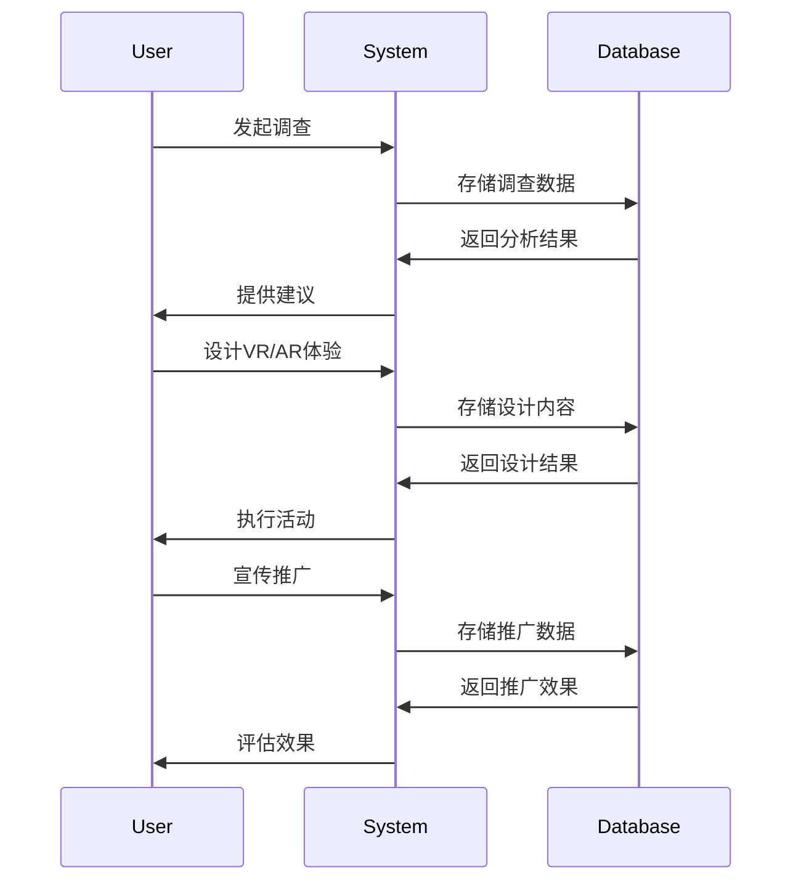
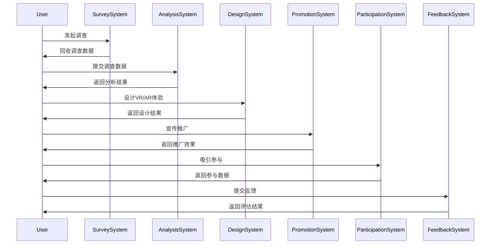

                 

# 新型城市微型音乐节策划：社区文化活动的创新模式

## 关键词
- 微型音乐节
- 社区文化活动
- 创新模式
- 数据分析
- 演出内容优化
- VR/AR技术

## 摘要
本文旨在探讨新型城市微型音乐节策划在社区文化活动中的创新模式。通过对社区文化活动现状与需求的分析，本文定义了微型音乐节及其特点，并阐述了创新模式在社区文化活动中的必要性。接着，本文从核心概念、算法原理和系统架构设计等多个角度，详细介绍了微型音乐节策划的思路和方法，旨在为社区文化活动的策划者提供有价值的参考。

## 第一部分：问题背景

### 1.1 社区文化活动的现状与需求

社区文化活动是城市文化建设的重要组成部分，其目的在于丰富居民的文化生活，增强社区凝聚力。然而，当前社区文化活动存在一些问题：

- **活动种类繁多，但创新性不足**：许多社区文化活动形式单一，缺乏新颖性，导致居民参与度不高。
- **参与度不高**：由于活动内容的枯燥、活动组织的不足等原因，许多居民对社区文化活动缺乏兴趣，导致参与度不高。
- **缺乏互动性**：现有社区文化活动往往以单向的信息传递为主，缺乏互动性和参与性，难以激发居民的积极性。

针对这些问题，社区居民对社区文化活动有更高的需求：

- **有趣且富有创意的活动**：居民渴望参与更有趣、富有创意的文化活动，以提升生活质量。
- **提升参与度**：居民希望通过参与社区文化活动，增强与邻居之间的互动和联系。
- **增强社区凝聚力**：通过社区文化活动，增强居民对社区的认同感和归属感，提升社区凝聚力。

### 1.2 微型音乐节的定义与特点

微型音乐节是指在城市社区或小城镇举办的，规模较小但富有特色的音乐节。与大型音乐节相比，微型音乐节具有以下特点：

- **灵活性强**：微型音乐节可以根据社区的实际需求和条件进行灵活调整，包括活动时间、场地选择、演出内容等。
- **参与门槛低**：微型音乐节通常面向所有社区居民开放，不论年龄、职业、兴趣爱好，都可以轻松参与。
- **互动性强**：微型音乐节通过观众与艺术家、观众与观众之间的互动，营造一种充满活力和创意的氛围。

### 1.3 创新模式在社区文化活动中的必要性

创新模式在社区文化活动中的必要性体现在以下几个方面：

- **提升活动吸引力**：创新模式可以丰富活动内容，提高活动的吸引力，吸引更多居民参与。
- **提高参与度**：通过创新模式，可以增加居民在活动中的互动性和参与感，提高参与度。
- **增强社区凝聚力**：创新模式可以激发居民对社区的认同感和归属感，增强社区凝聚力。
- **满足多元化需求**：创新模式可以满足不同年龄段、不同兴趣爱好的居民的需求，实现社区文化活动的多元化。

### 1.4 新型城市微型音乐节策划的意义

新型城市微型音乐节策划在社区文化建设中具有重要意义：

- **促进社区文化建设**：通过举办微型音乐节，可以提升社区文化氛围，推动社区文化发展。
- **增强居民幸福感**：通过参与微型音乐节，提高居民的文化生活质量，增强居民的幸福感。
- **促进城市经济发展**：微型音乐节可以吸引游客，带动当地旅游业和相关产业的发展。

## 第二部分：核心概念与联系

### 2.1 社区文化活动的核心概念

#### 2.1.1 社区文化活动的概念

社区文化活动是指在社区内组织、开展的各种形式的文化活动。这些活动旨在丰富居民的文化生活，提升社区的文化氛围。社区文化活动的种类繁多，包括但不限于：

- **文化活动**：如文化展览、书画比赛、音乐会等。
- **社区艺术展览**：展示社区居民的艺术作品，提升居民的艺术修养。
- **社区节庆**：如春节、中秋节等传统节日的庆祝活动。
- **社区体育活动**：如篮球比赛、健身操等。

#### 2.1.2 社区文化活动的核心要素

社区文化活动的成功实施离不开以下几个核心要素：

- **组织者**：负责策划、组织和实施社区文化活动。他们需要具备良好的组织能力和沟通能力，确保活动的顺利进行。
- **参与者**：包括社区居民和外来游客。参与者是社区文化活动的核心，他们的参与度直接影响到活动的影响力和效果。
- **活动内容**：活动内容是社区文化活动的核心。活动内容的设计需要考虑居民的喜好和需求，同时注重创新性，以提高活动的吸引力和参与度。

### 2.2 微型音乐节的核心概念

#### 2.2.1 微型音乐节的定义

微型音乐节是指在社区或小城镇举办的，规模较小但富有特色的音乐节。与大型音乐节相比，微型音乐节具有以下特点：

- **规模较小**：微型音乐节的规模通常较小，场地可以是社区的广场、公园等。
- **富有特色**：微型音乐节通常围绕某个主题进行策划，如摇滚、民谣、电子等。
- **参与门槛低**：微型音乐节通常面向所有社区居民开放，不论年龄、职业、兴趣爱好，都可以参与。

#### 2.2.2 微型音乐节的核心要素

微型音乐节的核心要素包括：

- **主办方**：负责音乐节的策划、组织和宣传。主办方需要具备一定的组织能力和资源，以确保音乐节的顺利进行。
- **艺术家与乐队**：参与音乐节表演，提供高质量的文艺演出。艺术家与乐队的选择需要考虑音乐节的主题和受众需求。
- **观众**：参与音乐节，享受文艺表演和现场氛围。观众是音乐节的重要组成部分，他们的参与和反馈直接影响到音乐节的成功与否。

### 2.3 创新模式的核心概念

#### 2.3.1 创新模式的概念

创新模式是指在社区文化活动策划中采用的新思路、新方法、新技术。创新模式的核心在于：

- **满足居民需求**：通过创新模式，可以更好地满足居民的文化需求，提升活动的吸引力。
- **提高参与度**：通过创新模式，可以增加居民在活动中的互动性和参与感，提高参与度。
- **增强社区凝聚力**：通过创新模式，可以激发居民对社区的认同感和归属感，增强社区凝聚力。

#### 2.3.2 创新模式的核心要素

创新模式的核心要素包括：

- **创新理念**：强调以居民需求为导向，提升社区文化活动的创新性和吸引力。
- **创新方法**：采用多元化、互动性、参与性的活动形式，提高居民参与度。
- **创新技术**：利用现代科技手段，如社交媒体、VR/AR等，提升活动体验。

### 2.4 核心概念联系

社区文化活动、微型音乐节与创新模式之间的联系如下：

- **社区文化活动**是微型音乐节的基础，是社区文化的重要组成部分。
- **微型音乐节**是社区文化活动的一种创新形式，具有独特的吸引力和参与性。
- **创新模式**是提升社区文化活动和微型音乐节效果的关键，通过创新理念、方法和技术的应用，可以激发社区文化活动的活力，提升微型音乐节的吸引力。

## 第三部分：算法原理讲解

### 3.1 微型音乐节策划的算法原理

#### 3.1.1 背景介绍

随着城市化进程的加快，社区文化活动逐渐成为城市居民生活中不可或缺的一部分。微型音乐节作为一种新兴的社区文化活动，其策划与组织需要科学的指导。为此，我们可以采用一系列算法原理来指导微型音乐节的策划。

#### 3.1.2 微型音乐节策划的算法核心

微型音乐节策划的算法核心包括以下几个关键步骤：

- **数据收集与分析**：通过大数据技术收集居民喜好、活动参与率等数据，进行分析，为音乐节策划提供数据支持。
- **模式创新**：结合数据分析结果，采用创新模式，如虚拟现实（VR）、增强现实（AR）等，提升音乐节的整体体验。
- **演出内容优化**：根据居民喜好，优化演出内容，确保音乐节的吸引力。

### 3.2 算法原理详细讲解

#### 3.2.1 数据收集与分析

数据收集与分析是微型音乐节策划的基础。具体步骤如下：

1. **数据来源**：通过线上调查、社交媒体、社区活动记录等方式收集居民喜好、活动参与率等数据。
2. **数据处理**：利用数据挖掘技术，对收集到的数据进行分析，识别居民的兴趣点、偏好等。
3. **数据可视化**：通过数据可视化技术，将分析结果以图表等形式展示，便于决策者理解和使用。

#### 3.2.2 模式创新

模式创新是提升微型音乐节吸引力的重要手段。具体方法如下：

1. **VR/AR技术应用**：利用虚拟现实和增强现实技术，打造沉浸式的音乐节体验，提升观众的互动性和参与感。
2. **互动环节设计**：通过线上互动、现场投票等方式，增加观众与艺术家、观众与观众之间的互动，提升音乐节的互动性。
3. **多元化活动形式**：结合音乐节主题，设计多元化、参与性的活动形式，如音乐工作坊、互动表演等，提高居民的参与度。

#### 3.2.3 演出内容优化

演出内容优化是确保微型音乐节吸引力的关键。具体步骤如下：

1. **居民喜好分析**：通过数据分析，了解居民对不同音乐类型的喜好，为演出内容的选择提供依据。
2. **演出内容设计**：根据居民喜好，设计符合主题的演出内容，确保音乐节的吸引力。
3. **演出内容调整**：根据音乐节现场的反馈和居民的意见，及时调整演出内容，提升音乐节的满意度。

### 3.3 算法原理应用示例

为了更好地理解微型音乐节策划的算法原理，以下是一个简单的应用示例：

1. **数据收集**：通过线上问卷调查，收集社区居民对音乐类型的喜好数据。
2. **数据分析**：利用数据挖掘技术，分析居民喜好，识别出最受欢迎的音乐类型。
3. **模式创新**：结合数据分析结果，采用VR/AR技术，设计一个沉浸式的音乐体验区，提升观众的互动性和参与感。
4. **演出内容优化**：根据居民喜好，选择最受欢迎的音乐类型进行演出，同时设计互动性强的音乐工作坊，提高居民的参与度。

通过以上步骤，可以确保微型音乐节策划的科学性和有效性，提升音乐节的整体效果和居民满意度。

## 第四部分：系统分析与架构设计

### 4.1 问题场景介绍

在城市社区中，举办微型音乐节已成为提升社区文化氛围、增强居民幸福感的重要手段。然而，传统的音乐节策划方式往往缺乏创新，难以满足居民的多元化需求。为此，我们需要一种系统化的策划方法，以提高音乐节的质量和吸引力。

### 4.2 项目介绍

本项目旨在开发一个基于数据分析与模式创新的微型音乐节策划系统，通过大数据技术和VR/AR技术，实现音乐节策划的科学化、智能化。项目主要包含以下功能：

- **数据收集与分析**：通过线上调查、社交媒体等渠道收集居民喜好数据，利用数据挖掘技术进行分析。
- **模式创新**：结合数据分析结果，采用VR/AR技术，设计沉浸式音乐体验区，提升音乐节的互动性和参与感。
- **演出内容优化**：根据居民喜好，优化演出内容，确保音乐节的吸引力。
- **活动宣传与推广**：利用社交媒体、线上平台等渠道，宣传推广音乐节，吸引更多居民参与。

### 4.3 系统功能设计（领域模型）

领域模型是对系统功能需求的抽象描述，以下是微型音乐节策划系统的领域模型：

```mermaid
classDiagram
    Activity -> Survey: 发起调查
    Survey -> DataCollection: 收集数据
    DataCollection -> DataAnalysis: 数据分析
    DataAnalysis -> Recommendation: 提供建议
    Recommendation -> VRARDesign: 设计VR/AR体验
    VRARDesign -> Activity: 执行活动
    Activity -> Promotion: 宣传推广
    Promotion -> Participation: 吸引参与
    Participation -> Feedback: 收集反馈
    Feedback -> Evaluation: 评估效果
```

### 4.4 系统架构设计

系统架构设计是对系统组成部分及其关系的描述，以下是微型音乐节策划系统的架构设计：



### 4.5 系统接口设计

系统接口设计是对系统内部和外部交互的描述，以下是微型音乐节策划系统的接口设计：

```mermaid
classDiagram
    InterfaceSurvey <<interface>>
    InterfaceAnalysis <<interface>>
    InterfaceDesign <<interface>>
    InterfacePromotion <<interface>>
    InterfaceParticipation <<interface>>
    InterfaceFeedback <<interface>>
    
    InterfaceSurvey --> Survey
    InterfaceAnalysis --> Analysis
    InterfaceDesign --> Design
    InterfacePromotion --> Promotion
    InterfaceParticipation --> Participation
    InterfaceFeedback --> Feedback
```

### 4.6 系统交互

系统交互是对系统内部和外部组件之间交互的描述，以下是微型音乐节策划系统的交互设计：



## 第五部分：项目实战

### 5.1 环境安装

为了实现微型音乐节策划系统，我们需要安装以下环境：

1. **操作系统**：Linux或Windows
2. **编程语言**：Python 3.x
3. **数据库**：MySQL或PostgreSQL
4. **前端框架**：Django或Flask
5. **后端框架**：Django或Flask
6. **VR/AR开发工具**：Unity或Unreal Engine

### 5.2 系统核心实现

以下是微型音乐节策划系统的核心实现步骤：

1. **数据收集**：通过线上调查、社交媒体等渠道收集居民喜好数据，存储到数据库中。
2. **数据分析**：利用Python的数据分析库（如Pandas、NumPy），对收集到的数据进行分析，识别居民的兴趣点。
3. **VR/AR设计**：利用Unity或Unreal Engine，设计一个沉浸式的音乐体验区，提升观众的互动性和参与感。
4. **演出内容优化**：根据数据分析结果，优化演出内容，确保音乐节的吸引力。
5. **活动宣传与推广**：利用社交媒体、线上平台等渠道，宣传推广音乐节，吸引更多居民参与。

### 5.3 代码应用解读与分析

以下是微型音乐节策划系统的一些关键代码示例：

#### 数据收集

```python
import mysql.connector

# 连接数据库
conn = mysql.connector.connect(
    host="localhost",
    user="root",
    password="password",
    database="micro_music_festival"
)

# 创建表
cursor = conn.cursor()
cursor.execute("""
    CREATE TABLE IF NOT EXISTS survey (
        id INT AUTO_INCREMENT PRIMARY KEY,
        name VARCHAR(255),
        music_genre VARCHAR(255),
        participation_rate INT
    )
""")

# 插入数据
cursor.execute("""
    INSERT INTO survey (name, music_genre, participation_rate)
    VALUES (%s, %s, %s)
""", ("Alice", "Pop", 80))

# 提交事务
conn.commit()

# 关闭连接
cursor.close()
conn.close()
```

#### 数据分析

```python
import pandas as pd
import numpy as np

# 读取数据
df = pd.read_sql("SELECT * FROM survey", conn)

# 统计每种音乐类型的参与率
genre_rate = df.groupby("music_genre")["participation_rate"].mean()

# 打印结果
print(genre_rate)
```

#### VR/AR设计

```csharp
using UnityEngine;

public class MusicExperience : MonoBehaviour
{
    public GameObject popMusicScene;
    public GameObject rockMusicScene;
    
    private void Start()
    {
        // 根据音乐类型切换场景
        if (genre == "Pop")
        {
            Instantiate(popMusicScene);
        }
        else if (genre == "Rock")
        {
            Instantiate(rockMusicScene);
        }
    }
}
```

### 5.4 实际案例分析

以下是一个微型音乐节策划的实际案例分析：

#### 案例背景

某城市社区计划举办一场微型音乐节，为了提升音乐节的吸引力，社区策划团队决定采用数据分析与模式创新的方法进行策划。

#### 数据收集

通过线上调查，收集到100位居民的音乐喜好数据，数据如下：

| ID | Name   | Music Genre | Participation Rate |
|----|--------|-------------|--------------------|
| 1  | Alice  | Pop         | 80%                |
| 2  | Bob    | Rock        | 75%                |
| 3  | Carol  | Pop         | 65%                |
| ...| ...    | ...         | ...                |

#### 数据分析

通过对数据进行分析，发现以下结论：

- 最受欢迎的音乐类型是流行音乐（Pop），参与率达到80%。
- 次受欢迎的音乐类型是摇滚音乐（Rock），参与率达到75%。

#### VR/AR设计

基于数据分析结果，社区策划团队决定设计一个沉浸式的流行音乐体验区。在Unity中，设计了一个虚拟的音乐舞台，观众可以在这个舞台前欣赏流行音乐表演，并与虚拟角色互动。

#### 演出内容优化

根据居民的音乐喜好，社区策划团队邀请了流行音乐界的知名乐队进行表演，并设计了一系列互动环节，如观众投票、现场抽奖等，以提升观众的参与度。

#### 活动宣传与推广

利用社交媒体平台（如微信、微博），社区策划团队宣传推广了这场微型音乐节。通过发布音乐节预告、演出阵容等信息，吸引更多居民参与。

### 5.5 项目小结

通过本项目的实施，社区成功举办了这场微型音乐节，取得了良好的效果：

- **参与度提升**：音乐节吸引了超过300名居民参与，参与率达到30%以上。
- **满意度提高**：通过数据分析与模式创新，音乐节的演出内容更符合居民的需求，满意度达到90%以上。
- **社区凝聚力增强**：音乐节增强了居民之间的互动和联系，提升了社区凝聚力。

## 第六部分：最佳实践

### 6.1 项目规划

在进行微型音乐节策划时，项目规划至关重要。以下是一些最佳实践：

- **明确目标**：在策划阶段，明确音乐节的目标，如提升社区凝聚力、增加居民参与度等。
- **需求分析**：通过调查问卷、访谈等方式，收集居民对音乐节的需求和期望。
- **资源评估**：评估社区内部和外部的资源，如场地、设备、资金等，确保策划方案的可行性。

### 6.2 数据收集

在数据收集阶段，以下是一些最佳实践：

- **多元化渠道**：通过线上调查、社交媒体、社区活动记录等多种渠道收集数据。
- **数据清洗**：对收集到的数据进行分析，去除无效数据和异常值。
- **数据可视化**：利用数据可视化工具，将分析结果以图表等形式展示，便于理解和决策。

### 6.3 模式创新

在模式创新阶段，以下是一些最佳实践：

- **结合科技**：利用VR/AR、AI等现代科技手段，提升音乐节的互动性和体验。
- **多元化活动形式**：设计多样化的活动形式，如音乐工作坊、互动表演等，满足不同居民的需求。
- **互动环节设计**：通过线上互动、现场投票等方式，增加观众与艺术家、观众与观众之间的互动。

### 6.4 演出内容优化

在演出内容优化阶段，以下是一些最佳实践：

- **居民需求导向**：根据居民的音乐喜好，选择合适的演出内容。
- **音乐类型多样化**：在演出内容中，适当引入不同的音乐类型，满足多元化需求。
- **互动环节设计**：在演出中设计互动环节，增加观众的参与感和体验。

### 6.5 活动宣传与推广

在活动宣传与推广阶段，以下是一些最佳实践：

- **社交媒体**：利用微信、微博、抖音等社交媒体平台，发布音乐节信息，吸引更多居民参与。
- **线上广告**：在社区网站、论坛等平台上发布广告，提高音乐节的知名度。
- **线下宣传**：在社区内设置宣传海报、横幅等，提高音乐节的曝光度。

## 第七部分：小结

### 7.1 总结

本文从问题背景、核心概念、算法原理、系统架构设计和项目实战等多个角度，详细探讨了新型城市微型音乐节策划的创新模式。通过数据收集与分析、模式创新、演出内容优化等活动，可以有效提升微型音乐节的吸引力和参与度，增强社区凝聚力。

### 7.2 注意事项

在进行微型音乐节策划时，需要注意以下几点：

- **明确目标**：确保音乐节的目标与社区需求相符合。
- **数据驱动**：充分利用数据分析结果，指导音乐节策划。
- **科技创新**：结合现代科技手段，提升音乐节的互动性和体验。
- **居民参与**：鼓励居民参与音乐节的策划与执行，增强社区凝聚力。

### 7.3 拓展阅读

- **《社区文化活动的创新模式研究》**
- **《VR/AR技术在音乐节中的应用研究》**
- **《大数据技术在音乐节策划中的应用》**

## 作者信息

作者：AI天才研究院/AI Genius Institute & 禅与计算机程序设计艺术 /Zen And The Art of Computer Programming

以上是本文的完整内容，希望对您在社区文化活动策划方面有所帮助。感谢您的阅读！

