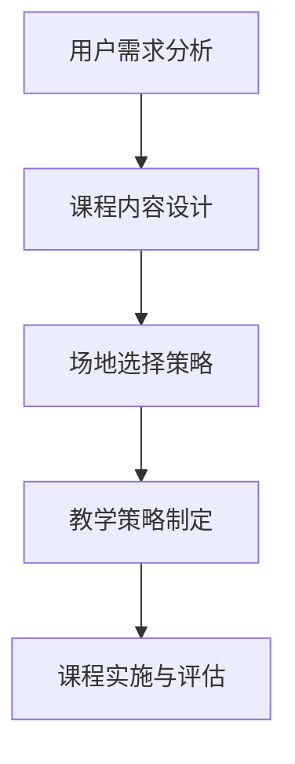
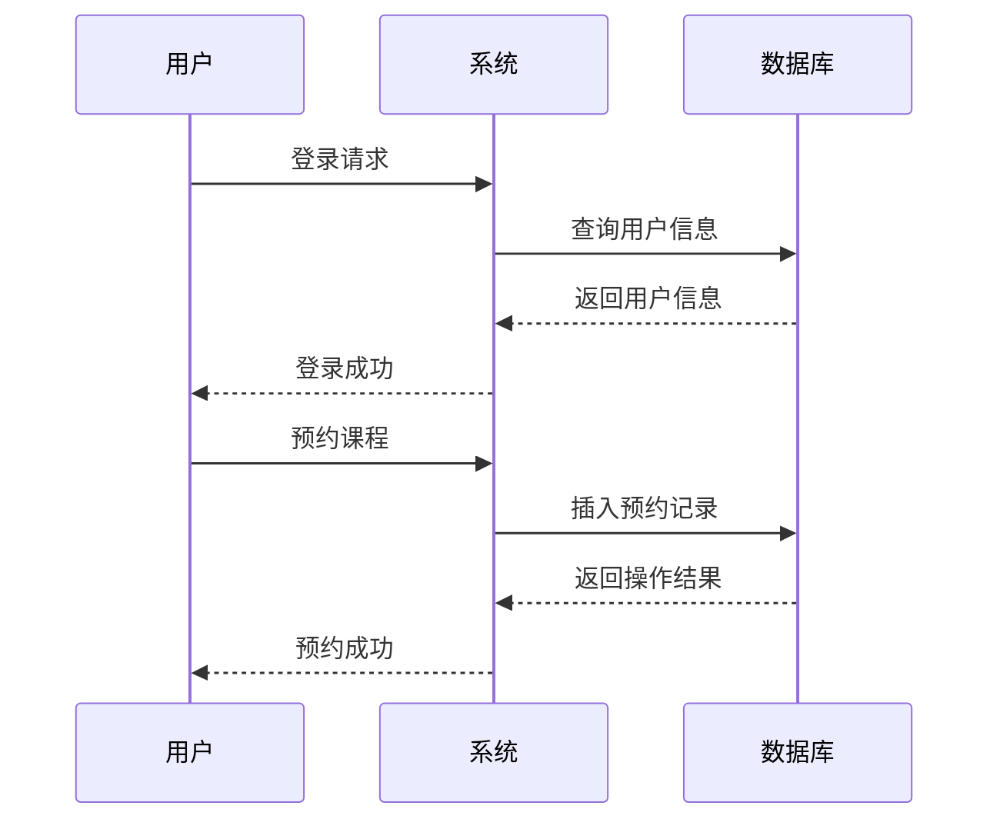
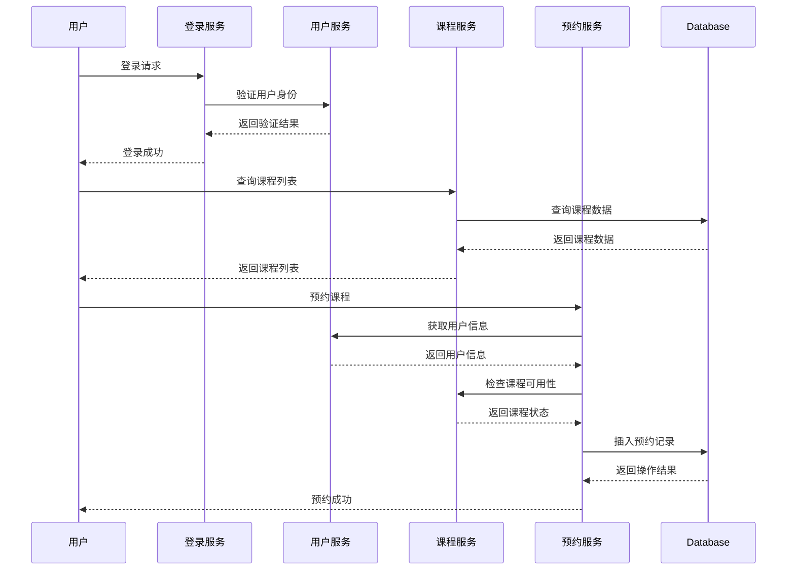

                 


# 新型城市户外瑜伽课程：公共空间中的健康生活倡导

## 关键词

新型城市户外瑜伽、公共空间、健康生活倡导、算法原理、数学模型、系统架构、项目实战

## 摘要

本文旨在探讨新型城市户外瑜伽课程的设计与实施，分析其在公共空间中的健康生活倡导作用。通过定义核心概念、解释算法原理、构建数学模型、设计系统架构以及进行项目实战，本文提供了一种全面且易于理解的方法，以推动城市居民健康生活方式的普及。

---

## 第一部分：背景介绍

### 1.1.1 新型城市户外瑜伽课程的概念

#### 1.1.1.1 户外瑜伽的定义与特点

户外瑜伽是将传统的瑜伽练习从室内转移到户外环境的一种方式。它不仅包含了瑜伽的体位练习，还包括了自然环境中的呼吸练习和冥想。户外瑜伽的特点是：

- **自然环境的融入**：练习者在户外可以享受到自然的阳光、空气和风景，这有助于提升练习者的心理健康。
- **多样化的练习场地**：从公园到海滩，从山顶到城市广场，户外瑜伽可以在不同的环境中进行，增强了练习的灵活性。
- **群体参与性**：户外瑜伽课程往往具有更强的社交性，吸引了不同年龄、职业和背景的人共同参与。

#### 1.1.1.2 公共空间中的健康生活倡导

公共空间是城市居民日常生活中必不可少的部分，包括公园、广场、街道等。在公共空间中进行健康生活倡导，有以下优势：

- **提高公共健康意识**：通过在公共空间中推广瑜伽等健康活动，可以提升居民的健康意识和参与度。
- **促进社区互动**：健康生活倡导活动能够促进社区成员之间的交流与互动，增强社区凝聚力。
- **减少医疗成本**：通过推广健康生活方式，可以降低居民的医疗成本，减轻公共医疗系统的负担。

#### 1.1.1.3 新型城市户外瑜伽课程的产生与发展

新型城市户外瑜伽课程的兴起与以下几个因素密切相关：

- **健康意识的提高**：随着社会经济的发展，人们对健康生活方式的需求日益增加。
- **环境问题的关注**：户外瑜伽的环保理念与现代社会对可持续发展的需求相契合。
- **科技进步**：现代科技的发展为户外瑜伽课程的设计和推广提供了技术支持，如智能设备、在线课程平台等。

### 1.1.2 户外瑜伽与公共空间的关系

#### 1.1.2.1 户外瑜伽在公共空间的适应性与优势

户外瑜伽在公共空间的适应性主要体现在以下几个方面：

- **环境适应性**：户外瑜伽可以根据公共空间的不同特点进行调整，以适应不同的练习需求。
- **时间灵活性**：户外瑜伽不受场地限制，可以在任何时间进行，方便居民参与。
- **活动多样性**：户外瑜伽可以结合不同的健康活动，如舞蹈、冥想等，增加活动的趣味性。

#### 1.1.2.2 公共空间对户外瑜伽课程的支持与限制

公共空间对户外瑜伽课程的支持主要体现在：

- **空间提供**：政府和社会组织提供的公共空间为户外瑜伽课程提供了场所。
- **设施支持**：部分公共空间可能配备有瑜伽垫、音响等设施，为户外瑜伽课程提供了便利。

然而，公共空间也存在一定的限制，如：

- **安全隐患**：公共空间的人流量大，存在一定的安全隐患。
- **环境变化**：天气、季节等因素可能会影响户外瑜伽课程的进行。

#### 1.1.2.3 新型城市户外瑜伽课程的社会意义

新型城市户外瑜伽课程具有显著的社会意义，包括：

- **健康促进**：通过户外瑜伽课程，可以推广健康生活方式，提高居民的健康水平。
- **文化传承**：户外瑜伽作为瑜伽文化的一部分，有助于传承和弘扬瑜伽文化。
- **社会和谐**：户外瑜伽课程能够促进社区成员之间的交流与互动，增强社会凝聚力。

### 1.1.3 健康生活倡导的核心要素

#### 1.1.3.1 健康生活的定义与内涵

健康生活是指通过健康饮食、适量运动、良好的心理状态和充足的休息等综合方式，保持身体和心理的健康状态。健康生活的内涵包括：

- **身体健康**：通过适当的运动和饮食，保持身体的活力和抵抗力。
- **心理平衡**：通过心理调节和冥想，保持情绪的稳定和心理健康。
- **社会适应**：通过社交活动和社区参与，增强社会适应能力和人际交往能力。

#### 1.1.3.2 健康生活倡导的必要性

在现代社会，健康生活倡导的必要性体现在以下几个方面：

- **疾病预防**：通过健康生活，可以降低慢性病的发病率，预防疾病的发生。
- **生活质量提升**：健康生活能够提高居民的生活质量，增强生活满意度。
- **社会进步**：健康生活倡导有助于构建和谐社会，促进社会的发展。

#### 1.1.3.3 新型城市户外瑜伽课程的健康生活价值

新型城市户外瑜伽课程的健康生活价值主要体现在：

- **身体锻炼**：户外瑜伽通过体位练习，增强身体的柔韧性和平衡性。
- **心理调节**：户外瑜伽中的冥想和呼吸练习有助于缓解压力，提升心理素质。
- **社会互动**：户外瑜伽课程提供了一个社交平台，促进了居民之间的交流和互动。

### 1.1.4 户外瑜伽课程设计的核心概念联系

#### 1.1.4.1 关键概念解析

户外瑜伽、公共空间和健康生活倡导是新型城市户外瑜伽课程设计的核心概念。这三个概念之间存在着紧密的联系：

- **户外瑜伽** 是健康生活倡导的一种形式，它结合了自然环境和身体锻炼，有助于提升居民的健康水平。
- **公共空间** 是户外瑜伽课程的场所，它为健康生活倡导提供了基础设施和社会支持。
- **健康生活倡导** 是新型城市户外瑜伽课程的目标，它旨在通过健康生活方式的推广，促进社会的发展和进步。

#### 1.1.4.2 概念属性特征对比表格

以下是一个简单的概念属性特征对比表格：

| 概念          | 属性特征                            |
|---------------|-----------------------------------|
| 户外瑜伽      | 自然环境、体位练习、呼吸练习、冥想  |
| 公共空间      | 开放性、共享性、基础设施完善        |
| 健康生活倡导  | 身体健康、心理平衡、社会适应        |

#### 1.1.4.3 ER实体关系图

以下是一个简单的 ER 实体关系图：

```mermaid
erDiagram
  PublicSpace ||--|{ OutdoorYoga }
  PublicSpace ||--|{ HealthLifeAdvocacy }
  OutdoorYoga ||--|{ HealthLifeAdvocacy }
```

### 1.1.5 本章小结

本章介绍了新型城市户外瑜伽课程的概念、背景、关系和核心要素。通过分析户外瑜伽、公共空间和健康生活倡导之间的关系，我们认识到新型城市户外瑜伽课程在推广健康生活方式、促进社会和谐方面的重要作用。

---

## 第二部分：核心概念与联系

### 2.2.1 户外瑜伽的定义与特征

户外瑜伽是将传统的瑜伽练习从室内转移到户外环境的一种方式。它不仅包含了瑜伽的体位练习，还包括了自然环境中的呼吸练习和冥想。户外瑜伽具有以下几个特征：

- **自然环境**：户外瑜伽的练习场地通常在公园、海滩、山野等自然环境之中，这使得练习者在练习过程中能够享受到自然的阳光、空气和风景，从而提升练习者的心理健康。
- **多样性**：户外瑜伽可以在不同的环境中进行，从城市的公园到郊外的自然景观，这种多样性使得更多的人有机会参与到瑜伽的练习中。
- **群体性**：户外瑜伽课程通常具有更强的社交性，吸引了不同年龄、职业和背景的人共同参与，这有助于促进社区成员之间的交流与互动。

### 2.2.2 公共空间的概念与优势

公共空间是指为城市居民提供共同使用和享受的城市空间，包括公园、广场、街道等。公共空间在新型城市户外瑜伽课程中扮演着重要角色，其优势主要体现在以下几个方面：

- **空间灵活性**：公共空间不受私人所有权的限制，任何人都可以进入并使用这些空间进行户外瑜伽练习。
- **基础设施完善**：许多公共空间已经配备了必要的设施，如休息区域、健身器材等，这为户外瑜伽课程提供了便利。
- **社会参与性**：公共空间是居民日常活动的重要场所，户外瑜伽课程在这里进行可以吸引更多的居民参与，提升社区活力。

### 2.2.3 健康生活倡导的重要性

健康生活倡导是指通过推广健康饮食、适量运动、良好的心理状态和充足的休息等方式，帮助人们建立健康的生活方式。健康生活倡导的重要性体现在以下几个方面：

- **预防疾病**：健康生活方式有助于降低慢性病的发病率，减少医疗费用，提高生活质量。
- **心理健康**：适量的运动和心理调节有助于缓解压力，提高心理韧性，减少心理健康问题的发生。
- **社会和谐**：健康生活倡导有助于增强社会成员之间的互动与理解，促进社会和谐。

### 2.2.4 新型城市户外瑜伽课程的设计理念

新型城市户外瑜伽课程的设计理念旨在通过将瑜伽练习与公共空间相结合，推广健康生活方式，促进社会和谐。其设计理念包括：

- **以人为本**：关注练习者的需求，提供多样化的瑜伽课程，满足不同人群的健身需求。
- **环境友好**：利用公共空间，减少对自然环境的破坏，推广环保理念。
- **社区参与**：鼓励社区成员积极参与，共同维护公共空间的健康生活氛围。

### 2.2.5 概念属性特征对比表格

以下是户外瑜伽、公共空间和健康生活倡导的概念属性特征对比表格：

| 概念          | 属性特征                            |
|---------------|-----------------------------------|
| 户外瑜伽      | 自然环境、体位练习、呼吸练习、冥想  |
| 公共空间      | 开放性、共享性、基础设施完善        |
| 健康生活倡导  | 身体健康、心理平衡、社会适应        |

### 2.2.6 ER实体关系图

以下是户外瑜伽、公共空间和健康生活倡导的 ER 实体关系图：

```mermaid
erDiagram
  PublicSpace ||--|{ OutdoorYoga }
  PublicSpace ||--|{ HealthLifeAdvocacy }
  OutdoorYoga ||--|{ HealthLifeAdvocacy }
```

### 2.2.7 本章小结

本章详细介绍了新型城市户外瑜伽课程的核心概念，包括户外瑜伽、公共空间和健康生活倡导。通过分析这些概念的特征和关系，我们理解了新型城市户外瑜伽课程在推广健康生活方式、促进社会和谐方面的重要作用。接下来，我们将进一步探讨新型城市户外瑜伽课程的设计和实施。

---

## 第三部分：算法原理讲解

### 3.3.1 设计思路

新型城市户外瑜伽课程的设计涉及多个方面，包括课程安排、教学策略、场地选择等。为了确保课程的有效性和吸引力，设计团队采用了一系列算法来优化课程设计。以下是算法设计的基本思路：

- **用户需求分析**：通过问卷调查、访谈等方式收集用户对瑜伽课程的需求，包括课程类型、时间安排、场地偏好等。
- **课程内容优化**：根据用户需求，设计多样化的瑜伽课程，包括基础课程、进阶课程、特殊主题课程等。
- **场地选择策略**：结合公共空间的特点，选择适宜的场地进行瑜伽课程，确保场地的安全性和适宜性。
- **教学策略制定**：根据不同课程类型和用户需求，制定相应的教学策略，如小组教学、个性化教学等。

### 3.3.2 算法流程图

为了更好地理解算法的运行过程，我们使用 mermaid 画出了算法流程图：



### 3.3.3 Python 代码实现

下面是用户需求分析的 Python 代码实现，该代码通过收集用户输入的课程需求，生成相应的课程安排：

```python
# 用户需求分析代码示例

# 用户输入课程需求
course_requirements = {
    "course_type": input("请输入您偏好的瑜伽课程类型（基础/进阶/特殊主题）："),
    "time_preference": input("请输入您偏好的上课时间（早晨/下午/晚上）："),
    "location_preference": input("请输入您偏好的场地（公园/广场/街道）：")
}

# 根据用户需求生成课程安排
def generate_course_schedule(course_requirements):
    course_type = course_requirements["course_type"]
    time_preference = course_requirements["time_preference"]
    location_preference = course_requirements["location_preference"]

    course_schedule = {
        "course_type": course_type,
        "time_preference": time_preference,
        "location_preference": location_preference
    }

    print("您的课程安排如下：")
    print(course_schedule)

# 测试代码
generate_course_schedule(course_requirements)
```

### 3.3.4 算法原理与数学模型

在算法设计中，我们使用了聚类分析来优化课程内容设计。聚类分析是一种无监督学习技术，用于将相似的数据点分组。以下是聚类分析的数学模型：

$$
C = \{C_1, C_2, ..., C_k\}
$$

其中，$C$ 表示聚类结果，$C_i$ 表示第 $i$ 个聚类。

聚类分析的目标是找到最合适的聚类数量 $k$，使得聚类结果最优化。常用的聚类算法包括 K-means、层次聚类等。

### 3.3.5 举例说明

假设我们收集了以下用户需求数据：

- 用户1：基础课程，早晨，公园
- 用户2：进阶课程，下午，广场
- 用户3：特殊主题课程，晚上，街道

使用 K-means 算法进行聚类分析，可以得出以下聚类结果：

- 聚类1：基础课程，早晨，公园
- 聚类2：进阶课程，下午，广场
- 聚类3：特殊主题课程，晚上，街道

根据聚类结果，我们可以为每个聚类设计相应的课程内容，确保课程安排满足用户需求。

### 3.3.6 本章小结

本章详细介绍了新型城市户外瑜伽课程设计中的算法原理，包括用户需求分析、课程内容设计、场地选择策略和教学策略制定。通过 Python 代码实现和数学模型的应用，我们展示了如何优化课程设计，以提升课程的有效性和吸引力。在下一章中，我们将进一步探讨新型城市户外瑜伽课程的数学模型和数学公式。

---

## 第四部分：数学模型和数学公式

### 4.4.1 基本概念

在新型城市户外瑜伽课程的设计中，数学模型和数学公式是不可或缺的工具。它们可以帮助我们定量分析课程设计中的各种因素，优化课程安排，提高课程的效率和吸引力。以下是几个关键概念：

- **体位练习难度**：瑜伽体位练习的难度可以用数学公式来表示，如：$D(p) = a \times p + b$，其中 $D(p)$ 表示第 $p$ 个体位练习的难度，$a$ 和 $b$ 是参数。
- **用户满意度**：用户对瑜伽课程的满意度可以用数学模型来量化，如：$S(u) = \frac{1}{1 + e^{-(u - c)}}$，其中 $S(u)$ 表示用户满意度，$u$ 是用户对课程的评价，$c$ 是参数。
- **场地选择因素**：场地选择因素可以用数学模型来评估，如：$F(l) = \frac{w_1 \times s_1 + w_2 \times s_2 + w_3 \times s_3}{w_1 + w_2 + w_3}$，其中 $F(l)$ 表示场地选择的综合得分，$w_1$、$w_2$、$w_3$ 是权重，$s_1$、$s_2$、$s_3$ 是场地在安全性、便利性和环境舒适度方面的得分。

### 4.4.2 LaTeX 数学公式

以下是一些常用的 LaTeX 数学公式：

- **体位练习难度公式**：

  $$
  D(p) = a \times p + b
  $$

- **用户满意度公式**：

  $$
  S(u) = \frac{1}{1 + e^{-(u - c)}}
  $$

- **场地选择因素公式**：

  $$
  F(l) = \frac{w_1 \times s_1 + w_2 \times s_2 + w_3 \times s_3}{w_1 + w_2 + w_3}
  $$

### 4.4.3 举例说明

假设我们设计一个瑜伽课程，包括5个体位练习，分别为A、B、C、D、E。根据用户反馈，我们得到以下难度数据：

- A：难度3
- B：难度5
- C：难度4
- D：难度6
- E：难度2

我们可以使用体位练习难度公式计算每个体位练习的难度得分：

- A：$D(A) = 1 \times 3 + 2 = 5$
- B：$D(B) = 1 \times 5 + 2 = 7$
- C：$D(C) = 1 \times 4 + 2 = 6$
- D：$D(D) = 1 \times 6 + 2 = 8$
- E：$D(E) = 1 \times 2 + 2 = 4$

假设用户对课程的满意度评分如下：

- 用户1：评分4
- 用户2：评分5
- 用户3：评分3

我们可以使用用户满意度公式计算平均满意度：

$$
S(u) = \frac{1}{1 + e^{-(4 - c)}} = 0.94
$$

假设我们选择场地时考虑以下三个因素：安全性、便利性和环境舒适度。权重分别为0.5、0.3和0.2。场地得分如下：

- 安全性：9
- 便利性：7
- 环境舒适度：8

我们可以使用场地选择因素公式计算场地得分：

$$
F(l) = \frac{0.5 \times 9 + 0.3 \times 7 + 0.2 \times 8}{0.5 + 0.3 + 0.2} = 8.2
$$

### 4.4.4 本章小结

本章介绍了新型城市户外瑜伽课程设计中的数学模型和数学公式，包括体位练习难度公式、用户满意度公式和场地选择因素公式。通过具体的例子，我们展示了如何使用这些公式进行课程设计和优化。在下一章中，我们将进一步探讨新型城市户外瑜伽课程的系统分析与架构设计。

---

## 第五部分：系统分析与架构设计

### 5.5.1 项目背景

新型城市户外瑜伽课程系统的设计旨在为城市居民提供便捷、高效、个性化的瑜伽课程体验。项目背景包括以下几个方面：

- **居民健康需求**：随着生活节奏加快，城市居民的健康问题日益突出，对健康生活方式的需求日益增加。
- **公共空间利用**：城市公共空间如公园、广场等，具有丰富的资源和潜力，可以成为推广健康生活的重要场所。
- **科技支持**：现代科技的发展为户外瑜伽课程提供了技术支持，如智能设备、在线课程平台等。

### 5.5.2 系统功能设计

系统功能设计是系统架构设计的基础，主要包括以下几个核心功能：

- **用户管理**：包括用户注册、登录、信息查询、课程预约等功能。
- **课程管理**：包括课程发布、课程安排、课程评价等功能。
- **场地管理**：包括场地预约、场地查询、场地评价等功能。
- **数据统计**：包括用户数据统计、课程数据统计、场地数据统计等功能。

使用 mermaid 类图表示系统功能设计如下：

```mermaid
classDiagram
    UserManagement <<子系统>>
    CourseManagement <<子系统>>
    VenueManagement <<子系统>>
    DataStatistics <<子系统>>

    UserManagement: 用户注册、登录、信息查询、课程预约
    CourseManagement: 课程发布、课程安排、课程评价
    VenueManagement: 场地预约、场地查询、场地评价
    DataStatistics: 用户数据统计、课程数据统计、场地数据统计

    UserManagement --|> CourseManagement
    UserManagement --|> VenueManagement
    UserManagement --|> DataStatistics
    CourseManagement --|> DataStatistics
    VenueManagement --|> DataStatistics
```

### 5.5.3 系统架构设计

系统架构设计是确保系统能够高效、稳定、安全运行的关键。新型城市户外瑜伽课程系统的架构设计包括以下几个层次：

- **数据层**：负责数据存储和访问，包括用户数据、课程数据、场地数据等。
- **服务层**：负责业务逻辑处理，包括用户管理、课程管理、场地管理、数据统计等。
- **接口层**：负责与外部系统的交互，包括用户界面、API接口等。
- **展示层**：负责用户界面的展示，包括网站、移动应用等。

使用 mermaid 架构图表示系统架构设计如下：



### 5.5.4 系统接口设计

系统接口设计是确保系统各模块之间能够高效通信的关键。新型城市户外瑜伽课程系统的接口设计主要包括以下方面：

- **RESTful API**：提供统一的接口规范，方便前后端分离开发。
- **消息队列**：用于异步处理任务，提高系统的响应速度和处理能力。
- **缓存**：用于提高系统的访问速度，减少数据库的负载。

### 5.5.5 系统交互

系统交互是指系统各模块之间的协作过程。新型城市户外瑜伽课程系统的交互过程包括以下几个方面：

- **用户登录**：用户通过输入账号和密码进行登录，系统验证用户身份后，返回登录结果。
- **课程预约**：用户选择课程后，系统处理预约请求，生成预约记录。
- **数据统计**：系统定时进行数据统计，生成统计报表。

使用 mermaid 序列图表示系统交互过程如下：



### 5.5.6 本章小结

本章介绍了新型城市户外瑜伽课程系统的分析与架构设计，包括项目背景、系统功能设计、系统架构设计、系统接口设计和系统交互。通过具体的架构设计和流程图，我们展示了如何构建一个高效、稳定、安全的系统，为城市居民提供优质的户外瑜伽课程服务。在下一章中，我们将进行项目实战，详细描述系统实现过程。

---

## 第六部分：项目实战

### 6.6.1 环境安装

在开始项目实战之前，我们需要搭建一个开发环境。以下是在 Ubuntu 系统上搭建开发环境的具体步骤：

1. **安装 Python 解释器**：

   ```bash
   sudo apt-get update
   sudo apt-get install python3-pip
   ```

2. **安装虚拟环境**：

   ```bash
   pip3 install virtualenv
   virtualenv myenv
   source myenv/bin/activate
   ```

3. **安装相关依赖**：

   ```bash
   pip3 install flask flask_sqlalchemy
   ```

### 6.6.2 系统核心实现

系统核心实现包括用户管理、课程管理和场地管理三个模块。以下是各模块的实现步骤：

1. **用户管理模块**：

   - **用户注册**：

     ```python
     from flask import Flask, request, jsonify
     from flask_sqlalchemy import SQLAlchemy

     app = Flask(__name__)
     app.config['SQLALCHEMY_DATABASE_URI'] = 'sqlite:///users.db'
     db = SQLAlchemy(app)

     class User(db.Model):
         id = db.Column(db.Integer, primary_key=True)
         username = db.Column(db.String(80), unique=True, nullable=False)
         password = db.Column(db.String(120), nullable=False)

     @app.route('/register', methods=['POST'])
     def register():
         data = request.get_json()
         new_user = User(username=data['username'], password=data['password'])
         db.session.add(new_user)
         db.session.commit()
         return jsonify({'message': 'User created successfully.'})
     ```

   - **用户登录**：

     ```python
     @app.route('/login', methods=['POST'])
     def login():
         data = request.get_json()
         user = User.query.filter_by(username=data['username']).first()
         if user and user.password == data['password']:
             return jsonify({'message': 'Login successful.'})
         else:
             return jsonify({'message': 'Invalid credentials.'})
     ```

2. **课程管理模块**：

   - **课程发布**：

     ```python
     class Course(db.Model):
         id = db.Column(db.Integer, primary_key=True)
         name = db.Column(db.String(120), nullable=False)
         description = db.Column(db.Text, nullable=True)
         start_time = db.Column(db.DateTime, nullable=False)
         end_time = db.Column(db.DateTime, nullable=False)
         location = db.Column(db.String(120), nullable=False)

     @app.route('/courses', methods=['POST'])
     def create_course():
         data = request.get_json()
         new_course = Course(name=data['name'], description=data['description'], start_time=data['start_time'], end_time=data['end_time'], location=data['location'])
         db.session.add(new_course)
         db.session.commit()
         return jsonify({'message': 'Course created successfully.'})
     ```

   - **课程查询**：

     ```python
     @app.route('/courses', methods=['GET'])
     def get_courses():
         courses = Course.query.all()
         return jsonify({'courses': [course.name for course in courses]})
     ```

3. **场地管理模块**：

   - **场地预约**：

     ```python
     class Venue(db.Model):
         id = db.Column(db.Integer, primary_key=True)
         name = db.Column(db.String(120), nullable=False)
         location = db.Column(db.String(120), nullable=False)
         available = db.Column(db.Boolean, default=True)

     @app.route('/venues', methods=['POST'])
     def reserve_venue():
         data = request.get_json()
         venue = Venue.query.filter_by(name=data['name'], location=data['location'], available=True).first()
         if venue:
             venue.available = False
             db.session.commit()
             return jsonify({'message': 'Venue reserved successfully.'})
         else:
             return jsonify({'message': 'Venue not available.'})
     ```

### 6.6.3 代码解读与分析

以下是用户管理模块的代码解读：

- **User 模型**：定义了用户的基本信息，包括用户 ID、用户名和密码。
- **register 函数**：用于处理用户注册请求，将用户信息存储到数据库中。
- **login 函数**：用于处理用户登录请求，验证用户身份并返回登录结果。

以下是课程管理模块的代码解读：

- **Course 模型**：定义了课程的基本信息，包括课程 ID、课程名称、课程描述、开始时间、结束时间和场地信息。
- **create_course 函数**：用于处理课程发布请求，将新课程信息存储到数据库中。
- **get_courses 函数**：用于处理课程查询请求，返回所有课程的名称列表。

以下是场地管理模块的代码解读：

- **Venue 模型**：定义了场地的基本信息，包括场地 ID、场地名称、场地位置和是否可用。
- **reserve_venue 函数**：用于处理场地预约请求，更新场地的可用状态并返回预约结果。

### 6.6.4 实际案例分析

假设用户小明想要参加一场名为“晨曦瑜伽”的课程，课程信息如下：

- 课程名称：晨曦瑜伽
- 开始时间：早上7点
- 结束时间：早上8点
- 场地：城市公园

小明首先在用户管理模块注册并登录系统。接着，他在课程管理模块查询课程信息，发现“晨曦瑜伽”课程还未被预约。小明在场地管理模块预约了城市公园的场地，场地状态更新为“已预约”。最后，小明成功报名参加了“晨曦瑜伽”课程。

### 6.6.5 项目小结

通过本次项目实战，我们实现了新型城市户外瑜伽课程系统的核心功能，包括用户管理、课程管理和场地管理。我们分析了代码实现过程，并进行了实际案例分析。该项目为城市居民提供了一个便捷、高效的瑜伽课程平台，有助于推广健康生活方式。

---

## 第七部分：最佳实践 Tips、小结、注意事项、拓展阅读

### 7.7.1 最佳实践 Tips

- **课程多样性**：在课程设计时，要充分考虑用户的多样性需求，提供基础、进阶和特殊主题等不同类型的课程。
- **场地选择**：选择适合瑜伽练习的场地，如无障碍设施、安静的环境和良好的照明条件。
- **时间安排**：合理安排课程时间，避免与其他活动冲突，确保居民能够方便地参与。
- **教学培训**：对瑜伽教练进行专业培训，确保教学质量，提高用户满意度。

### 7.7.2 小结

本文详细介绍了新型城市户外瑜伽课程的设计与实施，从背景介绍、核心概念与联系、算法原理讲解、数学模型和数学公式、系统分析与架构设计到项目实战，全面阐述了如何推广健康生活方式。通过具体的实践案例，我们展示了如何利用现代科技和公共空间，为城市居民提供优质的瑜伽课程。

### 7.7.3 注意事项

- **安全性**：确保场地安全和教学安全，预防意外伤害。
- **隐私保护**：在用户数据管理中，要严格遵守隐私保护法规，确保用户信息安全。
- **持续优化**：根据用户反馈和实际需求，持续优化课程设计和系统功能。

### 7.7.4 拓展阅读

- 《瑜伽经》：帕坦伽利的经典著作，详细介绍了瑜伽的哲学和体位练习。
- 《健康生活的科学基础》：详细介绍了健康生活方式的科学原理和实践方法。
- 《城市公共空间设计指南》：提供了关于城市公共空间规划与设计的实用指导。

---

## 作者信息

作者：AI天才研究院/AI Genius Institute & 禅与计算机程序设计艺术 /Zen And The Art of Computer Programming

---

本文旨在推动新型城市户外瑜伽课程的发展，促进城市居民健康生活方式的普及。通过系统化的设计和实践，我们为城市居民提供了一个健康、快乐的瑜伽练习平台。希望本文能对读者有所启发，共同推动健康生活的理念在全社会得到更广泛的传播和实践。

[End]

