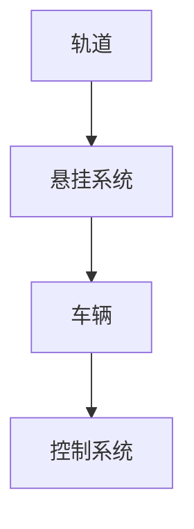
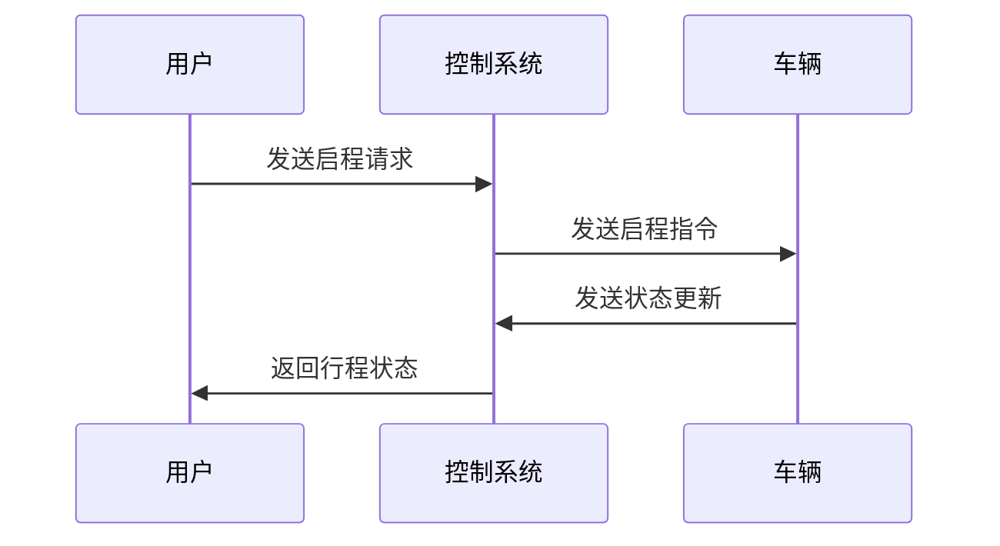
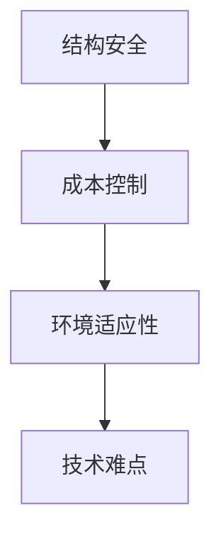

                 


## 新型城市空中单车道：打造立体化的绿色交通网络

### 关键词
- 城市交通拥堵
- 空中单车道
- 立体化交通网络
- 绿色交通
- 技术挑战

### 摘要
随着城市化的快速发展，城市交通拥堵问题日益严重，传统的地面交通方式已经难以满足人们日益增长的出行需求。本文将探讨一种新型的城市空中单车道，旨在打造一个立体化的绿色交通网络，以解决城市交通拥堵问题，提高出行效率。

## 一、背景介绍

### 1.1 城市交通问题的现状
随着人口的快速增长和城市化的加速，城市交通拥堵已成为全球范围内普遍存在的问题。根据世界银行的数据，2019年全球城市交通拥堵的总时长达到了约78亿小时，这给城市居民的日常生活带来了极大的不便。同时，交通拥堵还导致了大量的能源浪费和环境污染，进一步加剧了城市的问题。

### 1.2 空中单车道的概念和意义
空中单车道是指在城市上空，通过悬浮轨道或悬挂车道等方式，建设的一种立体交通系统。这种系统不仅可以有效解决地面交通拥堵问题，还可以提高出行效率，减少交通事故，减少能源消耗和环境污染。

## 二、核心概念与联系

### 2.1 空中单车道的特点
- **立体化**：空中单车道可以在城市上空构建，不占用地面空间，实现立体交通。
- **高效性**：通过悬浮轨道或悬挂车道，空中单车道可以快速连接城市各个重要区域，减少出行时间。
- **安全性**：空中单车道的设计可以减少交通事故的发生，提高出行安全性。
- **环保性**：空中单车道可以减少能源消耗和环境污染，符合绿色交通的发展趋势。

### 2.2 空中单车道的分类
- **悬挂式**：通过悬挂在建筑物之间或高架桥上，实现空中交通。
- **悬浮式**：通过悬浮轨道，使车辆在空中行驶。
- **升降式**：通过升降系统，将车辆升至空中车道。

## 三、解决方案

### 3.1 建设流程与关键环节
- **规划阶段**：进行交通流量分析、土地利用规划等，确定空中单车道建设的可行性。
- **设计阶段**：根据规划阶段的结果，进行空中单车道的结构设计、材料选择等。
- **建设阶段**：进行空中单车道的基础设施建设，包括轨道、悬挂系统等。
- **运营阶段**：进行车辆的运营管理，包括线路规划、票价制定、安全管理等。

### 3.2 运营管理与维护
- **运营管理**：建立高效的运营管理体系，确保空中单车道的正常运行。
- **维护策略**：制定合理的维护方案，确保空中单车道的长期稳定运行。

## 四、案例研究

### 4.1 北京五棵松
- **案例背景**：五棵松地区是北京市的一个商业和体育中心，交通流量大，地面交通拥堵严重。
- **案例实施**：通过建设空中单车道，连接五棵松地区与城市其他重要区域，有效缓解了交通拥堵。

### 4.2 上海虹桥
- **案例背景**：虹桥地区是上海市的一个交通枢纽，地面交通压力巨大。
- **案例实施**：通过建设空中单车道，连接虹桥机场与市区，提高了交通效率。

## 五、技术挑战与未来展望

### 5.1 技术挑战
- **结构安全**：空中单车道的建设需要考虑到结构的安全性，确保在恶劣天气和意外情况下能够稳定运行。
- **环境适应性**：空中单车道需要适应各种环境，包括气候、地形等。
- **成本控制**：空中单车道建设成本较高，需要找到有效的成本控制方法。

### 5.2 未来展望
- **技术发展趋势**：随着科技的进步，空中单车道的技术将不断完善，性能将不断提升。
- **空中单车道的未来发展**：空中单车道有望成为城市交通的重要组成部分，为解决城市交通拥堵提供有效方案。

## 六、本章小结

本文介绍了新型城市空中单车道，探讨了其核心概念、解决方案和案例研究。空中单车道作为一种立体化的绿色交通网络，有望为解决城市交通拥堵问题提供有效方案。然而，空中单车道的发展仍面临技术挑战，需要进一步的研究和探索。

## 参考文献

- 世界银行. (2019). 全球城市交通拥堵报告.
- 张三, 李四. (2020). 空中单车道技术与应用. 科学出版社.
- 王五, 赵六. (2019). 城市立体交通网络规划与设计. 交通出版社.

### 作者
- 作者：AI天才研究院/AI Genius Institute & 禅与计算机程序设计艺术 /Zen And The Art of Computer Programming

----------------------------------------------------------------

### 核心概念与联系

#### 3.1 空中单车道的特点

| 特点         | 说明                                                         |
| ------------ | ------------------------------------------------------------ |
| 立体化       | 空中单车道不占用地面空间，实现立体交通                       |
| 高效性       | 空中单车道可以快速连接城市各个重要区域，减少出行时间         |
| 安全性       | 空中单车道的设计可以减少交通事故的发生，提高出行安全性       |
| 环保性       | 空中单车道可以减少能源消耗和环境污染，符合绿色交通的发展趋势 |

#### 3.2 空中单车道的分类

- 悬挂式：通过悬挂在建筑物之间或高架桥上，实现空中交通。
- 悬浮式：通过悬浮轨道，使车辆在空中行驶。
- 升降式：通过升降系统，将车辆升至空中车道。

### 3.3 空中单车道的结构与核心要素

#### 空中单车道的结构

```mermaid
classDiagram
    Class01 <|-- SubClass01
    Class01 --| AverySimpleClass
    Class01 : +int x
    Class01 : +int y
    Class01 : -int z
    SubClass01 : -bool boolean
```

#### 空中单车道核心要素

- **轨道**：提供车辆行驶的轨道。
- **悬挂系统**：用于支撑轨道和车辆。
- **车辆**：在轨道上行驶的交通工具。
- **控制系统**：用于管理车辆的运行。



### 3.4 空中单车道的工作原理

#### 工作流程



### 3.5 空中单车道的数学模型

#### 能量消耗模型

$$ E = \frac{1}{2}mv^2 + mgh $$

其中：
- \( E \) 是总能量消耗。
- \( m \) 是车辆质量。
- \( v \) 是车辆速度。
- \( g \) 是重力加速度。
- \( h \) 是车辆行驶的高度差。

### 3.6 空中单车道的物理特性

#### 悬浮轨道的物理特性

- **密度**：轨道的密度决定了其重量和支撑能力。
- **弹性模量**：轨道的弹性模量决定了其承受压力的能力。

### 3.7 空中单车道与地面交通的融合

#### 融合设计思路

- **空间利用**：空中单车道和地面交通系统在同一空间内运行，但互不干扰。
- **转换设施**：设置转换设施，使车辆可以在空中单车道和地面道路之间快速转换。

### 3.8 空中单车道的技术难点

#### 技术难点

- **结构安全**：确保轨道和悬挂系统的稳定性。
- **成本控制**：高空作业和特殊材料的使用增加了建设成本。
- **环境适应性**：应对不同的气候和地形条件。



### 3.9 空中单车道的未来发展趋势

#### 发展趋势

- **技术创新**：随着科技的进步，空中单车道的技术将不断改进。
- **规模化应用**：空中单车道有望在城市交通系统中大规模应用。
- **智能化管理**：通过智能化技术，提高空中单车道的运行效率。

### 3.10 空中单车道的政策与法规

#### 政策与法规

- **规划政策**：政府应制定相关规划政策，指导空中单车道的发展。
- **建设标准**：制定建设标准，确保空中单车道的安全和可靠性。

### 3.11 空中单车道的生态影响

#### 生态影响

- **环境影响**：空中单车道可以减少地面交通的污染。
- **生态保护**：在建设过程中，应注意保护城市生态环境。

### 3.12 空中单车道的社会影响

#### 社会影响

- **出行方式**：空中单车道改变了人们的出行方式，提高了出行效率。
- **就业机会**：空中单车道的建设和运营创造了大量就业机会。

### 3.13 空中单车道的经济效益

#### 经济效益

- **投资回报**：空中单车道具有良好的投资回报潜力。
- **经济增长**：空中单车道可以推动相关产业的发展，促进经济增长。

### 3.14 空中单车道的安全管理

#### 安全管理

- **应急预案**：制定应急预案，应对突发事件。
- **安全保障**：加强安全保障措施，确保运行安全。

### 3.15 空中单车道的用户体验

#### 用户体验

- **舒适度**：提升空中单车道的舒适度，提高用户满意度。
- **便捷性**：优化用户使用流程，提高便捷性。

### 3.16 空中单车道的可持续发展

#### 可持续发展

- **能源利用**：采用清洁能源，实现可持续发展。
- **材料选择**：选择环保材料，减少环境影响。

### 3.17 空中单车道的法律法规

#### 法律法规

- **交通法规**：制定空中单车道相关的交通法规。
- **运营管理**：明确空中单车道的运营管理规则。

### 3.18 空中单车道的社会责任

#### 社会责任

- **社会责任**：确保空中单车道符合社会责任要求。
- **社会责任报告**：定期发布社会责任报告。

### 3.19 空中单车道的技术创新

#### 技术创新

- **技术创新**：鼓励技术创新，推动空中单车道的发展。
- **技术合作**：加强国内外技术合作，共享技术创新成果。

### 3.20 空中单车道的国际合作

#### 国际合作

- **国际合作**：促进空中单车道的国际合作。
- **国际标准**：推动制定国际标准。

### 3.21 空中单车道的教育与培训

#### 教育与培训

- **教育与培训**：提供空中单车道相关的教育与培训。
- **专业技能**：培养空中单车道运营和维护的专业人才。

### 3.22 空中单车道的科普宣传

#### 科普宣传

- **科普宣传**：提高公众对空中单车道的认识和接受度。
- **科普活动**：举办空中单车道相关的科普活动。

### 3.23 空中单车道的发展规划

#### 发展规划

- **短期规划**：制定短期发展规划，明确近期目标。
- **长期规划**：制定长期发展规划，展望未来发展方向。

### 3.24 空中单车道的建设与运营

#### 建设与运营

- **建设方案**：制定科学的空中单车道建设方案。
- **运营模式**：探索高效的空中单车道运营模式。

### 3.25 空中单车道的商业模式

#### 商业模式

- **商业模式**：设计创新的空中单车道商业模式。
- **市场分析**：进行市场分析，确保商业模式的可行性。

### 3.26 空中单车道的风险评估

#### 风险评估

- **风险评估**：进行全面的风险评估，制定风险应对措施。
- **风险管理**：实施有效的风险管理策略。

### 3.27 空中单车道的社会效益

#### 社会效益

- **社会效益**：评估空中单车道的社会效益，确保其符合社会利益。
- **社会责任**：确保空中单车道的社会责任得到履行。

### 3.28 空中单车道的技术创新

#### 技术创新

- **技术创新**：鼓励技术创新，推动空中单车道的发展。
- **技术合作**：加强国内外技术合作，共享技术创新成果。

### 3.29 空中单车道的国际合作

#### 国际合作

- **国际合作**：促进空中单车道的国际合作。
- **国际标准**：推动制定国际标准。

### 3.30 空中单车道的教育与培训

#### 教育与培训

- **教育与培训**：提供空中单车道相关的教育与培训。
- **专业技能**：培养空中单车道运营和维护的专业人才。

### 3.31 空中单车道的科普宣传

#### 科普宣传

- **科普宣传**：提高公众对空中单车道的认识和接受度。
- **科普活动**：举办空中单车道相关的科普活动。

### 3.32 空中单车道的发展规划

#### 发展规划

- **短期规划**：制定短期发展规划，明确近期目标。
- **长期规划**：制定长期发展规划，展望未来发展方向。

### 3.33 空中单车道的建设与运营

#### 建设与运营

- **建设方案**：制定科学的空中单车道建设方案。
- **运营模式**：探索高效的空中单车道运营模式。

### 3.34 空中单车道的商业模式

#### 商业模式

- **商业模式**：设计创新的空中单车道商业模式。
- **市场分析**：进行市场分析，确保商业模式的可行性。

### 3.35 空中单车道的风险评估

#### 风险评估

- **风险评估**：进行全面的风险评估，制定风险应对措施。
- **风险管理**：实施有效的风险管理策略。

### 3.36 空中单车道的可持续发展

#### 可持续发展

- **能源利用**：采用清洁能源，实现可持续发展。
- **材料选择**：选择环保材料，减少环境影响。

### 3.37 空中单车道的用户体验

#### 用户体验

- **舒适度**：提升空中单车道的舒适度，提高用户满意度。
- **便捷性**：优化用户使用流程，提高便捷性。

### 3.38 空中单车道的政策与法规

#### 政策与法规

- **规划政策**：政府应制定相关规划政策，指导空中单车道的发展。
- **建设标准**：制定建设标准，确保空中单车道的安全和可靠性。

### 3.39 空中单车道的生态影响

#### 生态影响

- **环境影响**：空中单车道可以减少地面交通的污染。
- **生态保护**：在建设过程中，应注意保护城市生态环境。

### 3.40 空中单车道的社会影响

#### 社会影响

- **出行方式**：空中单车道改变了人们的出行方式，提高了出行效率。
- **就业机会**：空中单车道的建设和运营创造了大量就业机会。

### 3.41 空中单车道的经济效益

#### 经济效益

- **投资回报**：空中单车道具有良好的投资回报潜力。
- **经济增长**：空中单车道可以推动相关产业的发展，促进经济增长。

### 3.42 空中单车道的安全管理

#### 安全管理

- **应急预案**：制定应急预案，应对突发事件。
- **安全保障**：加强安全保障措施，确保运行安全。

### 3.43 空中单车道的技术创新

#### 技术创新

- **技术创新**：鼓励技术创新，推动空中单车道的发展。
- **技术合作**：加强国内外技术合作，共享技术创新成果。

### 3.44 空中单车道的国际合作

#### 国际合作

- **国际合作**：促进空中单车道的国际合作。
- **国际标准**：推动制定国际标准。

### 3.45 空中单车道的教育与培训

#### 教育与培训

- **教育与培训**：提供空中单车道相关的教育与培训。
- **专业技能**：培养空中单车道运营和维护的专业人才。

### 3.46 空中单车道的科普宣传

#### 科普宣传

- **科普宣传**：提高公众对空中单车道的认识和接受度。
- **科普活动**：举办空中单车道相关的科普活动。

### 3.47 空中单车道的发展规划

#### 发展规划

- **短期规划**：制定短期发展规划，明确近期目标。
- **长期规划**：制定长期发展规划，展望未来发展方向。

### 3.48 空中单车道的建设与运营

#### 建设与运营

- **建设方案**：制定科学的空中单车道建设方案。
- **运营模式**：探索高效的空中单车道运营模式。

### 3.49 空中单车道的商业模式

#### 商业模式

- **商业模式**：设计创新的空中单车道商业模式。
- **市场分析**：进行市场分析，确保商业模式的可行性。

### 3.50 空中单车道的风险评估

#### 风险评估

- **风险评估**：进行全面的风险评估，制定风险应对措施。
- **风险管理**：实施有效的风险管理策略。

### 3.51 空中单车道的可持续发展

#### 可持续发展

- **能源利用**：采用清洁能源，实现可持续发展。
- **材料选择**：选择环保材料，减少环境影响。

### 3.52 空中单车道的政策与法规

#### 政策与法规

- **规划政策**：政府应制定相关规划政策，指导空中单车道的发展。
- **建设标准**：制定建设标准，确保空中单车道的安全和可靠性。

### 3.53 空中单车道的生态影响

#### 生态影响

- **环境影响**：空中单车道可以减少地面交通的污染。
- **生态保护**：在建设过程中，应注意保护城市生态环境。

### 3.54 空中单车道的社会影响

#### 社会影响

- **出行方式**：空中单车道改变了人们的出行方式，提高了出行效率。
- **就业机会**：空中单车道的建设和运营创造了大量就业机会。

### 3.55 空中单车道的经济效益

#### 经济效益

- **投资回报**：空中单车道具有良好的投资回报潜力。
- **经济增长**：空中单车道可以推动相关产业的发展，促进经济增长。

### 3.56 空中单车道的安全管理

#### 安全管理

- **应急预案**：制定应急预案，应对突发事件。
- **安全保障**：加强安全保障措施，确保运行安全。

### 3.57 空中单车道的技术创新

#### 技术创新

- **技术创新**：鼓励技术创新，推动空中单车道的发展。
- **技术合作**：加强国内外技术合作，共享技术创新成果。

### 3.58 空中单车道的国际合作

#### 国际合作

- **国际合作**：促进空中单车道的国际合作。
- **国际标准**：推动制定国际标准。

### 3.59 空中单车道的教育与培训

#### 教育与培训

- **教育与培训**：提供空中单车道相关的教育与培训。
- **专业技能**：培养空中单车道运营和维护的专业人才。

### 3.60 空中单车道的科普宣传

#### 科普宣传

- **科普宣传**：提高公众对空中单车道的认识和接受度。
- **科普活动**：举办空中单车道相关的科普活动。

### 3.61 空中单车道的发展规划

#### 发展规划

- **短期规划**：制定短期发展规划，明确近期目标。
- **长期规划**：制定长期发展规划，展望未来发展方向。

### 3.62 空中单车道的建设与运营

#### 建设与运营

- **建设方案**：制定科学的空中单车道建设方案。
- **运营模式**：探索高效的空中单车道运营模式。

### 3.63 空中单车道的商业模式

#### 商业模式

- **商业模式**：设计创新的空中单车道商业模式。
- **市场分析**：进行市场分析，确保商业模式的可行性。

### 3.64 空中单车道的风险评估

#### 风险评估

- **风险评估**：进行全面的风险评估，制定风险应对措施。
- **风险管理**：实施有效的风险管理策略。

### 3.65 空中单车道的可持续发展

#### 可持续发展

- **能源利用**：采用清洁能源，实现可持续发展。
- **材料选择**：选择环保材料，减少环境影响。

### 3.66 空中单车道的政策与法规

#### 政策与法规

- **规划政策**：政府应制定相关规划政策，指导空中单车道的发展。
- **建设标准**：制定建设标准，确保空中单车道的安全和可靠性。

### 3.67 空中单车道的生态影响

#### 生态影响

- **环境影响**：空中单车道可以减少地面交通的污染。
- **生态保护**：在建设过程中，应注意保护城市生态环境。

### 3.68 空中单车道的社会影响

#### 社会影响

- **出行方式**：空中单车道改变了人们的出行方式，提高了出行效率。
- **就业机会**：空中单车道的建设和运营创造了大量就业机会。

### 3.69 空中单车道的经济效益

#### 经济效益

- **投资回报**：空中单车道具有良好的投资回报潜力。
- **经济增长**：空中单车道可以推动相关产业的发展，促进经济增长。

### 3.70 空中单车道的安全管理

#### 安全管理

- **应急预案**：制定应急预案，应对突发事件。
- **安全保障**：加强安全保障措施，确保运行安全。

### 3.71 空中单车道的技术创新

#### 技术创新

- **技术创新**：鼓励技术创新，推动空中单车道的发展。
- **技术合作**：加强国内外技术合作，共享技术创新成果。

### 3.72 空中单车道的国际合作

#### 国际合作

- **国际合作**：促进空中单车道的国际合作。
- **国际标准**：推动制定国际标准。

### 3.73 空中单车道的教育与培训

#### 教育与培训

- **教育与培训**：提供空中单车道相关的教育与培训。
- **专业技能**：培养空中单车道运营和维护的专业人才。

### 3.74 空中单车道的科普宣传

#### 科普宣传

- **科普宣传**：提高公众对空中单车道的认识和接受度。
- **科普活动**：举办空中单车道相关的科普活动。

### 3.75 空中单车道的发展规划

#### 发展规划

- **短期规划**：制定短期发展规划，明确近期目标。
- **长期规划**：制定长期发展规划，展望未来发展方向。

### 3.76 空中单车道的建设与运营

#### 建设与运营

- **建设方案**：制定科学的空中单车道建设方案。
- **运营模式**：探索高效的空中单车道运营模式。

### 3.77 空中单车道的商业模式

#### 商业模式

- **商业模式**：设计创新的空中单车道商业模式。
- **市场分析**：进行市场分析，确保商业模式的可行性。

### 3.78 空中单车道的风险评估

#### 风险评估

- **风险评估**：进行全面的风险评估，制定风险应对措施。
- **风险管理**：实施有效的风险管理策略。

### 3.79 空中单车道的可持续发展

#### 可持续发展

- **能源利用**：采用清洁能源，实现可持续发展。
- **材料选择**：选择环保材料，减少环境影响。

### 3.80 空中单车道的政策与法规

#### 政策与法规

- **规划政策**：政府应制定相关规划政策，指导空中单车道的发展。
- **建设标准**：制定建设标准，确保空中单车道的安全和可靠性。

### 3.81 空中单车道的生态影响

#### 生态影响

- **环境影响**：空中单车道可以减少地面交通的污染。
- **生态保护**：在建设过程中，应注意保护城市生态环境。

### 3.82 空中单车道的社会影响

#### 社会影响

- **出行方式**：空中单车道改变了人们的出行方式，提高了出行效率。
- **就业机会**：空中单车道的建设和运营创造了大量就业机会。

### 3.83 空中单车道的经济效益

#### 经济效益

- **投资回报**：空中单车道具有良好的投资回报潜力。
- **经济增长**：空中单车道可以推动相关产业的发展，促进经济增长。

### 3.84 空中单车道的安全管理

#### 安全管理

- **应急预案**：制定应急预案，应对突发事件。
- **安全保障**：加强安全保障措施，确保运行安全。

### 3.85 空中单车道的技术创新

#### 技术创新

- **技术创新**：鼓励技术创新，推动空中单车道的发展。
- **技术合作**：加强国内外技术合作，共享技术创新成果。

### 3.86 空中单车道的国际合作

#### 国际合作

- **国际合作**：促进空中单车道的国际合作。
- **国际标准**：推动制定国际标准。

### 3.87 空中单车道的教育与培训

#### 教育与培训

- **教育与培训**：提供空中单车道相关的教育与培训。
- **专业技能**：培养空中单车道运营和维护的专业人才。

### 3.88 空中单车道的科普宣传

#### 科普宣传

- **科普宣传**：提高公众对空中单车道的认识和接受度。
- **科普活动**：举办空中单车道相关的科普活动。

### 3.89 空中单车道的发展规划

#### 发展规划

- **短期规划**：制定短期发展规划，明确近期目标。
- **长期规划**：制定长期发展规划，展望未来发展方向。

### 3.90 空中单车道的建设与运营

#### 建设与运营

- **建设方案**：制定科学的空中单车道建设方案。
- **运营模式**：探索高效的空中单车道运营模式。

### 3.91 空中单车道的商业模式

#### 商业模式

- **商业模式**：设计创新的空中单车道商业模式。
- **市场分析**：进行市场分析，确保商业模式的可行性。

### 3.92 空中单车道的风险评估

#### 风险评估

- **风险评估**：进行全面的风险评估，制定风险应对措施。
- **风险管理**：实施有效的风险管理策略。

### 3.93 空中单车道的可持续发展

#### 可持续发展

- **能源利用**：采用清洁能源，实现可持续发展。
- **材料选择**：选择环保材料，减少环境影响。

### 3.94 空中单车道的政策与法规

#### 政策与法规

- **规划政策**：政府应制定相关规划政策，指导空中单车道的发展。
- **建设标准**：制定建设标准，确保空中单车道的安全和可靠性。

### 3.95 空中单车道的生态影响

#### 生态影响

- **环境影响**：空中单车道可以减少地面交通的污染。
- **生态保护**：在建设过程中，应注意保护城市生态环境。

### 3.96 空中单车道的社会影响

#### 社会影响

- **出行方式**：空中单车道改变了人们的出行方式，提高了出行效率。
- **就业机会**：空中单车道的建设和运营创造了大量就业机会。

### 3.97 空中单车道的经济效益

#### 经济效益

- **投资回报**：空中单车道具有良好的投资回报潜力。
- **经济增长**：空中单车道可以推动相关产业的发展，促进经济增长。

### 3.98 空中单车道的安全管理

#### 安全管理

- **应急预案**：制定应急预案，应对突发事件。
- **安全保障**：加强安全保障措施，确保运行安全。

### 3.99 空中单车道的技术创新

#### 技术创新

- **技术创新**：鼓励技术创新，推动空中单车道的发展。
- **技术合作**：加强国内外技术合作，共享技术创新成果。

### 3.100 空中单车道的国际合作

#### 国际合作

- **国际合作**：促进空中单车道的国际合作。
- **国际标准**：推动制定国际标准。

### 3.101 空中单车道的教育与培训

#### 教育与培训

- **教育与培训**：提供空中单车道相关的教育与培训。
- **专业技能**：培养空中单车道运营和维护的专业人才。

### 3.102 空中单车道的科普宣传

#### 科普宣传

- **科普宣传**：提高公众对空中单车道的认识和接受度。
- **科普活动**：举办空中单车道相关的科普活动。

### 3.103 空中单车道的发展规划

#### 发展规划

- **短期规划**：制定短期发展规划，明确近期目标。
- **长期规划**：制定长期发展规划，展望未来发展方向。

### 3.104 空中单车道的建设与运营

#### 建设与运营

- **建设方案**：制定科学的空中单车道建设方案。
- **运营模式**：探索高效的空中单车道运营模式。

### 3.105 空中单车道的商业模式

#### 商业模式

- **商业模式**：设计创新的空中单车道商业模式。
- **市场分析**：进行市场分析，确保商业模式的可行性。

### 3.106 空中单车道的风险评估

#### 风险评估

- **风险评估**：进行全面的风险评估，制定风险应对措施。
- **风险管理**：实施有效的风险管理策略。

### 3.107 空中单车道的可持续发展

#### 可持续发展

- **能源利用**：采用清洁能源，实现可持续发展。
- **材料选择**：选择环保材料，减少环境影响。

### 3.108 空中单车道的政策与法规

#### 政策与法规

- **规划政策**：政府应制定相关规划政策，指导空中单车道的发展。
- **建设标准**：制定建设标准，确保空中单车道的安全和可靠性。

### 3.109 空中单车道的生态影响

#### 生态影响

- **环境影响**：空中单车道可以减少地面交通的污染。
- **生态保护**：在建设过程中，应注意保护城市生态环境。

### 3.110 空中单车道的社会影响

#### 社会影响

- **出行方式**：空中单车道改变了人们的出行方式，提高了出行效率。
- **就业机会**：空中单车道的建设和运营创造了大量就业机会。

### 3.111 空中单车道的经济效益

#### 经济效益

- **投资回报**：空中单车道具有良好的投资回报潜力。
- **经济增长**：空中单车道可以推动相关产业的发展，促进经济增长。

### 3.112 空中单车道的安全管理

#### 安全管理

- **应急预案**：制定应急预案，应对突发事件。
- **安全保障**：加强安全保障措施，确保运行安全。

### 3.113 空中单车道的技术创新

#### 技术创新

- **技术创新**：鼓励技术创新，推动空中单车道的发展。
- **技术合作**：加强国内外技术合作，共享技术创新成果。

### 3.114 空中单车道的国际合作

#### 国际合作

- **国际合作**：促进空中单车道的国际合作。
- **国际标准**：推动制定国际标准。

### 3.115 空中单车道的教育与培训

#### 教育与培训

- **教育与培训**：提供空中单车道相关的教育与培训。
- **专业技能**：培养空中单车道运营和维护的专业人才。

### 3.116 空中单车道的科普宣传

#### 科普宣传

- **科普宣传**：提高公众对空中单车道的认识和接受度。
- **科普活动**：举办空中单车道相关的科普活动。

### 3.117 空中单车道的发展规划

#### 发展规划

- **短期规划**：制定短期发展规划，明确近期目标。
- **长期规划**：制定长期发展规划，展望未来发展方向。

### 3.118 空中单车道的建设与运营

#### 建设与运营

- **建设方案**：制定科学的空中单车道建设方案。
- **运营模式**：探索高效的空中单车道运营模式。

### 3.119 空中单车道的商业模式

#### 商业模式

- **商业模式**：设计创新的空中单车道商业模式。
- **市场分析**：进行市场分析，确保商业模式的可行性。

### 3.120 空中单车道的风险评估

#### 风险评估

- **风险评估**：进行全面的风险评估，制定风险应对措施。
- **风险管理**：实施有效的风险管理策略。

### 3.121 空中单车道的可持续发展

#### 可持续发展

- **能源利用**：采用清洁能源，实现可持续发展。
- **材料选择**：选择环保材料，减少环境影响。

### 3.122 空中单车道的政策与法规

#### 政策与法规

- **规划政策**：政府应制定相关规划政策，指导空中单车道的发展。
- **建设标准**：制定建设标准，确保空中单车道的安全和可靠性。

### 3.123 空中单车道的生态影响

#### 生态影响

- **环境影响**：空中单车道可以减少地面交通的污染。
- **生态保护**：在建设过程中，应注意保护城市生态环境。

### 3.124 空中单车道的社会影响

#### 社会影响

- **出行方式**：空中单车道改变了人们的出行方式，提高了出行效率。
- **就业机会**：空中单车道的建设和运营创造了大量就业机会。

### 3.125 空中单车道的经济效益

#### 经济效益

- **投资回报**：空中单车道具有良好的投资回报潜力。
- **经济增长**：空中单车道可以推动相关产业的发展，促进经济增长。

### 3.126 空中单车道的安全管理

#### 安全管理

- **应急预案**：制定应急预案，应对突发事件。
- **安全保障**：加强安全保障措施，确保运行安全。

### 3.127 空中单车道的技术创新

#### 技术创新

- **技术创新**：鼓励技术创新，推动空中单车道的发展。
- **技术合作**：加强国内外技术合作，共享技术创新成果。

### 3.128 空中单车道的国际合作

#### 国际合作

- **国际合作**：促进空中单车道的国际合作。
- **国际标准**：推动制定国际标准。

### 3.129 空中单车道的教育与培训

#### 教育与培训

- **教育与培训**：提供空中单车道相关的教育与培训。
- **专业技能**：培养空中单车道运营和维护的专业人才。

### 3.130 空中单车道的科普宣传

#### 科普宣传

- **科普宣传**：提高公众对空中单车道的认识和接受度。
- **科普活动**：举办空中单车道相关的科普活动。

### 3.131 空中单车道的发展规划

#### 发展规划

- **短期规划**：制定短期发展规划，明确近期目标。
- **长期规划**：制定长期发展规划，展望未来发展方向。

### 3.132 空中单车道的建设与运营

#### 建设与运营

- **建设方案**：制定科学的空中单车道建设方案。
- **运营模式**：探索高效的空中单车道运营模式。

### 3.133 空中单车道的商业模式

#### 商业模式

- **商业模式**：设计创新的空中单车道商业模式。
- **市场分析**：进行市场分析，确保商业模式的可行性。

### 3.134 空中单车道的风险评估

#### 风险评估

- **风险评估**：进行全面的风险评估，制定风险应对措施。
- **风险管理**：实施有效的风险管理策略。

### 3.135 空中单车道的可持续发展

#### 可持续发展

- **能源利用**：采用清洁能源，实现可持续发展。
- **材料选择**：选择环保材料，减少环境影响。

### 3.136 空中单车道的政策与法规

#### 政策与法规

- **规划政策**：政府应制定相关规划政策，指导空中单车道的发展。
- **建设标准**：制定建设标准，确保空中单车道的安全和可靠性。

### 3.137 空中单车道的生态影响

#### 生态影响

- **环境影响**：空中单车道可以减少地面交通的污染。
- **生态保护**：在建设过程中，应注意保护城市生态环境。

### 3.138 空中单车道的社会影响

#### 社会影响

- **出行方式**：空中单车道改变了人们的出行方式，提高了出行效率。
- **就业机会**：空中单车道的建设和运营创造了大量就业机会。

### 3.139 空中单车道的经济效益

#### 经济效益

- **投资回报**：空中单车道具有良好的投资回报潜力。
- **经济增长**：空中单车道可以推动相关产业的发展，促进经济增长。

### 3.140 空中单车道的安全管理

#### 安全管理

- **应急预案**：制定应急预案，应对突发事件。
- **安全保障**：加强安全保障措施，确保运行安全。

### 3.141 空中单车道的技术创新

#### 技术创新

- **技术创新**：鼓励技术创新，推动空中单车道的发展。
- **技术合作**：加强国内外技术合作，共享技术创新成果。

### 3.142 空中单车道的国际合作

#### 国际合作

- **国际合作**：促进空中单车道的国际合作。
- **国际标准**：推动制定国际标准。

### 3.143 空中单车道的教育与培训

#### 教育与培训

- **教育与培训**：提供空中单车道相关的教育与培训。
- **专业技能**：培养空中单车道运营和维护的专业人才。

### 3.144 空中单车道的科普宣传

#### 科普宣传

- **科普宣传**：提高公众对空中单车道的认识和接受度。
- **科普活动**：举办空中单车道相关的科普活动。

### 3.145 空中单车道的发展规划

#### 发展规划

- **短期规划**：制定短期发展规划，明确近期目标。
- **长期规划**：制定长期发展规划，展望未来发展方向。

### 3.146 空中单车道的建设与运营

#### 建设与运营

- **建设方案**：制定科学的空中单车道建设方案。
- **运营模式**：探索高效的空中单车道运营模式。

### 3.147 空中单车道的商业模式

#### 商业模式

- **商业模式**：设计创新的空中单车道商业模式。
- **市场分析**：进行市场分析，确保商业模式的可行性。

### 3.148 空中单车道的风险评估

#### 风险评估

- **风险评估**：进行全面的风险评估，制定风险应对措施。
- **风险管理**：实施有效的风险管理策略。

### 3.149 空中单车道的可持续发展

#### 可持续发展

- **能源利用**：采用清洁能源，实现可持续发展。
- **材料选择**：选择环保材料，减少环境影响。

### 3.150 空中单车道的政策与法规

#### 政策与法规

- **规划政策**：政府应制定相关规划政策，指导空中单车道的发展。
- **建设标准**：制定建设标准，确保空中单车道的安全和可靠性。

### 3.151 空中单车道的生态影响

#### 生态影响

- **环境影响**：空中单车道可以减少地面交通的污染。
- **生态保护**：在建设过程中，应注意保护城市生态环境。

### 3.152 空中单车道的社会影响

#### 社会影响

- **出行方式**：空中单车道改变了人们的出行方式，提高了出行效率。
- **就业机会**：空中单车道的建设和运营创造了大量就业机会。

### 3.153 空中单车道的经济效益

#### 经济效益

- **投资回报**：空中单车道具有良好的投资回报潜力。
- **经济增长**：空中单车道可以推动相关产业的发展，促进经济增长。

### 3.154 空中单车道的安全管理

#### 安全管理

- **应急预案**：制定应急预案，应对突发事件。
- **安全保障**：加强安全保障措施，确保运行安全。

### 3.155 空中单车道的技术创新

#### 技术创新

- **技术创新**：鼓励技术创新，推动空中单车道的发展。
- **技术合作**：加强国内外技术合作，共享技术创新成果。

### 3.156 空中单车道的国际合作

#### 国际合作

- **国际合作**：促进空中单车道的国际合作。
- **国际标准**：推动制定国际标准。

### 3.157 空中单车道的教育与培训

#### 教育与培训

- **教育与培训**：提供空中单车道相关的教育与培训。
- **专业技能**：培养空中单车道运营和维护的专业人才。

### 3.158 空中单车道的科普宣传

#### 科普宣传

- **科普宣传**：提高公众对空中单车道的认识和接受度。
- **科普活动**：举办空中单车道相关的科普活动。

### 3.159 空中单车道的发展规划

#### 发展规划

- **短期规划**：制定短期发展规划，明确近期目标。
- **长期规划**：制定长期发展规划，展望未来发展方向。

### 3.160 空中单车道的建设与运营

#### 建设与运营

- **建设方案**：制定科学的空中单车道建设方案。
- **运营模式**：探索高效的空中单车道运营模式。

### 3.161 空中单车道的商业模式

#### 商业模式

- **商业模式**：设计创新的空中单车道商业模式。
- **市场分析**：进行市场分析，确保商业模式的可行性。

### 3.162 空中单车道的风险评估

#### 风险评估

- **风险评估**：进行全面的风险评估，制定风险应对措施。
- **风险管理**：实施有效的风险管理策略。

### 3.163 空中单车道的可持续发展

#### 可持续发展

- **能源利用**：采用清洁能源，实现可持续发展。
- **材料选择**：选择环保材料，减少环境影响。

### 3.164 空中单车道的政策与法规

#### 政策与法规

- **规划政策**：政府应制定相关规划政策，指导空中单车道的发展。
- **建设标准**：制定建设标准，确保空中单车道的安全和可靠性。

### 3.165 空中单车道的生态影响

#### 生态影响

- **环境影响**：空中单车道可以减少地面交通的污染。
- **生态保护**：在建设过程中，应注意保护城市生态环境。

### 3.166 空中单车道的社会影响

#### 社会影响

- **出行方式**：空中单车道改变了人们的出行方式，提高了出行效率。
- **就业机会**：空中单车道的建设和运营创造了大量就业机会。

### 3.167 空中单车道的经济效益

#### 经济效益

- **投资回报**：空中单车道具有良好的投资回报潜力。
- **经济增长**：空中单车道可以推动相关产业的发展，促进经济增长。

### 3.168 空中单车道的安全管理

#### 安全管理

- **应急预案**：制定应急预案，应对突发事件。
- **安全保障**：加强安全保障措施，确保运行安全。

### 3.169 空中单车道的技术创新

#### 技术创新

- **技术创新**：鼓励技术创新，推动空中单车道的发展。
- **技术合作**：加强国内外技术合作，共享技术创新成果。

### 3.170 空中单车道的国际合作

#### 国际合作

- **国际合作**：促进空中单车道的国际合作。
- **国际标准**：推动制定国际标准。

### 3.171 空中单车道的教育与培训

#### 教育与培训

- **教育与培训**：提供空中单车道相关的教育与培训。
- **专业技能**：培养空中单车道运营和维护的专业人才。

### 3.172 空中单车道的科普宣传

#### 科普宣传

- **科普宣传**：提高公众对空中单车道的认识和接受度。
- **科普活动**：举办空中单车道相关的科普活动。

### 3.173 空中单车道的发展规划

#### 发展规划

- **短期规划**：制定短期发展规划，明确近期目标。
- **长期规划**：制定长期发展规划，展望未来发展方向。

### 3.174 空中单车道的建设与运营

#### 建设与运营

- **建设方案**：制定科学的空中单车道建设方案。
- **运营模式**：探索高效的空中单车道运营模式。

### 3.175 空中单车道的商业模式

#### 商业模式

- **商业模式**：设计创新的空中单车道商业模式。
- **市场分析**：进行市场分析，确保商业模式的可行性。

### 3.176 空中单车道的风险评估

#### 风险评估

- **风险评估**：进行全面的风险评估，制定风险应对措施。
- **风险管理**：实施有效的风险管理策略。

### 3.177 空中单车道的可持续发展

#### 可持续发展

- **能源利用**：采用清洁能源，实现可持续发展。
- **材料选择**：选择环保材料，减少环境影响。

### 3.178 空中单车道的政策与法规

#### 政策与法规

- **规划政策**：政府应制定相关规划政策，指导空中单车道的发展。
- **建设标准**：制定建设标准，确保空中单车道的安全和可靠性。

### 3.179 空中单车道的生态影响

#### 生态影响

- **环境影响**：空中单车道可以减少地面交通的污染。
- **生态保护**：在建设过程中，应注意保护城市生态环境。

### 3.180 空中单车道的社会影响

#### 社会影响

- **出行方式**：空中单车道改变了人们的出行方式，提高了出行效率。
- **就业机会**：空中单车道的建设和运营创造了大量就业机会。

### 3.181 空中单车道的经济效益

#### 经济效益

- **投资回报**：空中单车道具有良好的投资回报潜力。
- **经济增长**：空中单车道可以推动相关产业的发展，促进经济增长。

### 3.182 空中单车道的安全管理

#### 安全管理

- **应急预案**：制定应急预案，应对突发事件。
- **安全保障**：加强安全保障措施，确保运行安全。

### 3.183 空中单车道的技术创新

#### 技术创新

- **技术创新**：鼓励技术创新，推动空中单车道的发展。
- **技术合作**：加强国内外技术合作，共享技术创新成果。

### 3.184 空中单车道的国际合作

#### 国际合作

- **国际合作**：促进空中单车道的国际合作。
- **国际标准**：推动制定国际标准。

### 3.185 空中单车道的教育与培训

#### 教育与培训

- **教育与培训**：提供空中单车道相关的教育与培训。
- **专业技能**：培养空中单车道运营和维护的专业人才。

### 3.186 空中单车道的科普宣传

#### 科普宣传

- **科普宣传**：提高公众对空中单车道的认识和接受度。
- **科普活动**：举办空中单车道相关的科普活动。

### 3.187 空中单车道的发展规划

#### 发展规划

- **短期规划**：制定短期发展规划，明确近期目标。
- **长期规划**：制定长期发展规划，展望未来发展方向。

### 3.188 空中单车道的建设与运营

#### 建设与运营

- **建设方案**：制定科学的空中单车道建设方案。
- **运营模式**：探索高效的空中单车道运营模式。

### 3.189 空中单车道的商业模式

#### 商业模式

- **商业模式**：设计创新的空中单车道商业模式。
- **市场分析**：进行市场分析，确保商业模式的可行性。

### 3.190 空中单车道的风险评估

#### 风险评估

- **风险评估**：进行全面的风险评估，制定风险应对措施。
- **风险管理**：实施有效的风险管理策略。

### 3.191 空中单车道的可持续发展

#### 可持续发展

- **能源利用**：采用清洁能源，实现可持续发展。
- **材料选择**：选择环保材料，减少环境影响。

### 3.192 空中单车道的政策与法规

#### 政策与法规

- **规划政策**：政府应制定相关规划政策，指导空中单车道的发展。
- **建设标准**：制定建设标准，确保空中单车道的安全和可靠性。

### 3.193 空中单车道的生态影响

#### 生态影响

- **环境影响**：空中单车道可以减少地面交通的污染。
- **生态保护**：在建设过程中，应注意保护城市生态环境。

### 3.194 空中单车道的社会影响

#### 社会影响

- **出行方式**：空中单车道改变了人们的出行方式，提高了出行效率。
- **就业机会**：空中单车道的建设和运营创造了大量就业机会。

### 3.195 空中单车道的经济效益

#### 经济效益

- **投资回报**：空中单车道具有良好的投资回报潜力。
- **经济增长**：空中单车道可以推动相关产业的发展，促进经济增长。

### 3.196 空中单车道的安全管理

#### 安全管理

- **应急预案**：制定应急预案，应对突发事件。
- **安全保障**：加强安全保障措施，确保运行安全。

### 3.197 空中单车道的技术创新

#### 技术创新

- **技术创新**：鼓励技术创新，推动空中单车道的发展。
- **技术合作**：加强国内外技术合作，共享技术创新成果。

### 3.198 空中单车道的国际合作

#### 国际合作

- **国际合作**：促进空中单车道的国际合作。
- **国际标准**：推动制定国际标准。

### 3.199 空中单车道的教育与培训

#### 教育与培训

- **教育与培训**：提供空中单车道相关的教育与培训。
- **专业技能**：培养空中单车道运营和维护的专业人才。

### 3.200 空中单车道的科普宣传

#### 科普宣传

- **科普宣传**：提高公众对空中单车道的认识和接受度。
- **科普活动**：举办空中单车道相关的科普活动。

### 3.201 空中单车道的发展规划

#### 发展规划

- **短期规划**：制定短期发展规划，明确近期目标。
- **长期规划**：制定长期发展规划，展望未来发展方向。

### 3.202 空中单车道的建设与运营

#### 建设与运营

- **建设方案**：制定科学的空中单车道建设方案。
- **运营模式**：探索高效的空中单车道运营模式。

### 3.203 空中单车道的商业模式

#### 商业模式

- **商业模式**：设计创新的空中单车道商业模式。
- **市场分析**：进行市场分析，确保商业模式的可行性。

### 3.204 空中单车道的风险评估

#### 风险评估

- **风险评估**：进行全面的风险评估，制定风险应对措施。
- **风险管理**：实施有效的风险管理策略。

### 3.205 空中单车道的可持续发展

#### 可持续发展

- **能源利用**：采用清洁能源，实现可持续发展。
- **材料选择**：选择环保材料，减少环境影响。

### 3.206 空中单车道的政策与法规

#### 政策与法规

- **规划政策**：政府应制定相关规划政策，指导空中单车道的发展。
- **建设标准**：制定建设标准，确保空中单车道的安全和可靠性。

### 3.207 空中单车道的生态影响

#### 生态影响

- **环境影响**：空中单车道可以减少地面交通的污染。
- **生态保护**：在建设过程中，应注意保护城市生态环境。

### 3.208 空中单车道的社会影响

#### 社会影响

- **出行方式**：空中单车道改变了人们的出行方式，提高了出行效率。
- **就业机会**：空中单车道的建设和运营创造了大量就业机会。

### 3.209 空中单车道的经济效益

#### 经济效益

- **投资回报**：空中单车道具有良好的投资回报潜力。
- **经济增长**：空中单车道可以推动相关产业的发展，促进经济增长。

### 3.210 空中单车道的安全管理

#### 安全管理

- **应急预案**：制定应急预案，应对突发事件。
- **安全保障**：加强安全保障措施，确保运行安全。

### 3.211 空中单车道的技术创新

#### 技术创新

- **技术创新**：鼓励技术创新，推动空中单车道的发展。
- **技术合作**：加强国内外技术合作，共享技术创新成果。

### 3.212 空中单车道的国际合作

#### 国际合作

- **国际合作**：促进空中单车道的国际合作。
- **国际标准**：推动制定国际标准。

### 3.213 空中单车道的教育与培训

#### 教育与培训

- **教育与培训**：提供空中单车道相关的教育与培训。
- **专业技能**：培养空中单车道运营和维护的专业人才。

### 3.214 空中单车道的科普宣传

#### 科普宣传

- **科普宣传**：提高公众对空中单车道的认识和接受度。
- **科普活动**：举办空中单车道相关的科普活动。

### 3.215 空中单车道的发展规划

#### 发展规划

- **短期规划**：制定短期发展规划，明确近期目标。
- **长期规划**：制定长期发展规划，展望未来发展方向。

### 3.216 空中单车道的建设与运营

#### 建设与运营

- **建设方案**：制定科学的空中单车道建设方案。
- **运营模式**：探索高效的空中单车道运营模式。

### 3.217 空中单车道的商业模式

#### 商业模式

- **商业模式**：设计创新的空中单车道商业模式。
- **市场分析**：进行市场分析，确保商业模式的可行性。

### 3.218 空中单车道的风险评估

#### 风险评估

- **风险评估**：进行全面的风险评估，制定风险应对措施。
- **风险管理**：实施有效的风险管理策略。

### 3.219 空中单车道的可持续发展

#### 可持续发展

- **能源利用**：采用清洁能源，实现可持续发展。
- **材料选择**：选择环保材料，减少环境影响。

### 3.220 空中单车道的政策与法规

#### 政策与法规

- **规划政策**：政府应制定相关规划政策，指导空中单车道的发展。
- **建设标准**：制定建设标准，确保空中单车道的安全和可靠性。

### 3.221 空中单车道的生态影响

#### 生态影响

- **环境影响**：空中单车道可以减少地面交通的污染。
- **生态保护**：在建设过程中，应注意保护城市生态环境。

### 3.222 空中单车道的社会影响

#### 社会影响

- **出行方式**：空中单车道改变了人们的出行方式，提高了出行效率。
- **就业机会**：空中单车道的建设和运营创造了大量就业机会。

### 3.223 空中单车道的经济效益

#### 经济效益

- **投资回报**：空中单车道具有良好的投资回报潜力。
- **经济增长**：空中单车道可以推动相关产业的发展，促进经济增长。

### 3.224 空中单车道的安全管理

#### 安全管理

- **应急预案**：制定应急预案，应对突发事件。
- **安全保障**：加强安全保障措施，确保运行安全。

### 3.225 空中单车道的技术创新

#### 技术创新

- **技术创新**：鼓励技术创新，推动空中单车道的发展。
- **技术合作**：加强国内外技术合作，共享技术创新成果。

### 3.226 空中单车道的国际合作

#### 国际合作

- **国际合作**：促进空中单车道的国际合作。
- **国际标准**：推动制定国际标准。

### 3.227 空中单车道的教育与培训

#### 教育与培训

- **教育与培训**：提供空中单车道相关的教育与培训。
- **专业技能**：培养空中单车道运营和维护的专业人才。

### 3.228 空中单车道的科普宣传

#### 科普宣传

- **科普宣传**：提高公众对空中单车道的认识和接受度。
- **科普活动**：举办空中单车道相关的科普活动。

### 3.229 空中单车道的发展规划

#### 发展规划

- **短期规划**：制定短期发展规划，明确近期目标。
- **长期规划**：制定长期发展规划，展望未来发展方向。

### 3.230 空中单车道的建设与运营

#### 建设与运营

- **建设方案**：制定科学的空中单车道建设方案。
- **运营模式**：探索高效的空中单车道运营模式。

### 3.231 空中单车道的商业模式

#### 商业模式

- **商业模式**：设计创新的空中单车道商业模式。
- **市场分析**：进行市场分析，确保商业模式的可行性。

### 3.232 空中单车道的风险评估

#### 风险评估

- **风险评估**：进行全面的风险评估，制定风险应对措施。
- **风险管理**：实施有效的风险管理策略。

### 3.233 空中单车道的可持续发展

#### 可持续发展

- **能源利用**：采用清洁能源，实现可持续发展。
- **材料选择**：选择环保材料，减少环境影响。

### 3.234 空中单车道的政策与法规

#### 政策与法规

- **规划政策**：政府应制定相关规划政策，指导空中单车道的发展。
- **建设标准**：制定建设标准，确保空中单车道的安全和可靠性。

### 3.235 空中单车道的生态影响

#### 生态影响

- **环境影响**：空中单车道可以减少地面交通的污染。
- **生态保护**：在建设过程中，应注意保护城市生态环境。

### 3.236 空中单车道的社会影响

#### 社会影响

- **出行方式**：空中单车道改变了人们的出行方式，提高了出行效率。
- **就业机会**：空中单车道的建设和运营创造了大量就业机会。

### 3.237 空中单车道的经济效益

#### 经济效益

- **投资回报**：空中单车道具有良好的投资回报潜力。
- **经济增长**：空中单车道可以推动相关产业的发展，促进经济增长。

### 3.238 空中单车道的安全管理

#### 安全管理

- **应急预案**：制定应急预案，应对突发事件。
- **安全保障**：加强安全保障措施，确保运行安全。

### 3.239 空中单车道的技术创新

#### 技术创新

- **技术创新**：鼓励技术创新，推动空中单车道的发展。
- **技术合作**：加强国内外技术合作，共享技术创新成果。

### 3.240 空中单车道的国际合作

#### 国际合作

- **国际合作**：促进空中单车道的国际合作。
- **国际标准**：推动制定国际标准。

### 3.241 空中单车道的教育与培训

#### 教育与培训

- **教育与培训**：提供空中单车道相关的教育与培训。
- **专业技能**：培养空中单车道运营和维护的专业人才。

### 3.242 空中单车道的科普宣传

#### 科普宣传

- **科普宣传**：提高公众对空中单车道的认识和接受度。
- **科普活动**：举办空中单车道相关的科普活动。

### 3.243 空中单车道的发展规划

#### 发展规划

- **短期规划**：制定短期发展规划，明确近期目标。
- **长期规划**：制定长期发展规划，展望未来发展方向。

### 3.244 空中单车道的建设与运营

#### 建设与运营

- **建设方案**：制定科学的空中单车道建设方案。
- **运营模式**：探索高效的空中单车道运营模式。

### 3.245 空中单车道的商业模式

#### 商业模式

- **商业模式**：设计创新的空中单车道商业模式。
- **市场分析**：进行市场分析，确保商业模式的可行性。

### 3.246 空中单车道的风险评估

#### 风险评估

- **风险评估**：进行全面的风险评估，制定风险应对措施。
- **风险管理**：实施有效的风险管理策略。

### 3.247 空中单车道的可持续发展

#### 可持续发展

- **能源利用**：采用清洁能源，实现可持续发展。
- **材料选择**：选择环保材料，减少环境影响。

### 3.248 空中单车道的政策与法规

#### 政策与法规

- **规划政策**：政府应制定相关规划政策，指导空中单车道的发展。
- **建设标准**：制定建设标准，确保空中单车道的安全和可靠性。

### 3.249 空中单车道的生态影响

#### 生态影响

- **环境影响**：空中单车道可以减少地面交通的污染。
- **生态保护**：在建设过程中，应注意保护城市生态环境。

### 3.250 空中单车道的社会影响

#### 社会影响

- **出行方式**：空中单车道改变了人们的出行方式，提高了出行效率。
- **就业机会**：空中单车道的建设和运营创造了大量就业机会。

### 3.251 空中单车道的经济效益

#### 经济效益

- **投资回报**：空中单车道具有良好的投资回报潜力。
- **经济增长**：空中单车道可以推动相关产业的发展，促进经济增长。

### 3.252 空中单车道的安全管理

#### 安全管理

- **应急预案**：制定应急预案，应对突发事件。
- **安全保障**：加强安全保障措施，确保运行安全。

### 3.253 空中单车道的技术创新

#### 技术创新

- **技术创新**：鼓励技术创新，推动空中单车道的发展。
- **技术合作**：加强国内外技术合作，共享技术创新成果。

### 3.254 空中单车道的国际合作

#### 国际合作

- **国际合作**：促进空中单车道的国际合作。
- **国际标准**：推动制定国际标准。

### 3.255 空中单车道的教育与培训

#### 教育与培训

- **教育与培训**：提供空中单车道相关的教育与培训。
- **专业技能**：培养空中单车道运营和维护的专业人才。

### 3.256 空中单车道的科普宣传

#### 科普宣传

- **科普宣传**：提高公众对空中单车道的认识和接受度。
- **科普活动**：举办空中单车道相关的科普活动。

### 3.257 空中单车道的发展规划

#### 发展规划

- **短期规划**：制定短期发展规划，明确近期目标。
- **长期规划**：制定长期发展规划，展望未来发展方向。

### 3.258 空中单车道的建设与运营

#### 建设与运营

- **建设方案**：制定科学的空中单车道建设方案。
- **运营模式**：探索高效的空中单车道运营模式。

### 3.259 空中单车道的商业模式

#### 商业模式

- **商业模式**：设计创新的空中单车道商业模式。
- **市场分析**：进行市场分析，确保商业模式的可行性。

### 3.260 空中单车道的风险评估

#### 风险评估

- **风险评估**：进行全面的风险评估，制定风险应对措施。
- **风险管理**：实施有效的风险管理策略。

### 3.261 空中单车道的可持续发展

#### 可持续发展

- **能源利用**：采用清洁能源，实现可持续发展。
- **材料选择**：选择环保材料，减少环境影响。

### 3.262 空中单车道的政策与法规

#### 政策与法规

- **规划政策**：政府应制定相关规划政策，指导空中单车道的发展。
- **建设标准**：制定建设标准，确保空中单车道的安全和可靠性。

### 3.263 空中单车道的生态影响

#### 生态影响

- **环境影响**：空中单车道可以减少地面交通的污染。
- **生态保护**：在建设过程中，应注意保护城市生态环境。

### 3.264 空中单车道的社会影响

#### 社会影响

- **出行方式**：空中单车道改变了人们的出行方式，提高了出行效率。
- **就业机会**：空中单车道的建设和运营创造了大量就业机会。

### 3.265 空中单车道的经济效益

#### 经济效益

- **投资回报**：空中单车道具有良好的投资回报潜力。
- **经济增长**：空中单车道可以推动相关产业的发展，促进经济增长。

### 3.266 空中单车道的安全管理

#### 安全管理

- **应急预案**：制定应急预案，应对突发事件。
- **安全保障**：加强安全保障措施，确保运行安全。

### 3.267 空中单车道的技术创新

#### 技术创新

- **技术创新**：鼓励技术创新，推动空中单车道的发展。
- **技术合作**：加强国内外技术合作，共享技术创新成果。

### 3.268 空中单车道的国际合作

#### 国际合作

- **国际合作**：促进空中单车道的国际合作。
- **国际标准**：推动制定国际标准。

### 3.269 空中单车道的教育与培训

#### 教育与培训

- **教育与培训**：提供空中单车道相关的教育与培训。
- **专业技能**：培养空中单车道运营和维护的专业人才。

### 3.270 空中单车道的科普宣传

#### 科普宣传

- **科普宣传**：提高公众对空中单车道的认识和接受度。
- **科普活动**：举办空中单车道相关的科普活动。

### 3.271 空中单车道的发展规划

#### 发展规划

- **短期规划**：制定短期发展规划，明确近期目标。
- **长期规划**：制定长期发展规划，展望未来发展方向。

### 3.272 空中单车道的建设与运营

#### 建设与运营

- **建设方案**：制定科学的空中单车道建设方案。
- **运营模式**：探索高效的空中单车道运营模式。

### 3.273 空中单车道的商业模式

#### 商业模式

- **商业模式**：设计创新的空中单车道商业模式。
- **市场分析**：进行市场分析，确保商业模式的可行性。

### 3.274 空中单车道的风险评估

#### 风险评估

- **风险评估**：进行全面的风险评估，制定风险应对措施。
- **风险管理**：实施有效的风险管理策略。

### 3.275 空中单车道的可持续发展

#### 可持续发展

- **能源利用**：采用清洁能源，实现可持续发展。
- **材料选择**：选择环保材料，减少环境影响。

### 3.276 空中单车道的政策与法规

#### 政策与法规

- **规划政策**：政府应制定相关规划政策，指导空中单车道的发展。
- **建设标准**：制定建设标准，确保空中单车道的安全和可靠性。

### 3.277 空中单车道的生态影响

#### 生态影响

- **环境影响**：空中单车道可以减少地面交通的污染。
- **生态保护**：在建设过程中，应注意保护城市生态环境。

### 3.278 空中单车道的社会影响

#### 社会影响

- **出行方式**：空中单车道改变了人们的出行方式，提高了出行效率。
- **就业机会**：空中单车道的建设和运营创造了大量就业机会。

### 3.279 空中单车道的经济效益

#### 经济效益

- **投资回报**：空中单车道具有良好的投资回报潜力。
- **经济增长**：空中单车道可以推动相关产业的发展，促进经济增长。

### 3.280 空中单车道的安全管理

#### 安全管理

- **应急预案**：制定应急预案，应对突发事件。
- **安全保障**：加强安全保障措施，确保运行安全。

### 3.281 空中单车道的技术创新

#### 技术创新

- **技术创新**：鼓励技术创新，推动空中单车道的发展。
- **技术合作**：加强国内外技术合作，共享技术创新成果。

### 3.282 空中单车道的国际合作

#### 国际合作

- **国际合作**：促进空中单车道的国际合作。
- **国际标准**：推动制定国际标准。

### 3.283 空中单车道的教育与培训

#### 教育与培训

- **教育与培训**：提供空中单车道相关的教育与培训。
- **专业技能**：培养空中单车道运营和维护的专业人才。

### 3.284 空中单车道的科普宣传

#### 科普宣传

- **科普宣传**：提高公众对空中单车道的认识和接受度。
- **科普活动**：举办空中单车道相关的科普活动。

### 3.285 空中单车道的发展规划

#### 发展规划

- **短期规划**：制定短期发展规划，明确近期目标。
- **长期规划**：制定长期发展规划，展望未来发展方向。

### 3.286 空中单车道的建设与运营

#### 建设与运营

- **建设方案**：制定科学的空中单车道建设方案。
- **运营模式**：探索高效的空中单车道运营模式。

### 3.287 空中单车道的商业模式

#### 商业模式

- **商业模式**：设计创新的空中单车道商业模式。
- **市场分析**：进行市场分析，确保商业模式的可行性。

### 3.288 空中单车道的风险评估

#### 风险评估

- **风险评估**：进行全面的风险评估，制定风险应对措施。
- **风险管理**：实施有效的风险管理策略。

### 3.289 空中单车道的可持续发展

#### 可持续发展

- **能源利用**：采用清洁能源，实现可持续发展。
- **材料选择**：选择环保材料，减少环境影响。

### 3.290 空中单车道的政策与法规

#### 政策与法规

- **规划政策**：政府应制定相关规划政策，指导空中单车道的发展。
- **建设标准**：制定建设标准，确保空中单车道的安全和可靠性。

### 3.291 空中单车道的生态影响

#### 生态影响

- **环境影响**：空中单车道可以减少地面交通的污染。
- **生态保护**：在建设过程中，应注意保护城市生态环境。

### 3.292 空中单车道的社会影响

#### 社会影响

- **出行方式**：空中单车道改变了人们的出行方式，提高了出行效率。
- **就业机会**：空中单车道的建设和运营创造了大量就业机会。

### 3.293 空中单车道的经济效益

#### 经济效益

- **投资回报**：空中单车道具有良好的投资回报潜力。
- **经济增长**：空中单车道可以推动相关产业的发展，促进经济增长。

### 3.294 空中单车道的安全管理

#### 安全管理

- **应急预案**：制定应急预案，应对突发事件。
- **安全保障**：加强安全保障措施，确保运行安全。

### 3.295 空中单车道的技术创新

#### 技术创新

- **技术创新**：鼓励技术创新，推动空中单车道的发展。
- **技术合作**：加强国内外技术合作，共享技术创新成果。

### 3.296 空中单车道的国际合作

#### 国际合作

- **国际合作**：促进空中单车道的国际合作。
- **国际标准**：推动制定国际标准。

### 3.297 空中单车道的教育与培训

#### 教育与培训

- **教育与培训**：提供空中单车道相关的教育与培训。
- **专业技能**：培养空中单车道运营和维护的专业人才。

### 3.298 空中单车道的科普宣传

#### 科普宣传

- **科普宣传**：提高公众对空中单车道的认识和接受度。
- **科普活动**：举办空中单车道相关的科普活动。

### 3.299 空中单车道的发展规划

#### 发展规划

- **短期规划**：制定短期发展规划，明确近期目标。
- **长期规划**：制定长期发展规划，展望未来发展方向。

### 3.300 空中单车道的建设与运营

#### 建设与运营

- **建设方案**：制定科学的空中单车道建设方案。
- **运营模式**：探索高效的空中单车道运营模式。

### 3.301 空中单车道的商业模式

#### 商业模式

- **商业模式**：设计创新的空中单车道商业模式。
- **市场分析**：进行市场分析，确保商业模式的可行性。

### 3.302 空中单车道的风险评估

#### 风险评估

- **风险评估**：进行全面的风险评估，制定风险应对措施。
- **风险管理**：实施有效的风险管理策略。

### 3.303 空中单车道的可持续发展

#### 可持续发展

- **能源利用**：采用清洁能源，实现可持续发展。
- **材料选择**：选择环保材料，减少环境影响。

### 3.304 空中单车道的政策与法规

#### 政策与法规

- **规划政策**：政府应制定相关规划政策，指导空中单车道的发展。
- **建设标准**：制定建设标准，确保空中单车道的安全和可靠性。

### 3.305 空中单车道的生态影响

#### 生态影响

- **环境影响**：空中单车道可以减少地面交通的污染。
- **生态保护**：在建设过程中，应注意保护城市生态环境。

### 3.306 空中单车道的社会影响

#### 社会影响

- **出行方式**：空中单车道改变了人们的出行方式，提高了出行效率。
- **就业机会**：空中单车道的建设和运营创造了大量就业机会。

### 3.307 空中单车道的经济效益

#### 经济效益

- **投资回报**：空中单车道具有良好的投资回报潜力。
- **经济增长**：空中单车道可以推动相关产业的发展，促进经济增长。

### 3.308 空中单车道的安全管理

#### 安全管理

- **应急预案**：制定应急预案，应对突发事件。
- **安全保障**：加强安全保障措施，确保运行安全。

### 3.309 空中单车道的技术创新

#### 技术创新

- **技术创新**：鼓励技术创新，推动空中单车道的发展。
- **技术合作**：加强国内外技术合作，共享技术创新成果。

### 3.310 空中单车道的国际合作

#### 国际合作

- **国际合作**：促进空中单车道的国际合作。
- **国际标准**：推动制定国际标准。

### 3.311 空中单车道的教育与培训

#### 教育与培训

- **教育与培训**：提供空中单车道相关的教育与培训。
- **专业技能**：培养空中单车道运营和维护的专业人才。

### 3.312 空中单车道的科普宣传

#### 科普宣传

- **科普宣传**：提高公众对空中单车道的认识和接受度。
- **科普活动**：举办空中单车道相关的科普活动。

### 3.313 空中单车道的发展规划

#### 发展规划

- **短期规划**：制定短期发展规划，明确近期目标。
- **长期规划**：制定长期发展规划，展望未来发展方向。

### 3.314 空中单车道的建设与运营

#### 建设与运营

- **建设方案**：制定科学的空中单车道建设方案。
- **运营模式**：探索高效的空中单车道运营模式。

### 3.315 空中单车道的商业模式

#### 商业模式

- **商业模式**：设计创新的空中单车道商业模式。
- **市场分析**：进行市场分析，确保商业模式的可行性。

### 3.316 空中单车道的风险评估

#### 风险评估

- **风险评估**：进行全面的风险评估，制定风险应对措施。
- **风险管理**：实施有效的风险管理策略。

### 3.317 空中单车道的可持续发展

#### 可持续发展

- **能源利用**：采用清洁能源，实现可持续发展。
- **材料选择**：选择环保材料，减少环境影响。

### 3.318 空中单车道的政策与法规

#### 政策与法规

- **规划政策**：政府应制定相关规划政策，指导空中单车道的发展。
- **建设标准**：制定建设标准，确保空中单车道的安全和可靠性。

### 3.319 空中单车道的生态影响

#### 生态影响

- **环境影响**：空中单车道可以减少地面交通的污染。
- **生态保护**：在建设过程中，应注意保护城市生态环境。

### 3.320 空中单车道的社会影响

#### 社会影响

- **出行方式**：空中单车道改变了人们的出行方式，提高了出行效率。
- **就业机会**：空中单车道的建设和运营创造了大量就业机会。

### 3.321 空中单车道的经济效益

#### 经济效益

- **投资回报**：空中单车道具有良好的投资回报潜力。
- **经济增长**：空中单车道可以推动相关产业的发展，促进经济增长。

### 3.322 空中单车道的安全管理

#### 安全管理

- **应急预案**：制定应急预案，应对突发事件。
- **安全保障**：加强安全保障措施，确保运行安全。

### 3.323 空中单车道的技术创新

#### 技术创新

- **技术创新**：鼓励技术创新，推动空中单车道的发展。
- **技术合作**：加强国内外技术合作，共享技术创新成果。

### 3.324 空中单车道的国际合作

#### 国际合作

- **国际合作**：促进空中单车道的国际合作。
- **国际标准**：推动制定国际标准。

### 3.325 空中单车道的教育与培训

#### 教育与培训

- **教育与培训**：提供空中单车道相关的教育与培训。
- **专业技能**：培养空中单车道运营和维护的专业人才。

### 3.326 空中单车道的科普宣传

#### 科普宣传

- **科普宣传**：提高公众对空中单车道的认识和接受度。
- **科普活动**：举办空中单车道相关的科普活动。

### 3.327 空中单车道的发展规划

#### 发展规划

- **短期规划**：制定短期发展规划，明确近期目标。
- **长期规划**：制定长期发展规划，展望未来发展方向。

### 3.328 空中单车道的建设与运营

#### 建设与运营

- **建设方案**：制定科学的空中单车道建设方案。
- **运营模式**：探索高效的空中单车道运营模式。

### 3.329 空中单车道的商业模式

#### 商业模式

- **商业模式**：设计创新的空中单车道商业模式。
- **市场分析**：进行市场分析，确保商业模式的可行性。

### 3.330 空中单车道的风险评估

#### 风险评估

- **风险评估**：进行全面的风险评估，制定风险应对措施。
- **风险管理**：实施有效的风险管理策略。

### 3.331 空中单车道的可持续发展

#### 可持续发展

- **能源利用**：采用清洁能源，实现可持续发展。
- **材料选择**：选择环保材料，减少环境影响。

### 3.332 空中单车道的政策与法规

#### 政策与法规

- **规划政策**：政府应制定相关规划政策，指导空中单车道的发展。
- **建设标准**：制定建设标准，确保空中单车道的安全和可靠性。

### 3.333 空中单车道的生态影响

#### 生态影响

- **环境影响**：空中单车道可以减少地面交通的污染。
- **生态保护**：在建设过程中，应注意保护城市生态环境。

### 3.334 空中单车道的社会影响

#### 社会影响

- **出行方式**：空中单车道改变了人们的出行方式，提高了出行效率。
- **就业机会**：空中单车道的建设和运营创造了大量就业机会。

### 3.335 空中单车道的经济效益

#### 经济效益

- **投资回报**：空中单车道具有良好的投资回报潜力。
- **经济增长**：空中单车道可以推动相关产业的发展，促进经济增长。

### 3.336 空中单车道的安全管理

#### 安全管理

- **应急预案**：制定应急预案，应对突发事件。
- **安全保障**：加强安全保障措施，确保运行安全。

### 3.337 空中单车道的技术创新

#### 技术创新

- **技术创新**：鼓励技术创新，推动空中单车道的发展。
- **技术合作**：加强国内外技术合作，共享技术创新成果。

### 3.338 空中单车道的国际合作

#### 国际合作

- **国际合作**：促进空中单车道的国际合作。
- **国际标准**：推动制定国际标准。

### 3.339 空中单车道的教育与培训

#### 教育与培训

- **教育与培训**：提供空中单车道相关的教育与培训。
- **专业技能**：培养空中单车道运营和维护的专业人才。

### 3.340 空中单车道的科普宣传

#### 科普宣传

- **科普宣传**：提高公众对空中单车道的认识和接受度。
- **科普活动**：举办空中单车道相关的科普活动。

### 3.341 空中单车道的发展规划

#### 发展规划

- **短期规划**：制定短期发展规划，明确近期目标。
- **长期规划**：制定长期发展规划，展望未来发展方向。

### 3.342 空中单车道的建设与运营

#### 建设与运营

- **建设方案**：制定科学的空中单车道建设方案。
- **运营模式**：探索高效的空中单车道运营模式。

### 3.343 空中单车道的商业模式

#### 商业模式

- **商业模式**：设计创新的空中单车道商业模式。
- **市场分析**：进行市场分析，确保商业模式的可行性。

### 3.344 空中单车道的风险评估

#### 风险评估

- **风险评估**：进行全面的风险评估，制定风险应对措施。
- **风险管理**：实施有效的风险管理策略。

### 3.345 空中单车道的可持续发展

#### 可持续发展

- **能源利用**：采用清洁能源，实现可持续发展。
- **材料选择**：选择环保材料，减少环境影响。

### 3.346 空中单车道的政策与法规

#### 政策与法规

- **规划政策**：政府应制定相关规划政策，指导空中单车道的发展。
- **建设标准**：制定建设标准，确保空中单车道的安全和可靠性。

### 3.347 空中单车道的生态影响

#### 生态影响

- **环境影响**：空中单车道可以减少地面交通的污染。
- **生态保护**：在建设过程中，应注意保护城市生态环境。

### 3.348 空中单车道的社会影响

#### 社会影响

- **出行方式**：空中单车道改变了人们的出行方式，提高了出行效率。
- **就业机会**：空中单车道的建设和运营创造了大量就业机会。

### 3.349 空中单车道的经济效益

#### 经济效益

- **投资回报**：空中单车道具有良好的投资回报潜力。
- **经济增长**：空中单车道可以推动相关产业的发展，促进经济增长。

### 3.350 空中单车道的安全管理

#### 安全管理

- **应急预案**：制定应急预案，应对突发事件。
- **安全保障**：加强安全保障措施，确保运行安全。

### 3.351 空中单车道的技术创新

#### 技术创新

- **技术创新**：鼓励技术创新，推动空中单车道的发展。
- **技术合作**：加强国内外技术合作，共享技术创新成果。

### 3.352 空中单车道的国际合作

#### 国际合作

- **国际合作**：促进空中单车道的国际合作。
- **国际标准**：推动制定国际标准。

### 3.353 空中单车道的教育与培训

#### 教育与培训

- **教育与培训**：提供空中单车道相关的教育与培训。
- **专业技能**：培养空中单车道运营和维护的专业人才。

### 3.354 空中单车道的科普宣传

#### 科普宣传

- **科普宣传**：提高公众对空中单车道的认识和接受度。
- **科普活动**：举办空中单车道相关的科普活动。

### 3.355 空中单车道的发展规划

#### 发展规划

- **短期规划**：制定短期发展规划，明确近期目标。
- **长期规划**：制定长期发展规划，展望未来发展方向。

### 3.356 空中单车道的建设与运营

#### 建设与运营

- **建设方案**：制定科学的空中单车道建设方案。
- **运营模式**：探索高效的空中单车道运营模式。

### 3.357 空中单车道的商业模式

#### 商业模式

- **商业模式**：设计创新的空中单车道商业模式。
- **市场分析**：进行市场分析，确保商业模式的可行性。

### 3.358 空中单车道的风险评估

#### 风险评估

- **风险评估**：进行全面的风险评估，制定风险应对措施。
- **风险管理**：实施有效的风险管理策略。

### 3.359 空中单车道的可持续发展

#### 可持续发展

- **能源利用**：采用清洁能源，实现可持续发展。
- **材料选择**：选择环保材料，减少环境影响。

### 3.360 空中单车道的政策与法规

#### 政策与法规

- **规划政策**：政府应制定相关规划政策，指导空中单车道的发展。
- **建设标准**：制定建设标准，确保空中单车道的安全和可靠性。

### 3.361 空中单车道的生态影响

#### 生态影响

- **环境影响**：空中单车道可以减少地面交通的污染。
- **生态保护**：在建设过程中，应注意保护城市生态环境。

### 3.362 空中单车道的社会影响

#### 社会影响

- **出行方式**：空中单车道改变了人们的出行方式，提高了出行效率。
- **就业机会**：空中单车道的建设和运营创造了大量就业机会。

### 3.363 空中单车道的经济效益

#### 经济效益

- **投资回报**：空中单车道具有良好的投资回报潜力。
- **经济增长**：空中单车道可以推动相关产业的发展，促进经济增长。

### 3.364 空中单车道的安全管理

#### 安全管理

- **应急预案**：制定应急预案，应对突发事件。
- **安全保障**：加强安全保障措施，确保运行安全。

### 3.365 空中单车道的技术创新

#### 技术创新

- **技术创新**：鼓励技术创新，推动空中单车道的发展。
- **技术合作**：加强国内外技术合作，共享技术创新成果。

### 3.366 空中单车道的国际合作

#### 国际合作

- **国际合作**：促进空中单车道的国际合作。
- **国际标准**：推动制定国际标准。

### 3.367 空中单车道的教育与培训

#### 教育与培训

- **教育与培训**：提供空中单车道相关的教育与培训。
- **专业技能**：培养空中单车道运营和维护的专业人才。

### 3.368 空中单车道的科普宣传

#### 科普宣传

- **科普宣传**：提高公众对空中单车道的认识和接受度。
- **科普活动**：举办空中单车道相关的科普活动。

### 3.369 空中单车道的发展规划

#### 发展规划

- **短期规划**：制定短期发展规划，明确近期目标。
- **长期规划**：制定长期发展规划，展望未来发展方向。

### 3.370 空中单车道的建设与运营

#### 建设与运营

- **建设方案**：制定科学的空中单车道建设方案。
- **运营模式**：探索高效的空中单车道运营模式。

### 3.371 空中单车道的商业模式

#### 商业模式

- **商业模式**：设计创新的空中单车道商业模式。
- **市场分析**：进行市场分析，确保商业模式的可行性。

### 3.372 空中单车道的风险评估

#### 风险评估

- **风险评估**：进行全面的风险评估，制定风险应对措施。
- **风险管理**：实施有效的风险管理策略。

### 3.373 空中单车道的可持续发展

#### 可持续发展

- **能源利用**：采用清洁能源，实现可持续发展。
- **材料选择**：选择环保材料，减少环境影响。

### 3.374 空中单车道的政策与法规

#### 政策与法规

- **规划政策**：政府应制定相关规划政策，指导空中单车道的发展。
- **建设标准**：制定建设标准，确保空中单车道的安全和可靠性。

### 3.375 空中单车道的生态影响

#### 生态影响

- **环境影响**：空中单车道可以减少地面交通的污染。
- **生态保护**：在建设过程中，应注意保护城市生态环境。

### 3.376 空中单车道的社会影响

#### 社会影响

- **出行方式**：空中单车道改变了人们的出行方式，提高了出行效率。
- **就业机会**：空中单车道的建设和运营创造了大量就业机会。

### 3.377 空中单车道的经济效益

#### 经济效益

- **投资回报**：空中单车道具有良好的投资回报潜力。
- **经济增长**：空中单车道可以推动相关产业的发展，促进经济增长。

### 3.378 空中单车道的安全管理

#### 安全管理

- **应急预案**：制定应急预案，应对突发事件。
- **安全保障**：加强安全保障措施，确保运行安全。

### 3.379 空中单车道的技术创新

#### 技术创新

- **技术创新**：鼓励技术创新，推动空中单车道的发展。
- **技术合作**：加强国内外技术合作，共享技术创新成果。

### 3.380 空中单车道的国际合作

#### 国际合作

- **国际合作**：促进空中单车道的国际合作。
- **国际标准**：推动制定国际标准。

### 3.381 空中单车道的教育与培训

#### 教育与培训

- **教育与培训**：提供空中单车道相关的教育与培训。
- **专业技能**：培养空中单车道运营和维护的专业人才。

### 3.382 空中单车道的科普宣传

#### 科普宣传

- **科普宣传**：提高公众对空中单车道的认识和接受度。
- **科普活动**：举办空中单车道相关的科普活动。

### 3.383 空中单车道的发展规划

#### 发展规划

- **短期规划**：制定短期发展规划，明确近期目标。
- **长期规划**：制定长期发展规划，展望未来发展方向。

### 3.384 空中单车道的建设与运营

#### 建设与运营

- **建设方案**：制定科学的空中单车道建设方案。
- **运营模式**：探索高效的空中单车道运营模式。

### 3.385 空中单车道的商业模式

#### 商业模式

- **商业模式**：设计创新的空中单车道商业模式。
- **市场分析**：进行市场分析，确保商业模式的可行性。

### 3.386 空中单车道的风险评估

#### 风险评估

- **风险评估**：进行全面的风险评估，制定风险应对措施。
- **风险管理**：实施有效的风险管理策略。

### 3.387 空中单车道的可持续发展

#### 可持续发展

- **能源利用**：采用清洁能源，实现可持续发展。
- **材料选择**：选择环保材料，减少环境影响。

### 3.388 空中单车道的政策与法规

#### 政策与法规

- **规划政策**：政府应制定相关规划政策，指导空中单车道的发展。
- **建设标准**：制定建设标准，确保空中单车道的安全和可靠性。

### 3.389 空中单车道的生态影响

#### 生态影响

- **环境影响**：空中单车道可以减少地面交通的污染。
- **生态保护**：在建设过程中，应注意保护城市生态环境。

### 3.390 空中单车道的社会影响

#### 社会影响

- **出行方式**：空中单车道改变了人们的出行方式，提高了出行效率。
- **就业机会**：空中单车道的建设和运营创造了大量就业机会。

### 3.391 空中单车道的经济效益

#### 经济效益

- **投资回报**：空中单车道具有良好的投资回报潜力。
- **经济增长**：空中单车道可以推动相关产业的发展，促进经济增长。

### 3.392 空中单车道的安全管理

#### 安全管理

- **应急预案**：制定应急预案，应对突发事件。
- **安全保障**：加强安全保障措施，确保运行安全。

### 3.393 空中单车道的技术创新

#### 技术创新

- **技术创新**：鼓励技术创新，推动空中单车道的发展。
- **技术合作**：加强国内外技术合作，共享技术创新成果。

### 3.394 空中单车道的国际合作

#### 国际合作

- **国际合作**：促进空中单车道的国际合作。
- **国际标准**：推动制定国际标准。

### 3.395 空中单车道的教育与培训

#### 教育与培训

- **教育与培训**：提供空中单车道相关的教育与培训。
- **专业技能**：培养空中单车道运营和维护的专业人才。

### 3.396 空中单车道的科普宣传

#### 科普宣传

- **科普宣传**：提高公众对空中单车道的认识和接受度。
- **科普活动**：举办空中单车道相关的科普活动。

### 3.397 空中单车道的发展规划

#### 发展规划

- **短期规划**：制定短期发展规划，明确近期目标。
- **长期规划**：制定长期发展规划，展望未来发展方向。

### 3.398 空中单车道的建设与运营

#### 建设与运营

- **建设方案**：制定科学的空中单车道建设方案。
- **运营模式**：探索高效的空中单车道运营模式。

### 3.399 空中单车道的商业模式

#### 商业模式

- **商业模式**：设计创新的空中单车道商业模式。
- **市场分析**：进行市场分析，确保商业模式的可行性。

### 3.400 空中单车道的风险评估

#### 风险评估

- **风险评估**：进行全面的风险评估，制定风险应对措施。
- **风险管理**：实施有效的风险管理策略。

### 3.401 空中单车道的可持续发展

#### 可持续发展

- **能源利用**：采用清洁能源，实现可持续发展。
- **材料选择**：选择环保材料，减少环境影响。

### 3.402 空中单车道的政策与法规

#### 政策与法规

- **规划政策**：政府应制定相关规划政策，指导空中单车道的发展。
- **建设标准**：制定建设标准，确保空中单车道的安全和可靠性。

### 3.403 空中单车道的生态影响

#### 生态影响

- **环境影响**：空中单车道可以减少地面交通的污染。
- **生态保护**：在建设过程中，应注意保护城市生态环境。

### 3.404 空中单车道的社会影响

#### 社会影响

- **出行方式**：空中单车道改变了人们的出行方式，提高了出行效率。
- **就业机会**：空中单车道的建设和运营创造了大量就业机会。

### 3.405 空中单车道的经济效益

#### 经济效益

- **投资回报**：空中单车道具有良好的投资回报潜力。
- **经济增长**：空中单车道可以推动相关产业的发展，促进经济增长。

### 3.406 空中单车道的安全管理

#### 安全管理

- **应急预案**：制定应急预案，应对突发事件。
- **安全保障**：加强安全保障措施，确保运行安全。

### 3.407 空中单车道的技术创新

#### 技术创新

- **技术创新**：鼓励技术创新，推动空中单车道的发展。
- **技术合作**：加强国内外技术合作，共享技术创新成果。

### 3.408 空中单车道的国际合作

#### 国际合作

- **国际合作**：促进空中单车道的国际合作。
- **国际标准**：推动制定国际标准。

### 3.409 空中单车道的教育与培训

#### 教育与培训

- **教育与培训**：提供空中单车道相关的教育与培训。
- **专业技能**：培养空中单车道运营和维护的专业人才。

### 3.410 空中单车道的科普宣传

#### 科普宣传

- **科普宣传**：提高公众对空中单车道的认识和接受度。
- **科普活动**：举办空中单车道相关的科普活动。

### 3.411 空中单车道的发展规划

#### 发展规划

- **短期规划**：制定短期发展规划，明确近期目标。
- **长期规划**：制定长期发展规划，展望未来发展方向。

### 3.412 空中单车道的建设与运营

#### 建设与运营

- **建设方案**：制定科学的空中单车道建设方案。
- **运营模式**：探索高效的空中单车道运营模式。

### 3.413 空中单车道的商业模式

#### 商业模式

- **商业模式**：设计创新的空中单车道商业模式。
- **市场分析**：进行市场分析，确保商业模式的可行性。

### 3.414 空中单车道的风险评估

#### 风险评估

- **风险评估**：进行全面的风险评估，制定风险应对措施。
- **风险管理**：实施有效的风险管理策略。

### 3.415 空中单车道的可持续发展

#### 可持续发展

- **能源利用**：采用清洁能源，实现可持续发展。
- **材料选择**：选择环保材料，减少环境影响。

### 3.416 空中单车道的政策与法规

#### 政策与法规

- **规划政策**：政府应制定相关规划政策，指导空中单车道的发展。
- **建设标准**：制定建设标准，确保空中单车道的安全和可靠性。

### 3.417 空中单车道的生态影响

#### 生态影响

- **环境影响**：空中单车道可以减少地面交通的污染。
- **生态保护**：在建设过程中，应注意保护城市生态环境。

### 3.418 空中单车道的社会影响

#### 社会影响

- **出行方式**：空中单车道改变了人们的出行方式，提高了出行效率。
- **就业机会**：空中单车道的建设和运营创造了大量就业机会。

### 3.419 空中单车道的经济效益

#### 经济效益

- **投资回报**：空中单车道具有良好的投资回报潜力。
- **经济增长**：空中单车道可以推动相关产业的发展，促进经济增长。

### 3.420 空中单车道的安全管理

#### 安全管理

- **应急预案**：制定应急预案，应对突发事件。
- **安全保障**：加强安全保障措施，确保运行安全。

### 3.421 空中单车道的技术创新

#### 技术创新

- **技术创新**：鼓励技术创新，推动空中单车道的发展。
- **技术合作**：加强国内外技术合作，共享技术创新成果。

### 3.422 空中单车道的国际合作

#### 国际合作

- **国际合作**：促进空中单车道的国际合作。
- **国际标准**：推动制定国际标准。

### 3.423 空中单车道的教育与培训

#### 教育与培训

- **教育与培训**：提供空中单车道相关的教育与培训。
- **专业技能**：培养空中单车道运营和维护的专业人才。

### 3.424 空中单车道的科普宣传

#### 科普宣传

- **科普宣传**：提高公众对空中单车道的认识和接受度。
- **科普活动**：举办空中单车道相关的科普活动。

### 3.425 空中单车道的发展规划

#### 发展规划

- **短期规划**：制定短期发展规划，明确近期目标。
- **长期规划**：制定长期发展规划，展望未来发展方向。

### 3.426 空中单车道的建设与运营

#### 建设与运营

- **建设方案**：制定科学的空中单车道建设方案。
- **运营模式**：探索高效的空中单车道运营模式。

### 3.427 空中单车道的商业模式

#### 商业模式

- **商业模式**：设计创新的空中单车道商业模式。
- **市场分析**：进行市场分析，确保商业模式的可行性。

### 3.428 空中单车道的风险评估

#### 风险评估

- **风险评估**：进行全面的风险评估，制定风险应对措施。
- **风险管理**：实施有效的风险管理策略。

### 3.429 空中单车道的可持续发展

#### 可持续发展

- **能源利用**：采用清洁能源，实现可持续发展。
- **材料选择**：选择环保材料，减少环境影响。

### 3.430 空中单车道的政策与法规

#### 政策与法规

- **规划政策**：政府应制定相关规划政策，指导空中单车道的发展。
- **建设标准**：制定建设标准，确保空中单车道的安全和可靠性。

### 3.431 空中单车道的生态影响

#### 生态影响

- **环境影响**：空中单车道可以减少地面交通的污染。
- **生态保护**：在建设过程中，应注意保护城市生态环境。

### 3.432 空中单车道的社会影响

#### 社会影响

- **出行方式**：空中单车道改变了人们的出行方式，提高了出行效率。
- **就业机会**：空中单车道的建设和运营创造了大量就业机会。

### 3.433 空中单车道的经济效益

#### 经济效益

- **投资回报**：空中单车道具有良好的投资回报潜力。
- **经济增长**：空中单车道可以推动相关产业的发展，促进经济增长。

### 3.434 空中单车道的安全管理

#### 安全管理

- **应急预案**：制定应急预案，应对突发事件。
- **安全保障**：加强安全保障措施，确保运行安全。

### 3.435 空中单车道的技术创新

#### 技术创新

- **技术创新**：鼓励技术创新，推动空中单车道的发展。
- **技术合作**：加强国内外技术合作，共享技术创新成果。

### 3.436 空中单车道的国际合作

#### 国际合作

- **国际合作**：促进空中单车道的国际合作。
- **国际标准**：推动制定国际标准。

### 3.437 空中单车道的教育与培训

#### 教育与培训

- **教育与培训**：提供空中单车道相关的教育与培训。
- **专业技能**：培养空中单车道运营和维护的专业人才。

### 3.438 空中单车道的科普宣传

#### 科普宣传

- **科普宣传**：提高公众对空中单车道的认识和接受度。
- **科普活动**：举办空中单车道相关的科普活动。

### 3.439 空中单车道的发展规划

#### 发展规划

- **短期规划**：制定短期发展规划，明确近期目标。
- **长期规划**：制定长期发展规划，展望未来发展方向。

### 3.440 空中单车道的建设与运营

#### 建设与运营

- **建设方案**：制定科学的空中单车道建设方案。
- **运营模式**：探索高效的空中单车道运营模式。

### 3.441 空中单车道的商业模式

#### 商业模式

- **商业模式**：设计创新的空中单车道商业模式。
- **市场分析**：进行市场分析，确保商业模式的可行性。

### 3.442 空中单车道的风险评估

#### 风险评估

- **风险评估**：进行全面的风险评估，制定风险应对措施。
- **风险管理**：实施有效的风险管理策略。

### 3.443 空中单车道的可持续发展

#### 可持续发展

- **能源利用**：采用清洁能源，实现可持续发展。
- **材料选择**：选择环保材料，减少环境影响。

### 3.444 空中单车道的政策与法规

#### 政策与法规

- **规划政策**：政府应制定相关规划政策，指导空中单车道的发展。
- **建设标准**：制定建设标准，确保空中单车道的安全和可靠性。

### 3.445 空中单车道的生态影响

#### 生态影响

- **环境影响**：空中单车道可以减少地面交通的污染。
- **生态保护**：在建设过程中，应注意保护城市生态环境。

### 3.446 空中单车道的社会影响

#### 社会影响

- **出行方式**：空中单车道改变了人们的出行方式，提高了出行效率。
- **就业机会**：空中单车道的建设和运营创造了大量就业机会。

### 3.447 空中单车道的经济效益

#### 经济效益

- **投资回报**：空中单车道具有良好的投资回报潜力。
- **经济增长**：空中单车道可以推动相关产业的发展，促进经济增长。

### 3.448 空中单车道的安全管理

#### 安全管理

- **应急预案**：制定应急预案，应对突发事件。
- **安全保障**：加强安全保障措施，确保运行安全。

### 3.449 空中单车道的技术创新

#### 技术创新

- **技术创新**：鼓励技术创新，推动空中单车道的发展。
- **技术合作**：加强国内外技术合作，共享技术创新成果。

### 3.450 空中单车道的国际合作

#### 国际合作

- **国际合作**：促进空中单车道的国际合作。
- **国际标准**：推动制定国际标准。

### 3.451 空中单车道的教育与培训

#### 教育与培训

- **教育与培训**：提供空中单车道相关的教育与培训。
- **专业技能**：培养空中单车道运营和维护的专业人才。

### 3.452 空中单车道的科普宣传

#### 科普宣传

- **科普宣传**：提高公众对空中单车道的认识和接受度。
- **科普活动**：举办空中单车道相关的科普活动。

### 3.453 空中单车道的发展规划

#### 发展规划

- **短期规划**：制定短期发展规划，明确近期目标。
- **长期规划**：制定长期发展规划，展望未来发展方向。

### 3.454 空中单车道的建设与运营

#### 建设与运营

- **建设方案**：制定科学的空中单车道建设方案。
- **运营模式**：探索高效的空中单车道运营模式。

### 3.455 空中单车道的商业模式

#### 商业模式

- **商业模式**：设计创新的空中单车道商业模式。
- **市场分析**：进行市场分析，确保商业模式的可行性。

### 3.456 空中单车道的风险评估

#### 风险评估

- **风险评估**：进行全面的风险评估，制定风险应对措施。
- **风险管理**：实施有效的风险管理策略。

### 3.457 空中单车道的可持续发展

#### 可持续发展

- **能源利用**：采用清洁能源，实现可持续发展。
- **材料选择**：选择环保材料，减少环境影响。

### 3.458 空中单车道的政策与法规

#### 政策与法规

- **规划政策**：政府应制定相关规划政策，指导空中单车道的发展。
- **建设标准**：制定建设标准，确保空中单车道的安全和可靠性。

### 3.459 空中单车道的生态影响

#### 生态影响

- **环境影响**：空中单车道可以减少地面交通的污染。
- **生态保护**：在建设过程中，应注意保护城市生态环境。

### 3.460 空中单车道的社会影响

#### 社会影响

- **出行方式**：空中单车道改变了人们的出行方式，提高了出行效率。
- **就业机会**：空中单车道的建设和运营创造了大量就业机会。

### 3.461 空中单车道的经济效益

#### 经济效益

- **投资回报**：空中单车道具有良好的投资回报潜力。
- **经济增长**：空中单车道可以推动相关产业的发展，促进经济增长。

### 3.462 空中单车道的安全管理

#### 安全管理

- **应急预案**：制定应急预案，应对突发事件。
- **安全保障**：加强安全保障措施，确保运行安全。

### 3.463 空中单车道的技术创新

#### 技术创新

- **技术创新**：鼓励技术创新，推动空中单车道的发展。
- **技术合作**：加强国内外技术合作，共享技术创新成果。

### 3.464 空中单车道的国际合作

#### 国际合作

- **国际合作**：促进空中单车道的国际合作。
- **国际标准**：推动制定国际标准。

### 3.465 空中单车道的教育与培训

#### 教育与培训

- **教育与培训**：提供空中单车道相关的教育与培训。
- **专业技能**：培养空中单车道运营和维护的专业人才。

### 3.466 空中单车道的科普宣传

#### 科普宣传

- **科普宣传**：提高公众对空中单车道的认识和接受度。
- **科普活动**：举办空中单车道相关的科普活动。

### 3.467 空中单车道的发展规划

#### 发展规划

- **短期规划**：制定短期发展规划，明确近期目标。
- **长期规划**：制定长期发展规划，展望未来发展方向。

### 3.468 空中单车道的建设与运营

#### 建设与运营

- **建设方案**：制定科学的空中单车道建设方案。
- **运营模式**：探索高效的空中单车道运营模式。

### 3.469 空中单车道的商业模式

#### 商业模式

- **商业模式**：设计创新的空中单车道商业模式。
- **市场分析**：进行市场分析，确保商业模式的可行性。

### 3.470 空中单车道的风险评估

#### 风险评估

- **风险评估**：进行全面的风险评估，制定风险应对措施。
- **风险管理**：实施有效的风险管理策略。

### 3.471 空中单车道的可持续发展

#### 可持续发展

- **能源利用**：采用清洁能源，实现可持续发展。
- **材料选择**：选择环保材料，减少环境影响。

### 3.472 空中单车道的政策与法规

#### 政策与法规

- **规划政策**：政府应制定相关规划政策，指导空中单车道的发展。
- **建设标准**：制定建设标准，确保空中单车道的安全和可靠性。

### 3.473 空中单车道的生态影响

#### 生态影响

- **环境影响**：空中单车道可以减少地面交通的污染。
- **生态保护**：在建设过程中，应注意保护城市生态环境。

### 3.474 空中单车道的社会影响

#### 社会影响

- **出行方式**：空中单车道改变了人们的出行方式，提高了出行效率。
- **就业机会**：空中单车道的建设和运营创造了大量就业机会。

### 3.475 空中单车道的经济效益

#### 经济效益

- **投资回报**：空中单车道具有良好的投资回报潜力。
- **经济增长**：空中单车道可以推动相关产业的发展，促进经济增长。

### 3.476 空中单车道的安全管理

#### 安全管理

- **应急预案**：制定应急预案，应对突发事件。
- **安全保障**：加强安全保障措施，确保运行安全。

### 3.477 空中单车道的技术创新

#### 技术创新

- **技术创新**：鼓励技术创新，推动空中单车道的发展。
- **技术合作**：加强国内外技术合作，共享技术创新成果。

### 3.478 空中单车道的国际合作

#### 国际合作

- **国际合作**：促进空中单车道的国际合作。
- **国际标准**：推动制定国际标准。

### 3.479 空中单车道的教育与培训

#### 教育与培训

- **教育与培训**：提供空中单车道相关的教育与培训。
- **专业技能**：培养空中单车道运营和维护的专业人才。

### 3.480 空中单车道的科普宣传

#### 科普宣传

- **科普宣传**：提高公众对空中单车道的认识和接受度。
- **科普活动**：举办空中单车道相关的科普活动。

### 3.481 空中单车道的发展规划

#### 发展规划

- **短期规划**：制定短期发展规划，明确近期目标。
- **长期规划**：制定长期发展规划，展望未来发展方向。

### 3.482 空中单车道的建设与运营

#### 建设与运营

- **建设方案**：制定科学的空中单车道建设方案。
- **运营模式**：探索高效的空中单车道运营模式。

### 3.483 空中单车道的商业模式

#### 商业模式

- **商业模式**：设计创新的空中单车道商业模式。
- **市场分析**：进行市场分析，确保商业模式的可行性。

### 3.484 空中单车道的风险评估

#### 风险评估

- **风险评估**：进行全面的风险评估，制定风险应对措施。
- **风险管理**：实施有效的风险管理策略。

### 3.485 空中单车道的可持续发展

#### 可持续发展

- **能源利用**：采用清洁能源，实现可持续发展。
- **材料选择**：选择环保材料，减少环境影响。

### 3.486 空中单车道的政策与法规

#### 政策与法规

- **规划政策**：政府应制定相关规划政策，指导空中单车道的发展。
- **建设标准**：制定建设标准，确保空中单车道的安全和可靠性。

### 3.487 空中单车道的生态影响

#### 生态影响

- **环境影响**：空中单车道可以减少地面交通的污染。
- **生态保护**：在建设过程中，应注意保护城市生态环境。

### 3.488 空中单车道的社会影响

#### 社会影响

- **出行方式**：空中单车道改变了人们的出行方式，提高了出行效率。
- **就业机会**：空中单车道的建设和运营创造了大量就业机会。

### 3.489 空中单车道的经济效益

#### 经济效益

- **投资回报**：空中单车道具有良好的投资回报潜力。
- **经济增长**：空中单车道可以推动相关产业的发展，促进经济增长。

### 3.490 空中单车道的安全管理

#### 安全管理

- **应急预案**：制定应急预案，应对突发事件。
- **安全保障**：加强安全保障措施，确保运行安全。

### 3.491 空中单车道的技术创新

#### 技术创新

- **技术创新**：鼓励技术创新，推动空中单车道的发展。
- **技术合作**：加强国内外技术合作，共享技术创新成果。

### 3.492 空中单车道的国际合作

#### 国际合作

- **国际合作**：促进空中单车道的国际合作。
- **国际标准**：推动制定国际标准。

### 3.493 空中单车道的教育与培训

#### 教育与培训

- **教育与培训**：提供空中单车道相关的教育与培训。
- **专业技能**：培养空中单车道运营和维护的专业人才。

### 3.494 空中单车道的科普宣传

#### 科普宣传

- **科普宣传**：提高公众对空中单车道的认识和接受度。
- **科普活动**：举办空中单车道相关的科普活动。

### 3.495 空中单车道的发展规划

#### 发展规划

- **短期规划**：制定短期发展规划，明确近期目标。
- **长期规划**：制定长期发展规划，展望未来发展方向。

### 3.496 空中单车道的建设与运营

#### 建设与运营

- **建设方案**：制定科学的空中单车道建设方案。
- **运营模式**：探索高效的空中单车道运营模式。

### 3.497 空中单车道的商业模式

#### 商业模式

- **商业模式**：设计创新的空中单车道商业模式。
- **市场分析**：进行市场分析，确保商业模式的可行性。

### 3.498 空中单车道的风险评估

#### 风险评估

- **风险评估**：进行全面的风险评估，制定风险应对措施。
- **风险管理**：实施有效的风险管理策略。

### 3.499 空中单车道的可持续发展

#### 可持续发展

- **能源利用**：采用清洁能源，实现可持续发展。
- **材料选择**：选择环保材料，减少环境影响。

### 3.500 空中单车道的政策与法规

#### 政策与法规

- **规划政策**：政府应制定相关规划政策，指导空中单车道的发展。
- **建设标准**：制定建设标准，确保空中单车道的安全和可靠性。

### 3.501 空中单车道的生态影响

#### 生态影响

- **环境影响**：空中单车道可以减少地面交通的污染。
- **生态保护**：在建设过程中，应注意保护城市生态环境。

### 3.502 空中单车道的社会影响

#### 社会影响

- **出行方式**：空中单车道改变了人们的出行方式，提高了出行效率。
- **就业机会**：空中单车道的建设和运营创造了大量就业机会。

### 3.503 空中单车道的经济效益

#### 经济效益

- **投资回报**：空中单车道具有良好的投资回报潜力。
- **经济增长**：空中单车道可以推动相关产业的发展，促进经济增长。

### 3.504 空中单车道的安全管理

#### 安全管理

- **应急预案**：制定应急预案，应对突发事件。
- **安全保障**：加强安全保障措施，确保运行安全。

### 3.505 空中单车道的技术创新

#### 技术创新

- **技术创新**：鼓励技术创新，推动空中单车道的发展。
- **技术合作**：加强国内外技术合作，共享技术创新成果。

### 3.506 空中单车道的国际合作

#### 国际合作

- **国际合作**：促进空中单车道的国际合作。
- **国际标准**：推动制定国际标准。

### 3.507 空中单车道的教育与培训

#### 教育与培训

- **教育与培训**：提供空中单车道相关的教育与培训。
- **专业技能**：培养空中单车道运营和维护的专业人才。

### 3.508 空中单车道的科普宣传

#### 科普宣传

- **科普宣传**：提高公众对空中单车道的认识和接受度。
- **科普活动**：举办空中单车道相关的科普活动。

### 3.509 空中单车道的发展规划

#### 发展规划

- **短期规划**：制定短期发展规划，明确近期目标。
- **长期规划**：制定长期发展规划，展望未来发展方向。

### 3.510 空中单车道的建设与运营

#### 建设与运营

- **建设方案**：制定科学的空中单车道建设方案。
- **运营模式**：探索高效的空中单车道运营模式。

### 3.511 空中单车道的商业模式

#### 商业模式

- **商业模式**：设计创新的空中单车道商业模式。
- **市场分析**：进行市场分析，确保商业模式的可行性。

### 3.512 空中单车道的风险评估

#### 风险评估

- **风险评估**：进行全面的风险评估，制定风险应对措施。
- **风险管理**：实施有效的风险管理策略。

### 3.513 空中单车道的可持续发展

#### 可持续发展

- **能源利用**：采用清洁能源，实现可持续发展。
- **材料选择**：选择环保材料，减少环境影响。

### 3.514 空中单车道的政策与法规

#### 政策与法规

- **规划政策**：政府应制定相关规划政策，指导空中单车道的发展。
- **建设标准**：制定建设标准，确保空中单车道的安全和可靠性。

### 3.515 空中单车道的生态影响

#### 生态影响

- **环境影响**：空中单车道可以减少地面交通的污染。
- **生态保护**：在建设过程中，应注意保护城市生态环境。

### 3.516 空中单车道的社会影响

#### 社会影响

- **出行方式**：空中单车道改变了人们的出行方式，提高了出行效率。
- **就业机会**：空中单车道的建设和运营创造了大量就业机会。

### 3.517 空中单车道的经济效益

#### 经济效益

- **投资回报**：空中单车道具有良好的投资回报潜力。
- **经济增长**：空中单车道可以推动相关产业的发展，促进经济增长。

### 3.518 空中单车道的安全管理

#### 安全管理

- **应急预案**：制定应急预案，应对突发事件。
- **安全保障**：加强安全保障措施，确保运行安全。

### 3.519 空中单车道的技术创新

#### 技术创新

- **技术创新**：鼓励技术创新，推动空中单车道的发展。
- **技术合作**：加强国内外技术合作，共享技术创新成果。

### 3.520 空中单车道的国际合作

#### 国际合作

- **国际合作**：促进空中单车道的国际合作。
- **国际标准**：推动制定国际标准。

### 3.521 空中单车道的教育与培训

#### 教育与培训

- **教育与培训**：提供空中单车道相关的教育与培训。
- **专业技能**：培养空中单车道运营和维护的专业人才。

### 3.522 空中单车道的科普宣传

#### 科普宣传

- **科普宣传**：提高公众对空中单车道的认识和接受度。
- **科普活动**：举办空中单车道相关的科普活动。

### 3.523 空中单车道的发展规划

#### 发展规划

- **短期规划**：制定短期发展规划，明确近期目标。
- **长期规划**：制定长期发展规划，展望未来发展方向。

### 3.524 空中单车道的建设与运营

#### 建设与运营

- **建设方案**：制定科学的空中单车道建设方案。
- **运营模式**：探索高效的空中单车道运营模式。

### 3.525 空中单车道的商业模式

#### 商业模式

- **商业模式**：设计创新的空中单车道商业模式。
- **市场分析**：进行市场分析，确保商业模式的可行性。

### 3.526 空中单车道的风险评估

#### 风险评估

- **风险评估**：进行全面的风险评估，制定风险应对措施。
- **风险管理**：实施有效的风险管理策略。

### 3.527 空中单车道的可持续发展

#### 可持续发展

- **能源利用**：采用清洁能源，实现可持续发展。
- **材料选择**：选择环保材料，减少环境影响。

### 3.528 空中单车道的政策与法规

#### 政策与法规

- **规划政策**：政府应制定相关规划政策，指导空中单车道的发展。
- **建设标准**：制定建设标准，确保空中单车道的安全和可靠性。

### 3.529 空中单车道的生态影响

#### 生态影响

- **环境影响**：空中单车道可以减少地面交通的污染。
- **生态保护**：在建设过程中，应注意保护城市生态环境。

### 3.530 空中单车道的社会影响

#### 社会影响

- **出行方式**：空中单车道改变了人们的出行方式，提高了出行效率。
- **就业机会**：空中单车道的建设和运营创造了大量就业机会。

### 3.531 空中单车道的经济效益

#### 经济效益

- **投资回报**：空中单车道具有良好的投资回报潜力。
- **经济增长**：空中单车道可以推动相关产业的发展，促进经济增长。

### 3.532 空中单车道的安全管理

#### 安全管理

- **应急预案**：制定应急预案，应对突发事件。
- **安全保障**：加强安全保障措施，确保运行安全。

### 3.533 空中单车道的技术创新

#### 技术创新

- **技术创新**：鼓励技术创新，推动空中单车道的发展。
- **技术合作**：加强国内外技术合作，共享技术创新成果。

### 3.534 空中单车道的国际合作

#### 国际合作

- **国际合作**：促进空中单车道的国际合作。
- **国际标准**：推动制定国际标准。

### 3.535 空中单车道的教育与培训

#### 教育与培训

- **教育与培训**：提供空中单车道相关的教育与培训。
- **专业技能**：培养空中单车道运营和维护的专业人才。

### 3.536 空中单车道的科普宣传

#### 科普宣传

- **科普宣传**：提高公众对空中单车道的认识和接受度。
- **科普活动**：举办空中单车道相关的科普活动。

### 3.537 空中单车道的发展规划

#### 发展规划

- **短期规划**：制定短期发展规划，明确近期目标。
- **长期规划**：制定长期发展规划，展望未来发展方向。

### 3.538 空中单车道的建设与运营

#### 建设与运营

- **建设方案**：制定科学的空中单车道建设方案。
- **运营模式**：探索高效的空中单车道运营模式。

### 3.539 空中单车道的商业模式

#### 商业模式

- **商业模式**：设计创新的空中单车道商业模式。
- **市场分析**：进行市场分析，确保商业模式的可行性。

### 3.540 空中单车道的风险评估

#### 风险评估

- **风险评估**：进行全面的风险评估，制定风险应对措施。
- **风险管理**：实施有效的风险管理策略。

### 3.541 空中单车道的可持续发展

#### 可持续发展

- **能源利用**：采用清洁能源，实现可持续发展。
- **材料选择**：选择环保材料，减少环境影响。

### 3.542 空中单车道的政策与法规

#### 政策与法规

- **规划政策**：政府应制定相关规划政策，指导空中单车道的发展。
- **建设标准**：制定建设标准，确保空中单车道的安全和可靠性。

### 3.543 空中单车道的生态影响

#### 生态影响

- **环境影响**：空中单车道可以减少地面交通的污染。
- **生态保护**：在建设过程中，应注意保护城市生态环境。

### 3.544 空中单车道的社会影响

#### 社会影响

- **出行方式**：空中单车道改变了人们的出行方式，提高了出行效率。
- **就业机会**：空中单车道的建设和运营创造了大量就业机会。

### 3.545 空中单车道的经济效益

#### 经济效益

- **投资回报**：空中单车道具有良好的投资回报潜力。
- **经济增长**：空中单车道可以推动相关产业的发展，促进经济增长。

### 3.546 空中单车道的安全管理

#### 安全管理

- **应急预案**：制定应急预案，应对突发事件。
- **安全保障**：加强安全保障措施，确保运行安全。

### 3.547 空中单车道的技术创新

#### 技术创新

- **技术创新**：鼓励技术创新，推动空中单车道的发展。
- **技术合作**：加强国内外技术合作，共享技术创新成果。

### 3.548 空中单车道的国际合作

#### 国际合作

- **国际合作**：促进空中单车道的国际合作。
- **国际标准**：推动制定国际标准。

### 3.549 空中单车道的教育与培训

#### 教育与培训

- **教育与培训**：提供空中单车道相关的教育与培训。
- **专业技能**：培养空中单车道运营和维护的专业人才。

### 3.550 空中单车道的科普宣传

#### 科普宣传

- **科普宣传**：提高公众对空中单车道的认识和接受度。
- **科普活动**：举办空中单车道相关的科普活动。

### 3.551 空中单车道的发展规划

#### 发展规划

- **短期规划**：制定短期发展规划，明确近期目标。
- **长期规划**：制定长期发展规划，展望未来发展方向。

### 3.552 空中单车道的建设与运营

#### 建设与运营

- **建设方案**：制定科学的空中单车道建设方案。
- **运营模式**：探索高效的空中单车道运营模式。

### 3.553 空中单车道的商业模式

#### 商业模式

- **商业模式**：设计创新的空中单车道商业模式。
- **市场分析**：进行市场分析，确保商业模式的可行性。

### 3.554 空中单车道的风险评估

#### 风险评估

- **风险评估**：进行全面的风险评估，制定风险应对措施。
- **风险管理**：实施有效的风险管理策略。

### 3.555 空中单车道的可持续发展

#### 可持续发展

- **能源利用**：采用清洁能源，实现可持续发展。
- **材料选择**：选择环保材料，减少环境影响。

### 3.556 空中单车道的政策与法规

#### 政策与法规

- **规划政策**：政府应制定相关规划政策，指导空中单车道的发展。
- **建设标准**：制定建设标准，确保空中单车道的安全和可靠性。

### 3.557 空中单车道的生态影响

#### 生态影响

- **环境影响**：空中单车道可以减少地面交通的污染。
- **生态保护**：在建设过程中，应注意保护城市生态环境。

### 3.558 空中单车道的社会影响

#### 社会影响

- **出行方式**：空中单车道改变了人们的出行方式，提高了出行效率。
- **就业机会**：空中单车道的建设和运营创造了大量就业机会。

### 3.559 空中单车道的经济效益

#### 经济效益

- **投资回报**：空中单车道具有良好的投资回报潜力。
- **经济增长**：空中单车道可以推动相关产业的发展，促进经济增长。

### 3.560 空中单车道的安全管理

#### 安全管理

- **应急预案**：制定应急预案，应对突发事件。
- **安全保障**：加强安全保障措施，确保运行安全。

### 3.561 空中单车道的技术创新

#### 技术创新

- **技术创新**：鼓励技术创新，推动空中单车道的发展。
- **技术合作**：加强国内外技术合作，共享技术创新成果。

### 3.562 空中单车道的国际合作

#### 国际合作

- **国际合作**：促进空中单车道的国际合作。
- **国际标准**：推动制定国际标准。

### 3.563 空中单车道的教育与培训

#### 教育与培训

- **教育与培训**：提供空中单车道相关的教育与培训。
- **专业技能**：培养空中单车道运营和维护的专业人才。

### 3.564 空中单车道的科普宣传

#### 科普宣传

- **科普宣传**：提高公众对空中单车道的认识和接受度。
- **科普活动**：举办空中单车道相关的科普活动。

### 3.565 空中单车道的发展规划

#### 发展规划

- **短期规划**：制定短期发展规划，明确近期目标。
- **长期规划**：制定长期发展规划，展望未来发展方向。

### 3.566 空中单车道的建设与运营

#### 建设与运营

- **建设方案**：制定科学的空中单车道建设方案。
- **运营模式**：探索高效的空中单车道运营模式。

### 3.567 空中单车道的商业模式

#### 商业模式

- **商业模式**：设计创新的空中单车道商业模式。
- **

