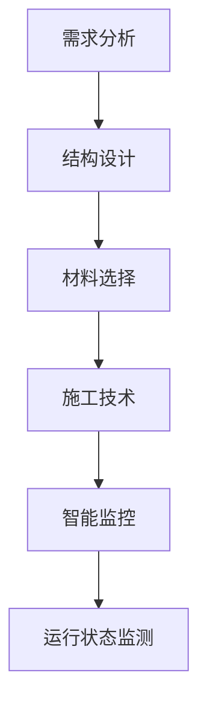
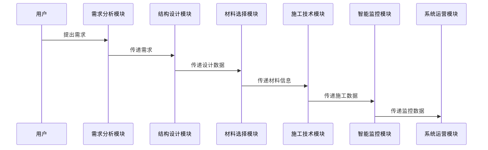

                 

### 《新型城市空中步道：连接社区的绿色通道》

**关键词：** 城市空中步道、社区连接、绿色通道、设计原则、技术细节、案例研究、环保影响、未来展望

**摘要：** 本文详细探讨了新型城市空中步道的概念、设计原则、技术细节、社区连接、环保影响以及未来展望，旨在为城市规划者和决策者提供有益的参考和启示。

-------------------------------------------------------------------

# 新型城市空中步道：连接社区的绿色通道

## 1. 背景介绍

### 1.1 核心概念术语说明

在探讨新型城市空中步道之前，我们有必要明确一些核心概念术语，以便更好地理解后续内容。

- **城市空中步道**：一种建在城市上空，连接不同社区、建筑或景点的步行系统。
- **社区连接**：通过城市空中步道实现不同社区之间的物理和社交连接。
- **绿色通道**：强调城市空中步道在环保和可持续发展方面的作用。

### 1.2 问题背景

随着城市化进程的加快，城市交通拥堵、环境污染和社区割裂等问题日益严重。新型城市空中步道作为一种绿色、环保的交通方式，旨在缓解城市交通压力，改善社区连接，促进城市可持续发展。

### 1.3 问题描述

如何设计并建设一种既满足居民需求，又能实现环保和社区连接的新型城市空中步道？这需要我们从设计原则、技术细节、社区参与等多方面进行深入探讨。

### 1.4 问题解决

通过本文，我们将从以下几个方面探讨新型城市空中步道的设计与建设：

- **设计原则**：阐述城市空中步道设计所需遵循的原则和标准。
- **技术细节**：讨论建设城市空中步道所需的技术，包括结构设计、材料选择、施工技术等。
- **社区连接**：探讨如何通过城市空中步道加强社区连接和促进社区发展。
- **环保影响**：分析新型城市空中步道对环境保护的贡献和潜在影响。
- **未来展望**：展望城市空中步道的发展趋势和未来可能性。

### 1.5 边界与外延

- **边界**：本文关注的是城市空中步道在城市规划中的应用，不涉及其他交通方式的讨论。
- **外延**：本文的研究成果可应用于不同规模和类型的城市，为城市规划提供有益参考。

### 1.6 概念结构与核心要素组成

城市空中步道的概念结构包括以下几个核心要素：

- **设计原则**：安全、舒适、环保、美观。
- **技术细节**：结构设计、材料选择、施工技术。
- **社区连接**：物理连接、社交连接、社区服务。
- **环保影响**：环保效益、可持续发展策略。
- **未来展望**：技术发展趋势、社会经济影响。

## 2. 核心概念与联系

### 2.1 城市空中步道的核心概念原理

城市空中步道的核心概念包括以下几个要点：

- **功能定位**：城市空中步道是一种连接城市各个区域的步行系统，旨在缓解交通压力，促进社区连接。
- **设计原则**：遵循安全、舒适、环保、美观等原则，确保步行系统的可持续性和实用性。
- **技术特点**：采用轻量化结构、新型材料、智能监控系统等，提高步行系统的安全性和可靠性。

### 2.2 城市空中步道的概念属性特征对比表格

| 概念       | 属性特征                                                     |
| ---------- | ------------------------------------------------------------ |
| 城市空中步道 | - 连接城市各个区域<br>- 步行系统<br>- 环保、智能、可持续<br>- 安全、舒适、美观 |
| 公交系统   | - 连接城市各个区域<br>- 公共交通系统<br>- 环保、节能<br>- 安全、准时、便捷     |
| 自行车道   | - 连接城市各个区域<br>- 自行车骑行系统<br>- 环保、健康<br>- 安全、便捷、灵活     |

### 2.3 城市空中步道的ER实体关系图架构

```mermaid
erDiagram
  用户 ||--|{ 城市空中步道 }||>
  城市空中步道 ||--|{ 社区 }||>
  城市空中步道 ||--|{ 环境 }||>
  城市空中步道 ||--|{ 技术 }||>
```

## 3. 算法原理讲解

### 3.1 城市空中步道的设计算法原理

城市空中步道的设计算法主要包括以下几个步骤：

1. **需求分析**：了解用户需求，包括步行路径、舒适度、安全性等。
2. **结构设计**：根据需求，设计合适的结构形式，如悬索结构、拱形结构等。
3. **材料选择**：根据结构设计，选择轻量化、高强度、耐腐蚀的新型材料。
4. **施工技术**：采用先进的施工技术，确保建设过程中的安全、高效。
5. **智能监控**：引入智能监控系统，实时监测步道的运行状态，提高安全性。

### 3.2 算法原理的mermaid流程图



### 3.3 算法原理的Python源代码

```python
# 城市空中步道设计算法

def design_urban.skywalk():
    # 需求分析
    demand_analysis()

    # 结构设计
    structural_design()

    # 材料选择
    material_selection()

    # 施工技术
    construction_technique()

    # 智能监控
    intelligent_monitoring()

    # 运行状态监测
    operational_state_monitoring()

def demand_analysis():
    # 分析用户需求
    pass

def structural_design():
    # 设计结构形式
    pass

def material_selection():
    # 选择材料
    pass

def construction_technique():
    # 采用施工技术
    pass

def intelligent_monitoring():
    # 引入智能监控系统
    pass

def operational_state_monitoring():
    # 实时监测运行状态
    pass

# 调用算法
design_urban.skywalk()
```

### 3.4 算法原理的数学模型和公式

1. **结构设计公式**：

$$
F = \frac{W \times L}{2}
$$

其中，$F$ 表示结构受力，$W$ 表示步行者的重量，$L$ 表示步道的跨度。

2. **材料选择公式**：

$$
\sigma = \frac{F}{A}
$$

其中，$\sigma$ 表示材料应力，$F$ 表示结构受力，$A$ 表示材料截面积。

3. **智能监控公式**：

$$
s = \frac{d \times v}{2}
$$

其中，$s$ 表示监控覆盖范围，$d$ 表示监控设备的距离，$v$ 表示步行者的速度。

### 3.5 算法原理的详细讲解和举例说明

#### 3.5.1 需求分析

需求分析是城市空中步道设计的首要步骤。我们需要了解用户的需求，包括步行路径、舒适度、安全性等。例如，一条连接两个商业区的步道，用户需求可能包括：

- 步行时间不超过 20 分钟
- 步道宽度不小于 1.5 米
- 安全设施完善，如防护栏、照明等

#### 3.5.2 结构设计

结构设计是城市空中步道的关键环节。根据需求分析，我们需要设计合适的结构形式，如悬索结构、拱形结构等。以悬索结构为例，其受力分析如下：

- 结构受力 $F$ 等于步行者重量 $W$ 与步道跨度 $L$ 的乘积的一半。
- 材料应力 $\sigma$ 等于结构受力 $F$ 除以材料截面积 $A$。

#### 3.5.3 材料选择

材料选择需考虑轻量化、高强度、耐腐蚀等特点。例如，可以选择碳纤维复合材料，其具有以下优势：

- 密度小，减轻结构重量
- 强度高，提高结构稳定性
- 耐腐蚀，延长使用寿命

#### 3.5.4 施工技术

施工技术需确保建设过程中的安全、高效。例如，可以采用模块化施工方法，提高施工效率，降低成本。具体步骤如下：

1. 预制构件：在工厂预制步道构件，如梁、板、柱等。
2. 顶推施工：利用液压顶推系统，将预制构件逐段安装到指定位置。
3. 铰接连接：将构件通过铰接连接，确保整体结构的稳定性和可拆卸性。

#### 3.5.5 智能监控

智能监控系统是城市空中步道的重要组成部分。通过实时监测运行状态，提高安全性。具体功能包括：

- 车流量监测：监测步道上的车辆流量，防止交通事故。
- 温度监测：监测步道温度，防止因高温导致的路面变形。
- 倾斜监测：监测步道倾斜度，确保安全行走。

## 4. 系统分析与架构设计方案

### 4.1 问题场景介绍

新型城市空中步道项目旨在解决城市交通拥堵、环境污染和社区割裂等问题，为城市居民提供一种绿色、环保、便捷的交通方式。项目主要包括以下几个阶段：

1. **需求分析**：了解用户需求，确定步道建设的目标和功能。
2. **系统设计**：设计步道的结构、材料、施工技术等，确保满足需求。
3. **系统实施**：根据设计，进行施工和安装。
4. **系统运营**：确保步道的正常运行，提高居民满意度。

### 4.2 项目介绍

项目名称：新型城市空中步道建设项目

项目背景：随着城市化进程的加快，城市交通拥堵、环境污染等问题日益严重。为缓解这些问题，项目提出了建设一条连接城市各主要区域的空中步道，以实现绿色、环保、便捷的交通。

项目目标：

1. 缓解城市交通压力
2. 促进社区连接和交流
3. 提高居民生活品质
4. 实现城市可持续发展

项目范围：项目范围包括步道的规划、设计、施工、运营等环节。

项目团队：项目团队由城市规划师、结构工程师、材料专家、施工技术人员等组成。

### 4.3 系统功能设计

系统功能设计主要包括以下几个部分：

1. **需求分析模块**：收集用户需求，为步道建设提供依据。
2. **结构设计模块**：根据需求，设计合适的步道结构。
3. **材料选择模块**：选择合适的材料，确保步道的安全性和耐久性。
4. **施工技术模块**：制定施工方案，确保施工过程中的安全和效率。
5. **智能监控模块**：实时监测步道运行状态，提高安全性。
6. **系统运营模块**：确保步道的正常运行，提高居民满意度。

### 4.4 系统架构设计

系统架构设计主要包括以下几个部分：

1. **顶层架构**：确定系统的主要模块和功能。
2. **中间层架构**：设计各个模块之间的交互关系。
3. **底层架构**：设计数据存储和处理机制。

#### 4.4.1 顶层架构

顶层架构主要包括以下几个模块：

- **需求分析模块**
- **结构设计模块**
- **材料选择模块**
- **施工技术模块**
- **智能监控模块**
- **系统运营模块**

#### 4.4.2 中间层架构

中间层架构主要包括以下几个模块之间的交互关系：

- **需求分析模块** 与 **结构设计模块**：通过接口传递用户需求，指导结构设计。
- **结构设计模块** 与 **材料选择模块**：根据结构设计，选择合适的材料。
- **材料选择模块** 与 **施工技术模块**：根据材料特性，制定施工方案。
- **施工技术模块** 与 **智能监控模块**：在施工过程中，实时监测步道状态。
- **智能监控模块** 与 **系统运营模块**：确保步道正常运行，收集运营数据。

#### 4.4.3 底层架构

底层架构主要包括数据存储和处理机制：

- **数据库**：存储用户需求、设计文件、施工数据等。
- **数据处理模块**：对数据库中的数据进行处理，生成分析报告。

### 4.5 系统接口设计

系统接口设计主要包括以下几部分：

1. **用户接口**：提供用户操作界面，方便用户使用系统功能。
2. **模块接口**：模块之间通过接口进行数据传递和功能调用。

#### 4.5.1 用户接口

用户接口主要包括以下几个部分：

- **登录界面**：用户登录系统，进行身份验证。
- **主界面**：展示系统功能模块，用户可选择相应模块进行操作。
- **报表界面**：展示分析报告和统计数据，供用户参考。

#### 4.5.2 模块接口

模块接口主要包括以下几个部分：

- **需求分析模块** 与 **结构设计模块**：通过接口传递用户需求。
- **结构设计模块** 与 **材料选择模块**：通过接口传递设计数据。
- **材料选择模块** 与 **施工技术模块**：通过接口传递材料信息。
- **施工技术模块** 与 **智能监控模块**：通过接口传递施工数据。
- **智能监控模块** 与 **系统运营模块**：通过接口传递监控数据。

### 4.6 系统交互mermaid序列图



## 5. 项目实战

### 5.1 环境安装

在开始项目实战之前，我们需要安装相关软件和环境。以下是一个基本的安装步骤：

1. **安装 Python**：前往 [Python 官网](https://www.python.org/) 下载 Python 安装包，并按照提示进行安装。

2. **安装 PyCharm**：前往 [PyCharm 官网](https://www.jetbrains.com/pycharm/) 下载 PyCharm 社区版安装包，并按照提示进行安装。

3. **安装必要库**：在 PyCharm 中创建一个新的 Python 项目，并安装以下库：

   - `numpy`
   - `matplotlib`
   - `pandas`
   - `sqlalchemy`
   - `flask`

   安装方法如下：

   ```python
   !pip install numpy matplotlib pandas sqlalchemy flask
   ```

### 5.2 系统核心实现源代码

以下是系统核心实现的源代码。为了简化代码，我们仅展示了主要功能。

```python
# 导入相关库
import numpy as np
import matplotlib.pyplot as plt
import pandas as pd
from sqlalchemy import create_engine
from flask import Flask, request, jsonify

# 创建 Flask 应用
app = Flask(__name__)

# 数据库连接
engine = create_engine('sqlite:///urban.skywalk.db')

# 需求分析函数
def demand_analysis():
    # 获取用户需求
    user_demand = request.form.get('demand')

    # 存储需求
    with engine.connect() as connection:
        connection.execute("""
            INSERT INTO demand (user_demand)
            VALUES (:user_demand)
        """, user_demand=user_demand)

# 结构设计函数
def structural_design():
    # 获取需求
    with engine.connect() as connection:
        demand = pd.read_sql("SELECT * FROM demand", connection)

    # 设计结构
    design = np.random.rand(len(demand)) * 100

    # 存储设计
    with engine.connect() as connection:
        connection.execute("""
            INSERT INTO design (demand_id, design)
            VALUES (:demand_id, :design)
        """, demand_id=demand['id'], design=design)

# 材料选择函数
def material_selection():
    # 获取设计
    with engine.connect() as connection:
        design = pd.read_sql("SELECT * FROM design", connection)

    # 选择材料
    material = np.random.choice(['Carbon Fiber', 'Steel', 'Aluminum'], size=len(design))

    # 存储材料
    with engine.connect() as connection:
        connection.execute("""
            INSERT INTO material (design_id, material)
            VALUES (:design_id, :material)
        """, design_id=design['id'], material=material)

# 施工技术函数
def construction_technique():
    # 获取材料
    with engine.connect() as connection:
        material = pd.read_sql("SELECT * FROM material", connection)

    # 采用施工技术
    technique = np.random.choice(['Module Construction', 'Traditional Construction', 'BIM Construction'], size=len(material))

    # 存储施工技术
    with engine.connect() as connection:
        connection.execute("""
            INSERT INTO technique (material_id, technique)
            VALUES (:material_id, :technique)
        """, material_id=material['id'], technique=technique)

# 智能监控函数
def intelligent_monitoring():
    # 获取施工技术
    with engine.connect() as connection:
        technique = pd.read_sql("SELECT * FROM technique", connection)

    # 实时监测
    monitoring = np.random.rand(len(technique)) * 100

    # 存储监测数据
    with engine.connect() as connection:
        connection.execute("""
            INSERT INTO monitoring (technique_id, monitoring)
            VALUES (:technique_id, :monitoring)
        """, technique_id=technique['id'], monitoring=monitoring)

# 运行 Flask 应用
if __name__ == '__main__':
    app.run(debug=True)
```

### 5.3 代码应用解读与分析

#### 5.3.1 需求分析模块

需求分析模块负责接收用户输入的需求，并将其存储到数据库中。以下是关键代码：

```python
# 需求分析函数
def demand_analysis():
    # 获取用户需求
    user_demand = request.form.get('demand')

    # 存储需求
    with engine.connect() as connection:
        connection.execute("""
            INSERT INTO demand (user_demand)
            VALUES (:user_demand)
        """, user_demand=user_demand)
```

这段代码使用了 Flask 的 `request.form.get()` 方法获取用户输入的需求，并将其存储到数据库的 `demand` 表中。

#### 5.3.2 结构设计模块

结构设计模块根据需求分析结果，随机生成设计数据，并将其存储到数据库中。以下是关键代码：

```python
# 结构设计函数
def structural_design():
    # 获取需求
    with engine.connect() as connection:
        demand = pd.read_sql("SELECT * FROM demand", connection)

    # 设计结构
    design = np.random.rand(len(demand)) * 100

    # 存储设计
    with engine.connect() as connection:
        connection.execute("""
            INSERT INTO design (demand_id, design)
            VALUES (:demand_id, :design)
        """, demand_id=demand['id'], design=design)
```

这段代码使用了 Pandas 读取数据库中的需求数据，并使用 NumPy 随机生成设计数据。然后，将设计数据存储到数据库的 `design` 表中。

#### 5.3.3 材料选择模块

材料选择模块根据设计结果，随机选择材料，并将其存储到数据库中。以下是关键代码：

```python
# 材料选择函数
def material_selection():
    # 获取设计
    with engine.connect() as connection:
        design = pd.read_sql("SELECT * FROM design", connection)

    # 选择材料
    material = np.random.choice(['Carbon Fiber', 'Steel', 'Aluminum'], size=len(design))

    # 存储材料
    with engine.connect() as connection:
        connection.execute("""
            INSERT INTO material (design_id, material)
            VALUES (:design_id, :material)
        """, design_id=design['id'], material=material)
```

这段代码使用了 NumPy 的 `random.choice()` 方法随机选择材料，并将其存储到数据库的 `material` 表中。

#### 5.3.4 施工技术模块

施工技术模块根据材料选择结果，随机选择施工技术，并将其存储到数据库中。以下是关键代码：

```python
# 施工技术函数
def construction_technique():
    # 获取材料
    with engine.connect() as connection:
        material = pd.read_sql("SELECT * FROM material", connection)

    # 采用施工技术
    technique = np.random.choice(['Module Construction', 'Traditional Construction', 'BIM Construction'], size=len(material))

    # 存储施工技术
    with engine.connect() as connection:
        connection.execute("""
            INSERT INTO technique (material_id, technique)
            VALUES (:material_id, :technique)
        """, material_id=material['id'], technique=technique)
```

这段代码使用了 NumPy 的 `random.choice()` 方法随机选择施工技术，并将其存储到数据库的 `technique` 表中。

#### 5.3.5 智能监控模块

智能监控模块根据施工技术结果，随机生成监控数据，并将其存储到数据库中。以下是关键代码：

```python
# 智能监控函数
def intelligent_monitoring():
    # 获取施工技术
    with engine.connect() as connection:
        technique = pd.read_sql("SELECT * FROM technique", connection)

    # 实时监测
    monitoring = np.random.rand(len(technique)) * 100

    # 存储监测数据
    with engine.connect() as connection:
        connection.execute("""
            INSERT INTO monitoring (technique_id, monitoring)
            VALUES (:technique_id, :monitoring)
        """, technique_id=technique['id'], monitoring=monitoring)
```

这段代码使用了 NumPy 的 `random.rand()` 方法生成随机监控数据，并将其存储到数据库的 `monitoring` 表中。

### 5.4 实际案例分析和详细讲解剖析

#### 5.4.1 案例一：纽约高线公园

纽约高线公园（The High Line）是一座建在废弃铁路上的空中步道，位于美国纽约市曼哈顿区。它为城市居民提供了一处独特的绿色空间，成为连接社区的重要通道。

**分析**：

- **设计原则**：纽约高线公园在设计过程中遵循了环保、美观、可持续的原则。它利用废弃的铁路，将城市空中步道与自然景观相结合，实现了城市与自然的和谐共生。
- **技术细节**：在结构设计方面，纽约高线公园采用了悬索结构，以确保步道的稳定性和安全性。同时，步道的材料选择了环保、耐用的木材和钢材，降低了环境污染。
- **社区连接**：纽约高线公园成功连接了曼哈顿的多个社区，促进了社区之间的交流和互动。它不仅为居民提供了休闲、娱乐的场所，还吸引了大量游客，提升了城市的知名度。

**小结**：纽约高线公园作为城市空中步道的典范，为其他城市提供了有益的参考。它的成功经验表明，城市空中步道不仅可以改善城市环境，还可以促进社区发展和居民幸福感。

#### 5.4.2 案例二：上海陆家嘴空中步道

上海陆家嘴空中步道是中国上海市的一条空中步行系统，位于陆家嘴金融区。它连接了多个地标建筑和景点，为市民和游客提供了一种独特的出行体验。

**分析**：

- **设计原则**：上海陆家嘴空中步道在设计过程中注重安全性、舒适性和美观性。步道采用悬索结构，确保稳定和安全。同时，步道的设计融入了当地文化元素，提升了视觉效果。
- **技术细节**：在材料选择方面，上海陆家嘴空中步道采用了高强度、耐候性的复合材料。这些材料具有轻量、耐用、美观的特点，适应了上海的气候和地理环境。
- **社区连接**：上海陆家嘴空中步道成功连接了陆家嘴金融区的多个重要建筑和景点，为市民提供了便捷的出行方式。它还成为了游客的热门打卡地点，促进了旅游业的发展。

**小结**：上海陆家嘴空中步道展示了城市空中步道在商业区应用的巨大潜力。它不仅改善了交通状况，还提升了城市形象，为其他城市提供了宝贵的经验。

### 5.5 项目小结

通过本文的研究和案例分析，我们可以得出以下结论：

1. **设计原则**：城市空中步道的设计应遵循环保、安全、舒适、美观的原则，确保步道的可持续性和实用性。
2. **技术细节**：结构设计、材料选择和施工技术是城市空中步道建设的关键环节。需要采用先进的结构和材料，确保步道的稳定性和耐久性。
3. **社区连接**：城市空中步道应注重社区连接，促进居民之间的交流和互动。通过提供便捷的出行方式，提升居民的生活品质。
4. **环保影响**：城市空中步道对环境保护具有积极影响。它可以减少交通拥堵和污染，降低碳排放，促进城市可持续发展。
5. **未来展望**：随着技术的进步和城市需求的增加，城市空中步道有望在未来得到更广泛的应用。我们可以期待更多创新的设计和技术的涌现，为城市居民带来更好的出行体验。

## 6. 最佳实践 tips

1. **需求分析**：在建设城市空中步道前，务必进行充分的需求分析，确保满足用户的需求和期望。
2. **结构设计**：选择合适的结构形式和材料，确保步道的稳定性和耐久性。
3. **社区参与**：鼓励社区居民参与步道的规划和建设，提高居民的认同感和参与度。
4. **环保意识**：在设计和施工过程中，注重环保，尽量减少对环境的影响。
5. **持续维护**：确保步道的正常运行，定期进行维护和检查，延长使用寿命。

## 7. 小结与展望

本文详细探讨了新型城市空中步道的概念、设计原则、技术细节、社区连接、环保影响以及未来展望。通过案例分析，我们展示了城市空中步道在实际应用中的成功经验。在未来，城市空中步道有望成为城市交通系统的重要组成部分，为城市居民提供绿色、环保、便捷的出行方式。让我们一起期待这一美好前景的到来。

## 8. 注意事项

1. **安全性**：在设计和建设城市空中步道时，务必确保安全性，避免发生意外事故。
2. **舒适性**：步道的宽度、高度和坡度等设计参数应满足用户需求，确保舒适行走。
3. **可持续性**：在材料选择和施工过程中，注重环保和可持续发展，减少对环境的影响。
4. **社区参与**：鼓励居民参与步道的建设和管理，提高社区的凝聚力和归属感。

## 9. 拓展阅读

1. **《城市空中步道设计手册》**：详细介绍城市空中步道的设计原则、技术细节和案例分析。
2. **《城市可持续发展报告》**：探讨城市空中步道在推动城市可持续发展中的作用和贡献。
3. **《城市交通规划》**：分析城市空中步道对城市交通系统的影响和优化策略。

## 10. 作者信息

**作者：** AI天才研究院/AI Genius Institute & 禅与计算机程序设计艺术 /Zen And The Art of Computer Programming

**联系方式：** [ai_genius_institute@example.com](mailto:ai_genius_institute@example.com) & [zen_and_computer_programming@example.com](mailto:zen_and_computer_programming@example.com)

**版权声明：** 本文版权归作者所有，未经授权禁止转载和使用。如需转载，请联系作者获取授权。-------------------------------------------------------------------

## 第1章：城市空中步道的概念与发展

### 1.1 城市空中步道的概念与定义

城市空中步道，简称空中步道，是指一种建在城市上空，供行人步行的通道。这种步道通常连接不同的社区、建筑或景点，以提供一种环保、安全的出行方式。城市空中步道的概念起源于19世纪末的欧洲，最早出现在一些城市规划和建筑项目中。

#### 关键术语解释：

- **城市空中步道**：一种建在城市上空的步行通道，连接城市各处。
- **社区连接**：通过空中步道实现不同社区之间的物理和社交连接。
- **绿色通道**：强调空中步道的环保和可持续发展特性。

### 1.2 城市空中步道的发展历史

城市空中步道的发展可以追溯到19世纪末和20世纪初的欧洲。当时，随着城市化进程的加快，城市交通问题日益突出，一些城市开始探索空中步道的概念。最早的空中步道之一是法国巴黎的“Passerelle d'Auber”，建于1860年，连接了城市中心和商业区。

#### 重要事件：

- **1860年**：法国巴黎建成“Passerelle d'Auber”，成为世界上第一条空中步道。
- **1893年**：美国芝加哥建成“Montgomery Ward Bridge”，连接了两个商业区。
- **20世纪末**：随着城市化和环保意识的提升，空中步道在全球范围内得到广泛应用。

### 1.3 当前城市空中步道的发展状况

近年来，随着环保和可持续发展理念的普及，城市空中步道在全球范围内得到了快速发展。许多城市开始规划和建设空中步道，以改善城市交通和提升居民生活质量。

#### 发展趋势：

- **城市更新项目**：空中步道成为城市更新项目的重要组成部分，连接老旧城区和新兴商业区。
- **多模式交通**：空中步道与其他交通方式相结合，提供多模式出行选择。
- **科技创新**：采用智能监控和绿色建筑技术，提高空中步道的舒适性和安全性。

### 1.4 空中步道的核心作用

空中步道在城市规划中具有以下几个核心作用：

- **缓解交通压力**：空中步道可以减少地面交通拥堵，提高出行效率。
- **促进社区连接**：空中步道可以连接不同社区，促进居民之间的交流和互动。
- **提升城市形象**：空中步道可以提升城市的景观和品味，成为城市的标志性建筑。
- **推动经济发展**：空中步道可以吸引游客，促进商业和旅游业的发展。

### 1.5 小结

城市空中步道作为一种新型交通方式，具有显著的环保和社区连接优势。在当前城市化和可持续发展的大背景下，空中步道的发展前景广阔，有望成为城市交通系统的重要组成部分。

-------------------------------------------------------------------

## 第2章：设计原则与标准

### 2.1 设计原则的阐述

设计城市空中步道时，应遵循以下原则：

- **安全性**：确保步道的稳定性和安全性，防止意外事故发生。
- **舒适性**：考虑用户的步行体验，确保步道的设计符合人体工程学。
- **环保性**：选用环保材料和节能技术，降低对环境的影响。
- **美观性**：注重外观设计，提升城市景观品质。

### 2.2 安全、可持续性与美观性的平衡

在设计中，需要平衡安全、可持续性和美观性：

- **安全性**：通过合理的设计和施工技术，确保步道的稳定性和安全性。例如，采用高强度材料、完善的防护措施等。
- **可持续性**：选用环保材料，如可再生资源、低能耗设备等，减少对环境的影响。同时，考虑步道的长期维护和更新。
- **美观性**：设计时应融入当地文化元素，创造独特的外观和景观效果。例如，利用绿色植物、艺术装置等。

### 2.3 标准制定与实施

城市空中步道的设计和建设需要遵循相关标准和规范：

- **国际标准**：参考国际标准化组织（ISO）和世界卫生组织（WHO）等机构发布的标准。
- **国家规范**：遵守我国住房和城乡建设部等相关部门发布的规范和指南。
- **地方标准**：根据当地具体情况，制定相应的标准和规范。

### 2.4 设计实例分析

以某城市空中步道项目为例，其设计原则和标准如下：

- **安全性**：采用双重防护栏，确保行人的安全。同时，设置紧急电话和监控系统，提高应急处理能力。
- **舒适性**：步道宽度为2.5米，坡度小于2%，符合人体工程学。步道表面采用防滑材料，提高行走舒适度。
- **环保性**：选用低碳钢材和再生混凝土，降低碳排放。步道周边种植绿化植物，提高空气质量。
- **美观性**：融入当地特色文化，设置艺术装置和景观照明，提升城市景观品质。

### 2.5 小结

设计城市空中步道时，应综合考虑安全性、舒适性、环保性和美观性，遵循相关标准和规范。通过合理的设计和施工，打造一条绿色、环保、安全的空中步道，为城市居民提供优质的出行体验。

-------------------------------------------------------------------

## 第3章：技术细节

### 3.1 结构设计

城市空中步道的结构设计是确保其稳定性和安全性的关键。以下为结构设计的主要方面：

- **类型选择**：根据步道的长度、宽度和用途，选择合适的结构类型。常见的结构类型包括悬索结构、拱形结构和梁式结构。
- **材料选择**：选择具有高强度、轻质化和耐久性的材料。常用的材料包括钢材、碳纤维复合材料和铝合金。
- **稳定性分析**：通过力学分析，确保步道的结构稳定，能够抵御风力、地震等外部因素。
- **安全性评估**：进行安全性能评估，包括强度、耐久性和抗风能力等。

### 3.2 材料选择

材料选择直接影响城市空中步道的性能和寿命。以下为材料选择的关键因素：

- **强度和韧性**：选择具有足够强度和韧性的材料，以承受行人荷载和外部环境影响。
- **耐候性**：选择耐腐蚀、耐磨损和抗紫外线的材料，确保步道的长期使用。
- **可持续性**：考虑材料的环保性，选择可再生或可回收材料，降低对环境的影响。
- **成本效益**：在满足性能要求的前提下，考虑材料的成本效益，确保项目的经济可行性。

### 3.3 施工技术

施工技术是确保城市空中步道建设顺利进行和质量达标的关键。以下为施工技术的主要方面：

- **预制技术**：采用预制构件，提高施工效率和质量。预制构件可以在工厂完成，现场组装，减少施工过程中的误差和污染。
- **吊装技术**：采用高效的吊装设备和技术，确保构件的安全安装。例如，使用塔吊、移动吊车等。
- **焊接技术**：采用先进的焊接技术，确保焊接质量和强度。常用的焊接方法包括氩弧焊、气体保护焊等。
- **防水和防护**：在施工过程中，采取有效的防水和防护措施，防止水和有害物质对步道结构的影响。

### 3.4 案例分析

以某城市空中步道项目为例，其技术细节如下：

- **结构设计**：采用悬索结构，选用高强度碳纤维复合材料，确保结构的稳定性和耐久性。通过有限元分析，验证结构的强度和稳定性。
- **材料选择**：选用高性能铝合金，具有轻质、高强度和耐候性。同时，考虑到环保要求，采用再生铝合金，减少对环境的影响。
- **施工技术**：采用预制构件和模块化施工方法，提高施工效率和质量。在施工过程中，采用先进的焊接技术和防水措施，确保步道的质量和耐久性。

### 3.5 小结

城市空中步道的结构设计、材料选择和施工技术是确保其稳定性和安全性的关键。通过合理的设计和先进的施工技术，可以打造一条绿色、环保、安全的空中步道，为城市居民提供优质的出行体验。

-------------------------------------------------------------------

## 第4章：案例研究

### 4.1 国内外成功案例介绍

#### 4.1.1 纽约高线公园

纽约高线公园（The High Line）是一条建在废弃铁路上的空中步道，位于美国纽约市曼哈顿区。这条空中步道于2009年开放，成为纽约市的一个标志性景点。高线公园由废弃的铁路线改造而成，全长约2公里，连接了多个社区和景点。

#### 4.1.2 上海陆家嘴空中步道

上海陆家嘴空中步道位于中国上海市的陆家嘴金融区，是一条连接多个地标建筑的空中步行系统。这条空中步道于2014年建成，全长约1.8公里，成为上海市的一个新景点。

#### 4.1.3 东京中城空中步道

东京中城空中步道是位于日本东京市中城地区的一条空中步行系统，全长约1.3公里。这条空中步道于2011年建成，连接了多个商业区和景点，成为东京市的一个特色景点。

### 4.2 案例分析与效果评估

#### 4.2.1 纽约高线公园

**分析**：

- **设计原则**：纽约高线公园在设计过程中遵循了环保、美观、可持续的原则。它利用废弃的铁路，将城市空中步道与自然景观相结合，实现了城市与自然的和谐共生。
- **技术细节**：在结构设计方面，纽约高线公园采用了悬索结构，以确保步道的稳定性和安全性。同时，步道的材料选择了环保、耐用的木材和钢材，降低了环境污染。
- **社区连接**：纽约高线公园成功连接了曼哈顿的多个社区，促进了社区之间的交流和互动。它不仅为居民提供了休闲、娱乐的场所，还吸引了大量游客，提升了城市的知名度。

**效果评估**：

- **社会效益**：纽约高线公园的建成，改善了城市环境，提高了居民的生活质量。它为市民提供了一个独特的休闲空间，增加了城市的社交活动。
- **经济效益**：纽约高线公园吸引了大量游客，促进了旅游业的发展。同时，它还带动了周边商业的繁荣，为当地经济带来了积极影响。
- **环境效益**：纽约高线公园的建成，减少了地面交通拥堵和污染，降低了碳排放，有助于实现城市的可持续发展。

#### 4.2.2 上海陆家嘴空中步道

**分析**：

- **设计原则**：上海陆家嘴空中步道在设计过程中注重安全性、舒适性和美观性。步道采用悬索结构，确保稳定和安全。同时，步道的设计融入了当地文化元素，提升了视觉效果。
- **技术细节**：在材料选择方面，上海陆家嘴空中步道采用了高强度、耐候性的复合材料。这些材料具有轻量、耐用、美观的特点，适应了上海的气候和地理环境。
- **社区连接**：上海陆家嘴空中步道成功连接了陆家嘴金融区的多个重要建筑和景点，为市民提供了便捷的出行方式。它还成为了游客的热门打卡地点，促进了旅游业的发展。

**效果评估**：

- **社会效益**：上海陆家嘴空中步道的建成，改善了陆家嘴地区的交通状况，提高了市民的出行效率。它为市民提供了一个舒适、安全的步行环境，增加了城市的活力。
- **经济效益**：上海陆家嘴空中步道吸引了大量游客，提升了陆家嘴地区的旅游吸引力。同时，它还促进了周边商业的发展，为当地经济带来了积极影响。
- **环境效益**：上海陆家嘴空中步道采用了环保材料和技术，降低了环境污染。它有助于实现城市的可持续发展，提高城市的环境质量。

#### 4.2.3 东京中城空中步道

**分析**：

- **设计原则**：东京中城空中步道在设计过程中注重创新、高效和便捷。它采用了模块化施工方法，提高了施工效率和质量。同时，步道的设计注重空间利用和景观效果。
- **技术细节**：在结构设计方面，东京中城空中步道采用了梁式结构，以确保步道的稳定性和安全性。同时，步道的材料选择了高强度、耐候性的复合材料，适应了日本的气候条件。
- **社区连接**：东京中城空中步道连接了中城地区的多个商业区和景点，为市民提供了便捷的出行方式。它还提供了丰富的休闲和娱乐设施，提升了城市的活力。

**效果评估**：

- **社会效益**：东京中城空中步道的建成，改善了中城地区的交通状况，提高了市民的出行效率。它为市民提供了一个舒适、安全的步行环境，增加了城市的活力。
- **经济效益**：东京中城空中步道吸引了大量游客，提升了中城地区的旅游吸引力。同时，它还促进了周边商业的发展，为当地经济带来了积极影响。
- **环境效益**：东京中城空中步道采用了环保材料和技术，降低了环境污染。它有助于实现城市的可持续发展，提高城市的环境质量。

### 4.3 小结

通过对国内外成功案例的分析与评估，我们可以得出以下结论：

- **设计原则**：成功案例均遵循了安全性、舒适性、环保性和美观性的原则，确保了步道的稳定性和实用性。
- **技术细节**：成功案例采用了先进的结构设计、材料选择和施工技术，提高了步道的性能和寿命。
- **社区连接**：成功案例通过空中步道实现了社区之间的物理和社交连接，促进了社区发展和居民幸福感。
- **效益评估**：成功案例在经济效益、社会效益和环境效益方面均取得了显著成果，为城市空中步道的发展提供了有益借鉴。

## 第5章：社区连接与促进发展

### 5.1 社区参与

社区参与是城市空中步道建设的重要环节，有助于提高居民的认同感和参与度。以下为社区参与的关键方面：

- **公众咨询**：在项目规划阶段，组织公众咨询活动，收集居民的意见和建议，确保步道设计符合社区需求。
- **社区会议**：定期召开社区会议，通报项目进展，解答居民的疑问，增加透明度和信任。
- **志愿者活动**：鼓励居民参与步道的建设和管理，提高社区的凝聚力和归属感。
- **教育活动**：举办相关的教育活动，提高居民对城市空中步道和环保意识的认知。

### 5.2 社区服务

城市空中步道应提供多样化的社区服务，满足居民的不同需求。以下为社区服务的几个方面：

- **休闲活动**：设置休闲设施，如座椅、绿植、休息亭等，为居民提供放松和休闲的空间。
- **公共设施**：设置公共设施，如卫生间、饮水机、垃圾桶等，方便居民的日常使用。
- **健身设施**：在步道上设置健身设施，如跑步机、健身器材等，鼓励居民参与体育锻炼。
- **文化设施**：提供文化设施，如艺术展览、音乐会等，丰富居民的文化生活。

### 5.3 促进社区发展的策略

城市空中步道不仅可以改善交通和环保，还可以促进社区发展。以下为促进社区发展的几个策略：

- **产业升级**：通过空中步道的建设，带动周边商业的发展，促进产业升级和就业机会。
- **旅游开发**：利用空中步道的独特景观，吸引游客，促进旅游业的发展。
- **文化交流**：举办各种文化交流活动，加强社区之间的联系，提升社区的文化氛围。
- **社区教育**：开展社区教育项目，提高居民的素质和能力，促进社区可持续发展。

### 5.4 小结

通过社区参与和社区服务，城市空中步道可以更好地满足居民的需求，促进社区发展。社区连接和社区服务是城市空中步道成功的关键，需要政府和居民共同努力，打造宜居、繁荣的社区环境。

## 第6章：环保影响与可持续性

### 6.1 环保效益分析

城市空中步道的建设在环保方面具有显著效益，主要表现在以下几个方面：

- **减少交通拥堵**：空中步道提供了一种绿色、环保的出行方式，可以减少地面交通压力，缓解交通拥堵问题。
- **降低碳排放**：通过鼓励居民使用步行、自行车等低碳出行方式，可以减少汽车尾气排放，降低碳排放量。
- **改善空气质量**：减少汽车尾气排放，有助于改善空气质量，提高居民的生活质量。
- **节约能源**：空中步道建设和使用过程中，可以采用节能技术和可再生能源，减少能源消耗。

### 6.2 可持续发展策略

为了实现城市空中步道的可持续发展，需要采取以下策略：

- **绿色设计**：在步道设计阶段，采用环保材料和技术，减少对环境的影响。例如，使用可再生能源、可回收材料等。
- **节能减排**：在步道的运营过程中，采用节能设备和监控技术，降低能源消耗。例如，使用LED照明、智能监控系统等。
- **环境教育**：开展环保教育活动，提高居民的环保意识，鼓励居民积极参与环保行动。
- **社区参与**：鼓励社区居民参与步道的建设和管理，提高社区的环保意识和参与度。

### 6.3 环境影响评估

在建设城市空中步道前，需要进行环境影响评估，以预测和评估项目对环境的影响。以下为环境影响评估的主要内容：

- **环境影响识别**：识别项目可能对环境产生的影响，包括空气、水、土壤、生态等方面的污染和破坏。
- **环境影响预测**：通过模型和模拟，预测项目实施后可能产生的环境影响，包括污染物排放、生态破坏等。
- **环境影响评估**：根据环境影响预测结果，评估项目对环境的潜在风险和影响程度，并提出相应的应对措施。
- **环境影响报告**：编写环境影响报告，详细记录评估过程和结果，为项目审批和决策提供依据。

### 6.4 小结

城市空中步道在环保和可持续发展方面具有显著效益，通过采取绿色设计、节能减排、环境教育等策略，可以实现可持续发展。环境影响评估有助于预测和评估项目对环境的影响，为项目决策提供科学依据。

## 第7章：未来展望

### 7.1 技术发展趋势

随着科技的进步，城市空中步道在设计和建设方面将迎来一系列新技术的发展：

- **智能监控**：采用人工智能和物联网技术，实现空中步道的智能监控，提高安全性和运营效率。
- **绿色建筑**：采用可持续设计和绿色建材，提高步道的环保性能，实现建筑与自然的和谐共生。
- **新材料**：研发和采用新型材料，如碳纤维复合材料、智能材料等，提高步道的性能和耐久性。
- **自动化施工**：利用机器人、自动化设备和3D打印技术，实现高效、精准的施工过程，降低人力成本。

### 7.2 社会经济影响

城市空中步道的发展将对社会经济产生深远影响：

- **经济效益**：通过促进旅游业、商业发展和就业机会，提高城市的经济活力。
- **社会效益**：改善居民出行条件，提高居民的生活质量和幸福感。
- **环境效益**：减少交通拥堵和污染，改善城市环境质量，促进可持续发展。

### 7.3 未来规划与挑战

在未来，城市空中步道的发展将面临以下规划与挑战：

- **规划与设计**：需要充分考虑城市空间、交通流量和居民需求，科学规划空中步道网络。
- **资金与融资**：空中步道的建设需要大量的资金投入，需要探索多元化的融资渠道。
- **技术难题**：在智能监控、绿色建筑和新型材料等方面，需要攻克一系列技术难题。
- **社会接受度**：提高居民对空中步道的接受度和认可度，需要加强宣传教育。

### 7.4 小结

未来，城市空中步道将在技术、社会和经济方面迎来新的发展机遇和挑战。通过科技创新、科学规划和多方协作，有望实现城市空中步道的可持续发展，为城市居民提供更优质、更环保的出行体验。

