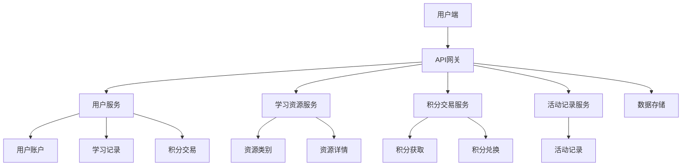
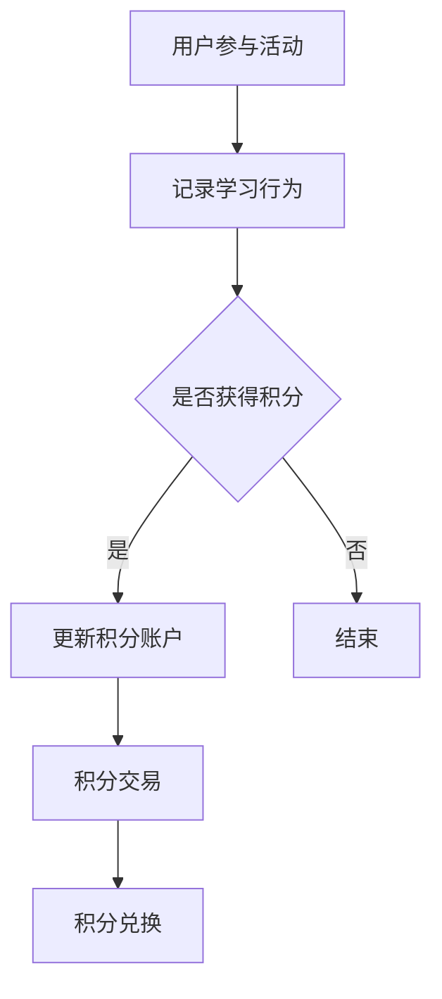

                 

# 新型城市终身学习积分银行：激励社区知识共享的数字化方案

## 关键词

终身学习、积分银行、知识共享、数字化、社区激励

## 摘要

本文深入探讨了新型城市终身学习积分银行的概念、设计原理和实现方法。通过分析终身学习的重要性以及现有知识共享模式的不足，提出了一种创新的数字化解决方案——终身学习积分银行。本文详细介绍了该系统的设计原则、系统架构、算法原理以及项目实战，旨在为社区知识共享提供有效激励，促进城市可持续发展和知识普及。

## 目录大纲

### 第一部分：背景介绍

#### 第1章：问题背景与核心概念

#### 第2章：核心概念与联系

### 第二部分：终身学习积分银行的设计与实现

#### 第3章：设计原则与目标

#### 第4章：系统架构与功能设计

#### 第5章：算法原理讲解

### 第三部分：项目实战

#### 第6章：环境安装与配置

#### 第7章：代码应用解读与分析

#### 第8章：项目总结与展望

### 第一部分：背景介绍

## 第1章：问题背景与核心概念

### 1.1.1 问题背景

在当今快速发展的信息时代，城市居民对知识和技能的需求日益增长。终身学习成为个人职业发展和生活品质提升的重要途径。然而，现有的知识共享模式面临诸多挑战，如知识获取成本高、资源分配不均、用户参与度低等。这些问题限制了知识在社区中的传播和共享，不利于城市可持续发展。

### 1.1.2 核心概念

终身学习积分银行是一种数字化解决方案，旨在通过积分机制激励社区成员参与知识共享。它将学习行为转化为可量化的积分，用户可以利用积分兑换学习资源或享受其他福利。这一概念借鉴了金融积分银行的运作模式，但在知识共享领域进行了创新应用。

### 1.1.3 问题描述

社区知识共享面临的主要挑战包括：

1. 成本与资源分配问题：高质量的学习资源往往需要较高的成本，而资源分配的不均导致部分用户难以获取。
2. 用户参与度低：缺乏有效的激励机制，用户参与知识共享的积极性不高。
3. 知识传播效率低：知识共享方式单一，难以满足个性化需求。

### 1.1.4 问题解决

终身学习积分银行通过以下方式解决问题：

1. **积分激励**：用户通过参与学习活动获得积分，积分可以兑换为学习资源或福利，提高用户积极性。
2. **数字化管理**：使用数字化手段记录和管理用户的学习行为和积分，提高管理效率和透明度。
3. **资源共享**：建立共享平台，用户可以在平台上交换学习资源，实现知识的最大化利用。

### 1.1.5 边界与外延

终身学习积分银行的应用范围包括但不限于以下领域：

1. **教育机构**：学校、大学、培训机构等可以加入积分银行，提供学习资源和活动。
2. **企业组织**：企业可以为员工提供积分奖励，鼓励员工参加培训和技能提升。
3. **公共图书馆**：图书馆可以通过积分银行吸引更多用户参与阅读和知识交流。

### 1.1.6 概念结构与核心要素组成

终身学习积分银行的核心组成部分包括：

1. **用户账户**：记录用户的学习行为和积分余额。
2. **积分规则**：定义积分的获取和兑换规则。
3. **学习资源库**：存储各种学习资源和活动信息。
4. **积分交易系统**：处理积分的获取、兑换和交易。

## 第2章：核心概念与联系

### 2.1.1 核心概念原理

终身学习积分银行的工作原理如下：

1. **积分获取**：用户通过参与学习活动（如上课、完成作业、参加讨论等）获得积分。
2. **积分兑换**：用户可以使用积分兑换学习资源（如课程、书籍、讲座等）或享受其他福利（如免费培训、优先参与活动等）。
3. **积分积累**：用户可以在一段时间内积累积分，以提高兑换价值和福利水平。

### 2.1.2 概念属性特征对比表格

| 特征       | 终身学习积分银行 | 传统知识共享模式 |
|------------|-----------------|------------------|
| 激励机制   | 积分奖励       | 无明显激励       |
| 管理方式   | 数字化管理     | 人工管理         |
| 成本效益   | 低成本         | 高成本           |
| 用户参与度 | 高参与度       | 低参与度         |

### 2.1.3 ER实体关系图架构

以下是终身学习积分银行的ER图：

```mermaid
erDiagram
  用户 ||--|{ 积分账户 }| ||
  用户 ||--|{ 学习记录 }| ||
  用户 ||--|{ 积分交易 }| ||
  学习资源 ||--|{ 资源类别 }| ||
  学习资源 ||--|{ 资源详情 }| ||
  学习活动 ||--|{ 活动记录 }| ||
```

### 第二部分：终身学习积分银行的设计与实现

## 第3章：设计原则与目标

### 3.1.1 设计原则

终身学习积分银行的设计原则包括：

1. **可持续性**：系统设计应考虑长期运行，确保稳定性和可持续性。
2. **用户参与度**：鼓励用户积极参与，提高系统的使用频率和用户满意度。
3. **灵活性**：系统应具备灵活性，能够适应不同场景和需求的变化。
4. **可扩展性**：系统设计应考虑未来的扩展性，以适应日益增长的用户规模。

### 3.1.2 设计目标

终身学习积分银行的设计目标包括：

1. **提高知识共享效率**：通过积分机制和数字化管理，提高用户参与知识共享的积极性，加快知识传播速度。
2. **激励用户持续学习**：通过积分奖励和福利，激励用户不断学习新知识和技能。
3. **降低知识获取成本**：利用积分银行模式，降低用户获取高质量学习资源的成本，促进知识的普及和共享。
4. **提升社区凝聚力**：通过知识共享和互动，增强社区成员之间的联系，提升社区凝聚力。

## 第4章：系统架构与功能设计

### 4.1.1 系统架构设计

终身学习积分银行的整体架构设计如下：



### 4.1.2 系统功能设计

终身学习积分银行的主要功能模块包括：

1. **用户账户管理**：用户注册、登录、个人信息维护、账户余额查询等功能。
2. **学习资源管理**：资源分类、资源详情展示、资源推荐等功能。
3. **积分交易管理**：积分获取、积分兑换、积分交易记录等功能。
4. **活动记录管理**：活动记录、活动报名、活动评价等功能。
5. **数据存储与管理**：用户数据、学习资源数据、积分交易数据等的存储和管理。

## 第5章：算法原理讲解

### 5.1.1 算法mermaid流程图

以下是终身学习积分银行的核心算法流程图：



### 5.1.2 Python源代码

以下是积分银行的核心算法实现代码：

```python
# 积分获取函数
def get_points(activity, user):
    points = 0
    if activity["type"] == "course_completion":
        points = activity["points"]
    elif activity["type"] == "discussion_participation":
        points = activity["points"]
    user["balance"] += points
    return user

# 积分兑换函数
def redeem_points(user, resource):
    if user["balance"] >= resource["cost"]:
        user["balance"] -= resource["cost"]
        return True
    else:
        return False
```

### 5.1.3 数学模型与公式

终身学习积分银行的数学模型包括：

1. **积分获取公式**：\( \text{points}_{\text{gain}} = f(\text{activity}_{\text{type}}, \text{activity}_{\text{level}}) \)
2. **积分兑换公式**：\( \text{cost}_{\text{resource}} = g(\text{resource}_{\text{type}}, \text{resource}_{\text{level}}) \)

其中，\( \text{f} \) 和 \( \text{g} \) 为相应的函数。

### 5.1.4 举例说明

假设用户A完成了课程B，课程B的积分奖励为50分。用户A参与了一次讨论，讨论的积分奖励为20分。用户A想要兑换一本价值30分的书籍。

1. 用户A参与课程B和讨论，积分获取：
\[ \text{points}_{\text{gain}} = f(\text{course_completion}, \text{level}_{1}) + f(\text{discussion_participation}, \text{level}_{2}) = 50 + 20 = 70 \]
2. 用户A积分账户余额更新：
\[ \text{user}_{\text{A}}[\text{balance}] = \text{user}_{\text{A}}[\text{balance}] + 70 = 70 \]
3. 用户A兑换书籍，积分消耗：
\[ \text{cost}_{\text{resource}} = g(\text{book}, \text{level}_{3}) = 30 \]
4. 用户A积分账户余额更新：
\[ \text{user}_{\text{A}}[\text{balance}] = \text{user}_{\text{A}}[\text{balance}] - 30 = 40 \]

### 第三部分：项目实战

## 第6章：环境安装与配置

### 6.1.1 系统环境安装

为了实现终身学习积分银行项目，我们需要以下环境：

1. **操作系统**：Linux或MacOS
2. **编程语言**：Python 3.x
3. **数据库**：MySQL
4. **开发工具**：PyCharm或Visual Studio Code
5. **虚拟环境**：virtualenv或Anaconda

以下是系统环境安装步骤：

1. 安装操作系统：下载并安装Linux或MacOS。
2. 安装Python 3.x：通过包管理器（如Ubuntu的apt-get或MacOS的brew）安装Python 3.x。
3. 安装MySQL：下载并安装MySQL数据库服务器。
4. 安装开发工具：下载并安装PyCharm或Visual Studio Code。
5. 安装虚拟环境：使用virtualenv或Anaconda创建虚拟环境。

### 6.1.2 系统核心实现

以下是系统核心实现的步骤：

1. **创建项目结构**：在虚拟环境中创建项目文件夹，并设置相应的目录结构。
2. **安装依赖**：使用pip安装项目所需的第三方库。
3. **数据库设计**：设计数据库表结构，并创建相应的数据库和表。
4. **用户服务**：实现用户注册、登录、个人信息维护等功能。
5. **学习资源服务**：实现学习资源分类、资源详情展示、资源推荐等功能。
6. **积分交易服务**：实现积分获取、积分兑换、积分交易记录等功能。
7. **活动记录服务**：实现活动记录、活动报名、活动评价等功能。
8. **接口设计**：设计API接口，并实现相应的RESTful接口。

## 第7章：代码应用解读与分析

### 7.1.1 代码应用解读

以下是系统核心代码的解读：

1. **用户服务**：

   ```python
   class UserService:
       def register(self, username, password):
           # 实现用户注册逻辑
           
       def login(self, username, password):
           # 实现用户登录逻辑
           
       def update_profile(self, user_id, new_data):
           # 实现用户信息更新逻辑
   ```

2. **学习资源服务**：

   ```python
   class ResourceService:
       def get_resources_by_category(self, category):
           # 实现按类别获取资源逻辑
           
       def get_resource_details(self, resource_id):
           # 实现获取资源详情逻辑
           
       def recommend_resources(self, user_id):
           # 实现资源推荐逻辑
   ```

3. **积分交易服务**：

   ```python
   class TransactionService:
       def get_points(self, user_id, activity):
           # 实现积分获取逻辑
           
       def redeem_points(self, user_id, resource_id):
           # 实现积分兑换逻辑
   ```

4. **活动记录服务**：

   ```python
   class ActivityService:
       def record_activity(self, user_id, activity):
           # 实现活动记录逻辑
           
       def register_for_activity(self, user_id, activity_id):
           # 实现活动报名逻辑
           
       def evaluate_activity(self, user_id, activity_id, rating):
           # 实现活动评价逻辑
   ```

### 7.1.2 实际案例分析与讲解

以下是一个实际案例的分析与讲解：

**案例**：用户A注册并登录终身学习积分银行，完成了课程B并参与了讨论C，获得积分100分。用户A想要使用积分兑换一本价值80分的书籍。

1. 用户A注册并登录系统，调用UserService的register和login方法。
2. 用户A完成课程B，调用ActivityService的record_activity方法记录学习行为，并调用TransactionService的get_points方法获取积分。
3. 用户A参与讨论C，调用ActivityService的record_activity方法记录学习行为，并调用TransactionService的get_points方法获取积分。
4. 用户A调用TransactionService的redeem_points方法尝试兑换书籍，系统判断用户A的积分余额是否足够，并更新用户A的积分账户。

## 第8章：项目总结与展望

### 8.1.1 项目小结

本项目实现了新型城市终身学习积分银行系统，通过积分机制激励社区成员参与知识共享。系统设计遵循可持续性、用户参与度、灵活性和可扩展性等原则，实现了用户账户管理、学习资源管理、积分交易管理、活动记录管理等功能。通过实际案例的分析与讲解，展示了系统的应用效果。

### 8.1.2 未来展望

未来，终身学习积分银行系统可以进一步优化和扩展：

1. **智能化推荐**：引入机器学习算法，为用户推荐个性化的学习资源。
2. **跨平台支持**：支持移动端和Web端，方便用户随时随地参与知识共享。
3. **合作拓展**：与其他教育机构、企业合作，扩大积分银行的应用范围。
4. **隐私保护**：加强用户隐私保护，确保用户数据的安全和合规性。

总之，终身学习积分银行作为一种创新的数字化解决方案，有助于提升城市居民的学习能力和生活质量，促进社区可持续发展。通过不断优化和拓展，终身学习积分银行有望在更广泛的领域发挥重要作用。

### 作者

**作者：AI天才研究院/AI Genius Institute & 禅与计算机程序设计艺术 /Zen And The Art of Computer Programming**

