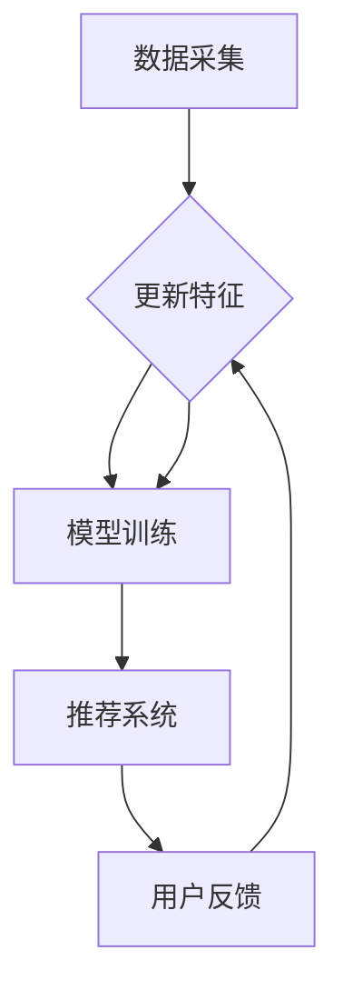
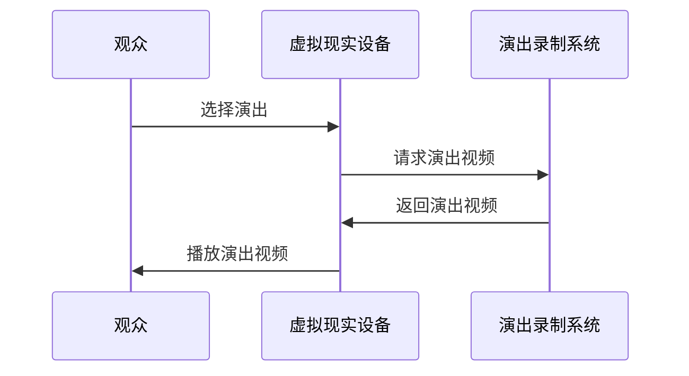
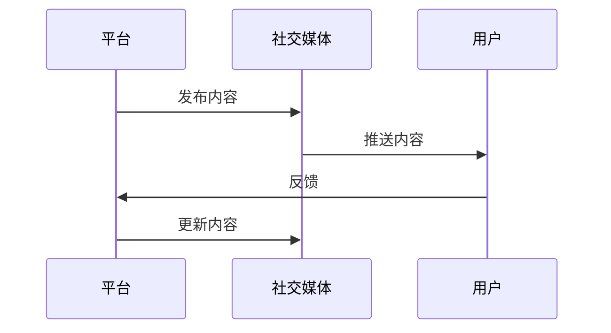

                 

# 新型城市街头艺人平台：数字时代的城市文化推广

关键词：街头艺人平台、数字时代、城市文化推广、人工智能、虚拟现实、社交媒体

摘要：本文探讨了数字时代下城市文化的变革，以及街头艺人平台在其中的作用和挑战。通过分析街头艺人平台的架构设计、用户角色与功能设计、数字技术整合、平台运营与推广策略，以及案例分析，本文提出了新型街头艺人平台建设与运营的最佳实践，为城市文化推广提供了新思路。

## 目录大纲设计

### 第一部分：问题背景与核心概念

#### 1.1 问题背景

##### 1.1.1 数字时代下城市文化的变革

##### 1.1.2 街头艺人平台的需求与挑战

##### 1.1.3 数字技术与城市文化推广的结合

#### 1.2 核心概念

##### 1.2.1 街头艺人平台

##### 1.2.2 数字时代城市文化推广

##### 1.2.3 关键技术与应用

### 第二部分：平台设计与实现

#### 2.1 平台架构设计

##### 2.1.1 系统需求分析

##### 2.1.2 平台架构设计

##### 2.1.3 技术选型

#### 2.2 用户角色与功能设计

##### 2.2.1 艺人用户

##### 2.2.2 组织管理用户

##### 2.2.3 普通观众用户

#### 2.3 数字技术整合

##### 2.3.1 人工智能在艺人筛选中的应用

##### 2.3.2 虚拟现实技术在演出体验中的应用

##### 2.3.3 社交媒体在推广中的作用

### 第三部分：平台运营与推广策略

#### 3.1 平台运营策略

##### 3.1.1 艺人培养与招募

##### 3.1.2 演出内容策划与推广

##### 3.1.3 用户互动与忠诚度提升

#### 3.2 数字营销手段

##### 3.2.1 社交媒体营销

##### 3.2.2 搜索引擎优化

##### 3.2.3 网络广告投放

#### 3.3 数据分析与反馈

##### 3.3.1 用户数据分析

##### 3.3.2 演出效果评估

##### 3.3.3 反馈机制与持续优化

### 第四部分：案例研究与实践

#### 4.1 国内外平台案例分析

##### 4.1.1 国内外知名街头艺人平台介绍

##### 4.1.2 平台特色与成功经验

##### 4.1.3 平台面临的挑战与应对策略

#### 4.2 实践指导与建议

##### 4.2.1 新型街头艺人平台建设实践

##### 4.2.2 平台运营策略实践

##### 4.2.3 数字营销实战技巧

#### 4.3 项目评估与前景展望

##### 4.3.1 平台经济效益分析

##### 4.3.2 城市文化推广效果评估

##### 4.3.3 未来发展趋势与展望

### 第五部分：总结与展望

#### 5.1 本书内容总结

#### 5.2 平台发展面临的问题与对策

#### 5.3 未来研究方向与展望

### 附录

#### 附录A：参考资料

#### 附录B：名词解释

#### 附录C：相关法规与政策

---

## 第一部分：问题背景与核心概念

### 1.1 问题背景

#### 1.1.1 数字时代下城市文化的变革

随着互联网和数字技术的飞速发展，城市文化的传播和推广方式发生了巨大的变革。传统城市文化主要依赖于实体场所和文化活动，而数字时代下的城市文化则更多地依赖于线上平台和数字媒介。这种变革不仅改变了文化传播的方式，也带来了新的挑战和机遇。

首先，数字技术的普及使得城市文化的传播速度大幅提升。通过社交媒体、在线直播、短视频平台等，文化内容可以迅速传播到全球各地。其次，数字技术为城市文化创新提供了丰富的工具和手段。虚拟现实（VR）、增强现实（AR）、人工智能（AI）等技术的应用，使得文化体验更加多元化和沉浸式。

然而，数字时代下城市文化推广也面临着一系列挑战。例如，如何确保优质文化内容的输出和传播，如何处理数字鸿沟带来的不公平现象，以及如何保护文化多样性和原创性等。

#### 1.1.2 街头艺人平台的需求与挑战

街头艺人作为城市文化的重要组成部分，其生存与发展面临诸多挑战。首先，街头艺人的数量庞大，但专业水平参差不齐，如何选拔和培养优质艺人成为一个重要问题。其次，街头艺人的表演地点和时段受限，难以吸引到足够的观众，导致收入不稳定。

为了解决这些问题，街头艺人平台应运而生。街头艺人平台通过线上平台，为艺人提供一个展示自己才华的舞台，同时为观众提供丰富的文化体验。然而，街头艺人平台在数字时代下也面临一系列挑战，如技术门槛、市场定位、用户留存等。

#### 1.1.3 数字技术与城市文化推广的结合

数字技术与城市文化推广的结合，为解决上述问题提供了新的思路和手段。例如，人工智能技术可以用于艺人筛选和推荐，提高文化内容的质量和匹配度。虚拟现实技术可以提供沉浸式的文化体验，增强观众的参与感和互动性。

此外，社交媒体平台和搜索引擎优化等数字营销手段，也为城市文化推广提供了广泛的传播渠道。通过这些手段，城市文化可以更加精准地触达目标用户，提高品牌影响力和用户忠诚度。

### 1.2 核心概念

#### 1.2.1 街头艺人平台

街头艺人平台是一个在线平台，用于展示和推广街头艺人的表演艺术。平台通常提供以下功能：

- 艺人注册和资料上传
- 艺人表演视频和音频上传
- 演出预约和售票
- 用户评价和互动

#### 1.2.2 数字时代城市文化推广

数字时代城市文化推广是指在数字技术和媒介的支持下，对城市文化进行传播和推广。主要手段包括：

- 社交媒体营销
- 在线直播和短视频
- 搜索引擎优化
- 人工智能推荐

#### 1.2.3 关键技术与应用

关键技术包括人工智能、虚拟现实、增强现实、大数据分析等。这些技术在不同场景中的应用如下：

- 人工智能：用于艺人筛选、内容推荐和用户行为分析
- 虚拟现实：用于提供沉浸式的文化体验
- 增强现实：用于增强现实场景下的文化展示
- 大数据分析：用于分析用户行为和偏好，优化推广策略

## 第二部分：平台设计与实现

### 2.1 平台架构设计

#### 2.1.1 系统需求分析

在设计和实现街头艺人平台之前，我们需要对系统需求进行详细分析。系统需求分析主要包括以下方面：

- 用户需求：包括艺人注册、演出预约、演出评价等功能。
- 艺人需求：包括表演上传、演出管理、收入统计等功能。
- 管理员需求：包括平台管理、数据统计、用户管理等功能。
- 技术需求：包括服务器配置、数据存储、安全防护等。

#### 2.1.2 平台架构设计

基于系统需求分析，街头艺人平台的架构设计可以分为以下几个层次：

- 表现层：包括前端页面和用户界面。
- 业务逻辑层：包括各种业务处理逻辑，如艺人管理、演出管理、用户管理等。
- 数据访问层：包括数据访问接口和数据存储。
- 数据库层：包括数据库设计和数据存储。

以下是平台架构的Mermaid类图：

```mermaid
classDiagram
    User <|-- Artisan
    User <|-- Admin
    Platform <..=> User
    Platform <..=> Artisan
    Platform <..=> Admin
    Platform ..|> Performance
    Performance ..|> Booking
    Performance ..|> Rating
    Booking ..|> Ticket
    Ticket ..|> Payment
    Admin ..|> DataStatistics
    Admin ..|> UserManager
    Artisan ..|> PerformanceManagement
    Artisan ..|> IncomeStatistics
    PerformanceManagement ..|> Upload
    PerformanceManagement ..|> Schedule
endclassDiagram
```

#### 2.1.3 技术选型

在平台架构设计的基础上，我们需要选择合适的技术栈来实现平台。以下是一些常见的技术选型：

- 前端技术：React、Vue.js、Angular等。
- 后端技术：Spring Boot、Django、Express等。
- 数据库：MySQL、PostgreSQL、MongoDB等。
- 人工智能：TensorFlow、PyTorch等。
- 虚拟现实：Unity、Unreal Engine等。
- 大数据分析：Hadoop、Spark等。

### 2.2 用户角色与功能设计

街头艺人平台涉及多个用户角色，包括艺人用户、组织管理用户和普通观众用户。以下是对每个用户角色的功能设计：

#### 2.2.1 艺人用户

- 注册与登录：艺人用户可以通过平台进行注册和登录。
- 资料管理：艺人用户可以上传和编辑个人资料，包括头像、姓名、简介等。
- 表演上传：艺人用户可以上传自己的表演视频和音频。
- 演出管理：艺人用户可以查看自己的演出安排，进行演出预约和取消。
- 收入统计：艺人用户可以查看自己的演出收入和统计数据。

#### 2.2.2 组织管理用户

- 平台管理：组织管理用户可以进行平台的管理和设置，如添加管理员、设置演出规则等。
- 数据统计：组织管理用户可以查看平台的统计数据，如用户数量、演出次数、收入等。
- 用户管理：组织管理用户可以查看和审核用户信息，对违规用户进行处理。

#### 2.2.3 普通观众用户

- 注册与登录：普通观众用户可以通过平台进行注册和登录。
- 演出浏览：普通观众用户可以浏览和搜索演出信息。
- 演出预约：普通观众用户可以预约演出，购买演出门票。
- 演出评价：普通观众用户可以对演出进行评价。

### 2.3 数字技术整合

数字技术整合是街头艺人平台的核心，以下介绍几种关键技术及其应用：

#### 2.3.1 人工智能在艺人筛选中的应用

人工智能技术可以用于艺人筛选和推荐。具体实现如下：

- 数据采集：收集艺人的表演视频、音频和用户评价等数据。
- 特征提取：对采集到的数据进行分析和提取，得到艺人的表演特征。
- 模型训练：使用机器学习算法，如神经网络，对艺人特征进行训练，建立推荐模型。
- 推荐系统：根据用户的偏好和历史行为，为用户推荐合适的艺人。

以下是推荐系统的Mermaid流程图：



#### 2.3.2 虚拟现实技术在演出体验中的应用

虚拟现实技术可以提供沉浸式的演出体验，具体实现如下：

- 演出录制：使用虚拟现实相机录制演出视频。
- 视频处理：对录制到的视频进行处理，生成虚拟现实内容。
- 观看体验：观众通过虚拟现实设备观看演出，获得沉浸式的体验。

以下是虚拟现实观看体验的Mermaid流程图：



#### 2.3.3 社交媒体在推广中的作用

社交媒体是推广街头艺人平台的重要渠道，具体策略如下：

- 内容发布：在社交媒体上发布演出信息、艺人介绍等内容。
- 互动互动：与用户进行互动，增加用户参与度。
- KOL合作：与意见领袖合作，扩大影响力。
- 广告投放：在社交媒体上进行精准广告投放。

以下是社交媒体推广的Mermaid流程图：



## 第三部分：平台运营与推广策略

### 3.1 平台运营策略

#### 3.1.1 艺人培养与招募

平台运营的首要任务是培养和招募优质艺人。具体策略如下：

- 选拔标准：制定明确的选拔标准，包括表演技巧、创新能力、个人形象等。
- 培训计划：为入选艺人提供培训计划，包括表演技巧、舞台经验、市场营销等。
- 招募渠道：通过线上广告、社交媒体、线下活动等方式招募艺人。

#### 3.1.2 演出内容策划与推广

演出内容是吸引观众的关键。平台需要制定合理的演出内容策划和推广策略：

- 演出主题：根据季节、节日、文化特色等制定演出主题。
- 演出形式：结合虚拟现实、增强现实等新技术，创新演出形式。
- 推广渠道：利用社交媒体、广告投放、线下活动等渠道进行推广。

#### 3.1.3 用户互动与忠诚度提升

用户互动和忠诚度提升是平台长期发展的关键。具体策略如下：

- 互动活动：定期举办线上互动活动，如直播互动、表演挑战等。
- 用户奖励：为活跃用户提供奖励，如积分兑换、优惠券等。
- 社区建设：建立用户社区，鼓励用户分享经验、交流心得。

### 3.2 数字营销手段

数字营销手段是提升平台知名度和用户参与度的重要手段。以下介绍几种常见的数字营销手段：

#### 3.2.1 社交媒体营销

社交媒体营销是当前最为流行的数字营销手段之一。具体策略如下：

- 内容发布：定期发布高质量的演出内容、艺人动态等。
- 互动互动：与用户进行互动，增加用户参与度。
- KOL合作：与意见领袖合作，扩大影响力。
- 广告投放：在社交媒体上进行精准广告投放。

#### 3.2.2 搜索引擎优化

搜索引擎优化（SEO）是一种提高网站在搜索引擎中排名的策略。具体策略如下：

- 关键词优化：选择合适的 keywords，提高网站在搜索结果中的排名。
- 内容优化：撰写高质量的内容，增加网站的用户体验和可读性。
- 外部链接：建立外部链接，提高网站的权威性和可信度。

#### 3.2.3 网络广告投放

网络广告投放是一种直接有效的数字营销手段。具体策略如下：

- 广告定位：根据用户画像和兴趣标签，精准定位广告受众。
- 广告形式：选择合适的广告形式，如横幅广告、视频广告、信息流广告等。
- 广告预算：合理分配广告预算，提高广告投放效果。

### 3.3 数据分析与反馈

数据分析是优化平台运营和用户体验的重要手段。以下介绍几种常见的数据分析方法和应用：

#### 3.3.1 用户数据分析

用户数据分析可以帮助平台了解用户的行为和偏好，优化用户体验。具体方法如下：

- 用户行为分析：分析用户在平台上的行为路径，了解用户的兴趣和需求。
- 用户画像：基于用户行为和偏好，建立用户画像，为个性化推荐和营销提供依据。
- 用户留存率分析：分析用户留存率，了解用户流失的原因，优化用户留存策略。

#### 3.3.2 演出效果评估

演出效果评估是衡量平台运营效果的重要指标。具体方法如下：

- 观众满意度调查：通过问卷调查了解观众对演出的满意度。
- 演出数据统计：分析演出门票销售情况、观众数量等数据，评估演出效果。
- 反馈机制：建立反馈机制，收集观众的反馈和建议，优化演出内容和形式。

#### 3.3.3 反馈机制与持续优化

反馈机制是持续优化平台运营的重要手段。具体策略如下：

- 用户反馈收集：建立用户反馈渠道，收集用户对平台运营和服务的反馈。
- 反馈分析：对用户反馈进行分析，识别问题和改进方向。
- 持续优化：根据用户反馈，持续优化平台功能和用户体验。

## 第四部分：案例研究与实践

### 4.1 国内外平台案例分析

#### 4.1.1 国内外知名街头艺人平台介绍

国内知名街头艺人平台包括**街演宝**、**演出猫**等。这些平台以线上平台为基础，为艺人提供展示和推广机会，同时为观众提供丰富的文化体验。

国外知名街头艺人平台包括**Street Performers of New York**、**Bristol Street Artists**等。这些平台通过线上直播、短视频等手段，推广街头艺人的表演艺术，吸引了大量观众。

#### 4.1.2 平台特色与成功经验

国内街头艺人平台**街演宝**的成功经验包括：

- 丰富的演出类型：涵盖音乐、舞蹈、魔术等多种表演形式，满足观众多样化的需求。
- 创新的演出形式：结合虚拟现实、增强现实等新技术，提供沉浸式的演出体验。
- 严格的艺人选拔：制定明确的选拔标准，确保艺人质量。
- 强大的用户互动：通过线上互动活动、用户评价等方式，增强用户参与感。

国外街头艺人平台**Bristol Street Artists**的成功经验包括：

- 多元化的演出地点：在街头、公园、博物馆等不同地点举办演出，丰富演出场景。
- 国际化的艺人资源：吸引全球范围内的街头艺人，提升演出质量。
- 专业的演出策划：结合当地文化特色，策划具有吸引力的演出内容。
- 精准的营销推广：利用社交媒体、广告投放等手段，扩大平台影响力。

#### 4.1.3 平台面临的挑战与应对策略

国内街头艺人平台面临的挑战包括：

- 市场竞争激烈：随着街头艺人平台的增多，市场竞争日益激烈。
- 艺人质量参差不齐：如何确保艺人的表演质量和创新能力，是平台面临的一大挑战。
- 用户需求变化：随着用户需求的不断变化，平台需要不断调整和优化功能和服务。

应对策略包括：

- 持续创新：通过引入新技术、新模式，提升平台的竞争力。
- 优化艺人筛选机制：制定更严格的选拔标准，确保艺人质量。
- 深入了解用户需求：通过数据分析、用户调研等方式，深入了解用户需求，优化用户体验。

国外街头艺人平台面临的挑战包括：

- 文化和政策限制：不同国家和地区的文化和政策限制，对街头艺人平台的运营产生影响。
- 演出环境和安全：如何在保证演出质量和安全的前提下，提供多样化的演出场景。
- 国际化运营：如何在全球范围内推广平台，吸引更多用户和艺人。

应对策略包括：

- 与当地文化和政策保持一致：了解和遵守当地文化和政策，确保平台合法运营。
- 精细化运营：根据不同地区的用户需求和文化特点，提供定制化的演出内容。
- 国际化团队：组建国际化团队，负责全球范围内的市场推广和运营。

### 4.2 实践指导与建议

#### 4.2.1 新型街头艺人平台建设实践

新型街头艺人平台建设需要考虑以下几个方面：

- 明确目标用户：了解目标用户的需求和偏好，为平台设计和功能提供依据。
- 技术选型：根据平台需求，选择合适的技术栈，确保平台的高性能和稳定性。
- 系统设计：制定合理的系统架构和功能设计，确保平台的可扩展性和灵活性。
- 数据安全和隐私保护：制定数据安全和隐私保护策略，确保用户数据的安全和隐私。

#### 4.2.2 平台运营策略实践

平台运营策略主要包括以下几个方面：

- 艺人培养与招募：制定艺人培养计划，确保艺人质量。通过多种渠道招募艺人，扩大艺人资源。
- 演出内容策划：结合季节、节日等要素，制定多样化的演出内容。引入新技术，提升演出体验。
- 用户互动与忠诚度提升：举办互动活动，增加用户参与感。通过用户奖励、社区建设等方式，提升用户忠诚度。
- 数字营销：利用社交媒体、搜索引擎优化等手段，扩大平台影响力。

#### 4.2.3 数字营销实战技巧

数字营销实战技巧包括以下几个方面：

- 内容营销：发布高质量的演出内容、艺人介绍等，吸引观众关注。
- 社交媒体营销：与用户进行互动，增加用户参与度。与意见领袖合作，扩大影响力。
- 搜索引擎优化：选择合适的 keywords，提高网站在搜索引擎中的排名。
- 广告投放：根据用户画像和兴趣标签，精准定位广告受众。合理分配广告预算，提高广告投放效果。

### 4.3 项目评估与前景展望

#### 4.3.1 平台经济效益分析

平台的经济效益分析主要包括以下几个方面：

- 收入来源：平台的主要收入来源包括演出门票销售、广告收入、用户付费等。
- 成本构成：平台的成本主要包括服务器租赁、人员工资、市场营销等。
- 盈利模式：通过提高演出质量和用户满意度，增加收入来源。通过广告投放、用户付费等方式，实现盈利。

#### 4.3.2 城市文化推广效果评估

城市文化推广效果评估主要包括以下几个方面：

- 观众满意度：通过观众满意度调查，了解观众对演出和平台的满意度。
- 品牌影响力：通过社交媒体、广告投放等手段，提高平台在公众中的认知度和影响力。
- 演出效果：通过演出数据统计，分析演出效果，如观众数量、演出收入等。

#### 4.3.3 未来发展趋势与展望

未来发展趋势与展望主要包括以下几个方面：

- 技术创新：随着新技术的发展，街头艺人平台将不断创新，提升用户体验。
- 线上线下融合：街头艺人平台将结合线上线下资源，提供更加多元化的演出形式和体验。
- 国际化发展：街头艺人平台将向全球范围扩展，吸引更多用户和艺人，提升国际影响力。

## 第五部分：总结与展望

### 5.1 本书内容总结

本书从问题背景、核心概念、平台设计与实现、平台运营与推广策略、案例研究与实践、项目评估与前景展望等方面，系统地介绍了新型城市街头艺人平台的建设与运营。通过分析数字时代城市文化的变革、街头艺人平台的需求与挑战、数字技术整合、平台运营策略、数字营销手段以及案例分析，本书提出了新型街头艺人平台建设与运营的最佳实践，为城市文化推广提供了新思路。

### 5.2 平台发展面临的问题与对策

平台发展面临的主要问题包括市场竞争、艺人质量、用户需求变化等。针对这些问题，平台可以采取以下对策：

- 持续创新：通过引入新技术、新模式，提升平台的竞争力。
- 优化艺人筛选机制：制定更严格的选拔标准，确保艺人质量。
- 深入了解用户需求：通过数据分析、用户调研等方式，深入了解用户需求，优化用户体验。

### 5.3 未来研究方向与展望

未来研究方向与展望主要包括以下几个方面：

- 新技术的应用：研究如何更好地利用人工智能、虚拟现实等新技术，提升平台性能和用户体验。
- 线上线下融合：研究如何实现线上线下资源的整合，提供更加多元化的演出形式和体验。
- 国际化发展：研究如何拓展国际市场，提升平台在国际上的影响力。

### 附录

#### 附录A：参考资料

- 《人工智能：一种现代方法》
- 《虚拟现实技术与应用》
- 《社交媒体营销：策略与实践》
- 《搜索引擎优化：策略与技巧》

#### 附录B：名词解释

- 街头艺人平台：在线平台，用于展示和推广街头艺人的表演艺术。
- 数字时代城市文化推广：利用数字技术和媒介对城市文化进行传播和推广。
- 人工智能：模拟人类智能的计算机系统。

#### 附录C：相关法规与政策

- 《中华人民共和国网络安全法》
- 《中华人民共和国文化产业发展

