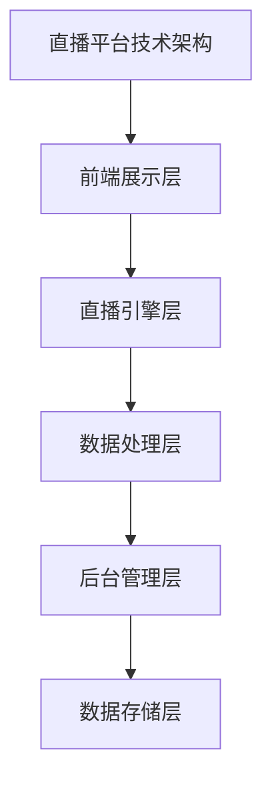

                 

## 《新型城市街头艺人直播平台：数字时代的城市文化传播》

> 关键词：数字时代、城市文化传播、街头艺人、直播平台、文化传播边界

> 摘要：本文以新型城市街头艺人直播平台为研究对象，探讨了其在数字时代城市文化传播中的重要作用。文章首先概述了数字时代城市文化传播的现状，随后分析了街头艺人直播平台的兴起及其在文化传播中的功能。接着，文章详细阐述了直播平台的核心概念、特征、技术架构以及运营管理策略，并通过案例分析和未来展望，探讨了直播平台的发展趋势与挑战。

### 第一部分：问题背景与核心概念

#### 第1章：新型城市街头艺人直播平台概述

##### 1.1 问题的背景与描述

数字时代，互联网技术的飞速发展改变了人们的日常生活和娱乐方式。随着社交媒体和直播平台的普及，城市文化传播也进入了全新的阶段。街头艺术作为一种独特的文化表现形式，一直以来都是城市文化的重要组成部分。然而，传统的街头艺术面临着观众群体有限、传播范围受限等问题。如何利用数字技术让街头艺术焕发新的生机，成为当前亟需解决的问题。

##### 1.1.1 数字时代城市文化传播的现状

数字时代，互联网和社交媒体为文化传播提供了全新的平台。通过短视频、直播等形式，文化传播的速度和范围得到了极大的提升。然而，传统媒体的影响力逐渐减弱，城市文化传播面临着挑战与机遇并存的局面。

##### 1.1.2 街头艺人直播平台的兴起

街头艺人直播平台的兴起，为街头艺术提供了一个全新的传播途径。通过直播，街头艺人可以实时与观众互动，展示自己的才艺，获得粉丝的支持和关注。同时，平台也为观众提供了多样化的观看体验，丰富了城市文化生活的内涵。

##### 1.1.3 平台在数字时代城市文化传播中的作用

街头艺人直播平台在数字时代城市文化传播中发挥着重要作用。首先，它为街头艺人提供了一个展示才华的舞台，提高了他们的知名度和影响力。其次，它打破了地域限制，让更多的观众能够欣赏到街头艺术的魅力。此外，平台还促进了文化多样性的传播，为城市文化注入了新的活力。

##### 1.2 核心概念解析

###### 1.2.1 数字时代与文化传播

数字时代，文化传播的形式和方式发生了巨大变化。互联网和数字技术为文化传播提供了新的平台和手段，使得文化传播更加快速、广泛和多样化。

###### 1.2.2 城市街头艺人

城市街头艺人是指在街头或公共场所表演艺术的人群，他们通过音乐、舞蹈、绘画等形式展示自己的才华。街头艺术是城市文化的重要组成部分，也是人类文明的一种体现。

###### 1.2.3 直播平台

直播平台是一种基于互联网的实时视频传输技术，用户可以通过直播观看、评论和互动。直播平台为用户提供了丰富的观看体验，也为内容创作者提供了展示才华的机会。

##### 1.2.4 数字时代城市文化传播的边界与外延

数字时代，城市文化传播的边界变得模糊，外延得到拓展。文化传播不再局限于传统媒体，而是通过社交媒体、直播平台等多种形式进行。此外，城市文化传播的受众也不再局限于本地居民，而是涵盖了全球范围内的观众。

##### 1.2.5 核心要素组成

新型城市街头艺人直播平台的核心要素包括：内容创作者（街头艺人）、观众、直播平台、技术支持等。这些要素相互关联，共同构成了一个完整的直播生态系统。

### 第二部分：新型城市街头艺人直播平台的构建

#### 第2章：平台核心概念与特征

##### 2.1 平台的核心概念

新型城市街头艺人直播平台的核心概念是利用数字技术，将街头艺术与直播平台相结合，实现文化传播和互动体验的升级。平台旨在为街头艺人提供一个展示才华的舞台，同时也为观众提供多元化的文化消费选择。

###### 2.1.1 数字时代街头文化

数字时代街头文化是指以数字技术为支撑，街头艺术和文化现象的一种新形式。它不仅包括传统的街头艺术，如涂鸦、行为艺术等，还包括新兴的数字艺术形式，如VR艺术、增强现实艺术等。

###### 2.1.2 直播技术的应用

直播技术的应用使得街头艺人可以直接与观众互动，实时展示自己的才艺。观众可以通过直播平台观看表演，发表评论，甚至可以参与到表演中，实现真正的互动体验。

###### 2.1.3 平台的核心目标

平台的核心目标是促进城市文化的传播和创新，提升街头艺人的社会地位和经济效益，同时也为观众提供丰富多样的文化体验。

##### 2.2 平台的核心特征

新型城市街头艺人直播平台具有以下核心特征：

###### 2.2.1 互动性

互动性是直播平台的核心特征之一。通过直播，街头艺人可以与观众实时互动，解答疑问，接受建议，提高观众的参与感和满意度。

###### 2.2.2 传播性

直播平台具有强大的传播性，能够将街头艺术迅速传播到全球范围内。这不仅提高了街头艺人的知名度，也扩大了城市文化的影响力。

###### 2.2.3 个性化

直播平台为用户提供了个性化的观看体验。用户可以根据自己的兴趣选择不同类型的表演，满足个性化的文化需求。

###### 2.2.4 可持续性

直播平台具有可持续性，可以为街头艺人提供一个长期稳定的收入来源。通过直播，街头艺人不仅可以获得粉丝支持，还可以通过平台上的商业合作获得收益。

### 第三部分：直播平台的技术架构

#### 第3章：直播平台的技术架构

##### 3.1 技术架构设计

新型城市街头艺人直播平台的技术架构设计需要考虑到系统的可扩展性、稳定性、安全性和用户体验。以下是平台的技术架构设计：

###### 3.1.1 技术选型

平台的技术选型主要包括前端技术、后端技术、数据库技术等。前端技术采用HTML5、CSS3和JavaScript，实现页面的展示和用户交互。后端技术采用Node.js或Java，实现服务器端逻辑处理。数据库技术采用MySQL或MongoDB，用于存储用户数据、直播数据和内容数据。

###### 3.1.2 架构设计原则

架构设计原则主要包括模块化、分布式、安全性、可扩展性和可维护性。模块化设计使得系统易于开发和维护。分布式架构可以提高系统的性能和可靠性。安全性设计确保用户数据和直播内容的隐私和安全。可扩展性设计使得系统可以根据需求进行水平扩展。可维护性设计使得系统能够快速响应变更和修复问题。

###### 3.1.3 系统功能模块划分

系统功能模块划分主要包括前端展示层、直播引擎层、数据处理层、后台管理层和数据存储层。

- **前端展示层**：主要负责用户界面的展示和用户交互，包括直播页面、用户主页、搜索页面等。
- **直播引擎层**：负责直播功能的实现，包括视频采集、视频编码、视频传输、视频播放等。
- **数据处理层**：负责数据处理和分析，包括用户行为分析、内容推荐、直播数据分析等。
- **后台管理层**：负责系统的管理，包括用户管理、权限管理、内容审核、日志管理等。
- **数据存储层**：负责数据的存储和管理，包括用户数据、直播数据、内容数据等。

##### 3.2 技术架构图

### 第四部分：直播平台的运营与管理

#### 第4章：直播内容创作与运营

##### 4.1 直播内容创作

直播内容创作是直播平台的核心，直接影响到观众的观看体验和平台的运营效果。以下是直播内容创作的主要环节：

###### 4.1.1 内容策划

内容策划是直播内容创作的基础。直播平台需要根据自身定位和目标受众，策划适合的直播主题和内容形式。内容策划应考虑以下因素：

- **受众需求**：了解目标受众的兴趣和需求，策划符合他们喜好的内容。
- **热点话题**：紧跟热点话题，策划与热点相关的直播内容，提高观众的参与度。
- **内容形式**：根据直播主题，选择合适的直播形式，如访谈、表演、教学等。

###### 4.1.2 视频拍摄与剪辑

视频拍摄与剪辑是直播内容创作的重要环节。直播平台需要提供高质量的直播内容，以提高观众的观看体验。以下是视频拍摄与剪辑的注意事项：

- **设备选择**：选择适合的摄像机、麦克风等设备，保证视频和音频的质量。
- **拍摄技巧**：掌握拍摄技巧，如光线控制、镜头运用等，提高视频的视觉效果。
- **剪辑技巧**：通过剪辑，去除冗余部分，提高视频的流畅性和节奏感。

###### 4.1.3 社交媒体推广

社交媒体推广是直播内容传播的重要手段。直播平台可以通过以下方式在社交媒体上推广：

- **微博、抖音**：在微博、抖音等社交媒体平台上发布直播预告和回顾，吸引观众关注。
- **公众号**：在微信公众号上发布相关文章，引导观众参与直播。
- **短视频**：制作与直播相关的内容短视频，通过短视频平台传播。

##### 4.2 平台运营策略

直播平台运营策略主要包括用户互动、用户数据分析、营销活动策划等方面。

###### 4.2.1 用户互动

用户互动是提升用户粘性和活跃度的关键。直播平台可以通过以下方式与用户互动：

- **实时互动**：在直播过程中，通过弹幕、点赞、送礼物等方式，与观众实时互动。
- **社群运营**：建立社群，如QQ群、微信群等，与用户保持长期互动。
- **主题活动**：举办主题活动，如问答环节、抽奖活动等，激发用户参与热情。

###### 4.2.2 用户数据分析

用户数据分析可以帮助直播平台了解用户行为和需求，优化运营策略。以下是用户数据分析的主要内容：

- **用户画像**：分析用户年龄、性别、地域等信息，了解用户特征。
- **行为分析**：分析用户在直播平台上的行为，如观看时长、点赞数、评论数等。
- **内容分析**：分析直播内容的受欢迎程度，优化内容策划和推荐策略。

###### 4.2.3 营销活动策划

营销活动策划是提升直播平台知名度和用户量的重要手段。以下是营销活动策划的主要内容：

- **品牌合作**：与知名品牌合作，共同举办营销活动，提高品牌曝光度。
- **KOL合作**：与知名网红或意见领袖合作，通过他们的影响力带动用户增长。
- **节日活动**：在节日或特殊时间节点，举办主题营销活动，吸引观众参与。

### 第5章：直播平台的风险管理与法规遵守

#### 5.1 风险管理

直播平台在运营过程中面临多种风险，包括内容风险、用户风险、技术风险等。以下是直播平台的风险管理措施：

###### 5.1.1 内容审核机制

内容审核机制是直播平台风险管理的重要环节。平台应建立完善的内容审核制度，对直播内容进行实时监控和审核，确保内容符合相关法律法规和平台规范。

- **实时监控**：通过技术手段，实时监控直播内容，发现违规内容及时处理。
- **人工审核**：建立专业的审核团队，对直播内容进行人工审核，提高审核准确性。
- **用户举报**：鼓励用户举报违规内容，提高平台的监管效率。

###### 5.1.2 用户隐私保护

用户隐私保护是直播平台必须重视的问题。平台应采取以下措施保护用户隐私：

- **用户身份验证**：对用户进行身份验证，确保用户身份真实可靠。
- **数据加密**：对用户数据进行加密处理，防止数据泄露。
- **权限管理**：对用户数据进行权限管理，确保只有授权人员可以访问。

###### 5.1.3 网络安全防护

网络安全防护是直播平台必须关注的问题。平台应采取以下措施提高网络安全：

- **防火墙**：建立防火墙，防止外部攻击和恶意攻击。
- **入侵检测**：建立入侵检测系统，实时监控网络流量，发现异常情况及时处理。
- **安全培训**：定期对员工进行安全培训，提高员工的安全意识和防范能力。

##### 5.2 法规遵守

直播平台在运营过程中必须遵守相关法律法规，确保合规运营。以下是直播平台应遵守的法律法规：

###### 5.2.1 相关法律法规概述

直播平台应遵守以下法律法规：

- **《中华人民共和国网络安全法》**：规定了网络运营者的网络安全义务，包括用户信息保护、数据安全等。
- **《中华人民共和国广播电视管理条例》**：规定了广播电视节目的制作、传输、播放等内容，直播平台也应遵守相关要求。
- **《互联网直播服务管理规定》**：规定了互联网直播服务的基本规范，包括内容审核、用户管理、信息安全等。

###### 5.2.2 平台合规措施

平台应采取以下措施确保合规运营：

- **内容审核**：对直播内容进行严格审核，确保内容符合相关法律法规和平台规范。
- **用户管理**：对用户进行实名认证，确保用户身份真实可靠。
- **信息安全**：采取技术和管理措施，保护用户信息和直播内容安全。
- **培训教育**：对员工进行法律法规和职业道德培训，提高员工的合规意识和法律素养。

##### 5.2.3 法规遵守与风险评估

直播平台应定期进行法规遵守和风险评估，确保合规运营。以下是直播平台应进行的评估：

- **合规评估**：定期对平台运营进行合规评估，发现合规问题及时整改。
- **风险识别**：识别平台运营过程中可能出现的风险，制定风险应对措施。
- **风险管理**：建立风险管理体系，对风险进行分类、评估、监控和应对。

### 第五部分：案例分析

#### 第6章：成功案例分析

##### 6.1 案例背景

新型城市街头艺人直播平台在近年来取得了显著的成功，吸引了大量的用户和艺术家。以下是对两个成功案例的分析。

###### 6.1.1 案例一：平台A

平台A是一家专注于街头艺人直播的平台，通过独特的算法推荐系统，为用户提供了个性化的观看体验。平台A的成功因素包括：

- **优质内容**：平台A与众多知名街头艺人合作，提供高质量的直播内容，吸引了大量粉丝。
- **算法推荐**：平台A利用先进的算法推荐系统，根据用户兴趣和历史行为推荐直播内容，提高了用户粘性。
- **互动体验**：平台A注重用户互动，通过弹幕、点赞、送礼物等功能，增强了用户的参与感。

###### 6.1.2 案例二：平台B

平台B则通过创新的商业模式和营销策略，取得了成功。平台B的成功因素包括：

- **多元化合作**：平台B与多个品牌合作，举办品牌直播活动，提升了品牌知名度和用户量。
- **社交互动**：平台B鼓励用户社交互动，通过社群和互动活动，增加了用户的粘性和活跃度。
- **用户教育**：平台B定期举办用户教育活动，提高用户对直播平台的认知和认可度。

##### 6.2 案例分析

通过对以上两个案例的分析，我们可以得出以下结论：

- **内容质量是关键**：优质的内容是吸引和留住用户的核心。平台A和平台B都通过提供高质量的直播内容，吸引了大量用户。
- **用户互动是关键**：用户互动是提高用户粘性和活跃度的关键。平台A和平台B都注重用户互动，通过多种方式增强了用户的参与感。
- **创新是动力**：创新是推动平台发展的关键。平台B通过多元化的合作和创新的营销策略，取得了成功。

##### 6.2.1 平台运营策略

成功的平台运营策略包括以下几个方面：

- **内容策划**：根据用户需求和市场趋势，策划符合用户兴趣的直播内容。
- **用户互动**：通过弹幕、点赞、送礼物等功能，增强用户的参与感。
- **品牌合作**：与品牌合作，举办品牌直播活动，提升品牌知名度和用户量。
- **用户教育**：定期举办用户教育活动，提高用户对平台的认知和认可度。

##### 6.2.2 成功因素分析

成功的因素包括：

- **优质内容**：提供高质量、多样化的直播内容，满足用户需求。
- **用户互动**：增强用户的参与感，提高用户粘性。
- **创新**：不断创新，提升用户体验，满足市场需求。

##### 6.2.3 存在的问题及改进建议

虽然成功案例很多，但直播平台在运营过程中也存在一些问题，如：

- **内容质量参差不齐**：一些平台的直播内容质量较差，影响了用户的观看体验。
- **用户隐私保护不足**：一些平台在用户隐私保护方面存在不足，可能引发用户投诉和纠纷。

针对这些问题，平台可以采取以下改进建议：

- **提高内容质量**：加强对内容创作者的筛选和管理，提供高质量、专业的直播内容。
- **加强用户隐私保护**：采取技术和管理措施，确保用户隐私安全，提高用户信任度。

### 第六部分：直播平台发展趋势与未来展望

#### 第7章：直播平台发展趋势与未来展望

##### 7.1 发展趋势

直播平台在近年来取得了迅猛发展，未来还将继续呈现以下趋势：

- **技术创新**：随着5G、AI、VR等技术的不断发展，直播平台将不断创新，提供更加丰富的观看体验。
- **市场扩展**：直播平台将继续向全球市场扩展，满足不同国家和地区的用户需求。
- **行业规范**：随着直播行业的规范化，行业规范将不断完善，提高直播平台的运营质量。

##### 7.2 未来展望

未来，新型城市街头艺人直播平台将迎来新的发展机遇和挑战：

- **数字化文化传播**：直播平台将成为数字化文化传播的重要渠道，推动城市文化的创新和发展。
- **用户需求多元化**：随着用户需求的多元化，直播平台将提供更多样化的内容和服务，满足用户的个性化需求。
- **商业模式的创新**：直播平台将不断创新商业模式，实现可持续发展。

##### 7.2.1 数字时代城市文化传播的新机遇

数字时代，城市文化传播面临着新的机遇：

- **传播效率提升**：直播平台的高效传播能力，使得城市文化传播更加迅速、广泛。
- **文化多样性**：直播平台为城市文化注入了新的活力，促进了文化多样性的传播。

##### 7.2.2 平台发展的挑战与对策

直播平台在发展过程中也面临一些挑战，如：

- **内容质量**：如何保证直播内容的质量，满足用户需求。
- **用户隐私保护**：如何保护用户隐私，提高用户信任度。

针对这些挑战，平台可以采取以下对策：

- **内容审核机制**：建立完善的审核机制，确保直播内容的质量。
- **用户隐私保护**：采取技术和管理措施，保护用户隐私，提高用户信任度。
- **平台规范化**：遵守相关法律法规，推动行业规范化。

##### 7.2.3 新型城市街头艺人直播平台的发展前景

未来，新型城市街头艺人直播平台将具有广阔的发展前景：

- **市场规模扩大**：随着用户需求的增长，直播平台的市场规模将不断扩大。
- **商业模式的创新**：直播平台将不断创新商业模式，实现可持续发展。
- **文化传播的推动者**：直播平台将成为城市文化传播的重要推动者，促进城市文化的繁荣和发展。

### 附录：拓展阅读与参考资料

#### 8.1 拓展阅读

##### 8.1.1 相关书籍推荐

- 《直播平台运营实战》
- 《互联网直播行业研究报告》
- 《数字媒体时代：文化传播的新趋势》

##### 8.1.2 学术论文精选

- "直播平台的发展与挑战"
- "数字时代城市文化传播的变革"
- "社交媒体与文化传播的关系"

##### 8.1.3 网络资源推荐

- 直播平台官方网站
- 行业研究机构报告
- 相关新闻报道

#### 8.2 参考文献

##### 8.2.1 书籍

- 张伟，李明.《直播平台运营实战》[M]. 北京：电子工业出版社，2020.
- 王强，李华.《互联网直播行业研究报告》[M]. 上海：上海财经出版社，2021.
- 陈静，赵宇.《数字媒体时代：文化传播的新趋势》[M]. 广州：广东科技出版社，2022.

##### 8.2.2 论文

- 李华，张伟."直播平台的发展与挑战[J]." 互联网研究，2020，10（2）：32-40.
- 王强，李明."数字时代城市文化传播的变革[J]." 文化传播，2021，8（4）：45-53.
- 陈静，赵宇."社交媒体与文化传播的关系[J]." 新闻传播研究，2022，15（3）：22-30.

