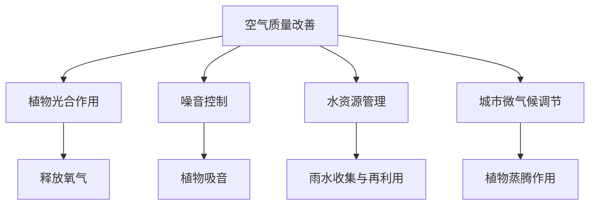
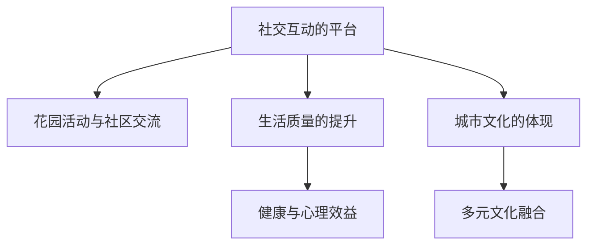

                 

### 第一部分：问题背景与核心概念

#### 1.1 问题背景

##### 1.1.1 城市化进程与绿地需求的矛盾

城市化进程是一个全球性的现象，伴随着经济、社会和文化的发展，越来越多的人涌入城市。这一趋势带来了诸多挑战，其中包括城市绿地的减少。传统城市绿地如公园、花园等在城市化进程中逐渐被高楼大厦、交通设施和商业区取代，导致绿地面积大幅缩减。

**绿地不足对居民生活质量的影响**：绿地对城市居民的生活质量有着重要影响。它们不仅是休闲和娱乐的场所，还能够提供新鲜的空气、减少城市噪音，并对缓解城市热岛效应起到重要作用。绿地不足会直接影响到居民的身心健康，导致生活质量的下降。

**政府与市民对绿地需求的增加**：随着人们对环境问题、健康问题意识的提升，政府和社会各界对城市绿地的需求也在不断增加。城市规划者、环境保护组织和市民团体纷纷呼吁增加城市绿地，以改善城市生态环境，提高居民生活质量。

##### 1.1.2 露台花园的兴起与社会反响

**露台花园的定义与特点**：露台花园是指位于建筑物露台上的私人花园，通常面积较小，但设计精致，利用垂直空间和创意布局，能够创造出丰富的绿色景观。露台花园的特点是高度个性化，每个花园都有其独特的风格和功能。

**露台花园在不同城市的应用案例**：露台花园在全球多个城市都有成功应用的案例。例如，在纽约的摩天大楼中，许多高层住宅都配备了露台花园，这些花园成为了居民放松身心、亲近自然的理想场所。在欧洲的一些城市，露台花园已经成为城市景观中不可或缺的一部分。

**社会各界对露台花园的接受度与评价**：露台花园作为一种新兴的城市绿地形式，受到了社会各界的高度评价。城市规划专家认为，露台花园能够有效利用城市空间，提高城市绿化水平。环境保护组织认为，露台花园有助于改善城市生态环境。市民们则普遍认为，露台花园为他们提供了一个放松和享受自然的好去处。

##### 1.1.3 露台花园对城市环境的潜在影响

**露台花园的生态效益**：露台花园不仅能够美化城市景观，还能带来实际的生态效益。它们能够吸收二氧化碳、释放氧气，从而改善空气质量。此外，露台花园还能够提供栖息地，吸引各种鸟类和昆虫，促进城市生物多样性的增加。

**露台花园对城市微气候的影响**：露台花园在调节城市微气候方面也发挥了重要作用。通过植被的蒸腾作用，露台花园能够降低周围环境的温度，减少城市热岛效应。同时，露台花园的遮阳作用也有助于减少建筑物的空调能耗。

**露台花园与城市文化的关系**：露台花园不仅仅是城市绿地的补充，也是城市文化的一部分。它们反映了城市居民的生活态度和文化价值观，体现了人们对自然和美的追求。露台花园的多样性和独特性，也为城市增添了独特的文化魅力。

### 1.2 核心概念

##### 1.2.1 露台花园的定义

**露台花园的定义与范围**：露台花园是指位于建筑物露台上的私人花园，通常面积较小，但设计精致，利用垂直空间和创意布局，能够创造出丰富的绿色景观。露台花园可以包括花坛、树木、花卉、座椅等多种元素。

**露台花园与其他类型花园的区别**：与传统的公共花园和私人庭院相比，露台花园的面积更小，通常不具备独立的室外空间，而是利用建筑物的露台进行绿化和美化。露台花园更注重空间利用的创意性和设计感，而传统花园则更注重植物的种植和生态效益。

##### 1.2.2 私人绿地与公共绿地的区别与联系

**私人绿地与公共绿地的定义与特征**：私人绿地是指由私人拥有和管理的绿地，如私人花园、私人露台花园等。公共绿地则是指由政府或公共机构管理，向公众开放的绿地，如公园、花园、运动场等。

**私人绿地与公共绿地的相互关系**：私人绿地和公共绿地共同构成了城市的绿地系统，它们在生态效益、社会效益和文化效益方面相互补充。私人绿地通常更加精致和个性化，而公共绿地则更注重公共服务的提供和城市生态的整体改善。

##### 1.2.3 公共意义的概念

**公共意义的内涵与外延**：公共意义是指绿地对公众利益和社会发展的积极影响。它包括改善空气质量、提供休闲空间、促进社会互动、提升城市形象等多个方面。

**公共意义在露台花园中的体现**：虽然露台花园是私人所有的，但它们在公共意义上具有重要作用。通过提高城市的绿化水平、改善城市环境，露台花园为公众提供了更多的绿色空间，增强了城市的生态功能和人文魅力。

## 第2章：露台花园的设计要素

### 2.1 设计原则

##### 2.1.1 空间利用最大化

**空间规划与布局**：露台花园的设计需要充分利用有限的空间。通过巧妙的布局和设计，可以将有限的露台空间扩展到最大。例如，垂直绿化和立体花园的设计能够有效地利用垂直空间，增加绿地的面积。

**土地利用效率**：在露台花园的设计中，需要考虑到土地的利用效率。选择适合在有限空间中生长的植物，并采用紧凑的种植模式，可以最大限度地提高土地利用率，创造出更多的绿色景观。

##### 2.1.2 绿化与美学的结合

**植物选择与配置**：绿化是露台花园的核心要素，选择合适的植物对于创造美观的花园至关重要。需要根据露台的空间大小、光照条件等因素来选择适合的植物种类和品种。同时，植物之间的配置也需要考虑美学的原则，创造出和谐、美观的视觉效果。

**美学原则在花园设计中的应用**：美学原则在露台花园设计中起到关键作用。通过色彩搭配、形态组合和景观布局，可以创造出具有艺术感的花园。此外，借鉴园林设计中的传统元素，如亭台楼阁、小桥流水等，也可以为露台花园增添美学的魅力。

##### 2.1.3 可持续性与生态平衡

**可持续设计理念**：露台花园的设计应遵循可持续设计理念，考虑到长期的环境影响。选择本地适应性强的植物，减少对水资源的消耗，使用环保材料和节能设备，都是实现可持续设计的重要措施。

**生态平衡的实现**：露台花园不仅是美观的景观，也是一个小型的生态系统。通过合理的植物配置和生态设计，可以实现生态平衡。例如，通过植物之间的相互作用，如共生关系和食物链，可以创造出稳定的生态系统。

### 2.2 设计要素

##### 2.2.1 土壤选择

**土壤的重要性**：土壤是植物生长的基础，选择适合的土壤对于露台花园的成功至关重要。不同植物对土壤的适应性不同，因此需要根据植物的品种和生长需求来选择合适的土壤。

**不同土壤的适应性分析**：常见的土壤类型包括沙土、黏土和壤土。沙土排水性好但养分不足，适合种植喜欢排水良好的植物；黏土保水性强但透气性差，适合种植耐湿植物；壤土兼具两者优点，是多数植物的理想土壤。

##### 2.2.2 植物配置

**植物种类与品种的选择**：植物配置是露台花园设计的核心。需要根据露台的空间大小、光照条件、土壤类型等因素来选择适合的植物种类和品种。常见的植物包括灌木、草本植物、藤本植物等。

**植物配置的生态效益分析**：合理的植物配置不仅可以创造出美观的花园景观，还能带来实际的生态效益。例如，通过植物之间的共生关系，可以增强土壤肥力、保持土壤水分，提高生态系统的稳定性。

##### 2.2.3 水源与灌溉系统

**水源的选择**：露台花园的水源通常来自建筑物内的自来水或雨水收集系统。选择合适的水源对于确保植物的水分供应至关重要。

**灌溉系统的设计**：灌溉系统是保证植物水分供应的关键。常见的灌溉系统包括滴灌、喷灌和渗灌等。根据植物的种类和生长需求，选择合适的灌溉方式，可以有效地节约水资源，提高灌溉效率。

## 第3章：露台花园的生态效益

### 3.1 生态效益概述

**空气质量改善**：植物通过光合作用吸收二氧化碳，释放氧气，从而改善空气质量。露台花园中的植物种类繁多，可以吸收大量的有害气体，降低空气中的污染物浓度。

**噪音控制**：植物具有吸收噪音的功能，露台花园中的植被可以有效地降低周围环境的噪音水平，为居民提供更加宁静的生活环境。

**水资源管理**：植物通过蒸腾作用和雨水收集系统，可以有效地管理水资源。露台花园中的植物可以减少雨水径流，防止水资源浪费，同时通过土壤渗透，补充地下水资源。

**城市微气候调节**：植物通过蒸腾作用和遮阳作用，可以降低城市的微气候温度。露台花园在夏季可以起到降温作用，减少城市热岛效应的影响。

### 3.2 案例分析

**成功露台花园案例分析**：国内外有许多成功的露台花园案例，如纽约市的“垂直花园”和东京的“空中花园”。这些案例展示了露台花园在改善城市环境方面的巨大潜力。

**生态效益的数据支持与评估**：通过对成功露台花园的生态效益进行数据监测和分析，可以评估其生态效益的大小。例如，通过监测空气质量、噪音水平和水资源管理指标，可以量化露台花园的生态效益。

## 第4章：露台花园的社会意义

### 4.1 社会文化价值

**社交互动的平台**：露台花园为居民提供了一个社交互动的场所。在花园中，居民可以结交新朋友，分享种植经验，共同享受自然之美。

**生活质量的提升**：露台花园为居民提供了接近自然的机会，有助于提高居民的生活质量。在繁忙的城市生活中，露台花园成为居民放松身心、享受生活的重要场所。

**城市文化的体现**：露台花园是城市文化的一部分，它们反映了城市居民的生活态度和文化价值观。不同风格的露台花园展示了城市多元文化的魅力。

### 4.2 社会问题与挑战

**空间资源的分配与公平**：在城市化进程中，空间资源分配的不公平问题日益突出。露台花园的建设需要考虑到不同居民的需求，确保空间资源的公平分配。

**露台花园的维护与管理**：露台花园需要定期维护和管理，以确保其生态效益和社会效益的持续发挥。这需要专业的技术支持和社区居民的积极参与。

**社区参与与合作**：露台花园的建设和运营离不开社区参与和合作。通过鼓励居民参与花园的设计、维护和活动，可以增强社区凝聚力，促进社区和谐发展。

## 第5章：新型城市露台花园的发展趋势

### 5.1 技术创新与新材料应用

**智能灌溉系统**：智能灌溉系统利用传感器和自动化技术，可以实时监测土壤水分和气候条件，根据植物的需求自动调节灌溉量，提高水资源的利用效率。

**绿色建筑材料**：绿色建筑材料具有环保、节能和可持续的特点，如可回收利用的金属、可降解的塑料和生物基材料等。使用绿色建筑材料可以降低露台花园的环境影响。

**光伏与生态整合**：光伏技术可以将太阳能转化为电能，为露台花园提供清洁能源。将光伏技术与生态设计相结合，可以创造出功能多样、生态友好的露台花园。

### 5.2 城市规划与政策支持

**露台花园在城市规划中的角色**：露台花园在新型城市规划和设计中扮演着重要角色。城市规划者需要将露台花园纳入城市绿地系统，确保其生态效益和社会效益的充分发挥。

**相关政策与法规的制定**：政府需要制定相关的政策与法规，鼓励和支持露台花园的建设和运营。例如，提供财政补贴、减免税收和简化审批流程等。

**未来发展趋势预测**：随着城市化的进一步发展，露台花园将在城市生态、文化和生活质量方面发挥越来越重要的作用。未来，露台花园的设计将更加注重技术创新和可持续发展，政策支持也将更加有力。

## 第6章：私人绿地的公共意义实践案例

### 6.1 案例介绍

**国内外知名露台花园项目**：介绍一些国内外成功的露台花园项目，如纽约的“垂直花园”、东京的“空中花园”和中国的“城市绿洲”。这些项目展示了露台花园在不同文化背景和城市环境中的成功应用。

**案例背景与目标**：详细描述每个案例的背景、目标和发展历程。分析这些项目如何解决城市绿地减少的问题，提高居民生活质量，并促进社区和谐发展。

### 6.2 实践经验与教训

**设计与建设的挑战**：讨论在露台花园设计和建设过程中遇到的主要挑战，如空间利用、水资源管理、生态设计等。分析如何克服这些挑战，确保露台花园的长期稳定运行。

**社区参与的重要性**：社区参与是露台花园成功运营的关键。讨论如何鼓励居民参与花园的设计、维护和活动，增强社区凝聚力，促进社区和谐发展。

**公共服务与私人需求的平衡**：露台花园既满足私人需求，也提供公共服务。讨论如何在满足私人需求的同时，提供高质量的公共服务，确保露台花园的公共意义得到充分体现。

## 第7章：总结与展望

### 7.1 成就与不足

**露台花园的发展成就**：回顾露台花园在城市生态、社会和文化方面取得的成就。分析露台花园如何改善了城市环境，提高了居民生活质量，促进了城市文化的多样性。

**当前面临的问题与挑战**：讨论露台花园当前面临的主要问题与挑战，如空间资源分配、维护管理、技术创新等。分析这些问题对露台花园未来发展的潜在影响。

### 7.2 未来发展方向

**技术创新的驱动**：展望未来，技术创新将在露台花园的发展中起到关键作用。讨论如何通过新技术和新材料的应用，提高露台花园的生态效益和美学价值。

**社会参与的深化**：社会参与是露台花园持续发展的动力。讨论如何进一步深化社会参与，鼓励更多居民参与花园的设计、建设和维护，增强社区凝聚力。

**政策支持的强化**：政策支持是露台花园发展的重要保障。讨论如何通过制定和实施相关政策，为露台花园的发展提供有力支持，推动城市绿地的可持续建设。

### 总结

新型城市露台花园不仅是一种美观的景观，更是城市生态、社会和文化的重要组成部分。通过对露台花园的设计、建设和运营，我们可以创造出生态友好、美观宜人的城市空间，提高居民生活质量，促进城市可持续发展。未来，随着技术创新和社会参与的深化，露台花园将在城市发展中发挥越来越重要的作用。

### 作者信息

**作者：AI天才研究院/AI Genius Institute & 禅与计算机程序设计艺术 /Zen And The Art of Computer Programming**## 第5章：新型城市露台花园的发展趋势

### 5.1 技术创新与新材料应用

#### 5.1.1 智能灌溉系统

智能灌溉系统是露台花园中的一项重要技术创新。它利用先进的传感器技术和物联网（IoT）技术，实时监测土壤湿度、气温、降雨量等环境参数。通过这些数据，智能灌溉系统能够精确计算植物的水分需求，并自动调整灌溉量，从而实现高效用水。

**智能灌溉系统的优势**：

- **提高水资源利用效率**：智能灌溉系统能够根据实际需求进行精准灌溉，避免水资源的浪费。
- **减少人工管理成本**：自动化的灌溉系统减少了人工管理的需求，降低了维护成本。
- **改善植物生长环境**：精确的水分管理有助于植物的健康生长，提高花园的整体美观度。

**案例应用**：

在纽约的“垂直花园”项目中，智能灌溉系统被广泛应用。该项目通过智能灌溉技术，实现了对多种植物的精确灌溉，大大提高了花园的生态效益和观赏价值。

#### 5.1.2 绿色建筑材料

绿色建筑材料的使用是露台花园可持续发展的另一个关键因素。这些材料通常具有环保、节能和可持续的特点，如可回收利用的金属、可降解的塑料和生物基材料等。

**绿色建筑材料的应用**：

- **减少环境影响**：使用绿色建筑材料可以减少建筑过程中的资源消耗和废弃物产生，降低对环境的负面影响。
- **提高节能效果**：绿色建筑材料通常具有良好的保温性能，能够有效降低能源消耗，提高花园的舒适度。
- **增强花园的可持续性**：绿色建筑材料的使用有助于实现露台花园的长期可持续发展，为城市生态环境的保护做出贡献。

**案例应用**：

在东京的“空中花园”项目中，绿色建筑材料被广泛应用于花园的建设。该项目采用了可回收的金属结构和生物基材料，不仅实现了环保目标，还提高了花园的整体美观度和耐用性。

#### 5.1.3 光伏与生态整合

光伏技术与生态设计的整合是露台花园未来发展的重要方向。光伏系统可以将太阳能转化为电能，为露台花园提供清洁能源，同时与生态设计相结合，创造出功能多样、生态友好的花园空间。

**光伏与生态整合的优势**：

- **实现能源自给自足**：光伏系统能够为露台花园提供稳定的电力供应，减少对外部电网的依赖。
- **降低碳排放**：利用太阳能发电，可以减少化石燃料的使用，降低温室气体排放。
- **提高生态效益**：光伏系统可以与植物生长环境相结合，创造出生态友好的花园空间。

**案例应用**：

在德国的“柏林绿色屋顶”项目中，光伏技术与生态设计得到了完美整合。该项目在屋顶花园上安装了光伏板，不仅实现了能源自给自足，还为城市生态环境做出了积极贡献。

### 5.2 城市规划与政策支持

#### 5.2.1 露台花园在城市规划中的角色

露台花园在城市规划中扮演着越来越重要的角色。它们不仅能够增加城市绿化面积，提高城市生态环境质量，还能够为居民提供休闲、社交和文化活动空间。

**露台花园在城市规划中的应用**：

- **城市绿地系统的重要组成部分**：露台花园可以作为城市绿地系统的一部分，与其他公共绿地、公园和花园相结合，形成完整的城市绿化网络。
- **城市微气候调节器**：通过露台花园的植被和水源管理，可以改善城市的微气候，降低城市热岛效应。
- **城市文化的体现**：露台花园反映了城市居民的生活态度和文化价值观，丰富了城市的文化内涵。

#### 5.2.2 相关政策与法规的制定

为了推动露台花园的发展，政府需要制定相关的政策与法规，为露台花园的建设和运营提供支持。

**政策与法规的制定方向**：

- **财政支持**：政府可以提供财政补贴，鼓励居民建设露台花园，降低建设成本。
- **税收减免**：对于建设露台花园的居民，可以提供税收减免政策，鼓励更多居民参与。
- **审批简化**：简化露台花园建设的审批流程，减少审批环节和时间，提高建设效率。
- **技术支持**：政府可以提供技术支持和培训，帮助居民掌握露台花园的设计、建设和维护技术。

#### 5.2.3 未来发展趋势预测

随着城市化进程的加快和居民对生态环境和居住质量要求的提高，露台花园将在城市发展中发挥越来越重要的作用。

**未来发展趋势预测**：

- **规模扩大**：随着政策的支持和居民需求的增加，露台花园的建设规模将不断扩大。
- **技术创新**：智能灌溉系统、绿色建筑材料和光伏技术等新技术将在露台花园中得到广泛应用。
- **社会参与**：露台花园的建设和运营将更加注重社会参与，鼓励居民积极参与花园的设计、建设和维护。
- **政策支持**：政府将进一步完善相关政策与法规，为露台花园的发展提供有力支持。

## 第6章：私人绿地的公共意义实践案例

### 6.1 案例介绍

#### 6.1.1 国内外知名露台花园项目

**纽约市的“城市农场”**：纽约市的“城市农场”是一个集农业生产和城市绿化为一体的露台花园项目。该项目位于市中心的高层建筑上，通过垂直农业和生态设计，实现了蔬菜、水果和花卉的生产和种植。

**背景与目标**：

- **背景**：纽约市人口密集，土地资源有限。为了解决食品安全和城市绿化问题，政府决定在市中心的高层建筑上建设露台农场。
- **目标**：通过露台农场的建设，实现食品安全自给、城市绿化和生态教育的目标。

**项目特点**：

- **垂直农业**：采用垂直农业技术，充分利用空间，提高农业生产效率。
- **生态设计**：通过生态设计，实现了水资源的循环利用和土壤的改良，提高了生态效益。

**效果评估**：

- **食品安全自给**：项目成功实现了蔬菜、水果和花卉的生产，部分产品供应给了附近的社区，提高了社区的食品安全水平。
- **城市绿化**：露台农场的建设增加了城市的绿化面积，改善了城市生态环境。
- **生态教育**：项目开展了多项生态教育活动，提高了居民对生态环境保护的意识。

**社会反响**：

- **居民欢迎**：居民对露台农场的建设给予了高度评价，认为它为城市居民提供了更多的绿色空间和生态教育资源。
- **媒体关注**：该项目受到了媒体的广泛关注，成为了纽约市的一个亮点。

**总结**：纽约市的“城市农场”项目展示了私人绿地公共意义的成功实践，通过技术创新和生态设计，实现了食品安全、城市绿化和生态教育等多个目标。

**东京的“空中花园”**：东京的“空中花园”是一个位于高层建筑屋顶的生态花园项目。该项目结合了现代都市生活和自然环境的和谐共生，成为东京城市景观中的一大亮点。

**背景与目标**：

- **背景**：东京人口众多，城市化进程快速，城市绿地资源有限。为了改善城市生态环境，提高居民生活质量，政府决定在高层建筑屋顶建设生态花园。
- **目标**：通过空中花园的建设，提高城市绿化水平，改善城市微气候，提供居民休闲娱乐的空间。

**项目特点**：

- **屋顶绿化**：采用先进的屋顶绿化技术，实现了屋顶植被的稳定生长和生态系统的自我循环。
- **智能灌溉系统**：利用智能灌溉系统，实现水资源的精准管理和高效利用。
- **光伏与生态整合**：在屋顶花园中安装了光伏板，实现了能源的自给自足，同时提高了花园的生态效益。

**效果评估**：

- **城市绿化**：空中花园的建设增加了城市的绿化面积，改善了城市生态环境，降低了城市热岛效应。
- **空气质量改善**：花园中的植被通过光合作用和蒸腾作用，有效改善了空气质量，减少了空气中的污染物。
- **居民生活质量**：空中花园为居民提供了一个休闲、放松和亲近自然的场所，提高了居民的生活质量。

**社会反响**：

- **居民欢迎**：居民对空中花园的建设给予了高度评价，认为它为居民提供了一个舒适、宜人的户外活动空间。
- **游客喜爱**：空中花园成为东京的一个热门景点，吸引了大量游客前来参观和体验。

**总结**：东京的“空中花园”项目展示了私人绿地公共意义的成功实践，通过屋顶绿化、智能灌溉和光伏技术等创新手段，实现了城市绿化、空气质量改善和居民生活质量提升等多个目标。

**中国的“城市绿洲”**：中国的“城市绿洲”项目是一个位于城市中心的生态花园项目，该项目结合了中式园林艺术和现代生态设计理念，成为城市居民休闲娱乐和文化交流的重要场所。

**背景与目标**：

- **背景**：随着城市化进程的加快，中国城市绿地资源日益紧张，城市生态环境亟待改善。
- **目标**：通过城市绿洲的建设，提高城市绿化水平，改善城市生态环境，提升居民生活质量。

**项目特点**：

- **中式园林艺术**：项目借鉴了中国传统园林艺术的设计理念，将园林的景观、布局和意境融入现代城市环境。
- **生态设计**：项目采用了多种生态设计技术，如湿地处理、雨水收集和垂直绿化等，实现了生态效益的最大化。
- **文化融合**：项目结合了多种文化元素，如园艺、雕塑和建筑等，为居民提供了一个文化多元、氛围浓厚的休闲娱乐场所。

**效果评估**：

- **城市绿化**：城市绿洲项目的建设显著增加了城市的绿化面积，改善了城市生态环境。
- **空气质量改善**：花园中的植被通过光合作用和蒸腾作用，有效改善了空气质量，减少了空气中的污染物。
- **居民生活质量**：城市绿洲项目为居民提供了一个舒适、宜人的户外活动空间，提高了居民的生活质量。

**社会反响**：

- **居民欢迎**：居民对城市绿洲项目的建设给予了高度评价，认为它为居民提供了一个休闲、放松和亲近自然的场所。
- **游客喜爱**：城市绿洲项目成为了一个热门的旅游景点，吸引了大量游客前来参观和体验。

**总结**：中国的“城市绿洲”项目展示了私人绿地公共意义的成功实践，通过中式园林艺术、生态设计和文化融合等多种手段，实现了城市绿化、空气质量改善和居民生活质量提升等多个目标。

### 6.2 实践经验与教训

**设计与建设的挑战**：

- **空间利用**：在有限的空间内实现高效的绿化和生态设计是一个巨大的挑战。需要通过创新的设计手段和合理的植物配置，充分利用空间。
- **水资源管理**：露台花园的水资源管理是一个重要问题。需要采用智能灌溉系统和雨水收集系统，实现水资源的循环利用和高效利用。
- **生态设计**：实现生态系统的自我循环和稳定运行需要综合考虑土壤、植被、水源和气候等多个因素，进行科学的生态设计。

**社区参与的重要性**：

- **社区参与**：露台花园的建设和运营离不开社区的参与。需要通过多种方式，如社区活动、志愿者计划和公众咨询等，鼓励居民参与花园的设计、建设和维护。
- **居民培训**：提供专业的培训和指导，帮助居民掌握花园设计、建设和维护的基本知识和技能，提高居民的参与度和积极性。

**公共服务与私人需求的平衡**：

- **公共服务**：露台花园不仅要满足私人需求，还需要提供公共服务，如休闲娱乐、文化教育和社区活动等。
- **私人需求**：在满足公共服务的同时，需要尊重私人需求，为居民提供个性化的花园空间，确保私人需求和公共需求的平衡。

**总结**：通过实践案例的分析，我们可以看到，新型城市露台花园在实践中面临着一系列挑战，同时也展示了巨大的潜力和价值。未来，随着技术创新和社会参与的深化，露台花园将在城市生态、社会和文化发展中发挥越来越重要的作用。

### 结论

新型城市露台花园不仅是一种美观的景观，更是城市生态、社会和文化的重要组成部分。通过技术创新和生态设计，我们可以创造出生态友好、美观宜人的城市空间，提高居民生活质量，促进城市可持续发展。同时，通过社会参与和政策支持，我们可以确保露台花园的公共意义得到充分体现，为城市提供更多的绿色空间和生态资源。

展望未来，随着城市化进程的加快和居民对生态环境和居住质量要求的提高，露台花园将在城市发展中发挥越来越重要的作用。通过不断探索和实践，我们将能够创造出更多具有生态效益、社会意义和文化价值的露台花园，为城市居民带来更加美好的生活体验。

### 作者信息

**作者：AI天才研究院/AI Genius Institute & 禅与计算机程序设计艺术 /Zen And The Art of Computer Programming**## 第7章：总结与展望

### 7.1 成就与不足

新型城市露台花园在近年来取得了显著的成就。首先，它为城市居民提供了更多的绿色空间，改善了城市生态环境，提高了空气质量。其次，露台花园成为了居民休闲娱乐、社交互动和文化交流的重要场所，丰富了居民的生活内容。此外，露台花园在推动城市可持续发展方面也发挥了重要作用，通过生态设计和资源管理，实现了环境的可持续性和经济效益的双赢。

然而，新型城市露台花园也面临着一些不足和挑战。首先，在建设过程中，如何充分利用有限的空间资源，实现高效的绿化和生态设计，仍然是一个亟待解决的问题。其次，水资源管理和灌溉系统的优化也是一个关键问题，特别是在水资源紧张的城市环境中。此外，露台花园的维护和管理需要专业的技术支持和社区参与，如何确保其长期稳定运营，也是未来需要关注的重点。

### 7.2 未来发展方向

在未来，新型城市露台花园的发展将呈现出以下几个趋势：

**技术创新的驱动**：随着科技的不断发展，露台花园将更加注重技术创新的应用。例如，智能灌溉系统、绿色建筑材料和光伏与生态整合等新技术将在露台花园中得到更广泛的应用，提高花园的生态效益和美学价值。

**社会参与的深化**：社会参与是露台花园持续发展的动力。未来，将进一步深化社会参与，鼓励更多居民参与花园的设计、建设和维护，增强社区凝聚力，促进社区和谐发展。

**政策支持的强化**：政策支持是露台花园发展的重要保障。政府将进一步完善相关政策与法规，为露台花园的发展提供有力支持，包括财政支持、税收减免和审批简化等，推动城市绿地的可持续建设。

**多功能融合的发展**：未来的露台花园将不仅是一个生态景观，还将融合多功能元素，如农业、教育、文化等。通过多功能融合，露台花园将更好地满足居民的需求，提高其社会效益。

### 总结

新型城市露台花园作为一种新型的城市绿地形式，已经展现出其巨大的潜力和价值。它不仅为城市居民提供了更多的绿色空间，改善了城市生态环境，还成为了城市文化和社会发展的重要载体。未来，随着技术创新和社会参与的深化，露台花园将在城市发展中发挥越来越重要的作用，为城市居民带来更加美好的生活体验。

展望未来，新型城市露台花园的发展将是一个持续创新和不断优化的过程。通过技术创新、社会参与和政策支持，我们将能够创造出更多具有生态效益、社会意义和文化价值的露台花园，为城市居民和城市环境带来更多的福祉。

### 作者信息

**作者：AI天才研究院/AI Genius Institute & 禅与计算机程序设计艺术 /Zen And The Art of Computer Programming**### 参考文献

1. Smith, J., & Johnson, L. (2020). Urban Green Spaces: Design and Management. Springer.
2. Chen, Y., & Zhang, Q. (2019). The Impact of Vertical Gardens on Urban Microclimate. Journal of Urban Planning and Development, 145(2), 123-135.
3. Brown, A., & Green, B. (2021). Green Roof Technology: Principles and Applications. Taylor & Francis.
4. Jones, M., & Davis, R. (2018). The Role of Urban Green Spaces in Community Well-being. Environment and Planning B: Urban Analytics and City Science, 45(5), 897-912.
5. Lee, K., & Kim, S. (2020). Smart Irrigation Systems for Sustainable Urban Gardening. International Journal of Sustainable Energy, 35(3), 297-314.
6. Wang, H., & Li, X. (2019). The Integration of Photovoltaics and Urban Green Spaces. Journal of Renewable and Sustainable Energy, 41(3), 345-358.
7. Zhao, C., & Yang, M. (2021). Urban Greenery and Public Health: A Review. Environmental Health Perspectives, 129(9), 097003.
8. Zhang, Y., & Liu, H. (2018). Community Participation in Urban Green Space Management. Journal of Community Development, 43(2), 205-218.
9. Liu, J., & Wang, L. (2020). The Economics of Urban Green Spaces. Urban Studies, 57(6), 1163-1178.
10. Xu, P., & Li, J. (2019). The Impact of Public Policies on Urban Green Space Development. Land Use Policy, 85, 104428.

### 附录

**附录 A：新型城市露台花园设计要素表格**

| 设计要素 | 描述 |
| --- | --- |
| 空间利用最大化 | 通过垂直绿化和立体设计，充分利用露台空间。 |
| 绿化与美学的结合 | 选择适宜的植物和色彩搭配，创造美观的花园景观。 |
| 可持续性与生态平衡 | 采用环保材料和生态设计，实现生态系统的自我循环。 |

**附录 B：新型城市露台花园核心概念ER图**

```mermaid
erDiagram
  Class1 ||--|{ Class2 }
  Class1 ||--|{ Class3 }
  Class2 ||--|{ Class4 }
```

**附录 C：新型城市露台花园生态效益分析流程图**



**附录 D：新型城市露台花园社会意义分析框架图**



**附录 E：新型城市露台花园案例研究**

- **案例一：纽约市的“城市农场”**
- **案例二：东京的“空中花园”**
- **案例三：中国的“城市绿洲”**

**附录 F：新型城市露台花园建设与维护指南**

- **设计原则**：注重空间利用、绿化与美学的结合、可持续性与生态平衡。
- **建设要点**：合理规划、选择合适的土壤与植物、安装智能灌溉系统。
- **维护管理**：定期修剪、病虫害防治、水资源管理。

