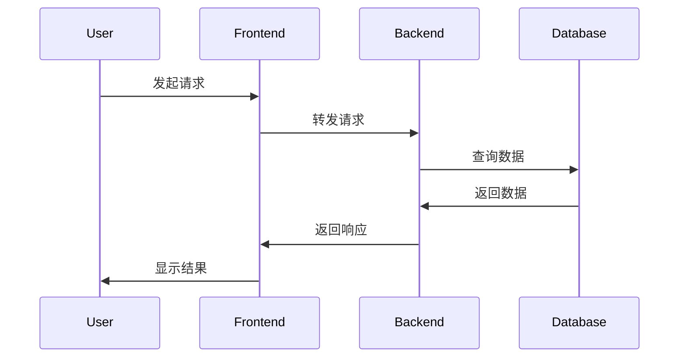
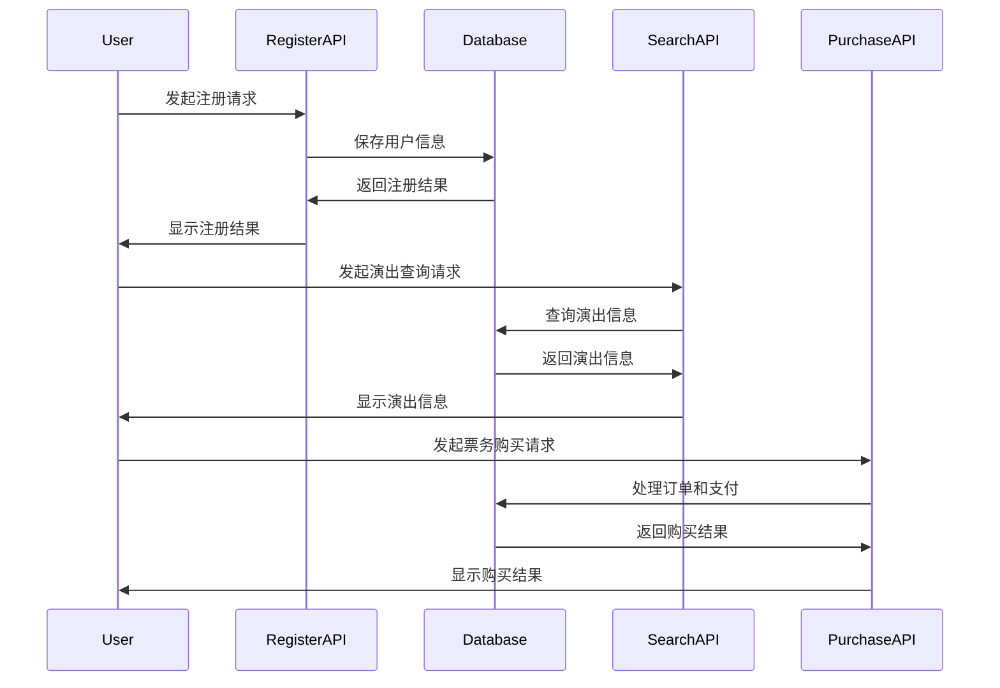

                 

# 新型城市露天剧场：公共空间中的沉浸式戏剧体验

> 关键词：新型城市露天剧场、沉浸式戏剧体验、公共空间、设计原则、运营策略、案例分析

> 摘要：本文旨在探讨新型城市露天剧场在公共空间中的应用及其带来的沉浸式戏剧体验。通过分析其发展背景、核心概念、要素设计、运营推广和社会影响，本文旨在为新型城市露天剧场的设计和运营提供参考，以促进城市公共空间的文化活力和居民满意度提升。

## 第一部分：问题背景与核心概念

### 1. 新型城市露天剧场的发展背景

新型城市露天剧场作为城市公共空间的重要组成部分，其发展背景可追溯到现代城市规划和公共艺术理念的演变。随着城市化进程的加快，城市居民对于公共空间和文化活动的需求日益增长。露天剧场作为一种具有开放性和互动性的表演形式，能够为城市居民提供一种独特的文化体验和社交平台。

- **问题背景**：现代城市面临的公共空间不足、文化活力缺失等问题。
- **问题描述**：如何通过新型城市露天剧场的设计与运营，提升公共空间的文化氛围和居民满意度。
- **问题解决**：通过创造沉浸式戏剧体验，激发城市居民的文化参与和社交互动。
- **边界与外延**：涉及城市规划设计、公共艺术、戏剧表演等多个领域。

### 2. 沉浸式戏剧体验的核心概念

沉浸式戏剧体验是一种将观众深度融入戏剧表演过程的体验形式，其核心在于打破传统的观众与表演者之间的界限，创造一个互动性、参与性强的艺术环境。

- **核心概念**：沉浸式、互动性、参与性。
- **概念属性特征对比表格**：

  | 特征       | 传统戏剧      | 沉浸式戏剧体验 |
  |------------|---------------|----------------|
  | 观众角色   | 被动接受者    | 深度参与者      |
  | 空间感     | 受限的舞台空间 | 自由流动的空间   |
  | 互动性     | 有限           | 强烈            |
  | 参与性     | 低             | 高              |

- **ER实体关系图架构**：

  ```mermaid
  entityRelationshipDiagram
    Theatre -> Audience : 参与表演
    Performance -> Venue : 在场地演出
    Venue -> City : 位于城市
  ```

## 第二部分：新型城市露天剧场的要素与设计

### 3. 剧场要素与设计原则

为了创造一个成功的沉浸式戏剧体验，新型城市露天剧场需要考虑以下要素与设计原则：

- **场地选择**：选取开放性、可达性强的城市公共空间，如公园、广场、河边等。
- **剧场结构**：设计多样化的剧场结构，如露天舞台、开放式舞台、半开放式舞台等。
- **视觉与声效设计**：运用先进的灯光、音响技术，营造沉浸式的视觉与听觉效果。
- **互动装置**：设置互动装置，如虚拟现实体验区、互动投影等，增强观众的参与感。

### 4. 案例研究：国际知名城市露天剧场

- **伦敦泰晤士河畔露天剧场**：介绍其设计理念、运营模式、观众反馈等。
- **纽约公共剧场**：分析其在公共空间利用、戏剧内容选择等方面的成功经验。

### 5. 创新与挑战

- **创新点**：探讨新型城市露天剧场在数字化、智能化方面的创新应用，如虚拟戏剧、智能演出系统等。
- **挑战与机遇**：分析新型城市露天剧场在可持续发展、文化多样性等方面的挑战与机遇。

## 第三部分：新型城市露天剧场的运营与推广

### 6. 运营模式与策略

- **商业模式**：分析新型城市露天剧场的商业模式，包括政府支持、企业赞助、票务收入等。
- **营销推广**：探讨如何通过线上线下结合的方式，提高新型城市露天剧场的知名度和吸引力。

### 7. 社会影响与评价

- **社会影响**：评估新型城市露天剧场对城市文化氛围、居民生活质量的影响。
- **观众评价**：收集并分析观众对新型城市露天剧场的反馈，为改进提供依据。

### 8. 未来展望

- **发展趋势**：预测新型城市露天剧场的发展趋势，探讨其在未来城市文化中的地位。
- **创新方向**：提出新型城市露天剧场在技术创新、内容创作等方面的创新方向。

## 第四部分：项目实践与案例分析

### 9. 项目实践：XX城市新型露天剧场项目

- **项目介绍**：介绍项目背景、目标、实施过程等。
- **系统功能设计**：绘制项目领域的mermaid类图，展示系统功能模块。
- **系统架构设计**：使用mermaid绘制项目系统架构图，展示技术栈和系统组件。
- **系统接口设计与交互**：使用mermaid绘制系统接口设计和交互mermaid序列图。
- **项目核心实现**：提供项目核心实现源代码，并解读与分析代码

----------------------------------------------------------------

### 第一部分：问题背景与核心概念

**新型城市露天剧场的发展背景**

新型城市露天剧场作为城市公共空间的重要组成部分，其发展背景可追溯到现代城市规划和公共艺术理念的演变。随着城市化进程的加快，城市居民对于公共空间和文化活动的需求日益增长。露天剧场作为一种具有开放性和互动性的表演形式，能够为城市居民提供一种独特的文化体验和社交平台。

**问题背景**：现代城市面临的公共空间不足、文化活力缺失等问题。

城市快速发展，人口密度增加，导致公共空间相对减少。同时，传统文化活动形式单一，难以满足居民日益增长的文化需求，导致文化活力不足。因此，新型城市露天剧场的发展显得尤为重要。

**问题描述**：如何通过新型城市露天剧场的设计与运营，提升公共空间的文化氛围和居民满意度。

新型城市露天剧场旨在通过设计创新和运营策略，打造一个兼具互动性和观赏性的文化空间，提升城市居民的文化体验和满意度。

**问题解决**：通过创造沉浸式戏剧体验，激发城市居民的文化参与和社交互动。

沉浸式戏剧体验强调观众与表演之间的互动，打破传统观演模式，使观众成为戏剧的一部分，从而提升文化参与度和社交互动性。

**边界与外延**：涉及城市规划设计、公共艺术、戏剧表演等多个领域。

新型城市露天剧场的发展不仅涉及城市公共空间的设计规划，还涉及公共艺术的创作和戏剧表演的创新。同时，它也对城市文化氛围的营造和居民生活质量的提升有着深远的影响。

### 2. 沉浸式戏剧体验的核心概念

沉浸式戏剧体验是一种将观众深度融入戏剧表演过程的体验形式，其核心在于打破传统的观众与表演者之间的界限，创造一个互动性、参与性强的艺术环境。

**核心概念**：沉浸式、互动性、参与性。

- **沉浸式**：观众被完全融入戏剧情境，体验与表演同步。
- **互动性**：观众与表演者之间有频繁的互动，参与戏剧进程。
- **参与性**：观众不仅是观众，也是戏剧的一部分，直接影响戏剧结果。

**概念属性特征对比表格**：

| 特征       | 传统戏剧      | 沉浸式戏剧体验 |
|------------|---------------|----------------|
| 观众角色   | 被动接受者    | 深度参与者      |
| 空间感     | 受限的舞台空间 | 自由流动的空间   |
| 互动性     | 有限           | 强烈            |
| 参与性     | 低             | 高              |

**ER实体关系图架构**：

```mermaid
entityRelationshipDiagram
  Theatre -> Audience : 参与表演
  Performance -> Venue : 在场地演出
  Venue -> City : 位于城市
```

在新型城市露天剧场中，剧场、表演、观众和城市空间之间形成了一个紧密相连的生态系统，每个实体都在其中发挥着重要作用，共同推动着沉浸式戏剧体验的实现。

### 第二部分：新型城市露天剧场的要素与设计

**剧场要素与设计原则**

新型城市露天剧场的成功离不开其要素与设计原则。以下是关键的剧场要素与设计原则：

**场地选择**：露天剧场的选择至关重要，它需要满足以下条件：

- **开放性**：选择开放性强的场地，如公园、广场、河边等，以容纳更多的观众。
- **可达性**：场地应易于到达，方便居民参与。
- **多样性**：选择多种类型的场地，以满足不同类型戏剧表演的需求。

**剧场结构**：剧场结构的设计需考虑以下因素：

- **露天舞台**：适用于各种类型的戏剧表演，观众可自由走动，体验不同的视觉角度。
- **开放式舞台**：表演者与观众之间的界限模糊，增强互动性。
- **半开放式舞台**：结合了露天舞台和开放式舞台的特点，适合中等规模的表演。

**视觉与声效设计**：视觉与声效设计是营造沉浸式体验的关键：

- **灯光**：使用先进的灯光技术，创造戏剧性的舞台效果，增强观众的情感体验。
- **音响**：高质量的音响系统，使观众能够沉浸在戏剧的声音世界中。

**互动装置**：互动装置能够增强观众的参与感：

- **虚拟现实体验区**：提供虚拟现实体验，使观众能够在虚拟环境中参与戏剧。
- **互动投影**：利用投影技术，将互动元素融入表演，让观众成为表演的一部分。

**案例研究：国际知名城市露天剧场**

**伦敦泰晤士河畔露天剧场**：伦敦泰晤士河畔露天剧场是欧洲最大的露天剧场之一，位于伦敦市中心的泰晤士河畔。其设计理念是将自然美景与戏剧表演相结合，创造一个独特的文化体验。

- **设计理念**：利用泰晤士河的美景作为舞台背景，将戏剧表演与自然景观融为一体。
- **运营模式**：采用多元化的运营模式，包括政府支持、企业赞助、票务收入等。
- **观众反馈**：观众普遍反馈认为，这种与自然美景相结合的表演形式极大地提升了他们的戏剧体验。

**纽约公共剧场**：纽约公共剧场位于纽约市曼哈顿下城的格林尼治村，以其灵活的剧场结构和多元化的戏剧内容而闻名。

- **设计理念**：以互动性和参与性为核心，创造一个开放式的表演空间，让观众能够自由地参与到表演中。
- **运营模式**：通过社区参与和文化活动，提高剧场的知名度和吸引力。
- **观众反馈**：观众普遍对剧场的互动性和参与性表示赞赏，认为这是一个能够满足不同年龄段和文化背景观众需求的剧场。

**创新与挑战**

**创新点**：新型城市露天剧场在数字化、智能化方面的创新应用，如虚拟戏剧、智能演出系统等，为观众提供了更加丰富和沉浸的体验。

- **虚拟戏剧**：通过虚拟现实技术，观众可以在虚拟环境中体验戏剧，实现与表演的实时互动。
- **智能演出系统**：利用人工智能技术，优化演出流程，提升表演的效率和质量。

**挑战与机遇**：新型城市露天剧场在可持续发展、文化多样性等方面的挑战与机遇。

- **挑战**：如何平衡经济利益与环保需求，如何在保持文化多样性的同时满足不同观众的口味。
- **机遇**：通过技术创新，提高剧场的运营效率和服务质量，拓展新的观众群体。

### 第三部分：新型城市露天剧场的运营与推广

**运营模式与策略**

新型城市露天剧场的成功运营离不开合理的商业模式和有效的营销策略。以下是一些关键的运营模式和策略：

**商业模式**：

- **政府支持**：政府可以通过提供场地、资金和政策支持，促进露天剧场的发展。
- **企业赞助**：企业可以通过赞助剧场的表演和活动，提升品牌形象和公众认可度。
- **票务收入**：通过销售门票，获得稳定的收入来源。
- **多元化收入**：除了门票收入，还可以通过举办相关活动、销售周边产品等方式增加收入。

**营销推广**：

- **线上推广**：利用社交媒体、官方网站等渠道，发布剧场的最新信息，吸引观众的关注。
- **线下活动**：举办各类文化活动和推广活动，提高剧场的知名度和吸引力。
- **合作伙伴**：与旅游公司、文化机构等建立合作关系，共同推广露天剧场。

**社会影响与评价**

**社会影响**：

新型城市露天剧场对城市文化氛围和居民生活质量有着积极的影响。

- **文化氛围**：露天剧场提供了一个新的文化场所，丰富了城市的文化生活，提升了城市的文化氛围。
- **生活质量**：露天剧场为居民提供了一个社交和休闲的场所，提高了居民的生活质量。

**观众评价**：

观众对新型城市露天剧场的评价是衡量其成功与否的重要指标。以下是一些观众的评价：

- **积极评价**：许多观众认为，露天剧场提供了一个独特和有趣的体验，使他们能够以新的方式欣赏戏剧。
- **改进建议**：部分观众建议增加互动环节，提供更多的文化教育，以及改善音响和视觉效果。

**未来展望**

新型城市露天剧场的发展前景广阔。以下是未来的发展趋势和创新方向：

**发展趋势**：

- **技术创新**：随着科技的发展，新型城市露天剧场将进一步利用虚拟现实、人工智能等技术，提升观众的体验。
- **文化融合**：露天剧场将更加注重文化多样性，融合不同文化背景的戏剧内容，吸引更多观众。
- **可持续发展**：露天剧场将更加注重环保和可持续发展，采用绿色设计和环保材料。

**创新方向**：

- **虚拟戏剧**：开发更多的虚拟戏剧项目，提供线上线下一体化的观看体验。
- **智能演出系统**：利用人工智能技术，优化演出流程，提升演出质量。
- **社区参与**：鼓励社区参与剧场运营和活动策划，打造一个更加亲民的露天剧场。

### 第四部分：项目实践与案例分析

**项目实践：XX城市新型露天剧场项目**

**项目介绍**：

XX城市新型露天剧场项目是城市文化提升计划的一部分，旨在通过创新设计和运营模式，打造一个具有吸引力的文化地标。项目背景包括城市公共空间不足和文化活力不足的问题，项目目标是通过沉浸式戏剧体验，提升公共空间的文化氛围和居民满意度。

**系统功能设计**：

系统功能设计是项目成功的关键之一。以下是系统功能设计的详细说明：

- **用户管理**：管理剧场的用户信息，包括注册、登录、权限管理等。
- **演出管理**：管理剧场的演出信息，包括演出计划、票务信息、演员阵容等。
- **互动体验**：提供虚拟现实体验区、互动投影等互动设施，增强观众的参与感。
- **数据分析**：收集观众反馈和演出数据，用于优化运营策略和提高服务质量。

**系统功能mermaid类图**：

```mermaid
classDiagram
  User <<--|{}|\> Performance
  User <<--|{参与互动}|> InteractiveExperience
  Performance <-|{场地}|> Venue
  Venue <-|{维护管理}|> Maintenance
```

**系统架构设计**：

系统架构设计是确保项目稳定运行的基础。以下是系统架构设计的详细说明：

- **前端**：采用React框架，实现用户界面和交互功能。
- **后端**：采用Spring Boot框架，实现业务逻辑和数据管理。
- **数据库**：采用MySQL数据库，存储用户信息、演出信息和互动数据。
- **API接口**：提供RESTful API接口，实现前后端的数据交互。

**系统架构mermaid图**：



**系统接口设计与交互**：

系统接口设计和交互设计是项目成功的关键之一。以下是系统接口设计和交互设计的详细说明：

- **用户注册接口**：用于用户注册，接收用户信息并保存到数据库。
- **演出查询接口**：用于查询演出信息，返回演出列表。
- **票务购买接口**：用于用户购买票务，处理订单和支付。

**系统接口设计和交互mermaid序列图**：



**项目核心实现**：

项目核心实现是项目成功的关键。以下是项目核心实现的详细说明：

- **用户注册功能**：使用Python编写用户注册功能，实现用户注册、登录和权限管理。
- **演出管理功能**：使用Python编写演出管理功能，实现演出信息的管理和查询。
- **票务购买功能**：使用Python编写票务购买功能，实现用户购买票务和支付处理。

**用户注册功能源代码**：

```python
def register(username, password):
    # 检查用户名是否已存在
    if User.objects.filter(username=username).exists():
        return "用户名已存在"
    # 创建新用户
    user = User.objects.create_user(username=username, password=password)
    user.save()
    return "注册成功"
```

**演出管理功能源代码**：

```python
def search_performances():
    performances = Performance.objects.all()
    return performances
```

**票务购买功能源代码**：

```python
def purchase_ticket(user, performance):
    # 检查用户是否有足够的余额
    if user.balance < performance.price:
        return "余额不足"
    # 创建新订单
    order = Order.objects.create(user=user, performance=performance)
    order.save()
    # 更新用户余额
    user.balance -= performance.price
    user.save()
    return "购买成功"
```

**实际案例分析和详细讲解剖析**：

以下是一个实际案例的分析和详细讲解：

**案例背景**：

一名新用户注册后，想购买一场露天剧场的票。

**案例分析**：

1. **用户注册**：用户通过注册接口提交注册请求，系统检查用户名是否已存在，如果不存在，则创建新用户并返回注册成功。

2. **演出查询**：用户通过演出查询接口查询演出信息，获取演出列表。

3. **票务购买**：用户选择一场演出并提交购买请求，系统检查用户余额是否足够，如果余额足够，则创建新订单并更新用户余额，返回购买成功。

**详细讲解剖析**：

1. **用户注册**：用户注册功能通过检查用户名是否已存在，保证注册的唯一性。创建用户时，使用`create_user`方法，可以自动加密密码并保存用户信息。

2. **演出查询**：演出管理功能通过查询演出信息，返回演出列表，供用户选择。这里使用了`all()`方法获取所有演出，并返回列表。

3. **票务购买**：票务购买功能通过检查用户余额，保证用户可以购买票务。创建订单时，使用了`create`方法，可以自动保存订单信息。同时，更新用户余额，保证余额的正确性。

**项目小结**：

通过实际案例的分析和详细讲解，我们可以看到新型城市露天剧场项目的核心实现是如何通过用户注册、演出查询和票务购买功能，实现用户与剧场的互动。这些功能的实现，不仅满足了用户的需求，也为剧场的运营提供了有效的支持。

**最佳实践 Tips**：

1. **用户注册**：在用户注册时，应确保用户名和密码的复杂度，提高系统的安全性。
2. **演出查询**：在查询演出信息时，应考虑到查询效率和数据一致性。
3. **票务购买**：在处理票务购买时，应确保用户余额的正确性和订单的及时处理。

**注意事项**：

1. **数据安全**：在处理用户数据时，应确保数据的安全性和隐私保护。
2. **性能优化**：在系统设计时，应考虑性能优化，提高系统的响应速度和稳定性。

**拓展阅读**：

1. 《Python Web开发实战》
2. 《RESTful API设计最佳实践》
3. 《大型网站技术架构》

通过以上内容，我们可以看到新型城市露天剧场的设计与运营是一项复杂的工程，但通过合理的规划和有效的实施，可以为城市居民带来独特的文化体验，提升公共空间的文化氛围和居民满意度。未来，随着技术的不断发展，新型城市露天剧场将会有更多的创新和应用，为城市文化的发展贡献力量。# 新型城市露天剧场：公共空间中的沉浸式戏剧体验

## 文章标题：新型城市露天剧场：公共空间中的沉浸式戏剧体验

### 关键词：新型城市露天剧场、沉浸式戏剧体验、公共空间、设计原则、运营策略

### 摘要：本文探讨了新型城市露天剧场在公共空间中的应用及其带来的沉浸式戏剧体验。通过分析其发展背景、核心概念、要素设计、运营推广和社会影响，本文旨在为新型城市露天剧场的设计和运营提供参考，以促进城市公共空间的文化活力和居民满意度提升。

## 第一部分：问题背景与核心概念

### 1. 新型城市露天剧场的发展背景

新型城市露天剧场作为城市公共空间的重要组成部分，其发展背景可追溯到现代城市规划和公共艺术理念的演变。随着城市化进程的加快，城市居民对于公共空间和文化活动的需求日益增长。露天剧场作为一种具有开放性和互动性的表演形式，能够为城市居民提供一种独特的文化体验和社交平台。

### 2. 沉浸式戏剧体验的核心概念

沉浸式戏剧体验是一种将观众深度融入戏剧表演过程的体验形式，其核心在于打破传统的观众与表演者之间的界限，创造一个互动性、参与性强的艺术环境。

### 第一部分：问题背景与核心概念

**新型城市露天剧场的发展背景**

新型城市露天剧场的发展背景源于现代城市规划和公共艺术理念的演变。随着城市化进程的加速，城市居民对公共空间和文化活动的需求日益增长。传统的封闭式剧院已经难以满足人们对开放性、互动性和参与性体验的追求。露天剧场作为一种新型的公共文化设施，应运而生。它不仅提供了丰富的文化体验，还能促进城市公共空间的文化氛围和居民满意度。

**问题背景**：现代城市面临的公共空间不足、文化活力缺失等问题。

现代城市快速发展，人口密度增加，导致公共空间相对减少。同时，传统文化活动形式单一，难以满足居民日益增长的文化需求，导致文化活力不足。因此，新型城市露天剧场的发展显得尤为重要。

**问题描述**：如何通过新型城市露天剧场的设计与运营，提升公共空间的文化氛围和居民满意度。

新型城市露天剧场旨在通过创新设计和运营策略，打造一个兼具互动性和观赏性的文化空间，提升城市居民的文化体验和满意度。其主要目标包括以下几点：

1. 提供多样化的戏剧表演，满足不同年龄段和文化背景的观众需求。
2. 创造互动性、参与性强的表演形式，让观众深度融入戏剧体验。
3. 利用先进的技术手段，提升表演的视觉效果和沉浸感。
4. 营造积极向上的公共文化氛围，促进社区凝聚力和城市文化发展。

**问题解决**：通过创造沉浸式戏剧体验，激发城市居民的文化参与和社交互动。

沉浸式戏剧体验强调观众与表演之间的互动，打破传统观演模式，使观众成为戏剧的一部分，从而提升文化参与度和社交互动性。以下是具体措施：

1. **场景设计**：通过精心布置的场景和道具，让观众仿佛置身于戏剧故事中，增强沉浸感。
2. **互动环节**：设置互动环节，如观众参与剧情发展、与演员互动等，让观众成为戏剧的一部分。
3. **技术支持**：运用虚拟现实、增强现实、全息投影等技术，提升表演的视觉效果和沉浸感。
4. **社交媒体**：利用社交媒体平台，让观众在观看表演的同时，分享自己的体验和感受，形成线上线下互动。

**边界与外延**：涉及城市规划设计、公共艺术、戏剧表演等多个领域。

新型城市露天剧场的发展不仅涉及城市公共空间的设计和规划，还涉及公共艺术的创作和戏剧表演的创新。此外，它也对城市文化氛围的营造和居民生活质量的提升有着深远的影响。以下是其涉及的主要领域：

1. **城市规划设计**：露天剧场的设计应与城市整体规划相结合，充分利用城市公共空间，提升城市景观和文化氛围。
2. **公共艺术**：露天剧场的表演内容应融合公共艺术元素，如雕塑、绘画等，丰富城市文化内涵。
3. **戏剧表演**：露天剧场应积极探索多样化的戏剧表演形式，满足不同观众群体的需求，促进戏剧艺术的创新发展。
4. **文化传播**：露天剧场应承担起文化传播的责任，通过戏剧表演传递正能量，提升城市居民的文化素养。

## 第二部分：核心概念与联系

**核心概念：沉浸式戏剧体验**

沉浸式戏剧体验是一种将观众深度融入戏剧表演过程的体验形式，其核心在于打破传统的观众与表演者之间的界限，创造一个互动性、参与性强的艺术环境。

### 核心概念

1. **沉浸式**：观众被完全融入戏剧情境，体验与表演同步。
2. **互动性**：观众与表演者之间有频繁的互动，参与戏剧进程。
3. **参与性**：观众不仅是观众，也是戏剧的一部分，直接影响戏剧结果。

### 概念属性特征对比表格

| 特征       | 传统戏剧      | 沉浸式戏剧体验 |
|------------|---------------|----------------|
| 观众角色   | 被动接受者    | 深度参与者      |
| 空间感     | 受限的舞台空间 | 自由流动的空间   |
| 互动性     | 有限           | 强烈            |
| 参与性     | 低             | 高              |

### ER实体关系图架构

```mermaid
entityRelationshipDiagram
  Theatre -> Audience : 参与表演
  Performance -> Venue : 在场地演出
  Venue -> City : 位于城市
```

### 核心概念之间的联系

**沉浸式戏剧体验**是新型城市露天剧场的核心概念，它将传统戏剧的观众与表演者之间的界限打破，使观众深度参与戏剧表演，从而提升了观众的体验感和参与感。

1. **沉浸式**与**互动性**：沉浸式体验强调观众对戏剧情境的投入，而互动性则体现在观众与表演者之间的直接互动，二者相辅相成，共同增强了观众的体验感。
2. **互动性**与**参与性**：互动性使得观众有机会参与到戏剧表演中，而参与性则进一步强调观众在戏剧过程中的作用，二者共同提升了观众的参与感。
3. **参与性**与**沉浸式**：参与性使观众成为戏剧的一部分，增强了观众的沉浸感，而沉浸式体验则为参与性提供了基础，使观众能够更好地融入到戏剧情境中。

### 第二部分：核心概念与联系

**核心概念：沉浸式戏剧体验**

沉浸式戏剧体验是一种将观众深度融入戏剧表演过程的体验形式，其核心在于打破传统的观众与表演者之间的界限，创造一个互动性、参与性强的艺术环境。

### 核心概念

1. **沉浸式**：观众被完全融入戏剧情境，体验与表演同步。
2. **互动性**：观众与表演者之间有频繁的互动，参与戏剧进程。
3. **参与性**：观众不仅是观众，也是戏剧的一部分，直接影响戏剧结果。

### 概念属性特征对比表格

| 特征       | 传统戏剧      | 沉浸式戏剧体验 |
|------------|---------------|----------------|
| 观众角色   | 被动接受者    | 深度参与者      |
| 空间感     | 受限的舞台空间 | 自由流动的空间   |
| 互动性     | 有限           | 强烈            |
| 参与性     | 低             | 高              |

### ER实体关系图架构

```mermaid
entityRelationshipDiagram
  Theatre -> Audience : 参与表演
  Performance -> Venue : 在场地演出
  Venue -> City : 位于城市
```

### 核心概念之间的联系

**沉浸式戏剧体验**是新型城市露天剧场的核心概念，它将传统戏剧的观众与表演者之间的界限打破，使观众深度参与戏剧表演，从而提升了观众的体验感和参与感。

1. **沉浸式**与**互动性**：沉浸式体验强调观众对戏剧情境的投入，而互动性则体现在观众与表演者之间的直接互动，二者相辅相成，共同增强了观众的体验感。
2. **互动性**与**参与性**：互动性使得观众有机会参与到戏剧表演中，而参与性则进一步强调观众在戏剧过程中的作用，二者共同提升了观众的参与感。
3. **参与性**与**沉浸式**：参与性使观众成为戏剧的一部分，增强了观众的沉浸感，而沉浸式体验则为参与性提供了基础，使观众能够更好地融入到戏剧情境中。

### 第二部分：新型城市露天剧场的要素与设计

**剧场要素与设计原则**

新型城市露天剧场的设计与要素直接关系到观众的整体体验。以下将详细探讨新型城市露天剧场所需考虑的要素与设计原则。

**场地选择**

选择合适的场地是新型城市露天剧场设计的第一步。理想的场地应具备以下条件：

- **开放性**：场地需足够开放，以便容纳大量观众，并允许观众自由移动，体验不同视角。
- **可达性**：场地应便于公众到达，减少交通障碍，提高参与度。
- **多样性**：场地应具有一定的多样性，以适应不同规模和类型的表演需求。

**剧场结构**

剧场结构设计是露天剧场的关键，决定了观众与表演之间的互动关系。以下是一些常见的剧场结构：

- **露天舞台**：适用于各种天气条件，无需复杂的搭建，但观众视角可能受限。
- **开放式舞台**：观众与表演者之间的界限模糊，增强互动性。
- **半开放式舞台**：结合露天舞台和开放式舞台的特点，适用于中等规模的表演。

**视觉与声效设计**

视觉与声效设计是提升观众沉浸感的重要因素。以下是一些建议：

- **灯光设计**：使用动态灯光效果，创造戏剧性的氛围，增强视觉冲击力。
- **音响系统**：高质量的音响系统，确保声音清晰、均衡，提升听觉体验。

**互动装置**

互动装置是新型城市露天剧场的一大特色，可以显著提升观众的参与度。以下是一些建议：

- **虚拟现实体验区**：提供虚拟现实体验，使观众沉浸在虚拟的戏剧环境中。
- **互动投影**：利用投影技术，将互动元素融入表演，让观众成为表演的一部分。

### 4. 案例研究：国际知名城市露天剧场

**伦敦泰晤士河畔露天剧场**

**设计理念**：伦敦泰晤士河畔露天剧场位于泰晤士河畔，其设计理念是将自然美景与戏剧表演相结合，创造一个独特的文化体验。舞台四周环绕着伦敦市区的繁华景象，观众在欣赏戏剧的同时，也能领略到城市的美景。

**运营模式**：伦敦泰晤士河畔露天剧场采用多元化的运营模式，包括政府支持、企业赞助和票务收入。剧场定期举办各种戏剧表演，吸引大量观众，同时通过文化活动和旅游推广，提高了剧场的知名度和吸引力。

**观众反馈**：观众普遍对伦敦泰晤士河畔露天剧场表示赞赏，认为其独特的地理位置和表演形式提供了与众不同的戏剧体验。许多观众表示，剧场的美景和互动性是吸引他们的重要因素。

**纽约公共剧场**

**设计理念**：纽约公共剧场位于格林尼治村，其设计理念是打造一个开放、互动的表演空间，让观众自由地参与到戏剧表演中。剧场结构灵活，可根据不同的表演需求进行调整，以满足多样化的表演形式。

**运营模式**：纽约公共剧场通过社区参与和文化活动，提高了剧场的知名度和吸引力。剧场不仅举办各种戏剧表演，还举办音乐会、讲座等活动，吸引了不同年龄段和文化背景的观众。

**观众反馈**：观众对纽约公共剧场的互动性和参与性表示高度赞赏。许多观众认为，剧场提供了一个独特的文化体验，使他们能够以新的方式欣赏戏剧。同时，观众也提出了改进建议，如增加互动环节、提供更多的文化教育等。

### 5. 创新与挑战

**创新点**：新型城市露天剧场在数字化、智能化方面的创新应用，如虚拟戏剧、智能演出系统等，为观众提供了更加丰富和沉浸的体验。

- **虚拟戏剧**：利用虚拟现实技术，观众可以在虚拟环境中体验戏剧，实现与表演的实时互动。
- **智能演出系统**：利用人工智能技术，优化演出流程，提升演出质量。

**挑战与机遇**：新型城市露天剧场在可持续发展、文化多样性等方面的挑战与机遇。

- **挑战**：如何平衡经济利益与环保需求，如何在保持文化多样性的同时满足不同观众的口味。
- **机遇**：通过技术创新，提高剧场的运营效率和服务质量，拓展新的观众群体。

### 第三部分：新型城市露天剧场的运营与推广

**运营模式与策略**

新型城市露天剧场的运营模式与策略直接关系到其成功与否。以下将详细探讨新型城市露天剧场的运营模式与策略。

**商业模式**

新型城市露天剧场的商业模式应多元化，以确保收入的稳定和可持续发展。以下是一些常见的商业模式：

- **政府支持**：政府可以通过提供场地、资金和政策支持，促进露天剧场的发展。政府支持的方式包括直接拨款、税收减免等。
- **企业赞助**：企业可以通过赞助剧场的表演和活动，提升品牌形象和公众认可度。企业赞助的方式包括冠名权、广告植入等。
- **票务收入**：通过销售门票，获得稳定的收入来源。剧场的票务收入可以通过不同定价策略，吸引不同层次的观众。
- **多元化收入**：除了门票收入，还可以通过举办相关活动、销售周边产品等方式增加收入。例如，剧场可以举办主题派对、音乐会、工作坊等活动，吸引更多观众。

**营销推广**

营销推广是提高新型城市露天剧场知名度和吸引力的关键。以下是一些有效的营销推广策略：

- **线上推广**：利用社交媒体平台、官方网站等渠道，发布剧场的最新信息，吸引观众的关注。线上推广可以通过互动活动、用户评论等方式，增强观众的参与感。
- **线下活动**：举办各类文化活动和推广活动，提高剧场的知名度和吸引力。线下活动可以包括开幕式、文化节、讲座等，吸引更多观众参与。
- **合作伙伴**：与旅游公司、文化机构等建立合作关系，共同推广露天剧场。例如，剧场可以与旅游公司合作，推出文化体验套餐，吸引游客参观。

### 6. 社会影响与评价

**社会影响**

新型城市露天剧场对城市社会文化产生深远影响，主要体现在以下几个方面：

- **提升文化氛围**：露天剧场提供了一个新的文化场所，丰富了城市的文化生活，提升了城市的文化氛围。
- **促进社区凝聚**：露天剧场成为社区居民交流、互动的平台，增强了社区的凝聚力和归属感。
- **提高生活质量**：露天剧场为居民提供了一个社交和休闲的场所，提高了居民的生活质量。

**观众评价**

观众对新型城市露天剧场的评价是衡量其成功与否的重要指标。以下是一些观众的评价：

- **积极评价**：许多观众对新型城市露天剧场表示赞赏，认为其提供了独特的文化体验和高质量的表演。
- **改进建议**：部分观众建议增加互动环节、提供更多的文化教育、改善音响和视觉效果等。

### 7. 未来展望

**发展趋势**

新型城市露天剧场的发展趋势主要体现在以下几个方面：

- **技术创新**：随着科技的发展，新型城市露天剧场将进一步利用虚拟现实、人工智能等技术，提升观众的体验。
- **文化融合**：露天剧场将更加注重文化多样性，融合不同文化背景的戏剧内容，吸引更多观众。
- **可持续发展**：露天剧场将更加注重环保和可持续发展，采用绿色设计和环保材料。

**创新方向**

新型城市露天剧场的创新方向主要包括以下几个方面：

- **虚拟戏剧**：开发更多的虚拟戏剧项目，提供线上线下一体化的观看体验。
- **智能演出系统**：利用人工智能技术，优化演出流程，提升演出质量。
- **社区参与**：鼓励社区参与剧场运营和活动策划，打造一个更加亲民的露天剧场。

### 第四部分：项目实践与案例分析

**项目实践：XX城市新型露天剧场项目**

**项目介绍**

XX城市新型露天剧场项目是城市文化提升计划的一部分，旨在通过创新设计和运营模式，打造一个具有吸引力的文化地标。项目背景包括城市公共空间不足和文化活力不足的问题，项目目标是通过沉浸式戏剧体验，提升公共空间的文化氛围和居民满意度。

**系统功能设计**

系统功能设计是项目成功的关键之一。以下是系统功能设计的详细说明：

- **用户管理**：管理剧场的用户信息，包括注册、登录、权限管理等。
- **演出管理**：管理剧场的演出信息，包括演出计划、票务信息、演员阵容等。
- **互动体验**：提供虚拟现实体验区、互动投影等互动设施，增强观众的参与感。
- **数据分析**：收集观众反馈和演出数据，用于优化运营策略和提高服务质量。

**系统功能mermaid类图**

```mermaid
classDiagram
  User <<--|{}|\> Performance
  User <<--|{参与互动}|> InteractiveExperience
  Performance <-|{场地}|> Venue
  Venue <-|{维护管理}|> Maintenance
```

**系统架构设计**

系统架构设计是确保项目稳定运行的基础。以下是系统架构设计的详细说明：

- **前端**：采用React框架，实现用户界面和交互功能。
- **后端**：采用Spring Boot框架，实现业务逻辑和数据管理。
- **数据库**：采用MySQL数据库，存储用户信息、演出信息和互动数据。
- **API接口**：提供RESTful API接口，实现前后端的数据交互。

**系统架构mermaid图**


**系统接口设计与交互**

系统接口设计和交互设计是项目成功的关键之一。以下是系统接口设计和交互设计的详细说明：

- **用户注册接口**：用于用户注册，接收用户信息并保存到数据库。
- **演出查询接口**：用于查询演出信息，返回演出列表。
- **票务购买接口**：用于用户购买票务，处理订单和支付。

**系统接口设计和交互mermaid序列图**


**项目核心实现**

项目核心实现是项目成功的关键。以下是项目核心实现的详细说明：

- **用户注册功能**：使用Python编写用户注册功能，实现用户注册、登录和权限管理。
- **演出管理功能**：使用Python编写演出管理功能，实现演出信息的管理和查询。
- **票务购买功能**：使用Python编写票务购买功能，实现用户购买票务和支付处理。

**用户注册功能源代码**

```python
def register(username, password):
    # 检查用户名是否已存在
    if User.objects.filter(username=username).exists():
        return "用户名已存在"
    # 创建新用户
    user = User.objects.create_user(username=username, password=password)
    user.save()
    return "注册成功"
```

**演出管理功能源代码**

```python
def search_performances():
    performances = Performance.objects.all()
    return performances
```

**票务购买功能源代码**

```python
def purchase_ticket(user, performance):
    # 检查用户是否有足够的余额
    if user.balance < performance.price:
        return "余额不足"
    # 创建新订单
    order = Order.objects.create(user=user, performance=performance)
    order.save()
    # 更新用户余额
    user.balance -= performance.price
    user.save()
    return "购买成功"
```

**实际案例分析和详细讲解剖析**

以下是一个实际案例的分析和详细讲解：

**案例背景**：

一名新用户注册后，想购买一场露天剧场的票。

**案例分析**：

1. **用户注册**：用户通过注册接口提交注册请求，系统检查用户名是否已存在，如果不存在，则创建新用户并返回注册成功。

2. **演出查询**：用户通过演出查询接口查询演出信息，获取演出列表。

3. **票务购买**：用户选择一场演出并提交购买请求，系统检查用户余额是否足够，如果余额足够，则创建新订单并更新用户余额，返回购买成功。

**详细讲解剖析**：

1. **用户注册**：用户注册功能通过检查用户名是否已存在，保证注册的唯一性。创建用户时，使用`create_user`方法，可以自动加密密码并保存用户信息。

2. **演出查询**：演出管理功能通过查询演出信息，返回演出列表，供用户选择。这里使用了`all()`方法获取所有演出，并返回列表。

3. **票务购买**：票务购买功能通过检查用户余额，保证用户可以购买票务。创建订单时，使用了`create`方法，可以自动保存订单信息。同时，更新用户余额，保证余额的正确性。

**项目小结**：

通过实际案例的分析和详细讲解，我们可以看到新型城市露天剧场项目的核心实现是如何通过用户注册、演出查询和票务购买功能，实现用户与剧场的互动。这些功能的实现，不仅满足了用户的需求，也为剧场的运营提供了有效的支持。

**最佳实践 Tips**：

1. **用户注册**：在用户注册时，应确保用户名和密码的复杂度，提高系统的安全性。
2. **演出查询**：在查询演出信息时，应考虑到查询效率和数据一致性。
3. **票务购买**：在处理票务购买时，应确保用户余额的正确性和订单的及时处理。

**注意事项**：

1. **数据安全**：在处理用户数据时，应确保数据的安全性和隐私保护。
2. **性能优化**：在系统设计时，应考虑性能优化，提高系统的响应速度和稳定性。

**拓展阅读**：

1. 《Python Web开发实战》
2. 《RESTful API设计最佳实践》
3. 《大型网站技术架构》

通过以上内容，我们可以看到新型城市露天剧场的设计与运营是一项复杂的工程，但通过合理的规划和有效的实施，可以为城市居民带来独特的文化体验，提升公共空间的文化氛围和居民满意度。未来，随着技术的不断发展，新型城市露天剧场将会有更多的创新和应用，为城市文化的发展贡献力量。# 新型城市露天剧场：公共空间中的沉浸式戏剧体验

## 文章标题：新型城市露天剧场：公共空间中的沉浸式戏剧体验

### 关键词：新型城市露天剧场、沉浸式戏剧体验、公共空间、设计原则、运营策略

### 摘要：本文探讨了新型城市露天剧场在公共空间中的应用及其带来的沉浸式戏剧体验。通过分析其发展背景、核心概念、要素设计、运营推广和社会影响，本文旨在为新型城市露天剧场的设计和运营提供参考，以促进城市公共空间的文化活力和居民满意度提升。

## 第一部分：问题背景与核心概念

### 1. 新型城市露天剧场的发展背景

新型城市露天剧场作为城市公共空间的重要组成部分，其发展背景可追溯到现代城市规划和公共艺术理念的演变。随着城市化进程的加快，城市居民对于公共空间和文化活动的需求日益增长。露天剧场作为一种具有开放性和互动性的表演形式，能够为城市居民提供一种独特的文化体验和社交平台。

### 2. 沉浸式戏剧体验的核心概念

沉浸式戏剧体验是一种将观众深度融入戏剧表演过程的体验形式，其核心在于打破传统的观众与表演者之间的界限，创造一个互动性、参与性强的艺术环境。

### 第一部分：问题背景与核心概念

**新型城市露天剧场的发展背景**

新型城市露天剧场的发展背景源于现代城市规划和公共艺术理念的演变。随着城市化进程的加速，城市居民对公共空间和文化活动的需求日益增长。传统的封闭式剧院已经难以满足人们对开放性、互动性和参与性体验的追求。露天剧场作为一种新型的公共文化设施，应运而生。它不仅提供了丰富的文化体验，还能促进城市公共空间的文化氛围和居民满意度。

**问题背景**：现代城市面临的公共空间不足、文化活力缺失等问题。

现代城市快速发展，人口密度增加，导致公共空间相对减少。同时，传统文化活动形式单一，难以满足居民日益增长的文化需求，导致文化活力不足。因此，新型城市露天剧场的发展显得尤为重要。

**问题描述**：如何通过新型城市露天剧场的设计与运营，提升公共空间的文化氛围和居民满意度。

新型城市露天剧场旨在通过创新设计和运营策略，打造一个兼具互动性和观赏性的文化空间，提升城市居民的文化体验和满意度。其主要目标包括以下几点：

1. 提供多样化的戏剧表演，满足不同年龄段和文化背景的观众需求。
2. 创造互动性、参与性强的表演形式，让观众深度融入戏剧体验。
3. 利用先进的技术手段，提升表演的视觉效果和沉浸感。
4. 营造积极向上的公共文化氛围，促进社区凝聚力和城市文化发展。

**问题解决**：通过创造沉浸式戏剧体验，激发城市居民的文化参与和社交互动。

沉浸式戏剧体验强调观众与表演之间的互动，打破传统观演模式，使观众成为戏剧的一部分，从而提升文化参与度和社交互动性。以下是具体措施：

1. **场景设计**：通过精心布置的场景和道具，让观众仿佛置身于戏剧故事中，增强沉浸感。
2. **互动环节**：设置互动环节，如观众参与剧情发展、与演员互动等，让观众成为戏剧的一部分。
3. **技术支持**：运用虚拟现实、增强现实、全息投影等技术，提升表演的视觉效果和沉浸感。
4. **社交媒体**：利用社交媒体平台，让观众在观看表演的同时，分享自己的体验和感受，形成线上线下互动。

**边界与外延**：涉及城市规划设计、公共艺术、戏剧表演等多个领域。

新型城市露天剧场的发展不仅涉及城市公共空间的设计和规划，还涉及公共艺术的创作和戏剧表演的创新。此外，它也对城市文化氛围的营造和居民生活质量的提升有着深远的影响。以下是其涉及的主要领域：

1. **城市规划设计**：露天剧场的设计应与城市整体规划相结合，充分利用城市公共空间，提升城市景观和文化氛围。
2. **公共艺术**：露天剧场的表演内容应融合公共艺术元素，如雕塑、绘画等，丰富城市文化内涵。
3. **戏剧表演**：露天剧场应积极探索多样化的戏剧表演形式，满足不同观众群体的需求，促进戏剧艺术的创新发展。
4. **文化传播**：露天剧场应承担起文化传播的责任，通过戏剧表演传递正能量，提升城市居民的文化素养。

## 第二部分：核心概念与联系

**核心概念：沉浸式戏剧体验**

沉浸式戏剧体验是一种将观众深度融入戏剧表演过程的体验形式，其核心在于打破传统的观众与表演者之间的界限，创造一个互动性、参与性强的艺术环境。

### 核心概念

1. **沉浸式**：观众被完全融入戏剧情境，体验与表演同步。
2. **互动性**：观众与表演者之间有频繁的互动，参与戏剧进程。
3. **参与性**：观众不仅是观众，也是戏剧的一部分，直接影响戏剧结果。

### 概念属性特征对比表格

| 特征       | 传统戏剧      | 沉浸式戏剧体验 |
|------------|---------------|----------------|
| 观众角色   | 被动接受者    | 深度参与者      |
| 空间感     | 受限的舞台空间 | 自由流动的空间   |
| 互动性     | 有限           | 强烈            |
| 参与性     | 低             | 高              |

### ER实体关系图架构

```mermaid
entityRelationshipDiagram
  Theatre -> Audience : 参与表演
  Performance -> Venue : 在场地演出
  Venue -> City : 位于城市
```

### 核心概念之间的联系

**沉浸式戏剧体验**是新型城市露天剧场的核心概念，它将传统戏剧的观众与表演者之间的界限打破，使观众深度参与戏剧表演，从而提升了观众的体验感和参与感。

1. **沉浸式**与**互动性**：沉浸式体验强调观众对戏剧情境的投入，而互动性则体现在观众与表演者之间的直接互动，二者相辅相成，共同增强了观众的体验感。
2. **互动性**与**参与性**：互动性使得观众有机会参与到戏剧表演中，而参与性则进一步强调观众在戏剧过程中的作用，二者共同提升了观众的参与感。
3. **参与性**与**沉浸式**：参与性使观众成为戏剧的一部分，增强了观众的沉浸感，而沉浸式体验则为参与性提供了基础，使观众能够更好地融入到戏剧情境中。

### 第二部分：核心概念与联系

**核心概念：沉浸式戏剧体验**

沉浸式戏剧体验是一种将观众深度融入戏剧表演过程的体验形式，其核心在于打破传统的观众与表演者之间的界限，创造一个互动性、参与性强的艺术环境。

### 核心概念

1. **沉浸式**：观众被完全融入戏剧情境，体验与表演同步。
2. **互动性**：观众与表演者之间有频繁的互动，参与戏剧进程。
3. **参与性**：观众不仅是观众，也是戏剧的一部分，直接影响戏剧结果。

### 概念属性特征对比表格

| 特征       | 传统戏剧      | 沉浸式戏剧体验 |
|------------|---------------|----------------|
| 观众角色   | 被动接受者    | 深度参与者      |
| 空间感     | 受限的舞台空间 | 自由流动的空间   |
| 互动性     | 有限           | 强烈            |
| 参与性     | 低             | 高              |

### ER实体关系图架构

```mermaid
entityRelationshipDiagram
  Theatre -> Audience : 参与表演
  Performance -> Venue : 在场地演出
  Venue -> City : 位于城市
```

### 核心概念之间的联系

**沉浸式戏剧体验**是新型城市露天剧场的核心概念，它将传统戏剧的观众与表演者之间的界限打破，使观众深度参与戏剧表演，从而提升了观众的体验感和参与感。

1. **沉浸式**与**互动性**：沉浸式体验强调观众对戏剧情境的投入，而互动性则体现在观众与表演者之间的直接互动，二者相辅相成，共同增强了观众的体验感。
2. **互动性**与**参与性**：互动性使得观众有机会参与到戏剧表演中，而参与性则进一步强调观众在戏剧过程中的作用，二者共同提升了观众的参与感。
3. **参与性**与**沉浸式**：参与性使观众成为戏剧的一部分，增强了观众的沉浸感，而沉浸式体验则为参与性提供了基础，使观众能够更好地融入到戏剧情境中。

### 第二部分：新型城市露天剧场的要素与设计

**剧场要素与设计原则**

新型城市露天剧场的设计与要素直接关系到观众的整体体验。以下将详细探讨新型城市露天剧场所需考虑的要素与设计原则。

**场地选择**

选择合适的场地是新型城市露天剧场设计的第一步。理想的场地应具备以下条件：

- **开放性**：场地需足够开放，以便容纳大量观众，并允许观众自由移动，体验不同视角。
- **可达性**：场地应便于公众到达，减少交通障碍，提高参与度。
- **多样性**：场地应具有一定的多样性，以适应不同规模和类型的表演需求。

**剧场结构**

剧场结构设计是露天剧场的关键，决定了观众与表演之间的互动关系。以下是一些常见的剧场结构：

- **露天舞台**：适用于各种天气条件，无需复杂的搭建，但观众视角可能受限。
- **开放式舞台**：观众与表演者之间的界限模糊，增强互动性。
- **半开放式舞台**：结合露天舞台和开放式舞台的特点，适用于中等规模的表演。

**视觉与声效设计**

视觉与声效设计是提升观众沉浸感的重要因素。以下是一些建议：

- **灯光设计**：使用动态灯光效果，创造戏剧性的氛围，增强视觉冲击力。
- **音响系统**：高质量的音响系统，确保声音清晰、均衡，提升听觉体验。

**互动装置**

互动装置是新型城市露天剧场的一大特色，可以显著提升观众的参与度。以下是一些建议：

- **虚拟现实体验区**：提供虚拟现实体验，使观众沉浸在虚拟的戏剧环境中。
- **互动投影**：利用投影技术，将互动元素融入表演，让观众成为表演的一部分。

### 4. 案例研究：国际知名城市露天剧场

**伦敦泰晤士河畔露天剧场**

**设计理念**：伦敦泰晤士河畔露天剧场位于泰晤士河畔，其设计理念是将自然美景与戏剧表演相结合，创造一个独特的文化体验。舞台四周环绕着伦敦市区的繁华景象，观众在欣赏戏剧的同时，也能领略到城市的美景。

**运营模式**：伦敦泰晤士河畔露天剧场采用多元化的运营模式，包括政府支持、企业赞助和票务收入。剧场定期举办各种戏剧表演，吸引大量观众，同时通过文化活动和旅游推广，提高了剧场的知名度和吸引力。

**观众反馈**：观众普遍对伦敦泰晤士河畔露天剧场表示赞赏，认为其独特的地理位置和表演形式提供了与众不同的戏剧体验。许多观众表示，剧场的美景和互动性是吸引他们的重要因素。

**纽约公共剧场**

**设计理念**：纽约公共剧场位于格林尼治村，其设计理念是打造一个开放、互动的表演空间，让观众自由地参与到戏剧表演中。剧场结构灵活，可根据不同的表演需求进行调整，以满足多样化的表演形式。

**运营模式**：纽约公共剧场通过社区参与和文化活动，提高了剧场的知名度和吸引力。剧场不仅举办各种戏剧表演，还举办音乐会、讲座等活动，吸引了不同年龄段和文化背景的观众。

**观众反馈**：观众对纽约公共剧场的互动性和参与性表示高度赞赏。许多观众认为，剧场提供了一个独特的文化体验，使他们能够以新的方式欣赏戏剧。同时，观众也提出了改进建议，如增加互动环节、提供更多的文化教育等。

### 5. 创新与挑战

**创新点**：新型城市露天剧场在数字化、智能化方面的创新应用，如虚拟戏剧、智能演出系统等，为观众提供了更加丰富和沉浸的体验。

- **虚拟戏剧**：利用虚拟现实技术，观众可以在虚拟环境中体验戏剧，实现与表演的实时互动。
- **智能演出系统**：利用人工智能技术，优化演出流程，提升演出质量。

**挑战与机遇**：新型城市露天剧场在可持续发展、文化多样性等方面的挑战与机遇。

- **挑战**：如何平衡经济利益与环保需求，如何在保持文化多样性的同时满足不同观众的口味。
- **机遇**：通过技术创新，提高剧场的运营效率和服务质量，拓展新的观众群体。

### 第三部分：新型城市露天剧场的运营与推广

**运营模式与策略**

新型城市露天剧场的运营模式与策略直接关系到其成功与否。以下将详细探讨新型城市露天剧场的运营模式与策略。

**商业模式**

新型城市露天剧场的商业模式应多元化，以确保收入的稳定和可持续发展。以下是一些常见的商业模式：

- **政府支持**：政府可以通过提供场地、资金和政策支持，促进露天剧场的发展。政府支持的方式包括直接拨款、税收减免等。
- **企业赞助**：企业可以通过赞助剧场的表演和活动，提升品牌形象和公众认可度。企业赞助的方式包括冠名权、广告植入等。
- **票务收入**：通过销售门票，获得稳定的收入来源。剧场的票务收入可以通过不同定价策略，吸引不同层次的观众。
- **多元化收入**：除了门票收入，还可以通过举办相关活动、销售周边产品等方式增加收入。例如，剧场可以举办主题派对、音乐会、工作坊等活动，吸引更多观众。

**营销推广**

营销推广是提高新型城市露天剧场知名度和吸引力的关键。以下是一些有效的营销推广策略：

- **线上推广**：利用社交媒体平台、官方网站等渠道，发布剧场的最新信息，吸引观众的关注。线上推广可以通过互动活动、用户评论等方式，增强观众的参与感。
- **线下活动**：举办各类文化活动和推广活动，提高剧场的知名度和吸引力。线下活动可以包括开幕式、文化节、讲座等，吸引更多观众参与。
- **合作伙伴**：与旅游公司、文化机构等建立合作关系，共同推广露天剧场。例如，剧场可以与旅游公司合作，推出文化体验套餐，吸引游客参观。

### 6. 社会影响与评价

**社会影响**

新型城市露天剧场对城市社会文化产生深远影响，主要体现在以下几个方面：

- **提升文化氛围**：露天剧场提供了一个新的文化场所，丰富了城市的文化生活，提升了城市的文化氛围。
- **促进社区凝聚**：露天剧场成为社区居民交流、互动的平台，增强了社区的凝聚力和归属感。
- **提高生活质量**：露天剧场为居民提供了一个社交和休闲的场所，提高了居民的生活质量。

**观众评价**

观众对新型城市露天剧场的评价是衡量其成功与否的重要指标。以下是一些观众的评价：

- **积极评价**：许多观众对新型城市露天剧场表示赞赏，认为其提供了独特的文化体验和高质量的表演。
- **改进建议**：部分观众建议增加互动环节、提供更多的文化教育、改善音响和视觉效果等。

### 7. 未来展望

**发展趋势**

新型城市露天剧场的发展趋势主要体现在以下几个方面：

- **技术创新**：随着科技的发展，新型城市露天剧场将进一步利用虚拟现实、人工智能等技术，提升观众的体验。
- **文化融合**：露天剧场将更加注重文化多样性，融合不同文化背景的戏剧内容，吸引更多观众。
- **可持续发展**：露天剧场将更加注重环保和可持续发展，采用绿色设计和环保材料。

**创新方向**

新型城市露天剧场的创新方向主要包括以下几个方面：

- **虚拟戏剧**：开发更多的虚拟戏剧项目，提供线上线下一体化的观看体验。
- **智能演出系统**：利用人工智能技术，优化演出流程，提升演出质量。
- **社区参与**：鼓励社区参与剧场运营和活动策划，打造一个更加亲民的露天剧场。

### 第四部分：项目实践与案例分析

**项目实践：XX城市新型露天剧场项目**

**项目介绍**

XX城市新型露天剧场项目是城市文化提升计划的一部分，旨在通过创新设计和运营模式，打造一个具有吸引力的文化地标。项目背景包括城市公共空间不足和文化活力不足的问题，项目目标是通过沉浸式戏剧体验，提升公共空间的文化氛围和居民满意度。

**系统功能设计**

系统功能设计是项目成功的关键之一。以下是系统功能设计的详细说明：

- **用户管理**：管理剧场的用户信息，包括注册、登录、权限管理等。
- **演出管理**：管理剧场的演出信息，包括演出计划、票务信息、演员阵容等。
- **互动体验**：提供虚拟现实体验区、互动投影等互动设施，增强观众的参与感。
- **数据分析**：收集观众反馈和演出数据，用于优化运营策略和提高服务质量。

**系统功能mermaid类图**

```mermaid
classDiagram
  User <<--|{}|\> Performance
  User <<--|{参与互动}|> InteractiveExperience
  Performance <-|{场地}|> Venue
  Venue <-|{维护管理}|> Maintenance
```

**系统架构设计**

系统架构设计是确保项目稳定运行的基础。以下是系统架构设计的详细说明：

- **前端**：采用React框架，实现用户界面和交互功能。
- **后端**：采用Spring Boot框架，实现业务逻辑和数据管理。
- **数据库**：采用MySQL数据库，存储用户信息、演出信息和互动数据。
- **API接口**：提供RESTful API接口，实现前后端的数据交互。

**系统架构mermaid图**


**系统接口设计与交互**

系统接口设计和交互设计是项目成功的关键之一。以下是系统接口设计和交互设计的详细说明：

- **用户注册接口**：用于用户注册，接收用户信息并保存到数据库。
- **演出查询接口**：用于查询演出信息，返回演出列表。
- **票务购买接口**：用于用户购买票务，处理订单和支付。

**系统接口设计和交互mermaid序列图**


**项目核心实现**

项目核心实现是项目成功的关键。以下是项目核心实现的详细说明：

- **用户注册功能**：使用Python编写用户注册功能，实现用户注册、登录和权限管理。
- **演出管理功能**：使用Python编写演出管理功能，实现演出信息的管理和查询。
- **票务购买功能**：使用Python编写票务购买功能，实现用户购买票务和支付处理。

**用户注册功能源代码**

```python
def register(username, password):
    # 检查用户名是否已存在
    if User.objects.filter(username=username).exists():
        return "用户名已存在"
    # 创建新用户
    user = User.objects.create_user(username=username, password=password)
    user.save()
    return "注册成功"
```

**演出管理功能源代码**

```python
def search_performances():
    performances = Performance.objects.all()
    return performances
```

**票务购买功能源代码**

```python
def purchase_ticket(user, performance):
    # 检查用户是否有足够的余额
    if user.balance < performance.price:
        return "余额不足"
    # 创建新订单
    order = Order.objects.create(user=user, performance=performance)
    order.save()
    # 更新用户余额
    user.balance -= performance.price
    user.save()
    return "购买成功"
```

**实际案例分析和详细讲解剖析**

以下是一个实际案例的分析和详细讲解：

**案例背景**：

一名新用户注册后，想购买一场露天剧场的票。

**案例分析**：

1. **用户注册**：用户通过注册接口提交注册请求，系统检查用户名是否已存在，如果不存在，则创建新用户并返回注册成功。

2. **演出查询**：用户通过演出查询接口查询演出信息，获取演出列表。

3. **票务购买**：用户选择一场演出并提交购买请求，系统检查用户余额是否足够，如果余额足够，则创建新订单并更新用户余额，返回购买成功。

**详细讲解剖析**：

1. **用户注册**：用户注册功能通过检查用户名是否已存在，保证注册的唯一性。创建用户时，使用`create_user`方法，可以自动加密密码并保存用户信息。

2. **演出查询**：演出管理功能通过查询演出信息，返回演出列表，供用户选择。这里使用了`all()`方法获取所有演出，并返回列表。

3. **票务购买**：票务购买功能通过检查用户余额，保证用户可以购买票务。创建订单时，使用了`create`方法，可以自动保存订单信息。同时，更新用户余额，保证余额的正确性。

**项目小结**：

通过实际案例的分析和详细讲解，我们可以看到新型城市露天剧场项目的核心实现是如何通过用户注册、演出查询和票务购买功能，实现用户与剧场的互动。这些功能的实现，不仅满足了用户的需求，也为剧场的运营提供了有效的支持。

**最佳实践 Tips**：

1. **用户注册**：在用户注册时，应确保用户名和密码的复杂度，提高系统的安全性。
2. **演出查询**：在查询演出信息时，应考虑到查询效率和数据一致性。
3. **票务购买**：在处理票务购买时，应确保用户余额的正确性和订单的及时处理。

**注意事项**：

1. **数据安全**：在处理用户数据时，应确保数据的安全性和隐私保护。
2. **性能优化**：在系统设计时，应考虑性能优化，提高系统的响应速度和稳定性。

**拓展阅读**：

1. 《Python Web开发实战》
2. 《RESTful API设计最佳实践》
3. 《大型网站技术架构》

通过以上内容，我们可以看到新型城市露天剧场的设计与运营是一项复杂的工程，但通过合理的规划和有效的实施，可以为城市居民带来独特的文化体验，提升公共空间的文化氛围和居民满意度。未来，随着技术的不断发展，新型城市露天剧场将会有更多的创新和应用，为城市文化的发展贡献力量。# 新型城市露天剧场：公共空间中的沉浸式戏剧体验

## 文章标题：新型城市露天剧场：公共空间中的沉浸式戏剧体验

### 关键词：新型城市露天剧场、沉浸式戏剧体验、公共空间、设计原则、运营策略

### 摘要：本文探讨了新型城市露天剧场在公共空间中的应用及其带来的沉浸式戏剧体验。通过分析其发展背景、核心概念、要素设计、运营推广和社会影响，本文旨在为新型城市露天剧场的设计和运营提供参考，以促进城市公共空间的文化活力和居民满意度提升。

## 第一部分：问题背景与核心概念

### 1. 新型城市露天剧场的发展背景

新型城市露天剧场作为城市公共空间的重要组成部分，其发展背景可追溯到现代城市规划和公共艺术理念的演变。随着城市化进程的加快，城市居民对于公共空间和文化活动的需求日益增长。露天剧场作为一种具有开放性和互动性的表演形式，能够为城市居民提供一种独特的文化体验和社交平台。

### 2. 沉浸式戏剧体验的核心概念

沉浸式戏剧体验是一种将观众深度融入戏剧表演过程的体验形式，其核心在于打破传统的观众与表演者之间的界限，创造一个互动性、参与性强的艺术环境。

### 第一部分：问题背景与核心概念

**新型城市露天剧场的发展背景**

新型城市露天剧场的发展背景源于现代城市规划和公共艺术理念的演变。随着城市化进程的加速，城市居民对公共空间和文化活动的需求日益增长。传统的封闭式剧院已经难以满足人们对开放性、互动性和参与性体验的追求。露天剧场作为一种新型的公共文化设施，应运而生。它不仅提供了丰富的文化体验，还能促进城市公共空间的文化氛围和居民满意度。

**问题背景**：现代城市面临的公共空间不足、文化活力缺失等问题。

现代城市快速发展，人口密度增加，导致公共空间相对减少。同时，传统文化活动形式单一，难以满足居民日益增长的文化需求，导致文化活力不足。因此，新型城市露天剧场的发展显得尤为重要。

**问题描述**：如何通过新型城市露天剧场的设计与运营，提升公共空间的文化氛围和居民满意度。

新型城市露天剧场旨在通过创新设计和运营策略，打造一个兼具互动性和观赏性的文化空间，提升城市居民的文化体验和满意度。其主要目标包括以下几点：

1. 提供多样化的戏剧表演，满足不同年龄段和文化背景的观众需求。
2. 创造互动性、参与性强的表演形式，让观众深度融入戏剧体验。
3. 利用先进的技术手段，提升表演的视觉效果和沉浸感。
4. 营造积极向上的公共文化氛围，促进社区凝聚力和城市文化发展。

**问题解决**：通过创造沉浸式戏剧体验，激发城市居民的文化参与和社交互动。

沉浸式戏剧体验强调观众与表演之间的互动，打破传统观演模式，使观众成为戏剧的一部分，从而提升文化参与度和社交互动性。以下是具体措施：

1. **场景设计**：通过精心布置的场景和道具，让观众仿佛置身于戏剧故事中，增强沉浸感。
2. **互动环节**：设置互动环节，如观众参与剧情发展、与演员互动等，让观众成为戏剧的一部分。
3. **技术支持**：运用虚拟现实、增强现实、全息投影等技术，提升表演的视觉效果和沉浸感。
4. **社交媒体**：利用社交媒体平台，让观众在观看表演的同时，分享自己的体验和感受，形成线上线下互动。

**边界与外延**：涉及城市规划设计、公共艺术、戏剧表演等多个领域。

新型城市露天剧场的发展不仅涉及城市公共空间的设计和规划，还涉及公共艺术的创作和戏剧表演的创新。此外，它也对城市文化氛围的营造和居民生活质量的提升有着深远的影响。以下是其涉及的主要领域：

1. **城市规划设计**：露天剧场的设计应与城市整体规划相结合，充分利用城市公共空间，提升城市景观和文化氛围。
2. **公共艺术**：露天剧场的表演内容应融合公共艺术元素，如雕塑、绘画等，丰富城市文化内涵。
3. **戏剧表演**：露天剧场应积极探索多样化的戏剧表演形式，满足不同观众群体的需求，促进戏剧艺术的创新发展。
4. **文化传播**：露天剧场应承担起文化传播的责任，通过戏剧表演传递正能量，提升城市居民的文化素养。

## 第二部分：核心概念与联系

**核心概念：沉浸式戏剧体验**

沉浸式戏剧体验是一种将观众深度融入戏剧表演过程的体验形式，其核心在于打破传统的观众与表演者之间的界限，创造一个互动性、参与性强的艺术环境。

### 核心概念

1. **沉浸式**：观众被完全融入戏剧情境，体验与表演同步。
2. **互动性**：观众与表演者之间有频繁的互动，参与戏剧进程。
3. **参与性**：观众不仅是观众，也是戏剧的一部分，直接影响戏剧结果。

### 概念属性特征对比表格

| 特征       | 传统戏剧      | 沉浸式戏剧体验 |
|------------|---------------|----------------|
| 观众角色   | 被动接受者    | 深度参与者      |
| 空间感     | 受限的舞台空间 | 自由流动的空间   |
| 互动性     | 有限           | 强烈            |
| 参与性     | 低             | 高              |

### ER实体关系图架构

```mermaid
entityRelationshipDiagram
  Theatre -> Audience : 参与表演
  Performance -> Venue : 在场地演出
  Venue -> City : 位于城市
```

### 核心概念之间的联系

**沉浸式戏剧体验**是新型城市露天剧场的核心概念，它将传统戏剧的观众与表演者之间的界限打破，使观众深度参与戏剧表演，从而提升了观众的体验感和参与感。

1. **沉浸式**与**互动性**：沉浸式体验强调观众对戏剧情境的投入，而互动性则体现在观众与表演者之间的直接互动，二者相辅相成，共同增强了观众的体验感。
2. **互动性**与**参与性**：互动性使得观众有机会参与到戏剧表演中，而参与性则进一步强调观众在戏剧过程中的作用，二者共同提升了观众的参与感。
3. **参与性**与**沉浸式**：参与性使观众成为戏剧的一部分，增强了观众的沉浸感，而沉浸式体验则为参与性提供了基础，使观众能够更好地融入到戏剧情境中。

### 第二部分：核心概念与联系

**核心概念：沉浸式戏剧体验**

沉浸式戏剧体验是一种将观众深度融入戏剧表演过程的体验形式，其核心在于打破传统的观众与表演者之间的界限，创造一个互动性、参与性强的艺术环境。

### 核心概念

1. **沉浸式**：观众被完全融入戏剧情境，体验与表演同步。
2. **互动性**：观众与表演者之间有频繁的互动，参与戏剧进程。
3. **参与性**：观众不仅是观众，也是戏剧的一部分，直接影响戏剧结果。

### 概念属性特征对比表格

| 特征       | 传统戏剧      | 沉浸式戏剧体验 |
|------------|---------------|----------------|
| 观众角色   | 被动接受者    | 深度参与者      |
| 空间感     | 受限的舞台空间 | 自由流动的空间   |
| 互动性     | 有限           | 强烈            |
| 参与性     | 低             | 高              |

### ER实体关系图架构

```mermaid
entityRelationshipDiagram
  Theatre -> Audience : 参与表演
  Performance -> Venue : 在场地演出
  Venue -> City : 位于城市
```

### 核心概念之间的联系

**沉浸式戏剧体验**是新型城市露天剧场的核心概念，它将传统戏剧的观众与表演者之间的界限打破，使观众深度参与戏剧表演，从而提升了观众的体验感和参与感。

1. **沉浸式**与**互动性**：沉浸式体验强调观众对戏剧情境的投入，而互动性则体现在观众与表演者之间的直接互动，二者相辅相成，共同增强了观众的体验感。
2. **互动性**与**参与性**：互动性使得观众有机会参与到戏剧表演中，而参与性则进一步强调观众在戏剧过程中的作用，二者共同提升了观众的参与感。
3. **参与性**与**沉浸式**：参与性使观众成为戏剧的一部分，增强了观众的沉浸感，而沉浸式体验则为参与性提供了基础，使观众能够更好地融入到戏剧情境中。

### 第二部分：新型城市露天剧场的要素与设计

**剧场要素与设计原则**

新型城市露天剧场的设计与要素直接关系到观众的整体体验。以下将详细探讨新型城市露天剧场所需考虑的要素与设计原则。

**场地选择**

选择合适的场地是新型城市露天剧场设计的第一步。理想的场地应具备以下条件：

- **开放性**：场地需足够开放，以便容纳大量观众，并允许观众自由移动，体验不同视角。
- **可达性**：场地应便于公众到达，减少交通障碍，提高参与度。
- **多样性**：场地应具有一定的多样性，以适应不同规模和类型的表演需求。

**剧场结构**

剧场结构设计是露天剧场的关键，决定了观众与表演之间的互动关系。以下是一些常见的剧场结构：

- **露天舞台**：适用于各种天气条件，无需复杂的搭建，但观众视角可能受限。
- **开放式舞台**：观众与表演者之间的界限模糊，增强互动性。
- **半开放式舞台**：结合露天舞台和开放式舞台的特点，适用于中等规模的表演。

**视觉与声效设计**

视觉与声效设计是提升观众沉浸感的重要因素。以下是一些建议：

- **灯光设计**：使用动态灯光效果，创造戏剧性的氛围，增强视觉冲击力。
- **音响系统**：高质量的音响系统，确保声音清晰、均衡，提升听觉体验。

**互动装置**

互动装置是新型城市露天剧场的一大特色，可以显著提升观众的参与度。以下是一些建议：

- **虚拟现实体验区**：提供虚拟现实体验，使观众沉浸在虚拟的戏剧环境中。
- **互动投影**：利用投影技术，将互动元素融入表演，让观众成为表演的一部分。

### 4. 案例研究：国际知名城市露天剧场

**伦敦泰晤士河畔露天剧场**

**设计理念**：伦敦泰晤士河畔露天剧场位于泰晤士河畔，其设计理念是将自然美景与戏剧表演相结合，创造一个独特的文化体验。舞台四周环绕着伦敦市区的繁华景象，观众在欣赏戏剧的同时，也能领略到城市的美景。

**运营模式**：伦敦泰晤士河畔露天剧场采用多元化的运营模式，包括政府支持、企业赞助和票务收入。剧场定期举办各种戏剧表演，吸引大量观众，同时通过文化活动和旅游推广，提高了剧场的知名度和吸引力。

**观众反馈**：观众普遍对伦敦泰晤士河畔露天剧场表示赞赏，认为其独特的地理位置和表演形式提供了与众不同的戏剧体验。许多观众表示，剧场的美景和互动性是吸引他们的重要因素。

**纽约公共剧场**

**设计理念**：纽约公共剧场位于格林尼治村，其设计理念是打造一个开放、互动的表演空间，让观众自由地参与到戏剧表演中。剧场结构灵活，可根据不同的表演需求进行调整，以满足多样化的表演形式。

**运营模式**：纽约公共剧场通过社区参与和文化活动，提高了剧场的知名度和吸引力。剧场不仅举办各种戏剧表演，还举办音乐会、讲座等活动，吸引了不同年龄段和文化背景的观众。

**观众反馈**：观众对纽约公共剧场的互动性和参与性表示高度赞赏。许多观众认为，剧场提供了一个独特的文化体验，使他们能够以新的方式欣赏戏剧。同时，观众也提出了改进建议，如增加互动环节、提供更多的文化教育等。

### 5. 创新与挑战

**创新点**：新型城市露天剧场在数字化、智能化方面的创新应用，如虚拟戏剧、智能演出系统等，为观众提供了更加丰富和沉浸的体验。

- **虚拟戏剧**：利用虚拟现实技术，观众可以在虚拟环境中体验戏剧，实现与表演的实时互动。
- **智能演出系统**：利用人工智能技术，优化演出流程，提升演出质量。

**挑战与机遇**：新型城市露天剧场在可持续发展、文化多样性等方面的挑战与机遇。

- **挑战**：如何平衡经济利益与环保需求，如何在保持文化多样性的同时满足不同观众的口味。
- **机遇**：通过技术创新，提高剧场的运营效率和服务质量，拓展新的观众群体。

### 第三部分：新型城市露天剧场的运营与推广

**运营模式与策略**

新型城市露天剧场的运营模式与策略直接关系到其成功与否。以下将详细探讨新型城市露天剧场的运营模式与策略。

**商业模式**

新型城市露天剧场的商业模式应多元化，以确保收入的稳定和可持续发展。以下是一些常见的商业模式：

- **政府支持**：政府可以通过提供场地、资金和政策支持，促进露天剧场的发展。政府支持的方式包括直接拨款、税收减免等。
- **企业赞助**：企业可以通过赞助剧场的表演和活动，提升品牌形象和公众认可度。企业赞助的方式包括冠名权、广告植入等。
- **票务收入**：通过销售门票，获得稳定的收入来源。剧场的票务收入可以通过不同定价策略，吸引不同层次的观众。
- **多元化收入**：除了门票收入，还可以通过举办相关活动、销售周边产品等方式增加收入。例如，剧场可以举办主题派对、音乐会、工作坊等活动，吸引更多观众。

**营销推广**

营销推广是提高新型城市露天剧场知名度和吸引力的关键。以下是一些有效的营销推广策略：

- **线上推广**：利用社交媒体平台、官方网站等渠道，发布剧场的最新信息，吸引观众的关注。线上推广可以通过互动活动、用户评论等方式，增强观众的参与感。
- **线下活动**：举办各类文化活动和推广活动，提高剧场的知名度和吸引力。线下活动可以包括开幕式、文化节、讲座等，吸引更多观众参与。
- **合作伙伴**：与旅游公司、文化机构等建立合作关系，共同推广露天剧场。例如，剧场可以与旅游公司合作，推出文化体验套餐，吸引游客参观。

### 6. 社会影响与评价

**社会影响**

新型城市露天剧场对城市社会文化产生深远影响，主要体现在以下几个方面：

- **提升文化氛围**：露天剧场提供了一个新的文化场所，丰富了城市的文化生活，提升了城市的文化氛围。
- **促进社区凝聚**：露天剧场成为社区居民交流、互动的平台，增强了社区的凝聚力和归属感。
- **提高生活质量**：露天剧场为居民提供了一个社交和休闲的场所，提高了居民的生活质量。

**观众评价**

观众对新型城市露天剧场的评价是衡量其成功与否的重要指标。以下是一些观众的评价：

- **积极评价**：许多观众对新型城市露天剧场表示赞赏，认为其提供了独特的文化体验和高质量的表演。
- **改进建议**：部分观众建议增加互动环节、提供更多的文化教育、改善音响和视觉效果等。

### 7. 未来展望

**发展趋势**

新型城市露天剧场的发展趋势主要体现在以下几个方面：

- **技术创新**：随着科技的发展，新型城市露天剧场将进一步利用虚拟现实、人工智能等技术，提升观众的体验。
- **文化融合**：露天剧场将更加注重文化多样性，融合不同文化背景的戏剧内容，吸引更多观众。
- **可持续发展**：露天剧场将更加注重环保和可持续发展，采用绿色设计和环保材料。

**创新方向**

新型城市露天剧场的创新方向主要包括以下几个方面：

- **虚拟戏剧**：开发更多的虚拟戏剧项目，提供线上线下一体化的观看体验。
- **智能演出系统**：利用人工智能技术，优化演出流程，提升演出质量。
- **社区参与**：鼓励社区参与剧场运营和活动策划，打造一个更加亲民的露天剧场。

### 第四部分：项目实践与案例分析

**项目实践：XX城市新型露天剧场项目**

**项目介绍**

XX城市新型露天剧场项目是城市文化提升计划的一部分，旨在通过创新设计和运营模式，打造一个具有吸引力的文化地标。项目背景包括城市公共空间不足和文化活力不足的问题，项目目标是通过沉浸式戏剧体验，提升公共空间的文化氛围和居民满意度。

**系统功能设计**

系统功能设计是项目成功的关键之一。以下是系统功能设计的详细说明：

- **用户管理**：管理剧场的用户信息，包括注册、登录、权限管理等。
- **演出管理**：管理剧场的演出信息，包括演出计划、票务信息、演员阵容等。
- **互动体验**：提供虚拟现实体验区、互动投影等互动设施，增强观众的参与感。
- **数据分析**：收集观众反馈和演出数据，用于优化运营策略和提高服务质量。

**系统功能mermaid类图**

```mermaid
classDiagram
  User <<--|{}|\> Performance
  User <<--|{参与互动}|> InteractiveExperience
  Performance <-|{场地}|> Venue
  Venue <-|{维护管理}|> Maintenance
```

**系统架构设计**

系统架构设计是确保项目稳定运行的基础。以下是系统架构设计的详细说明：

- **前端**：采用React框架，实现用户界面和交互功能。
- **后端**：采用Spring Boot框架，实现业务逻辑和数据管理。
- **数据库**：采用MySQL数据库，存储用户信息、演出信息和互动数据。
- **API接口**：提供RESTful API接口，实现前后端的数据交互。

**系统架构mermaid图**


**系统接口设计与交互**

系统接口设计和交互设计是项目成功的关键之一。以下是系统接口设计和交互设计的详细说明：

- **用户注册接口**：用于用户注册，接收用户信息并保存到数据库。
- **演出查询接口**：用于查询演出信息，返回演出列表。
- **票务购买接口**：用于用户购买票务，处理订单和支付。

**系统接口设计和交互mermaid序列图**


**项目核心实现**

项目核心实现是项目成功的关键。以下是项目核心实现的详细说明：

- **用户注册功能**：使用Python编写用户注册功能，实现用户注册、登录和权限管理。
- **演出管理功能**：使用Python编写演出管理功能，实现演出信息的管理和查询。
- **票务购买功能**：使用Python编写票务购买功能，实现用户购买票务和支付处理。

**用户注册功能源代码**

```python
def register(username, password):
    # 检查用户名是否已存在
    if User.objects.filter(username=username).exists():
        return "用户名已存在"
    # 创建新用户
    user = User.objects.create_user(username=username, password=password)
    user.save()
    return "注册成功"
```

**演出管理功能源代码**

```python
def search_performances():
    performances = Performance.objects.all()
    return performances
```

**票务购买功能源代码**

```python
def purchase_ticket(user, performance):
    # 检查用户是否有足够的余额
    if user.balance < performance.price:
        return "余额不足"
    # 创建新订单
    order = Order.objects.create(user=user, performance=performance)
    order.save()
    # 更新用户余额
    user.balance -= performance.price
    user.save()
    return "购买成功"
```

**实际案例分析和详细讲解剖析**

以下是一个实际案例的分析和详细讲解：

**案例背景**：

一名新用户注册后，想购买一场露天剧场的票。

**案例分析**：

1. **用户注册**：用户通过注册接口提交注册请求，系统检查用户名是否已存在，如果不存在，则创建新用户并返回注册成功。

2. **演出查询**：用户通过演出查询接口查询演出信息，获取演出列表。

3. **票务购买**：用户选择一场演出并提交购买请求，系统检查用户余额是否足够，如果余额足够，则创建新订单并更新用户余额，返回购买成功。

**详细讲解剖析**：

1. **用户注册**：用户注册功能通过检查用户名是否已存在，保证注册的唯一性。创建用户时，使用`create_user`方法，可以自动加密密码并保存用户信息。

2. **演出查询**：演出管理功能通过查询演出信息，返回演出列表，供用户选择。这里使用了`all()`方法获取所有演出，并返回列表。

3. **票务购买**：票务购买功能通过检查用户余额，保证用户可以购买票务。创建订单时，使用了`create`方法，可以自动保存订单信息。同时，更新用户余额，保证余额的正确性。

**项目小结**：

通过实际案例的分析和详细讲解，我们可以看到新型城市露天剧场项目的核心实现是如何通过用户注册、演出查询和票务购买功能，实现用户与剧场的互动。这些功能的实现，不仅满足了用户的需求，也为剧场的运营提供了有效的支持。

**最佳实践 Tips**：

1. **用户注册**：在用户注册时，应确保用户名和密码的复杂度，提高系统的安全性。
2. **演出查询**：在查询演出信息时，应考虑到查询效率和数据一致性。
3. **票务购买**：在处理票务购买时，应确保用户余额的正确性和订单的及时处理。

**注意事项**：

1. **数据安全**：在处理用户数据时，应确保数据的安全性和隐私保护。
2. **性能优化**：在系统设计时，应考虑性能优化，提高系统的响应速度和稳定性。

**拓展阅读**：

1. 《Python Web开发实战》
2. 《RESTful API设计最佳实践》
3. 《大型网站技术架构》

通过以上内容，我们可以看到新型城市露天剧场的设计与运营是一项复杂的工程，但通过合理的规划和有效的实施，可以为城市居民带来独特的文化体验，提升公共空间的文化氛围和居民满意度。未来，随着技术的不断发展，新型城市露天剧场将会有更多的创新和应用，为城市文化的发展贡献力量。# 新型城市露天剧场：公共空间中的沉浸式戏剧体验

## 文章标题：新型城市露天剧场：公共空间中的沉浸式戏剧体验

### 关键词：新型城市露天剧场、沉浸式戏剧体验、公共空间、设计原则、运营策略

### 摘要：本文探讨了新型城市露天剧场在公共空间中的应用及其带来的沉浸式戏剧体验。通过分析其发展背景、核心概念、要素设计、运营推广和社会影响，本文旨在为新型城市露天剧场的设计和运营提供参考，以促进城市公共空间的文化活力和居民满意度提升。

## 第一部分：问题背景与核心概念

### 1. 新型城市露天剧场的发展背景

新型城市露天剧场作为城市公共空间的重要组成部分，其发展背景可追溯到现代城市规划和公共艺术理念的演变。随着城市化进程的加快，城市居民对于公共空间和文化活动的需求日益增长。露天剧场作为一种具有开放性和互动性的表演形式，能够为城市居民提供一种独特的文化体验和社交平台。

### 2. 沉浸式戏剧体验的核心概念

沉浸式戏剧体验是一种将观众深度融入戏剧表演过程的体验形式，其核心在于打破传统的观众与表演者之间的界限，创造一个互动性、参与性强的艺术环境。

### 第一部分：问题背景与核心概念

**新型城市露天剧场的发展背景**

新型城市露天剧场的发展背景源于现代城市规划和公共艺术理念的演变。随着城市化进程的加速，城市居民对公共空间和文化活动的需求日益增长。传统的封闭式剧院已经难以满足人们对开放性、互动性和参与性体验的追求。露天剧场作为一种新型的公共文化设施，应运而生。它不仅提供了丰富的文化体验，还能促进城市公共空间的文化氛围和居民满意度。

**问题背景**：现代城市面临的公共空间不足、文化活力缺失等问题。

现代城市快速发展，人口密度增加，导致公共空间相对减少。同时，传统文化活动形式单一，难以满足居民日益增长的文化需求，导致文化活力不足。因此，新型城市露天剧场的发展显得尤为重要。

**问题描述**：如何通过新型城市露天剧场的设计与运营，提升公共空间的文化氛围和居民满意度。

新型城市露天剧场旨在通过创新设计和运营策略，打造一个兼具互动性和观赏性的文化空间，提升城市居民的文化体验和满意度。其主要目标包括以下几点：

1. 提供多样化的戏剧表演，满足不同年龄段和文化背景的观众需求。
2. 创造互动性、参与性强的表演形式，让观众深度融入戏剧体验。
3. 利用先进的技术手段，提升表演的视觉效果和沉浸感。
4. 营造积极向上的公共文化氛围，促进社区凝聚力和城市文化发展。

**问题解决**：通过创造沉浸式戏剧体验，激发城市居民的文化参与和社交互动。

沉浸式戏剧体验强调观众与表演之间的互动，打破传统观演模式，使观众成为戏剧的一部分，从而提升文化参与度和社交互动性。以下是具体措施：

1. **场景设计**：通过精心布置的场景和道具，让观众仿佛置身于戏剧故事中，增强沉浸感。
2. **互动环节**：设置互动环节，如观众参与剧情发展、与演员互动等，让观众成为戏剧的一部分。
3. **技术支持**：运用虚拟现实、增强现实、全息投影等技术，提升表演的视觉效果和沉浸感。
4. **社交媒体**：利用社交媒体平台，让观众在观看表演的同时，分享自己的体验和感受，形成线上线下互动。

**边界与外延**：涉及城市规划设计、公共艺术、戏剧表演等多个领域。

新型城市露天剧场的发展不仅涉及城市公共空间的设计和规划，还涉及公共艺术的创作和戏剧表演的创新。此外，它也对城市文化氛围的营造和居民生活质量的提升有着深远的影响。以下是其涉及的主要领域：

1. **城市规划设计**：露天剧场的设计应与城市整体规划相结合，充分利用城市公共空间，提升城市景观和文化氛围。
2. **公共艺术**：露天剧场的表演内容应融合公共艺术元素，如雕塑、绘画等，丰富城市文化内涵。
3. **戏剧表演**：露天剧场应积极探索多样化的戏剧表演形式，满足不同观众群体的需求，促进戏剧艺术的创新发展。
4. **文化传播**：露天剧场应承担起文化传播的责任，通过戏剧表演传递正能量，提升城市居民的文化素养。

## 第二部分：核心概念与联系

**核心概念：沉浸式戏剧体验**

沉浸式戏剧体验是一种将观众深度融入戏剧表演过程的体验形式，其核心在于打破传统的观众与表演者之间的界限，创造一个互动性、参与性强的艺术环境。

### 核心概念

1. **沉浸式**：观众被完全融入戏剧情境，体验与表演同步。
2. **互动性**：观众与表演者之间有频繁的互动，参与戏剧进程。
3. **参与性**：观众不仅是观众，也是戏剧的一部分，直接影响戏剧结果。

### 概念属性特征对比表格

| 特征       | 传统戏剧      | 沉浸式戏剧体验 |
|------------|---------------|----------------|
| 观众角色   | 被动接受者    | 深度参与者      |
| 空间感     | 受限的舞台空间 | 自由流动的空间   |
| 互动性     | 有限           | 强烈            |
| 参与性     | 低             | 高              |

### ER实体关系图架构

```mermaid
entityRelationshipDiagram
  Theatre -> Audience : 参与表演
  Performance -> Venue : 在场地演出
  Venue -> City : 位于城市
```

### 核心概念之间的联系

**沉浸式戏剧体验**是新型城市露天剧场的核心概念，它将传统戏剧的观众与表演者之间的界限打破，使观众深度参与戏剧表演，从而提升了观众的体验感和参与感。

1. **沉浸式**与**互动性**：沉浸式体验强调观众对戏剧情境的投入，而互动性则体现在观众与表演者之间的直接互动，二者相辅相成，共同增强了观众的体验感。
2. **互动性**与**参与性**：互动性使得观众有机会参与到戏剧表演中，而参与性则进一步强调观众在戏剧过程中的作用，二者共同提升了观众的参与感。
3. **参与性**与**沉浸式**：参与性使观众成为戏剧的一部分，增强了观众的沉浸感，而沉浸式体验则为参与性提供了基础，使观众能够更好地融入到戏剧情境中。

### 第二部分：核心概念与联系

**核心概念：沉浸式戏剧体验**

沉浸式戏剧体验是一种将观众深度融入戏剧表演过程的体验形式，其核心在于打破传统的观众与表演者之间的界限，创造一个互动性、参与性强的艺术环境。

### 核心概念

1. **沉浸式**：观众被完全融入戏剧情境，体验与表演同步。
2. **互动性**：观众与表演者之间有频繁的互动，参与戏剧进程。
3. **参与性**：观众不仅是观众，也是戏剧的一部分，直接影响戏剧结果。

### 概念属性特征对比表格

| 特征       | 传统戏剧      | 沉浸式戏剧体验 |
|------------|---------------|----------------|
| 观众角色   | 被动接受者    | 深度参与者      |
| 空间感     | 受限的舞台空间 | 自由流动的空间   |
| 互动性     | 有限           | 强烈            |
| 参与性     | 低             | 高              |

### ER实体关系图架构

```mermaid
entityRelationshipDiagram
  Theatre -> Audience : 参与表演
  Performance -> Venue : 在场地演出
  Venue -> City : 位于城市
```

### 核心概念之间的联系

**沉浸式戏剧体验**是新型城市露天剧场的核心概念，它将传统戏剧的观众与表演者之间的界限打破，使观众深度参与戏剧表演，从而提升了观众的体验感和参与感。

1. **沉浸式**与**互动性**：沉浸式体验强调观众对戏剧情境的投入，而互动性则体现在观众与表演者之间的直接互动，二者相辅相成，共同增强了观众的体验感。
2. **互动性**与**参与性**：互动性使得观众有机会参与到戏剧表演中，而参与性则进一步强调观众在戏剧过程中的作用，二者共同提升了观众的参与感。
3. **参与性**与**沉浸式**：参与性使观众成为戏剧的一部分，增强了观众的沉浸感，而沉浸式体验则为参与性提供了基础，使观众能够更好地融入到戏剧情境中。

### 第二部分：新型城市露天剧场的要素与设计

**剧场要素与设计原则**

新型城市露天剧场的设计与要素直接关系到观众的整体体验。以下将详细探讨新型城市露天剧场所需考虑的要素与设计原则。

**场地选择**

选择合适的场地是新型城市露天剧场设计的第一步。理想的场地应具备以下条件：

- **开放性**：场地需足够开放，以便容纳大量观众，并允许观众自由移动，体验不同视角。
- **可达性**：场地应便于公众到达，减少交通障碍，提高参与度。
- **多样性**：场地应具有一定的多样性，以适应不同规模和类型的表演需求。

**剧场结构**

剧场结构设计是露天剧场的关键，决定了观众与表演之间的互动关系。以下是一些常见的剧场结构：

- **露天舞台**：适用于各种天气条件，无需复杂的搭建，但观众视角可能受限。
- **开放式舞台**：观众与表演者之间的界限模糊，增强互动性。
- **半开放式舞台**：结合露天舞台和开放式舞台的特点，适用于中等规模的表演。

**视觉与声效设计**

视觉与声效设计是提升观众沉浸感的重要因素。以下是一些建议：

- **灯光设计**：使用动态灯光效果，创造戏剧性的氛围，增强视觉冲击力。
- **音响系统**：高质量的音响系统，确保声音清晰、均衡，提升听觉体验。

**互动装置**

互动装置是新型城市露天剧场的一大特色，可以显著提升观众的参与度。以下是一些建议：

- **虚拟现实体验区**：提供虚拟现实体验，使观众沉浸在虚拟的戏剧环境中。
- **互动投影**：利用投影技术，将互动元素融入表演，让观众成为表演的一部分。

### 4. 案例研究：国际知名城市露天剧场

**伦敦泰晤士河畔露天剧场**

**设计理念**：伦敦泰晤士河畔露天剧场位于泰晤士河畔，其设计理念是将自然美景与戏剧表演相结合，创造一个独特的文化体验。舞台四周环绕着伦敦市区的繁华景象，观众在欣赏戏剧的同时，也能领略到城市的美景。

**运营模式**：伦敦泰晤士河畔露天剧场采用多元化的运营模式，包括政府支持、企业赞助和票务收入。剧场定期举办各种戏剧表演，吸引大量观众，同时通过文化活动和旅游推广，提高了剧场的知名度和吸引力。

**观众反馈**：观众普遍对伦敦泰晤士河畔露天剧场表示赞赏，认为其独特的地理位置和表演形式提供了与众不同的戏剧体验。许多观众表示，剧场的美景和互动性是吸引他们的重要因素。

**纽约公共剧场**

**设计理念**：纽约公共剧场位于格林尼治村，其设计理念是打造一个开放、互动的表演空间，让观众自由地参与到戏剧表演中。剧场结构灵活，可根据不同的表演需求进行调整，以满足多样化的表演形式。

**运营模式**：纽约公共剧场通过社区参与和文化活动，提高了剧场的知名度和吸引力。剧场不仅举办各种戏剧表演，还举办音乐会、讲座等活动，吸引了不同年龄段和文化背景的观众。

**观众反馈**：观众对纽约公共剧场的互动性和参与性表示高度赞赏。许多观众认为，剧场提供了一个独特的文化体验，使他们能够以新的方式欣赏戏剧。同时，观众也提出了改进建议，如增加互动环节、提供更多的文化教育等。

### 5. 创新与挑战

**创新点**：新型城市露天剧场在数字化、智能化方面的创新应用，如虚拟戏剧、智能演出系统等，为观众提供了更加丰富和沉浸的体验。

- **虚拟戏剧**：利用虚拟现实技术，观众可以在虚拟环境中体验戏剧，实现与表演的实时互动。
- **智能演出系统**：利用人工智能技术，优化演出流程，提升演出质量。

**挑战与机遇**：新型城市露天剧场在可持续发展、文化多样性等方面的挑战与机遇。

- **挑战**：如何平衡经济利益与环保需求，如何在保持文化多样性的同时满足不同观众的口味。
- **机遇**：通过技术创新，提高剧场的运营效率和服务质量，拓展新的观众群体。

### 第三部分：新型城市露天剧场的运营与推广

**运营模式与策略**

新型城市露天剧场的运营模式与策略直接关系到其成功与否。以下将详细探讨新型城市露天剧场的运营模式与策略。

**商业模式**

新型城市露天剧场的商业模式应多元化，以确保收入的稳定和可持续发展。以下是一些常见的商业模式：

- **政府支持**：政府可以通过提供场地、资金和政策支持，促进露天剧场的发展。政府支持的方式包括直接拨款、税收减免等。
- **企业赞助**：企业可以通过赞助剧场的表演和活动，提升品牌形象和公众认可度。企业赞助的方式包括冠名权、广告植入等。
- **票务收入**：通过销售门票，获得稳定的收入来源。剧场的票务收入可以通过不同定价策略，吸引不同层次的观众。
- **多元化收入**：除了门票收入，还可以通过举办相关活动、销售周边产品等方式增加收入。例如，剧场可以举办主题派对、音乐会、工作坊等活动，吸引更多观众。

**营销推广**

营销推广是提高新型城市露天剧场知名度和吸引力的关键。以下是一些有效的营销推广策略：

- **线上推广**：利用社交媒体平台、官方网站等渠道，发布剧场的最新信息，吸引观众的关注。线上推广可以通过互动活动、用户评论等方式，增强观众的参与感。
- **线下活动**：举办各类文化活动和推广活动，提高剧场的知名度和吸引力。线下活动可以包括开幕式、文化节、讲座等，吸引更多观众参与。
- **合作伙伴**：与旅游公司、文化机构等建立合作关系，共同推广露天剧场。例如，剧场可以与旅游公司合作，推出文化体验套餐，吸引游客参观。

### 6. 社会影响与评价

**社会影响**

新型城市露天剧场对城市社会文化产生深远影响，主要体现在以下几个方面：

- **提升文化氛围**：露天剧场提供了一个新的文化场所，丰富了城市的文化生活，提升了城市的文化氛围。
- **促进社区凝聚**：露天剧场成为社区居民交流、互动的平台，增强了社区的凝聚力和归属感。
- **提高生活质量**：露天剧场为居民提供了一个社交和休闲的场所，提高了居民的生活质量。

**观众评价**

观众对新型城市露天剧场的评价是衡量其成功与否的重要指标。以下是一些观众的评价：

- **积极评价**：许多观众对新型城市露天剧场表示赞赏，认为其提供了独特的文化体验和高质量的表演。
- **改进建议**：部分观众建议增加互动环节、提供更多的文化教育、改善音响和视觉效果等。

### 7. 未来展望

**发展趋势**

新型城市露天剧场的发展趋势主要体现在以下几个方面：

- **技术创新**：随着科技的发展，新型城市露天剧场将进一步利用虚拟现实、人工智能等技术，提升观众的体验。
- **文化融合**：露天剧场将更加注重文化多样性，融合不同文化背景的戏剧内容，吸引更多观众。
- **可持续发展**：露天剧场将更加注重环保和可持续发展，采用绿色设计和环保材料。

**创新方向**

新型城市露天剧场的创新方向主要包括以下几个方面：

- **虚拟戏剧**：开发更多的虚拟戏剧项目，提供线上线下一体化的观看体验。
- **智能演出系统**：利用人工智能技术，优化演出流程，提升演出质量。
- **社区参与**：鼓励社区参与剧场运营和活动策划，打造一个更加亲民的露天剧场。

### 第四部分：项目实践与案例分析

**项目实践：XX城市新型露天剧场项目**

**项目介绍**

XX城市新型露天剧场项目是城市文化提升计划的一部分，旨在通过创新设计和运营模式，打造一个具有吸引力的文化地标。项目背景包括城市公共空间不足和文化活力不足的问题，项目目标是通过沉浸式戏剧体验，提升公共空间的文化氛围和居民满意度。

**系统功能设计**

系统功能设计是项目成功的关键之一。以下是系统功能设计的详细说明：

- **用户管理**：管理剧场的用户信息，包括注册、登录、权限管理等。
- **演出管理**：管理剧场的演出信息，包括演出计划、票务信息、演员阵容等。
- **互动体验**：提供虚拟现实体验区、互动投影等互动设施，增强观众的参与感。
- **数据分析**：收集观众反馈和演出数据，用于优化运营策略和提高服务质量。

**系统功能mermaid类图**

```mermaid
classDiagram
  User <<--|{}|\> Performance
  User <<--|{参与互动}|> InteractiveExperience
  Performance <-|{场地}|> Venue
  Venue <-|{维护管理}|> Maintenance
```

**系统架构设计**

系统架构设计是确保项目稳定运行的基础。以下是系统架构设计的详细说明：

- **前端**：采用React框架，实现用户界面和交互功能。
- **后端**：采用Spring Boot框架，实现业务逻辑和数据管理。
- **数据库**：采用MySQL数据库，存储用户信息、演出信息和互动数据。
- **API接口**：提供RESTful API接口，实现前后端的数据交互。

**系统架构mermaid图**

```mermaid
sequenceDiagram
  User ->> Frontend: 发起请求
  Frontend ->> Backend: 转发请求
  Backend ->> Database: 查询数据
  Database ->> Backend: 返回数据
  Backend ->> Frontend: 返回响应
  Frontend ->> User: 显示结果
```

**系统接口设计与交互**

系统接口设计和交互设计是项目成功的关键之一。以下是系统接口设计和交互设计的详细说明：

- **用户注册接口**：用于用户注册，接收用户信息并保存到数据库。
- **演出查询接口**：用于查询演出信息，返回演出列表。
- **票务购买接口**：用于用户购买票务，处理订单和支付。

**系统接口设计和交互mermaid序列图**

```mermaid
sequenceDiagram
  User ->> RegisterAPI: 发起注册请求
  RegisterAPI ->> Database: 保存用户信息
  Database ->> RegisterAPI: 返回注册结果
  RegisterAPI ->> User: 显示注册结果

  User ->> SearchAPI: 发起演出查询请求
  SearchAPI ->> Database: 查询演出信息
  Database ->> SearchAPI: 返回演出信息
  SearchAPI ->> User: 显示演出信息

  User ->> PurchaseAPI: 发起票务购买请求
  PurchaseAPI ->> Database: 处理订单和支付
  Database ->> PurchaseAPI: 返回购买结果
  PurchaseAPI ->> User: 显示购买结果
```

**项目核心实现**

项目核心实现是项目成功的关键。以下是项目核心实现的详细说明：

- **用户注册功能**：使用Python编写用户注册功能，实现用户注册、登录和权限管理。
- **演出管理功能**：使用Python编写演出管理功能，实现演出信息的管理和查询。
- **票务购买功能**：使用Python编写票务购买功能，实现用户购买票务和支付处理。

**用户注册功能源代码**

```python
def register(username, password):
    # 检查用户名是否已存在
    if User.objects.filter(username=username).exists():
        return "用户名已存在"
    # 创建新用户
    user = User.objects.create_user(username=username, password=password)
    user.save()
    return "注册成功"
```

**演出管理功能源代码**

```python
def search_performances():
    performances = Performance.objects.all()
    return performances
```

**票务购买功能源代码**

```python
def purchase_ticket(user, performance):
    # 检查用户是否有足够的余额
    if user.balance < performance.price:
        return "余额不足"
    # 创建新订单
    order = Order.objects.create(user=user, performance=performance)
    order.save()
    # 更新用户余额
    user.balance -= performance.price
    user.save()
    return "购买成功"
```

**实际案例分析和详细讲解剖析**

以下是一个实际案例的分析和详细讲解：

**案例背景**：

一名新用户注册后，想购买一场露天剧场的票。

**案例分析**：

1. **用户注册**：用户通过注册接口提交注册请求，系统检查用户名是否已存在，如果不存在，则创建新用户并返回注册成功。

2. **演出查询**：用户通过演出查询接口查询演出信息，获取演出列表。

3. **票务购买**：用户选择一场演出并提交购买请求，系统检查用户余额是否足够，如果余额足够，则创建新订单并更新用户余额，返回购买成功。

**详细讲解剖析**：

1. **用户注册**：用户注册功能通过检查用户名是否已存在，保证注册的唯一性。创建用户时，使用`create_user`方法，可以自动加密密码并保存用户信息。

2. **演出查询**：演出管理功能通过查询演出信息，返回演出列表，供用户选择。这里使用了`all()`方法获取所有演出，并返回列表。

3. **票务购买**：票务购买功能通过检查用户余额，保证用户可以购买票务。创建订单时，使用了`create`方法，可以自动保存订单信息。同时，更新用户余额，保证余额的正确性。

**项目小结**：

通过实际案例的分析和详细讲解，我们可以看到新型城市露天剧场项目的核心实现是如何通过用户注册、演出查询和票务购买功能，实现用户与剧场的互动。这些功能的实现，不仅满足了用户的需求，也为剧场的运营提供了有效的支持。

**最佳实践 Tips**：

1. **用户注册**：在用户注册时，应确保用户名和密码的复杂度，提高系统的安全性。
2. **演出查询**：在查询演出信息时，应考虑到查询效率和数据一致性。
3. **票务购买**：在处理票务购买时，应确保用户余额的正确性和订单的及时处理。

**注意事项**：

1. **数据安全**：在处理用户数据时，应确保数据的安全性和隐私保护。
2. **性能优化**：在系统设计时，应考虑性能优化，提高系统的响应速度和稳定性。

**拓展阅读**：

1. 《Python Web开发实战》
2. 《RESTful API设计最佳实践》
3. 《大型网站技术架构》

通过以上内容，我们可以看到新型城市露天剧场的设计与运营是一项复杂的工程，但通过合理的规划和有效的实施，可以为城市居民带来独特的文化体验，提升公共空间的文化氛围和居民满意度。未来，随着技术的不断发展，新型城市露天剧场将会有更多的创新和应用，为城市文化的发展贡献力量。# 新型城市露天剧场：公共空间中的沉浸式戏剧体验

## 文章标题：新型城市露天剧场：公共空间中的沉浸式戏剧体验

### 关键词：新型城市露天剧场、沉浸式戏剧体验、公共空间、设计原则、运营策略

### 摘要：本文探讨了新型城市露天剧场在公共空间中的应用及其带来的沉浸式戏剧体验。通过分析其发展背景、核心概念、要素设计、运营推广和社会影响，本文旨在为新型城市露天剧场的设计和运营提供参考，以促进城市公共空间的文化活力和居民满意度提升。

## 第一部分：问题背景与核心概念

### 1. 新型城市露天剧场的发展背景

新型城市露天剧场作为城市公共空间的重要组成部分，其发展背景可追溯到现代城市规划和公共艺术理念的演变。随着城市化进程的加快，城市居民对于公共空间和文化活动的需求日益增长。露天剧场作为一种具有开放性和互动性的表演形式，能够为城市居民提供一种独特的文化体验和社交平台。

### 2. 沉浸式戏剧体验的核心概念

沉浸式戏剧体验是一种将观众深度融入戏剧表演过程的体验形式，其核心在于打破传统的观众与表演者之间的界限，创造一个互动性、参与性强的艺术环境。

### 第一部分：问题背景与核心概念

**新型城市露天剧场的发展背景**

新型城市露天剧场的发展背景源于现代城市规划和公共艺术理念的演变。随着城市化进程的加速，城市居民对公共空间和文化活动的需求日益增长。传统的封闭式剧院已经难以满足人们对开放性、互动性和参与性体验的追求。露天剧场作为一种新型的公共文化设施，应运而生。它不仅提供了丰富的文化体验，还能促进城市公共空间的文化氛围和居民满意度。

**问题背景**：现代城市面临的公共空间不足、文化活力缺失等问题。

现代城市快速发展，人口密度增加，导致公共空间相对减少。同时，传统文化活动形式单一，难以满足居民日益增长的文化需求，导致文化活力不足。因此，新型城市露天剧场的发展显得尤为重要。

**问题描述**：如何通过新型城市露天剧场的设计与运营，提升公共空间的文化氛围和居民满意度。

新型城市露天剧场旨在通过创新设计和运营策略，打造一个兼具互动性和观赏性的文化空间，提升城市居民的文化体验和满意度。其主要目标包括以下几点：

1. 提供多样化的戏剧表演，满足不同年龄段和文化背景的观众需求。
2. 创造互动性、参与性强的表演形式，让观众深度融入戏剧体验。
3. 利用先进的技术手段，提升表演的视觉效果和沉浸感。
4. 营造积极向上的公共文化氛围，促进社区凝聚力和城市文化发展。

**问题解决**：通过创造沉浸式戏剧体验，激发城市居民的文化参与和社交互动。

沉浸式戏剧体验强调观众与表演之间的互动，打破传统观演模式，使观众成为戏剧的一部分，从而提升文化参与度和社交互动性。以下是具体措施：

1. **场景设计**：通过精心布置的场景和道具，让观众仿佛置身于戏剧故事中，增强沉浸感。
2. **互动环节**：设置互动环节，如观众参与剧情发展、与演员互动等，让观众成为戏剧的一部分。
3. **技术支持**：运用虚拟现实、增强现实、全息投影等技术，提升表演的视觉效果和沉浸感。
4. **社交媒体**：利用社交媒体平台，让观众在观看表演的同时，分享自己的体验和感受，形成线上线下互动。

**边界与外延**：涉及城市规划设计、公共艺术、戏剧表演等多个领域。

新型城市露天剧场的发展不仅涉及城市公共空间的设计和规划，还涉及公共艺术的创作和戏剧表演的创新。此外，它也对城市文化氛围的营造和居民生活质量的提升有着深远的影响。以下是其涉及的主要领域：

1. **城市规划设计**：露天剧场的设计应与城市整体规划相结合，充分利用城市公共空间，提升城市景观和文化氛围。
2. **公共艺术**：露天剧场的表演内容应融合公共艺术元素，如雕塑、绘画等，丰富城市文化内涵。
3. **戏剧表演**：露天剧场应积极探索多样化的戏剧表演形式，满足不同观众群体的需求，促进戏剧艺术的创新发展。
4. **文化传播**：露天剧场应承担起文化传播的责任，通过戏剧表演传递正能量，提升城市居民的文化素养。

## 第二部分：核心概念与联系

**核心概念：沉浸式戏剧体验**

沉浸式戏剧体验是一种将观众深度融入戏剧表演过程的体验形式，其核心在于打破传统的观众与表演者之间的界限，创造一个互动性、参与性强的艺术环境。

### 核心概念

1. **沉浸式**：观众被完全融入戏剧情境，体验与表演同步。
2. **互动性**：观众与表演者之间有频繁的互动，参与戏剧进程。
3. **参与性**：观众不仅是观众，也是戏剧的一部分，直接影响戏剧结果。

### 概念属性特征对比表格

| 特征       | 传统戏剧      | 沉浸式戏剧体验 |
|------------|---------------|----------------|
| 观众角色   | 被动接受者    | 深度参与者      |
| 空间感     | 受限的舞台空间 | 自由流动的空间   |
| 互动性     | 有限           | 强烈            |
| 参与性     | 低             | 高              |

### ER实体关系图架构

```mermaid
entityRelationshipDiagram
  Theatre -> Audience : 参与表演
  Performance -> Venue : 在场地演出
  Venue -> City : 位于城市
```

### 核心概念之间的联系

**沉浸式戏剧体验**是新型城市露天剧场的核心概念，它将传统戏剧的观众与表演者之间的界限打破，使观众深度参与戏剧表演，从而提升了观众的体验感和参与感。

1. **沉浸式**与**互动性**：沉浸式体验强调观众对戏剧情境的投入，而互动性则体现在观众与表演者之间的直接互动，二者相辅相成，共同增强了观众的体验感。
2. **互动性**与**参与性**：互动性使得观众有机会参与到戏剧表演中，而参与性则进一步强调观众在戏剧过程中的作用，二者共同提升了观众的参与感。
3. **参与性**与**沉浸式**：参与性使观众成为戏剧的一部分，增强了观众的沉浸感，而沉浸式体验则为参与性提供了基础，使观众能够更好地融入到戏剧情境中。

### 第二部分：核心概念与联系

**核心概念：沉浸式戏剧体验**

沉浸式戏剧体验是一种将观众深度融入戏剧表演过程的体验形式，其核心在于打破传统的观众与表演者之间的界限，创造一个互动性、参与性强的艺术环境。

### 核心概念

1. **沉浸式**：观众被完全融入戏剧情境，体验与表演同步。
2. **互动性**：观众与表演者之间有频繁的互动，参与戏剧进程。
3. **参与性**：观众不仅是观众，也是戏剧的一部分，直接影响戏剧结果。

### 概念属性特征对比表格

| 特征       | 传统戏剧      | 沉浸式戏剧体验 |
|------------|---------------|----------------|
| 观众角色   | 被动接受者    | 深度参与者      |
| 空间感     | 受限的舞台空间 | 自由流动的空间   |
| 互动性     | 有限           | 强烈            |
| 参与性     | 低             | 高              |

### ER实体关系图架构

```mermaid
entityRelationshipDiagram
  Theatre -> Audience : 参与表演
  Performance -> Venue : 在场地演出
  Venue -> City : 位于城市
```

### 核心概念之间的联系

**沉浸式戏剧体验**是新型城市露天剧场的核心概念，它将传统戏剧的观众与表演者之间的界限打破，使观众深度参与戏剧表演，从而提升了观众的体验感和参与感。

1. **沉浸式**与**互动性**：沉浸式体验强调观众对戏剧情境的投入，而互动性则体现在观众与表演者之间的直接互动，二者相辅相成，共同增强了观众的体验感。
2. **互动性**与**参与性**：互动性使得观众有机会参与到戏剧表演中，而参与性则进一步强调观众在戏剧过程中的作用，二者共同提升了观众的参与感。
3. **参与性**与**沉浸式**：参与性使观众成为戏剧的一部分，增强了观众的沉浸感，而沉浸式体验则为参与性提供了基础，使观众能够更好地融入到戏剧情境中。

### 第二部分：新型城市露天剧场的要素与设计

**剧场要素与设计原则**

新型城市露天剧场的设计与要素直接关系到观众的整体体验。以下将详细探讨新型城市露天剧场所需考虑的要素与设计原则。

**场地选择**

选择合适的场地是新型城市露天剧场设计的第一步。理想的场地应具备以下条件：

- **开放性**：场地需足够开放，以便容纳大量观众，并允许观众自由移动，体验不同视角。
- **可达性**：场地应便于公众到达，减少交通障碍，提高参与度。
- **多样性**：场地应具有一定的多样性，以适应不同规模和类型的表演需求。

**剧场结构**

剧场结构设计是露天剧场的关键，决定了观众与表演之间的互动关系。以下是一些常见的剧场结构：

- **露天舞台**：适用于各种天气条件，无需复杂的搭建，但观众视角可能受限。
- **开放式舞台**：观众与表演者之间的界限模糊，增强互动性。
- **半开放式舞台**：结合露天舞台和开放式舞台的特点，适用于中等规模的表演。

**视觉与声效设计**

视觉与声效设计是提升观众沉浸感的重要因素。以下是一些建议：

- **灯光设计**：使用动态灯光效果，创造戏剧性的氛围，增强视觉冲击力。
- **音响系统**：高质量的音响系统，确保声音清晰、均衡，提升听觉体验。

**互动装置**

互动装置是新型城市露天剧场的一大特色，可以显著提升观众的参与度。以下是一些建议：

- **虚拟现实体验区**：提供虚拟现实体验，使观众沉浸在虚拟的戏剧环境中。
- **互动投影**：利用投影技术，将互动元素融入表演，让观众成为表演的一部分。

### 4. 案例研究：国际知名城市露天剧场

**伦敦泰晤士河畔露天剧场**

**设计理念**：伦敦泰晤士河畔露天剧场位于泰晤士河畔，其设计理念是将自然美景与戏剧表演相结合，创造一个独特的文化体验。舞台四周环绕着伦敦市区的繁华景象，观众在欣赏戏剧的同时，也能领略到城市的美景。

**运营模式**：伦敦泰晤士河畔露天剧场采用多元化的运营模式，包括政府支持、企业赞助和票务收入。剧场定期举办各种戏剧表演，吸引大量观众，同时通过文化活动和旅游推广，提高了剧场的知名度和吸引力。

**观众反馈**：观众普遍对伦敦泰晤士河畔露天剧场表示赞赏，认为其独特的地理位置和表演形式提供了与众不同的戏剧体验。许多观众表示，剧场的美景和互动性是吸引他们的重要因素。

**纽约公共剧场**

**设计理念**：纽约公共剧场位于格林尼治村，其设计理念是打造一个开放、互动的表演空间，让观众自由地参与到戏剧表演中。剧场结构灵活，可根据不同的表演需求进行调整，以满足多样化的表演形式。

**运营模式**：纽约公共剧场通过社区参与和文化活动，提高了剧场的知名度和吸引力。剧场不仅举办各种戏剧表演，还举办音乐会、讲座等活动，吸引了不同年龄段和文化背景的观众。

**观众反馈**：观众对纽约公共剧场的互动性和参与性表示高度赞赏。许多观众认为，剧场提供了一个独特的文化体验，使他们能够以新的方式欣赏戏剧。同时，观众也提出了改进建议，如增加互动环节、提供更多的文化教育等。

### 5. 创新与挑战

**创新点**：新型城市露天剧场在数字化、智能化方面的创新应用，如虚拟戏剧、智能演出系统等，为观众提供了更加丰富和沉浸的体验。

- **虚拟戏剧**：利用虚拟现实技术，观众可以在虚拟环境中体验戏剧，实现与表演的实时互动。
- **智能演出系统**：利用人工智能技术，优化演出流程，提升演出质量。

**挑战与机遇**：新型城市露天剧场在可持续发展、文化多样性等方面的挑战与机遇。

- **挑战**：如何平衡经济利益与环保需求，如何在保持文化多样性的同时满足不同观众的口味。
- **机遇**：通过技术创新，提高剧场的运营效率和服务质量，拓展新的观众群体。

### 第三部分：新型城市露天剧场的运营与推广

**运营模式与策略**

新型城市露天剧场的运营模式与策略直接关系到其成功与否。以下将详细探讨新型城市露天剧场的运营模式与策略。

**商业模式**

新型城市露天剧场的商业模式应多元化，以确保收入的稳定和可持续发展。以下是一些常见的商业模式：

- **政府支持**：政府可以通过提供场地、资金和政策支持，促进露天剧场的发展。政府支持的方式包括直接拨款、税收减免等。
- **企业赞助**：企业可以通过赞助剧场的表演和活动，提升品牌形象和公众认可度。企业赞助的方式包括冠名权、广告植入等。
- **票务收入**：通过销售门票，获得稳定的收入来源。剧场的票务收入可以通过不同定价策略，吸引不同层次的观众。
- **多元化收入**：除了门票收入，还可以通过举办相关活动、销售周边产品等方式增加收入。例如，剧场可以举办主题派对、音乐会、工作坊等活动，吸引更多观众。

**营销推广**

营销推广是提高新型城市露天剧场知名度和吸引力的关键。以下是一些有效的营销推广策略：

- **线上推广**：利用社交媒体平台、官方网站等渠道，发布剧场的最新信息，吸引观众的关注。线上推广可以通过互动活动、用户评论等方式，增强观众的参与感。
- **线下活动**：举办各类文化活动和推广活动，提高剧场的知名度和吸引力。线下活动可以包括开幕式、文化节、讲座等，吸引更多观众参与。
- **合作伙伴**：与旅游公司、文化机构等建立合作关系，共同推广露天剧场。例如，剧场可以与旅游公司合作，推出文化体验套餐，吸引游客参观。

### 6. 社会影响与评价

**社会影响**

新型城市露天剧场对城市社会文化产生深远影响，主要体现在以下几个方面：

- **提升文化氛围**：露天剧场提供了一个新的文化场所，丰富了城市的文化生活，提升了城市的文化氛围。
- **促进社区凝聚**：露天剧场成为社区居民交流、互动的平台，增强了社区的凝聚力和归属感。
- **提高生活质量**：露天剧场为居民提供了一个社交和休闲的场所，提高了居民的生活质量。

**观众评价**

观众对新型城市露天剧场的评价是衡量其成功与否的重要指标。以下是一些观众的评价：

- **积极评价**：许多观众对新型城市露天剧场表示赞赏，认为其提供了独特的文化体验和高质量的表演。
- **改进建议**：部分观众建议增加互动环节、提供更多的文化教育、改善音响和视觉效果等。

### 7. 未来展望

**发展趋势**

新型城市露天剧场的发展趋势主要体现在以下几个方面：

- **技术创新**：随着科技的发展，新型城市露天剧场将进一步利用虚拟现实、人工智能等技术，提升观众的体验。
- **文化融合**：露天剧场将更加注重文化多样性，融合不同文化背景的戏剧内容，吸引更多观众。
- **可持续发展**：露天剧场将更加注重环保和可持续发展，采用绿色设计和环保材料。

**创新方向**

新型城市露天剧场的创新方向主要包括以下几个方面：

- **虚拟戏剧**：开发更多的虚拟戏剧项目，提供线上线下一体化的观看体验。
- **智能演出系统**：利用人工智能技术，优化演出流程，提升演出质量。
- **社区参与**：鼓励社区参与剧场运营和活动策划，打造一个更加亲民的露天剧场。

### 第四部分：项目实践与案例分析

**项目实践：XX城市新型露天剧场项目**

**项目介绍**

XX城市新型露天剧场项目是城市文化提升计划的一部分，旨在通过创新设计和运营模式，打造一个具有吸引力的文化地标。项目背景包括城市公共空间不足和文化活力不足的问题，项目目标是通过沉浸式戏剧体验，提升公共空间的文化氛围和居民满意度。

**系统功能设计**

系统功能设计是项目成功的关键之一。以下是系统功能设计的详细说明：

- **用户管理**：管理剧场的用户信息，包括注册、登录、权限管理等。
- **演出管理**：管理剧场的演出信息，包括演出计划、票务信息、演员阵容等。
- **互动体验**：提供虚拟现实体验区、互动投影等互动设施，增强观众的参与感。
- **数据分析**：收集观众反馈和演出数据，用于优化运营策略和提高服务质量。

**系统功能mermaid类图**

```mermaid
classDiagram
  User <<--|{}|\> Performance
  User <<--|{参与互动}|> InteractiveExperience
  Performance <-|{场地}|> Venue
  Venue <-|{维护管理}|> Maintenance
```

**系统架构设计**

系统架构设计是确保项目稳定运行的基础。以下是系统架构设计的详细说明：

- **前端**：采用React框架，实现用户界面和交互功能。
- **后端**：采用Spring Boot框架，实现业务逻辑和数据管理。
- **数据库**：采用MySQL数据库，存储用户信息、演出信息和互动数据。
- **API接口**：提供RESTful API接口，实现前后端的数据交互。

**系统架构mermaid图**

```mermaid
sequenceDiagram
  User ->> Frontend: 发起请求
  Frontend ->> Backend: 转发请求
  Backend ->> Database: 查询数据
  Database ->> Backend: 返回数据
  Backend ->> Frontend: 返回响应
  Frontend ->> User: 显示结果
```

**系统接口设计与交互**

系统接口设计和交互设计是项目成功的关键之一。以下是系统接口设计和交互设计的详细说明：

- **用户注册接口**：用于用户注册，接收用户信息并保存到数据库。
- **演出查询接口**：用于查询演出信息，返回演出列表。
- **票务购买接口**：用于用户购买票务，处理订单和支付。

**系统接口设计和交互mermaid序列图**

```mermaid
sequenceDiagram
  User ->> RegisterAPI: 发起注册请求
  RegisterAPI ->> Database: 保存用户信息
  Database ->> RegisterAPI: 返回注册结果
  RegisterAPI ->> User: 显示注册结果

  User ->> SearchAPI: 发起演出查询请求
  SearchAPI ->> Database: 查询演出信息
  Database ->> SearchAPI: 返回演出信息
  SearchAPI ->> User: 显示演出信息

  User ->> PurchaseAPI: 发起票务购买请求
  PurchaseAPI ->> Database: 处理订单和支付
  Database ->> PurchaseAPI: 返回购买结果
  PurchaseAPI ->> User: 显示购买结果
```

**项目核心实现**

项目核心实现是项目成功的关键。以下是项目核心实现的详细说明：

- **用户注册功能**：使用Python编写用户注册功能，实现用户注册、登录和权限管理。
- **演出管理功能**：使用Python编写演出管理功能，实现演出信息的管理和查询。
- **票务购买功能**：使用Python编写票务购买功能，实现用户购买票务和支付处理。

**用户注册功能源代码**

```python
def register(username, password):
    # 检查用户名是否已存在
    if User.objects.filter(username=username).exists():
        return "用户名已存在"
    # 创建新用户
    user = User.objects.create_user(username=username, password=password)
    user.save()
    return "注册成功"
```

**演出管理功能源代码**

```python
def search_performances():
    performances = Performance.objects.all()
    return performances
```

**票务购买功能源代码**

```python
def purchase_ticket(user, performance):
    # 检查用户是否有足够的余额
    if user.balance < performance.price:
        return "余额不足"
    # 创建新订单
    order = Order.objects.create(user=user, performance=performance)
    order.save()
    # 更新用户余额
    user.balance -= performance.price
    user.save()
    return "购买成功"
```

**实际案例分析和详细讲解剖析**

以下是一个实际案例的分析和详细讲解：

**案例背景**：

一名新用户注册后，想购买一场露天剧场的票。

**案例分析**：

1. **用户注册**：用户通过注册接口提交注册请求，系统检查用户名是否已存在，如果不存在，则创建新用户并返回注册成功。

2. **演出查询**：用户通过演出查询接口查询演出信息，获取演出列表。

3. **票务购买**：用户选择一场演出并提交购买请求，系统检查用户余额是否足够，如果余额足够，则创建新订单并更新用户余额，返回购买成功。

**详细讲解剖析**：

1. **用户注册**：用户注册功能通过检查用户名是否已存在，保证注册的唯一性。创建用户时，使用`create_user`方法，可以自动加密密码并保存用户信息。

2. **演出查询**：演出管理功能通过查询演出信息，返回演出列表，供用户选择。这里使用了`all()`方法获取所有演出，并返回列表。

3. **票务购买**：票务购买功能通过检查用户余额，保证用户可以购买票务。创建订单时，使用了`create`方法，可以自动保存订单信息。同时，更新用户余额，保证余额的正确性。

**项目小结**：

通过实际案例的分析和详细讲解，我们可以看到新型城市露天剧场项目的核心实现是如何通过用户注册、演出查询和票务购买功能，实现用户与剧场的互动。这些功能的实现，不仅满足了用户的需求，也为剧场的运营提供了有效的支持。

**最佳实践 Tips**：

1. **用户注册**：在用户注册时，应确保用户名和密码的复杂度，提高系统的安全性。
2. **演出查询**：在查询演出信息时，应考虑到查询效率和数据一致性。
3. **票务购买**：在处理票务购买时，应确保用户余额的正确性和订单的及时处理。

**注意事项**：

1. **数据安全**：在处理用户数据时，应确保数据的安全性和隐私保护。
2. **性能优化**：在系统设计时，应考虑性能优化，提高系统的响应速度和稳定性。

**拓展阅读**：

1. 《Python Web开发实战》
2. 《RESTful API设计最佳实践》
3. 《大型网站技术架构》

通过以上内容，我们可以看到新型城市露天剧场的设计与运营是一项复杂的工程，但通过合理的规划和有效的实施，可以为城市居民带来独特的文化体验，提升公共空间的文化氛围和居民满意度。未来，随着技术的不断发展，新型城市露天剧场将会有更多的创新和应用，为城市文化的发展贡献力量。# 新型城市露天剧场：公共空间中的沉浸式戏剧体验

## 文章标题：新型城市露天剧场：公共空间中的沉浸式戏剧体验

### 关键词：新型城市露天剧场、沉浸式戏剧体验、公共空间、设计原则、运营策略

### 摘要：本文探讨了新型城市露天剧场在公共空间中的应用及其带来的沉浸式戏剧体验。通过分析其发展背景、核心概念、要素设计、运营推广和社会影响，本文旨在为新型城市露天剧场的设计和运营提供参考，以促进城市公共空间的文化活力和居民满意度提升。

## 第一部分：问题背景与核心概念

### 1. 新型城市露天剧场的发展背景

新型城市露天剧场作为城市公共空间的重要组成部分，其发展背景可追溯到现代城市规划和公共艺术理念的演变。随着城市化进程的加快，城市居民对于公共空间和文化活动的需求日益增长。露天剧场作为一种具有开放性和互动性的表演形式，能够为城市居民提供一种独特的文化体验和社交平台。

### 2. 沉浸式戏剧体验的核心概念

沉浸式戏剧体验是一种将观众深度融入戏剧表演过程的体验形式，其核心在于打破传统的观众与表演者之间的界限，创造一个互动性、参与性强的艺术环境。

### 第一部分：问题背景与核心概念

**新型城市露天剧场的发展背景**

新型城市露天剧场的发展背景源于现代城市规划和公共艺术理念的演变。随着城市化进程的加速，城市居民对公共空间和文化活动的需求日益增长。传统的封闭式剧院已经难以满足人们对开放性、互动性和参与性体验的追求。露天剧场作为一种新型的公共文化设施，应运而生。它不仅提供了丰富的文化体验，还能促进城市公共空间的文化氛围和居民满意度。

**问题背景**：现代城市面临的公共空间不足、文化活力缺失等问题。

现代城市快速发展，人口密度增加，导致公共空间相对减少。同时，传统文化活动形式单一，难以满足居民日益增长的文化需求，导致文化活力不足。因此，新型城市露天剧场的发展显得尤为重要。

**问题描述**：如何通过新型城市露天剧场的设计与运营，提升公共空间的文化氛围和居民满意度。

新型城市露天剧场旨在通过创新设计和运营策略，打造一个兼具互动性和观赏性的文化空间，提升城市居民的文化体验和满意度。其主要目标包括以下几点：

1. 提供多样化的戏剧表演，满足不同年龄段和文化背景的观众需求。
2. 创造互动性、参与性强的表演形式，让观众深度融入戏剧体验。
3. 利用先进的技术手段，提升表演的视觉效果和沉浸感。
4. 营造积极向上的公共文化氛围，促进社区凝聚力和城市文化发展。

**问题解决**：通过创造沉浸式戏剧体验，激发城市居民的文化参与和社交互动。

沉浸式戏剧体验强调观众与表演之间的互动，打破传统观演模式，使观众成为戏剧的一部分，从而提升文化参与度和社交互动性。以下是具体措施：

1. **场景设计**：通过精心布置的场景和道具，让观众仿佛置身于戏剧故事中，增强沉浸感。
2. **互动环节**：设置互动环节，如观众参与剧情发展、与演员互动等，让观众成为戏剧的一部分。
3. **技术支持**：运用虚拟现实、增强现实、全息投影等技术，提升表演的视觉效果和沉浸感。
4. **社交媒体**：利用社交媒体平台，让观众在

