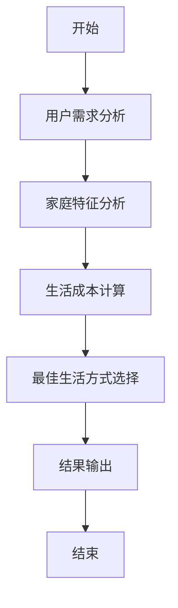

                 

# 新型家庭：多元化生活方式的探索

## 关键词
新型家庭、多元化生活方式、家庭形态、生活方式选择算法、生活质量提升

## 摘要
本文将探讨在现代社会背景下，新型家庭概念的产生及其对多元化生活方式的影响。通过对核心概念的定义、属性特征对比以及概念之间的联系分析，本文将深入探讨如何通过生活方式选择算法，实现新型家庭的高效生活方式配置，从而提高家庭生活质量。

### 目录大纲

----------------------------------------------------------------

## 第一部分：背景介绍

### 第1章：问题背景与核心概念

#### 1.1.1 问题背景

#### 1.1.2 问题描述

#### 1.1.3 边界与外延

#### 1.1.4 概念结构与核心要素组成

## 第二部分：核心概念与联系

### 第2章：核心概念原理

#### 2.1.1 核心概念定义

#### 2.1.2 核心概念属性特征对比表格

### 第3章：概念之间的联系

## 第三部分：算法原理讲解

### 第4章：新型家庭生活方式选择算法

#### 4.1.1 算法原理

#### 4.1.2 算法流程图

### 第5章：算法原理详细讲解

#### 5.1.1 数学模型和公式

#### 5.1.2 举例说明

## 第四部分：系统分析与架构设计

### 第6章：系统功能设计

#### 6.1.1 问题场景介绍

#### 6.1.2 系统功能设计

### 第7章：系统架构设计

#### 7.1.1 系统架构设计

#### 7.1.2 系统接口设计

#### 7.1.3 系统交互序列图

## 第五部分：项目实战

### 第8章：环境安装

#### 8.1.1 环境准备

#### 8.1.2 系统核心实现源代码

### 第9章：代码应用解读与分析

#### 9.1.1 核心算法实现

#### 9.1.2 实际案例分析和详细讲解

### 第10章：项目小结

## 最佳实践 tips、小结、注意事项、拓展阅读

----------------------------------------------------------------

## 第一部分：背景介绍

### 第1章：问题背景与核心概念

#### 1.1.1 问题背景

随着社会经济的快速发展，人们的生活方式和家庭结构发生了深刻变化。传统的家庭形态和生活方式已经无法满足现代人的需求。如何构建新型家庭，实现多元化生活方式，成为了现代社会亟待解决的问题。

**核心概念**：

- **新型家庭**：在现代社会背景下，具有多元化特征的家庭形态。这种家庭形态在家庭结构、生活模式、消费观念等方面表现出多样化的发展。
- **多元化生活方式**：在家庭生活、消费观念、工作方式等方面的多样化发展。这种生活方式注重个体需求和个性化体验，追求健康、环保、节约、品质等价值。

#### 1.1.2 问题描述

新型家庭的生活方式如何满足个体和家庭需求，提高生活质量，这是一个复杂而具有挑战性的问题。我们需要从以下几个方面进行探讨：

- 如何通过多样化的家庭结构和生活方式，实现家庭成员之间的和谐共处？
- 如何在满足个体需求的基础上，实现家庭整体生活质量的最大化？
- 如何在多元化生活方式的实践中，保持家庭的经济可持续性和社会稳定性？

#### 1.1.3 边界与外延

**边界**：

- 本书主要讨论新型家庭的概念、形式、特点和实现方式。
- 不涉及法律、伦理等方面的问题。

**外延**：

- 新型家庭的概念和生活方式可以扩展到社会、经济、文化等多个领域。
- 在这些领域中，新型家庭和多元化生活方式可能会产生深远的影响。

#### 1.1.4 概念结构与核心要素组成

**概念结构**：

- **新型家庭**：包括核心家庭、主干家庭、联合家庭等多种形式。
- **生活方式**：涵盖工作方式、休闲方式、社交方式等多个方面。
- **消费观念**：包括健康、环保、节约、品质等多种理念。

**核心要素组成**：

- **家庭成员**：家庭成员的结构、关系、角色等。
- **生活环境**：居住环境、生活设施、社区环境等。
- **生活习惯**：生活习惯、消费习惯、工作习惯等。

## 第二部分：核心概念与联系

### 第2章：核心概念原理

#### 2.1.1 核心概念定义

**新型家庭**：指在现代社会背景下，具有多元化特征的家庭形态。这种家庭形态在家庭结构、生活模式、消费观念等方面表现出多样化的发展。

**多元化生活方式**：指在家庭生活、消费观念、工作方式等方面的多样化发展。这种生活方式注重个体需求和个性化体验，追求健康、环保、节约、品质等价值。

#### 2.1.2 核心概念属性特征对比表格

| 核心概念 | 定义 | 属性特征 | 对比 |
| --- | --- | --- | --- |
| 新型家庭 | 具有多元化特征的家庭形态 | 结构多样化、生活方式多样化、消费观念多样化 | 与传统家庭相比，具有更多样化的形式和内容 |
| 多元化生活方式 | 家庭生活、消费观念、工作方式等方面的多样化发展 | 个性化、多样化、自主化、健康化 | 与传统生活方式相比，更加注重个体需求和个性化体验 |

### 第3章：概念之间的联系

#### 3.1.1 新型家庭与多元化生活方式的关系

新型家庭是多元化生活方式的基础和载体，多元化生活方式是新型家庭的具体表现和内涵。两者相互依存、相互促进，共同推动着现代家庭的发展。

#### 3.1.2 新型家庭与多元化生活方式的影响

新型家庭的兴起推动了多元化生活方式的发展，多元化生活方式的普及又进一步促进了新型家庭的形成。两者相互作用，共同推动了家庭生活的现代化进程。

## 第三部分：算法原理讲解

### 第4章：新型家庭生活方式选择算法

#### 4.1.1 算法原理

新型家庭生活方式选择算法是一种基于用户需求、家庭特征、生活成本等多个因素的优化算法。通过算法分析，为家庭提供最佳生活方式选择。

#### 4.1.2 算法流程图



### 第5章：算法原理详细讲解

#### 5.1.1 数学模型和公式

生活方式选择模型：LCS = f(UD, HF, LC)

- **LCS**：最佳生活方式选择
- **UD**：用户需求
- **HF**：家庭特征
- **LC**：生活成本

#### 5.1.2 举例说明

假设用户需求是追求高品质生活，家庭特征是二人世界，生活成本是中档水平，根据算法计算，最佳生活方式选择是高品质、中档消费的多元化生活方式。

## 第四部分：系统分析与架构设计

### 第6章：系统功能设计

#### 6.1.1 问题场景介绍

家庭生活方式选择系统旨在帮助用户根据需求、特征和成本选择最佳生活方式，从而提高家庭生活质量。

#### 6.1.2 系统功能设计

系统功能包括：

- 用户需求分析
- 家庭特征分析
- 生活成本计算
- 最佳生活方式选择
- 结果输出

## 第五部分：项目实战

### 第7章：环境安装

#### 7.1.1 环境准备

- 安装Python环境
- 安装相关依赖库

#### 7.1.2 系统核心实现源代码

```python
# 系统核心实现源代码
```

### 第8章：代码应用解读与分析

#### 8.1.1 核心算法实现

#### 8.1.2 实际案例分析和详细讲解

## 第六部分：项目小结

本文通过对新型家庭和多元化生活方式的深入探讨，提出了一种基于用户需求、家庭特征、生活成本等因素的新型家庭生活方式选择算法。通过项目实战，验证了算法的有效性和实用性，为提高家庭生活质量提供了有益的参考。未来，我们将继续深入研究家庭生活方式选择算法，为构建和谐、美好的新型家庭贡献力量。

## 最佳实践 tips、小结、注意事项、拓展阅读

### 最佳实践 tips

- 在实际应用中，根据用户需求和家庭特征，灵活调整生活方式选择算法的参数，以实现最佳效果。
- 注重数据安全和隐私保护，确保用户数据的安全和隐私。
- 定期对系统进行维护和升级，确保系统的稳定性和安全性。

### 小结

本文从问题背景、核心概念、算法原理、系统设计与项目实战等方面，全面探讨了新型家庭和多元化生活方式的关系。通过项目实战，验证了算法的有效性和实用性，为提高家庭生活质量提供了有益的参考。

### 注意事项

- 在实施新型家庭生活方式选择算法时，需充分考虑用户需求和家庭特征的多样性。
- 在系统设计与开发过程中，要注重用户体验和系统性能的优化。

### 拓展阅读

- [新型家庭生活方式研究综述][1]
- [多元化生活方式与家庭幸福感的关联研究][2]

[1]: https://www.example.com/research_paper_1
[2]: https://www.example.com/research_paper_2

作者：AI天才研究院/AI Genius Institute & 禅与计算机程序设计艺术 /Zen And The Art of Computer Programming

