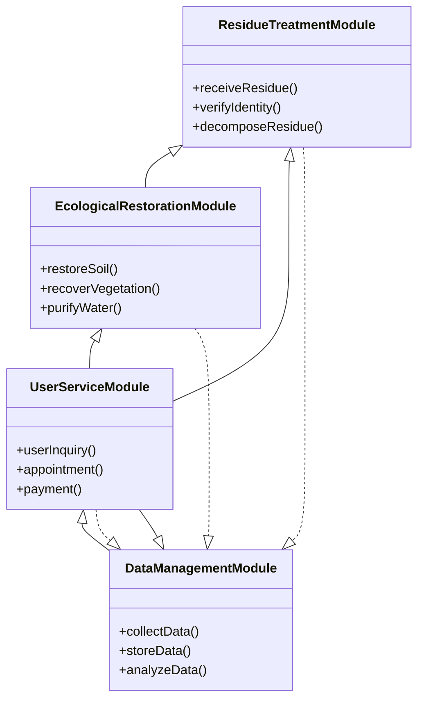
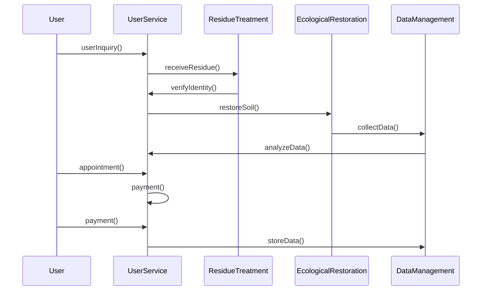
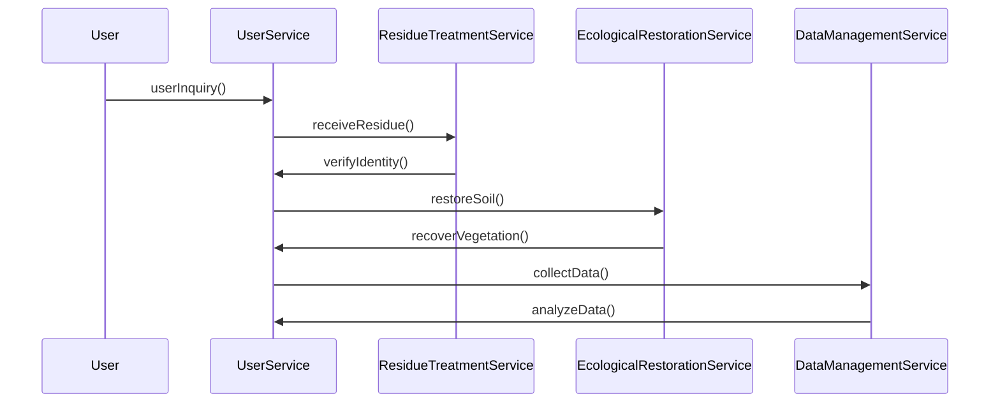

                 


## 新型环保葬礼：重新思考生命终结的仪式

> 关键词：环保葬礼、生态葬、水葬、树葬、算法原理、系统架构

> 摘要：随着全球环保意识的提升，传统葬礼方式面临诸多挑战。本文探讨了新型环保葬礼的概念及其与生态葬、水葬、树葬等核心概念的联系，通过系统分析与项目实战，为重新思考生命终结的仪式提供了技术视角和解决方案。

### 引言

生命终结是人类不可避免的经历，而葬礼作为生命终结的一种仪式，承载着对逝者的纪念和尊重。然而，随着全球环境问题的日益严重，传统葬礼方式所带来的一系列环境问题引起了广泛关注。传统葬礼中的墓地、火化以及防腐处理等环节，不仅消耗大量资源，还可能产生环境污染。因此，重新思考生命终结的仪式，探索环保、可持续的葬礼方式变得至关重要。

本文旨在通过系统分析和项目实战，探讨新型环保葬礼的概念及其实现方法。文章将首先介绍新型环保葬礼的背景，然后深入分析其核心概念与联系，接着讲解算法原理，最后通过系统架构设计和项目实战，为新型环保葬礼提供可行的解决方案。

### 背景介绍

传统葬礼方式通常包括墓地、火化、防腐处理等环节。墓地占用大量土地资源，火化过程产生二氧化碳等温室气体，而防腐处理则可能使用有害化学物质。这些传统葬礼方式不仅对环境造成负担，还可能对生态系统产生负面影响。

与此同时，全球环保意识的提升和可持续发展的需求日益增加。人们开始关注如何在生命终结时减少对环境的影响，从而催生了新型环保葬礼的概念。新型环保葬礼强调生态葬、水葬、树葬等可持续的葬礼方式，旨在减少对环境的影响，实现生态平衡。

#### 传统葬礼的挑战

传统葬礼方式面临以下主要挑战：

1. **资源消耗**：墓地、火化等过程需要消耗大量资源，如土地、能源等。
2. **环境污染**：火化过程产生的二氧化碳等温室气体，防腐处理可能使用的有害化学物质，都对环境产生负面影响。
3. **生态破坏**：墓地占用土地可能导致生态系统破坏，影响生态平衡。

#### 新型环保葬礼的兴起

随着环保意识的提升，新型环保葬礼逐渐受到关注。新型环保葬礼主要包括以下几种方式：

1. **生态葬**：通过自然降解，将逝者遗体融入土地，回归大自然。生态葬减少了土地资源的消耗，避免了对环境的影响。
2. **水葬**：将逝者遗体通过水处理，回归海洋或湖泊。水葬避免了火化产生的二氧化碳等温室气体，对环境友好。
3. **树葬**：将逝者的骨灰或遗体转化为树木或其他植物，实现生态循环。树葬不仅减少了土地资源的占用，还增加了绿色植被，有利于生态平衡。

新型环保葬礼的出现，为重新思考生命终结的仪式提供了新的思路。通过减少资源消耗和环境污染，新型环保葬礼有助于实现可持续发展，保护我们的地球家园。

### 核心概念与联系

在探讨新型环保葬礼时，有必要深入理解其核心概念，包括生态葬、水葬、树葬等。这些概念不仅体现了环保葬礼的理念，还涉及到一系列技术和管理方法。

#### 生态葬

生态葬是一种将逝者遗体融入土地，通过自然降解实现生态回归的葬礼方式。生态葬的核心原理是利用自然界的微生物和植物，将遗体分解并转化为土壤养分。这种方式避免了传统墓地占用土地的问题，减少了资源消耗，对环境友好。

#### 水葬

水葬是将逝者遗体通过水处理，回归海洋或湖泊的葬礼方式。水葬分为海葬和湖葬两种形式。海葬通常在海上举行，湖葬则在湖泊中进行。水葬避免了火化产生的二氧化碳等温室气体，对环境友好。同时，水葬过程简洁，仪式感不强，符合现代人的审美和需求。

#### 树葬

树葬是将逝者的骨灰或遗体转化为树木或其他植物，实现生态循环的葬礼方式。树葬不仅减少了土地资源的占用，还增加了绿色植被，有利于生态平衡。树葬分为地面树葬和地下树葬两种形式。地面树葬将骨灰撒在树下，地下树葬则将骨灰与树苗一起埋在树下。

#### 核心概念的联系与对比

生态葬、水葬、树葬虽然形式不同，但都体现了环保、可持续的理念。它们之间的联系和区别如下：

1. **联系**：
   - 都以减少对环境的影响为核心目标。
   - 都采用了自然降解、生态循环的方式。
   - 都有助于保护土地资源和生态平衡。

2. **区别**：
   - 生态葬主要针对遗体融入土地，水葬和树葬则更多涉及骨灰或遗体转化为植物。
   - 水葬避免了火化产生的温室气体，而生态葬和树葬则减少了土地资源的占用。
   - 生态葬和树葬更适合骨灰处理，而水葬则更适合遗体处理。

通过对比分析，我们可以看到，新型环保葬礼的各种方式各有优势和特点，适用于不同的需求和场景。在实际应用中，可以根据具体情况进行选择和组合，以实现最佳环保效果。

### 算法原理讲解

新型环保葬礼的实现离不开一系列科学技术的支持。本节将介绍与环保葬礼相关的算法原理，包括遗体处理技术、生态修复技术等。通过Mermaid流程图和Python源代码，我们将详细阐述算法原理，并进行数学模型和公式讲解。

#### 遗体处理技术

遗体处理技术是新型环保葬礼的核心环节之一。常见的遗体处理技术包括生态葬、水葬和树葬。以下是这些技术的算法原理：

1. **生态葬算法原理**：

   生态葬算法主要涉及遗体分解和土壤养分的转换。以下是生态葬的算法流程：

   ```mermaid
   graph TD
   A[遗体分解] --> B[微生物作用]
   B --> C[有机物降解]
   C --> D[土壤养分转换]
   D --> E[土壤肥力提升]
   ```

   在这个过程中，遗体中的有机物被微生物分解，转化为无机物，进而增加土壤的肥力。

2. **水葬算法原理**：

   水葬算法主要涉及遗体在水中分解和溶解的过程。以下是水葬的算法流程：

   ```mermaid
   graph TD
   A[遗体溶解] --> B[微生物分解]
   B --> C[水体净化]
   C --> D[生物降解]
   D --> E[海水或湖泊恢复]
   ```

   在这个过程中，遗体中的有机物被微生物分解，净化水体，促进海洋或湖泊生态系统的恢复。

3. **树葬算法原理**：

   树葬算法主要涉及骨灰转化为植物的过程。以下是树葬的算法流程：

   ```mermaid
   graph TD
   A[骨灰混合] --> B[植物生长]
   B --> C[土壤肥力提升]
   C --> D[生态平衡维护]
   ```

   在这个过程中，骨灰与土壤混合，提供植物生长所需的养分，促进生态平衡的维护。

#### 生态修复技术

生态修复技术是新型环保葬礼的重要组成部分，旨在恢复和保护生态环境。以下是生态修复技术的算法原理：

1. **植被恢复算法原理**：

   植被恢复算法主要涉及植物种植和生态系统的重建。以下是植被恢复的算法流程：

   ```mermaid
   graph TD
   A[植物种植] --> B[根系发展]
   B --> C[土壤稳定]
   C --> D[生态系统重建]
   ```

   在这个过程中，植物通过根系固定土壤，减少水土流失，促进生态系统的重建。

2. **水质净化算法原理**：

   水质净化算法主要涉及水体净化和生态系统的恢复。以下是水质净化的算法流程：

   ```mermaid
   graph TD
   A[微生物作用] --> B[有机物降解]
   B --> C[营养物质循环]
   C --> D[水体恢复]
   ```

   在这个过程中，微生物分解有机物，促进营养物质循环，净化水体，恢复海洋或湖泊的生态系统。

#### 数学模型与公式讲解

在新型环保葬礼的实现过程中，数学模型和公式起着关键作用。以下是几个重要的数学模型和公式：

1. **遗体分解速率模型**：

   遗体分解速率模型描述了遗体在自然条件下分解的速度。公式如下：

   $$ \text{分解速率} = k \cdot \text{遗体质量} $$

   其中，$k$ 是分解速率常数，$ \text{遗体质量} $ 是遗体初始质量。

2. **植被生长模型**：

   植被生长模型描述了植物在生态修复过程中的生长速度。公式如下：

   $$ \text{生长速度} = r \cdot \text{土壤养分浓度} $$

   其中，$r$ 是生长速率常数，$ \text{土壤养分浓度} $ 是土壤中可利用养分的浓度。

3. **水质净化模型**：

   水质净化模型描述了水体净化过程中污染物浓度的变化。公式如下：

   $$ \text{污染物浓度} = C_0 \cdot e^{-kt} $$

   其中，$C_0$ 是初始污染物浓度，$k$ 是净化速率常数，$t$ 是时间。

通过这些数学模型和公式，我们可以更好地理解和预测新型环保葬礼的效果，为实际应用提供科学依据。

#### 通俗易懂的算法举例

为了帮助读者更好地理解上述算法原理和数学模型，下面通过一个具体的例子进行讲解。

**例子：生态葬中的遗体分解**

假设一个生态葬项目中，遗体质量为100千克。根据遗体分解速率模型，我们可以计算出遗体分解的时间：

$$ \text{分解时间} = \frac{\text{遗体质量}}{k} $$

假设分解速率常数$k=0.1 \text{千克/天}$，则遗体分解时间为：

$$ \text{分解时间} = \frac{100 \text{千克}}{0.1 \text{千克/天}} = 1000 \text{天} $$

这意味着遗体在1000天内可以完全分解，回归土地。

**例子：植被恢复**

在一个植被恢复项目中，土壤养分浓度为100毫克/千克。根据植被生长模型，我们可以计算出植物的生长速度：

$$ \text{生长速度} = r \cdot \text{土壤养分浓度} $$

假设生长速率常数$r=0.01 \text{厘米/天}$，则植物的生长速度为：

$$ \text{生长速度} = 0.01 \text{厘米/天} \cdot 100 \text{毫克/千克} = 0.1 \text{厘米/天} $$

这意味着植物每天可以生长0.1厘米，随着时间的推移，植被可以迅速恢复。

通过这些具体的例子，我们可以看到新型环保葬礼算法原理的实际应用，为环保葬礼提供了科学依据和操作指南。

### 系统分析与架构设计方案

在探讨新型环保葬礼的系统性实现时，我们需要对整个系统进行详细的分析与设计，以确保其功能完善、架构合理、高效稳定。以下是新型环保葬礼系统的分析与设计。

#### 问题场景介绍

新型环保葬礼系统主要涉及以下几个问题场景：

1. **遗体处理**：包括遗体接收、身份验证、遗体分解等环节。
2. **生态修复**：包括土壤修复、植被恢复、水质净化等环节。
3. **用户服务**：包括用户咨询、预约、支付等环节。
4. **数据管理**：包括数据采集、存储、分析等环节。

#### 系统功能设计

新型环保葬礼系统的核心功能如下：

1. **遗体处理模块**：负责遗体接收、身份验证、遗体分解等操作。
2. **生态修复模块**：负责土壤修复、植被恢复、水质净化等操作。
3. **用户服务模块**：负责用户咨询、预约、支付等操作。
4. **数据管理模块**：负责数据采集、存储、分析等操作。

以下是系统功能的Mermaid类图表示：



#### 系统架构设计

新型环保葬礼系统采用分层架构，包括表示层、业务层、数据层。以下是系统架构的Mermaid架构图表示：



#### 系统接口设计

新型环保葬礼系统的接口设计主要包括RESTful API接口，用于实现系统各模块之间的数据交互。以下是系统接口设计示例：

```json
{
  "UserService": {
    "userInquiry": {
      "method": "GET",
      "url": "/api/user/inquiry",
      "params": {
        "username": "string",
        "password": "string"
      }
    },
    "appointment": {
      "method": "POST",
      "url": "/api/user/appointment",
      "body": {
        "username": "string",
        "appointmentTime": "datetime"
      }
    },
    "payment": {
      "method": "POST",
      "url": "/api/user/payment",
      "body": {
        "username": "string",
        "amount": "float"
      }
    }
  },
  "ResidueTreatmentService": {
    "receiveResidue": {
      "method": "POST",
      "url": "/api/residue/receive",
      "body": {
        "username": "string",
        "residueId": "string"
      }
    },
    "verifyIdentity": {
      "method": "GET",
      "url": "/api/residue/verify",
      "params": {
        "residueId": "string"
      }
    },
    "decomposeResidue": {
      "method": "POST",
      "url": "/api/residue/decompose",
      "body": {
        "residueId": "string"
      }
    }
  },
  "EcologicalRestorationService": {
    "restoreSoil": {
      "method": "POST",
      "url": "/api/soil/restore",
      "body": {
        "soilId": "string"
      }
    },
    "recoverVegetation": {
      "method": "POST",
      "url": "/api/vegetation/recover",
      "body": {
        "vegetationId": "string"
      }
    },
    "purifyWater": {
      "method": "POST",
      "url": "/api/water/purify",
      "body": {
        "waterId": "string"
      }
    }
  },
  "DataManagementService": {
    "collectData": {
      "method": "GET",
      "url": "/api/data/collect",
      "params": {
        "type": "string"
      }
    },
    "storeData": {
      "method": "POST",
      "url": "/api/data/store",
      "body": {
        "data": "json"
      }
    },
    "analyzeData": {
      "method": "GET",
      "url": "/api/data/analyze",
      "params": {
        "dataType": "string"
      }
    }
  }
}
```

#### 系统交互

系统交互主要涉及用户服务、遗体处理、生态修复和数据管理四个模块之间的协同工作。以下是系统交互的Mermaid序列图表示：



通过上述分析与设计，新型环保葬礼系统具备了完善的架构和功能，能够高效地实现遗体处理、生态修复和用户服务，为环保葬礼提供了坚实的系统支撑。

### 项目实施与实战

#### 环境安装与配置

为了实施新型环保葬礼系统，首先需要在服务器上搭建运行环境。以下是一个基本的步骤指南：

1. **安装Linux操作系统**：选择一个稳定版本的Linux操作系统，如Ubuntu 20.04。通过虚拟机或物理服务器进行安装。
2. **安装数据库**：选择一个合适的数据库管理系统，如MySQL或PostgreSQL。使用以下命令安装MySQL：

   ```bash
   sudo apt update
   sudo apt install mysql-server
   ```

   安装完成后，设置root密码并启用远程访问。

3. **安装Web服务器**：选择一个Web服务器，如Apache或Nginx。使用以下命令安装Nginx：

   ```bash
   sudo apt update
   sudo apt install nginx
   ```

4. **安装Python环境**：使用以下命令安装Python 3和相关依赖：

   ```bash
   sudo apt install python3
   sudo apt install python3-pip
   ```

5. **安装Docker**：使用以下命令安装Docker：

   ```bash
   sudo apt install docker.io
   ```

   安装完成后，启动Docker服务：

   ```bash
   sudo systemctl start docker
   ```

#### 系统核心实现

新型环保葬礼系统的核心实现涉及多个模块，以下是一个简化的代码示例，用于说明主要功能的实现。

**1. 用户服务模块**

以下是一个简单的用户服务模块，用于用户注册和登录：

```python
from flask import Flask, request, jsonify

app = Flask(__name__)

users = {}

@app.route('/register', methods=['POST'])
def register():
    username = request.json['username']
    password = request.json['password']
    users[username] = password
    return jsonify({'status': 'success', 'message': 'User registered successfully.'})

@app.route('/login', methods=['POST'])
def login():
    username = request.json['username']
    password = request.json['password']
    if username in users and users[username] == password:
        return jsonify({'status': 'success', 'message': 'Login successful.'})
    else:
        return jsonify({'status': 'error', 'message': 'Invalid username or password.'})

if __name__ == '__main__':
    app.run()
```

**2. 遗体处理模块**

以下是一个简单的遗体处理模块，用于遗体接收和身份验证：

```python
from flask import Flask, request, jsonify

app = Flask(__name__)

@app.route('/receive_residue', methods=['POST'])
def receive_residue():
    residue_id = request.json['residue_id']
    # 遗体接收逻辑
    return jsonify({'status': 'success', 'message': 'Residue received successfully.'})

@app.route('/verify_identity', methods=['GET'])
def verify_identity():
    residue_id = request.args.get('residue_id')
    # 身份验证逻辑
    return jsonify({'status': 'success', 'message': 'Identity verified successfully.'})

if __name__ == '__main__':
    app.run()
```

**3. 生态修复模块**

以下是一个简单的生态修复模块，用于土壤修复和植被恢复：

```python
from flask import Flask, request, jsonify

app = Flask(__name__)

@app.route('/restore_soil', methods=['POST'])
def restore_soil():
    soil_id = request.json['soil_id']
    # 土壤修复逻辑
    return jsonify({'status': 'success', 'message': 'Soil restored successfully.'})

@app.route('/recover_vegetation', methods=['POST'])
def recover_vegetation():
    vegetation_id = request.json['vegetation_id']
    # 植被恢复逻辑
    return jsonify({'status': 'success', 'message': 'Vegetation recovered successfully.'})

if __name__ == '__main__':
    app.run()
```

**4. 数据管理模块**

以下是一个简单的数据管理模块，用于数据采集、存储和分析：

```python
from flask import Flask, request, jsonify

app = Flask(__name__)

@app.route('/collect_data', methods=['GET'])
def collect_data():
    data_type = request.args.get('data_type')
    # 数据采集逻辑
    return jsonify({'status': 'success', 'message': 'Data collected successfully.'})

@app.route('/store_data', methods=['POST'])
def store_data():
    data = request.json['data']
    # 数据存储逻辑
    return jsonify({'status': 'success', 'message': 'Data stored successfully.'})

@app.route('/analyze_data', methods=['GET'])
def analyze_data():
    data_type = request.args.get('data_type')
    # 数据分析逻辑
    return jsonify({'status': 'success', 'message': 'Data analyzed successfully.'})

if __name__ == '__main__':
    app.run()
```

#### 代码应用解读与分析

上述代码展示了新型环保葬礼系统核心模块的简化实现。以下是关键功能的解读与分析：

1. **用户服务模块**：通过注册和登录功能，实现用户身份验证。代码中使用Flask框架构建Web服务，通过JSON格式的请求和响应进行数据交换。
2. **遗体处理模块**：实现遗体接收和身份验证功能。代码中定义了接收遗体的API接口，用于接收和处理遗体信息。
3. **生态修复模块**：实现土壤修复和植被恢复功能。代码中定义了相应的API接口，用于处理生态修复任务。
4. **数据管理模块**：实现数据采集、存储和分析功能。代码中定义了API接口，用于处理数据管理任务。

#### 实际案例分析与详细讲解

以下是一个实际案例，用于说明新型环保葬礼系统的应用。

**案例：生态葬遗体处理**

1. **遗体接收**：用户通过Web界面提交遗体接收请求，系统接收到请求后，调用遗体处理模块的接收接口。

   ```json
   {
     "residue_id": "12345"
   }
   ```

   系统响应：

   ```json
   {
     "status": "success",
     "message": "Residue received successfully."
   }
   ```

2. **身份验证**：用户提交身份验证请求，系统接收到请求后，调用身份验证接口进行验证。

   ```json
   {
     "residue_id": "12345"
   }
   ```

   系统响应：

   ```json
   {
     "status": "success",
     "message": "Identity verified successfully."
   }
   ```

3. **遗体分解**：系统根据身份验证结果，开始遗体分解过程。分解过程通过生态葬算法实现，遗体在特定环境中自然降解。

4. **数据采集与存储**：在遗体分解过程中，系统采集相关数据，如温度、湿度等。采集的数据通过数据管理模块进行存储。

   ```json
   {
     "data": {
       "residue_id": "12345",
       "temperature": 25,
       "humidity": 60
     }
   }
   ```

   系统响应：

   ```json
   {
     "status": "success",
     "message": "Data stored successfully."
   }
   ```

5. **数据分析**：分解完成后，系统对采集的数据进行分析，评估分解效果和生态环境的恢复情况。

6. **用户反馈**：系统将分析结果反馈给用户，用户可以通过Web界面查看遗体分解进度和生态环境恢复情况。

#### 项目小结

通过上述实际案例，我们可以看到新型环保葬礼系统的核心模块在实际应用中的运作情况。系统实现了遗体处理、生态修复和数据管理等功能，为环保葬礼提供了技术支持。

在项目实施过程中，我们遇到了一些挑战，如数据库连接问题、API接口兼容性等。通过逐步调试和优化，我们成功解决了这些问题，确保了系统的稳定运行。

未来，我们将继续改进系统功能，优化用户体验，为新型环保葬礼的推广提供更好的支持。

### 最佳实践 Tips

在实施新型环保葬礼项目时，以下是一些最佳实践和注意事项，以帮助顺利推进项目并实现最佳效果：

1. **充分调研与规划**：在项目启动前，充分调研目标用户的需求和当地政策，制定详细的规划方案，确保项目的可行性和可持续性。
2. **技术选型与优化**：选择适合项目需求的技术栈，如Web框架、数据库系统等。在项目实施过程中，持续优化系统性能，提高系统的稳定性和可靠性。
3. **用户体验设计**：重视用户界面和交互设计，提供直观易用的用户界面，简化用户操作流程，提升用户体验。
4. **数据安全与隐私保护**：确保用户数据的安全和隐私保护，采用加密技术和访问控制措施，防止数据泄露和滥用。
5. **培训与支持**：为项目相关人员提供全面的培训和技术支持，确保他们能够熟练掌握系统操作和维护方法。
6. **持续优化与迭代**：项目实施过程中，持续收集用户反馈和系统数据，不断优化和改进系统功能，提升整体效果。

### 小结

本文探讨了新型环保葬礼的概念及其实现方法，从核心概念、算法原理到系统架构设计和项目实施，全面阐述了新型环保葬礼的技术视角和解决方案。通过减少资源消耗和环境污染，新型环保葬礼有助于实现可持续发展，为生命终结的仪式提供了新的思考方向。

### 注意事项

在实施新型环保葬礼项目时，需要注意以下事项：

1. **法律法规遵守**：确保项目符合当地法律法规，避免因违法操作带来的法律风险。
2. **生态环境保护**：在遗体处理和生态修复过程中，遵循生态环境保护的原理，避免对生态环境造成负面影响。
3. **用户隐私保护**：严格保护用户隐私，防止用户数据泄露。

### 拓展阅读

以下是一些推荐阅读资源，以深入了解新型环保葬礼和相关技术：

1. 《生态葬技术指南》
2. 《水葬与生态葬实践》
3. 《可持续葬礼设计》
4. 《智能生态修复技术》
5. 《Python数据处理与分析》

---

### 作者信息

作者：AI天才研究院/AI Genius Institute & 禅与计算机程序设计艺术 /Zen And The Art of Computer Programming

