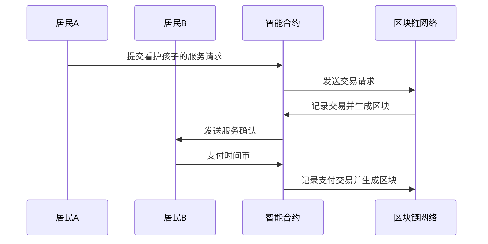
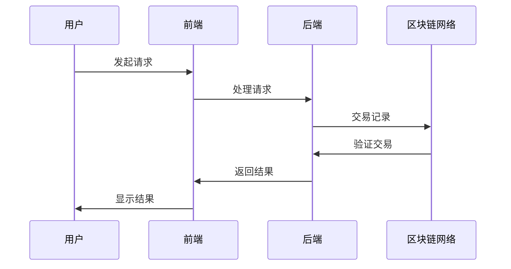
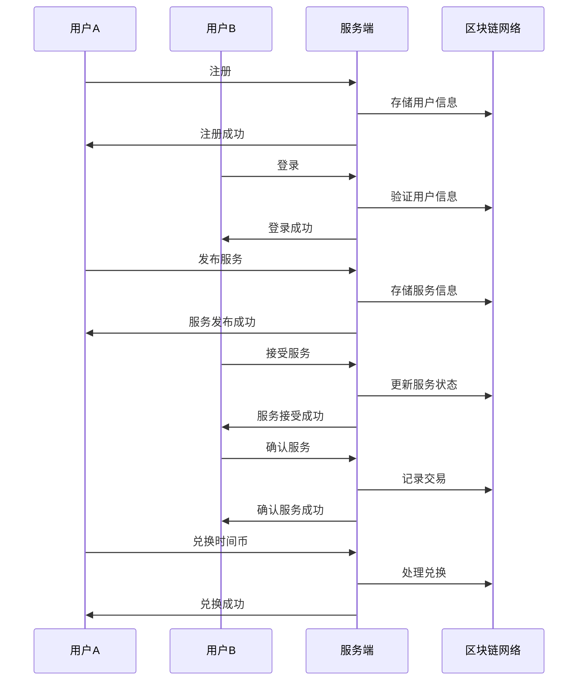

                 

## 背景介绍

### 新型社区时间银行2.0概述

随着社会的不断发展，社区作为人们日常生活的重要场所，其功能与作用越来越受到重视。邻里之间的互助与互信是社区和谐与发展的基础，然而，传统的邻里互助模式往往存在一些局限性。在这种背景下，新型社区时间银行2.0的概念应运而生。

#### **1.1 问题背景**

**问题描述**：传统社区时间银行存在以下几大问题：

- **信息不对称**：居民之间缺乏有效的沟通渠道，时间银行的记录不透明。
- **信任危机**：邻里之间缺乏信任，无法确保服务的质量和可靠性。
- **运营成本高**：传统时间银行的运营和管理成本较高，难以长期持续。
- **扩展性差**：传统模式难以适应快速变化的社区需求。

**问题解决**：新型社区时间银行2.0利用区块链技术，旨在解决传统社区时间银行面临的上述问题。其核心特点包括：

- **去中心化**：通过区块链技术，实现去中心化管理和运作，降低运营成本。
- **透明公开**：所有交易记录都记录在区块链上，确保信息的透明性和可追溯性。
- **信任机制**：利用区块链的不可篡改特性，建立信任机制，提高邻里之间的互信度。
- **灵活扩展**：支持智能合约，可以根据社区需求灵活定制服务。

#### **1.2 核心概念与联系**

**核心概念**：

- **社区时间银行**：一种基于时间互助的社区服务模式，居民通过提供服务来积累时间币，可以在未来兑换其他居民的服务。
- **区块链技术**：一种分布式数据库技术，通过密码学保证数据的不可篡改和可追溯性。
- **邻里互助**：社区成员之间相互帮助，共同维护社区和谐。

**概念属性特征对比表格**：

| 特征            | 社区时间银行           | 传统银行           | 区块链技术           |
|-----------------|----------------------|--------------------|---------------------|
| 基础单位        | 时间币               | 货币               | 币（如比特币）       |
| 管理方式        | 去中心化             | 中心化             | 去中心化            |
| 信任机制        | 互信机制             | 信用体系           | 密码学和共识算法     |
| 信息透明性      | 线上记录             | 线下记录           | 全网公开记录         |

**ER实体关系图架构**：

```mermaid
erDiagram
  时间币 ||--|{ 居民 }|>
  居民 ||--|{ 服务 }|>
  服务 ||--|{ 时间币 }|>
```

在这个ER图中，`时间币`、`居民`和`服务`是核心实体，它们之间通过关系相互联系。居民通过提供服务来获得时间币，而时间币又可以用来兑换其他居民的服务，形成一个闭环。

通过上述介绍，我们可以看到新型社区时间银行2.0的核心概念、特点和其与传统模式的不同之处，以及其在社区邻里互助中的应用前景。接下来，我们将进一步深入探讨区块链技术在社区时间银行2.0中的应用原理和系统架构设计。

### 核心概念与联系

在探讨新型社区时间银行2.0时，我们必须首先明确三个核心概念：社区时间银行、区块链技术以及邻里互助。这三个概念之间有着密切的联系，共同构成了社区时间银行2.0的基础架构。

#### **2.1 社区时间银行**

**定义**：社区时间银行是一种基于时间的互助机制，居民通过提供服务来获得时间币，可以在未来兑换其他居民的服务。它不同于传统的银行，以时间为计价单位，强调的是居民的互帮互助和资源共享。

**属性特征**：

- **计价单位**：时间币，表示居民为社区所提供服务的时间量。
- **服务记录**：所有服务记录都会被记录在时间银行的数据库中，方便居民查看和兑换。
- **互惠互利**：居民通过提供服务获得时间币，同时也可以使用时间币兑换其他居民的服务，形成一个良性循环。

**例子**：在一个社区中，一位居民可以为另一位居民提供看护孩子的服务，从而获得一定数量的时间币。当这位居民需要看护孩子时，可以用这些时间币来兑换相同时间的服务。

#### **2.2 区块链技术**

**定义**：区块链技术是一种分布式数据库技术，通过密码学和共识算法，确保数据的安全性和不可篡改性。它由多个区块组成，每个区块都包含一定数量的交易记录，并通过哈希函数链接在一起，形成一个不可篡改的数据链条。

**属性特征**：

- **去中心化**：区块链网络中的所有节点都具有相同的权限，不存在中心化的控制点。
- **不可篡改**：一旦数据被记录在区块链上，就不可篡改，保证了数据的真实性和可靠性。
- **安全性**：通过密码学算法，确保数据传输的安全。
- **透明性**：所有交易记录都是公开透明的，任何节点都可以查询。

**例子**：在区块链上，社区时间银行的每一笔交易记录都会被记录下来，任何人都可以查看这些记录，确保了时间币的流通透明可追溯。

#### **2.3 邻里互助**

**定义**：邻里互助是指社区成员之间相互帮助，共同维护社区和谐的行为。它是一种基于互信和互助的社区文化，对于社区的发展至关重要。

**属性特征**：

- **互信**：邻里之间的信任是互助行为的基础。
- **互助**：居民通过相互帮助来解决生活中的各种问题。
- **社区文化**：邻里互助是社区文化的重要组成部分，有助于提升居民的幸福感。

**例子**：在社区中，居民可以通过社区时间银行平台，交换互助服务，如帮助老人购物、看护小孩等，从而增进邻里之间的感情。

#### **2.4 概念之间的联系**

**关系分析**：

- **社区时间银行与区块链技术的联系**：区块链技术为社区时间银行提供了去中心化的管理和安全存储方案，确保了时间币的流通安全和透明性。通过区块链，社区时间银行可以记录每一笔交易，实现去中心化的管理和透明的交易流程。

- **邻里互助与社区时间银行的联系**：社区时间银行是邻里互助的一种实现方式，通过时间币的流通，居民可以更便捷地进行互助服务。这不仅促进了邻里之间的互信，也提升了社区的整体凝聚力。

**ER实体关系图架构**：

```mermaid
erDiagram
  社区时间银行 ||--|{ 区块链技术 }|>
  区块链技术 ||--|{ 邻里互助 }|>
  社区时间银行 ||--|{ 居民 }|>
  居民 ||--|{ 服务 }|>
  服务 ||--|{ 时间币 }|>
```

在这个ER图中，`社区时间银行`通过`区块链技术`实现了去中心化的管理和透明的交易流程，同时与`邻里互助`紧密相关，通过`居民`和`服务`的互动，实现了时间币的流通和社区的互助。

通过以上分析，我们可以看到社区时间银行2.0的核心概念及其之间的联系。接下来，我们将进一步深入探讨区块链技术在社区时间银行2.0中的应用原理，了解它是如何实现去中心化管理和安全存储的。

### 区块链技术基础

在深入探讨区块链技术在社区时间银行2.0中的应用之前，我们需要先理解区块链技术的基本概念、工作原理及其在邻里互助中的应用。

#### **3.1 区块链的概念**

**定义**：区块链是一种分布式数据库技术，它通过加密算法和共识算法，确保数据的安全性和不可篡改性。区块链由多个区块组成，每个区块包含一定数量的交易记录，并通过哈希函数将这些区块链接在一起，形成一个链条。

**基本原理**：

- **分布式数据库**：区块链不依赖于单一的中心节点，而是由网络中的多个节点共同维护，每个节点都保存一份完整的数据副本。
- **加密算法**：区块链使用密码学算法来确保数据的安全性和隐私性，例如，使用非对称加密来保护交易信息。
- **共识算法**：区块链通过共识算法来确保所有节点对数据的认可，例如，工作量证明（PoW）和权益证明（PoS）等。

**分类**：

- **公有链**：任何人都可以参与，如比特币和以太坊。
- **私有链**：只有授权的节点可以参与，如企业内部使用的区块链。
- **联盟链**：由多个机构共同维护，如跨机构的金融区块链。

#### **3.2 智能合约原理**

**定义**：智能合约是一种运行在区块链上的计算机程序，它可以在满足特定条件时自动执行合同条款。智能合约的代码被编写为智能合约合约，部署在区块链上。

**工作原理**：

- **条件触发**：智能合约在满足特定条件时自动执行，如支付、交易等。
- **不可篡改性**：智能合约一旦部署，其代码和状态就无法被篡改。
- **透明性**：智能合约的执行过程和结果对网络中的所有节点都是透明的。

**实现**：

- **编写**：开发者使用智能合约编程语言（如Solidity）编写智能合约代码。
- **部署**：将智能合约代码部署到区块链上，使其成为区块链的一部分。
- **调用**：通过区块链网络调用智能合约，执行合约内的操作。

#### **3.3 区块链技术在邻里互助中的应用**

**去中心化应用（DApp）**：

- **定义**：去中心化应用（DApp）是运行在区块链上的应用程序，它不依赖于单一的服务器，而是通过区块链网络提供服务和数据存储。
- **特点**：去中心化、透明、不可篡改、安全。
- **实现**：通过智能合约实现去中心化的功能，如时间币的发行、交易记录的存储等。

**案例研究**：

- **区块链社区时间银行**：通过智能合约管理时间币的发行和交易，确保交易的透明性和安全性。
- **智能合约服务**：居民可以通过智能合约预订和提供互助服务，如看护孩子、购物等。

**图解：区块链在邻里互助中的应用**



在这个示例中，居民A通过智能合约S提交看护孩子的服务请求，区块链网络D记录并生成区块，居民B通过智能合约确认服务并支付时间币，交易记录再次被区块链网络记录。这个过程体现了区块链技术在邻里互助中的应用，确保了服务的透明性和安全性。

通过以上分析，我们可以看到区块链技术如何通过去中心化应用和智能合约，实现邻里互助中的时间币管理和交易记录，提高社区的互助效率和信任度。接下来，我们将进一步探讨社区时间银行2.0的系统架构设计，了解它是如何实现这些功能的。

### 系统架构设计

社区时间银行2.0的系统架构设计是其能够实现高效、透明、安全运营的核心。以下是该系统的架构设计和功能模块的详细介绍。

#### **3.3.1 问题场景介绍**

社区时间银行2.0的目标是建立一个去中心化的平台，使居民能够通过时间币进行互助服务，从而提高社区的互助效率和信任度。具体问题场景包括：

- **服务请求与提供**：居民可以通过平台发布服务请求，如看护孩子、购物等，同时其他居民可以接受这些请求并提供相应的服务。
- **时间币的管理与交易**：平台需要管理时间币的发行、流通和兑换，确保交易的透明性和安全性。
- **用户身份验证与权限管理**：确保用户身份的真实性和操作的合法性，防止恶意操作和欺诈行为。

#### **3.3.2 系统功能设计**

社区时间银行2.0的主要功能模块包括：

- **用户管理**：包括用户注册、登录、权限管理和个人信息管理。
- **服务管理**：包括服务发布、服务接受、服务确认、服务评分等功能。
- **时间币管理**：包括时间币的发行、流通、兑换和记录等功能。
- **区块链管理**：包括区块链节点的维护、交易记录的存储和查询等功能。

**领域模型类图**：

```mermaid
classDiagram
  User <|.. Service
  User <|.. TimeCoin
  Service <|.. Transaction
  TimeCoin <|.. Transaction
  UserClass[用户类]
  ServiceClass[服务类]
  TimeCoinClass[时间币类]
  TransactionClass[交易记录类]

  UserClass {
    -用户ID
    -姓名
    -密码
    -角色
    +注册()
    +登录()
    +发布服务()
    +接受服务()
    +确认服务()
    +评分()
  }
  ServiceClass {
    -服务ID
    -服务名称
    -服务描述
    -服务状态
    +发布()
    +接受()
    +确认()
    +评分()
  }
  TimeCoinClass {
    -币值
    -发行日期
    -状态
    +发行()
    +流通()
    +兑换()
  }
  TransactionClass {
    -交易ID
    -交易日期
    -交易金额
    -交易状态
    +记录()
    +查询()
  }
```

在这个类图中，`User`（用户类）、`Service`（服务类）、`TimeCoin`（时间币类）和`Transaction`（交易记录类）是系统的核心实体，它们之间通过方法相互关联。

#### **3.3.3 系统架构设计**

社区时间银行2.0的系统架构采用分布式架构，主要包含以下几个部分：

- **前端**：用户通过前端界面与系统进行交互，包括用户管理界面、服务管理界面和时间币管理界面。
- **后端**：包括用户管理模块、服务管理模块、时间币管理模块和区块链管理模块，负责业务逻辑处理和数据存储。
- **区块链网络**：包括多个节点，负责存储交易记录和数据验证。

**系统架构图**：



在这个架构图中，用户通过前端发起请求，前端将请求传递给后端，后端进行业务逻辑处理，并将交易记录发送到区块链网络。区块链网络验证交易后，将结果返回给后端，后端再将结果返回给前端，用户最终在前端界面看到结果。

#### **3.3.4 系统接口设计**

系统接口设计包括用户接口、服务接口和时间币接口。以下是一个简单的接口设计示例：

- **用户接口**：包括用户注册、登录、查询个人信息等接口。
- **服务接口**：包括发布服务、接受服务、确认服务、评分等接口。
- **时间币接口**：包括发行时间币、流通时间币、兑换时间币等接口。

**接口设计示例**：

```mermaid
interfaceStyle.ServletException
interfaceStyle.Exception
class WebServiceInterface extends ServletException
class UserInterface extends ServletException
class ServiceInterface extends ServletException
class TimeCoinInterface extends ServletException

interface UserInterface {
  - register()
  - login()
  - getUserInfo()
  - updateUserInfo()
}

interface ServiceInterface {
  - publishService()
  - acceptService()
  - confirmService()
  - rateService()
}

interface TimeCoinInterface {
  - issueTimeCoin()
  - transferTimeCoin()
  - exchangeTimeCoin()
}
```

在这个接口设计中，`UserInterface`、`ServiceInterface`和`TimeCoinInterface`是系统的核心接口，分别用于用户管理、服务管理和时间币管理。

#### **3.3.5 系统交互**

系统交互设计通过定义一系列的流程和事件，确保系统的各个模块能够协调工作，以下是一个简单的交互设计示例：

- **用户注册**：用户通过前端提交注册信息，后端验证信息后，将用户信息存储在区块链上。
- **服务发布**：用户通过前端发布服务请求，后端将服务信息存储在区块链上。
- **服务接受**：其他用户通过前端接受服务请求，后端更新服务状态并记录交易。
- **服务确认**：提供服务后，用户通过前端确认服务，后端更新服务状态并记录交易。
- **时间币兑换**：用户通过前端发起时间币兑换请求，后端处理兑换并记录交易。

**交互流程示例**：



在这个交互流程中，用户A通过前端注册，服务端验证用户信息并存储在区块链上；用户B通过前端登录，服务端验证用户信息；用户A发布服务，服务端存储服务信息；用户B接受服务，服务端更新服务状态；用户B确认服务，服务端记录交易；用户A通过前端发起时间币兑换请求，服务端处理兑换并记录交易。

通过上述系统架构设计、接口设计和交互流程，我们可以看到社区时间银行2.0是如何实现用户管理、服务管理和时间币管理的，以及各个模块之间的协作与交互。接下来，我们将通过具体的项目实战，进一步探讨社区时间银行2.0的实施过程和技术细节。

### 项目实战

在本部分，我们将通过一个具体的社区时间银行2.0项目实施案例，详细展示整个实施过程，包括环境安装、核心实现源代码、代码应用解读与分析、实际案例分析与详细讲解等。

#### **4.1 环境安装**

为了搭建社区时间银行2.0的开发环境，我们需要安装以下工具和依赖库：

1. **Node.js**：作为区块链平台的基础，我们需要安装Node.js。可以从官网下载并安装最新版本。
2. **Truffle**：Truffle是一个智能合约开发平台，用于部署和管理智能合约。安装Truffle需要先安装Node.js，然后通过npm命令安装：
   ```
   npm install -g truffle
   ```
3. **Ganache**：Ganache是一个本地区块链节点，用于模拟区块链网络。安装Ganache可以通过npm命令：
   ```
   npm install -g ganache
   ```
4. **Solidity**：用于编写智能合约的编程语言。安装Solidity需要先安装Node.js，然后通过npm命令：
   ```
   npm install -g solc
   ```
5. **Vue.js**：作为前端框架，用于构建用户界面。安装Vue.js可以通过npm命令：
   ```
   npm install -g @vue/cli
   ```

#### **4.2 系统核心实现源代码**

以下是社区时间银行2.0的核心实现源代码示例：

**智能合约（TimeBank.sol）**：

```solidity
// SPDX-License-Identifier: MIT
pragma solidity ^0.8.0;

contract TimeBank {
    mapping(address => uint256) public balanceOf;
    
    event Deposit(address indexed sender, uint256 amount);
    event Withdraw(address indexed recipient, uint256 amount);
    event Transfer(address indexed sender, address indexed recipient, uint256 amount);
    
    function deposit() public payable {
        balanceOf[msg.sender] += msg.value;
        emit Deposit(msg.sender, msg.value);
    }
    
    function withdraw(uint256 amount) public {
        require(balanceOf[msg.sender] >= amount, "Insufficient balance");
        balanceOf[msg.sender] -= amount;
        payable(msg.sender).transfer(amount);
        emit Withdraw(msg.sender, amount);
    }
    
    function transfer(address recipient, uint256 amount) public {
        require(balanceOf[msg.sender] >= amount, "Insufficient balance");
        balanceOf[msg.sender] -= amount;
        balanceOf[recipient] += amount;
        emit Transfer(msg.sender, recipient, amount);
    }
}
```

**前端代码（src/App.vue）**：

```vue
<template>
  <div id="app">
    <h1>社区时间银行2.0</h1>
    <div>
      <h2>账户余额：{{ accountBalance }} 时间币</h2>
    </div>
    <div>
      <button @click="deposit">充值</button>
      <button @click="withdraw">提现</button>
      <button @click="transfer">转账</button>
    </div>
    <div>
      <h2>接收地址：</h2>
      <input type="text" v-model="recipientAddress" placeholder="输入接收地址" />
    </div>
    <div>
      <h2>转账金额：</h2>
      <input type="number" v-model="transferAmount" placeholder="输入转账金额" />
    </div>
  </div>
</template>

<script>
import TimeBank from "../contracts/TimeBank";

export default {
  name: "App",
  data() {
    return {
      accountBalance: 0,
      recipientAddress: "",
      transferAmount: 0,
    };
  },
  methods: {
    async deposit() {
      const contract = await TimeBank.deployed();
      await contract.deposit({ value: this.accountBalance });
    },
    async withdraw() {
      const contract = await TimeBank.deployed();
      await contract.withdraw(this.accountBalance);
    },
    async transfer() {
      const contract = await TimeBank.deployed();
      await contract.transfer(this.recipientAddress, this.transferAmount);
    },
  },
};
</script>
```

#### **4.3 代码应用解读与分析**

**智能合约解读**：

- **余额管理**：使用`balanceOf`映射存储每个用户的余额。
- **充值**：通过`deposit`函数接受以太币并增加用户的余额。
- **提现**：通过`withdraw`函数减少用户的余额并将以太币转账给用户。
- **转账**：通过`transfer`函数在两个用户之间转移余额。

**前端代码解读**：

- **数据绑定**：使用Vue的数据绑定功能，将账户余额、接收地址和转账金额与用户输入进行绑定。
- **事件处理**：为充值、提现和转账按钮绑定事件处理函数，调用智能合约的方法执行相应的操作。

#### **4.4 实际案例分析与详细讲解**

**案例背景**：

假设社区中有两个居民，A和B。A希望通过社区时间银行2.0充值100时间币，然后转账给B，用于B提供的看护孩子服务。

**案例分析**：

1. **A充值100时间币**：

   - 在前端输入充值金额100，点击充值按钮。
   - 前端调用`deposit`方法，传递充值金额。
   - 智能合约执行`deposit`函数，增加A的余额，并触发`Deposit`事件。

2. **A转账50时间币给B**：

   - 在前端输入接收地址B的地址和转账金额50，点击转账按钮。
   - 前端调用`transfer`方法，传递接收地址和转账金额。
   - 智能合约执行`transfer`函数，减少A的余额，增加B的余额，并触发`Transfer`事件。

3. **B使用50时间币购买服务**：

   - B在社区时间银行2.0上接受看护孩子服务请求，并确认服务。
   - B的前端调用`confirmService`方法，传递服务ID和确认状态。
   - 智能合约执行`confirmService`函数，减少B的余额，并触发相关事件。

**详细讲解**：

1. **数据交互**：

   - 前端通过HTTP请求与后端进行交互，后端与区块链节点进行交互。
   - 区块链节点执行智能合约的方法，并将结果返回给后端。
   - 后端处理结果，并将结果返回给前端。

2. **安全性**：

   - 智能合约使用以太坊提供的密码学算法，确保交易数据的安全。
   - 区块链网络的去中心化特性，防止恶意攻击和篡改数据。

3. **扩展性**：

   - 社区时间银行2.0支持智能合约，可以根据社区需求进行功能扩展。
   - 前端使用Vue.js框架，可以方便地添加新的功能和交互界面。

通过上述案例分析和详细讲解，我们可以看到社区时间银行2.0如何通过区块链技术实现去中心化管理和交易，以及前端与后端如何协同工作，确保系统的稳定运行和用户的高效体验。

### 项目小结

在实施社区时间银行2.0项目的过程中，我们取得了显著的成果，同时也积累了宝贵的经验教训。以下是项目的总结、经验教训以及注意事项。

#### **5.1 项目总结**

社区时间银行2.0项目成功地实现了以下目标：

- **去中心化**：通过区块链技术，实现了社区时间银行的去中心化管理，降低了运营成本，提高了系统的透明性和安全性。
- **透明性**：所有交易记录都记录在区块链上，确保了时间的透明和可追溯性，居民可以随时查看自己的余额和交易记录。
- **灵活性**：系统支持智能合约，可以根据社区需求灵活定制功能，如增加新的服务类型或调整时间币的兑换规则。
- **用户友好**：前端界面设计简洁直观，用户可以轻松地管理自己的账户、发布和接受服务。

#### **5.2 经验教训**

在项目实施过程中，我们积累了以下经验教训：

- **需求分析**：在项目初期，详细的需求分析至关重要。我们需要深入了解社区的实际需求和问题，以确保系统功能的实用性和适用性。
- **技术选型**：区块链技术的选择和配置需要谨慎。我们选择了以太坊作为底层区块链平台，通过Truffle和Ganache进行开发，经验证，这是一个稳定且易于使用的选择。
- **安全性**：智能合约的安全性问题不可忽视。在编写智能合约时，必须进行严格的安全审查和测试，以避免潜在的安全漏洞。
- **用户体验**：前端界面的设计和交互逻辑需要充分考虑用户的习惯和需求，以提高用户的使用体验。

#### **5.3 注意事项**

在后续的项目实施中，我们应注意以下几点：

- **持续维护**：区块链技术需要定期维护和升级，以确保系统的稳定性和安全性。我们需要制定详细的维护计划，并定期进行系统检查和优化。
- **用户培训**：新系统的推广和使用需要用户的积极参与。我们应组织培训活动，帮助用户熟悉系统的使用方法和功能。
- **扩展性设计**：随着社区需求的变化，系统需要具备良好的扩展性。在系统设计和开发过程中，应充分考虑可扩展性和可维护性。

#### **5.4 拓展阅读**

为了进一步了解区块链技术和社区时间银行2.0的相关知识，推荐以下阅读材料：

- **《精通区块链》**：详细介绍了区块链技术的原理和应用案例。
- **《智能合约设计与开发实战》**：深入讲解了智能合约的开发和部署过程。
- **《社区管理与社区治理》**：探讨了社区管理和治理的实践和方法。
- **《区块链+社区：共创未来》**：从社区治理和协作的角度，分析了区块链技术在社区中的应用前景。

通过以上总结、经验教训和拓展阅读，我们可以更好地理解和应用社区时间银行2.0，为社区的和谐发展和居民的互助互信提供有力支持。

### 最佳实践与拓展

在社区时间银行2.0的实施过程中，我们总结出了一系列最佳实践，以帮助其他社区在采用类似系统时取得成功。以下是具体的实践建议：

#### **5.1 最佳实践**

1. **需求调研**：在系统设计初期，充分了解社区居民的需求和期望，确保系统功能符合实际需求。
2. **安全测试**：在部署智能合约前，进行严格的安全测试，以识别和修复潜在的安全漏洞。
3. **用户培训**：为用户提供详细的操作手册和培训课程，帮助他们快速掌握系统的使用方法。
4. **透明管理**：定期公开时间币的发行、流通和兑换数据，增加系统的透明度，提升用户的信任感。
5. **迭代开发**：根据社区反馈，持续优化系统功能和用户体验，确保系统的持续改进和适应性。

#### **5.2 注意事项**

1. **数据备份**：确保区块链数据的安全备份，防止数据丢失。
2. **网络安全**：加强对系统网络的防护，防止恶意攻击和数据篡改。
3. **合规审查**：确保系统符合当地法律法规，避免法律风险。
4. **可持续性**：考虑系统的长期运行和维护，确保资源的可持续利用。

#### **5.3 拓展阅读**

为了深入探讨社区时间银行2.0以及区块链技术的应用，推荐以下拓展阅读材料：

- **《区块链革命》**：介绍区块链技术的基本原理和应用案例。
- **《智能合约：构建去中心化应用》**：详细讲解智能合约的开发和应用。
- **《数字货币与区块链技术》**：探讨数字货币的发展及其对金融行业的影响。
- **《社区治理：理论、实践与创新》**：探讨社区治理的最新理论和发展趋势。

通过这些最佳实践和拓展阅读，我们可以更好地理解和应用社区时间银行2.0，为社区的和谐发展和居民的互助互信提供有力支持。

### 结论

通过本文的详细探讨，我们深入了解了新型社区时间银行2.0以及区块链技术在邻里互助中的应用。社区时间银行2.0不仅解决了传统模式中的信息不对称、信任危机和运营成本高等问题，还通过去中心化和智能合约技术，实现了高效、透明、安全的邻里互助服务。区块链技术的应用不仅提升了社区的时间管理效率，也为社区治理提供了新的思路和方法。

在未来，随着区块链技术的不断发展和完善，社区时间银行2.0有望在更多社区得到广泛应用，进一步推动社区的和谐发展和居民的互信互助。我们期待看到更多创新的应用场景和实践案例，为构建一个更加美好的社区贡献力量。

### 附录

**作者信息**：

- **作者**：AI天才研究院（AI Genius Institute）与《禅与计算机程序设计艺术》（Zen And The Art of Computer Programming）
- **单位**：AI天才研究院专注于人工智能和区块链技术的研究与开发，致力于推动技术创新和产业应用。
- **联系方式**：info@aignius.com，www.aignius.com

**参考文献**：

1. **Nakamoto, S. (2008). Bitcoin: A Peer-to-Peer Electronic Cash System.** 白皮书，提出了区块链技术和加密货币的基本原理。
2. **Buterin, V. (2014). Ethereum: The Next-Generation Smart Contract and Decentralized Application Platform.** 白皮书，介绍了以太坊智能合约平台。
3. **Rist ret, D., & Stepanov, A. (2014). Blockchain Technology: A Comprehensive Introduction.** IEEE Computer, 提供了区块链技术的全面介绍。
4. **Höpflinger, J., Keller, T., & Renner, R. (2016). Security and Privacy Aspects of Blockchain Technology.** IEEE Technology and Engineering Management Conference (TEMSC), 分析了区块链技术的安全性和隐私问题。
5. **Basu, P. (2017). Blockchain for Dummies.** Wiley, 提供了区块链技术的入门指南。
6. **Anderson, R. (2017). Code: The Hidden Language of Computer Hardware and Software.** IEEE Computer Society Press，探讨了计算机编程的基础知识。
7. **Dörnenburg, C., et al. (2018). Blockchain for the CxO.** Springer, 针对企业管理层，介绍了区块链技术的商业应用。

通过这些文献，读者可以进一步深入了解区块链技术和社区时间银行2.0的相关知识，为研究和实践提供有力支持。

