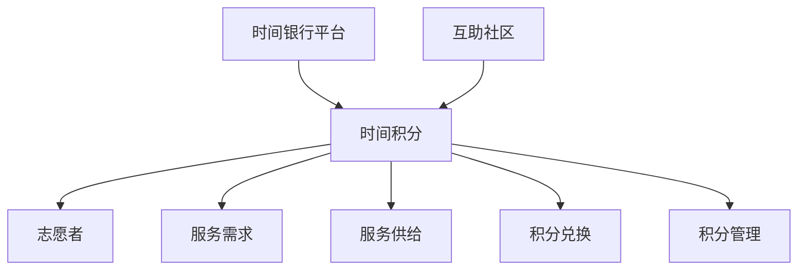

                 

### 摘要

本文将探讨新型社区时间银行这一创新模式，旨在通过重塑邻里互助的方式，提升社区治理效率，促进社区商业发展。首先，我们将介绍时间银行的基本概念、起源与发展，接着深入剖析新型社区时间银行的核心理念，包括其目标、原则和核心机制。随后，文章将详细探讨新型社区时间银行在邻里互助服务、社区治理和社区商业等领域的应用场景，并通过实际案例进行说明。接下来，我们将讨论新型社区时间银行的设计与实施原则、流程以及运营管理策略。最后，本文将分析新型社区时间银行的挑战与未来发展趋势，并提出相应的建议与策略。通过本文的探讨，希望为社区治理与商业发展提供新的思路和启示。### 第一部分：背景与基础

### 第1章：时间银行的概念与起源

#### 1.1 时间银行的定义与特点

时间银行，顾名思义，是一种以时间为货币的交换体系。其基本原理是，参与者将自己拥有的时间技能或服务提供给社区，并在帮助他人的同时获得相应的时间积分。这些积分可以在将来用于兑换他人的帮助。时间银行不仅鼓励个人之间的互助，还能有效地整合社区资源，提高社区的整体福利。

时间银行的特点主要体现在以下几个方面：

1. **互助性**：时间银行的核心在于互助，参与者通过交换时间服务来实现互帮互助，减少了依赖外部援助的情况。
2. **灵活性**：时间银行服务的形式多样，包括技能传授、家务帮工、心理咨询等，参与者可以根据自己的特长和需求进行选择。
3. **可持续性**：时间银行通过积分制度保证了服务的持续性，参与者可以在需要时使用自己积累的积分，从而形成一个良性的循环体系。

#### 1.2 时间银行的历史与发展

时间银行的概念最早可以追溯到1970年代的美国。由朱迪思·奥尔特曼（Judith Orloff）提出，并在阿姆斯特丹首次试验。随着时间的推移，时间银行在全球范围内得到了广泛的推广和应用。

在国际上，时间银行的发展可分为几个阶段：

1. **早期阶段**：以个人志愿者活动为主，缺乏统一的制度和管理。
2. **发展阶段**：时间银行逐渐形成了一套完善的运作机制，包括积分系统、志愿者管理等。
3. **成熟阶段**：时间银行开始与政府、非政府组织和社区组织合作，形成了更加广泛的网络。

在我国，时间银行的发展也经历了类似的历程。近年来，随着社会问题的日益凸显，时间银行作为一种创新的社区治理模式，得到了广泛关注和推广。许多城市和社区纷纷建立了时间银行，开展了各种互助服务活动。

#### 1.3 时间银行与传统互助模式的比较

传统互助模式通常是基于人际关系和道德伦理的，其特点是自发性和不规范性。而时间银行则通过制度化、规范化的方式，将互助行为转化为可量化的积分，使得互助行为更加高效、可持续。

具体来说，时间银行与传统互助模式的区别主要体现在以下几个方面：

1. **组织形式**：时间银行是一个有组织的社区服务系统，而传统互助模式则更多依赖于个人的自发行为。
2. **积分机制**：时间银行通过积分制度来记录和衡量互助行为，而传统互助模式通常没有这样的量化手段。
3. **服务范围**：时间银行的服务范围广泛，涵盖了各种生活服务，而传统互助模式则更多局限于特定的关系圈子。

综上所述，时间银行作为一种创新的社区互助模式，不仅具有独特的优势，还在全球范围内得到了广泛的应用和发展。在新型社区治理和商业发展中，时间银行具有巨大的潜力。### 第2章：新型社区时间银行的核心理念

#### 2.1 新型社区时间银行的目标

新型社区时间银行的主要目标是通过构建一个互助共享的平台，促进社区成员之间的相互帮助，提高社区的凝聚力和居民的幸福感。具体而言，这些目标包括：

1. **促进社区凝聚力**：通过时间银行的互助机制，让居民之间建立更加紧密的联系，增强社区归属感。
2. **提升居民参与度**：鼓励居民积极参与社区事务，通过互助服务增强居民对社区事务的关注和投入。
3. **优化社区资源利用**：通过整合社区内的资源，提高资源利用效率，减少资源浪费。
4. **促进社会和谐**：通过互助服务，缓解社会矛盾，促进社会和谐稳定。

#### 2.2 新型社区时间银行的原则

为了实现上述目标，新型社区时间银行遵循以下几项核心原则：

1. **平等互助**：所有人都是时间银行的参与者，无论年龄、性别、职业或社会地位，都能在平台上获得帮助和提供帮助。
2. **公开透明**：所有交易记录都应公开透明，确保参与者的权益得到保障，同时也增加时间银行的信任度。
3. **可持续发展**：时间银行应注重长期发展，不断优化运营模式，确保其可持续性和生命力。
4. **社会责任**：时间银行应承担起社会责任，关注弱势群体的需求，为他们提供更多帮助。

#### 2.3 新型社区时间银行的核心机制

新型社区时间银行的核心机制主要包括积分制度、服务平台建设和服务内容拓展三个方面。

1. **积分制度**

积分制度是时间银行的核心，通过积分来衡量参与者提供的帮助和获得的帮助。积分的获取和消耗都有严格的规定：

- **积分获取**：参与者通过提供自己的时间或技能获得积分，例如，为社区做一次清洁工作可以获得一定积分。
- **积分消耗**：参与者可以在需要时使用积分来兑换他人的帮助，例如，需要一次心理咨询可以消耗相应的积分。

2. **服务平台建设**

服务平台是时间银行运作的基础，它包括线上平台和线下实体两部分：

- **线上平台**：用于发布互助信息、记录积分和交易记录，提供便捷的互助服务。
- **线下实体**：提供实际的服务场所，如社区服务中心、时间银行服务中心等，方便居民进行面对面交流和互助。

3. **服务内容拓展**

为了满足不同居民的需求，新型社区时间银行的服务内容应不断拓展：

- **生活服务**：包括家政服务、养老护理、心理咨询等，满足居民的基本生活需求。
- **专业技能服务**：如法律咨询、技术支持等，为居民提供专业的服务。
- **教育服务**：如教育讲座、技能培训等，提升居民的综合素质。

通过这些核心机制，新型社区时间银行能够有效促进邻里互助，提升社区治理效率，同时也为社区商业的发展提供了新的机遇。### 第3章：邻里互助服务

#### 3.1 邻里互助服务的需求分析

邻里互助服务作为社区治理的重要组成部分，其需求源自社区居民日常生活中遇到的种种挑战。以下是对邻里互助服务需求的详细分析：

1. **基本生活需求**：随着老龄化问题的加剧，越来越多的老年人需要日常生活照顾，如购物、做饭、洗衣等。此外，独居老人和残疾人士也面临类似的挑战。
2. **情感需求**：现代社会的快节奏生活使得居民之间的交流变得稀少，邻里之间缺乏情感交流和关怀。通过邻里互助服务，可以增进居民之间的情感联系，提升社区归属感。
3. **专业技能需求**：许多居民在日常生活中会遇到各种技术问题，如家电维修、网络故障等。邻里互助服务可以为居民提供专业的技术支持，解决他们的实际问题。
4. **社会参与需求**：社区活动是居民参与社会生活的重要途径。邻里互助服务可以组织各种社区活动，鼓励居民积极参与，增强社区凝聚力。

#### 3.2 新型社区时间银行在邻里互助服务中的应用

新型社区时间银行在邻里互助服务中的应用具有显著优势，通过以下方式实现：

1. **积分激励**：参与者通过提供帮助获得积分，这些积分可以用来兑换他人的服务，形成良性的互助循环。例如，一位居民可以为邻居打扫卫生，获得相应积分，将来需要帮助时可以消耗这些积分。
2. **平台便捷**：新型社区时间银行通过线上平台提供便捷的服务发布和预约渠道，居民可以随时发布需求或提供帮助，节省了沟通和协调的时间。
3. **服务多样化**：时间银行提供了多种互助服务，如家政服务、心理咨询、法律咨询等，满足了居民多样化的需求。
4. **社区共建**：时间银行鼓励居民积极参与社区建设，通过互助服务增强居民的参与感和责任感，提升社区的凝聚力。

#### 3.3 邻里互助服务的案例研究

以下是几个典型的邻里互助服务案例，展示了新型社区时间银行在实际应用中的成效：

1. **北京某小区**：该小区建立了一支由志愿者组成的邻里互助队伍，通过时间银行平台发布互助信息。居民们可以通过平台预约志愿者提供的各种服务，如家政服务、心理咨询等。该服务不仅解决了居民的实际问题，还大大提升了社区的凝聚力。
2. **上海某社区**：该社区推出“时间租赁”模式，居民可以将自己的时间技能出租给其他居民，如教授外语、修理电器等。通过时间银行积分制度，居民们可以用自己的积分兑换他人的服务，实现了技能和资源的共享。
3. **广州某社区**：该社区结合时间银行与社区活动，定期举办各种互助活动，如社区义诊、技能培训等。这些活动不仅满足了居民的需求，还增强了居民之间的互动和联系。

这些案例表明，新型社区时间银行在邻里互助服务中具有强大的应用潜力，可以有效提升社区治理水平，促进社区的和谐发展。### 第4章：社区治理

#### 4.1 社区治理中的问题与挑战

社区治理是现代城市管理的重要组成部分，然而，在实际操作中，社区治理面临着诸多问题和挑战。

1. **资源分配不均**：社区资源分配的不均衡导致一些社区在设施、服务和资金上存在明显的差距，影响了社区的整体发展。
2. **居民参与度低**：许多社区居民对社区事务缺乏参与，导致社区治理缺乏民众基础，难以形成有效的治理机制。
3. **信息透明度不足**：社区治理过程中的信息透明度不足，容易导致决策的不公正和居民的不信任。
4. **治理效率低下**：社区治理过程中存在程序繁琐、反应迟缓等问题，影响了治理的效率和效果。
5. **安全与卫生问题**：社区安全和环境卫生是居民生活质量的重要指标，但在实际管理中，这些问题往往得不到足够的重视和有效的解决。

#### 4.2 新型社区时间银行在社区治理中的应用

新型社区时间银行作为一种创新的治理模式，可以在解决上述问题与挑战中发挥重要作用。

1. **促进资源整合**：通过时间银行，社区可以整合内部资源，如人力资源、技能资源等，提高资源利用效率，减少资源浪费。
2. **提高居民参与度**：时间银行通过积分激励机制，鼓励居民积极参与社区治理，提高居民的参与感和责任感。
3. **增强信息透明度**：时间银行的线上平台可以公开透明地记录和展示互助服务和积分情况，增加社区治理的透明度和公正性。
4. **提升治理效率**：时间银行通过简化的服务流程和便捷的服务渠道，提高了社区治理的效率和响应速度。
5. **改善安全与卫生**：通过时间银行，社区可以组织居民参与安全巡查和环境卫生整治，提高社区的安全水平和卫生状况。

#### 4.3 社区治理的案例研究

以下是一些成功的社区治理案例，展示了新型社区时间银行在解决社区问题中的实际效果：

1. **深圳某社区**：该社区通过时间银行平台，组织居民参与社区安全巡查和环境保护活动。居民通过提供服务获得积分，这些积分可以用来兑换生活服务，如家电维修、心理咨询等。这种模式不仅提高了社区的安全水平，还增强了居民的参与感和社区凝聚力。
2. **杭州某社区**：该社区建立了时间银行志愿服务队伍，定期开展社区服务活动，如义诊、法律咨询、环保宣传等。通过时间银行积分制度，居民可以为自己的志愿服务获得积分，并在需要时使用这些积分兑换他人的服务。这种模式有效提高了社区治理的效率和居民的满意度。
3. **成都某社区**：该社区利用时间银行平台，整合社区内的志愿者资源，提供各种互助服务，如家政服务、养老护理等。时间银行不仅解决了居民的实际问题，还促进了社区内部的资源共享和互帮互助，提高了社区的治理水平和居民的幸福指数。

这些案例表明，新型社区时间银行在社区治理中的应用具有广阔的前景和显著的效果。通过创新治理模式，可以有效解决社区治理中的问题与挑战，推动社区的和谐发展。### 第5章：社区商业

#### 5.1 社区商业的需求与现状

随着城市化进程的加快，社区商业作为居民日常生活的重要部分，其需求日益增长。社区商业的需求主要体现在以下几个方面：

1. **便利性**：居民希望社区商业能够提供便捷的生活服务，如超市购物、餐饮服务等，以节省时间和精力。
2. **多样性**：居民对社区商业的需求具有多样性，包括日常消费品、休闲娱乐、文化教育等，以满足不同层次、不同年龄段居民的需求。
3. **品质**：居民越来越重视消费品质，对商品和服务的要求越来越高，希望社区商业能够提供高品质的商品和服务。
4. **价格**：尽管价格不是唯一考虑因素，但合理的价格仍然能够吸引更多的居民，提升社区商业的竞争力。

当前，社区商业的现状存在一些问题，如：

1. **同质化竞争**：许多社区商业项目缺乏特色，同质化现象严重，难以吸引居民。
2. **服务不足**：一些社区商业项目在服务方面存在不足，如缺乏专业管理、服务质量不稳定等。
3. **运营成本高**：社区商业项目的运营成本较高，导致部分项目难以持续发展。

#### 5.2 新型社区时间银行在社区商业中的应用

新型社区时间银行在社区商业中的应用，可以有效解决上述问题，提升社区商业的发展水平。以下是新型社区时间银行在社区商业中的几种应用模式：

1. **积分购物**：居民可以通过参与社区活动或提供志愿服务获得积分，这些积分可以在社区商业项目中兑换商品或服务，提高居民的参与度和消费意愿。
2. **互助租赁**：居民可以将自己的闲置物品（如电器、家具等）通过时间银行平台进行租赁，从而减少购买新物品的成本，同时满足其他居民的需求。
3. **技能交换**：居民可以通过时间银行平台交换专业技能，如维修、烹饪等，降低消费成本，提高社区资源利用效率。
4. **商业联盟**：社区商业项目可以通过与时间银行合作，推出一系列优惠活动和积分奖励措施，吸引更多居民参与，提升商业项目的知名度和竞争力。

#### 5.3 社区商业的案例研究

以下是一些成功的社区商业案例，展示了新型社区时间银行在提升社区商业发展中的实际效果：

1. **上海某社区**：该社区通过时间银行平台，组织居民参与社区商业项目的促销活动，如打折、积分兑换等。居民通过参与活动获得积分，可以在社区商业项目中兑换商品或服务。这种模式不仅提高了居民的参与度，还增加了社区商业的销售额。
2. **广州某社区**：该社区引入时间银行模式，鼓励居民将闲置物品进行租赁，如自行车、电器等。通过时间银行平台，居民可以方便地租赁和使用他人的物品，减少了购买新物品的成本。这种模式有效提高了社区资源的利用效率，促进了社区商业的发展。
3. **成都某社区**：该社区通过时间银行平台，组织居民进行技能交换活动，如维修、烹饪等。居民可以通过交换技能获得积分，这些积分可以在社区商业项目中使用，从而降低了消费成本。这种模式不仅提高了居民的技能水平，还促进了社区商业的多元化发展。

这些案例表明，新型社区时间银行在社区商业中的应用具有显著的优势，可以有效提升社区商业的发展水平，满足居民多样化的需求。通过创新社区商业模式，可以推动社区商业的可持续发展。### 第6章：新型社区时间银行的设计原则

#### 6.1 设计原则与目标

在设计和实施新型社区时间银行时，需要遵循一系列原则，以确保其能够有效地促进社区互助、提高治理效率、并推动社区商业的发展。以下是一些关键的设计原则和目标：

1. **用户导向**：设计应以满足用户需求为核心，确保所有功能和服务都能方便、高效地满足居民的需求。
2. **简单易用**：界面设计应简洁直观，易于居民理解和操作，减少技术门槛，提高用户的参与度。
3. **透明公正**：系统应确保所有交易记录公开透明，以增加用户的信任度和满意度。
4. **灵活可扩展**：系统设计应具备良好的灵活性，能够根据社区需求的变化进行扩展和优化。
5. **数据安全**：保护用户数据和隐私是设计的重中之重，必须采取有效的安全措施，防止数据泄露和滥用。
6. **可持续性**：时间银行的运营模式应可持续，确保其能够长期运行，并为社区带来持久的益处。

#### 6.2 设计过程中的注意事项

在设计和实施新型社区时间银行的过程中，需要注意以下几个方面：

1. **需求分析**：深入了解居民的实际需求，包括他们期望的服务类型、使用场景和操作习惯等。
2. **平台选择**：选择适合的在线平台和数据库系统，确保系统的高效稳定运行。
3. **界面设计**：界面设计应注重用户体验，确保用户能够轻松完成操作，减少使用障碍。
4. **功能规划**：明确系统所需的功能模块，如注册、登录、发布需求、提供服务、积分管理、交易记录等。
5. **系统集成**：确保时间银行系统与其他社区管理系统的无缝集成，提高系统的整体效能。
6. **培训与支持**：为居民提供必要的培训和支持，帮助他们快速熟悉和使用时间银行系统。

#### 6.3 设计工具与方法

在新型社区时间银行的设计过程中，可以使用多种工具和方法，以实现设计目标并提高设计效率。以下是一些常用的工具和方法：

1. **需求分析工具**：如问卷调查、访谈、用户观察等，用于收集和分析居民的需求。
2. **原型设计工具**：如Axure、Figma等，用于创建用户界面原型和交互设计。
3. **系统建模工具**：如Mermaid、UML建模工具等，用于构建系统的实体关系图、类图和序列图。
4. **编程与开发工具**：如Python、Java、Django等，用于实现系统的功能模块和后端服务。
5. **项目管理工具**：如Trello、Jira等，用于管理和跟踪项目的进度和任务分配。
6. **测试与验证工具**：如JUnit、Selenium等，用于测试系统的功能和性能，确保系统的可靠性和稳定性。

通过科学的设计原则和有效的设计工具与方法，新型社区时间银行可以更好地满足居民的需求，提升社区治理水平，推动社区商业的发展。### 第7章：新型社区时间银行的实施流程

#### 7.1 实施流程与步骤

新型社区时间银行的实施是一个系统性工程，需要经过多个关键步骤，以确保项目能够顺利进行并达到预期效果。以下是实施流程的主要步骤：

1. **需求调研**：首先，要对社区的需求进行全面的调研，了解居民对于时间银行的需求、期望和痛点。可以通过问卷调查、访谈、实地考察等方式收集数据。
2. **方案设计**：根据需求调研的结果，设计出时间银行的具体实施方案，包括平台架构、功能模块、积分制度等。这一阶段需要结合社区的具体情况，确保方案的可行性和适应性。
3. **平台开发**：根据设计方案，开发时间银行平台。开发过程中要注重用户体验，确保系统界面简洁易用，功能模块齐全。
4. **试点运行**：在开发完成后，选择一个社区进行试点运行。试点运行期间，要收集用户反馈，及时进行调整和优化。
5. **推广普及**：试点运行成功后，将经验推广到其他社区，并逐步扩大时间银行的服务范围和参与人数。
6. **持续优化**：在推广过程中，要持续收集用户反馈，对平台进行优化升级，确保其能够持续满足居民的需求。

#### 7.2 需求调研与评估

需求调研与评估是新型社区时间银行实施的第一步，也是至关重要的一步。以下是需求调研和评估的关键环节：

1. **确定调研对象**：调研对象应包括社区内的不同群体，如老年人、年轻人、家庭主妇等，以确保调研结果具有代表性。
2. **调研方法**：可以采用问卷调查、访谈、观察等方法，获取居民对于时间银行的需求、期望和意见。问卷调查可以设计成纸质问卷或在线问卷，访谈可以采用面对面或电话访谈的方式。
3. **数据分析**：收集到数据后，要进行系统的分析，找出居民的主要需求和痛点。可以通过统计方法、图表分析等方式，将数据转化为有价值的洞察。
4. **评估标准**：评估标准应包括需求满足度、用户体验、平台稳定性、安全性能等方面。通过这些标准，可以评估时间银行方案的实施效果。
5. **调整与优化**：根据评估结果，对方案进行必要的调整和优化，确保方案能够更好地满足居民的需求。

#### 7.3 项目管理与执行

在新型社区时间银行的实施过程中，项目管理和执行是确保项目顺利推进的关键环节。以下是项目管理与执行的关键要素：

1. **项目计划**：制定详细的项目计划，明确项目的目标、任务、时间表和资源分配。项目计划应包括项目启动、需求调研、方案设计、平台开发、试点运行、推广普及等阶段。
2. **团队组织**：组建专业的项目团队，明确团队成员的职责和角色。项目团队成员应包括项目经理、开发人员、测试人员、市场推广人员等。
3. **任务分配**：根据项目计划和团队组织结构，将任务分配给相应的团队成员。确保每个成员都明确自己的职责和任务，并了解整个项目的进展情况。
4. **进度监控**：定期监控项目的进度，确保各项任务按时完成。可以通过项目管理工具（如Jira、Trello等）来跟踪任务的进展情况。
5. **风险管理**：识别项目中可能的风险，并制定相应的应对措施。例如，针对技术难题，可以提前安排技术培训或寻求外部技术支持。
6. **质量保证**：在项目执行过程中，要注重质量保证，确保平台的功能、性能和安全性达到预期标准。通过严格的测试和评估，确保系统稳定可靠。
7. **沟通协调**：确保团队成员之间、项目团队与其他部门之间保持良好的沟通和协调，及时解决项目中出现的问题和冲突。

通过科学的项目管理和严格的执行，新型社区时间银行项目可以确保按照计划顺利推进，最终实现预期的目标。### 第8章：新型社区时间银行的运营与管理

#### 8.1 运营管理与组织架构

新型社区时间银行的运营管理是确保其长期可持续发展的关键。为此，需要建立健全的组织架构和运营管理机制。

1. **组织架构**：新型社区时间银行的运营管理应分为三个层次：决策层、管理层和执行层。
   - **决策层**：负责制定整体战略和规划，由社区委员会或理事会组成。
   - **管理层**：负责具体运营管理，包括平台维护、活动策划、人员培训等，由项目经理和运营经理组成。
   - **执行层**：负责日常操作和具体服务提供，由志愿者和服务提供者组成。

2. **职责分工**：明确各层次和各岗位的职责，确保工作高效有序。例如，项目经理负责整体项目的规划和执行，运营经理负责平台的日常运营和管理，志愿者和服务提供者负责具体的服务提供。

#### 8.2 运营策略与激励机制

为了确保新型社区时间银行能够持续有效地运营，需要制定科学合理的运营策略和激励机制。

1. **用户参与策略**：
   - **宣传推广**：通过社区公告、社交媒体、宣传册等多种渠道，广泛宣传新型社区时间银行的理念和优势，提高居民的认知度和参与意愿。
   - **活动策划**：定期举办各类活动，如志愿者培训、互助分享会、技能交换市集等，增强居民的参与感和归属感。
   - **奖励制度**：设立积分奖励制度，鼓励居民积极参与时间和技能的交换，提升居民的参与热情。

2. **激励机制**：
   - **积分奖励**：居民通过参与互助服务可以获得积分，积分可以在社区内的商家进行兑换或抵扣消费，提高居民的参与积极性。
   - **荣誉表彰**：对积极参与和贡献突出的居民进行表彰和奖励，如颁发荣誉证书、举办表彰活动等，增强居民的荣誉感和成就感。
   - **互助联盟**：建立互助联盟，将积极参与居民组成互助小组，通过小组间的互助合作，提升整体社区的服务水平。

#### 8.3 运营监控与评估

为了确保新型社区时间银行的运营效果和持续改进，需要建立完善的运营监控和评估体系。

1. **运营监控**：
   - **数据监控**：通过平台系统记录居民的参与情况、积分交易情况等数据，定期进行数据分析和监控。
   - **服务质量监控**：建立服务质量监控机制，对提供服务的志愿者进行定期评估，确保服务质量。

2. **评估指标**：
   - **参与度**：通过居民参与时间和技能交换的频率、积分获取和消耗情况来衡量。
   - **满意度**：通过居民满意度调查来评估时间银行的服务质量和用户体验。
   - **服务质量**：通过对服务提供者的评价和反馈来衡量服务质量。

3. **评估与改进**：
   - **定期评估**：定期对时间银行的运营情况进行全面评估，根据评估结果找出存在的问题和不足。
   - **持续改进**：根据评估结果，制定改进措施，对运营策略、激励机制和服务流程等进行优化和改进。

通过完善的运营管理和监控评估体系，新型社区时间银行可以确保其长期有效运营，为社区治理和商业发展提供持续的动力和支持。### 第9章：成功案例分析与启示

#### 9.1 成功案例介绍

在新型社区时间银行的实践过程中，全球各地涌现出了许多成功的案例，它们不仅展示了时间银行模式在提升社区治理和促进社区商业方面的潜力，还为其他社区提供了宝贵的经验和启示。

1. **北京某社区**：北京的一个老旧小区通过建立时间银行，有效提升了居民的生活质量。社区内的居民通过时间银行平台交换各种服务，如家政服务、法律咨询、心理咨询等。时间银行的积分制度激励居民积极参与社区事务，增强了社区的凝聚力。

2. **上海某社区**：上海的这一案例中，时间银行与社区商业紧密结合，推出了“积分购物”模式。居民通过参与社区活动或提供志愿服务获得积分，这些积分可以在社区内的超市、餐厅等商家进行兑换，不仅降低了消费成本，还促进了社区商业的发展。

3. **美国某城市**：美国某城市的时间银行项目通过线上平台和线下实体相结合的方式，为居民提供了丰富的互助服务。居民可以通过平台预约志愿者提供的各种服务，如家庭维修、养老护理等。该项目的成功经验在于其高效的运作机制和居民的高度参与。

#### 9.2 案例分析

通过对上述成功案例的深入分析，我们可以总结出以下几点关键因素：

1. **居民参与度**：成功的时间银行项目往往能够激发居民的参与热情，让居民感受到自己在社区中的价值和作用。通过积分激励、荣誉表彰等手段，提升居民的参与度和忠诚度。

2. **服务多样化**：时间银行项目提供了多样化的服务内容，满足了居民的不同需求。从日常生活服务到专业技能服务，时间银行项目涵盖了居民的各个方面需求，提高了项目的吸引力。

3. **透明公正**：时间银行项目的运营过程公开透明，所有交易记录都可通过平台查询，增强了居民的信任感。透明公正的运营机制是项目成功的关键。

4. **灵活可扩展**：成功的时间银行项目具备良好的灵活性，能够根据社区需求的变化进行调整和扩展。这种灵活性保证了项目的持续发展。

5. **社区支持**：成功的时间银行项目得到了社区的广泛支持，包括社区委员会、社区企业和居民的积极参与。社区的支持为项目提供了坚实的保障。

#### 9.3 启示与展望

成功案例为我们提供了宝贵的经验，以下是新型社区时间银行未来发展的一些建议：

1. **加强宣传推广**：通过多种渠道和方式，加强新型社区时间银行的宣传推广，提高居民对项目的认知度和参与意愿。

2. **完善积分制度**：优化积分制度，确保其公平、透明，激励居民积极参与时间和技能的交换。

3. **拓展服务内容**：根据居民需求，不断拓展服务内容，提高项目的吸引力和实用性。

4. **建立合作机制**：与社区企业、非政府组织等建立合作机制，共同推动时间银行项目的发展。

5. **持续评估与改进**：定期对项目进行评估和改进，确保项目能够持续满足居民需求，提高项目运营效率。

6. **推动政策支持**：积极推动政府出台相关政策，为新型社区时间银行提供政策和资金支持，推动项目在全国范围内的推广和应用。

通过以上措施，新型社区时间银行将在社区治理和商业发展中发挥更加重要的作用，为构建和谐、可持续的社区环境贡献力量。### 第10章：挑战与未来发展趋势

#### 10.1 挑战与问题

尽管新型社区时间银行在提升社区治理和促进社区商业方面具有显著优势，但在实际推广和应用过程中仍面临诸多挑战和问题：

1. **技术难题**：新型社区时间银行需要依赖现代信息技术，如大数据、区块链等，技术实现的复杂性和高昂的成本是推广过程中的一大障碍。

2. **用户接受度**：部分居民可能对新型社区时间银行的理念和模式持怀疑态度，缺乏足够的认知和信任，影响项目的普及。

3. **运营成本**：时间银行平台的建设和运营需要大量资金支持，对于资金紧张的社区来说，维持项目的长期运行是一个挑战。

4. **法律和政策支持**：现有的法律法规和政策对时间银行的规范和支持尚不充分，需要政府和社会各界共同努力，制定相应的法律法规和政策框架。

5. **信息安全**：时间银行平台涉及居民个人信息和交易记录，确保信息安全是项目成功的关键，任何信息泄露都可能对居民造成损失。

#### 10.2 未来发展趋势

面对上述挑战，新型社区时间银行的发展趋势可以从以下几个方面展开：

1. **技术融合与创新**：随着人工智能、大数据、区块链等技术的不断进步，新型社区时间银行将在这些技术的支持下实现更高效、更安全的运营。例如，区块链技术可以提高交易记录的透明度和安全性，而人工智能可以优化用户匹配和推荐。

2. **政策支持与推广**：政府应加大对新型社区时间银行的扶持力度，通过出台相关政策、提供财政支持等手段，推动项目在全国范围内的推广和应用。

3. **社区参与与合作**：社区应积极鼓励居民参与时间银行的运营和管理，同时与其他社会组织、企业建立合作机制，共同推动项目的发展。

4. **积分体系的完善**：通过不断优化积分体系，确保其公平、透明，提高居民的参与度和满意度。可以引入第三方评估机制，对积分进行独立审核，增加公信力。

5. **可持续发展战略**：注重时间银行的长期发展，制定可持续发展战略，确保项目能够持续、稳定地运营。

#### 10.3 发展建议与策略

为了解决新型社区时间银行面临的挑战，并推动其未来发展，以下是一些建议和策略：

1. **加强技术研发**：政府和社区应加大对时间银行技术研发的投入，引进高水平的技术团队，确保平台的稳定性和安全性。

2. **提高用户教育**：通过宣传推广、培训活动等方式，提高居民对时间银行的认识和接受度，培养居民的参与意识和习惯。

3. **优化运营模式**：探索多元化的运营模式，如政府补贴、企业赞助、居民众筹等，降低运营成本，确保项目的可持续发展。

4. **建立健全法律法规**：出台相关法律法规，明确时间银行的性质、地位和权益，为项目的推广和应用提供法律保障。

5. **强化信息安全保护**：建立严格的信息安全管理体系，采用先进的技术手段，确保居民信息的安全和隐私。

通过上述措施，新型社区时间银行将能够克服现有的挑战，实现持续、健康的发展，为社区治理和商业发展注入新的活力。### 附录

#### 附录A：新型社区时间银行相关术语解释

在新型社区时间银行中，有一些关键术语和概念，了解这些术语对于深入理解时间银行的工作机制至关重要。以下是相关术语的解释及其关系：

1. **时间积分**：时间积分是居民在提供或接受帮助时获得的虚拟货币，用于兑换相应的服务。时间积分是时间银行的核心货币，它代表了居民的时间和服务价值。

2. **志愿者**：志愿者是指那些愿意参与时间银行活动，提供自己的时间和技能来帮助他人的居民。

3. **服务需求**：服务需求是指居民通过时间银行平台发布的需要帮助的事项，如家务服务、法律咨询等。

4. **服务供给**：服务供给是指居民通过时间银行平台提供的帮助事项，如家务服务、技能分享等。

5. **积分兑换**：积分兑换是指居民使用自己积累的时间积分来兑换他人的帮助或服务。

6. **积分管理**：积分管理是指对居民积分的记录、审核和兑换的管理过程。

7. **时间银行平台**：时间银行平台是居民进行时间积分交易和服务交换的在线平台，通常包括网站和移动应用程序。

8. **互助社区**：互助社区是指通过时间银行平台建立起来的，居民之间相互帮助和支持的社区网络。

**术语关系图：**

#### 附录B：新型社区时间银行常用工具与资源

为了确保新型社区时间银行的顺利实施和高效运营，以下是一些常用的工具和资源，这些工具和资源可以帮助社区管理人员和技术人员更好地构建和优化时间银行平台：

1. **开发工具**：
   - **Python**：一种广泛使用的编程语言，适用于数据分析和后端开发。
   - **Django**：一个高级的Python Web框架，用于快速开发和部署时间银行平台。
   - **JavaScript**：用于前端开发，实现用户界面的动态效果。

2. **数据库管理**：
   - **MySQL**：一种关系型数据库管理系统，用于存储和管理时间银行的数据。
   - **MongoDB**：一种非关系型数据库，适合处理大规模数据和复杂查询。

3. **区块链技术**：
   - **Ethereum**：一个开源的区块链平台，用于构建智能合约，增强时间银行交易的安全性和透明度。

4. **前端框架**：
   - **React**：一个用于构建用户界面的JavaScript库，可以提高开发效率和用户体验。
   - **Vue.js**：一个渐进式JavaScript框架，适合构建复杂的前端应用程序。

5. **UI设计工具**：
   - **Figma**：一个在线界面设计工具，可以用于设计时间银行平台的界面原型。
   - **Adobe XD**：一个交互式设计工具，适用于创建动态原型和用户测试。

6. **项目管理工具**：
   - **Jira**：用于项目管理和任务跟踪，确保项目按时交付。
   - **Trello**：一个直观的任务管理工具，适合团队协作和任务分配。

7. **文档和教程**：
   - **GitHub**：用于托管项目代码和文档，方便团队成员协作和代码审查。
   - **官方文档**：各开发工具和框架的官方文档，是学习和使用这些工具的重要资源。

通过合理选择和使用这些工具和资源，社区管理人员和技术人员可以构建一个高效、安全、易于使用的新型社区时间银行平台，为居民提供优质的服务体验。### 总结

新型社区时间银行作为一种创新的社区治理模式，通过构建互助共享的平台，有效促进了邻里互助、提升了社区治理效率、推动了社区商业发展。文章首先介绍了时间银行的基本概念、起源与发展，深入剖析了新型社区时间银行的核心理念，包括目标、原则和核心机制。接着，详细探讨了新型社区时间银行在邻里互助服务、社区治理和社区商业等领域的应用场景，并通过实际案例进行了说明。在设计与实施部分，文章提出了新型社区时间银行的设计原则、实施流程和运营管理策略。最后，通过成功案例分析，总结了新型社区时间银行的启示与展望，并提出了未来发展建议和策略。

通过本文的探讨，我们可以看到新型社区时间银行在提升社区治理和促进社区商业方面的巨大潜力。未来，随着技术的不断进步和政策的支持，新型社区时间银行有望在全国范围内得到更广泛的应用，为构建和谐、可持续的社区环境贡献力量。因此，我们呼吁社会各界共同努力，推动新型社区时间银行的发展，使其成为社区治理和商业发展的重要工具。### 作者信息

**作者：AI天才研究院/AI Genius Institute & 禅与计算机程序设计艺术 /Zen And The Art of Computer Programming**

AI天才研究院（AI Genius Institute）是由一群世界顶级的人工智能专家、程序员和软件架构师组成的创新研究机构。研究院专注于人工智能领域的深入研究和技术创新，致力于推动人工智能技术在各个行业的应用。同时，研究院的成员也是《禅与计算机程序设计艺术》（Zen And The Art of Computer Programming）一书的作者，该书是计算机编程领域的经典之作，对全球计算机科学和编程实践产生了深远的影响。作者在人工智能、计算机科学和技术创新领域拥有丰富的经验和深厚的学术造诣，为本文提供了深刻的见解和专业的分析。

