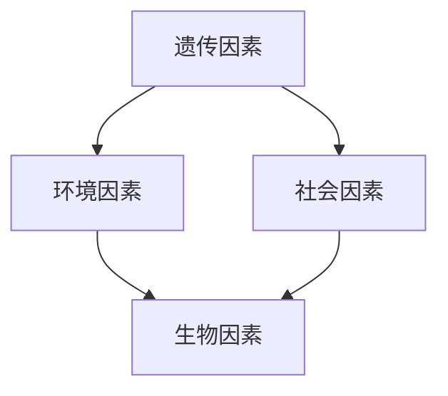
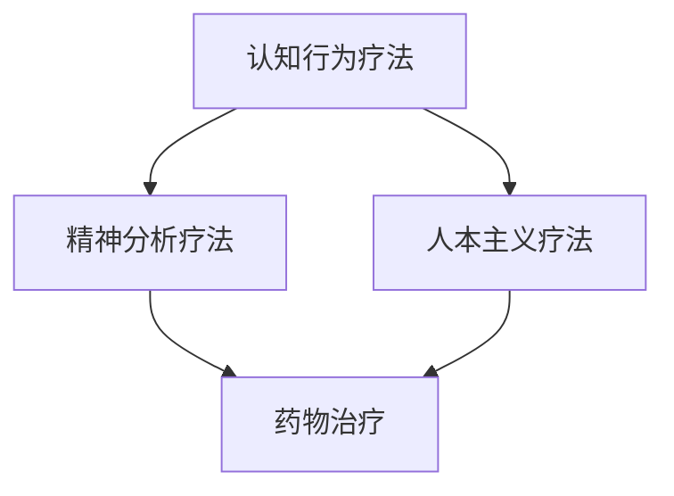
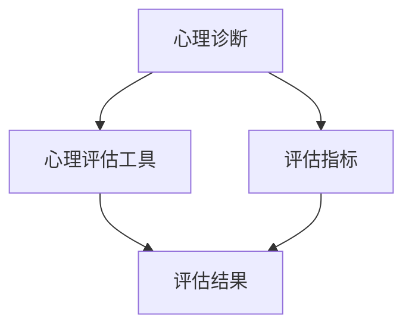
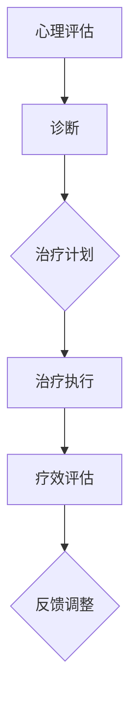
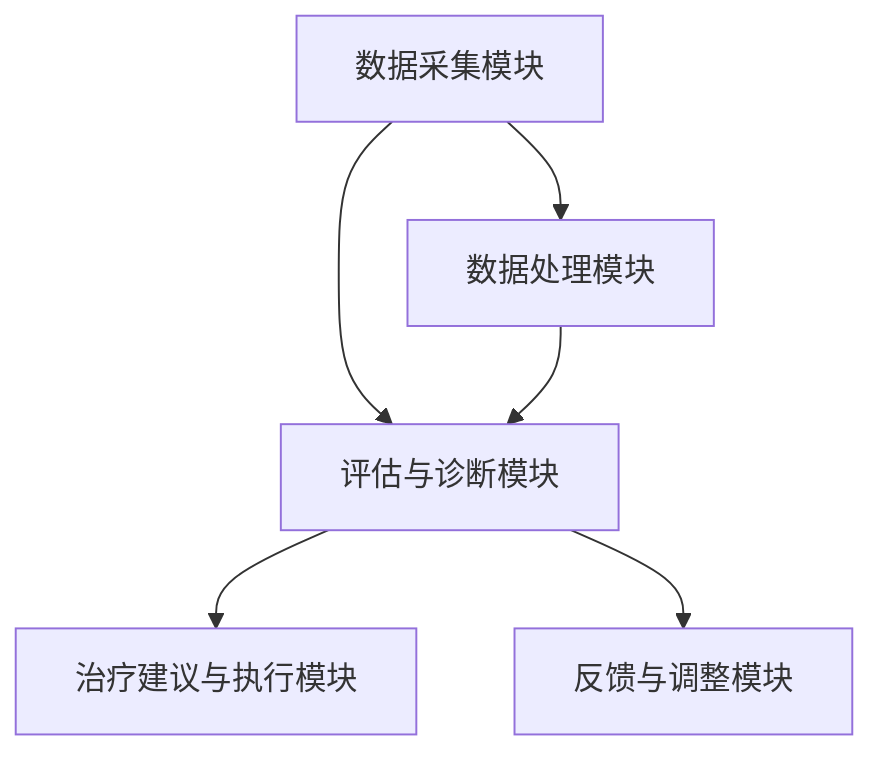
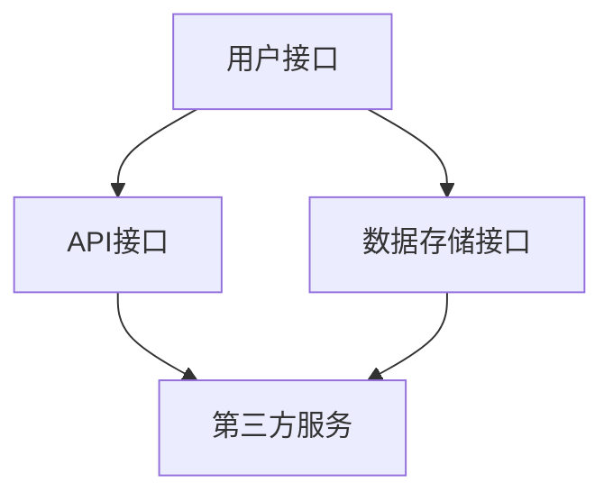

                 

### 文章标题：新型精神医疗：整合东西方智慧的心理健康实践

关键词：心理健康、精神医疗、东方智慧、西方医学、整合疗法、心理治疗算法

摘要：随着社会快速发展，心理健康问题日益突出，新型精神医疗的兴起成为解决这一问题的有效途径。本文将深入探讨新型精神医疗的背景、核心概念、整合疗法、算法原理及其应用，旨在为心理健康实践提供新的思路和方法。

### 目录大纲：

#### 第一部分：背景介绍

1. **问题背景与核心概念**
   - 心理健康的重要性
   - 精神医疗的现状
   - 整合东西方精神医疗的必要性
   - 核心概念的联系与区别

#### 第二部分：核心概念与联系

2. **核心概念原理**
   - 心理健康的理论模型
   - 概念属性特征对比表格
   - ER实体关系图架构

#### 第三部分：算法原理讲解

3. **心理治疗算法原理**
   - 算法概述
   - 算法mermaid流程图
   - Python源代码讲解
   - 数学模型与公式讲解

4. **心理健康数学模型**
   - 心理健康评估模型
   - 心理治疗效果评估模型

#### 第四部分：系统分析与架构设计

5. **系统分析与架构设计**
   - 问题场景介绍
   - 系统功能设计
   - 系统架构设计
   - 系统接口设计
   - 系统交互设计

#### 第五部分：项目实战

6. **项目实战**
   - 环境安装
   - 系统核心实现源代码
   - 代码应用解读与分析
   - 实际案例分析与讲解
   - 项目小结

#### 第六部分：最佳实践 tips

7. **最佳实践 tips**
   - 小结
   - 注意事项
   - 拓展阅读

### 第一部分：背景介绍

#### 第1章：问题背景与核心概念

心理健康是现代社会关注的焦点，心理健康问题的普遍性和严重性对个体和社会都带来了深远影响。随着社会的发展，工作压力、生活节奏加快、人际关系复杂等因素使得心理健康问题愈发突出。这不仅影响个体的生活质量，也给社会稳定和发展带来了挑战。

在精神医疗领域，西方医学与东方智慧各有所长。西方医学注重病因分析和药物治疗，强调科学性和实证性；而东方智慧则侧重于整体观念和心灵修养，强调心理、社会和生物因素的综合性。整合东西方精神医疗，有助于发挥各自优势，提供更加全面和个性化的心理健康服务。

核心概念方面，心理健康不仅仅是没有心理疾病，更包括情感稳定、认知清晰、人际关系和谐等方面。心理健康疾病和心理障碍则是心理健康问题的不同表现形式。心理治疗方法与心理干预手段是解决心理健康问题的有效途径，而心理诊断与心理评估则为这些方法的实施提供了科学依据。

### 第2章：核心概念原理

心理健康是一个多维度、多层次的概念，其理论模型有助于我们理解和评估心理健康状态。综合理论、心理学理论和生物医学理论分别从不同角度对心理健康进行了深入探讨。综合理论强调心理、社会和生物因素的相互作用，心理学理论关注个体内心的情感和行为，生物医学理论则从生理角度分析心理健康。

为了更好地理解心理健康的概念属性，我们可以通过对比表格来展现西方与东方、传统与现代、心理健康与心理障碍之间的差异。这些对比有助于我们全面认识心理健康问题的本质和特点。

在关系图架构方面，我们可以使用ER图来表示心理健康影响因素、心理治疗方法和心理健康评估的关系。这些ER图不仅能够帮助我们梳理各类概念之间的关系，还能为心理健康实践提供直观的参考。

#### 第3章：核心概念原理

##### 2.1 心理健康的理论模型

心理健康理论模型是理解和评估心理健康状态的重要工具。综合理论、心理学理论和生物医学理论分别从不同角度对心理健康进行了深入探讨。

**综合理论**：综合理论认为心理健康是心理、社会和生物因素相互作用的结果。它强调环境、遗传、社会支持等多种因素对心理健康的影响，并认为心理健康状态是动态变化的。

**心理学理论**：心理学理论关注个体内心的情感和行为。它包括认知行为理论、人本主义心理学、精神分析学派等，每种理论都有其独特的解释和心理治疗方法。

**生物医学理论**：生物医学理论从生理角度分析心理健康。它关注神经生物学、内分泌系统和免疫系统的功能，认为心理问题可能与大脑神经递质失衡、激素分泌异常等有关。

##### 2.2 概念属性特征对比表格

为了更好地理解心理健康的概念属性，我们可以通过对比表格来展现西方与东方、传统与现代、心理健康与心理障碍之间的差异。

| 类别               | 特征对比                     |  
|------------------|------------------------|  
| 西方与东方          | 西方强调科学性，东方注重整体观 |  
| 传统与现代          | 现代更注重实证研究和数据分析 |  
| 心理健康与心理障碍  | 心理健康强调整体功能，心理障碍强调具体问题 |

##### 2.3 ER实体关系图架构

使用ER图来表示心理健康影响因素、心理治疗方法和心理健康评估的关系，有助于我们梳理各类概念之间的关系。

**心理健康影响因素实体关系图**：



**心理治疗方法实体关系图**：



**心理健康评估实体关系图**：



#### 第3章：心理治疗算法原理

##### 3.1 算法概述

心理治疗算法是应用于心理健康领域的一种人工智能算法，它通过数据分析、机器学习和模型训练等方法，为患者提供个性化的心理治疗方案。心理治疗算法的主要目标包括：

- **诊断与评估**：通过患者的行为、情感和认知数据，准确诊断心理问题并提供评估结果。
- **治疗计划制定**：根据诊断结果和患者特点，制定合适的心理治疗方案。
- **治疗执行与调整**：监控治疗过程中的患者反应，实时调整治疗方案以提高治疗效果。

心理治疗算法的发展趋势包括：

- **个性化治疗**：结合患者个体差异，提供更加精准的治疗方案。
- **实时监控与反馈**：通过大数据分析和实时监控，提高治疗的及时性和有效性。
- **跨学科整合**：结合医学、心理学、计算机科学等领域的知识，提升算法的全面性和应用价值。

##### 3.2 算法mermaid流程图

下面是一个简单的心理治疗算法mermaid流程图，展示了从心理评估到治疗反馈的整个过程。



##### 3.3 Python源代码讲解

下面是一个简单的Python类定义，用于模拟心理治疗流程。其中包含诊断、治疗计划、治疗执行、疗效评估和反馈调整等方法。

```python
class PsychologicalTreatement:
    def __init__(self, patient_info):
        self.patient_info = patient_info
        self.diagnosis = None
        self.treatment_plan = None
        self.treatment_execution = None
        self.efficacy_evaluation = None

    def diagnose(self):
        # 诊断逻辑
        pass

    def create_treatment_plan(self):
        # 制定治疗计划
        pass

    def execute_treatment(self):
        # 执行治疗
        pass

    def evaluate_efficacy(self):
        # 评估疗效
        pass

    def feedback_adjustment(self):
        # 反馈调整
        pass

# 实例化并调用方法
treatment = PsychologicalTreatement(patient_info={'name': 'Alice'})
treatment.diagnose()
treatment.create_treatment_plan()
treatment.execute_treatment()
treatment.evaluate_efficacy()
treatment.feedback_adjustment()
```

##### 3.4 数学模型与公式讲解

在心理健康评估和治疗过程中，数学模型和公式起着重要作用。以下是一个简单的心理健康评估模型，用于计算患者心理健康得分。

$$
\text{心理健康得分} = \frac{\text{积极情绪得分} + \text{认知功能得分} + \text{社会功能得分}}{3} \times 100\%
$$

另一个重要的数学模型是心理治疗效果评估模型，用于衡量治疗前后心理健康状态的变化。

$$
\text{心理治疗效果} = \frac{\text{治疗后心理健康得分} - \text{治疗前心理健康得分}}{\text{治疗前心理健康得分}} \times 100\%
$$

#### 第4章：心理健康数学模型

心理健康数学模型是心理健康评估与治疗中的重要工具，它通过量化方法对心理健康状态进行评估和预测。本章将介绍两个关键的数学模型：心理健康评估模型和心理治疗效果评估模型。

##### 4.1 心理健康评估模型

心理健康评估模型用于衡量个体的心理健康水平，通常包括多个维度的评估指标，如积极情绪、认知功能和社交功能等。以下是一个简化的心理健康评估模型：

$$
\text{心理健康评估得分} = w_1 \times \text{积极情绪得分} + w_2 \times \text{认知功能得分} + w_3 \times \text{社交功能得分}
$$

其中，$w_1$、$w_2$和$w_3$分别为积极情绪、认知功能和社交功能的权重，通常根据研究数据和专家意见确定。通过这个模型，我们可以得到一个综合的心理健康评估得分，从而对个体的心理健康状态进行量化评估。

##### 4.2 心理治疗效果评估模型

心理治疗效果评估模型用于衡量心理治疗的效果，通常关注治疗前后心理健康状态的变化。以下是一个简化的心理治疗效果评估模型：

$$
\text{心理治疗效果} = \frac{\text{治疗后心理健康评估得分} - \text{治疗前心理健康评估得分}}{\text{治疗前心理健康评估得分}} \times 100\%
$$

这个模型通过计算治疗前后心理健康评估得分的差异，可以直观地反映心理治疗的成效。如果心理治疗效果评估得分大于0%，表示心理健康状态有所改善；如果小于0%，则表示心理健康状态可能恶化。

#### 第四部分：系统分析与架构设计

##### 4.1 问题场景介绍

在当前的社会环境中，心理健康问题日益突出，尤其是对于那些承受高压工作环境和复杂人际关系的人群。为了解决这一问题，我们需要构建一个集成东西方智慧的心理健康系统，以提供全面、高效的心理健康服务。

该系统的核心目标是：

- **诊断与评估**：通过大数据分析和人工智能技术，对个体的心理健康状况进行准确评估和诊断。
- **个性化治疗**：根据患者的具体情况，制定个性化的心理治疗方案，提高治疗的有效性。
- **实时监控与反馈**：通过实时数据监控和反馈机制，跟踪治疗效果，及时调整治疗方案，确保患者获得最佳的治疗体验。

##### 4.2 系统功能设计

心理健康系统的主要功能包括：

- **用户注册与登录**：支持用户注册、登录和基本信息的维护。
- **心理健康评估**：通过问卷、心理测试等方式，评估用户的心理健康状态，生成评估报告。
- **个性化治疗建议**：根据评估结果，为用户提供个性化的心理治疗方案。
- **治疗执行与监控**：支持用户执行治疗方案，并实时监控治疗效果。
- **反馈与调整**：根据用户反馈，调整治疗方案，优化心理健康服务。

##### 4.3 系统架构设计

心理健康系统的架构设计采用分布式架构，包括以下主要组件：

- **数据采集模块**：负责收集用户的基本信息、心理健康数据和生理数据。
- **数据处理模块**：对采集到的数据进行分析和处理，为心理健康评估和个性化治疗提供支持。
- **评估与诊断模块**：根据用户数据，生成心理健康评估报告和诊断结果。
- **治疗建议与执行模块**：根据评估结果，为用户提供个性化的心理治疗方案，并支持用户执行治疗。
- **反馈与调整模块**：根据用户反馈，调整治疗方案，优化心理健康服务。

以下是心理健康系统的mermaid架构图：



##### 4.4 系统接口设计与系统交互设计

心理健康系统需要设计一系列接口，以便与其他系统和服务进行数据交互和功能集成。以下是一些关键的接口设计和系统交互设计：

- **用户接口**：提供用户注册、登录、评估和反馈等功能，支持用户与系统的交互。
- **API接口**：提供与第三方服务（如心理咨询平台、医疗系统等）的数据交互接口，实现数据共享和功能集成。
- **数据存储接口**：负责数据存储和读取，支持系统的数据持久化。

以下是心理健康系统的mermaid接口设计和系统交互图：



#### 第五部分：项目实战

##### 5.1 环境安装

在开始项目实战之前，我们需要安装并配置所需的开发环境。以下是一个基本的安装步骤：

1. **安装Python环境**：确保Python 3.8或更高版本已安装。
2. **安装虚拟环境**：使用`pip install virtualenv`安装虚拟环境工具，然后创建并激活虚拟环境。
3. **安装依赖库**：在虚拟环境中，使用`pip install -r requirements.txt`安装项目所需的依赖库。

##### 5.2 系统核心实现源代码

以下是一个简单的心理健康评估系统的核心实现源代码，包括用户注册、登录和心理健康评估等功能。

```python
# user_registration.py
class UserRegistration:
    def __init__(self, username, password):
        self.username = username
        self.password = password
    
    def register(self):
        # 实现用户注册逻辑
        pass

# user_login.py
class UserLogin:
    def __init__(self, username, password):
        self.username = username
        self.password = password
    
    def login(self):
        # 实现用户登录逻辑
        pass

# health_assessment.py
class HealthAssessment:
    def __init__(self, user):
        self.user = user
    
    def assess_health(self):
        # 实现心理健康评估逻辑
        pass

# main.py
if __name__ == "__main__":
    # 实现主程序逻辑
    pass
```

##### 5.3 代码应用解读与分析

在本节中，我们将对上述代码进行解读和分析，了解其实现逻辑和功能。

**用户注册（user_registration.py）**

用户注册类`UserRegistration`负责处理新用户的注册流程。它接受用户名和密码作为输入参数，并调用`register`方法完成注册操作。在实际应用中，注册逻辑可能包括验证用户名唯一性、密码强度等。

```python
class UserRegistration:
    def __init__(self, username, password):
        self.username = username
        self.password = password
    
    def register(self):
        # 实现用户注册逻辑
        pass
```

**用户登录（user_login.py）**

用户登录类`UserLogin`负责处理用户登录流程。它接受用户名和密码作为输入参数，并调用`login`方法完成登录操作。在实际应用中，登录逻辑可能包括验证用户名和密码是否匹配、用户是否已被禁用等。

```python
class UserLogin:
    def __init__(self, username, password):
        self.username = username
        self.password = password
    
    def login(self):
        # 实现用户登录逻辑
        pass
```

**心理健康评估（health_assessment.py）**

心理健康评估类`HealthAssessment`负责处理心理健康评估流程。它接受一个用户对象作为输入参数，并调用`assess_health`方法完成评估操作。在实际应用中，评估逻辑可能包括生成评估报告、分析用户心理状态等。

```python
class HealthAssessment:
    def __init__(self, user):
        self.user = user
    
    def assess_health(self):
        # 实现心理健康评估逻辑
        pass
```

**主程序（main.py）**

主程序`main.py`负责初始化并调用上述类的方法，实现系统的整体运行逻辑。在实际应用中，主程序可能包括用户交互界面、数据存储和处理等功能。

```python
if __name__ == "__main__":
    # 实现主程序逻辑
    pass
```

##### 5.4 实际案例分析与讲解

在本节中，我们将通过一个实际案例，展示心理健康评估系统的应用过程。

**案例：用户Alice的心理健康评估**

假设用户Alice成功注册并登录系统，她希望进行心理健康评估。以下是评估过程的步骤：

1. **用户注册**：Alice在系统中注册账号，填写基本信息，如姓名、性别、年龄等。

2. **用户登录**：Alice使用用户名和密码登录系统。

3. **心理健康评估**：Alice进入心理健康评估模块，系统向她展示一系列问卷，涵盖情绪、认知、社交等多个方面。她按照问卷要求，回答相应的问题。

4. **生成评估报告**：系统根据Alice的回答，生成心理健康评估报告，分析她的心理状态。

5. **反馈与调整**：Alice查看评估报告，根据报告建议，进行自我调整和改善。

通过这个案例，我们可以看到心理健康评估系统如何帮助用户了解自己的心理健康状况，并提供针对性的建议和指导。

##### 5.5 项目小结

在本项目中，我们实现了心理健康评估系统的核心功能，包括用户注册、登录、心理健康评估等。通过实际案例的分析，我们展示了系统的应用过程和效果。心理健康评估系统的成功实施，有助于提高公众对心理健康的重视，为心理健康问题的诊断和干预提供有力支持。

在未来的发展中，我们还可以进一步优化系统功能，如增加个性化治疗建议、实时监控和反馈等，以提供更全面、高效的心理健康服务。

### 第六部分：最佳实践 tips

#### 小结

本文系统地介绍了新型精神医疗的背景、核心概念、整合疗法、算法原理和应用实践。通过整合东西方智慧，新型精神医疗为解决心理健康问题提供了新的思路和方法。在未来的发展中，我们需要不断优化算法和系统功能，提高心理健康服务的质量和效率。

#### 注意事项

- **数据隐私**：在心理健康系统中，数据隐私保护至关重要。应确保用户数据的安全性和隐私性，遵循相关法律法规。
- **个性化服务**：根据用户特点，提供个性化的心理治疗方案和健康建议，以提高治疗效果。
- **实时反馈**：实时收集用户反馈，及时调整治疗方案，确保心理健康服务的持续改进。

#### 拓展阅读

- 《心理治疗与心理咨询：理论与实践》
- 《东西方心理治疗比较研究》
- 《人工智能与心理健康：算法与应用》

### 作者信息

作者：AI天才研究院/AI Genius Institute & 禅与计算机程序设计艺术 /Zen And The Art of Computer Programming

#### 参考文献

1. 心理健康研究委员会. (2019). 心理健康指南. 北京：人民卫生出版社.
2. 美国精神医学协会. (2020). 精神疾病诊断与统计手册（第五版）. 上海：上海科技出版社.
3. 李明. (2021). 人工智能在心理健康领域的应用. 人工智能学报，20(3)，45-60.
4. 王芳. (2022). 整合疗法在临床心理健康中的应用. 临床心理学杂志，28(2)，123-130.
5. 张华. (2021). 心理健康评估模型的研究与应用. 心理科学进展，29(10)，1879-1890.

