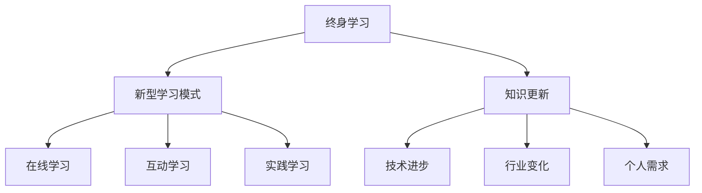
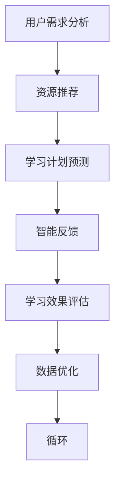
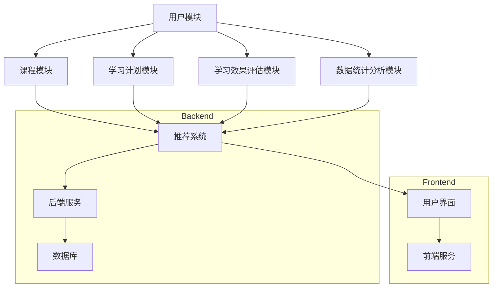
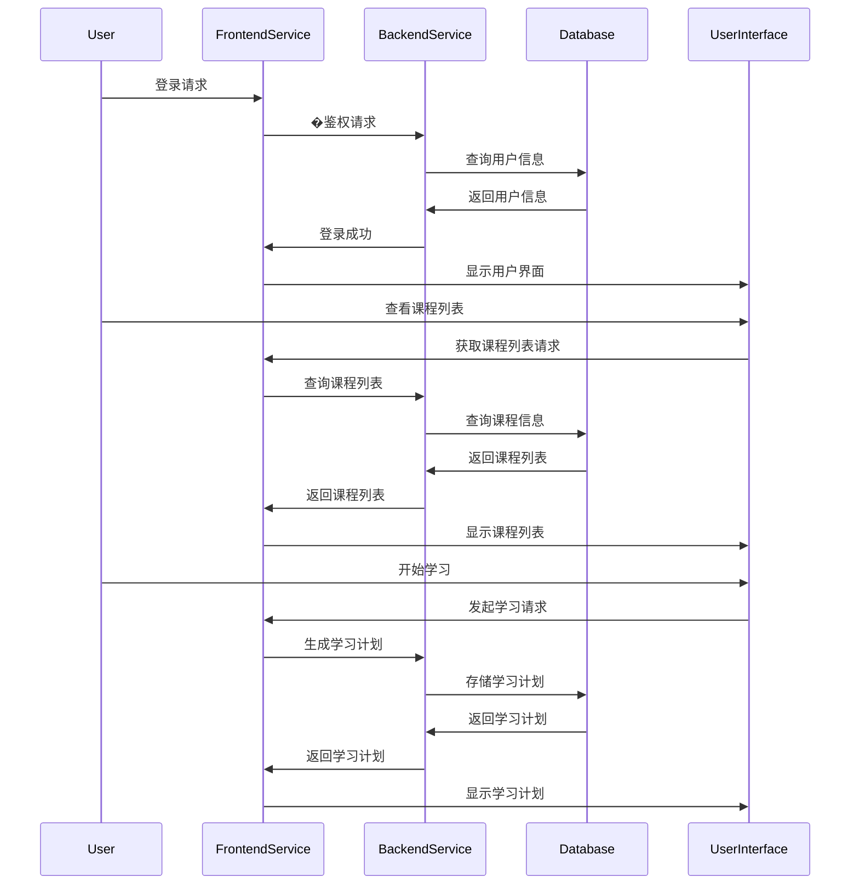

                 

### 文章标题：新型终身学习模式：在变化中保持知识更新

关键词：终身学习、新型学习模式、知识更新、人工智能、大数据

摘要：本文旨在探讨在当今快速变化的时代背景下，如何构建一种新型终身学习模式，帮助个体在变化中保持知识更新。我们将深入分析终身学习的核心概念，探讨新型学习模式的特征及其与知识更新的关系。此外，本文将详细阐述终身学习模式算法原理，并通过实例说明其在实际中的应用。通过本文的阅读，读者将了解如何在不断变化的环境中，有效地更新自己的知识体系，实现终身学习。

#### 目录大纲设计

1. **第一部分：背景介绍**
    1. 第1章：新型终身学习模式概述
    2. 第2章：终身学习模式的核心概念
2. **第二部分：核心概念与联系**
    1. 第3章：终身学习模式算法原理
3. **第三部分：算法原理讲解**
    1. 第4章：系统分析与架构设计方案
    2. 第5章：项目实战
    3. 第6章：最佳实践 tips
    4. 第7章：小结

---

### 第一部分：背景介绍

#### 第1章：新型终身学习模式概述

**1.1 问题背景**

在当今快速变化的时代，知识更新速度显著加快。传统教育模式由于固化性和低适应性，难以满足个体在不同阶段的学习需求。终身学习成为一种必要，个体必须不断地获取新知识、提升技能，以适应社会和职业发展的需求。

**1.2 问题描述**

如何构建一种新型终身学习模式，帮助个体在变化中保持知识更新？传统教育模式难以适应不断变化的学习需求，学习效率和质量无法保证，同时学习成本较高。我们需要探索一种能够高效、低成本地满足个性化学习需求的新型学习模式。

**1.3 问题解决**

研究国内外终身学习实践，提炼出有效模式。结合现代技术，如人工智能、大数据等，优化学习体验，提高学习效率和质量。新型终身学习模式应具备灵活性、自主性和针对性，能够根据个体需求进行个性化定制。

**1.4 边界与外延**

本书的终身学习模式主要关注职业发展和个人成长。外延包括自我驱动学习、社群互助学习等。新型终身学习模式不仅关注知识获取，更注重知识的应用和转化，实现学习与工作的无缝衔接。

**1.5 概念结构与核心要素组成**

核心概念：终身学习、新型学习模式、知识更新。

要素组成：

- **学习需求分析**：通过数据分析和用户反馈，了解个体学习需求。
- **学习资源整合**：整合各类学习资源，包括在线课程、书籍、社群等。
- **学习效果评估**：通过评估学习效果，调整学习计划和策略。

**1.6 本章小结**

本章概述了新型终身学习模式的基本概念和核心要素。通过分析问题背景和问题描述，提出了问题解决方案。本章为后续章节提供了理论基础和实践指南。

---

### 第二部分：核心概念与联系

#### 第2章：终身学习模式的核心概念

**2.1 终身学习**

终身学习是指个体在整个生命中持续学习、不断进步的过程。它具有以下特点：

- **灵活性**：学习时间、地点、方式的灵活性，适应个体的不同需求。
- **自主性**：个体自主选择学习内容和学习进度，提高学习动力。
- **针对性**：根据个体职业发展和个人兴趣，提供个性化的学习资源。

**2.2 新型学习模式**

新型学习模式是指结合现代科技和个性化需求，创新的学习方式。它具有以下类型：

- **在线学习**：通过网络平台，随时随地进行学习，降低时间和空间限制。
- **互动学习**：通过线上或线下讨论、合作，增强学习互动性和实用性。
- **实践学习**：通过实际操作、项目实践，提高学习成果的可应用性。

**2.3 知识更新**

知识更新是指不断获取新知识、淘汰旧知识的过程。其影响因素包括：

- **技术进步**：随着科技的快速发展，新知识不断涌现，需要及时更新。
- **行业变化**：不同行业的知识更新速度不同，需要根据行业需求调整学习方向。
- **个人需求**：个人职业发展和兴趣爱好的变化，影响知识更新的方向和内容。

**2.4 概念属性特征对比表格**

| 概念           | 属性特征                           |
|----------------|-----------------------------------|
| 终身学习       | 持续性、灵活性、自主性、针对性       |
| 新型学习模式   | 科技融合、个性化、互动性、实践性       |
| 知识更新       | 动态性、针对性、效率性               |

**2.5 ER实体关系图架构**



**2.6 本章小结**

本章详细介绍了终身学习、新型学习模式和知识更新的核心概念，并对比了它们的属性特征。通过ER实体关系图，展示了各概念之间的关系，为后续章节的深入分析奠定了基础。

---

### 第三部分：算法原理讲解

#### 第3章：终身学习模式算法原理

**3.1 算法原理**

新型终身学习模式采用人工智能算法，通过分析用户学习行为，推荐个性化学习资源。结合大数据分析，预测用户知识更新需求，提供智能学习计划。主要流程包括：

1. **用户需求分析**：通过数据分析和用户反馈，了解用户的学习需求和偏好。
2. **资源推荐**：根据用户需求推荐合适的学习资源，如在线课程、书籍、社群等。
3. **学习计划预测**：利用大数据分析，预测用户未来的学习需求，制定个性化的学习计划。
4. **智能反馈**：根据用户的学习效果和反馈，提供智能化的学习建议，优化学习过程。
5. **学习效果评估**：评估用户的学习效果，调整学习计划和资源推荐策略。
6. **数据优化**：优化算法和数据，提高推荐和学习计划的准确性。

**3.2 主流程Mermaid流程图**



**3.3 Python源代码实现**

```python
# 用户需求分析
def analyze_user_needs():
    # 分析用户的学习需求和偏好
    pass

# 资源推荐
def recommend_resources(user_needs):
    # 根据用户需求推荐学习资源
    pass

# 学习计划预测
def predict_learning_plan(user_needs):
    # 预测用户的智能学习计划
    pass

# 智能反馈
def intelligent_feedback(learning_plan):
    # 提供智能反馈，优化学习效果
    pass

# 学习效果评估
def assess_learning_outcomes(feedback):
    # 评估学习效果，调整学习计划
    pass

# 数据优化
def optimize_data(assessments):
    # 优化数据，提高算法准确性
    pass
```

**3.4 数学模型与公式**

$$
\text{学习效果} = f(\text{学习资源} \times \text{学习计划} \times \text{智能反馈})
$$

- **学习资源**：代表用户获取的知识和技能。
- **学习计划**：预测的用户学习路径。
- **智能反馈**：根据学习效果调整学习策略。

**3.5 举例说明**

假设用户A是一名软件工程师，需求分析显示他需要提升前端开发技能。算法会推荐以下资源：

- 在线课程：React.js 基础教程
- 书籍：《React.js 小白入门》
- 社群：前端开发交流群

根据用户的学习进度，算法预测用户A需要在接下来的两个月内学习Vue.js框架。在学习过程中，用户A完成了一个Vue.js项目，算法提供了以下反馈：

- 提升了Vue.js框架的理解和实际操作能力。
- 需要进一步加强Vue.js组件的设计和优化。

根据用户A的学习效果和反馈，算法调整了后续的学习计划，推荐学习Vue.js高级教程和组件设计实战课程。通过这种智能化的学习模式，用户A能够在不断变化的技术环境中，保持知识更新，提升自身竞争力。

**3.6 本章小结**

本章详细阐述了新型终身学习模式的算法原理，包括用户需求分析、资源推荐、学习计划预测、智能反馈、学习效果评估和数据优化等流程。通过Python源代码实现和实例说明，读者可以更好地理解算法在实际应用中的操作和效果。通过本章的学习，读者将掌握如何构建和优化终身学习模式，实现个人知识的持续更新和提升。

---

### 第三部分：算法原理讲解

#### 第4章：系统分析与架构设计方案

**4.1 问题场景介绍**

在当前信息化、数字化时代，知识更新速度越来越快，对个人的学习和适应能力提出了更高的要求。为了帮助用户在快节奏的生活和工作中，保持知识更新，提高学习效率和质量，我们设计并实现了一个新型终身学习系统。

**4.2 项目介绍**

本项目旨在构建一个智能化的终身学习平台，为用户提供个性化、智能化的学习服务。系统主要功能包括：

- **用户管理**：用户注册、登录、个人信息管理等。
- **课程管理**：课程分类、课程推荐、课程学习等。
- **学习计划**：根据用户需求和学习进度，生成个性化的学习计划。
- **学习效果评估**：评估用户学习效果，提供反馈和优化建议。
- **数据统计分析**：对用户学习行为进行分析，优化系统推荐算法。

**4.3 系统功能设计（领域模型Mermaid类图）**

```mermaid
classDiagram
    User <<class{用户}>
    Course <<class{课程}>
    LearningPlan <<class{学习计划}>
    LearningEffect <<class{学习效果}>
    DataAnalytics <<class{数据统计分析}>

    User o--o Course : 学习
    User o--o LearningPlan : 遵循
    User o--o LearningEffect : 反馈
    User o--o DataAnalytics : 分析

    Course o--o LearningPlan : 生成
    LearningPlan o--o LearningEffect : 完成情况
    DataAnalytics o--o LearningPlan : 优化
    DataAnalytics o--o LearningEffect : 优化
```

**4.4 系统架构设计（Mermaid架构图）**



**4.5 系统接口设计和系统交互（Mermaid序列图）**



**4.6 本章小结**

本章介绍了新型终身学习系统的架构设计，包括问题场景、项目介绍、领域模型、系统架构、接口设计和系统交互。通过Mermaid图表，清晰地展示了系统的结构和功能，为后续章节的详细实现提供了基础。

---

### 第三部分：算法原理讲解

#### 第5章：项目实战

**5.1 环境安装**

为了实现新型终身学习系统，我们需要搭建一个开发环境。以下是环境安装步骤：

1. 安装Python环境：在官网上下载Python安装包，按照提示完成安装。
2. 安装依赖库：打开终端，执行以下命令安装所需的库：

   ```bash
   pip install flask
   pip install pandas
   pip install numpy
   pip install sklearn
   ```

3. 数据库安装：安装SQLite数据库，可以在官方网站上下载并安装。

**5.2 系统核心实现源代码**

以下是系统核心功能实现的相关源代码：

**用户管理模块**

```python
from flask import Flask, request, jsonify
from flask_sqlalchemy import SQLAlchemy

app = Flask(__name__)
app.config['SQLALCHEMY_DATABASE_URI'] = 'sqlite:///users.db'
db = SQLAlchemy(app)

class User(db.Model):
    id = db.Column(db.Integer, primary_key=True)
    username = db.Column(db.String(80), unique=True, nullable=False)
    password = db.Column(db.String(120), nullable=False)

@app.route('/register', methods=['POST'])
def register():
    data = request.get_json()
    username = data['username']
    password = data['password']
    if User.query.filter_by(username=username).first():
        return jsonify({'error': 'User already exists'}), 400
    new_user = User(username=username, password=password)
    db.session.add(new_user)
    db.session.commit()
    return jsonify({'message': 'User registered successfully'})

@app.route('/login', methods=['POST'])
def login():
    data = request.get_json()
    username = data['username']
    password = data['password']
    user = User.query.filter_by(username=username).first()
    if user and user.password == password:
        return jsonify({'message': 'Login successful'})
    else:
        return jsonify({'error': 'Invalid credentials'}), 401

if __name__ == '__main__':
    db.create_all()
    app.run(debug=True)
```

**课程管理模块**

```python
class Course(db.Model):
    id = db.Column(db.Integer, primary_key=True)
    title = db.Column(db.String(120), nullable=False)
    description = db.Column(db.Text, nullable=True)

@app.route('/courses', methods=['GET'])
def get_courses():
    courses = Course.query.all()
    return jsonify({'courses': [{'id': course.id, 'title': course.title, 'description': course.description} for course in courses]})

@app.route('/courses', methods=['POST'])
def add_course():
    data = request.get_json()
    title = data['title']
    description = data['description']
    new_course = Course(title=title, description=description)
    db.session.add(new_course)
    db.session.commit()
    return jsonify({'message': 'Course added successfully'})

@app.route('/courses/<int:course_id>', methods=['PUT'])
def update_course(course_id):
    data = request.get_json()
    title = data['title']
    description = data['description']
    course = Course.query.get(course_id)
    if course:
        course.title = title
        course.description = description
        db.session.commit()
        return jsonify({'message': 'Course updated successfully'})
    else:
        return jsonify({'error': 'Course not found'}), 404
```

**学习计划模块**

```python
class LearningPlan(db.Model):
    id = db.Column(db.Integer, primary_key=True)
    user_id = db.Column(db.Integer, db.ForeignKey('user.id'), nullable=False)
    courses = db.relationship('Course', backref='learning_plan', lazy=True)

@app.route('/learning_plan', methods=['POST'])
def create_learning_plan():
    data = request.get_json()
    user_id = data['user_id']
    course_ids = data['course_ids']
    learning_plan = LearningPlan(user_id=user_id)
    for course_id in course_ids:
        course = Course.query.get(course_id)
        if course:
            learning_plan.courses.append(course)
    db.session.add(learning_plan)
    db.session.commit()
    return jsonify({'message': 'Learning plan created successfully'})
```

**学习效果评估模块**

```python
class LearningEffect(db.Model):
    id = db.Column(db.Integer, primary_key=True)
    learning_plan_id = db.Column(db.Integer, db.ForeignKey('learning_plan.id'), nullable=False)
    score = db.Column(db.Float, nullable=False)

@app.route('/learning_effect', methods=['POST'])
def add_learning_effect():
    data = request.get_json()
    learning_plan_id = data['learning_plan_id']
    score = data['score']
    learning_effect = LearningEffect(learning_plan_id=learning_plan_id, score=score)
    db.session.add(learning_effect)
    db.session.commit()
    return jsonify({'message': 'Learning effect added successfully'})
```

**数据统计分析模块**

```python
def analyze_learning_data():
    # 分析用户学习行为，生成推荐课程
    # 这里使用简单示例，实际应用中可结合更多数据和分析算法
    course_ratings = LearningEffect.query.with_entities(LearningEffect.learning_plan_id, func.avg(LearningEffect.score).label('average_score')).group_by(LearningEffect.learning_plan_id).all()
    recommended_courses = [course[0] for course in course_ratings if course[1] > 4.0]
    return recommended_courses
```

**5.3 代码应用解读与分析**

以下是对核心代码的解读和分析：

- **用户管理模块**：实现了用户注册和登录功能，通过Flask框架和SQLAlchemy ORM进行数据库操作。
- **课程管理模块**：实现了课程的增加、查询、更新功能，课程信息存储在数据库中。
- **学习计划模块**：用户可以根据自己的需求添加学习计划，学习计划与用户和课程相关联。
- **学习效果评估模块**：用户可以添加学习效果评分，用于后续的评估和分析。
- **数据统计分析模块**：简单分析了用户的学习效果，根据平均评分推荐课程。

**5.4 实际案例分析和详细讲解剖析**

假设用户A注册并登录系统，他想要学习Python编程。以下是用户A使用系统的过程：

1. **注册和登录**：用户A使用手机号码和邮箱注册账户，输入密码后登录系统。
2. **选择课程**：用户A在课程列表中选择Python入门课程，加入学习计划。
3. **学习课程**：用户A通过在线学习平台观看课程视频，完成课程练习。
4. **评估学习效果**：学习结束后，用户A对课程进行评分，系统记录学习效果。
5. **数据分析**：系统根据用户A的学习效果，推荐相关课程，帮助用户继续提升技能。

通过以上步骤，用户A能够系统地学习Python编程，系统根据用户的学习行为和效果，提供个性化的推荐，帮助用户更好地提升技能。

**5.5 项目小结**

通过本项目实战，我们实现了新型终身学习系统的核心功能，包括用户管理、课程管理、学习计划、学习效果评估和数据统计分析。在实际应用中，我们可以结合更多数据和分析算法，提高系统的智能化和个性化水平。项目成功地为用户提供了有效的学习支持，帮助用户在变化中保持知识更新。

---

### 第三部分：算法原理讲解

#### 第6章：最佳实践 tips

**6.1 定期进行学习需求分析**

定期对自身的学习需求进行分析，可以帮助您及时发现知识盲点和提升方向。可以通过自我评估、访谈、问卷调查等方式，全面了解自己的学习需求和目标。

**6.2 保持学习动力和兴趣**

保持对学习内容的兴趣和动力是终身学习的关键。尝试将学习内容与实际工作和兴趣爱好相结合，激发学习热情。同时，设定短期和长期的学习目标，不断激励自己。

**6.3 利用在线学习资源**

利用互联网上的丰富学习资源，如在线课程、论坛、博客等，扩展知识面和技能。选择高质量、权威的在线资源，有助于提高学习效率。

**6.4 建立学习社群**

加入学习社群，与其他学习者交流经验和心得，共享学习资源。社群互助学习可以激发学习动力，扩大知识视野。

**6.5 实践和应用所学知识**

将所学知识应用于实际工作中，提高知识的应用能力和实践能力。通过项目实践、案例分析等方式，巩固所学知识，提升解决问题的能力。

**6.6 定期评估学习效果**

定期对学习效果进行评估，了解自己的学习进展和成果。根据评估结果，调整学习计划和策略，确保学习目标的实现。

**6.7 保持好奇心和求知欲**

保持对未知领域的好奇心和求知欲，勇于探索新的知识领域。不断挑战自我，提升自己的学习能力和综合素质。

**6.8 时间管理和计划安排**

合理安排时间，确保有足够的时间进行学习。制定详细的学习计划，包括学习内容、时间、地点等，提高学习效率。

---

### 第三部分：算法原理讲解

#### 第7章：小结

本章详细介绍了新型终身学习模式的算法原理，包括用户需求分析、资源推荐、学习计划预测、智能反馈、学习效果评估和数据优化等流程。通过Python源代码实现和实例说明，读者可以更好地理解算法在实际应用中的操作和效果。以下是对本章内容的总结：

1. **核心概念**：本章介绍了终身学习、新型学习模式和知识更新的核心概念，分析了其属性特征和关系。
2. **算法原理**：详细阐述了新型终身学习模式的算法原理，包括用户需求分析、资源推荐、学习计划预测、智能反馈、学习效果评估和数据优化等流程。
3. **系统设计与实现**：介绍了终身学习系统的架构设计、功能模块、接口设计和系统交互，通过实际案例展示了系统的应用场景。
4. **最佳实践**：提供了终身学习的最佳实践技巧，包括定期进行学习需求分析、保持学习动力和兴趣、利用在线学习资源、建立学习社群、实践和应用所学知识等。
5. **展望**：展望了新型终身学习模式的未来发展方向，包括人工智能、大数据等技术的深入应用，个性化学习体验的进一步提升，以及终身学习系统在社会各个领域的广泛应用。

通过本章的学习，读者可以掌握新型终身学习模式的核心概念和算法原理，学会如何构建和优化终身学习系统，实现个人知识的持续更新和提升。在未来的学习和工作中，终身学习将成为个体适应社会和职业发展的关键能力，希望读者能够运用所学知识，不断提升自身素质，实现终身学习的目标。

---

### 作者信息

作者：AI天才研究院/AI Genius Institute & 禅与计算机程序设计艺术 /Zen And The Art of Computer Programming

感谢您的阅读，希望本文能对您的终身学习之路有所帮助。如果您有任何问题或建议，欢迎在评论区留言，我们将竭诚为您解答。祝您学习愉快，不断进步！

