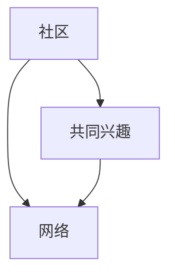
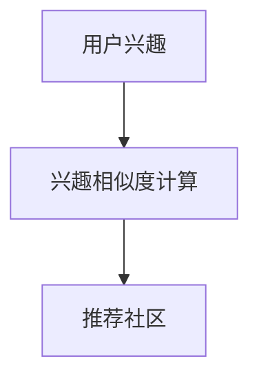
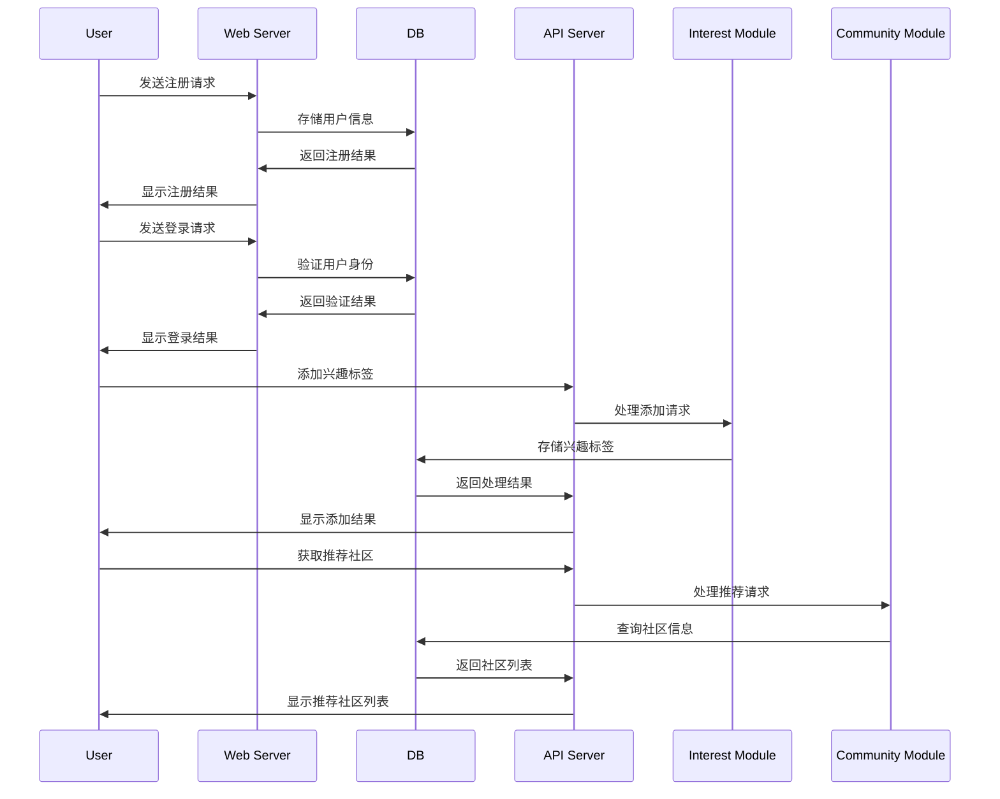

                 

# 新型都市部落：基于共同兴趣的现代社交圈

> 关键词：现代社交圈、共同兴趣、社区建设、信息技术

> 摘要：本文将探讨现代都市背景下，基于共同兴趣的新型社交圈的形成、发展及其重要性。通过分析社区建设的基本概念、技术原理和实际案例，深入解析如何通过信息技术构建高效、有吸引力的社交平台，为城市居民提供更加丰富、多元化的社交体验。

## 引言

在当今快速发展的社会中，人们的生活方式、工作模式和社会关系都在发生深刻变革。传统的社会结构逐渐瓦解，现代社交圈的重要性日益凸显。基于共同兴趣的新型都市部落，作为一种新型的社交形态，正逐渐成为城市居民日常生活中的重要组成部分。本文将从以下几个方面展开讨论：

1. **背景介绍**：介绍新型都市部落的概念及其在现代社交圈中的地位。
2. **核心概念与联系**：详细阐述社区、共同兴趣和网络等核心概念，并通过ER图展示它们之间的关系。
3. **算法原理与实现**：探讨用于构建现代社交圈的算法原理，并通过Python代码和Mermaid图展示具体实现。
4. **系统分析与设计**：介绍系统的设计与架构，包括领域模型、系统架构和系统交互设计。
5. **项目实战**：通过实际案例分析和代码解读，展示社交圈构建的过程和技巧。
6. **最佳实践与总结**：总结构建成功社交圈的最佳实践，并提出未来发展的建议。

## 背景介绍

### 新型都市部落的定义

新型都市部落，是指一群有着共同兴趣爱好、价值观和生活目标的个体，在城市化背景下，通过互联网和社交媒体平台自发形成的社交群体。这些部落成员可能来自不同的行业、地区，但他们在精神层面上有着高度的一致性，形成了紧密的社交网络。

### 现代社交圈的特征

现代社交圈具有以下特征：

1. **虚拟性**：大部分社交活动在虚拟空间进行，如线上论坛、社交媒体、游戏平台等。
2. **多样性**：社交圈涵盖了各种兴趣爱好，从摄影、音乐到编程、科幻等。
3. **互动性**：成员之间高度互动，分享经验、交流意见，形成了一种新型的社区文化。
4. **灵活性**：社交圈的形成和消亡都非常迅速，受成员兴趣和需求变化影响。

### 社区建设的意义

社区建设在新型都市部落中具有重要意义，主要体现在以下几个方面：

1. **增强归属感**：成员在社区中找到归属感，感受到与其他成员的共鸣。
2. **促进知识分享**：通过交流，成员可以分享经验、学习新知识，提高个人能力。
3. **丰富生活体验**：社交圈提供了丰富多彩的活动和体验，使城市生活更加充实。
4. **社会影响力**：成功的社交圈可以对社会产生积极影响，如推动科技、艺术等领域的进步。

## 核心概念与联系

### 社区

社区是指一群有着共同利益、目标和价值观的个体组成的集合。在社交圈中，社区成员通过互动和合作，共同维护社区环境和秩序。

### 共同兴趣

共同兴趣是指一群人对某个特定领域或活动有共同的爱好和追求。共同兴趣是社交圈形成的基础，如摄影爱好者组成的摄影社区、程序员组成的编程社区等。

### 网络

网络是指连接社区成员的桥梁，包括社交媒体、论坛、游戏平台等。网络技术为社区成员提供了方便的交流方式和平台。

### 关系

社区、共同兴趣和网络之间存在着紧密的关系。社区是社交圈的核心，共同兴趣是社区形成的驱动力，网络则是社区成员之间互动的渠道。以下是一个简化的ER图，展示了这些概念之间的关系：



## 算法原理与实现

### 算法原理

构建现代社交圈的关键在于如何根据成员的兴趣和需求，将他们有效地匹配到合适的社区中。这里介绍两种常用的算法：协同过滤算法和社交网络分析算法。

1. **协同过滤算法**：通过分析成员之间的兴趣相似度，推荐具有共同兴趣的社区。
   $$ \text{兴趣相似度} = \frac{\text{共同兴趣数量}}{\text{总兴趣数量}} $$
2. **社交网络分析算法**：基于成员在社交网络中的连接关系，识别具有较高社交价值的社区成员，并推荐相应的社区。

### Mermaid图展示

以下是一个简化的协同过滤算法的Mermaid流程图：



### Python代码实现

```python
import numpy as np

# 用户兴趣向量
user_interests = np.array([1, 1, 0, 1, 0])

# 社区兴趣向量
community_interests = np.array([1, 0, 1, 0, 1])

# 计算兴趣相似度
similarity = np.dot(user_interests, community_interests) / (np.linalg.norm(user_interests) * np.linalg.norm(community_interests))

print("兴趣相似度：", similarity)

# 推荐社区
if similarity > 0.5:
    print("推荐加入该社区")
else:
    print("不推荐加入该社区")
```

## 系统分析与设计

### 问题场景

假设我们要开发一个基于共同兴趣的社交平台，为城市居民提供个性化的社交体验。系统需要满足以下需求：

1. **用户注册与登录**：支持用户注册、登录和权限管理。
2. **兴趣标签管理**：允许用户添加、删除和修改个人兴趣标签。
3. **社区推荐**：根据用户兴趣标签，推荐具有相似兴趣的社区。
4. **社区互动**：支持社区成员之间的交流、分享和活动组织。

### 系统功能设计

#### 领域模型

```mermaid
classDiagram
User <<Class>>
Community <<Class>>
Interest <<Class>>

User : {id, name, password, interests}
Community : {id, name, description, interests}
Interest : {id, name}

User "1" --* "1" Interest
Community "1" --* "1" Interest
```

#### 系统架构

```mermaid
graph TB
User Module --> DB
Community Module --> DB
Interest Module --> DB
DB --> Web Server
Web Server --> API Server
API Server --> User Module
API Server --> Community Module
API Server --> Interest Module
```

#### 系统接口设计与交互



## 项目实战

### 环境安装

1. **安装Python**：下载并安装Python 3.8及以上版本。
2. **安装Flask**：在终端中运行`pip install flask`。
3. **安装MongoDB**：下载并安装MongoDB，启动MongoDB服务。

### 系统核心实现

#### 用户注册

```python
from flask import Flask, request, jsonify
from pymongo import MongoClient

app = Flask(__name__)
client = MongoClient('localhost', 27017)
db = client['social_circle']

@app.route('/register', methods=['POST'])
def register():
    user_data = request.get_json()
    user_id = user_data['id']
    name = user_data['name']
    password = user_data['password']
    interests = user_data['interests']

    user_collection = db['users']
    user_collection.insert_one({'id': user_id, 'name': name, 'password': password, 'interests': interests})
    return jsonify({'status': 'success', 'message': '注册成功'})

if __name__ == '__main__':
    app.run(debug=True)
```

#### 用户登录

```python
@app.route('/login', methods=['POST'])
def login():
    user_data = request.get_json()
    user_id = user_data['id']
    password = user_data['password']

    user_collection = db['users']
    user = user_collection.find_one({'id': user_id, 'password': password})

    if user:
        return jsonify({'status': 'success', 'message': '登录成功'})
    else:
        return jsonify({'status': 'failure', 'message': '用户名或密码错误'})
```

#### 添加兴趣标签

```python
@app.route('/add_interest', methods=['POST'])
def add_interest():
    user_id = request.args.get('user_id')
    interest_name = request.args.get('interest_name')

    user_collection = db['users']
    user = user_collection.find_one({'id': user_id})

    if user:
        user['interests'].append(interest_name)
        user_collection.update_one({'id': user_id}, {'$set': {'interests': user['interests']}})
        return jsonify({'status': 'success', 'message': '添加成功'})
    else:
        return jsonify({'status': 'failure', 'message': '用户不存在'})
```

#### 推荐社区

```python
@app.route('/recommend_communities', methods=['GET'])
def recommend_communities():
    user_id = request.args.get('user_id')

    user_collection = db['users']
    community_collection = db['communities']

    user = user_collection.find_one({'id': user_id})
    user_interests = user['interests']

    recommended_communities = []

    for community in community_collection.find():
        community_interests = community['interests']
        interest_intersection = set(user_interests) & set(community_interests)
        similarity = len(interest_intersection) / min(len(user_interests), len(community_interests))

        if similarity > 0.5:
            recommended_communities.append(community)

    return jsonify({'status': 'success', 'message': '推荐成功', 'data': recommended_communities})
```

### 代码应用解读与分析

#### 用户注册

用户注册功能通过接收前端发送的注册请求，验证请求中的用户信息（用户ID、用户名、密码和兴趣标签），然后将用户信息存储到MongoDB数据库中。在注册过程中，需要注意以下几点：

1. **用户ID的唯一性**：在数据库中检查用户ID是否已存在，以避免重复注册。
2. **密码加密**：将用户密码加密存储，以保障用户信息安全。

#### 用户登录

用户登录功能通过接收前端发送的登录请求，验证用户ID和密码，然后在数据库中查找匹配的用户信息。登录成功后，返回用户ID和权限信息，以便前端进行页面跳转和权限控制。

#### 添加兴趣标签

添加兴趣标签功能通过接收前端发送的添加请求，将用户ID和兴趣标签添加到数据库中。在添加过程中，需要注意以下几点：

1. **用户存在性**：在数据库中检查用户是否存在，以避免误操作。
2. **兴趣标签的唯一性**：在数据库中检查兴趣标签是否已存在，以避免重复添加。

#### 推荐社区

推荐社区功能通过接收前端发送的用户ID，查询用户兴趣标签，然后根据兴趣标签与社区兴趣标签的相似度，推荐具有相似兴趣的社区。在推荐过程中，需要注意以下几点：

1. **相似度计算**：使用集合交集和集合大小计算相似度，以避免极端情况下的误差。
2. **推荐社区数量**：根据用户兴趣标签数量和社区数量，合理设置推荐社区的数量。

### 实际案例分析和详细讲解剖析

#### 案例一：用户注册

1. **用户请求**：用户A通过前端页面提交注册请求，请求包含用户ID、用户名、密码和兴趣标签。
2. **服务器响应**：服务器接收到注册请求后，通过MongoDB数据库检查用户ID是否已存在。如果用户ID已存在，返回错误信息；否则，将用户信息存储到数据库中，并返回成功信息。
3. **结果分析**：用户A成功注册，获得用户ID和权限信息。

#### 案例二：用户登录

1. **用户请求**：用户A通过前端页面提交登录请求，请求包含用户ID和密码。
2. **服务器响应**：服务器接收到登录请求后，通过MongoDB数据库验证用户ID和密码。如果用户ID和密码匹配，返回成功信息；否则，返回错误信息。
3. **结果分析**：用户A成功登录，获得用户ID和权限信息。

#### 案例三：添加兴趣标签

1. **用户请求**：用户A通过前端页面提交添加兴趣标签请求，请求包含用户ID和兴趣标签。
2. **服务器响应**：服务器接收到添加请求后，通过MongoDB数据库检查用户是否存在。如果用户存在，将兴趣标签添加到用户兴趣标签列表中，并更新数据库；否则，返回错误信息。
3. **结果分析**：用户A成功添加兴趣标签，兴趣标签列表更新。

#### 案例四：推荐社区

1. **用户请求**：用户A通过前端页面提交推荐社区请求，请求包含用户ID。
2. **服务器响应**：服务器接收到推荐请求后，通过MongoDB数据库查询用户兴趣标签，然后根据兴趣标签与社区兴趣标签的相似度，推荐具有相似兴趣的社区。
3. **结果分析**：用户A获得推荐社区列表，社区列表包含与用户兴趣相似度较高的社区。

### 项目小结

本项目通过Python和Flask框架，实现了基于共同兴趣的社交平台的核心功能。用户可以注册、登录、添加兴趣标签，并获得个性化社区推荐。在实际开发过程中，我们遇到了一些挑战，如用户ID唯一性验证、密码加密存储、相似度计算等。通过逐步解决这些问题，我们最终实现了项目的目标。

### 最佳实践与总结

#### 最佳实践

1. **用户ID唯一性验证**：在用户注册时，通过MongoDB数据库检查用户ID是否已存在，以避免重复注册。
2. **密码加密存储**：使用加密算法（如SHA256）对用户密码进行加密存储，以保障用户信息安全。
3. **相似度计算**：使用集合交集和集合大小计算相似度，以避免极端情况下的误差。

#### 注意事项

1. **性能优化**：随着用户数量的增加，系统性能可能受到影响。需要定期进行性能优化，如数据库索引优化、缓存策略等。
2. **安全性**：加强系统安全性，如使用HTTPS协议、定期更新系统漏洞等。

#### 拓展阅读

1. **《社交网络分析：方法与应用》**：详细介绍社交网络分析的理论和方法。
2. **《Python网络爬虫从入门到实践》**：介绍如何使用Python进行数据采集和爬取。

## 总结

本文详细探讨了基于共同兴趣的新型都市部落的构建方法，包括背景介绍、核心概念与联系、算法原理与实现、系统分析与设计、项目实战和最佳实践等。通过实际案例分析和代码解读，展示了如何通过信息技术构建高效、有吸引力的社交平台，为城市居民提供更加丰富、多元化的社交体验。

## 作者信息

作者：AI天才研究院/AI Genius Institute & 禅与计算机程序设计艺术 /Zen And The Art of Computer Programming

AI天才研究院致力于推动人工智能技术的发展和应用，培养新一代人工智能领域的创新人才。禅与计算机程序设计艺术则强调将禅宗智慧融入编程实践，提升程序员的技术素养和创造力。两位作者共同致力于探索信息技术和社交圈的结合，为现代城市生活带来更多可能。

