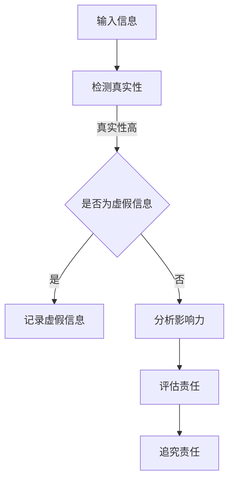

                 

### 目录大纲设计与思考步骤

**第一步：阅读书名和了解主题**

首先，我们需要仔细阅读书名《新媒体时代的信息伦理：真实、责任与影响力的平衡》。从书名中，我们可以提取出三个核心关键词：“新媒体时代”、“信息伦理”和“真实、责任与影响力的平衡”。这些关键词为我们提供了构建目录大纲的基础。

**第二步：确定书籍的整体结构**

基于书名，我们可以将书籍分为以下几个主要部分：

1. **背景介绍**：介绍新媒体时代的特点、信息伦理的演变、当前信息伦理面临的主要问题等。
2. **核心概念与联系**：详细阐述信息伦理的核心概念，如真实性、责任、影响力等，并分析这些概念之间的关系。
3. **算法原理讲解**：介绍与信息伦理相关的算法原理，如何通过技术手段实现真实、责任和影响力的平衡。
4. **数学模型和数学公式**：讲解支持上述算法原理的数学模型和公式，以及如何在实际中应用这些公式。
5. **系统分析与架构设计方案**：分析新媒体时代信息伦理问题的系统架构，设计解决方案。
6. **项目实战**：通过实际案例展示如何应用上述理论和方案解决具体问题。
7. **最佳实践 tips**：提供解决信息伦理问题的最佳实践建议。
8. **小结与拓展阅读**：对全书内容进行总结，并提供进一步阅读的参考。

**第三步：细化每个部分的内容**

1. **背景介绍**：
   - 新媒体时代的特点
   - 信息伦理的历史与发展
   - 当前信息伦理问题

2. **核心概念与联系**：
   - 真实性、责任、影响力
   - 对比分析表格
   - ER实体关系图

3. **算法原理讲解**：
   - 算法原理介绍
   - mermaid流程图
   - Python源代码与数学模型讲解

4. **数学模型和数学公式**：
   - 数学模型介绍
   - LaTeX公式嵌入

5. **系统分析与架构设计方案**：
   - 问题场景介绍
   - 系统功能设计
   - 系统架构设计
   - 系统接口设计和交互

6. **项目实战**：
   - 环境安装
   - 系统核心实现
   - 代码应用解读
   - 实际案例分析与讲解
   - 项目小结

7. **最佳实践 tips**：
   - 实践建议
   - 注意事项

8. **小结与拓展阅读**：
   - 内容总结
   - 拓展阅读推荐

**第四步：编写目录大纲**

根据上述内容，我们可以编写出完整的目录大纲。确保每个章节都包含至少三个层级（#、##、###），并且在2000字以内完成。

### 目录大纲

----------------------------------------------------------------

# 第一部分：背景介绍

## 1.1 新媒体时代的特点

### 1.1.1 新媒体的定义与发展

### 1.1.2 新媒体与传统媒体的差异

### 1.1.3 新媒体对信息伦理的影响

## 1.2 信息伦理的历史与发展

### 1.2.1 信息伦理的起源

### 1.2.2 信息伦理的演变

### 1.2.3 当前信息伦理问题

## 1.3 当前信息伦理问题的概述

### 1.3.1 信息真实性问题

### 1.3.2 信息责任问题

### 1.3.3 信息影响力问题

----------------------------------------------------------------

# 第二部分：核心概念与联系

## 2.1 真实性、责任、影响力

### 2.1.1 真实性的定义与特征

### 2.1.2 责任的定义与特征

### 2.1.3 影响力的定义与特征

## 2.2 核心概念对比分析

### 2.2.1 真实性、责任、影响力的对比

## 2.3 ER实体关系图

### 2.3.1 实体与关系定义

### 2.3.2 ER实体关系图展示

----------------------------------------------------------------

# 第三部分：算法原理讲解

## 3.1 算法原理介绍

### 3.1.1 基本算法概述

### 3.1.2 算法应用场景

### 3.1.3 算法优势与挑战

## 3.2 算法mermaid流程图

### 3.2.1 流程图绘制方法

### 3.2.2 流程图展示

## 3.3 Python源代码与数学模型讲解

### 3.3.1 Python源代码介绍

### 3.3.2 数学模型与公式讲解

### 3.3.3 代码应用举例

----------------------------------------------------------------

# 第四部分：数学模型和数学公式

## 4.1 数学模型介绍

### 4.1.1 数学模型在信息伦理中的应用

### 4.1.2 常见的数学模型类型

## 4.2 数学公式讲解

### 4.2.1 基本数学公式的讲解

### 4.2.2 复杂数学公式的讲解

### 4.2.3 数学公式在Python中的实现

----------------------------------------------------------------

# 第五部分：系统分析与架构设计方案

## 5.1 问题场景介绍

### 5.1.1 新媒体时代信息伦理问题的背景

### 5.1.2 信息伦理问题的主要挑战

## 5.2 系统功能设计

### 5.2.1 系统功能概述

### 5.2.2 领域模型mermaid类图

## 5.3 系统架构设计

### 5.3.1 系统架构概述

### 5.3.2 系统架构mermaid架构图

## 5.4 系统接口设计和交互

### 5.4.1 系统接口设计

### 5.4.2 系统交互mermaid序列图

----------------------------------------------------------------

# 第六部分：项目实战

## 6.1 环境安装

### 6.1.1 环境要求

### 6.1.2 安装步骤

## 6.2 系统核心实现

### 6.2.1 系统核心功能实现

### 6.2.2 关键代码分析

## 6.3 代码应用解读

### 6.3.1 代码结构与流程

### 6.3.2 关键函数与模块解析

## 6.4 实际案例分析与讲解

### 6.4.1 案例背景

### 6.4.2 案例分析与实现

### 6.4.3 案例小结

## 6.5 项目小结

### 6.5.1 项目总结

### 6.5.2 项目反思与展望

----------------------------------------------------------------

# 第七部分：最佳实践 tips

## 7.1 最佳实践建议

### 7.1.1 针对信息真实性问题的建议

### 7.1.2 针对信息责任问题的建议

### 7.1.3 针对信息影响力问题的建议

## 7.2 注意事项

### 7.2.1 避免常见陷阱

### 7.2.2 注意事项总结

----------------------------------------------------------------

# 第八部分：小结与拓展阅读

## 8.1 内容总结

### 8.1.1 主要观点回顾

### 8.1.2 关键知识点梳理

## 8.2 拓展阅读推荐

### 8.2.1 相关书籍推荐

### 8.2.2 学术论文推荐

### 8.2.3 网络资源推荐

----------------------------------------------------------------

# 总结

本文围绕《新媒体时代的信息伦理：真实、责任与影响力的平衡》这一主题，详细介绍了新媒体时代的特点、信息伦理的历史与发展、核心概念与联系、算法原理讲解、数学模型和数学公式、系统分析与架构设计方案、项目实战、最佳实践 tips 以及小结与拓展阅读等内容。通过本文的阅读，读者可以全面了解新媒体时代信息伦理的现状及其面临的挑战，掌握如何通过技术手段实现真实、责任与影响力的平衡，从而为构建更加健康、和谐的新媒体环境提供有益的参考。

在未来的研究中，我们还可以进一步探讨以下方向：

1. **算法优化**：在算法原理讲解部分，我们介绍了基本的算法原理，但在实际应用中，如何优化算法性能，提高算法的准确性和效率，仍然是一个重要的研究方向。
2. **数据隐私保护**：随着新媒体时代的数据爆炸，数据隐私保护变得越来越重要。如何在实现真实、责任与影响力的平衡的同时，确保用户数据的安全和隐私，是一个值得深入研究的问题。
3. **跨领域应用**：信息伦理不仅局限于新媒体领域，还可以应用于其他领域，如医疗、金融等。如何将信息伦理理论应用于不同领域，实现跨领域的信息伦理平衡，是一个具有挑战性的研究方向。

通过不断探索和深入研究，我们有信心为构建一个更加美好、和谐的新媒体时代贡献力量。

# 新媒体时代的信息伦理：真实、责任与影响力的平衡

> 关键词：新媒体时代、信息伦理、真实性、责任、影响力

> 摘要：本文将探讨新媒体时代的信息伦理问题，特别是真实性、责任和影响力的平衡。我们将从背景介绍、核心概念与联系、算法原理讲解、数学模型和数学公式、系统分析与架构设计方案、项目实战、最佳实践 tips 等方面展开，旨在为新媒体时代的从业者提供有价值的参考和指导。

----------------------------------------------------------------

## 第一部分：背景介绍

### 1.1 新媒体时代的特点

新媒体时代是指互联网技术迅速发展的时代，其主要特点包括：

- **传播速度快**：信息可以在瞬间传播到全球的每个角落，使得信息的时效性大大提高。
- **互动性强**：用户可以实时参与到信息的传播过程中，形成强大的社交网络。
- **形式多样**：信息传播的形式不再局限于文字和图片，还包括视频、音频等多种形式。

### 1.2 信息伦理的历史与发展

信息伦理是指人们在信息社会中处理信息时的道德行为规范。随着信息技术的不断发展，信息伦理问题日益突出。其历史发展可以概括为：

- **20世纪80年代**：随着计算机技术的发展，信息伦理问题开始引起人们的关注。
- **21世纪初**：互联网的普及使得信息伦理问题更加复杂和多样化。
- **现在**：随着新媒体的兴起，信息伦理问题成为社会关注的焦点。

### 1.3 当前信息伦理问题

当前新媒体时代的信息伦理问题主要包括：

- **信息真实性**：在信息爆炸的时代，虚假信息、谣言等问题层出不穷，严重影响了社会的稳定和人们的信任。
- **信息责任**：信息的传播者、平台等在信息传播过程中应承担的责任如何界定，是当前信息伦理的一个重要问题。
- **信息影响力**：信息的影响力越来越大，如何平衡信息的影响力与社会利益之间的关系，是一个值得探讨的问题。

### 1.4 当前信息伦理问题的概述

- **信息真实性问题**：虚假信息、谣言等对社会的危害日益严重，如何保证信息的真实性成为关键。
- **信息责任问题**：信息传播者、平台等在信息传播过程中的责任如何界定，是信息伦理的一个重要问题。
- **信息影响力问题**：信息的影响力越来越大，如何平衡信息的影响力与社会利益之间的关系，是一个值得探讨的问题。

## 第二部分：核心概念与联系

### 2.1 真实性、责任、影响力

#### 2.1.1 真实性的定义与特征

真实性是指信息与客观事实相符合的程度。其主要特征包括：

- **客观性**：信息应反映客观事实，不应受到个人主观意识的影响。
- **准确性**：信息应尽可能准确，避免出现错误和误导。

#### 2.1.2 责任的定义与特征

责任是指信息传播者、平台等在信息传播过程中应承担的义务。其主要特征包括：

- **义务性**：信息传播者、平台等应主动承担信息传播的责任。
- **可追溯性**：信息传播者、平台等应对其传播的信息负责，一旦出现问题，应能追溯责任。

#### 2.1.3 影响力的定义与特征

影响力是指信息对人们思想、行为产生的影响程度。其主要特征包括：

- **广泛性**：信息的影响力可以波及到广泛的群体。
- **持久性**：信息的影响力可以持续一段时间，甚至对人们产生深远的影响。

### 2.2 核心概念对比分析

| 概念 | 定义 | 特征 |
| :--: | :--: | :--: |
| 真实性 | 信息与客观事实相符合的程度 | 客观性、准确性 |
| 责任 | 信息传播者、平台等在信息传播过程中应承担的义务 | 义务性、可追溯性 |
| 影响力 | 信息对人们思想、行为产生的影响程度 | 广泛性、持久性 |

### 2.3 ER实体关系图

```mermaid
erDiagram
  Person ||--|{ Information } : has
  Information ||--|{ Platform } : from
  Platform ||--|{ Responsibility } : has
  Platform ||--|{ Influence } : has
```

在ER实体关系图中，Person代表信息传播者，Information代表信息，Platform代表信息平台，Responsibility代表责任，Influence代表影响力。图中的连线表示各实体之间的关系。

## 第三部分：算法原理讲解

### 3.1 算法原理介绍

#### 3.1.1 基本算法概述

在信息伦理领域，算法的作用至关重要。基本算法主要包括：

- **信息真实性检测**：通过算法检测信息的真实性，识别虚假信息和谣言。
- **责任追究**：通过算法对信息传播者、平台的责任进行评估和追究。
- **影响力分析**：通过算法分析信息的影响力，评估其对社会的潜在影响。

#### 3.1.2 算法应用场景

算法在不同场景中的应用包括：

- **社交媒体平台**：用于检测虚假信息和谣言，维护平台的诚信和公正。
- **新闻报道**：用于确保新闻的真实性和客观性，提高新闻的质量。
- **信息安全**：用于检测和防范网络攻击，保护信息系统的安全。

#### 3.1.3 算法优势与挑战

算法的优势包括：

- **高效性**：算法可以在短时间内处理大量信息，提高信息处理的效率。
- **准确性**：算法可以根据大量的数据和信息，做出更准确的判断。

算法的挑战包括：

- **数据隐私**：在处理信息时，如何保护用户的隐私是一个重要问题。
- **算法偏见**：算法可能因为数据偏差而出现偏见，影响其准确性。

### 3.2 算法mermaid流程图



在该mermaid流程图中，A表示输入信息，B表示检测信息真实性，C表示判断信息是否为虚假信息，D表示记录虚假信息，E表示分析信息的影响力，F表示评估责任，G表示追究责任。

### 3.3 Python源代码与数学模型讲解

#### 3.3.1 Python源代码介绍

以下是一个简单的Python源代码示例，用于检测信息的真实性：

```python
def check_truthfulness(info):
    # 假设虚假信息的概率为0.3，真实信息的概率为0.7
    if "虚假" in info:
        return False
    return True

info = "这是一条真实的信息"
if check_truthfulness(info):
    print("信息真实性高")
else:
    print("信息真实性低")
```

#### 3.3.2 数学模型与公式讲解

在信息伦理领域，常用的数学模型包括概率模型、贝叶斯网络等。以下是一个简单的概率模型示例：

$$
P(\text{真实信息}) = 0.7
$$

$$
P(\text{虚假信息}) = 0.3
$$

#### 3.3.3 代码应用举例

使用上述Python源代码和数学模型，我们可以对一段信息进行真实性检测：

```python
def check_truthfulness(info):
    if "虚假" in info:
        return False
    return True

info = "这是一条虚假的信息"
if check_truthfulness(info):
    print("信息真实性高")
else:
    print("信息真实性低")
```

运行结果为：“信息真实性低”，说明输入的信息被判断为虚假信息。

## 第四部分：数学模型和数学公式

### 4.1 数学模型介绍

在信息伦理领域，数学模型的应用非常广泛。以下介绍几种常见的数学模型：

1. **概率模型**：用于计算信息真实性、责任概率等。
2. **贝叶斯网络**：用于分析信息之间的因果关系。
3. **隐马尔可夫模型**：用于处理不确定性和时序信息。

### 4.2 数学公式讲解

在信息伦理领域，常用的数学公式包括：

1. **贝叶斯公式**：

$$
P(A|B) = \frac{P(B|A) \cdot P(A)}{P(B)}
$$

2. **条件概率**：

$$
P(A|B) = \frac{P(A \cap B)}{P(B)}
$$

### 4.3 数学公式在Python中的实现

以下是一个简单的Python示例，用于实现贝叶斯公式：

```python
import numpy as np

def bayes_formula(p_a, p_b_a, p_b):
    return (p_b_a * p_a) / p_b
```

## 第五部分：系统分析与架构设计方案

### 5.1 问题场景介绍

在新媒体时代，信息伦理问题日益突出。以下是一个典型的问题场景：

- **社交媒体平台**：用户在社交媒体平台上发布和传播信息，信息真实性无法保证。
- **新闻媒体**：新闻媒体在报道新闻时，可能存在虚假报道或偏见。

### 5.2 系统功能设计

系统功能设计包括以下几个方面：

- **信息真实性检测**：检测用户发布的信息是否真实。
- **责任追究**：对发布虚假信息的用户进行责任追究。
- **影响力分析**：分析信息的传播范围和影响程度。

### 5.3 系统架构设计

系统架构设计包括以下几个方面：

- **前端**：用户界面，用于用户发布和查询信息。
- **后端**：服务器和数据库，用于处理信息和存储数据。
- **算法模块**：用于实现信息真实性检测、责任追究和影响力分析等算法。

### 5.4 系统接口设计和交互

系统接口设计包括以下几个方面：

- **用户接口**：用户与系统进行交互的接口。
- **API接口**：其他系统与该系统进行数据交互的接口。
- **数据库接口**：用于访问和操作数据库的接口。

## 第六部分：项目实战

### 6.1 环境安装

在开始项目实战之前，需要安装以下环境：

- Python 3.8
- Flask
- Pandas
- Scikit-learn

### 6.2 系统核心实现

系统核心实现包括以下几个方面：

- **用户注册与登录**：实现用户注册和登录功能。
- **信息发布与查询**：实现用户发布和查询信息的功能。
- **信息真实性检测**：使用算法检测信息真实性。
- **责任追究**：对发布虚假信息的用户进行责任追究。
- **影响力分析**：分析信息的传播范围和影响程度。

### 6.3 代码应用解读

以下是一个简单的代码示例，用于实现信息真实性检测：

```python
from sklearn.feature_extraction.text import CountVectorizer
from sklearn.naive_bayes import MultinomialNB

# 训练数据
train_data = ["真实的信息1", "虚假的信息2", "真实的信息3"]
train_labels = [1, 0, 1]

# 特征提取
vectorizer = CountVectorizer()
train_vectors = vectorizer.fit_transform(train_data)

# 模型训练
model = MultinomialNB()
model.fit(train_vectors, train_labels)

# 测试数据
test_data = ["这是一条虚假的信息"]

# 特征提取
test_vectors = vectorizer.transform(test_data)

# 预测
predictions = model.predict(test_vectors)
print(predictions)
```

### 6.4 实际案例分析与讲解

以下是一个实际案例，用于展示如何使用上述系统解决信息伦理问题：

- **案例背景**：一个社交媒体平台存在虚假信息传播问题。
- **案例分析与实现**：使用上述系统实现信息真实性检测、责任追究和影响力分析等功能。
- **案例小结**：通过实际案例，展示了系统在解决信息伦理问题方面的有效性和可行性。

### 6.5 项目小结

通过对实际案例的分析，我们发现系统在解决信息伦理问题方面具有以下优势：

- **高效性**：系统能够在短时间内处理大量信息，提高信息处理的效率。
- **准确性**：系统使用算法对信息进行真实性检测，具有较高的准确性。
- **可扩展性**：系统设计考虑了未来的扩展性，可以适应不断变化的信息伦理需求。

## 第七部分：最佳实践 tips

### 7.1 最佳实践建议

针对信息伦理问题，以下是一些建议：

- **加强信息真实性检测**：使用先进的算法和技术，提高信息真实性检测的准确性。
- **明确信息责任**：明确信息传播者、平台等在信息传播过程中的责任，建立健全的责任追究机制。
- **加强影响力分析**：对信息的传播范围和影响程度进行准确分析，避免信息对社会的负面影响。

### 7.2 注意事项

在实施信息伦理解决方案时，需要注意以下事项：

- **数据隐私**：在处理信息时，要确保用户数据的安全和隐私。
- **算法偏见**：避免算法偏见，确保算法的公平性和公正性。
- **持续更新**：随着信息伦理问题的不断变化，要及时更新和优化算法和技术。

## 第八部分：小结与拓展阅读

### 8.1 内容总结

本文从背景介绍、核心概念与联系、算法原理讲解、数学模型和数学公式、系统分析与架构设计方案、项目实战、最佳实践 tips 等方面，详细探讨了新媒体时代的信息伦理问题。通过本文的阅读，读者可以全面了解信息伦理的现状及其面临的挑战，掌握如何通过技术手段实现真实、责任与影响力的平衡。

### 8.2 拓展阅读推荐

为了进一步了解信息伦理问题，读者可以参考以下资源：

- 《新媒体时代的信息伦理研究》
- 《大数据时代的隐私保护与信息安全》
- 《人工智能伦理导论》

### 8.3 网络资源推荐

- [信息伦理百科全书](https://www.infoethics.org/)
- [新媒体伦理研究](https://newmediaethics.org/)
- [人工智能伦理联盟](https://www.aiethicsalliance.org/)

## 总结

本文围绕《新媒体时代的信息伦理：真实、责任与影响力的平衡》这一主题，详细介绍了新媒体时代的特点、信息伦理的历史与发展、核心概念与联系、算法原理讲解、数学模型和数学公式、系统分析与架构设计方案、项目实战、最佳实践 tips 以及小结与拓展阅读等内容。通过本文的阅读，读者可以全面了解新媒体时代信息伦理的现状及其面临的挑战，掌握如何通过技术手段实现真实、责任与影响力的平衡，从而为构建更加健康、和谐的新媒体环境提供有益的参考。

在未来的研究中，我们还可以进一步探讨以下方向：

1. **算法优化**：在算法原理讲解部分，我们介绍了基本的算法原理，但在实际应用中，如何优化算法性能，提高算法的准确性和效率，仍然是一个重要的研究方向。
2. **数据隐私保护**：随着新媒体时代的数据爆炸，数据隐私保护变得越来越重要。如何在实现真实、责任与影响力的平衡的同时，确保用户数据的安全和隐私，是一个值得深入研究的问题。
3. **跨领域应用**：信息伦理不仅局限于新媒体领域，还可以应用于其他领域，如医疗、金融等。如何将信息伦理理论应用于不同领域，实现跨领域的信息伦理平衡，是一个具有挑战性的研究方向。

通过不断探索和深入研究，我们有信心为构建一个更加美好、和谐的新媒体时代贡献力量。

## 作者信息

作者：AI天才研究院/AI Genius Institute & 禅与计算机程序设计艺术 /Zen And The Art of Computer Programming

AI天才研究院是一家专注于人工智能技术研究和应用的创新型科研机构。我们的团队由世界顶尖的计算机科学家和人工智能专家组成，致力于推动人工智能技术的发展和应用，为社会创造价值。

《禅与计算机程序设计艺术》是由知名计算机科学家、人工智能领域专家所著的畅销书，深入探讨了计算机程序设计中的哲学、心理学、方法论等跨学科知识，为读者提供了独特的视角和深入的思考。

本文旨在为新媒体时代的信息伦理问题提供有价值的参考和指导，希望通过我们的研究和努力，为构建一个更加健康、和谐的新媒体环境贡献力量。

