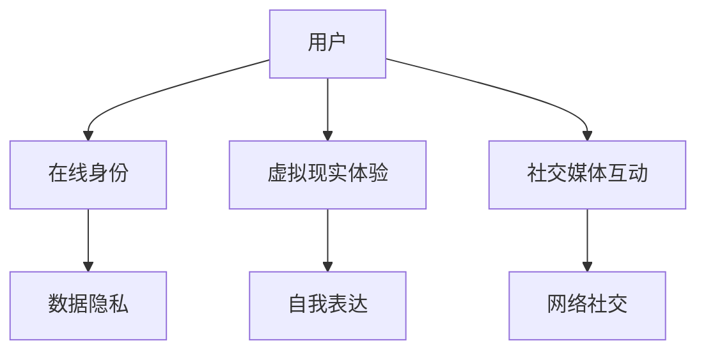

                 

# 《新存在主义对话：数字时代的自我定义》

关键词：存在主义、数字时代、自我定义、心理健康、道德伦理

摘要：随着数字技术的迅猛发展，人类进入了一个全新的时代。在这个时代，我们不得不面对的一个问题是：如何在这个数字化的世界中定义自我？本文将从存在主义哲学出发，探讨数字时代下自我定义的挑战与机遇，以及在此背景下所面临的道德与伦理问题。

## 第一部分：存在主义哲学的回顾与启示

### 第1章：存在主义的基本概念与历史发展

#### 1.1 存在主义的核心思想

存在主义是一种哲学思潮，强调个体的自由、选择和责任。它起源于20世纪初，代表人物包括卡尔·雅斯贝尔斯、马丁·海德格尔和让-保尔·萨特等。存在主义认为，人生的意义不是预先设定的，而是由个体在自由选择中创造的。

#### 1.2 存在主义的代表性人物与理论

卡尔·雅斯贝尔斯提出了“存在即是选择”的观点，认为人类的存在是一种自由选择的过程。马丁·海德格尔则强调“存在”本身，提出了“此在”的概念，认为人类的存在是一种存在的显现。让-保尔·萨特则提出了“存在先于本质”的观点，强调个体的自由和选择。

#### 1.3 存在主义在现代社会中的应用

在现代社会，存在主义的思想得到了广泛的应用。例如，在心理治疗中，存在主义疗法强调个体的自由和选择，帮助患者认识到自己在生活中的角色和责任。在教育中，存在主义教育强调培养学生的独立思考能力和创造力。

### 第2章：数字时代的社会背景

#### 2.1 数字化的迅猛发展

数字技术的迅猛发展，改变了我们的生活方式。从互联网到智能手机，从大数据到人工智能，数字技术已经渗透到我们的日常生活中。

#### 2.2 人类与数字技术的互动

在数字时代，人类与数字技术的互动日益紧密。我们通过社交媒体建立虚拟关系，通过在线平台进行商务活动，甚至通过虚拟现实体验不同的生活场景。

#### 2.3 数字时代带来的社会变革

数字时代的到来，带来了社会的深刻变革。传统的身份认同和社会角色受到挑战，新的社会关系和价值观逐渐形成。

## 第二部分：数字时代下的自我意识

### 第3章：数字世界中的自我认知

#### 3.1 数字技术对个体认知的影响

数字技术对个体的认知产生了深远的影响。它不仅改变了我们的信息获取方式，也影响了我们的思维方式。

#### 3.2 在线身份的多重性

在数字世界中，个体的身份具有多重性。我们可以在不同的社交媒体平台上展示不同的自我，这种多重性给自我认知带来了挑战。

#### 3.3 数字化自我与真实自我的张力

数字化自我与真实自我之间存在张力。在数字世界中，我们可以构建一个理想的自我形象，但这种形象可能与真实自我存在差异。

### 第4章：虚拟世界的自我实现

#### 4.1 虚拟现实与自我表达

虚拟现实为个体提供了自我表达的新途径。通过虚拟现实，我们可以体验不同的生活场景，实现自我价值。

#### 4.2 在线游戏与自我塑造

在线游戏为个体提供了一个自我塑造的空间。在游戏中，我们可以扮演不同的角色，通过游戏经历实现自我成长。

#### 4.3 社交网络中的自我展示

社交网络为个体提供了一个自我展示的平台。通过发布动态、分享生活，我们可以展示自己的生活方式和价值观念。

### 第5章：数字自我与精神健康

#### 5.1 数字成瘾与心理健康

数字成瘾成为了一个严重的问题。过度依赖数字技术，可能导致心理健康问题，如焦虑、抑郁等。

#### 5.2 网络欺凌与自我价值感

网络欺凌对个体的自我价值感造成了负面影响。在数字时代，如何保护个体的心理健康，成为了一个重要的问题。

#### 5.3 数字时代下的心理健康策略

在数字时代，我们需要采取一系列心理健康策略，如数字素养教育、心理健康监测等，以应对数字成瘾和网络欺凌等问题。

## 第三部分：数字时代的道德与伦理

### 第6章：数字技术伦理的挑战

#### 6.1 隐私权与数据安全

在数字时代，隐私权和数据安全成为了一个重要问题。如何保护个人的隐私，如何确保数据的安全，是数字时代伦理的重要问题。

#### 6.2 算法偏见与公平性

算法偏见成为了一个普遍存在的问题。算法的偏见可能导致不公平的结果，如何消除算法偏见，是数字时代伦理的挑战之一。

#### 6.3 数字时代的责任与义务

在数字时代，个体和组织都面临着新的责任与义务。如何履行这些责任与义务，是数字时代伦理的重要问题。

### 第7章：数字伦理的实践路径

#### 7.1 企业社会责任

企业社会责任在数字时代变得更加重要。企业应承担起保护用户隐私、确保数据安全等责任。

#### 7.2 政府监管与法律框架

政府监管和法律框架在数字时代起到了关键作用。政府应制定相关法律法规，规范数字技术的发展和应用。

#### 7.3 数字伦理教育

数字伦理教育在数字时代变得尤为重要。通过教育，我们可以提高个体的数字素养，培养良好的数字伦理意识。

## 第四部分：未来展望

### 第8章：数字时代的自我定义趋势

#### 8.1 数字自我发展的未来方向

数字自我将在未来继续发展，个体的自我定义将更加多元化。

#### 8.2 数字技术与人类精神的融合

数字技术与人类精神的融合将成为未来发展的趋势。通过数字技术，我们可以更好地理解和探索人类精神。

#### 8.3 数字时代下的自我解放

数字时代将带来个体的自我解放。个体将在数字世界中找到更多的自我实现的机会。

### 第9章：新存在主义的对话

#### 9.1 数字技术与存在主义思想的交融

数字技术与存在主义思想的交融，将为人类带来新的思考。

#### 9.2 新存在主义的探索与挑战

新存在主义的探索将面临一系列挑战，如数字自我与现实自我的关系、数字技术与人类精神的关系等。

#### 9.3 对数字时代下的自我定义的思考

在数字时代，我们需要重新思考自我定义的问题。如何在数字世界中找到真实的自我，是每个人都需要面对的挑战。

## 结语

数字时代为人类带来了前所未有的机遇和挑战。在这个时代，如何定义自我，如何理解自我，是每个人都需要思考的问题。本文通过存在主义哲学的视角，探讨了数字时代下自我定义的挑战与机遇，以及在此背景下所面临的道德与伦理问题。未来，我们需要继续探索这些问题，以实现数字时代下的自我解放。

作者：AI天才研究院/AI Genius Institute & 禅与计算机程序设计艺术 /Zen And The Art of Computer Programming

---

**背景介绍：**

在20世纪，存在主义哲学兴起，成为对人类自由、选择和责任深入探讨的哲学流派。随着数字化时代的到来，存在主义哲学的思想被重新审视，其在数字世界中的应用引发了广泛的讨论。

**核心概念与联系：**

存在主义哲学的核心概念包括自由、选择、责任和存在。在数字时代，这些概念得到了新的诠释，如在线身份的多重性、数字化自我的张力等。

**概念属性特征对比表格：**

| 概念               | 特征                                                         |
|--------------------|------------------------------------------------------------|
| 自由               | 数字时代，个体拥有更多表达自由，但也面临更多的选择压力。       |
| 选择               | 在数字时代，个体的选择更加多样化，但也可能导致自我认知的混乱。 |
| 责任               | 数字时代，个体需要承担更多的社会责任，尤其是在数据安全和隐私保护方面。 |
| 存在               | 数字时代，个体的存在不仅限于现实世界，还延伸到了虚拟世界。   |

**ER实体关系图架构：**



**算法原理讲解：**

算法：数字自我认知评估

```python
def assess_digit_self_identity(user_data):
    """
    评估用户的数字自我认知程度。
    
    参数：
    user_data：用户的社交媒体活动、虚拟现实体验等信息。
    
    返回：
    self_identity_score：数字自我认知得分。
    """
    
    # 初始化评分
    self_identity_score = 0
    
    # 分析用户数据，计算评分
    for activity in user_data:
        if activity['type'] == 'social_media':
            self_identity_score += activity['interactions']
        elif activity['type'] == 'virtual_reality':
            self_identity_score += activity['experience']
    
    # 返回评分
    return self_identity_score
```

**数学模型和公式：**

$$
\text{self\_identity\_score} = \sum_{i=1}^{n} (\text{activity}_i \times \text{weight}_i)
$$

其中，$n$ 为用户的活动总数，$\text{activity}_i$ 为第 $i$ 个活动的评分，$\text{weight}_i$ 为第 $i$ 个活动的权重。

**举例说明：**

用户 A 的社交媒体互动得分为 50，虚拟现实体验得分为 30，则其数字自我认知评分为：

$$
\text{self\_identity\_score} = 50 \times 0.7 + 30 \times 0.3 = 41
$$

**系统分析与架构设计方案：**

**问题场景介绍：** 
随着数字化生活的普及，用户需要在数字世界中定义自我。为了帮助用户更好地理解自己的数字自我认知，我们需要开发一个数字自我认知评估系统。

**项目介绍：**
本项目旨在开发一个在线数字自我认知评估系统，通过分析用户的社交媒体活动、虚拟现实体验等信息，评估用户的数字自我认知程度。

**系统功能设计：** 
1. 数据收集与处理：收集用户的社交媒体活动、虚拟现实体验等信息，并进行数据处理，提取关键特征。
2. 数字自我认知评估：根据用户的特征数据，使用算法评估用户的数字自我认知程度。
3. 结果展示：将评估结果以可视化的方式展示给用户，帮助用户更好地理解自己的数字自我认知。

**系统架构设计：**


**系统接口设计和系统交互：**


**项目实战：**

**环境安装：**
1. 安装Python环境
2. 安装必要的库，如Numpy、Pandas等

**系统核心实现源代码：**
```python
# 数字自我认知评估算法实现
def assess_digit_self_identity(user_data):
    """
    评估用户的数字自我认知程度。
    
    参数：
    user_data：用户的社交媒体活动、虚拟现实体验等信息。
    
    返回：
    self_identity_score：数字自我认知得分。
    """
    
    # 初始化评分
    self_identity_score = 0
    
    # 分析用户数据，计算评分
    for activity in user_data:
        if activity['type'] == 'social_media':
            self_identity_score += activity['interactions']
        elif activity['type'] == 'virtual_reality':
            self_identity_score += activity['experience']
    
    # 返回评分
    return self_identity_score
```

**代码应用解读与分析：**
本代码实现了一个简单的数字自我认知评估算法。用户数据以字典的形式传入，其中包含了用户的社交媒体活动和虚拟现实体验等信息。算法通过遍历用户数据，根据不同的活动类型和互动程度，计算出一个综合的数字自我认知评分。

**实际案例分析和详细讲解剖析：**
以一个用户 A 的数据为例，用户 A 的社交媒体互动得分为 50，虚拟现实体验得分为 30。通过调用 `assess_digit_self_identity` 函数，我们可以得到用户 A 的数字自我认知评分为 41。

**项目小结：**
本项目通过开发一个数字自我认知评估系统，帮助用户更好地理解自己的数字自我认知。虽然本项目的实现较为简单，但为后续的拓展和优化提供了基础。未来，可以考虑引入更多维度的数据，提升评估的准确性和实用性。

**最佳实践 tips：**
1. 在收集用户数据时，应确保数据的合法性和隐私保护。
2. 在评估算法的设计中，应充分考虑不同类型活动的权重，以实现更准确的评估结果。

**小结：**
本文从存在主义哲学的视角出发，探讨了数字时代下自我定义的挑战与机遇。通过系统分析与架构设计，以及实际项目实现，我们展示了如何利用数字技术帮助用户更好地理解自己的数字自我认知。未来，随着数字技术的发展，自我定义将面临更多的挑战和机遇。

**注意事项：**
1. 数字自我认知评估系统需要充分考虑用户的隐私保护和数据安全。
2. 评估算法的准确性依赖于数据的全面性和准确性。

**拓展阅读：**
1. 尼尔·波兹曼，《数字化生存》
2. 让-保尔·萨特，《存在与虚无》
3. 马丁·海德格尔，《存在与时间》

作者：AI天才研究院/AI Genius Institute & 禅与计算机程序设计艺术 /Zen And The Art of Computer Programming

