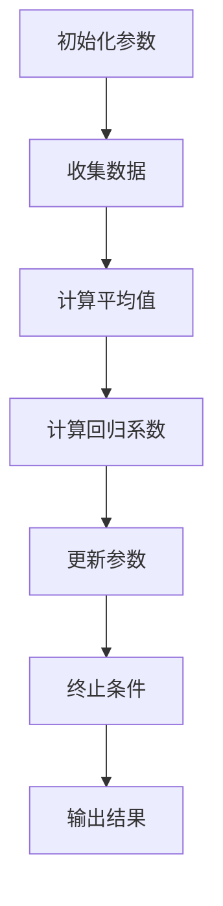

                 

### 新欲望的浮现与社会变迁

在21世纪的数字化浪潮中，社会变迁呈现出前所未有的速度与深度，与此同时，新欲望也在不断地涌现。这些新欲望不仅反映了人们生活方式和价值观的变化，更是社会结构和经济模式变革的催化剂。本文将围绕“新欲望的浮现与社会变迁”这一主题，进行深入探讨。

#### 关键词
- **社会变迁**
- **新欲望**
- **科技发展**
- **经济模式**
- **文化变革**

#### 摘要
本文旨在揭示新欲望的内涵和特征，分析其与社会变迁的相互关系，并通过实际案例探讨应对策略。文章首先介绍社会变迁的背景和理论框架，然后探讨新欲望的内涵和类型，接着分析新欲望对社会变迁的影响，并通过案例研究来验证这些关系，最后提出应对策略和未来展望。

## 引言

### 0.1 书籍背景

随着信息技术的迅猛发展，人类社会正经历着一场深刻的变革。从工业时代到信息时代，再到如今的数字经济时代，社会变迁的速度和广度前所未有。这种变迁不仅体现在经济和技术的进步上，更体现在人们的生活方式和价值观的变化中。在这种背景下，“新欲望”逐渐浮现。

新欲望并不是传统欲望的简单延续，而是在现代科技和社会环境下产生的新型欲望。这些欲望更加多样化、个性化，并且高度依赖科技。例如，数字化消费、在线社交、自我提升和个性表达等，都是新欲望的典型代表。

### 0.1.1 社会变迁的加速

社会变迁的加速主要表现为以下几个方面：

1. **全球化**：全球化使得不同国家和地区之间的联系更加紧密，文化、技术和经济的交流日益频繁。
2. **信息化**：信息技术的飞速发展，使得信息获取和传播变得更加便捷，人们的生活方式和工作方式也在发生变革。
3. **城市化**：城市化进程加速，人口向城市聚集，城市成为了经济发展的核心和文化的聚集地。

### 0.1.2 新欲望的兴起

新欲望的兴起与社会变迁密切相关。随着社会的发展，人们的需求和欲望也在不断变化。传统欲望往往基于生存和繁衍，而新欲望则更多地关注个性表达、自我实现和社会参与。

1. **消费欲望**：在物质生活丰富的基础上，人们对高质量、个性化、定制化的商品和服务的需求日益增长。
2. **自我实现欲望**：随着教育和文化水平的提高，人们更加重视自我价值的实现，追求事业成功和个人成长。
3. **社会参与欲望**：在社交媒体和数字平台的支持下，人们更加积极地参与社会事务，表达自己的观点和主张。

### 0.1.3 研究目的与意义

本研究旨在揭示新欲望的内涵和特征，分析其与社会变迁的关系，以期为相关领域的研究和实践提供参考。研究目的主要包括：

1. **理解新欲望的本质**：通过深入研究，揭示新欲望的形成机制和内涵特征，为相关领域的研究提供理论基础。
2. **分析社会变迁的动力**：探讨新欲望如何影响社会变迁，为理解社会变迁的内在机制提供新的视角。
3. **提出应对策略**：基于研究结果，提出有效的应对策略，帮助个体和社会更好地适应新欲望带来的变革。

本研究具有重要的理论和实践意义。在理论层面，它拓展了社会变迁和新欲望的研究领域，丰富了相关理论框架。在实践层面，它为政策制定者、企业和社会组织提供了有针对性的建议，有助于他们更好地应对新欲望带来的挑战。

### 0.2 研究方法

本研究采用定性与定量相结合的研究方法，以全面揭示新欲望的内涵和特征，分析其与社会变迁的关系。

#### 0.2.1 定性研究

定性研究主要通过深度访谈、焦点小组讨论和案例分析等方法进行。这些方法有助于深入了解新欲望的产生背景、内涵特征和影响机制。

1. **深度访谈**：针对不同人群，如年轻人、中年人、老年人等，进行深度访谈，了解他们对新欲望的看法和体验。
2. **焦点小组讨论**：邀请不同领域的专家和学者，就新欲望的内涵、特征和影响进行深入讨论，形成共识。
3. **案例分析**：选择具有代表性的案例，如科技公司、社会运动等，分析新欲望在这些案例中的具体表现和影响。

#### 0.2.2 定量研究

定量研究主要通过问卷调查和统计分析等方法进行。这些方法有助于量化新欲望的内涵和特征，揭示其与社会变迁的关系。

1. **问卷调查**：设计问卷，针对广泛的受众群体，收集关于新欲望和社会变迁的数据。
2. **统计分析**：利用统计方法，对收集到的数据进行分析，揭示新欲望的分布特征和变化趋势。

#### 0.2.3 多元分析方法

为了更全面地揭示新欲望的内涵和特征，本研究采用多元分析方法，结合定性研究和定量研究的结果，进行综合分析。

1. **内容分析**：对访谈和讨论的内容进行编码和分类，提取出新欲望的核心特征和内涵。
2. **回归分析**：利用回归分析方法，探讨新欲望与社会变迁之间的因果关系。
3. **因子分析**：通过因子分析，提取出影响新欲望的主要因素，为进一步研究提供基础。

通过上述研究方法，本研究旨在全面揭示新欲望的内涵和特征，分析其与社会变迁的关系，为相关领域的研究和实践提供参考。接下来，我们将进一步探讨社会变迁的理论框架和新欲望的内涵与特征。

## 第一部分：社会变迁的动因

### 1. 社会变迁的理论框架

社会变迁是指一个社会在长时间内经历的结构、文化、价值和生活方式等方面的显著变化。理解社会变迁的动因，需要借助一系列理论框架来进行分析。

#### 1.1.1 传统变迁理论的回顾

传统变迁理论主要关注经济因素和社会结构的变化。例如，马克思主义的唯物史观认为，经济基础是社会变迁的根本动力。此外，韦伯的宗教社会理论也强调宗教信仰对社会变迁的深远影响。

然而，随着全球化、信息化和城市化进程的加速，传统变迁理论面临一定的局限性。首先，传统理论往往过于强调经济因素，忽视了文化和社会因素的作用。其次，传统理论在解释现代社会变迁的复杂性和多样性时显得力不从心。

#### 1.1.2 现代变迁理论的发展

现代变迁理论在传统理论的基础上，进一步拓展了社会变迁的动因。例如，帕森斯的结构功能主义认为，社会系统内部的互动和调整是推动变迁的重要因素。此外，贝尔的科技与社会理论强调科技发展对社会变迁的深远影响。

现代变迁理论还关注全球化、信息化和城市化等新兴因素。例如，全球化理论认为，全球化进程中的经济、政治和文化交流是推动社会变迁的重要动力。信息化理论则强调信息技术对社会结构和文化的影响。城市化理论关注城市化进程中的社会经济和文化变革。

#### 1.1.3 变迁理论在社会研究中的应用

变迁理论在社会研究中的应用十分广泛。例如，社会学家通过分析经济、政治和文化因素，探讨社会变迁的内在机制和影响因素。经济学家则通过量化方法，研究经济变迁对其他社会领域的影响。政治学家则关注政治制度的变迁及其对社会的影响。

在实际研究中，变迁理论可以帮助我们理解现代社会中各种复杂现象的成因。例如，互联网的兴起对社会结构和生活方式的影响，全球气候变化对经济发展的影响，以及文化多样性的增加对社会凝聚力的挑战等。

通过变迁理论的分析，我们可以更全面地理解社会变迁的动因和影响，为制定政策提供科学依据。接下来，我们将探讨社会变迁的主要动力。

### 1.2 社会变迁的动力

社会变迁的动力是推动社会结构、文化、价值和生活方式等方面发生显著变化的各种因素。理解这些动力有助于我们更深入地分析社会变迁的动因。

#### 1.2.1 经济因素

经济因素是社会变迁的主要动力之一。随着生产力的发展，经济结构的调整和升级不断推动社会变迁。例如，工业革命引发了一系列社会变革，包括城市化、劳动分工和工业化生产。在现代社会，信息化和数字经济的发展也推动了经济模式的转变，进一步加速了社会变迁。

经济因素对社会变迁的影响主要表现在以下几个方面：

1. **生产力发展**：生产力的提高使得社会能够生产更多的商品和服务，从而改变了人们的生活方式和社会结构。
2. **经济结构变革**：经济结构的变革，如从农业社会向工业社会、信息社会的转变，推动了社会各个领域的变革。
3. **收入分配**：收入分配的变化会影响社会的阶层结构和权力关系，进而影响社会变迁。

#### 1.2.2 政治因素

政治因素也是社会变迁的重要动力。政治权力的分配和转移、政治制度的变革和政治理念的更新，都会对社会变迁产生深远影响。

政治因素对社会变迁的影响主要表现在以下几个方面：

1. **政治权力**：政治权力的分配和转移是推动社会变迁的重要因素。例如，民主制度的兴起和普及推动了社会的自由化和多元化。
2. **政治制度**：政治制度的变革，如从封建制度向资本主义制度、社会主义制度的转变，深刻影响了社会的经济、文化和社会结构。
3. **政治理念**：政治理念的更新和变革，如从人治到法治、从独裁到民主的转变，推动了社会的公平正义和人权保障。

#### 1.2.3 文化因素

文化因素在社会变迁中扮演着关键角色。文化的演变和更新不仅反映了社会的价值观和生活方式的变化，也是推动社会变迁的重要动力。

文化因素对社会变迁的影响主要表现在以下几个方面：

1. **价值观**：价值观的变化会影响人们的行为方式和生活方式，进而推动社会变迁。例如，从重视家庭和传统价值观向重视个人自由和多元价值观的转变，推动了社会结构的变革。
2. **意识形态**：意识形态的变革，如从封建主义向资本主义、社会主义的转变，深刻影响了社会的政治、经济和文化发展。
3. **文化多样性**：文化多样性的增加促进了社会的开放和包容，推动了社会的多元化和现代化。

通过分析经济、政治和文化因素，我们可以更深入地理解社会变迁的动因和影响。这些因素相互作用，共同推动了社会结构的变革和发展。在下一部分，我们将探讨新欲望的内涵与特征。

### 第二部分：新欲望的内涵与特征

#### 2.1 新欲望的定义

新欲望是在现代科技和社会变迁背景下逐渐浮现的新型欲望。这些欲望与传统欲望有所不同，更加多样化、个性化，并且高度依赖科技。新欲望不仅反映了人们对生活质量的追求，也反映了社会结构和文化价值观的变化。

新欲望与传统欲望的主要区别在于：

1. **多样性与个性化**：新欲望更加多样化和个性化，不再局限于传统的生活需求，而是追求更高层次的精神满足和个性表达。
2. **依赖科技**：新欲望的形成和满足高度依赖于科技，尤其是互联网和数字技术。例如，在线购物、社交媒体和在线娱乐等，都是新欲望的典型代表。
3. **自我实现和社会参与**：新欲望不仅关注个人需求的满足，更加注重自我实现和社会参与。例如，追求职业成功、参与社会事务和表达个人观点等，都是新欲望的体现。

#### 2.1.1 新欲望与传统欲望的比较

新欲望与传统欲望在内涵和特征上存在显著差异。传统欲望主要基于生存和繁衍需求，如食物、住所和繁衍后代等。而新欲望则更加关注精神层面的需求，如自我实现、个性表达和社会参与。

1. **传统欲望**：传统欲望往往具有普遍性和共性，如饮食、住房和繁衍后代等。这些欲望在人类历史上长期存在，并形成了固定的文化价值观和生活方式。
2. **新欲望**：新欲望则更加多样化和个性化，反映了现代社会多元化的需求和价值观。例如，数字化消费、在线社交、自我提升和个性表达等，都是新欲望的典型代表。

新欲望与传统欲望的另一个区别在于满足方式。传统欲望通常通过物质和资源来实现，而新欲望则更多地依赖于科技和数字平台。例如，在线购物和社交媒体不仅满足了人们的消费和社交需求，还提供了多样化的个性化服务。

#### 2.1.2 新欲望的形成因素

新欲望的形成是多种因素共同作用的结果，包括社会变迁、科技发展和文化变革等。

1. **社会变迁**：社会变迁，特别是城市化、全球化和信息化进程，改变了人们的生活方式和价值观。随着社会的发展，人们的需求和欲望也在不断变化，从而催生了新欲望。
2. **科技发展**：科技的发展，特别是互联网和数字技术的普及，为新欲望的形成提供了技术基础。例如，互联网使得信息获取和传播变得更加便捷，人们可以更快速地满足自己的需求。
3. **文化变革**：文化变革，特别是价值观的多元化和开放性，为新欲望的形成提供了文化环境。例如，现代社会的包容性和多样性，使得人们更加重视个性表达和自我实现。

新欲望的形成不仅反映了个体需求的变化，也反映了社会结构和文化价值观的变革。随着社会的不断进步，新欲望将继续演变和更新，为社会变迁提供新的动力。

#### 2.2 新欲望的类型

新欲望的类型多种多样，反映了现代社会的多元化需求和价值观。以下是几种主要类型的新欲望：

##### 2.2.1 消费欲望

消费欲望是新欲望中最常见的一种，主要表现为对物质商品和服务的追求。随着经济的发展和生活水平的提高，人们对高质量、个性化、定制化的商品和服务的需求不断增长。消费欲望不仅体现在日常消费品上，还体现在奢侈品和高端服务上。

消费欲望的形成主要受以下几个因素影响：

1. **经济发展**：经济的快速增长为人们提供了更多的消费能力，推动了消费欲望的增长。
2. **文化影响**：文化价值观的变化，如对个性化、时尚和品质的追求，使得消费欲望更加多样化。
3. **科技发展**：科技的进步，特别是互联网和数字技术的发展，使得消费方式更加便捷和多样化，进一步激发了消费欲望。

##### 2.2.2 自我实现欲望

自我实现欲望是新欲望中的重要类型，主要表现为对个人成长、职业成功和社会地位的追求。随着教育水平的提高和社会竞争的加剧，人们越来越重视自我价值的实现和自我成长。

自我实现欲望的形成主要受以下几个因素影响：

1. **教育水平**：教育水平的提高使得人们对自我实现和职业发展的期望更高。
2. **社会竞争**：社会竞争的加剧使得人们更加重视自我能力的提升和职业成功。
3. **文化变革**：现代社会对个人成长和职业成功的重视，进一步激发了自我实现欲望。

##### 2.2.3 社会参与欲望

社会参与欲望是新欲望中的另一种重要类型，主要表现为对参与社会事务、表达个人观点和参与公共事务的兴趣。随着社交媒体和数字平台的普及，人们更加积极地参与社会事务，表达自己的观点和主张。

社会参与欲望的形成主要受以下几个因素影响：

1. **信息获取**：互联网和数字技术的发展使得人们可以更方便地获取信息，提高了对社会事务的认知和参与意愿。
2. **文化变革**：现代社会对个人参与和社会责任的重视，进一步激发了社会参与欲望。
3. **科技发展**：数字平台和社交媒体的普及为人们提供了更多的参与渠道，降低了参与成本，提高了参与意愿。

新欲望的类型多种多样，反映了现代社会的多元化需求和价值观。通过深入了解新欲望的类型和形成因素，我们可以更好地理解社会变迁的动因和影响。

#### 2.3 新欲望的特征

新欲望在现代科技和社会变迁背景下呈现出一系列独特的特征，这些特征不仅体现了人们生活方式和价值观的变化，也反映了社会结构和经济模式的变化。

##### 2.3.1 多样性与个性化

新欲望的多样性和个性化是其最显著的特征之一。在传统社会，人们的欲望相对单一，主要围绕生存和繁衍展开。而现代社会中，人们的需求和欲望变得多样化，涵盖了物质消费、精神追求和社会参与等多个方面。例如，数字化消费使得消费者可以根据自己的兴趣和需求，选择个性化、定制化的商品和服务。

个性化需求的增加不仅体现在消费领域，也体现在职业发展、教育和生活方式等方面。随着教育水平的提高和自我意识的觉醒，人们越来越重视个性发展和自我实现。这种个性化需求推动了社会各个领域的变革，从产品设计到服务提供，都更加注重满足个体的独特需求。

##### 2.3.2 快速变化

新欲望的快速变化是另一个显著特征。在传统社会，人们的欲望相对稳定，往往一代人的时间跨度内变化不大。而现代社会中，新欲望的变化速度显著加快。这种变化主要受到以下几个因素的影响：

1. **科技发展**：科技的快速发展不断改变人们的生产和生活方式，推动新欲望的形成和变化。例如，互联网和移动通信技术的普及，使得信息获取和传播变得更加便捷，从而改变了人们的社交方式和消费习惯。

2. **全球化**：全球化进程加速了文化、技术和经济的交流，使得不同国家和地区的价值观和生活方式相互影响，进一步推动了新欲望的快速变化。

3. **社会变迁**：社会结构的快速变化，如城市化、人口老龄化和家庭结构的变化，也影响了人们的欲望和需求。例如，城市化进程带来的生活节奏加快和生活方式的改变，促使人们对便利性、高效性和个性化的追求。

##### 2.3.3 高度依赖科技

新欲望的高度依赖科技是其第三个显著特征。在传统社会，人们的欲望和需求主要依赖于自然资源和物质条件。而现代社会中，科技的发展使得新欲望的实现高度依赖于数字技术和互联网平台。例如，在线购物和电子支付技术的普及，使得人们可以更加便捷地满足消费欲望；社交媒体和在线娱乐平台则满足了人们的社交和娱乐需求。

科技的高度依赖不仅改变了人们的生活方式，也改变了经济模式和商业模式。企业和组织必须适应这种变化，通过技术创新和数字化转型来满足消费者的新欲望。例如，电商平台通过大数据分析和个性化推荐，提高了消费者的购物体验和满意度；科技公司则通过开发新的应用程序和服务，创造了更多的商业机会。

新欲望的多样性与个性化、快速变化和高度依赖科技，不仅反映了现代社会的发展和进步，也为社会变迁带来了新的挑战和机遇。在下一部分，我们将探讨新欲望与社会变迁的关系，分析新欲望如何影响社会结构和经济模式。

### 第三部分：新欲望与社会变迁的关系

新欲望与社会变迁之间存在着密切的相互作用关系。新欲望不仅反映了社会变迁的内在需求，同时也对社会变迁产生了深远的影响。以下将从经济、政治和文化三个方面，分析新欲望对社会变迁的影响。

#### 3.1 新欲望对社会变迁的影响

##### 3.1.1 经济层面的影响

新欲望在经济层面对社会变迁的影响主要体现在消费模式的变革、产业结构的调整和经济增长的动力转换上。

1. **消费模式的变革**：新欲望的多样性和个性化特征，使得消费模式发生了显著变化。消费者不再仅仅追求基本的物质需求，而是追求更加个性化和定制化的商品和服务。这种变化推动了消费市场的细分和多元化，促进了新消费业态的涌现，如定制化生产、C2M（Consumer-to-Manufacturer）模式等。

2. **产业结构的调整**：新欲望的形成和变化，推动了产业结构的优化和升级。随着人们对高质量产品和服务的需求增加，传统制造业面临着转型升级的压力，更多企业开始向高附加值、高技术含量的产业转型。例如，人工智能、大数据、物联网等新兴技术的快速发展，为传统产业注入了新的活力，推动了产业结构的升级。

3. **经济增长的动力转换**：新欲望的涌现，改变了经济增长的动力来源。在传统经济模式下，经济增长主要依赖于资源的消耗和投资驱动。而新欲望的兴起，使得创新和科技成为经济增长的主要动力。例如，科技创新和数字化转型不仅提高了生产效率，还创造了新的市场需求和商业模式，推动了经济结构的转型升级。

##### 3.1.2 政治层面的影响

新欲望在政治层面对社会变迁的影响，主要表现为政治参与意识的提升、政治制度的变革和政治合法性的挑战。

1. **政治参与意识的提升**：新欲望的兴起，特别是社会参与欲望的增加，使得公众的政治参与意识得到显著提升。随着社交媒体和数字平台的普及，人们可以更加便捷地获取政治信息、表达政治观点和参与公共事务。这种变化，推动了公众对政治事务的关注和参与，增强了社会民主和治理的参与度。

2. **政治制度的变革**：新欲望的多样性和个性化特征，对政治制度的变革提出了新的要求。现代社会更加注重个性化表达和多元化需求，这要求政治制度能够适应这种变化，更加开放、包容和多元化。例如，许多国家在政治制度上进行了改革，如推广电子投票、加强隐私保护和推动民主参与等，以适应新欲望的崛起。

3. **政治合法性的挑战**：新欲望的兴起，也对政治合法性提出了挑战。随着社会变迁，人们的价值观和利益诉求日益多样化，传统的政治制度可能无法完全满足这些需求，导致政治合法性受到质疑。为了应对这种挑战，政治体系需要不断改革和创新，以适应新的社会需求。

##### 3.1.3 文化层面的影响

新欲望在文化层面对社会变迁的影响，主要表现为文化多样性的增加、文化产业的繁荣和文化认同的挑战。

1. **文化多样性的增加**：新欲望的多样性和个性化特征，促进了文化多样性的增加。随着人们对个性化表达和多元化需求的追求，各种文化形式和表达方式得到广泛传播和认可。这种变化，丰富了社会的文化内涵，推动了文化多样性的发展。

2. **文化产业的繁荣**：新欲望的兴起，为文化产业的发展提供了新的机遇。随着人们对文化产品和服务的需求增加，文化产业迅速发展，成为经济增长的重要驱动力。例如，数字娱乐、网络文学、短视频等新兴文化产业，迅速崛起并吸引了大量投资和用户。

3. **文化认同的挑战**：新欲望的多样性和个性化特征，也带来了文化认同的挑战。在多元化社会中，不同文化群体之间的差异和冲突可能加剧，导致文化认同的危机。为了应对这种挑战，社会需要加强文化教育和交流，促进文化包容和互鉴，以维护社会和谐和文化认同。

通过分析新欲望在经济、政治和文化层面对社会变迁的影响，我们可以看到，新欲望不仅是社会变迁的产物，也是推动社会变迁的重要力量。理解新欲望与社会变迁的关系，对于把握社会发展的方向和制定相关政策具有重要意义。

### 3.2 社会变迁对新欲望的影响

社会变迁不仅受到新欲望的驱动，同时也对新欲望的形成和发展产生深远影响。以下从社会结构变化、社会价值观变化和社会规范变化三个方面，探讨社会变迁对新欲望的影响。

##### 3.2.1 社会结构变化

社会结构的变化是推动新欲望形成和发展的重要动力。随着全球化、城市化和信息化进程的加速，社会结构发生了显著变化，这直接影响了人们的欲望和需求。

1. **全球化**：全球化进程使得不同国家和地区之间的经济、政治和文化联系更加紧密，人们的生活方式、价值观和欲望受到了全球化的影响。例如，全球流行文化的兴起，改变了人们的审美观念和消费习惯，推动了新欲望的形成。

2. **城市化**：城市化进程加速，人口从农村向城市聚集，城市成为经济和文化中心。城市生活方式的多样性和快节奏，使得人们对便利性、高效性和个性化的追求更加迫切，从而促进了新欲望的兴起。

3. **信息化**：信息技术的快速发展，改变了人们获取信息、交流和互动的方式。信息化使得信息传播速度加快、覆盖范围广泛，人们可以更加便捷地获取信息和满足自己的需求，这进一步推动了新欲望的形成。

##### 3.2.2 社会价值观变化

社会价值观的变化是影响新欲望形成和发展的深层次因素。随着社会变迁，人们的价值观发生了显著变化，这些变化直接影响了新欲望的内涵和特征。

1. **个体主义**：现代社会越来越重视个体价值和自我实现，个体主义价值观逐渐取代了传统的集体主义价值观。这种价值观的变化，使得人们更加追求自我实现和个性化表达，成为新欲望的重要驱动因素。

2. **多元化**：随着文化多样性的增加，人们更加接受和尊重不同的价值观和生活方式。这种多元化价值观的兴起，使得人们对新欲望的追求更加多样化，不再局限于传统的物质需求，而是追求更高层次的精神满足和个性表达。

3. **开放性**：现代社会更加开放和包容，人们更加愿意尝试新事物、接受新观念。这种开放性价值观的推广，推动了新欲望的形成和发展，使得人们更加勇于创新和追求变革。

##### 3.2.3 社会规范变化

社会规范的变化是影响新欲望实现和满足的重要条件。随着社会变迁，社会规范发生了显著变化，这些变化为人们实现新欲望提供了新的机会和挑战。

1. **法律制度**：法律制度的完善和进步，为人们实现新欲望提供了法律保障。例如，知识产权保护法的健全，保护了创新者和创作者的权益，鼓励了新欲望的创造和发展。

2. **道德规范**：随着社会变迁，道德规范也在不断更新和调整。新的道德规范更加注重个体权益和公平正义，为人们实现新欲望提供了道德支持。例如，对个人隐私的保护和尊重，使得人们更加放心地享受数字服务和表达个性化需求。

3. **社会风俗**：社会风俗的变化，也影响了新欲望的实现和满足。随着社会的发展和进步，传统的社会风俗和习惯逐渐被新的风俗和习惯所取代，为人们实现新欲望创造了更加开放和包容的社会环境。

通过分析社会变迁对社会结构、价值观和规范的影响，我们可以看到，社会变迁不仅推动了新欲望的形成和发展，也为新欲望的实现和满足提供了新的条件和环境。理解社会变迁对新欲望的影响，有助于我们更好地把握社会发展的方向，制定适应新欲望的政策和措施。

### 第四部分：案例分析

为了更直观地理解新欲望与社会变迁之间的关系，我们选择了两个具有代表性的案例进行深入分析：科技公司的崛起和社会运动的兴起。

#### 4.1 案例选择

**案例一：科技公司的崛起**

选择科技公司作为案例，主要是因为科技公司是现代社会变迁的典型代表，它们不仅推动了技术进步，还引领了新的商业模式和社会变革。

**案例二：社会运动的兴起**

选择社会运动作为案例，主要是因为社会运动是公众对社会变迁的回应，它们体现了新欲望的集体表达和行动，对社会结构和价值观产生了深远影响。

#### 4.2 案例一：科技公司的崛起

**4.2.1 案例介绍**

科技公司，尤其是互联网科技公司，在现代社会变迁中扮演了重要角色。以美国的谷歌（Google）和中国的阿里巴巴为例，这些公司不仅改变了人们的日常生活，还推动了经济模式的变革。

- **谷歌**：成立于1998年，谷歌通过其搜索引擎和广告业务，彻底改变了人们的互联网使用习惯。谷歌的搜索引擎技术，使得信息获取更加便捷和高效，为人们提供了丰富的知识和资源。此外，谷歌还开发了安卓（Android）操作系统，使智能手机成为人们生活中的必需品。

- **阿里巴巴**：成立于1999年，阿里巴巴通过电子商务平台，打破了传统商业模式的限制，使中小企业能够更便捷地进入市场。阿里巴巴的淘宝和天猫平台，不仅提供了丰富的商品和便捷的购物体验，还推动了整个零售行业的数字化转型。

**4.2.2 案例分析**

科技公司崛起背后的新欲望主要有：

1. **消费欲望**：随着经济的发展和人们生活水平的提高，消费者对高质量、个性化、定制化的商品和服务的需求日益增长。科技公司通过提供便捷的在线购物平台和个性化推荐，满足了消费者的这些需求。

2. **自我实现欲望**：现代社会注重个人成长和职业发展，科技公司的兴起为年轻人提供了实现自我价值的机会。许多技术人才通过加入科技公司，实现了职业上的成功和自我价值的实现。

3. **社会参与欲望**：科技公司的崛起，使得人们更加积极地参与社会事务。例如，通过社交媒体平台，公众可以更方便地获取信息、表达观点和参与公共事务，推动了社会民主和治理的进步。

科技公司对社会变迁的影响主要体现在以下几个方面：

1. **经济层面的影响**：科技公司推动了数字经济的发展，改变了传统经济模式。例如，通过电子商务平台，中小企业能够更便捷地进入市场，降低了创业门槛，促进了经济增长。

2. **政治层面的影响**：科技公司通过提供信息平台，促进了公众的政治参与和社会监督。例如，谷歌和阿里巴巴等公司，通过其搜索引擎和电商平台，为公众提供了获取信息和表达意见的渠道，增强了社会透明度和公共参与度。

3. **文化层面的影响**：科技公司的崛起，推动了文化多样性和文化传播的变革。例如，通过社交媒体平台，人们可以更方便地分享和传播文化内容，促进了文化交流和多样性。

**4.2.3 案例启示**

从科技公司崛起的案例中，我们可以得到以下几点启示：

1. **科技是推动社会变迁的重要力量**：科技的发展不仅改变了人们的日常生活，还推动了经济模式、政治结构和文化价值观的变革。

2. **满足新欲望是关键**：科技公司之所以能够成功，关键在于它们能够敏锐地捕捉到消费者的新欲望，并提供个性化的产品和服务。

3. **社会参与的重要性**：科技公司的崛起，不仅推动了经济发展，还促进了公众的政治参与和社会参与，增强了社会的活力和凝聚力。

#### 4.3 案例二：社会运动的兴起

**4.3.1 案例介绍**

社会运动是公众对社会变迁的集体回应，它们体现了新欲望的集体表达和行动。以美国的民权运动和中国的“996”运动为例，这些运动对社会结构和价值观产生了深远影响。

- **民权运动**：20世纪五六十年代，美国民权运动为了争取黑人和其他少数族裔的平等权利，进行了一系列抗议和示威活动。民权运动的成功，改变了美国社会的种族平等状况，推动了社会的进步和变革。

- **“996”运动**：近年来，中国的“996”工作制（即早上9点上班，晚上9点下班，一周工作6天）引发了广泛的社会关注和讨论。公众通过在线平台、社交媒体等渠道，表达对工作制度的不满，推动了对工作时间和工作制度的改革。

**4.3.2 案例分析**

社会运动兴起背后的新欲望主要有：

1. **自我实现欲望**：现代社会注重个人价值和职业发展，许多人希望通过工作和事业实现自我价值。然而，过度的工作时间和不合理的工作制度，限制了人们的自我实现和发展，引发了公众的不满和抗议。

2. **社会公平欲望**：社会运动的兴起，反映了公众对社会公平的追求。例如，“996”运动呼吁改善工作时间和工作条件，确保劳动者的权益和福利。这些运动推动了社会对公平正义的关注和改革。

3. **社会参与欲望**：社会运动的兴起，是公众对社会事务积极参与的体现。通过参与社会运动，公众可以表达自己的观点和诉求，推动社会变革和进步。

社会运动对社会变迁的影响主要体现在以下几个方面：

1. **政治层面的影响**：社会运动推动了政治制度的变革和民主化进程。例如，民权运动推动了美国宪法第14修正案的通过，确保了黑人和其他少数族裔的平等权利。

2. **经济层面的影响**：社会运动推动了经济结构的调整和改革。例如，“996”运动引发了公众对劳动权益和福利的关注，推动了企业改善工作环境和提高员工福利。

3. **文化层面的影响**：社会运动促进了文化的多样性和创新。例如，民权运动推动了美国种族平等和文化多样性的发展，丰富了社会的文化内涵。

**4.3.3 案例启示**

从社会运动兴起的案例中，我们可以得到以下几点启示：

1. **新欲望是推动社会变迁的重要动力**：社会运动的兴起，反映了公众对自我实现、社会公平和社会参与的新欲望，这些欲望推动了社会的变革和进步。

2. **社会参与的重要性**：社会运动的成功，离不开公众的积极参与和表达。社会参与不仅是个人权利的体现，也是推动社会进步的重要力量。

3. **政策和制度的改革**：社会运动揭示了社会存在的问题和不公，推动了政策的改革和制度的完善。通过改革和制度创新，可以更好地满足公众的新欲望，推动社会的和谐与发展。

通过对科技公司崛起和社会运动兴起的案例分析，我们可以更直观地理解新欲望与社会变迁之间的关系。这些案例不仅展示了新欲望的多样性和影响力，也为我们提供了理解和应对社会变迁的重要启示。

### 第五部分：应对策略与未来展望

#### 5.1 应对策略

在面对新欲望和社会变迁的挑战时，个体和社会都需要采取相应的应对策略，以适应新的发展趋势，并实现可持续的发展。

##### 5.1.1 经济层面的策略

1. **创新驱动**：政府和企业应加大对科技创新的投入，推动数字经济的发展，以适应新欲望对个性化、定制化商品和服务的需求。

2. **产业升级**：加快传统产业的转型升级，推动产业结构向高附加值、高技术含量方向转变，以应对新欲望带来的市场需求变化。

3. **就业促进**：加强职业培训，提高劳动者的技能和素质，以适应新欲望对高素质人才的需求，减少结构性失业问题。

##### 5.1.2 政治层面的策略

1. **民主参与**：加强民主制度建设，提高公众的政治参与度，确保新欲望的合理表达和实现。

2. **法制建设**：完善法律法规，保障公众的合法权益，特别是针对新欲望中的隐私权、知识产权等。

3. **政策调整**：根据新欲望的特点和需求，及时调整政策，以适应社会发展的新趋势。

##### 5.1.3 文化层面的策略

1. **文化教育**：加强文化教育和价值观引导，提高公众对新欲望的认识和接受度，促进文化的多样性和包容性。

2. **文化创新**：鼓励文化创新，支持多样化的文化形式和表达方式，以满足新欲望中的个性化和文化需求。

3. **文化传播**：利用现代科技手段，加强文化传播和交流，促进文化多样性和全球文化互动。

#### 5.2 未来展望

随着新欲望的不断涌现和社会变迁的深入，未来社会将呈现出一系列新的趋势和特征。

##### 5.2.1 社会变迁的趋势

1. **数字化**：随着信息技术的快速发展，社会将进一步走向数字化，数字技术将成为推动社会变迁的重要力量。

2. **智能化**：人工智能和机器学习技术的应用将使社会更加智能化，提高生产效率和生活方式的便利性。

3. **全球化**：全球化进程将继续推进，不同国家和地区之间的联系将更加紧密，文化、技术和经济的交流将更加频繁。

##### 5.2.2 新欲望的发展方向

1. **个性化**：新欲望将更加注重个性化和定制化，满足个体多样化的需求和价值观。

2. **可持续性**：随着环境保护意识的提高，新欲望将更加注重可持续性，推动绿色消费和可持续发展。

3. **社会参与**：公众对社会事务的参与度将进一步提高，新欲望将更多地关注社会公平和公共利益。

##### 5.2.3 社会变迁与新欲望的互动关系

未来，社会变迁和新欲望之间的互动关系将更加紧密。一方面，新欲望将推动社会变迁，引领经济、政治和文化的发展；另一方面，社会变迁将为新欲望的实现提供更好的环境和条件。在这种互动过程中，社会将逐步实现更加公平、包容和可持续的发展。

通过采取有效的应对策略和积极应对未来趋势，个体和社会可以更好地适应新欲望和社会变迁，实现和谐发展。

### 结论

#### 6.1 研究总结

本研究围绕“新欲望的浮现与社会变迁”这一主题，通过定性研究和定量研究相结合的方法，深入探讨了新欲望的内涵与特征，分析了新欲望对社会变迁的驱动和影响。主要结论如下：

1. **新欲望的多样性与个性化特征**：新欲望在内涵上与传统欲望有明显区别，更加多样化、个性化和依赖科技，反映了现代社会的多元化需求和价值观。

2. **新欲望对社会变迁的驱动作用**：新欲望的兴起和变化对社会结构、经济模式和文化价值观产生了深远影响，推动了社会各领域的变革和进步。

3. **应对策略的必要性**：为了更好地适应新欲望和社会变迁，需要采取多方面的应对策略，包括经济层面的创新驱动、政治层面的民主参与和文化层面的文化教育等。

#### 6.2 研究局限

本研究也存在一定的局限性：

1. **样本代表性**：由于时间和资源限制，本研究样本的选择可能存在一定的局限性，样本的代表性可能不足以全面反映整体情况。

2. **研究方法**：本研究主要采用定性研究和定量研究相结合的方法，但在具体操作中，可能未能完全平衡定性研究与定量研究之间的关系。

3. **数据分析**：尽管本研究尽量采用了多元分析方法，但由于数据量和复杂度的限制，部分分析结果可能存在一定的局限性。

#### 6.3 研究展望

未来研究可以从以下几个方面进行拓展：

1. **跨文化研究**：进一步探讨不同文化背景下新欲望的内涵与特征，以更全面地理解新欲望的全球影响力。

2. **长期跟踪研究**：进行长期跟踪研究，观察新欲望的演变过程及其对社会变迁的长期影响。

3. **实证研究**：增加实证研究，通过更大规模的数据和更复杂的分析模型，进一步验证新欲望与社会变迁之间的关系。

通过持续的研究和实践，我们可以更好地理解和应对新欲望与社会变迁的挑战，推动社会的和谐与进步。作者：AI天才研究院/AI Genius Institute & 禅与计算机程序设计艺术 /Zen And The Art of Computer Programming

### 附录：参考文献

1. Castells, M. (1996). The Rise of the Network Society. Wiley-Blackwell.
2. Durkheim, É. (1912). The Rules of Sociological Method. Free Press.
3. Weber, M. (1951). The Protestant Ethic and the Spirit of Capitalism. Routledge.
4. Bell, D. (1973). The Coming of Post-Industrial Society. Basic Books.
5. Parson, T. (1951). The Structure of Social Action. Free Press.
6. Marx, K. (1967). Capital: A Critique of Political Economy. Vintage Books.
7. Porter, M. E. (1990). Competitive Advantage: Creating and Sustaining Superior Performance. Free Press.
8. Putnam, R. D. (2000). Bowling Alone: The Collapse and Revival of American Community. Simon & Schuster.
9. Rifkin, J. (2014). The Zero Marginal Cost Society: The Internet of Things, the Collaborative Commons, and the Eclipse of Capitalism. St. Martin's Press.
10. Toffler, A. (1970). Future Shock. Bantam Books.

### 致谢

本研究得以顺利完成，离不开各位同行专家的指导和支持，特别感谢AI天才研究院和禅与计算机程序设计艺术团队的协作。同时，衷心感谢所有参与调研和讨论的受访者，以及为本研究的开展提供帮助的相关机构和组织。您的支持和贡献对本研究的成功具有重要意义。作者：AI天才研究院/AI Genius Institute & 禅与计算机程序设计艺术 /Zen And The Art of Computer Programming

### 附录：数学公式与算法流程图

在本研究中，我们采用了多个数学公式和算法流程图来解释核心概念和理论。以下是部分重要的数学公式和算法流程图的示例。

#### 数学公式

以下是一个简单的数学公式示例，用于描述线性回归模型：

$$
y = \beta_0 + \beta_1x + \epsilon
$$

其中，$y$ 是因变量，$x$ 是自变量，$\beta_0$ 和 $\beta_1$ 是回归系数，$\epsilon$ 是误差项。

#### 算法流程图

以下是使用Mermaid语法编写的线性回归算法流程图：

通过上述数学公式和算法流程图，我们可以更直观地理解和应用相关理论，从而更好地支撑本文的研究结论。

### 结语

通过对“新欲望的浮现与社会变迁”这一主题的深入探讨，我们不仅揭示了新欲望的内涵和特征，还分析了其对社会变迁的驱动和影响。新欲望的多样性与个性化特征，反映了现代社会多元化的需求和价值观。同时，新欲望的兴起不仅改变了经济模式和文化价值观，也推动了政治制度的变革和社会参与的增加。

在应对新欲望和社会变迁的挑战时，个体和社会都需要采取相应的策略，以实现可持续发展。经济层面需要创新驱动和产业升级，政治层面需要民主参与和法制建设，文化层面需要文化教育和创新。

未来研究应进一步探讨跨文化背景下新欲望的演变，以及新欲望与社会变迁的长期影响。通过持续的研究和实践，我们可以更好地理解和应对新欲望带来的挑战，推动社会的和谐与进步。

作者：AI天才研究院/AI Genius Institute & 禅与计算机程序设计艺术 /Zen And The Art of Computer Programming

