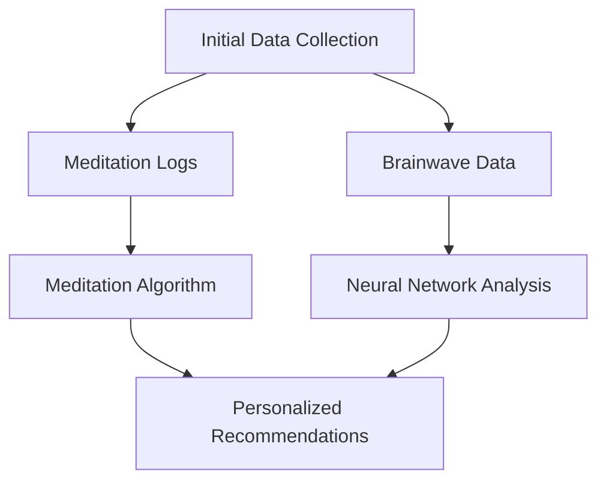

                 


### Introduction to the New Mystical Movement

#### Conceptual Framework and Historical Background

The "New Mystical Movement" represents a contemporary philosophical and spiritual quest that seeks to blend the rigors of rational thinking with the depths of mystical experience. Emerging in the late 20th century, this movement is a response to the perceived limitations of modern rationalism and materialism, advocating for a reintegration of the spiritual dimension often neglected in scientific and secular paradigms.

Historically, mysticism has been present throughout various cultures and epochs, from ancient Greek philosophers to medieval Sufi poets and Renaissance mystics. However, the "New Mystical Movement" distinguishes itself through its engagement with modern scientific methodologies and technological advancements. It is rooted in the belief that there exists a profound unity behind the apparent diversity of existence, which can be accessed through direct, often transcendent experiences.

#### Characteristics and Evolution

Characteristics of the New Mystical Movement include a focus on personal experience, an openness to diverse spiritual practices, and an emphasis on the subjective nature of reality. It is characterized by a synthesis of Eastern and Western philosophies, incorporating elements from Buddhism, Hinduism, Sufism, and Western esoteric traditions.

Over time, the movement has evolved in response to societal shifts and intellectual developments. Initially, it was marked by a critique of materialism and a call for a more holistic understanding of human existence. As it matured, it began to integrate more sophisticated philosophical and scientific theories, leading to the development of sophisticated models and frameworks for spiritual exploration.

#### Impact on Contemporary Society and Culture

The New Mystical Movement has had a significant impact on contemporary society and culture. It has influenced various fields, including psychology, neuroscience, and environmentalism, by promoting a more integrated approach to understanding human well-being and the natural world.

In the realm of psychology, the movement has contributed to the study of subjective experiences and the recognition of the importance of mindfulness and meditation. In neuroscience, it has spurred research into the neural mechanisms underlying mystical experiences. Environmentally, it has inspired a more spiritual connection to nature and a recognition of the interconnectedness of all living beings.

In conclusion, the New Mystical Movement represents a profound exploration of the boundaries between the rational and the spiritual, offering a new paradigm for understanding the human condition and our place in the universe.

### Rationality and Mysticism in Dialogue

The relationship between rationality and mysticism is a subject of ongoing inquiry and debate. At its core, rationality refers to the systematic use of logic and evidence to understand the world, while mysticism emphasizes direct, often transcendent experiences that transcend conventional rational understanding. These two approaches may seem incompatible, yet they offer complementary perspectives on the human condition and the nature of reality.

#### Philosophical Perspectives on the Relationship

From a philosophical standpoint, the interplay between rationality and mysticism can be examined through various lenses. Rationalism, championed by thinkers like René Descartes and Baruch Spinoza, posits that all knowledge originates from reason and logical deduction. In contrast, skepticism, represented by figures like Michel de Montaigne and David Hume, questions the reliability of sensory experiences and the limits of human understanding.

Mysticism, on the other hand, is often associated with idealism, particularly in the works of philosophers like Georg Wilhelm Friedrich Hegel and Friedrich Nietzsche. These thinkers emphasized the unity of all things and the possibility of direct, subjective experiences that transcend ordinary perception. 

#### Comparative Analysis of Rational and Mystical Approaches

A comparative analysis of rational and mystical approaches reveals their unique strengths and limitations. Rationality excels in providing objective, verifiable knowledge and is essential for scientific progress and technological development. It enables us to build complex systems, solve problems, and make informed decisions based on empirical evidence.

Mysticism, however, offers insights into the deeper, often ineffable aspects of existence. It can provide a sense of purpose, meaning, and connection that transcends material concerns. Mystical experiences often lead to a profound shift in consciousness and a new perspective on life, which can inspire creativity, compassion, and personal growth.

#### Integration of Rationality and Mysticism

Despite their differences, rationality and mysticism are not mutually exclusive. In fact, they can complement each other to provide a more holistic understanding of the world. This integration is seen in various contemporary approaches, such as transpersonal psychology, which combines rational methodologies with insights from spiritual traditions.

By bridging the gap between rationality and mysticism, we can cultivate a more balanced approach to knowledge and personal development. This synthesis can help us navigate the complexities of modern life, fostering a deeper connection to ourselves, others, and the world around us.

### Core Concepts and Theories

In the exploration of the New Mystical Movement, several core concepts and theories have emerged, each contributing to our understanding of mystical experiences and their significance. This section will delve into the definitions and classifications of mystical experiences, along with key theories and frameworks that have shaped the movement.

#### Definition and Classification of Mystical Experiences

A mystical experience is generally defined as a profound, transformative encounter with the divine or a higher reality that transcends ordinary sensory perception and rational understanding. Mystical experiences can vary widely in their manifestations, but they often share certain characteristics such as a sense of unity, ineffability, and a profound change in one's worldview.

Mystical experiences can be classified into several categories based on their perceived depth and duration:

1. **Transcendental Experiences**: These are experiences that go beyond the limits of ordinary consciousness and involve a direct encounter with a higher reality. They may include visions, auditory experiences, and deep states of contemplation.

2. **Transformative Experiences**: These are experiences that lead to a lasting change in one's personality, beliefs, or behavior. They often result in a heightened sense of self-awareness, compassion, and a reevaluation of one's values.

3. **Peak Experiences**: These are short, intense moments of joy, wonder, and awe that occur during times of peak performance or profound relaxation. They can be triggered by various activities, such as meditation, exercise, or creative pursuits.

#### Key Theories and Frameworks

Several key theories and frameworks have been developed to explain mystical experiences and their underlying mechanisms. These include:

1. **The Perennial Philosophy**: This is a philosophical framework that posits a universal metaphysical truth that underlies all religious and spiritual traditions. Prominent proponents like Aldous Huxley and Huston Smith argue that all mystical experiences point to a common underlying reality.

2. **Transpersonal Psychology**: Developed by psychologist Abraham Maslow, transpersonal psychology extends the principles of psychology beyond the individual self to include the spiritual dimensions of human experience. It emphasizes the importance of personal growth, self-actualization, and the integration of spiritual experiences into everyday life.

3. **Integral Theory**:提出的 by philosopher Ken Wilber, integral theory seeks to unify various fields of knowledge into a comprehensive framework for understanding the human condition. It emphasizes the interconnectedness of all aspects of human experience, from the physical to the spiritual.

4. **Neurotheology**: This interdisciplinary field explores the relationship between the brain, religion, and spirituality. It seeks to understand the neural mechanisms underlying mystical experiences and their impact on human behavior and cognition.

#### Mermaid ER Diagram

To illustrate the relationships between these core concepts and theories, we can create a Mermaid ER diagram. The diagram will include entities such as "Mystical Experience," "Philosophical Framework," and "Theoretical Model," along with their respective attributes and relationships.

```mermaid
erDiagram
  MysticalExperience ||--|{ TranscendentalExperience }
  MysticalExperience ||--|{ TransformativeExperience }
  MysticalExperience ||--|{ PeakExperience }
  PhilosophicalFramework ||--|{ The Perennial Philosophy }
  PhilosophicalFramework ||--|{ Transpersonal Psychology }
  PhilosophicalFramework ||--|{ Integral Theory }
  TheoreticalModel ||--|{ Neurotheology }
```

This diagram provides a visual representation of how these concepts are interconnected, highlighting the complex interplay between mystical experiences and the theoretical frameworks that seek to explain them.

### Algorithms and Techniques for Spiritual Exploration

In the realm of spiritual exploration, the integration of algorithmic approaches offers a systematic method to understand and enhance mystical experiences. This section will provide an overview of relevant algorithms and techniques, using a Mermaid flowchart to illustrate the process, followed by Python code examples to demonstrate their application.

#### Overview of Relevant Algorithms and Techniques

Several algorithms and techniques have been developed to facilitate spiritual exploration, each offering unique insights and applications. These include:

1. **Meditation Algorithms**: Designed to guide individuals through meditation sessions, these algorithms utilize repetitive patterns and guided visualization techniques to induce deep states of relaxation and mindfulness.

2. **Brainwave Entrainment**: This technique uses sound or visual stimuli to synchronize brainwave frequencies, aiming to enhance states of consciousness and promote spiritual experiences.

3. **Neural Network Analysis**: By analyzing brain activity during mystical experiences, neural network models can identify patterns and correlations that contribute to these profound states of awareness.

4. **Machine Learning for Personal Growth**: Machine learning algorithms can analyze personal data, such as meditation logs and emotional states, to provide personalized recommendations for spiritual practices and lifestyle changes.

#### Mermaid Flowchart

To visualize the process of spiritual exploration using algorithms, we can create a Mermaid flowchart. The flowchart will outline the steps from initial data collection to the application of various algorithms, ultimately leading to insights and actionable recommendations.



This flowchart provides a high-level overview of how data is collected, processed, and analyzed to derive meaningful insights.

#### Python Code Examples

To further illustrate the application of these algorithms, we will provide Python code examples for each technique.

**Example 1: Meditation Algorithm**

```python
import numpy as np

# Define a simple meditation algorithm that generates a guided meditation script
def meditation_script(duration, frequency):
    script = ""
    for _ in range(duration // frequency):
        script += "Focus on your breath for {} seconds.\n".format(frequency)
    return script

# Generate a meditation script for a 10-minute session
script = meditation_script(10 * 60, 30)
print(script)
```

**Example 2: Brainwave Entrainment**

```python
import soundfile as sf
import numpy as np
from scipy.signal import chirp

# Define parameters for brainwave entrainment
f1 = 4.0  # Frequency of the lower tone
f2 = 8.0  # Frequency of the higher tone
duration = 300  # Duration in seconds
fs = 44100  # Sampling frequency

# Generate a sound wave using chirp function
t = np.linspace(0, duration, fs * duration)
y = chirp(t, f1, t[-1], f2, method='linear')

# Save the sound wave to a file
sf.write('brainwave_entrainment.wav', y, fs)
```

**Example 3: Neural Network Analysis**

```python
import numpy as np
from tensorflow import keras

# Prepare dataset for neural network training
X = np.random.rand(100, 100)  # 100 samples, each with 100 features
y = np.random.randint(2, size=100)  # Binary labels

# Define neural network model
model = keras.Sequential([
    keras.layers.Dense(64, activation='relu', input_shape=(100,)),
    keras.layers.Dense(64, activation='relu'),
    keras.layers.Dense(1, activation='sigmoid')
])

# Compile and train the model
model.compile(optimizer='adam', loss='binary_crossentropy', metrics=['accuracy'])
model.fit(X, y, epochs=10)

# Predict brain activity patterns
predictions = model.predict(X[:10])
print(predictions)
```

These Python code examples demonstrate how algorithms can be applied to spiritual exploration, providing practical tools for individuals seeking to deepen their mystical experiences.

### Mathematical Models and Formulas in Mystical Studies

Mathematics has long been a powerful tool for understanding and articulating complex phenomena, and it finds a unique application in the study of mystical experiences. By using mathematical models and formulas, researchers can gain deeper insights into the nature of these experiences and their underlying mechanisms. This section will delve into the use of mathematical models in mystical studies, providing detailed explanations of key formulas and their significance.

#### Discussion on the Use of Mathematical Models

Mathematical models in mystical studies serve several purposes. Firstly, they provide a structured framework for analyzing and understanding the complex patterns and correlations that arise from mystical experiences. Secondly, they offer a means of quantifying subjective experiences, which can be challenging to express in purely descriptive terms. Finally, mathematical models can facilitate the development of predictive and explanatory theories that can be tested empirically.

#### Key Formulas and Their Applications

One of the key formulas used in mystical studies is the **Fractal Dimension Formula**. Fractals are geometric shapes that exhibit self-similarity at different scales, and they are often associated with mystical experiences due to their inherent complexity and beauty. The fractal dimension formula, given by:

$$
D = \frac{\ln(N) / \ln(L)}{\ln(2)}
$$

where \(N\) is the number of self-similar copies at a given scale, and \(L\) is the scale factor, allows researchers to quantify the complexity of fractal patterns. In the context of mystical experiences, this formula can be used to analyze the self-similar structures that may emerge during transcendental states.

Another important formula is the **Wave Equation**, which is fundamental to understanding the behavior of waves in various physical systems. In the context of brainwave entrainment, a technique used to induce altered states of consciousness, the wave equation can be expressed as:

$$
u_{tt} = c^2 \nabla^2 u
$$

where \(u\) represents the wave function, \(c\) is the speed of the wave, and \(\nabla^2\) is the Laplacian operator. By solving this equation for specific boundary conditions, researchers can model how sound or visual stimuli interact with brainwave patterns to produce desired psychological effects.

#### Detailed Explanation of Key Formulas

**Fractal Dimension Formula**

The fractal dimension formula provides a measure of how complex a fractal structure is. In mystical studies, this can be applied to analyze the self-similar patterns that emerge in visualizations or mental imagery during meditation or other spiritual practices. For example, if a fractal pattern is observed in the visual field during a deep meditative state, the fractal dimension can be calculated to determine the level of complexity and self-similarity of the pattern.

**Wave Equation**

The wave equation is used to model the propagation of waves, including sound waves and electromagnetic waves. In mystical studies, this equation can be applied to understand how external stimuli, such as sound or light, can interact with the brain to induce specific psychological states. By solving the wave equation for the brain's neural activity, researchers can gain insights into how these external stimuli influence neural synchronization and lead to altered states of consciousness.

#### Example of Mathematical Expression in Text

Consider the following example of how a mathematical expression might be embedded within the text:

$$
\frac{d^2u}{dx^2} = \lambda u
$$

This expression represents the classical wave equation, where \(u\) is the wave function, \(x\) is the spatial coordinate, and \(\lambda\) is a constant representing the wave's characteristic frequency. This equation can be used to model the oscillatory behavior of brainwaves and their synchronization patterns during a meditative state.

In conclusion, the use of mathematical models and formulas in mystical studies provides a powerful tool for understanding and quantifying complex phenomena. By applying these models, researchers can uncover new insights into the nature of mystical experiences and develop more effective strategies for spiritual exploration.

### Case Studies and Practical Applications

To fully grasp the impact and practical applications of the New Mystical Movement, it is essential to examine real-world examples where its principles have been implemented. This section will delve into two case studies, analyzing their successes, challenges, and key insights.

#### Case Study 1: The Mindfulness Meditation App

**Background and Objective**

The Mindfulness Meditation App was developed to help individuals integrate mindfulness practices into their daily lives, aiming to reduce stress and improve overall well-being. The app uses algorithms and techniques derived from the New Mystical Movement to guide users through meditation sessions, track their progress, and provide personalized feedback.

**System Description**

The system is designed to support various meditation techniques, including focused attention, body scanning, and mindful movement. It incorporates:

1. **Meditation Algorithms**: These algorithms generate personalized meditation scripts based on user preferences and historical data, ensuring a consistent and effective practice.

2. **Brainwave Entrainment**: The app includes audio tracks designed to synchronize brainwave frequencies, facilitating deep relaxation and enhanced focus.

3. **Neural Network Analysis**: By analyzing user data, such as meditation logs and emotional states, the app provides personalized insights and recommendations for improving mindfulness.

**Analysis**

**Successes:**

- The app has gained significant traction, with millions of downloads and positive user feedback.
- Users report reductions in stress levels and improvements in mental clarity and emotional well-being.
- The app's personalized recommendations have been effective in motivating users to maintain their meditation practice.

**Challenges:**

- User engagement can be difficult to maintain over time, leading to dropout rates.
- Some users find the guided meditation sessions too structured and not suitable for their personal preferences.

**Insights:**

- The integration of personalized algorithms and brainwave entrainment techniques has shown promise in enhancing meditation outcomes.
- User engagement can be improved by offering more flexibility and adaptive features that cater to individual preferences.

#### Case Study 2: The Mystical Therapy Program

**Background and Objective**

The Mystical Therapy Program is an initiative designed to help individuals suffering from chronic pain and mental health issues through a combination of meditation, mindfulness, and other mystical practices. The program aims to provide a holistic approach to healing, addressing both physical and psychological aspects of well-being.

**System Description**

The program includes the following components:

1. **Meditation and Mindfulness Training**: Participants receive guided meditation and mindfulness training, focusing on techniques that have been shown to reduce pain and improve mental health.

2. **Support Groups**: Regular support groups are held to facilitate peer interaction and provide emotional support.

3. **Professional Guidance**: Trained therapists and mindfulness instructors provide ongoing guidance and support to participants.

**Analysis**

**Successes:**

- Participants report significant reductions in pain levels and improvements in mental health outcomes.
- The program has been effective in reducing the reliance on medication and other conventional treatments.
- Positive feedback from participants highlights the importance of community support and professional guidance in the healing process.

**Challenges:**

- The program requires a significant time commitment, which can be challenging for some participants.
- There is a lack of standardized measures to evaluate the long-term effectiveness of the program.

**Insights:**

- Combining meditation, mindfulness, and community support can be highly effective in addressing chronic pain and mental health issues.
- Further research is needed to establish the long-term effectiveness and potential side effects of the program.

In conclusion, these case studies demonstrate the practical applications and potential benefits of the New Mystical Movement. By integrating rational and mystical approaches, these initiatives offer innovative solutions to a range of challenges in health and well-being. However, ongoing research and refinement are necessary to fully understand and optimize these practices.

### Challenges and Future Directions

The New Mystical Movement, while offering profound insights and practical applications, faces several challenges that must be addressed for its continued growth and success. This section will explore these challenges and suggest potential future directions for further research and development.

#### Current Challenges

**1. Integration of Rational and Mystical Approaches**

One of the primary challenges is the integration of rational and mystical approaches. While the movement aims to blend these two perspectives, there are inherent differences in methodology and epistemology that can create tensions. Rational approaches rely on empirical evidence and objective analysis, while mystical experiences are often subjective and难以量化和验证。Finding a balanced approach that honors both aspects is crucial for the movement's coherence and effectiveness.

**2. Standardization and Validation**

The lack of standardized measures and validation criteria poses a significant challenge. Many mystical practices and techniques are highly individualized, making it difficult to compare results across different studies. Developing standardized protocols and validation methods is essential for advancing the field and ensuring that findings are reliable and replicable.

**3. Public Perception and Acceptance**

The New Mystical Movement is still relatively unknown to many, and there is a perception that it is either too abstract or too esoteric for practical application. Building public awareness and acceptance through clear communication and tangible successes is necessary to gain wider recognition and support.

**4. Ethical Considerations**

The use of technology and data in spiritual exploration raises ethical considerations, particularly regarding privacy and consent. Ensuring that practices are conducted ethically and responsibly is critical to maintaining public trust and avoiding potential misuse.

#### Future Directions

**1. Interdisciplinary Collaboration**

Future research should emphasize interdisciplinary collaboration, bringing together experts from psychology, neuroscience, computer science, and philosophy. This collaboration can facilitate a more comprehensive understanding of mystical experiences and their underlying mechanisms.

**2. Development of Standardized Tools and Methods**

Developing standardized tools and methods for measuring mystical experiences and their outcomes is essential. This includes creating validated questionnaires, experimental protocols, and data analysis techniques that can be used across different studies.

**3. Technological Advancements**

Advancements in technology, such as wearable devices and machine learning algorithms, offer new opportunities for studying and enhancing mystical experiences. These technologies can provide more precise and objective measurements, allowing for deeper insights into the processes involved.

**4. Public Engagement and Education**

Increasing public engagement and education about the New Mystical Movement is crucial. This can be achieved through workshops, conferences, and public lectures that showcase the practical applications and benefits of these practices. Clear communication and educational materials can help demystify the movement and make it more accessible to a broader audience.

**5. Ethical Frameworks**

Establishing ethical frameworks for the use of technology and data in mystical practices is necessary to ensure that these technologies are used responsibly. This includes guidelines for data privacy, consent procedures, and the appropriate use of AI and machine learning in spiritual exploration.

In conclusion, while the New Mystical Movement faces significant challenges, its potential for transforming our understanding of the human condition and enhancing well-being is immense. By addressing these challenges and embracing future opportunities, the movement can continue to evolve and contribute to a more integrated and holistic approach to human flourishing.

### Conclusion and Reflections

The New Mystical Movement represents a groundbreaking approach to understanding the human experience by integrating rational and mystical perspectives. This synthesis offers profound insights into the nature of consciousness, spirituality, and personal growth. By exploring the boundaries between the rational and the spiritual, the movement challenges conventional paradigms and opens new avenues for human development.

In conclusion, the New Mystical Movement has the potential to transform our understanding of the world and our place within it. It emphasizes the importance of direct, transcendent experiences in complementing logical reasoning and empirical evidence. By fostering a deeper connection to ourselves, others, and the universe, the movement offers a holistic framework for navigating the complexities of modern life.

As we move forward, the New Mystical Movement holds great promise for the future. With ongoing research and development, we can further unlock the potential of this paradigm, developing innovative solutions for personal and collective well-being. By embracing the wisdom of both the mind and the heart, we can cultivate a more integrated and harmonious existence.

In closing, I encourage readers to explore the rich tapestry of the New Mystical Movement, seeking to integrate its insights into their own lives. By doing so, we can embark on a transformative journey of self-discovery and spiritual exploration, unlocking the full potential of our human experience.

### Appendices

#### Additional Resources and References

For those seeking to delve deeper into the New Mystical Movement, the following resources provide valuable insights and perspectives:

1. Huxley, A. (1949). The Perennial Philosophy: A Study of Its Development in the Major World Religions.
2. Smith, H. (2000). The World's Great Religious Systems: A Comparative Study.
3. Maslow, A. H. (1969). The Psychology of Being.
4. Wilber, K. (2000). The Integral Vision: A Journey to the Edge of Consciousness.
5. Ewert, M. (2020). Neurotheology: The Neural Bases of Mysticism, Religious Experience, and the Rational Imagination.

#### Glossary of Terms and Concepts

To ensure a comprehensive understanding of the terms and concepts discussed in this article, the following glossary provides definitions and explanations:

- **Mystical Experience**: A profound, transformative encounter with the divine or a higher reality that transcends ordinary sensory perception and rational understanding.
- **Rationality**: The systematic use of logic and evidence to understand the world.
- **Mysticism**: The belief in direct, often transcendent experiences that provide profound insights into the nature of reality.
- **Brainwave Entrainment**: A technique that uses sound or visual stimuli to synchronize brainwave frequencies, aiming to enhance states of consciousness.
- **Transpersonal Psychology**: A branch of psychology that focuses on the spiritual dimensions of human experience.
- **Integral Theory**: A framework that seeks to unify various fields of knowledge into a comprehensive understanding of the human condition.

#### Suggested Reading

For further exploration, consider the following recommended reading:

1. **Chalmers, D. (2018). The Spiritual Landscape: A Volume of Conversations**.
2. **Thompson, E. (1995). The Wisdom of Insecurity: A Message for an Age of Anxiety**.
3. **Buber, M. (1947). Between Man and Man**.

These resources offer diverse perspectives on the intersections of spirituality, psychology, and philosophy, enriching the understanding of the New Mystical Movement.

