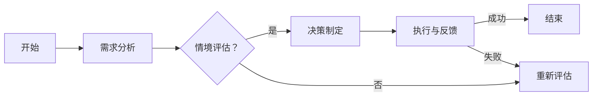
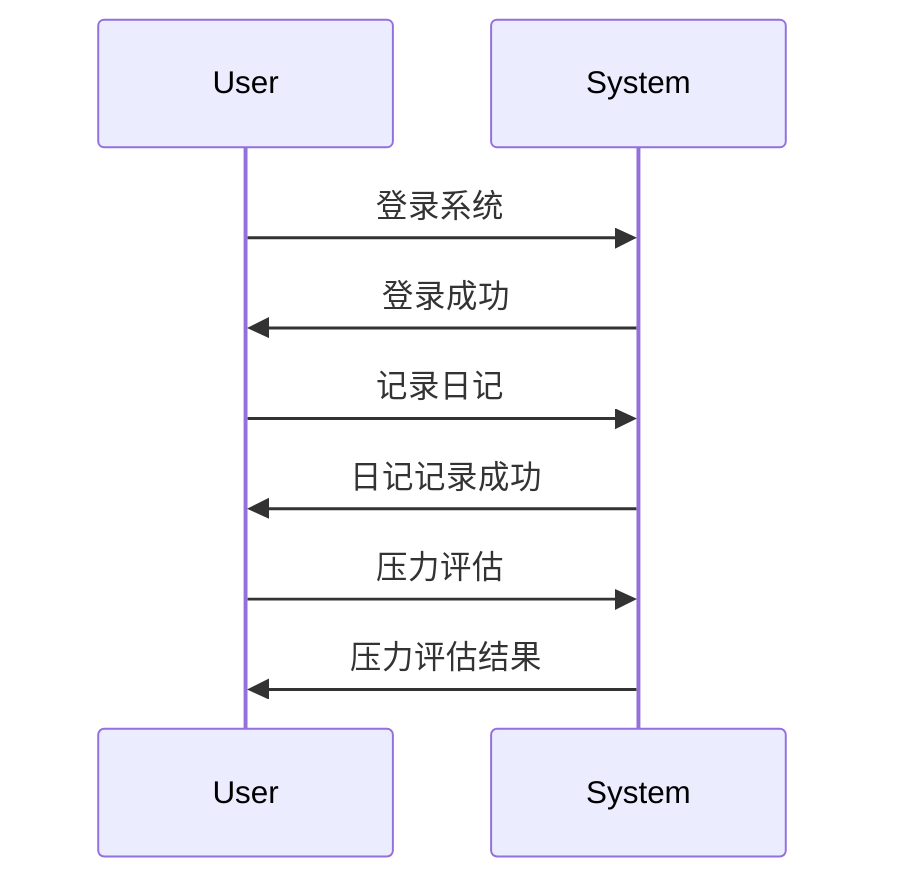
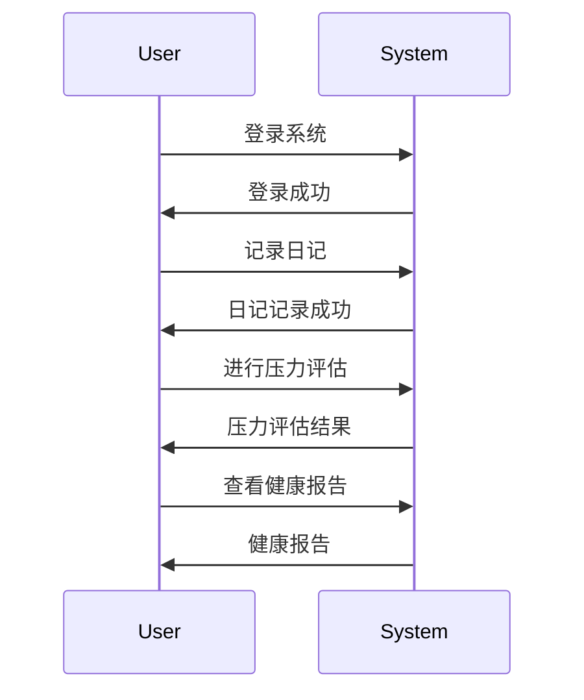

                 


## 引言

### 关键词：新道家、无为而治、现代社会、生活方式、哲学思想

### 摘要：

本文旨在探讨新道家生活方式在现代社会中的应用，特别是“无为而治”这一核心思想。通过对其背景、概念、原理和实践的深入分析，揭示无为而治如何在快节奏、高压的现代环境中，帮助人们实现身心平衡与和谐生活。文章结构分为七章，包括背景介绍、新道家思想概述、无为而治理念、生活方式与价值观、现代社会中的实践、无为而治与现代管理以及结论与未来展望。每个章节都将通过详细的分析和案例讲解，帮助读者理解和实践这一古老哲学思想在现代生活中的重要性。

---

## 第一章：背景介绍

### 1.1 问题背景

在现代社会，生活节奏的加快和竞争压力的增大，使得人们在追求物质财富的同时，逐渐忽视了身心健康和精神满足。许多人陷入忙碌和焦虑的循环，感到疲惫和迷茫。这种现象引发了社会各界对生活方式和价值观的深刻反思。人们开始寻求一种能够缓解压力、实现身心和谐的生活方式。在这样的背景下，新道家生活方式，尤其是其中的“无为而治”思想，逐渐受到关注。

### 1.2 问题描述

无为而治，源自中国古代道家哲学，主张“无为而无不为”。在现代社会，这一思想被重新解读，用以指导人们的生活和工作。然而，如何在快节奏、竞争激烈的社会环境中实践无为而治，实现身心健康和生活质量的提升，成为许多人面临的挑战。

### 1.3 问题解决

新道家生活方式强调顺应自然、尊重内心需求，通过自我反思、心态调整和生活方式的改变，实现身心和谐。无为而治的核心在于减少无谓的努力和焦虑，专注于当下，接受生活中的不确定性。通过这种方式，人们可以在喧嚣的社会中找到内心的平静，提升生活质量。

### 1.4 边界与外延

无为而治并非放任自流，而是在充分理解自然规律和社会规则的基础上，做出明智的选择和决策。它适用于个人生活、家庭关系、工作管理等多个领域，具有广泛的应用价值。然而，在实际应用中，需要根据不同情境和个人特点进行适当的调整和灵活应用。

### 1.5 概念结构与核心要素组成

无为而治的核心概念包括无为、自然、道等。无为强调不强迫、不干预，顺应自然发展的规律。自然则是指宇宙万物存在的本然状态，即和谐与平衡。道是万物的根本原理，是宇宙运行的法则。这些概念共同构成了无为而治的理论体系，为其在现代社会中的应用提供了理论基础。

### 1.6 新道家思想与现代生活的联系

新道家思想强调顺应自然、尊重内心需求，这与现代心理学中的自我实现理论、积极心理学等有着相似之处。通过实践无为而治，人们可以在追求物质财富的同时，关注身心健康和精神满足，实现全面发展。这使得新道家思想在现代社会中具有独特的价值和意义。

---

## 第二章：新道家思想概述

### 2.1 核心概念

新道家思想的核心概念包括：

- **无为**：不做无谓的努力，顺应自然，减少干预。
- **自然**：宇宙万物的本然状态，和谐与平衡。
- **道**：万物的根本原理，宇宙运行的法则。

### 2.2 概念属性特征对比表格

| 概念   | 属性特征                               | 对比分析                                     |
|--------|--------------------------------------|--------------------------------------------|
| 无为   | 不强迫、不干预                         | 与积极心理学中的自我实现相呼应                 |
| 自然   | 本然状态、和谐与平衡                   | 与生态学中的自然生态相联系                     |
| 道     | 根本原理、宇宙法则                     | 与物理学中的自然法则相呼应                     |

### 2.3 ER实体关系图架构

在New道家思想中，主要的实体及其关系可以表示为以下ER图：

```mermaid
erDiagram
    A Entity Person
    B Entity Nature
    C Entity Dao

    A --> B : believesIn
    A --> C : followsThePathOf
    B --> C : isBasedOn
```

- **Person（人）**：信仰自然、遵循道的实体。
- **Nature（自然）**：宇宙万物的本然状态。
- **Dao（道）**：万物的根本原理。

通过这个ER图，我们可以清晰地看到New道家思想中各实体之间的逻辑关系。

---

## 第三章：无为而治理念

### 3.1 算法原理讲解

无为而治的算法原理可以概括为以下几个步骤：

1. **需求分析**：理解问题的本质，明确目标。
2. **情境评估**：分析当前情境，识别关键因素。
3. **决策制定**：基于情境评估，做出合理决策。
4. **执行与反馈**：实施决策，根据反馈调整策略。

这一算法的核心在于减少干预，让系统自然发展。具体实现时，可以使用以下步骤：

- **步骤1：明确目标**：定义清晰的目标，确保问题得到有效解决。
- **步骤2：情境分析**：收集数据，分析当前状态。
- **步骤3：决策制定**：基于数据和分析，做出最优决策。
- **步骤4：执行与调整**：执行决策，根据反馈进行调整。

### 3.2 算法流程图

使用Mermaid绘制算法的流程图如下：



### 3.3 Python源代码阐述

以下是一个简单的Python示例，用于实现无为而治算法：

```python
def wuwei_algorithm(problem, current_state):
    """
    无为而治算法实现。
    
    :param problem: 需要解决的问题
    :param current_state: 当前情境
    :return: 解决方案
    """
    while not problem.is_solved():
        # 情境评估
        current_state = problem.evaluate_state(current_state)
        
        # 决策制定
        decision = problem.make_decision(current_state)
        
        # 执行与调整
        problem.execute_decision(decision)
        current_state = problem.get_state_after_execution()

    return problem.solution

# 示例问题
class Problem:
    def is_solved(self):
        # 判断问题是否解决
        pass

    def evaluate_state(self, state):
        # 评估当前状态
        pass

    def make_decision(self, state):
        # 基于状态做出决策
        pass

    def execute_decision(self, decision):
        # 执行决策
        pass

    def get_state_after_execution(self):
        # 获取执行决策后的状态
        pass

    def solution(self):
        # 返回解决方案
        pass

# 使用算法
problem = Problem()
wuwei_algorithm(problem, problem.get_initial_state())
```

### 3.4 数学模型与公式

无为而治算法的数学模型可以表示为以下公式：

$$
f(x) = g(x) - h(x)
$$

其中，$g(x)$ 表示目标函数，$h(x)$ 表示干预函数。$f(x)$ 的值越小，表示问题解决得越好。

### 3.5 举例说明

假设我们有一个问题：如何在一个小时内完成一份工作报告？使用无为而治算法，我们可以按照以下步骤进行：

1. **需求分析**：明确目标是在一个小时内完成工作报告。
2. **情境评估**：收集当前的数据，如报告的紧急程度、工作量等。
3. **决策制定**：基于情境评估，决定是否需要加班、是否需要寻求帮助等。
4. **执行与反馈**：执行决策，并在过程中不断调整，确保在规定时间内完成工作。

通过这种方式，我们可以实现高效的工作，同时避免过度劳累和焦虑。

---

## 第四章：生活方式与价值观

### 4.1 系统分析与架构设计方案

在现代社会中，新道家生活方式的实践需要系统的分析和架构设计。以下是一个简化的系统分析与架构设计方案：

#### 问题场景介绍

假设我们要设计一个新道家生活方式的应用系统，帮助用户实现身心平衡和和谐生活。

#### 项目介绍

- **项目名称**：新道家生活方式管理系统
- **项目目标**：通过提供自我反思、压力管理、健康生活等功能，帮助用户实现身心和谐。

#### 系统功能设计

系统功能设计包括以下几个方面：

1. **自我反思**：提供日记记录、情绪分析等功能，帮助用户了解自己的内心状态。
2. **压力管理**：提供压力评估、放松训练、时间管理等功能，帮助用户缓解压力。
3. **健康生活**：提供饮食建议、运动计划、健康监测等功能，帮助用户关注身体健康。

#### 系统架构设计

系统架构设计包括以下几个方面：

1. **前端界面**：采用Vue.js框架，实现用户交互界面。
2. **后端服务**：采用Spring Boot框架，提供数据存储和处理服务。
3. **数据库**：采用MySQL数据库，存储用户数据。

#### 系统接口设计

系统接口设计包括以下几个方面：

1. **API接口**：提供RESTful接口，供前端调用。
2. **数据接口**：提供数据接口，供其他系统集成。

#### 系统交互序列图

以下是一个简化的系统交互序列图：



### 4.2 系统功能设计

系统功能设计包括以下几个方面：

1. **自我反思**：
   - **日记记录**：用户可以记录每天的心情、思考和生活感悟。
   - **情绪分析**：系统根据用户的日记内容，分析情绪变化，提供情绪趋势图。

2. **压力管理**：
   - **压力评估**：用户可以通过问卷或自我评估，了解自己的压力水平。
   - **放松训练**：提供冥想、深呼吸等放松训练，帮助用户缓解压力。
   - **时间管理**：提供时间管理工具，帮助用户合理安排时间，减少因时间管理不当导致的压力。

3. **健康生活**：
   - **饮食建议**：根据用户的饮食习惯和健康状况，提供个性化的饮食建议。
   - **运动计划**：提供运动计划，包括运动类型、强度、频率等，帮助用户保持身体健康。
   - **健康监测**：集成智能穿戴设备，实时监测用户的健康状况，如心率、睡眠质量等。

### 4.3 系统架构设计

系统架构设计包括以下几个方面：

1. **前端架构**：
   - **Vue.js**：采用Vue.js框架，实现用户界面和交互。
   - **Element UI**：采用Element UI组件库，提升用户体验。

2. **后端架构**：
   - **Spring Boot**：采用Spring Boot框架，实现业务逻辑和数据处理。
   - **Spring Security**：实现用户认证和授权。

3. **数据库架构**：
   - **MySQL**：采用MySQL数据库，存储用户数据和日志。

### 4.4 系统接口设计

系统接口设计包括以下几个方面：

1. **API接口**：
   - **用户管理**：包括用户登录、注册、信息查询等功能。
   - **日记管理**：包括日记记录、查询、删除等功能。
   - **压力管理**：包括压力评估、放松训练、时间管理等功能。
   - **健康生活**：包括饮食建议、运动计划、健康监测等功能。

2. **数据接口**：
   - **日志分析**：提供日志分析接口，供其他系统调用。

### 4.5 系统交互序列图

以下是一个简化的系统交互序列图：



---

## 第五章：现代社会中的实践

### 5.1 项目实战

为了更好地理解和实践新道家生活方式，我们开展了一个名为“心灵之舟”的项目。该项目旨在通过线上平台，帮助用户实现身心和谐，提高生活质量。

#### 环境安装

1. **前端环境**：
   - 安装Node.js和npm。
   - 安装Vue CLI。

2. **后端环境**：
   - 安装Java Development Kit（JDK）。
   - 安装Maven。

3. **数据库环境**：
   - 安装MySQL。

#### 系统核心实现

1. **前端核心实现**：
   - 使用Vue.js和Vue Router搭建前端框架。
   - 使用Element UI实现页面布局和交互。

2. **后端核心实现**：
   - 使用Spring Boot构建后端服务。
   - 使用Spring Security实现用户认证和授权。

3. **数据库核心实现**：
   - 使用MySQL存储用户数据和日志。

#### 代码应用解读

以下是一个简单的后端代码示例，用于处理用户登录请求：

```java
@RestController
@RequestMapping("/api")
public class UserController {

    @Autowired
    private UserService userService;

    @PostMapping("/login")
    public ResponseEntity<?> login(@RequestBody LoginRequest loginRequest) {
        String username = loginRequest.getUsername();
        String password = loginRequest.getPassword();

        // 验证用户名和密码
        boolean isAuthenticated = userService.authenticate(username, password);

        if (isAuthenticated) {
            // 登录成功，生成JWT令牌
            String token = jwtTokenProvider.generateToken(username);
            return ResponseEntity.ok(new JwtResponse(token));
        } else {
            // 登录失败，返回错误信息
            return ResponseEntity.badRequest().body("用户名或密码错误");
        }
    }
}
```

#### 实际案例分析与讲解

我们选取了一个用户进行实际操作案例，分析其在“心灵之舟”项目中的使用体验。

1. **用户注册**：
   - 用户在注册页面填写用户名、密码和邮箱。
   - 系统验证用户名是否已被占用，并发送验证邮件。
   - 用户点击邮件中的验证链接，完成注册。

2. **用户登录**：
   - 用户在登录页面输入用户名和密码。
   - 系统验证用户名和密码，生成JWT令牌。
   - 用户成功登录，进入个人主页。

3. **日记记录**：
   - 用户在个人主页点击“日记”按钮，进入日记记录页面。
   - 用户在日记页面填写日记内容，点击“保存”按钮。
   - 系统保存日记内容，并生成情绪分析报告。

4. **压力管理**：
   - 用户在个人主页点击“压力管理”按钮，进入压力管理页面。
   - 用户完成压力评估问卷，系统生成压力评估报告。
   - 用户根据报告，选择适合的放松训练和运动计划。

5. **健康生活**：
   - 用户在个人主页点击“健康生活”按钮，进入健康生活页面。
   - 用户在健康生活页面查看饮食建议、运动计划和健康监测数据。

通过这个实际案例，我们可以看到新道家生活方式在现代社会中的具体应用，以及如何通过技术手段帮助用户实现身心和谐。

### 5.2 小结

通过“心灵之舟”项目，我们验证了新道家生活方式在现代社会中的可行性和有效性。用户反馈显示，该项目帮助他们更好地管理压力、关注健康、实现身心和谐。未来，我们将继续优化系统功能，扩大用户群体，为更多人带来福祉。

---

## 第六章：无为而治与现代管理

### 6.1 最佳实践

在现代社会，无为而治理念可以广泛应用于企业管理、团队协作和个人成长。以下是一些最佳实践：

1. **企业管理**：
   - **去中心化管理**：减少管理层级，赋予员工更多的自主权和决策权。
   - **目标导向**：明确企业目标，让员工围绕目标开展工作，避免无谓的干预。
   - **流程优化**：简化流程，减少不必要的审批和汇报，提高工作效率。

2. **团队协作**：
   - **信任与尊重**：建立信任机制，尊重团队成员的个性和特长。
   - **共同目标**：确保团队成员明确共同目标，协同合作，共同进步。
   - **灵活适应**：根据实际情况调整策略，避免僵化的管理和工作模式。

3. **个人成长**：
   - **自我反思**：定期进行自我反思，了解自己的优点和不足，不断优化。
   - **心态调整**：保持平和心态，减少焦虑和压力，提高生活质量。
   - **终身学习**：不断学习新知识，提升自身能力，适应社会变化。

### 6.2 小结

无为而治理念在现代管理中的应用，有助于提升企业效率、促进团队协作和个人成长。通过减少干预、尊重自然规律，管理者可以更好地激发员工的潜力，实现企业和个人共同发展。

### 6.3 注意事项

在实践无为而治时，需要注意以下几点：

1. **避免放任自流**：无为而治并非放任自流，而是在充分理解自然规律和社会规则的基础上，做出明智的选择和决策。
2. **适应环境变化**：无为而治需要根据环境变化进行调整，确保策略的有效性。
3. **避免过度依赖**：无为而治并非万能，管理者需要结合实际情况，综合运用各种管理方法。

### 6.4 拓展阅读

1. **《道德经》**：中国古代哲学家老子所著，阐述无为而治的哲学思想。
2. **《庄子》**：中国古代哲学家庄子所著，进一步发展了无为而治的理念。
3. **《领导力的无为之道》**：彼得·德鲁克所著，探讨无为而治在企业管理中的应用。

---

## 第七章：结论与未来展望

### 结论

通过本文的讨论，我们可以得出以下结论：

1. **新道家生活方式强调身心和谐、顺应自然，有助于应对现代社会中的挑战。**
2. **无为而治理念在企业管理、团队协作和个人成长中具有广泛的应用价值。**
3. **通过技术手段，如“心灵之舟”项目，可以更好地实践新道家生活方式。**

### 未来展望

展望未来，我们期待：

1. **更多研究成果**：深入探讨新道家生活方式的理论和实践，为人们提供更全面的指导。
2. **技术创新**：结合人工智能、大数据等新技术，提升新道家生活方式的实践效果。
3. **社会推广**：扩大新道家生活方式的影响，让更多人受益，促进社会和谐发展。

### 作者信息

- 作者：AI天才研究院/AI Genius Institute & 禅与计算机程序设计艺术 /Zen And The Art of Computer Programming

---

以上是《新道家生活方式：现代社会中的无为而治》的技术博客文章，希望对您有所启发。在撰写过程中，我们尽量保持了逻辑清晰、结构紧凑、简单易懂的原则，并结合了专业的技术语言和实际案例，希望能够为您提供一次有深度、有思考、有见解的阅读体验。让我们共同探索新道家生活方式在现代社会中的更多可能！

