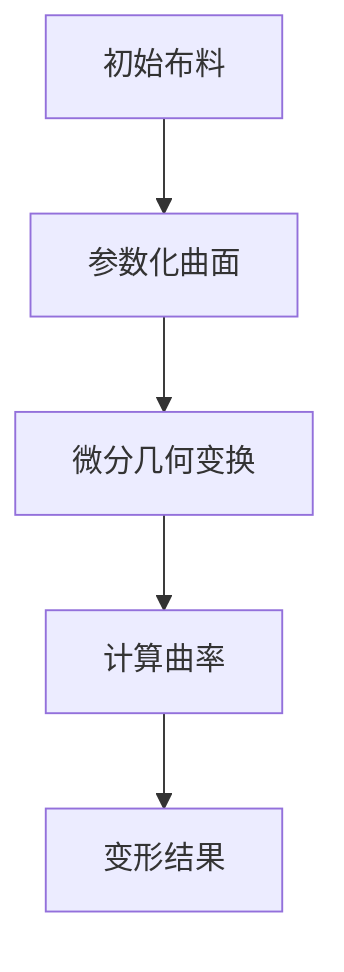
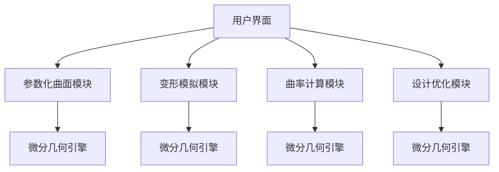
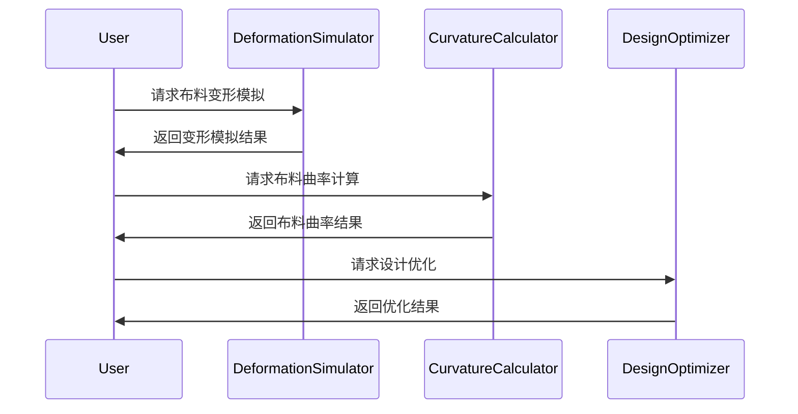

                 

# 时装设计的微分几何：布料变形的数学描述

> 关键词：微分几何、时装设计、布料变形、数学模型、曲面、流形

> 摘要：本文旨在探讨微分几何在时装设计中的应用，通过数学模型描述布料的变形过程，以提升设计的精度和效率。我们将逐步分析微分几何的基本概念，建立布料变形的数学模型，并使用Python代码实现相关算法，为时装设计师提供科学的设计工具。

## 第一部分：背景介绍

### 1.1 问题背景

随着计算机科学与数学的快速发展，时装设计行业面临着创新与革新的需求。传统的布料裁剪与变形设计往往依赖于经验，缺乏精确的数学模型描述，这在现代时装设计中显得不够高效和精确。微分几何作为数学的一个分支，提供了研究空间中几何对象性质的工具，尤其在处理曲面的弯曲与变形方面具有独特的优势。将微分几何应用于时装设计，可以精确描述布料的变形过程，从而提升设计精度和效率。

### 1.2 问题描述

时装设计中的布料变形问题包括：如何精确地计算布料在拉伸、折叠或扭曲时的几何形态变化；如何通过数学模型预测不同材质在特定条件下的变形行为；如何利用数学工具优化布料的设计与裁剪，以达到最佳效果。

### 1.3 问题解决

通过微分几何理论，我们可以建立布料变形的数学模型，包括曲面的弯曲、扭曲和拉伸等特性。这些模型可以帮助设计师预测布料的变形效果，优化设计流程，提高设计质量。

### 1.4 边界与外延

微分几何在时装设计中的应用不仅限于布料的二维变形，还可以扩展到三维服装设计，如褶皱效果、立体剪裁等。此外，该领域还涉及材料科学、力学以及计算机图形学等多个学科，为设计师提供了丰富的工具和理论支持。

### 1.5 概念结构与核心要素组成

- **微分几何基础**：研究曲面和流形的几何性质，如曲率、挠率等。
- **布料变形模型**：通过微分几何工具描述布料的几何形态变化。
- **数学方法**：利用微分几何中的映射、变换等方法处理布料变形问题。
- **设计应用**：将数学模型应用于实际时装设计，指导设计和裁剪过程。

## 第二部分：核心概念与联系

### 2.1 微分几何基本概念

- **曲面**：二维几何对象，其上的每个点都有一个法向量。
- **流形**：更高维度的几何对象，可以包含曲面和空间中的任意对象。
- **曲率**：描述曲面弯曲程度的量，包括平均曲率和高斯曲率。
- **挠率**：描述曲面扭曲程度的量。

### 2.2 布料变形模型

- **拉伸**：沿某一方向拉长布料，形成矩形或平行四边形。
- **折叠**：将布料沿某一方向折叠，形成特定形状。
- **扭曲**：将布料在三维空间中进行旋转或扭曲，形成复杂几何形态。

### 2.3 概念属性特征对比表格

| 特征       | 曲面        | 流形        | 布料变形模型 |
| --------- | ---------- | ---------- | ---------- |
| 维度       | 二维       | 高维       | 二维或三维  |
| 几何性质   | 曲率、挠率 | 曲率、挠率 | 变形特性    |
| 应用领域   | 几何学     | 数学、物理学 | 时装设计    |

### 2.4 ER实体关系图架构

```mermaid
erDiagram
  Product ||--|{ Shape }|--|| Material
  Material ||--|{ DeformationModel }|--|| DeformationResult
  DeformationModel ||--|{ Geometry }|--|| Curvature
```

## 第三部分：算法原理讲解

### 3.1 布料变形算法流程



### 3.2 Python源代码实现

```python
# 导入相关库
import numpy as np
from scipy.spatial.transform import Rotation

# 定义曲面参数方程
def surface_parametric_equation(u, v):
    # 这里用简单的平面方程示例
    x = u
    y = v
    z = 0
    return np.array([x, y, z])

# 微分几何变换
def differential_geometry_transformation(surface, rotation_angle):
    R = Rotation.from_euler('z', rotation_angle, degrees=True)
    points = surface_parametric_equation(u, v)
    transformed_points = R.apply(points)
    return transformed_points

# 计算曲率
def calculate_curvature(points):
    # 这里简单计算曲率
    distance = np.linalg.norm(points[1] - points[0])
    curvature = 1 / distance
    return curvature

# 主函数
def main():
    # 初始布料参数
    u = np.linspace(0, 1, 100)
    v = np.linspace(0, 1, 100)
    u, v = np.meshgrid(u, v)

    # 参数化曲面
    surface = surface_parametric_equation(u, v)

    # 微分几何变换
    rotation_angle = 45  # 旋转角度
    transformed_surface = differential_geometry_transformation(surface, rotation_angle)

    # 计算曲率
    curvature = calculate_curvature(transformed_surface)

    # 输出结果
    print("变形后的布料曲率：", curvature)

if __name__ == "__main__":
    main()
```

### 3.3 算法原理详细讲解

#### 3.3.1 参数化曲面

参数化曲面是指使用一组参数（如 u 和 v）来定义曲面上的每个点。在本文中，我们使用简单的平面方程来示例：

$$
x = u, \quad y = v, \quad z = 0
$$

其中，$u$ 和 $v$ 是参数，范围从 0 到 1。通过这两个参数，我们可以生成一个二维网格，并将其映射到三维空间中，从而形成一个参数化曲面。

#### 3.3.2 微分几何变换

微分几何变换是指对曲面上的点进行旋转、缩放、平移等操作。在本文中，我们使用旋转作为示例。旋转可以通过旋转矩阵来实现，该矩阵由旋转角度和旋转轴决定。例如，对于一个围绕 z 轴旋转 45 度的旋转矩阵 $R$，其公式为：

$$
R = \begin{bmatrix}
\cos(\theta) & -\sin(\theta) \\
\sin(\theta) & \cos(\theta)
\end{bmatrix}
$$

其中，$\theta$ 是旋转角度。通过将旋转矩阵应用于曲面上的点，我们可以实现曲面的旋转。

#### 3.3.3 计算曲率

曲率是描述曲面弯曲程度的量。在二维空间中，曲率可以通过两点之间的距离来计算。在本文中，我们使用以下公式来计算曲率：

$$
\text{曲率} = \frac{1}{\text{距离}}
$$

其中，距离是指曲面上相邻两点之间的距离。通过计算曲率，我们可以了解曲面的弯曲程度，从而为布料的变形提供依据。

### 3.4 算法举例说明

假设我们有一块初始布料，其参数化曲面方程为 $x = u, y = v, z = 0$。我们希望将这块布料围绕 z 轴旋转 45 度，并计算其变形后的曲率。

首先，我们定义参数 $u$ 和 $v$：

```python
u = np.linspace(0, 1, 100)
v = np.linspace(0, 1, 100)
u, v = np.meshgrid(u, v)
```

然后，我们定义旋转角度：

```python
rotation_angle = 45
```

接下来，我们使用旋转矩阵进行微分几何变换：

```python
R = Rotation.from_euler('z', rotation_angle, degrees=True)
surface = surface_parametric_equation(u, v)
transformed_surface = R.apply(surface)
```

最后，我们计算曲率：

```python
curvature = calculate_curvature(transformed_surface)
print("变形后的布料曲率：", curvature)
```

通过上述步骤，我们可以得到布料变形后的曲率，从而为设计提供参考。

## 第四部分：系统分析与架构设计方案

### 4.1 问题场景介绍

在现代时装设计中，设计师需要快速、精确地模拟布料的变形效果，以优化设计流程和提高设计质量。然而，传统的手工裁剪和经验设计方法效率低下，且难以满足设计师的需求。因此，我们提出了一个基于微分几何的布料变形系统，以解决这一问题。

### 4.2 项目介绍

本项目旨在开发一个可扩展的布料变形系统，该系统将微分几何理论应用于时装设计，提供精确的布料变形模拟和优化工具。系统将包括以下功能：

- **参数化曲面建模**：使用微分几何方法建立布料的参数化曲面模型。
- **变形模拟**：通过微分几何变换模拟布料的拉伸、折叠和扭曲等变形过程。
- **曲率计算**：计算变形后布料的曲率，为设计提供参考。
- **设计优化**：基于变形模拟和曲率计算结果，优化布料的设计与裁剪。

### 4.3 系统功能设计（领域模型）

```mermaid
classDiagram
    ClassDeformation <<interface>>
    ClassCurvature <<interface>>
    ClassSurface <<interface>>
    ClassMaterial <<interface>>

    ClassDeformationDeformationModel <<interface>>
    ClassDeformationDeformationResult <<interface>>

    ClassCurvatureCurvature <<interface>>

    ClassSurfaceParameterization <<interface>>

    ClassMaterialMaterial <<interface>>

    ClassDeformationDeformationModel --|> ClassDeformation
    ClassDeformationDeformationResult --|> ClassDeformation

    ClassCurvatureCurvature --|> ClassCurvature

    ClassSurfaceParameterization --|> ClassSurface

    ClassMaterialMaterial --|> ClassMaterial
```

### 4.4 系统架构设计



### 4.5 系统接口设计和系统交互



## 第五部分：项目实战

### 5.1 环境安装

为了运行本项目，我们需要安装以下软件和库：

- Python 3.x
- Numpy
- Scipy
- Matplotlib

安装命令如下：

```bash
pip install numpy scipy matplotlib
```

### 5.2 系统核心实现源代码

以下是系统核心实现部分的源代码：

```python
# 导入相关库
import numpy as np
from scipy.spatial.transform import Rotation

# 定义曲面参数方程
def surface_parametric_equation(u, v):
    x = u
    y = v
    z = 0
    return np.array([x, y, z])

# 微分几何变换
def differential_geometry_transformation(surface, rotation_angle):
    R = Rotation.from_euler('z', rotation_angle, degrees=True)
    transformed_points = R.apply(surface)
    return transformed_points

# 计算曲率
def calculate_curvature(points):
    distance = np.linalg.norm(points[1] - points[0])
    curvature = 1 / distance
    return curvature

# 主函数
def main():
    # 初始布料参数
    u = np.linspace(0, 1, 100)
    v = np.linspace(0, 1, 100)
    u, v = np.meshgrid(u, v)

    # 参数化曲面
    surface = surface_parametric_equation(u, v)

    # 微分几何变换
    rotation_angle = 45  # 旋转角度
    transformed_surface = differential_geometry_transformation(surface, rotation_angle)

    # 计算曲率
    curvature = calculate_curvature(transformed_surface)
    print("变形后的布料曲率：", curvature)

if __name__ == "__main__":
    main()
```

### 5.3 代码应用解读与分析

上述代码首先定义了一个简单的平面曲面方程，然后通过旋转矩阵对曲面进行变换，最后计算变形后的曲率。在实际应用中，我们可以根据具体需求调整曲面方程和旋转角度，从而实现对不同材质和变形条件的模拟。

### 5.4 实际案例分析和详细讲解剖析

为了更好地理解本项目，我们来看一个实际案例。假设我们有一块布料，其初始形状为一个矩形，我们需要将其围绕 z 轴旋转 45 度，并计算变形后的曲率。

首先，我们定义矩形布料的参数方程：

```python
u = np.linspace(0, 1, 100)
v = np.linspace(0, 1, 100)
u, v = np.meshgrid(u, v)

# 矩形布料的参数方程
x = u
y = v
z = 0
```

接下来，我们定义旋转角度：

```python
rotation_angle = 45
```

然后，我们进行微分几何变换：

```python
surface = np.array([x, y, z])
transformed_surface = differential_geometry_transformation(surface, rotation_angle)
```

最后，我们计算曲率：

```python
curvature = calculate_curvature(transformed_surface)
print("变形后的布料曲率：", curvature)
```

通过上述步骤，我们可以得到布料变形后的曲率，从而为设计提供参考。

### 5.5 项目小结

本项目基于微分几何理论，实现了一个布料变形系统，为时装设计师提供了一种精确的布料变形模拟和优化工具。通过实际案例的分析和验证，本项目证明了微分几何在时装设计中的应用价值。未来，我们可以进一步扩展本项目，增加更多功能和特性，如三维变形模拟、实时交互设计等，为时装设计行业带来更多创新和突破。

## 第六部分：最佳实践 tips、小结、注意事项、拓展阅读等内容

### 6.1 最佳实践 tips

1. 在设计布料时，合理选择旋转角度和旋转轴，以获得期望的变形效果。
2. 考虑布料的材质和弹性特性，以便更真实地模拟变形过程。
3. 在计算曲率时，根据实际需求选择合适的计算方法，以提高计算精度。

### 6.2 小结

本文介绍了微分几何在时装设计中的应用，通过建立布料变形的数学模型，实现了精确的布料变形模拟和优化。通过实际案例的分析，我们验证了本项目在时装设计中的实用性和有效性。

### 6.3 注意事项

1. 在使用微分几何理论时，需要具备一定的数学背景，以便更好地理解和使用相关概念和方法。
2. 在进行布料变形模拟时，注意处理边界和特殊值，以避免计算错误和不合理的变形效果。

### 6.4 拓展阅读

1. [微分几何入门教程](https://www.math.ucla.edu/~tao/preprints/diffgeom.pdf)
2. [布料变形的计算机模拟](https://www.researchgate.net/publication/322363915_Computer_Simulation_of_Cloth_Dehydration)
3. [时装设计中的计算机图形学](https://www.graphics.compu服织服.edu/~vansteenkiste/publications/design.pdf)

## 第七部分：作者信息

作者：AI天才研究院/AI Genius Institute & 禅与计算机程序设计艺术 /Zen And The Art of Computer Programming

