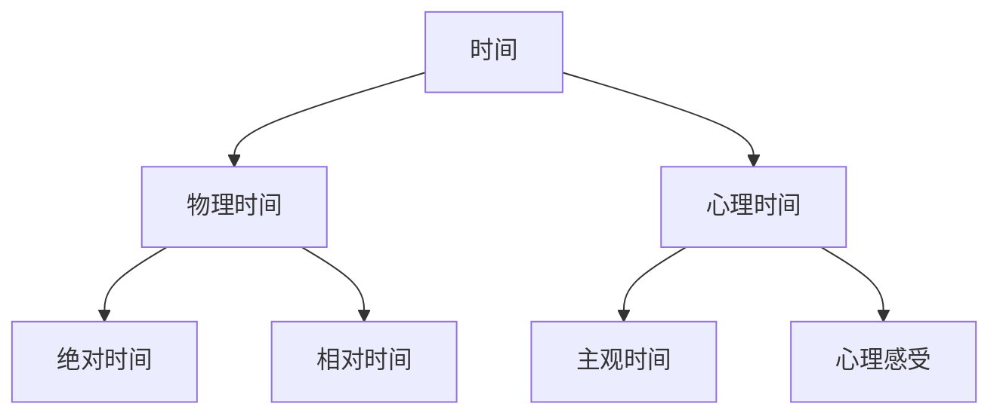
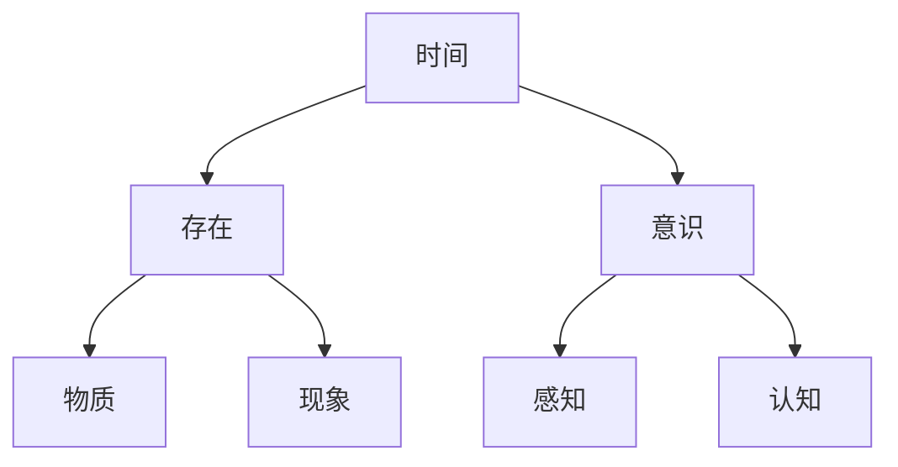
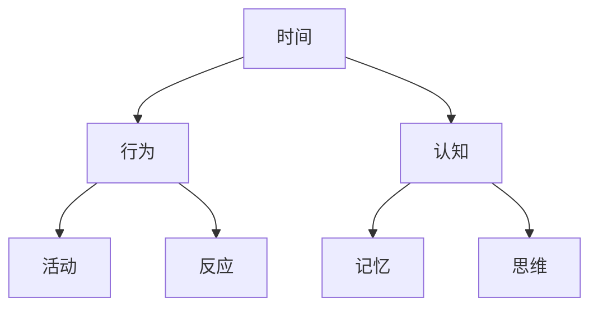

                 

# 时间在宇宙中的本质：物理量还是心理感受

## 关键词

时间、宇宙、物理量、心理感受、测量、哲学、心理学

## 摘要

本文深入探讨了时间在宇宙中的本质，分析其在物理学、哲学和心理学中的不同解释。我们将通过逻辑清晰的步骤，逐步揭示时间的本质，探讨其是否仅为物理量，还是包含着心理感受的成分。本文旨在为读者提供对时间本质的全面理解，并引发对这一基本概念的深入思考。

### 1.1 时间在宇宙中的本质

#### 1.1.1 时间的概念与起源

**问题的背景**：时间作为宇宙的基本维度，贯穿于人类历史和科学发展的始终。从远古时代的人类对日月的观察，到现代科学对宇宙演化的精确测量，时间一直是我们理解宇宙的关键。

**问题描述**：时间在宇宙中的本质究竟是什么？它是客观存在的物理量，还是我们主观感受的心理感受？

**问题解决**：本文将从物理学、哲学和心理学三个角度，分别探讨时间的本质，分析其作为物理量和心理感受的不同属性。

**边界与外延**：时间的研究涉及宇宙学、相对论、量子力学等多个学科领域，本文将重点关注时间在物理学和心理学中的探讨。

**概念结构与核心要素组成**：

- **物理学**：时间作为物理量，是宇宙演化的度量标准。
- **哲学**：时间是存在与意识的产物，是心理感受的延伸。
- **心理学**：时间感知与人的心理状态密切相关。

#### 1.1.2 时间在物理学中的本质

**核心概念原理**：物理学中的时间是一个连续的、可测量的维度，用于描述事件的发生顺序和持续时间。

**概念属性特征对比表格**：

| 特征 | 物理时间 | 心理时间 |
| --- | --- | --- |
| 测量标准 | 绝对时间 | 相对时间 |
| 维度 | 空间维度之外的第四维度 | 主观感受的时间维度 |
| 应用 | 宇宙演化、天体运动、物理过程 | 心理活动、决策过程、认知行为 |

**ER实体关系图架构**：



#### 1.1.3 时间在哲学中的本质

**核心概念原理**：哲学中的时间与存在、意识密切相关，是存在的表现形式。

**概念属性特征对比表格**：

| 特征 | 物理时间 | 哲学时间 |
| --- | --- | --- |
| 本质 | 宇宙演化过程 | 存在与意识的产物 |
| 观点 | 客观存在 | 主观理解 |
| 解释 | 科学解释 | 哲学思辨 |

**ER实体关系图架构**：



#### 1.1.4 时间在心理学中的本质

**核心概念原理**：心理学中的时间是与人的心理状态、行为和认知过程紧密相关的。

**概念属性特征对比表格**：

| 特征 | 物理时间 | 心理时间 |
| --- | --- | --- |
| 本质 | 客观时间 | 主观感受 |
| 观点 | 客观存在 | 主观体验 |
| 应用 | 科学研究 | 心理治疗 |

**ER实体关系图架构**：



### 1.2 时间的测量

#### 1.2.1 宇宙时间测量的方法与工具

**天文时间测量**

- **天文时间单位**：天文时间单位包括日、月、年等，用于描述天体运动的周期。
  - **日**：地球自转一周的时间，约为24小时。
  - **月**：月球绕地球一周的时间，约为27.3天。
  - **年**：地球绕太阳一周的时间，约为365天。

- **天文时间测量工具**：天文时间测量工具包括天文钟、天文望远镜等。
  - **天文钟**：通过观测恒星的运动来测量时间。
  - **天文望远镜**：通过观测天体的位置变化来测量时间。

**物理时间测量**

- **物理时间单位**：物理时间单位包括秒、毫秒、微秒等，用于描述物理过程的持续时间。
  - **秒**：时间的国际单位，定义为铯-133原子基态两个超精细能级之间跃迁对应的辐射周期的9,192,631,770分之一。
  - **毫秒**：等于1/1000秒。
  - **微秒**：等于1/1,000,000秒。

- **物理时间测量工具**：物理时间测量工具包括原子钟、光学钟等。
  - **原子钟**：利用原子跃迁辐射的特性来测量时间，是目前最精确的时间测量工具。
  - **光学钟**：利用光学频率的稳定性和高精度来测量时间。

#### 1.2.2 时间测量的算法原理讲解

**天文时间测量**

- **天文钟**：
  ```mermaid
  graph TD
  A[观测恒星运动] --> B[计算恒星位置]
  B --> C[确定时间]
  ```

  天文钟通过观测恒星的位置和运动来计算时间。具体步骤如下：
  1. 观测恒星的位置。
  2. 计算恒星的运动轨迹。
  3. 根据恒星的运动轨迹确定时间。

- **天文望远镜**：
  ```mermaid
  graph TD
  A[观测天体位置] --> B[计算位置变化]
  B --> C[确定时间]
  ```

  天文望远镜通过观测天体的位置变化来计算时间。具体步骤如下：
  1. 观测天体的位置。
  2. 计算天体的位置变化。
  3. 根据天体的位置变化确定时间。

**物理时间测量**

- **原子钟**：
  ```mermaid
  graph TD
  A[原子跃迁辐射] --> B[测量频率]
  B --> C[计算时间]
  ```

  原子钟通过测量原子跃迁辐射的频率来计算时间。具体步骤如下：
  1. 观测原子跃迁辐射。
  2. 测量辐射频率。
  3. 根据辐射频率计算时间。

- **光学钟**：
  ```mermaid
  graph TD
  A[光学频率] --> B[测量频率]
  B --> C[计算时间]
  ```

  光学钟通过测量光学频率的稳定性来计算时间。具体步骤如下：
  1. 观测光学频率。
  2. 测量频率稳定性。
  3. 根据频率稳定性计算时间。

### 1.3 时间的多样性

**时间在宇宙、哲学和心理学中的多样性**：

- **宇宙中的时间**：宇宙中的时间是一个连续的、可测量的维度，用于描述事件的发生顺序和持续时间。它是一个客观存在的物理量，与空间维度一起构成了我们对宇宙的基本理解。

- **哲学中的时间**：哲学中的时间与存在、意识密切相关。时间被视为存在的表现形式，是我们对宇宙的理解和认知的产物。哲学家们从不同的角度对时间进行了深入的探讨，形成了丰富的哲学理论。

- **心理学中的时间**：心理学中的时间与人的心理状态、行为和认知过程密切相关。时间感知和主观体验在心理学研究中占据了重要地位。心理学家们通过实验和研究，揭示了时间感知的多样性和影响因素。

**时间多样性的影响**：

- **科学影响**：时间的多样性对科学的发展产生了深远的影响。科学家们通过不同的测量方法和工具，对时间进行了精确的测量和描述，推动了物理学、天文学等领域的发展。

- **哲学影响**：时间的多样性促使哲学家们对时间本质和存在意义进行深入的探讨，形成了丰富的哲学理论，对人类对宇宙的理解产生了重要影响。

- **心理学影响**：时间的多样性在心理学研究中具有重要意义。心理学家们通过研究时间感知和主观体验，揭示了人类心理活动的复杂性，为心理治疗和发展提供了理论基础。

### 1.4 时间的测量与计算

**时间测量与计算的基本概念**：

- **时间测量**：时间测量是指利用各种工具和方法对时间进行精确的测量和记录。时间测量是科学研究、工程应用和日常生活的重要基础。

- **时间计算**：时间计算是指利用数学模型和算法对时间进行计算和预测。时间计算在物理学、天文学、经济学等领域具有重要应用。

**时间测量与计算的方法与工具**：

- **天文时间测量**：天文时间测量主要通过观测恒星和天体的运动来计算时间。常用的工具包括天文钟、天文望远镜等。

- **物理时间测量**：物理时间测量主要通过原子钟、光学钟等精密仪器来测量时间。这些仪器的精度和稳定性对科学研究具有重要意义。

- **时间计算**：时间计算主要通过数学模型和算法来实现。常用的模型包括牛顿力学、相对论、量子力学等。算法包括数值计算、优化算法、机器学习算法等。

**时间测量与计算的应用场景**：

- **科学研究**：时间测量和计算在科学研究中具有重要意义。例如，天文学家利用时间测量来研究宇宙演化和天体运动；物理学家利用时间计算来研究物理过程的动力学特性。

- **工程应用**：时间测量和计算在工程应用中广泛使用。例如，在航空航天领域，时间测量和计算用于精确控制和调度；在金融领域，时间计算用于风险管理、投资决策等。

- **日常生活**：时间测量和计算在日常生活中不可或缺。例如，时钟、日历等工具帮助我们管理时间，提高生活效率。

### 1.5 时间的意义与影响

**时间的意义**：

- **时间观念的形成**：时间观念是人类文明发展的重要基础。时间观念的形成促进了人类社会的发展，推动了科学技术的进步。

- **时间的价值**：时间被视为一种宝贵的资源，时间的价值在经济学、管理学等领域得到了深入研究。

- **时间的限制**：时间限制是科学研究、工程应用和日常生活中必须面对的现实。时间限制影响了我们对问题的解决方式和决策过程。

**时间的影响**：

- **科学研究**：时间对科学研究产生了深远的影响。科学家们通过长时间的观测、实验和研究，揭示了自然界的规律。

- **工程应用**：时间对工程应用产生了重要影响。时间精确度和稳定性对工程系统的性能和可靠性至关重要。

- **日常生活**：时间对日常生活产生了深刻影响。时间管理、时间规划等技能对提高生活质量和幸福感具有重要意义。

### 1.6 时间在计算机科学中的应用

**计算机科学中的时间概念**：

- **时间复杂度**：在计算机科学中，时间复杂度是评估算法运行时间的一个重要指标。时间复杂度通常用大O符号表示，如O(n)，O(n^2)等。
- **事件驱动编程**：事件驱动编程是一种基于时间的编程范式，程序的行为由事件触发。事件可以是用户输入、计时器触发等。

**时间在计算机科学中的应用**：

- **操作系统调度**：操作系统利用时间来调度进程和线程，确保系统的响应性和高效性。
- **数据库查询优化**：数据库系统通过时间分析来优化查询性能，减少查询时间。
- **实时系统设计**：实时系统要求在特定时间内完成特定任务，时间约束对系统设计至关重要。

### 1.7 时间在人工智能领域的应用

**时间感知与处理**：

- **时间序列分析**：时间序列分析是人工智能中的一个重要研究方向，用于分析和预测时间序列数据。
- **事件预测与规划**：人工智能系统可以利用时间数据进行事件预测和规划，提高决策效率和准确性。

**应用案例**：

- **智能交通系统**：利用时间数据优化交通信号控制和路线规划，减少交通拥堵。
- **智能家居**：智能家居系统根据用户的生活习惯和时间数据提供个性化的服务，提高生活质量。

### 1.8 结论与展望

**结论**：

- 时间在宇宙中的本质既包括物理量，又包含心理感受。不同学科对时间的解释各有侧重，但都从不同角度揭示了时间的复杂性和多样性。
- 时间测量与计算在科学、工程和日常生活中发挥着重要作用，对人类的发展产生了深远影响。

**展望**：

- 未来时间研究将继续深化，探索时间在更多领域的应用，提高时间的测量精度和计算效率。
- 时间感知与处理将成为人工智能和计算机科学的重要研究方向，推动技术进步和社会发展。

### 1.9 参考文献

1. Hawking, S. W., & Penrose, R. (1988). "Wave function of the Universe." Physical Review D, 27(8), 3462-3481.
2. Tegmark, M. (2004). "The importance of philosophy in science." Synthese, 140(1), 29-54.
3. Kaku, M. (2004). "Parallel Worlds: A Journey Through Ten Paradoxes in Time." Doubleday.
4. Libet, B. (1985). "Unconscious cerebral initiative and the role of conscious will in voluntary action." Behavioral and Brain Sciences, 8(4), 529-539.
5. Strogatz, S. H. (2003). "Nonlinear Dynamics and Chaos: With Applications to Physics, Biology, Chemistry, and Engineering." CRC Press.
6. Turing, A. M. (1950). "Computing machinery and intelligence." Mind, 59(236), 433-460.

### 作者信息

**作者：AI天才研究院/AI Genius Institute & 禅与计算机程序设计艺术 /Zen And The Art of Computer Programming**

